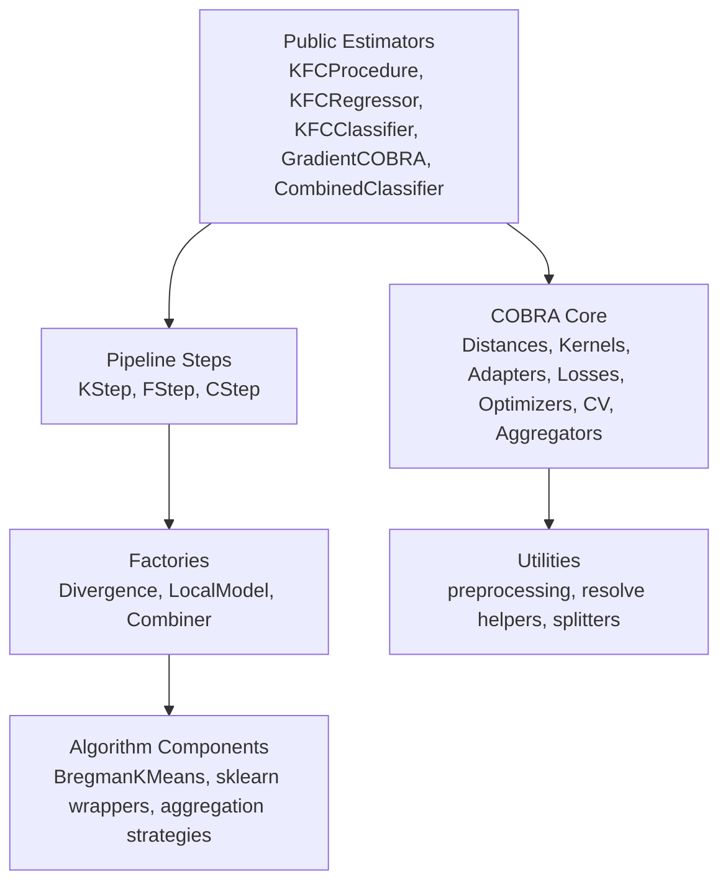
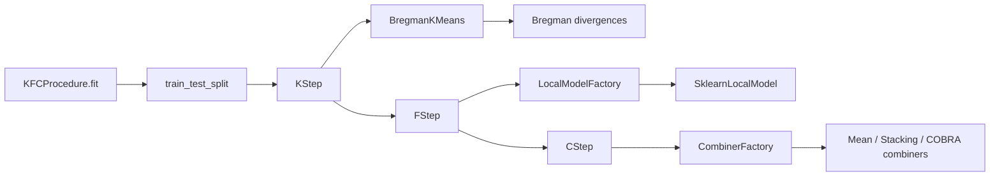
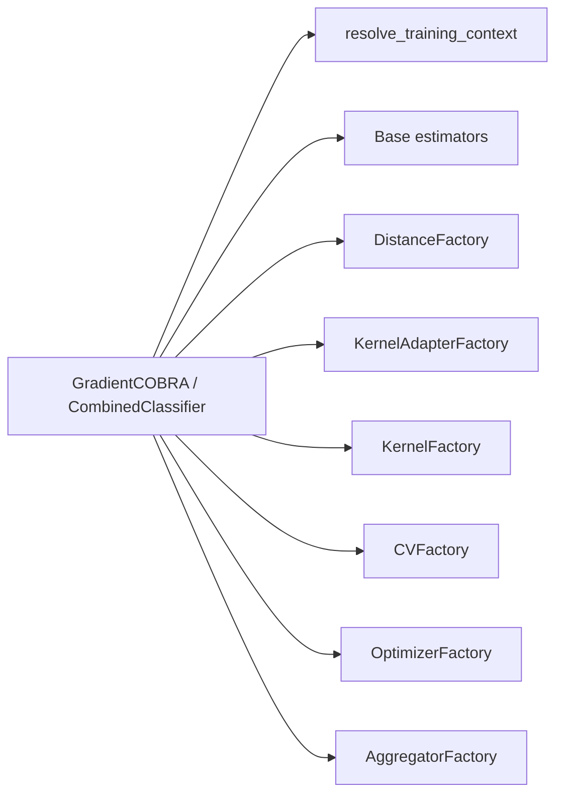

# Architecture Overview


!!! note "Source-grounded documentation"
    This documentation was generated from direct inspection of the provided repository, packaging metadata, notebooks, tests, and thesis files. It documents behavior observed in source code and tests only. Analysis date: **2026-06-12**.


## Package structure

```text
src/kfc_procedure/__init__.py
src/kfc_procedure/cobra/__init__.py
src/kfc_procedure/cobra/combined_classifier.py
src/kfc_procedure/cobra/core/__init__.py
src/kfc_procedure/cobra/core/adapters/__init__.py
src/kfc_procedure/cobra/core/adapters/base.py
src/kfc_procedure/cobra/core/adapters/one_parameter.py
src/kfc_procedure/cobra/core/adapters/two_parameter.py
src/kfc_procedure/cobra/core/aggregators/__init__.py
src/kfc_procedure/cobra/core/aggregators/base.py
src/kfc_procedure/cobra/core/aggregators/weighted_mean.py
src/kfc_procedure/cobra/core/aggregators/weighted_vote.py
src/kfc_procedure/cobra/core/cv/__init__.py
src/kfc_procedure/cobra/core/cv/base.py
src/kfc_procedure/cobra/core/cv/kfold.py
src/kfc_procedure/cobra/core/cv/stratified_kfold.py
src/kfc_procedure/cobra/core/cv/time_series.py
src/kfc_procedure/cobra/core/distances/__init__.py
src/kfc_procedure/cobra/core/distances/base.py
src/kfc_procedure/cobra/core/distances/cosine.py
src/kfc_procedure/cobra/core/distances/euclidean.py
src/kfc_procedure/cobra/core/distances/hamming.py
src/kfc_procedure/cobra/core/distances/manhattan.py
src/kfc_procedure/cobra/core/distances/minkowski.py
src/kfc_procedure/cobra/core/estimators/__init__.py
src/kfc_procedure/cobra/core/estimators/base.py
src/kfc_procedure/cobra/core/estimators/mean_regressor.py
src/kfc_procedure/cobra/core/estimators/sklearn.py
src/kfc_procedure/cobra/core/factory.py
src/kfc_procedure/cobra/core/kernels/__init__.py
src/kfc_procedure/cobra/core/kernels/base.py
src/kfc_procedure/cobra/core/kernels/biweight.py
src/kfc_procedure/cobra/core/kernels/cauchy.py
src/kfc_procedure/cobra/core/kernels/cobra.py
src/kfc_procedure/cobra/core/kernels/epanechnikov.py
src/kfc_procedure/cobra/core/kernels/exponential.py
src/kfc_procedure/cobra/core/kernels/naive.py
src/kfc_procedure/cobra/core/kernels/radial.py
src/kfc_procedure/cobra/core/kernels/reverse_cosh.py
src/kfc_procedure/cobra/core/kernels/triangular.py
src/kfc_procedure/cobra/core/kernels/triweight.py
src/kfc_procedure/cobra/core/losses/__init__.py
src/kfc_procedure/cobra/core/losses/base.py
src/kfc_procedure/cobra/core/losses/hinge.py
src/kfc_procedure/cobra/core/losses/huber.py
src/kfc_procedure/cobra/core/losses/log_loss.py
src/kfc_procedure/cobra/core/losses/mae.py
src/kfc_procedure/cobra/core/losses/mse.py
src/kfc_procedure/cobra/core/losses/quantile.py
src/kfc_procedure/cobra/core/normalizers/__init__.py
src/kfc_procedure/cobra/core/normalizers/base.py
src/kfc_procedure/cobra/core/normalizers/minmax.py
src/kfc_procedure/cobra/core/normalizers/standard.py
src/kfc_procedure/cobra/core/optimizers/__init__.py
src/kfc_procedure/cobra/core/optimizers/_utils.py
src/kfc_procedure/cobra/core/optimizers/base.py
src/kfc_procedure/cobra/core/optimizers/gradient/__init__.py
src/kfc_procedure/cobra/core/optimizers/gradient/adam.py
src/kfc_procedure/cobra/core/optimizers/gradient/base.py
src/kfc_procedure/cobra/core/optimizers/gradient/gd.py
src/kfc_procedure/cobra/core/optimizers/gradient/momentum.py
src/kfc_procedure/cobra/core/optimizers/search/__init__.py
src/kfc_procedure/cobra/core/optimizers/search/base.py
src/kfc_procedure/cobra/core/optimizers/search/search.py
src/kfc_procedure/cobra/core/splitters/__init__.py
src/kfc_procedure/cobra/core/splitters/base.py
src/kfc_procedure/cobra/core/splitters/holdout.py
src/kfc_procedure/cobra/core/splitters/overlap.py
src/kfc_procedure/cobra/core/types.py
src/kfc_procedure/cobra/gradientcobra.py
src/kfc_procedure/cobra/mixcobra.py
src/kfc_procedure/cobra/superlearner.py
src/kfc_procedure/cobra/utils/__init__.py
src/kfc_procedure/cobra/utils/distance.py
src/kfc_procedure/cobra/utils/preprocessing.py
src/kfc_procedure/cobra/utils/resolve.py
src/kfc_procedure/core/__init__.py
src/kfc_procedure/core/clustering/__init__.py
src/kfc_procedure/core/clustering/bregman.py
src/kfc_procedure/core/clustering/divergences/__init__.py
src/kfc_procedure/core/clustering/divergences/base.py
src/kfc_procedure/core/clustering/divergences/euclidean.py
src/kfc_procedure/core/clustering/divergences/gkl.py
src/kfc_procedure/core/clustering/divergences/itakura_saito.py
src/kfc_procedure/core/clustering/divergences/logistic.py
src/kfc_procedure/core/combiner/__init__.py
src/kfc_procedure/core/combiner/base.py
src/kfc_procedure/core/combiner/classification/__init__.py
src/kfc_procedure/core/combiner/classification/combined_classifier.py
src/kfc_procedure/core/combiner/classification/majority_vote.py
src/kfc_procedure/core/combiner/classification/stacking.py
src/kfc_procedure/core/combiner/regression/__init__.py
src/kfc_procedure/core/combiner/regression/gradientcobra.py
src/kfc_procedure/core/combiner/regression/mean.py
src/kfc_procedure/core/combiner/regression/mixcobra.py
src/kfc_procedure/core/combiner/regression/stacking.py
src/kfc_procedure/core/combiner/regression/weighted_mean.py
src/kfc_procedure/core/factory.py
src/kfc_procedure/core/ml/__init__.py
src/kfc_procedure/core/ml/base.py
src/kfc_procedure/core/ml/sklearn.py
src/kfc_procedure/core/steps/__init__.py
src/kfc_procedure/core/steps/cstep.py
src/kfc_procedure/core/steps/fstep.py
src/kfc_procedure/core/steps/kstep.py
src/kfc_procedure/kfc.py
src/kfc_procedure/utils/__init__.py
src/kfc_procedure/utils/logger.py
src/kfc_procedure/utils/resolve.py
```

## Layered architecture



## Main subsystems

| Subsystem | Package path | Responsibility |
|---|---|---|
| Public KFC estimators | `kfc_procedure.kfc` | User-facing fit/predict interface for clusterwise learning |
| KFC steps | `kfc_procedure.core.steps` | Separate clustering, local fitting, and aggregation phases |
| Clustering | `kfc_procedure.core.clustering` | Bregman K-Means and divergence implementations |
| Local model wrappers | `kfc_procedure.core.ml` | scikit-learn-compatible local predictors and factory registration |
| KFC combiners | `kfc_procedure.core.combiner` | Mean, weighted mean, stacking, GradientCOBRA, MixCOBRA, and classification aggregation wrappers |
| COBRA estimators | `kfc_procedure.cobra` | Standalone COBRA-style regression and classification estimators |
| COBRA core | `kfc_procedure.cobra.core` | Low-level reusable components for kernels, distances, losses, optimizers, splitters, and aggregation |
| Utilities | `kfc_procedure.utils`, `kfc_procedure.cobra.utils` | Resolution helpers, preprocessing helpers, logging |

## Dependency relationships

The KFC pipeline depends on the core factories:



The COBRA subsystem is more granular:



## Design philosophy

The implementation favors composition over large monolithic estimators. Each stage is replaceable:

- clustering assumptions are represented by divergence objects;
- local learning is represented by wrapped estimators;
- prediction fusion is represented by combiner objects;
- COBRA optimization is represented by independent distance, kernel, adapter, loss, CV, optimizer, and aggregator components.

This makes the package suitable for thesis experiments and algorithm prototyping where one component is changed while the rest of the pipeline remains stable.
