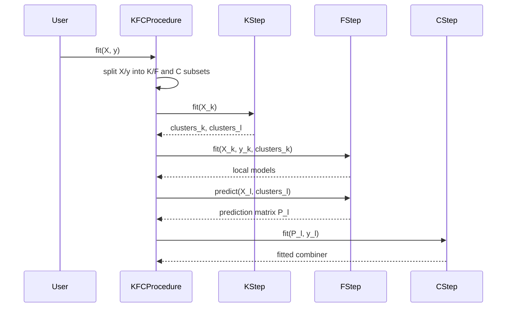

# Functional Workflow

!!! note "Source-grounded documentation"
    This documentation was generated from direct inspection of the provided repository, packaging metadata, notebooks, tests, and thesis files. It documents behavior observed in source code and tests only. Analysis date: **2026-06-12**.

## KFCProcedure training workflow

1. **Input conversion**: `fit(X, y)` converts the input arrays with `np.asarray`.
2. **Internal split**: the data are split into a K/F training subset and a C-step aggregation subset using `train_test_split(test_size=0.5)`. Classification uses stratification.
3. **K-step**: `KStep` fits one `BregmanKMeans` model for each configured divergence.
4. **Cluster assignment**: training and aggregation subsets are assigned to divergence-specific clusters.
5. **F-step**: `FStep` trains one local model for each `(divergence, cluster)` pair.
6. **Prediction matrix generation**: `FStep.predict` produces a matrix with one column per divergence.
7. **C-step**: `CStep` fits the selected combiner on the prediction matrix and aggregation targets.
8. **Fitted estimator state**: the fitted objects are stored as `kstep_`, `fstep_`, and `cstep_`.

## KFCProcedure prediction workflow

1. `predict(X)` checks that `kstep_`, `fstep_`, and `cstep_` exist.
2. `KStep.predict(X)` assigns each sample to one cluster per divergence.
3. `FStep.predict(X, clusters)` selects the corresponding local model for each sample.
4. `CStep.predict(P)` aggregates the divergence-level predictions into the final output.

## COBRA training workflow

The standalone COBRA estimators have two input modes:

- raw feature mode, where base estimators are fitted and used to create prediction-space features;
- precomputed prediction mode, where `as_predictions=True` treats `X` as the prediction-space matrix.

General flow:

1. Resolve training context.
2. Fit or accept base estimator predictions.
3. Build prediction-space matrices.
4. Compute pairwise distance matrices.
5. Convert distances through kernel adapters and kernels.
6. Optimize parameters with cross-validation.
7. Store optimized parameters and training artifacts.
8. Predict by computing weights against calibration data and aggregating targets.

## Data contracts

| Component | Input | Output |
|---|---|---|
| `KStep.fit` | `X` of shape `(n_samples, n_features)` | `clusters_` dict with labels per divergence |
| `KStep.predict` | `X` | dict of labels per divergence |
| `FStep.fit` | `X`, `y`, cluster dictionary | nested `models_` dictionary |
| `FStep.predict` | `X`, cluster dictionary | prediction matrix `(n_samples, n_divergences)` |
| `CStep.fit` | prediction matrix, `y` | fitted `strategy_` |
| `CStep.predict` | prediction matrix | final predictions |
| `GradientCOBRA.fit` | raw features or prediction features | fitted COBRA model with optimized bandwidth |
| `CombinedClassifier.fit` | raw features or prediction features | fitted classifier with weighted vote aggregation |
