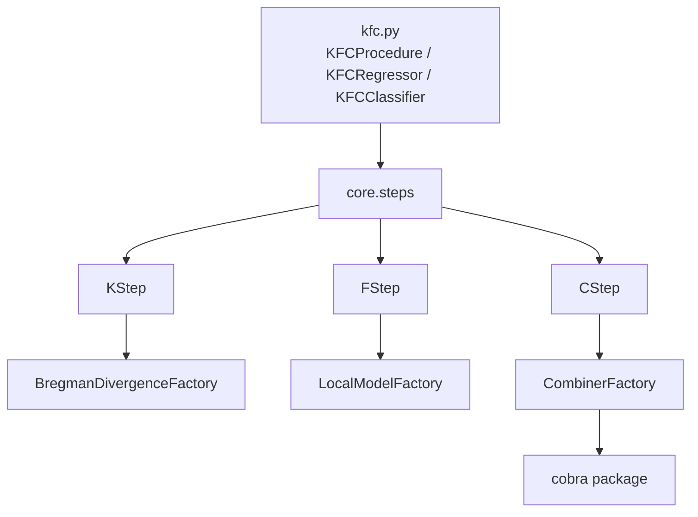

# Developer Overview

This section explains how to maintain, extend, and document `kfc-procedure`.

## Developer architecture



## Development setup

```bash
git clone https://github.com/Ougi3ay/kfc-procedure.git
cd kfc-procedure
python -m venv .venv
source .venv/bin/activate
python -m pip install -e ".[dev,cobra]"
pytest
```

## Design pattern

The codebase is built around registry factories. New components are usually added by:

1. subclassing a base class,
2. decorating the class with a factory registration,
3. importing the module so registration executes,
4. using the registered string in `KFCProcedure`.
