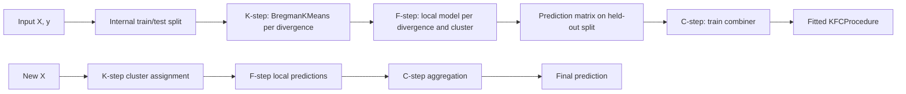

# KFCProcedure Developer Documentation

Version analyzed: **0.1.0**  
Package name: **`kfc-procedure`**  
Import name: **`kfc_procedure`**  
Source layout: **`src/kfc_procedure/`**  
Analysis date: **2026-06-12**

> This documentation is based on direct inspection of the provided source repository, `README.md`, `pyproject.toml`, notebooks, tests, and thesis files. Functionality not present in the implementation is not documented as an available feature. Where behavior is not fully covered by docstrings or tests, the phrase **“Behavior inferred from source code analysis.”** is used.

---

## 1. Project Overview

`kfc_procedure` is a Python package for experimenting with clusterwise supervised learning and COBRA-style ensemble aggregation. The project contains two closely related subsystems:

1. **KFCProcedure**, a three-stage clusterwise learning pipeline composed of:
   - **K-step**: divergence-aware clustering with Bregman K-Means;
   - **F-step**: cluster-local predictive model training;
   - **C-step**: aggregation of divergence-level predictions.
2. **COBRA aggregation components**, including `GradientCOBRA`, `MixCOBRARegressor`, `CombinedClassifier`, and reusable core modules for distances, kernels, losses, splitters, optimizers, estimators, normalizers, and aggregators.

The design philosophy is modular and registry-driven. Components are selected by symbolic names such as `"euclidean"`, `"ridge"`, `"weighted_mean"`, or `"rbf"`, then resolved through factory classes. This makes the codebase suitable for research experiments where clustering divergences, local estimators, kernels, distances, optimizers, and aggregation rules must be swapped independently.

### 1.1 Main features observed in the implementation

| Feature area | Implemented capabilities |
|---|---|
| Clusterwise learning | `KFCProcedure`, `KFCRegressor`, `KFCClassifier`, `KStep`, `FStep`, `CStep` |
| Bregman clustering | `BregmanKMeans` with Euclidean, generalized KL, Itakura-Saito, and logistic divergences |
| Local models | Factory-registered scikit-learn classifiers and regressors wrapped by `SklearnLocalModel` |
| Regression combiners | Mean, weighted mean, stacking regressor, `GradientCOBRA`, `MixCOBRARegressor` |
| Classification combiners | Majority vote, stacking classifier, COBRA-based `CombinedClassifier` |
| COBRA core | Distances, kernels, kernel adapters, losses, splitters, cross-validation, optimizers, aggregators |
| Testing | 116 COBRA core tests pass when the package is importable through `PYTHONPATH=src` or editable installation |

### 1.2 Target users

The package is most appropriate for:

- machine learning researchers studying clusterwise prediction;
- students implementing thesis experiments on heterogeneous datasets;
- developers building scikit-learn-style research estimators;
- practitioners comparing global models, local clusterwise models, and kernel-based aggregation methods.

### 1.3 Supported use cases

The repository supports the following use cases based on the provided notebooks and implementation:

- classification experiments using baseline classifiers, `CombinedClassifier`, and `KFCClassifier`;
- regression experiments using baseline regressors, `GradientCOBRA`, `MixCOBRARegressor`, and KFC regression configurations where runtime allows;
- direct use of modular COBRA components such as distance matrices, kernels, losses, optimizers, and aggregators;
- extension of registered factories with new algorithms.

### 1.4 Important implementation notes

The documentation intentionally records the following source-level observations:

- `KFCClassifier.predict_proba()` is declared, but the current workflow calls `FStep.predict_proba()`, and `FStep` does not implement that method in the inspected source. Therefore, full probability prediction through `KFCClassifier` should be treated as incomplete in version `0.1.0`.
- The README quick-start uses aliases such as `"linear"`, `"logistic"`, and `"stacking"`. In the actual factory registry, observed names include `"linear_regression"`, `"logistic_regression"`, `"stacking_regressor"`, and `"stacking_classifier"`.
- The automated tests cover the COBRA core components. No separate automated tests were observed for the full KFC pipeline classes `BregmanKMeans`, `KStep`, `FStep`, `CStep`, `KFCRegressor`, or `KFCClassifier`.
- Running tests without installing the package produced `ModuleNotFoundError: No module named 'kfc_procedure'`. Running tests with `PYTHONPATH=src` collected 116 tests and all passed.

---

## 2. Installation Guide

### 2.1 Requirements

The package metadata in `pyproject.toml` specifies:

| Requirement | Value observed |
|---|---|
| Python | `>=3.11` |
| Build backend | `setuptools.build_meta` |
| Package layout | `src/` layout |
| Core dependencies | `pandas`, `numpy`, `scikit-learn`, `matplotlib`, `xgboost` |
| COBRA extras | `numba`, `faiss-cpu`, `plotly`, `xgboost`, `pandas`, `numpy`, `scikit-learn`, `matplotlib` |
| Development extras | `pytest`, `build`, `twine`, `jupyter` |
| OS classifier | OS independent |

The local `requirements.txt` additionally lists `gradientcobra`, `numba`, `faiss-cpu`, `pytest`, and `jupyter`.

### 2.2 Install from a local repository

```bash
git clone https://github.com/Ougi3ay/kfc-procedure.git
cd kfc-procedure
python -m pip install -e .
```

### 2.3 Install dependencies from `requirements.txt`

```bash
python -m pip install -r requirements.txt
python -m pip install -e .
```

### 2.4 Install optional dependency groups

```bash
python -m pip install -e ".[cobra]"
python -m pip install -e ".[dev]"
python -m pip install -e ".[all]"
```

### 2.5 Install from PyPI after publication

The project name in `pyproject.toml` is `kfc-procedure`. If a release is published to a package index, installation would use:

```bash
python -m pip install kfc-procedure
```

No claim is made here that a public PyPI release is currently available.

### 2.6 Verify installation

```python
from kfc_procedure.kfc import KFCRegressor, KFCClassifier
from kfc_procedure.cobra import GradientCOBRA, MixCOBRARegressor, CombinedClassifier
from kfc_procedure.core.clustering.divergences.base import BregmanDivergenceFactory

print(BregmanDivergenceFactory.available())
# Expected: ['euclidean', 'gkl', 'is', 'logistic']
```

### 2.7 Run tests

```bash
# After editable installation
python -m pytest

# Alternative without installation
PYTHONPATH=src python -m pytest
```

Observed result with `PYTHONPATH=src`:

```text
116 passed, 1 warning
```

---

## 3. Quick Start

### 3.1 KFC regression

```python
import numpy as np
from kfc_procedure.kfc import KFCRegressor

rng = np.random.default_rng(42)
X = rng.normal(size=(200, 5))
y = 2.0 * X[:, 0] - 0.5 * X[:, 1] + rng.normal(scale=0.1, size=200)

model = KFCRegressor(
    divergences=["euclidean"],
    local_model="ridge",
    combiner="mean",
    n_clusters=3,
    random_state=42,
)

model.fit(X, y)
y_pred = model.predict(X[:5])
print(y_pred)
```

Expected behavior: `fit` trains a Bregman K-Means model for the Euclidean divergence, fits one local ridge model per cluster, trains the mean combiner on held-out prediction features, and returns predictions of shape `(5,)`.

### 3.2 KFC classification

```python
import numpy as np
from kfc_procedure.kfc import KFCClassifier

rng = np.random.default_rng(42)
X = rng.normal(size=(200, 4))
y = (X[:, 0] + X[:, 1] > 0).astype(int)

clf = KFCClassifier(
    divergences=["euclidean"],
    local_model="logistic_regression",
    combiner="majority_vote",
    n_clusters=2,
    random_state=42,
)

clf.fit(X, y)
y_pred = clf.predict(X[:10])
print(y_pred)
```

Expected behavior: `predict` returns class labels. In version `0.1.0`, `predict_proba` is not fully supported through the complete KFC workflow because `FStep.predict_proba()` is not implemented.

### 3.3 GradientCOBRA using precomputed prediction features

```python
import numpy as np
from kfc_procedure.cobra import GradientCOBRA

rng = np.random.default_rng(42)
Z = rng.normal(size=(100, 4))       # prediction-space features
y = Z[:, 0] + rng.normal(scale=0.1, size=100)

model = GradientCOBRA(
    max_iter=20,
    n_cv=3,
    random_state=42,
)
model.fit(Z, y, as_predictions=True)
print(model.bandwidth_)
print(model.predict(Z[:5]))
```

Expected behavior: because `as_predictions=True`, `Z` is treated as the prediction-space matrix directly. The model optimizes a kernel bandwidth by cross-validation and aggregates calibration targets using kernel weights.

### 3.4 CombinedClassifier using precomputed prediction features

```python
import numpy as np
from kfc_procedure.cobra import CombinedClassifier

rng = np.random.default_rng(42)
Z = rng.integers(0, 2, size=(120, 5))
y = (Z[:, 0] == 1).astype(int)

clf = CombinedClassifier(
    max_iter=20,
    n_cv=3,
    random_state=42,
)
clf.fit(Z, y, as_predictions=True)

print(clf.predict(Z[:5]))
print(clf.predict_proba(Z[:5]))
```

Expected behavior: the model uses Hamming distance by default, converts prediction-space distances into kernel weights, and predicts classes through weighted voting.

---

## 4. Architecture Overview

### 4.1 Package structure

```text
kfc_procedure/
├── kfc.py                         # High-level KFCProcedure estimators
├── core/
│   ├── factory.py                 # Generic registry/factory abstraction
│   ├── clustering/                # BregmanKMeans and divergences
│   ├── ml/                        # Local model adapters and sklearn registration
│   ├── steps/                     # KStep, FStep, CStep
│   └── combiner/                  # Regression/classification combiners
├── cobra/
│   ├── gradientcobra.py           # GradientCOBRA regressor
│   ├── mixcobra.py                # MixCOBRA regressor
│   ├── combined_classifier.py     # COBRA-style classifier
│   ├── superlearner.py            # Super learner implementation
│   └── core/
│       ├── adapters/              # Kernel parameter adapters
│       ├── aggregators/           # Weighted mean/vote aggregation
│       ├── cv/                    # K-fold, stratified, time-series CV
│       ├── distances/             # Pairwise distance metrics
│       ├── estimators/            # Estimator factory and sklearn wrappers
│       ├── kernels/               # Kernel functions
│       ├── losses/                # Objective/loss functions
│       ├── normalizers/           # Standard and min-max normalization
│       ├── optimizers/            # Grid and gradient optimizers
│       └── splitters/             # Holdout and overlap splitting
└── utils/
    ├── logger.py                  # Lightweight verbose logger
    └── resolve.py                 # KFC helper resolution functions
```

### 4.2 Layered architecture

| Layer | Modules | Responsibility |
|---|---|---|
| User-facing estimators | `kfc.py`, `cobra/*.py` | Provide scikit-learn-style `fit`/`predict` estimators |
| Workflow layer | `core/steps/` | Separate clustering, local fitting, and aggregation stages |
| Algorithm layer | `core/clustering/`, `core/combiner/`, `cobra/core/` | Implement clustering, distances, kernels, losses, optimizers, and aggregation |
| Factory layer | `core/factory.py`, `cobra/core/factory.py` | Runtime component discovery and instantiation |
| Adapter layer | `core/ml/sklearn.py`, `cobra/core/estimators/sklearn.py` | Wrap scikit-learn estimators behind package interfaces |
| Utility layer | `utils/`, `cobra/utils/` | Logging, preprocessing helpers, estimator fitting, prediction, and training context resolution |

### 4.3 KFCProcedure workflow diagram



### 4.4 COBRA workflow diagram

```mermaid
flowchart LR
    A[Input data] --> B[Training context split]
    B --> C[Base estimator pool]
    C --> D[Prediction-space matrix]
    D --> E[Distance matrix]
    E --> F[Kernel adapter]
    F --> G[Kernel weights]
    G --> H[Cross-validation loss]
    H --> I[Optimizer selects parameters]
    I --> J[Weighted aggregation]
    J --> K[Prediction]
```



### 4.5 Dependency relationships

- `KFCProcedure` composes `KStep`, `FStep`, and `CStep`.
- `KStep` composes `BregmanKMeans` and resolves divergences through `BregmanDivergenceFactory`.
- `FStep` resolves local models through `LocalModelFactory` and stores trained models in a nested dictionary keyed by divergence and cluster.
- `CStep` resolves aggregation strategies through `CombinerFactory`.
- `GradientCOBRA`, `MixCOBRARegressor`, and `CombinedClassifier` compose COBRA core components: distance, kernel, adapter, loss, optimizer, cross-validation, and aggregator.
- Factories provide loose coupling between string configuration and concrete component classes.

---

## 5. API Reference

### 5.1 Main estimator APIs

#### `KFCProcedure`

```python
KFCProcedure(
    divergences,
    local_model,
    combiner,
    divergences_params=None,
    local_model_params=None,
    combiner_params=None,
    task="regression",
    n_clusters=3,
    max_iter=300,
    tol=1e-4,
    verbose=0,
    random_state=None,
)
```

| Parameter | Type | Default | Description |
|---|---|---|---|
| `divergences` | list | required | Divergence names or `BaseBregmanDivergence` instances used by `KStep`. |
| `local_model` | str or model instance | required | Local estimator used by `FStep`. String values are resolved through `LocalModelFactory`. |
| `combiner` | str or combiner instance | required | Aggregation strategy used by `CStep`. |
| `divergences_params` | dict | `None` | Per-divergence parameter dictionary. |
| `local_model_params` | dict | `None` | Parameters forwarded to the local model constructor. |
| `combiner_params` | dict | `None` | Parameters forwarded to the combiner constructor. |
| `task` | `{"regression", "classification"}` | `"regression"` | Controls task validation and factory category checks. |
| `n_clusters` | int | `3` | Number of clusters per divergence model. |
| `max_iter` | int | `300` | Maximum Bregman K-Means iterations. |
| `tol` | float | `1e-4` | Clustering convergence tolerance. |
| `verbose` | int | `0` | Logging level. |
| `random_state` | int or `None` | `None` | Random seed used by splitting and stochastic components. |

**Methods**

```python
fit(X, y)
predict(X)
predict_proba(X)
```

`fit` converts inputs to NumPy arrays, internally splits data into two halves, fits the K-step and F-step on the first split, generates prediction features on the second split, and trains the C-step combiner. `predict` routes samples through fitted K-step, F-step, and C-step components. `predict_proba` is intended for classification, but is incomplete in the current implementation because `FStep.predict_proba()` is not implemented.

#### `KFCRegressor`

`KFCRegressor` subclasses `KFCProcedure` and fixes `task="regression"`.

#### `KFCClassifier`

`KFCClassifier` subclasses `KFCProcedure` and fixes `task="classification"`.

#### `GradientCOBRA`

```python
GradientCOBRA(
    estimators=None,
    estimators_params=None,
    distance="euclidean",
    distance_params=None,
    kernel="rbf",
    kernel_params=None,
    aggregator="weighted_mean",
    aggregator_params=None,
    loss="mse",
    loss_params=None,
    optimizer="grid",
    optimizer_params=None,
    opt_method="grid",
    bandwidth_list=None,
    learning_rate=0.1,
    max_iter=300,
    n_cv=5,
    norm_constant=None,
    n_jobs=-1,
    random_state=None,
)
```

`GradientCOBRA` is a regressor that trains or accepts prediction-space features, computes distances among calibration predictions, optimizes a bandwidth parameter by cross-validation, and aggregates calibration targets through kernel weights.

Default base estimator names observed in source: `linear_regression`, `ridge_cv`, `lasso_cv`, `k_neighbors_regressor`, `random_forest_regressor`, `svr`.

#### `MixCOBRARegressor`

`MixCOBRARegressor` is a regressor that combines input-space distance and prediction-space distance. It supports one-parameter and two-parameter modes through kernel adapters. Behavior inferred from source code analysis.

#### `CombinedClassifier`

`CombinedClassifier` is a classifier that constructs prediction-space representations using a base estimator pool or precomputed predictions, computes pairwise distance with Hamming distance by default, optimizes a bandwidth parameter, and predicts with weighted voting.

Default base estimator names observed in source: `logistic_regression`, `decision_tree_classifier`, `svc`, `k_neighbors_classifier`.

#### `CombinedClassifierFast`

`CombinedClassifierFast` extends `CombinedClassifier` with an optional FAISS path. If `use_faiss=True`, `faiss` is importable, and a FAISS index exists after fitting, prediction uses approximate nearest-neighbor search over prediction-space features. The method `predict_proba(self, X, pred_X)` requires the `pred_X` argument in the current signature.

### 5.2 Factory registries observed at import time

| Factory | Registered names observed |
|---|---|
| `BregmanDivergenceFactory` | `euclidean`, `gkl`, `is`, `logistic` |
| `CombinerFactory` | `combined_classifier`, `gradientcobra`, `majority_vote`, `mean`, `mixcobra`, `stacking_classifier`, `stacking_regressor`, `weighted_mean` |
| `KernelFactory` | `biweight`, `cauchy`, `cobra`, `epanechnikov`, `exponential`, `gaussian`, `naive`, `radial`, `rbf`, `reverse_cosh`, `triangular`, `triweight` |
| `DistanceFactory` | `cosine`, `euclidean`, `hamming`, `l1`, `l2`, `lp`, `manhattan`, `minkowski` |
| `LossFactory` | `cross_entropy`, `hinge`, `huber`, `l1`, `l2`, `log_loss`, `mae`, `mse`, `quantile`, `squared_error` |
| `NormalizerFactory` | `minmax`, `standard`, `zscore` |
| `OptimizerFactory` | `adam`, `gd`, `grid`, `momentum` |
| `SplitterFactory` | `holdout`, `random_holdout`, `split_overlap` |
| `AggregatorFactory` | `weighted_mean`, `weighted_vote`, `wm`, `wv` |
| `KernelAdapterFactory` | `one_parameter`, `two_parameter` |
| `CVFactory` | `kfold`, `stratified_kfold`, `time_series`, `tscv` |
| `LocalModelFactory` | 101 scikit-learn estimator aliases plus `mean_regressor`/`dummy_mean`; use `LocalModelFactory.available()` for the full list at runtime |
| `EstimatorFactory` | 101 scikit-learn estimator aliases plus COBRA native estimators; use `EstimatorFactory.available()` for the full list at runtime |

### 5.3 Complete public API index

The following index is generated from the public classes and public functions found in `src/kfc_procedure`. It is intended for ReadTheDocs or MkDocs publication and can be expanded into per-module pages.

### `kfc_procedure`

**Source:** `src/kfc_procedure/__init__.py`

kfc_procedure

### `kfc_procedure.cobra.combined_classifier`

**Source:** `src/kfc_procedure/cobra/combined_classifier.py`

Combine Classifier Module =========================

#### `CombinedClassifier`

CombineClassifier =================

**Bases:** `ABC, SkBaseEstimator`

**Constructor**

```python
__init__(estimators: List[Union[str, BaseEstimator]] | None = None, estimators_params: Dict[str, Any] | None = None, distance: str = 'hamming', distance_params: Dict[str, Any] | None = None, kernel: str = 'rbf', kernel_params: Dict[str, Any] | None = None, aggregator: str = 'weighted_vote', aggregator_params: Dict[str, Any] | None = None, loss: str = 'mse', loss_params: dict[str, Any] | None = None, optimizer: str = 'grid', optimizer_params: dict[str, Any] | None = None, n_jobs: int = 1, bandwidth_list: np.ndarray | None = None, max_iter: int = 300, n_cv: int = 5, random_state: int | None = None)
```

| Parameter | Type | Default | Description |
| --- | --- | --- | --- |
| estimators | List[Union[str, BaseEstimator]] \| None | None | Constructor parameter stored by the estimator/component and used by the documented implementation. |
| estimators_params | Dict[str, Any] \| None | None | Constructor parameter stored by the estimator/component and used by the documented implementation. |
| distance | str | 'hamming' | Constructor parameter stored by the estimator/component and used by the documented implementation. |
| distance_params | Dict[str, Any] \| None | None | Constructor parameter stored by the estimator/component and used by the documented implementation. |
| kernel | str | 'rbf' | Constructor parameter stored by the estimator/component and used by the documented implementation. |
| kernel_params | Dict[str, Any] \| None | None | Constructor parameter stored by the estimator/component and used by the documented implementation. |
| aggregator | str | 'weighted_vote' | Constructor parameter stored by the estimator/component and used by the documented implementation. |
| aggregator_params | Dict[str, Any] \| None | None | Constructor parameter stored by the estimator/component and used by the documented implementation. |
| loss | str | 'mse' | Constructor parameter stored by the estimator/component and used by the documented implementation. |
| loss_params | dict[str, Any] \| None | None | Constructor parameter stored by the estimator/component and used by the documented implementation. |
| optimizer | str | 'grid' | Constructor parameter stored by the estimator/component and used by the documented implementation. |
| optimizer_params | dict[str, Any] \| None | None | Constructor parameter stored by the estimator/component and used by the documented implementation. |
| n_jobs | int | 1 | Constructor parameter stored by the estimator/component and used by the documented implementation. |
| bandwidth_list | np.ndarray \| None | None | Constructor parameter stored by the estimator/component and used by the documented implementation. |
| max_iter | int | 300 | Constructor parameter stored by the estimator/component and used by the documented implementation. |
| n_cv | int | 5 | Constructor parameter stored by the estimator/component and used by the documented implementation. |
| random_state | int \| None | None | Constructor parameter stored by the estimator/component and used by the documented implementation. |

**Public methods**

| Method | Purpose | Returns | Raises / errors |
| --- | --- | --- | --- |
| `kappa_cross_validation_error(params)` | No module-level description is provided in the source. | Documented in method docstring or inferred from return statements. | See method body for explicit validation; sklearn validation errors may also be raised. |
| `fit(X, y, X_l = None, y_l = None, split_ratio = 0.5, overlap = False, as_predictions = False)` | Fit the CombineClassifier model. | Documented in method docstring or inferred from return statements. | See method body for explicit validation; sklearn validation errors may also be raised. |
| `predict(X)` | No module-level description is provided in the source. | Documented in method docstring or inferred from return statements. | See method body for explicit validation; sklearn validation errors may also be raised. |
| `predict_proba(X)` | No module-level description is provided in the source. | Documented in method docstring or inferred from return statements. | See method body for explicit validation; sklearn validation errors may also be raised. |

#### `CombinedClassifierFast`

No module-level description is provided in the source.

**Bases:** `CombinedClassifier`

**Constructor**

```python
__init__(use_faiss: bool = False, faiss_k: int | None = None, **kwargs)
```

| Parameter | Type | Default | Description |
| --- | --- | --- | --- |
| use_faiss | bool | False | Constructor parameter stored by the estimator/component and used by the documented implementation. |
| faiss_k | int \| None | None | Constructor parameter stored by the estimator/component and used by the documented implementation. |
| kwargs | dict | — | Additional positional/keyword arguments forwarded by the implementation. |

**Public methods**

| Method | Purpose | Returns | Raises / errors |
| --- | --- | --- | --- |
| `fit(X, y, X_l = None, y_l = None, split_ratio = 0.5, overlap = False, as_predictions = False)` | No module-level description is provided in the source. | Documented in method docstring or inferred from return statements. | See method body for explicit validation; sklearn validation errors may also be raised. |
| `predict(X)` | No module-level description is provided in the source. | Documented in method docstring or inferred from return statements. | See method body for explicit validation; sklearn validation errors may also be raised. |
| `predict_proba(X, pred_X)` | No module-level description is provided in the source. | Documented in method docstring or inferred from return statements. | See method body for explicit validation; sklearn validation errors may also be raised. |

### `kfc_procedure.cobra.core`

**Source:** `src/kfc_procedure/cobra/core/__init__.py`

COBRA core module.

### `kfc_procedure.cobra.core.adapters`

**Source:** `src/kfc_procedure/cobra/core/adapters/__init__.py`

Kernel Adapter module for COBRA framework.

### `kfc_procedure.cobra.core.adapters.base`

**Source:** `src/kfc_procedure/cobra/core/adapters/base.py`

Kernel Adapter module for COBRA framework.

#### `BaseKernelAdapter`

Abstract base class for kernel transformation adapters.

**Bases:** `ABC`

**Constructor**

```python
__init__(**kwargs)
```

| Parameter | Type | Default | Description |
| --- | --- | --- | --- |
| kwargs | dict | — | Additional positional/keyword arguments forwarded by the implementation. |

**Public methods**

| Method | Purpose | Returns | Raises / errors |
| --- | --- | --- | --- |
| `set_params(**params)` | Update adapter parameters. | Documented in method docstring or inferred from return statements. | See method body for explicit validation; sklearn validation errors may also be raised. |
| `get_params(deep: bool = True) -> Dict[str, Any]` | Retrieve adapter parameters. | Documented in method docstring or inferred from return statements. | See method body for explicit validation; sklearn validation errors may also be raised. |
| `parameter_vector() -> np.ndarray` | Convert parameters into numeric vector form. | Documented in method docstring or inferred from return statements. | See method body for explicit validation; sklearn validation errors may also be raised. |
| `transform(*distances) -> np.ndarray` | Transform one or more distance matrices. | Documented in method docstring or inferred from return statements. | See method body for explicit validation; sklearn validation errors may also be raised. |

#### `KernelAdapterFactory`

Factory for kernel adapters.

**Bases:** `BaseFactory`

**Constructor**

```python
KernelAdapterFactory()
```

This class exposes no explicit public constructor parameters in the source.

### `kfc_procedure.cobra.core.adapters.one_parameter`

**Source:** `src/kfc_procedure/cobra/core/adapters/one_parameter.py`

One parameter kernel adapter. This adapter applies a single scalar parameter to a distance matrix: D' = bandwidth * D This is commonly used as a bandwidth control mechanism in kernel construction (e.g., Gaussian kernels). The bandwidth parameter can be learned or tuned to optimize COBRA performance.

#### `OneParameterKernelAdapter`

Simple scaling kernel adapter.

**Bases:** `BaseKernelAdapter`

**Constructor**

```python
__init__(bandwidth: float = 1.0)
```

| Parameter | Type | Default | Description |
| --- | --- | --- | --- |
| bandwidth | float | 1.0 | Constructor parameter stored by the estimator/component and used by the documented implementation. |

**Public methods**

| Method | Purpose | Returns | Raises / errors |
| --- | --- | --- | --- |
| `transform(*distances) -> np.ndarray` | Scale a single distance matrix. | Documented in method docstring or inferred from return statements. | See method body for explicit validation; sklearn validation errors may also be raised. |

### `kfc_procedure.cobra.core.adapters.two_parameter`

**Source:** `src/kfc_procedure/cobra/core/adapters/two_parameter.py`

Two parameter kernel adapter for COBRA. This adapter allows linear combinations of two distance matrices, enablingflexible fusion of multiple distance representations in the COBRA pipeline.

#### `TwoParameterKernelAdapter`

Linear combination kernel adapter.

**Bases:** `BaseKernelAdapter`

**Constructor**

```python
__init__(alpha: float = 1.0, beta: float = 0.0)
```

| Parameter | Type | Default | Description |
| --- | --- | --- | --- |
| alpha | float | 1.0 | Constructor parameter stored by the estimator/component and used by the documented implementation. |
| beta | float | 0.0 | Constructor parameter stored by the estimator/component and used by the documented implementation. |

**Public methods**

| Method | Purpose | Returns | Raises / errors |
| --- | --- | --- | --- |
| `transform(*distances) -> np.ndarray` | Combine one or two distance matrices. | Documented in method docstring or inferred from return statements. | See method body for explicit validation; sklearn validation errors may also be raised. |

### `kfc_procedure.cobra.core.aggregators`

**Source:** `src/kfc_procedure/cobra/core/aggregators/__init__.py`

Aggregation package for COBRA framework.

### `kfc_procedure.cobra.core.aggregators.base`

**Source:** `src/kfc_procedure/cobra/core/aggregators/base.py`

No module-level description is provided in the source.

#### `BaseAggregator`

Base class for COBRA aggregation strategies.

**Bases:** `ABC`

**Constructor**

```python
BaseAggregator()
```

This class exposes no explicit public constructor parameters in the source.

**Public methods**

| Method | Purpose | Returns | Raises / errors |
| --- | --- | --- | --- |
| `aggregate(values: np.ndarray, weights: np.ndarray \| None = None, **kwargs)` | Aggregate a single set of estimator predictions. | Documented in method docstring or inferred from return statements. | See method body for explicit validation; sklearn validation errors may also be raised. |
| `aggregate_matrix(values: np.ndarray, weights: np.ndarray, fallback: float \| None = None, **kwargs) -> np.ndarray` | Batch aggregation over multiple queries. | Documented in method docstring or inferred from return statements. | See method body for explicit validation; sklearn validation errors may also be raised. |
| `aggregate_proba(values: np.ndarray, weights: np.ndarray \| None = None, classes: np.ndarray \| None = None, **kwargs)` | Aggregate probabilistic outputs for classification tasks. | Documented in method docstring or inferred from return statements. | See method body for explicit validation; sklearn validation errors may also be raised. |

#### `AggregatorFactory`

No module-level description is provided in the source.

**Bases:** `BaseFactory`

**Constructor**

```python
AggregatorFactory()
```

This class exposes no explicit public constructor parameters in the source.

### `kfc_procedure.cobra.core.aggregators.weighted_mean`

**Source:** `src/kfc_procedure/cobra/core/aggregators/weighted_mean.py`

Weighted Mean Aggregator (COBRA)

#### `WeightedMeanAggregator`

Weighted mean aggregation (regression).

**Bases:** `BaseAggregator`

**Constructor**

```python
WeightedMeanAggregator()
```

This class exposes no explicit public constructor parameters in the source.

**Public methods**

| Method | Purpose | Returns | Raises / errors |
| --- | --- | --- | --- |
| `aggregate(values, weights = None, fallback = None, **kwargs)` | No module-level description is provided in the source. | Documented in method docstring or inferred from return statements. | See method body for explicit validation; sklearn validation errors may also be raised. |
| `aggregate_proba(values, weights = None, classes = None, **kwargs)` | Optional: only meaningful if values already represent probabilities. | Documented in method docstring or inferred from return statements. | See method body for explicit validation; sklearn validation errors may also be raised. |

### `kfc_procedure.cobra.core.aggregators.weighted_vote`

**Source:** `src/kfc_procedure/cobra/core/aggregators/weighted_vote.py`

Weighted Vote Aggregator (COBRA)

#### `WeightedVoteAggregator`

Fully vectorized weighted majority vote.

**Bases:** `BaseAggregator`

**Constructor**

```python
WeightedVoteAggregator()
```

This class exposes no explicit public constructor parameters in the source.

**Public methods**

| Method | Purpose | Returns | Raises / errors |
| --- | --- | --- | --- |
| `aggregate(values, weights = None, **kwargs)` | No module-level description is provided in the source. | Documented in method docstring or inferred from return statements. | See method body for explicit validation; sklearn validation errors may also be raised. |
| `aggregate_matrix(values, weights, **kwargs)` | Batch weighted voting. | Documented in method docstring or inferred from return statements. | See method body for explicit validation; sklearn validation errors may also be raised. |
| `aggregate_proba(values, weights = None, classes = None, **kwargs)` | No module-level description is provided in the source. | Documented in method docstring or inferred from return statements. | See method body for explicit validation; sklearn validation errors may also be raised. |
| `aggregate_proba_batch(values, weights, classes = None, **kwargs)` | No module-level description is provided in the source. | Documented in method docstring or inferred from return statements. | See method body for explicit validation; sklearn validation errors may also be raised. |

### `kfc_procedure.cobra.core.cv`

**Source:** `src/kfc_procedure/cobra/core/cv/__init__.py`

Cross-validation module for COBRA framework.

### `kfc_procedure.cobra.core.cv.base`

**Source:** `src/kfc_procedure/cobra/core/cv/base.py`

Cross-validation module for COBRA framework.

#### `BaseCrossValidator`

Abstract base class for cross-validation strategies.

**Bases:** `ABC`

**Constructor**

```python
BaseCrossValidator()
```

This class exposes no explicit public constructor parameters in the source.

**Public methods**

| Method | Purpose | Returns | Raises / errors |
| --- | --- | --- | --- |
| `split(x: ArrayLike, y: ArrayLike, groups: ArrayLike \| None = None) -> Iterator[SplitIndices]` | Generate cross-validation splits. | Documented in method docstring or inferred from return statements. | See method body for explicit validation; sklearn validation errors may also be raised. |
| `get_n_splits() -> int` | Return number of cross-validation folds. | Documented in method docstring or inferred from return statements. | See method body for explicit validation; sklearn validation errors may also be raised. |

#### `CVFactory`

Factory for cross-validation strategies.

**Bases:** `BaseFactory`

**Constructor**

```python
CVFactory()
```

This class exposes no explicit public constructor parameters in the source.

### `kfc_procedure.cobra.core.cv.kfold`

**Source:** `src/kfc_procedure/cobra/core/cv/kfold.py`

K-Fold cross-validation splitter.

#### `KFoldCV`

K-Fold Cross-Validation.

**Bases:** `BaseCrossValidator`

**Constructor**

```python
__init__(n_splits: int = 5, shuffle: bool = True, random_state: int | None = None)
```

| Parameter | Type | Default | Description |
| --- | --- | --- | --- |
| n_splits | int | 5 | Constructor parameter stored by the estimator/component and used by the documented implementation. |
| shuffle | bool | True | Constructor parameter stored by the estimator/component and used by the documented implementation. |
| random_state | int \| None | None | Constructor parameter stored by the estimator/component and used by the documented implementation. |

**Public methods**

| Method | Purpose | Returns | Raises / errors |
| --- | --- | --- | --- |
| `get_n_splits(x: ArrayLike \| None = None, y: ArrayLike \| None = None) -> int` | No module-level description is provided in the source. | Documented in method docstring or inferred from return statements. | See method body for explicit validation; sklearn validation errors may also be raised. |
| `split(x: ArrayLike, y: ArrayLike) -> Iterator[SplitIndices]` | No module-level description is provided in the source. | Documented in method docstring or inferred from return statements. | See method body for explicit validation; sklearn validation errors may also be raised. |

### `kfc_procedure.cobra.core.cv.stratified_kfold`

**Source:** `src/kfc_procedure/cobra/core/cv/stratified_kfold.py`

Stratified K-Fold Cross Validation.

#### `StratifiedKFoldCV`

Stratified K-Fold Cross Validation.

**Bases:** `BaseCrossValidator`

**Constructor**

```python
__init__(n_splits: int = 5, random_state: int | None = None)
```

| Parameter | Type | Default | Description |
| --- | --- | --- | --- |
| n_splits | int | 5 | Constructor parameter stored by the estimator/component and used by the documented implementation. |
| random_state | int \| None | None | Constructor parameter stored by the estimator/component and used by the documented implementation. |

**Public methods**

| Method | Purpose | Returns | Raises / errors |
| --- | --- | --- | --- |
| `split(x: ArrayLike, y: ArrayLike)` | No module-level description is provided in the source. | Documented in method docstring or inferred from return statements. | See method body for explicit validation; sklearn validation errors may also be raised. |
| `get_n_splits() -> int` | No module-level description is provided in the source. | Documented in method docstring or inferred from return statements. | See method body for explicit validation; sklearn validation errors may also be raised. |

### `kfc_procedure.cobra.core.cv.time_series`

**Source:** `src/kfc_procedure/cobra/core/cv/time_series.py`

Time Series Cross Validation.

#### `TimeSeriesCV`

Time Series Cross Validation.

**Bases:** `BaseCrossValidator`

**Constructor**

```python
__init__(n_splits: int = 5, test_size: int | None = None)
```

| Parameter | Type | Default | Description |
| --- | --- | --- | --- |
| n_splits | int | 5 | Constructor parameter stored by the estimator/component and used by the documented implementation. |
| test_size | int \| None | None | Constructor parameter stored by the estimator/component and used by the documented implementation. |

**Public methods**

| Method | Purpose | Returns | Raises / errors |
| --- | --- | --- | --- |
| `split(x: ArrayLike, y: ArrayLike)` | No module-level description is provided in the source. | Documented in method docstring or inferred from return statements. | See method body for explicit validation; sklearn validation errors may also be raised. |
| `get_n_splits() -> int` | No module-level description is provided in the source. | Documented in method docstring or inferred from return statements. | See method body for explicit validation; sklearn validation errors may also be raised. |

### `kfc_procedure.cobra.core.distances.base`

**Source:** `src/kfc_procedure/cobra/core/distances/base.py`

Distance module for COBRA framework.

#### `BaseDistance`

Abstract base class for all distance metrics.

**Bases:** `ABC`

**Constructor**

```python
__init__(**kwargs)
```

| Parameter | Type | Default | Description |
| --- | --- | --- | --- |
| kwargs | dict | — | Additional positional/keyword arguments forwarded by the implementation. |

**Public methods**

| Method | Purpose | Returns | Raises / errors |
| --- | --- | --- | --- |
| `set_params(**params)` | Set parameters for the distance function. | Documented in method docstring or inferred from return statements. | See method body for explicit validation; sklearn validation errors may also be raised. |
| `get_params(deep: bool = True)` | Get parameters of the distance function. | Documented in method docstring or inferred from return statements. | See method body for explicit validation; sklearn validation errors may also be raised. |
| `matrix(x: np.ndarray, y: np.ndarray) -> np.ndarray` | Compute pairwise distance matrix between two datasets. | Documented in method docstring or inferred from return statements. | See method body for explicit validation; sklearn validation errors may also be raised. |

#### `DistanceFactory`

Factory class for distance metrics.

**Bases:** `BaseFactory`

**Constructor**

```python
DistanceFactory()
```

This class exposes no explicit public constructor parameters in the source.

### `kfc_procedure.cobra.core.distances.cosine`

**Source:** `src/kfc_procedure/cobra/core/distances/cosine.py`

Cosine distance implementation for COBRA framework.

#### `CosineDistance`

Cosine distance metric.

**Bases:** `BaseDistance`

**Constructor**

```python
CosineDistance()
```

This class exposes no explicit public constructor parameters in the source.

**Public methods**

| Method | Purpose | Returns | Raises / errors |
| --- | --- | --- | --- |
| `matrix(x: np.ndarray, y: np.ndarray) -> np.ndarray` | Compute pairwise cosine distance matrix. | Documented in method docstring or inferred from return statements. | See method body for explicit validation; sklearn validation errors may also be raised. |

### `kfc_procedure.cobra.core.distances.euclidean`

**Source:** `src/kfc_procedure/cobra/core/distances/euclidean.py`

Euclidean distance implementation for COBRA framework.

#### `EuclideanDistance`

Euclidean (L2) distance metric.

**Bases:** `BaseDistance`

**Constructor**

```python
EuclideanDistance()
```

This class exposes no explicit public constructor parameters in the source.

**Public methods**

| Method | Purpose | Returns | Raises / errors |
| --- | --- | --- | --- |
| `matrix(x: np.ndarray, y: np.ndarray) -> np.ndarray` | Compute pairwise Euclidean distance matrix. | Documented in method docstring or inferred from return statements. | See method body for explicit validation; sklearn validation errors may also be raised. |

### `kfc_procedure.cobra.core.distances.hamming`

**Source:** `src/kfc_procedure/cobra/core/distances/hamming.py`

Hamming distance implementation for COBRA framework.

**Public functions**

| Function | Purpose |
| --- | --- |
| `hamming_matrix_numba(x: np.ndarray, y: np.ndarray) -> np.ndarray` | Compute pairwise Hamming distance using Numba acceleration. |

#### `HammingDistance`

Hamming distance metric.

**Bases:** `BaseDistance`

**Constructor**

```python
HammingDistance()
```

This class exposes no explicit public constructor parameters in the source.

**Public methods**

| Method | Purpose | Returns | Raises / errors |
| --- | --- | --- | --- |
| `matrix(x: np.ndarray, y: np.ndarray) -> np.ndarray` | Compute pairwise Hamming distance matrix. | Documented in method docstring or inferred from return statements. | See method body for explicit validation; sklearn validation errors may also be raised. |

### `kfc_procedure.cobra.core.distances.manhattan`

**Source:** `src/kfc_procedure/cobra/core/distances/manhattan.py`

Manhattan (L1) distance implementation for COBRA framework.

#### `ManhattanDistance`

Manhattan (L1) distance metric.

**Bases:** `BaseDistance`

**Constructor**

```python
ManhattanDistance()
```

This class exposes no explicit public constructor parameters in the source.

**Public methods**

| Method | Purpose | Returns | Raises / errors |
| --- | --- | --- | --- |
| `matrix(x: np.ndarray, y: np.ndarray) -> np.ndarray` | Compute pairwise Manhattan distance matrix. | Documented in method docstring or inferred from return statements. | See method body for explicit validation; sklearn validation errors may also be raised. |

### `kfc_procedure.cobra.core.distances.minkowski`

**Source:** `src/kfc_procedure/cobra/core/distances/minkowski.py`

Minkowski distance implementation for COBRA framework.

#### `MinkowskiDistance`

Minkowski (Lp) distance metric.

**Bases:** `BaseDistance`

**Constructor**

```python
__init__(p: float = 3, **kwargs)
```

| Parameter | Type | Default | Description |
| --- | --- | --- | --- |
| p | float | 3 | Constructor parameter stored by the estimator/component and used by the documented implementation. |
| kwargs | dict | — | Additional positional/keyword arguments forwarded by the implementation. |

**Public methods**

| Method | Purpose | Returns | Raises / errors |
| --- | --- | --- | --- |
| `matrix(x: np.ndarray, y: np.ndarray) -> np.ndarray` | Compute pairwise Minkowski distance matrix. | Documented in method docstring or inferred from return statements. | See method body for explicit validation; sklearn validation errors may also be raised. |

### `kfc_procedure.cobra.core.estimators`

**Source:** `src/kfc_procedure/cobra/core/estimators/__init__.py`

Estimator module for COBRA framework.

### `kfc_procedure.cobra.core.estimators.base`

**Source:** `src/kfc_procedure/cobra/core/estimators/base.py`

Base estimator interface and factory for COBRA-style learning systems.

#### `BaseEstimator`

Abstract base class for all COBRA estimators.

**Bases:** `ABC`

**Constructor**

```python
BaseEstimator()
```

This class exposes no explicit public constructor parameters in the source.

**Public methods**

| Method | Purpose | Returns | Raises / errors |
| --- | --- | --- | --- |
| `fit(x: np.ndarray, y: np.ndarray, **kwargs) -> 'BaseEstimator'` | Fit the estimator to training data. | Documented in method docstring or inferred from return statements. | See method body for explicit validation; sklearn validation errors may also be raised. |
| `predict(x: np.ndarray, **kwargs) -> np.ndarray` | Generate predictions for input samples. | Documented in method docstring or inferred from return statements. | See method body for explicit validation; sklearn validation errors may also be raised. |

#### `EstimatorFactory`

Registry-based factory for estimator classes.

**Bases:** `BaseFactory`

**Constructor**

```python
EstimatorFactory()
```

This class exposes no explicit public constructor parameters in the source.

### `kfc_procedure.cobra.core.estimators.mean_regressor`

**Source:** `src/kfc_procedure/cobra/core/estimators/mean_regressor.py`

Mean Regressor implementation for regression tasks.

#### `MeanRegressor`

Mean baseline regressor.

**Bases:** `BaseEstimator`

**Constructor**

```python
__init__() -> None
```

This class exposes no explicit public constructor parameters in the source.

**Public methods**

| Method | Purpose | Returns | Raises / errors |
| --- | --- | --- | --- |
| `fit(x: np.ndarray, y: np.ndarray, **kwargs) -> 'MeanRegressor'` | Fit the model by computing the mean of y. | Documented in method docstring or inferred from return statements. | See method body for explicit validation; sklearn validation errors may also be raised. |
| `predict(x: np.ndarray, **kwargs) -> np.ndarray` | Predict constant mean value for all inputs. | Documented in method docstring or inferred from return statements. | See method body for explicit validation; sklearn validation errors may also be raised. |

### `kfc_procedure.cobra.core.estimators.sklearn`

**Source:** `src/kfc_procedure/cobra/core/estimators/sklearn.py`

Sklearn estimator adapter for COBRA framework.

**Public functions**

| Function | Purpose |
| --- | --- |
| `register_all_sklearn_estimators(factory)` | Register all compatible sklearn estimators into COBRA factory. |

#### `SklearnEstimator`

Wrapper for sklearn estimators to make them compatible with the COBRA BaseEstimator interface.

**Bases:** `BaseEstimator`

**Constructor**

```python
__init__(estimator_cls: Type[SkBaseEstimator], **kwargs)
```

| Parameter | Type | Default | Description |
| --- | --- | --- | --- |
| estimator_cls | Type[SkBaseEstimator] | — | Constructor parameter stored by the estimator/component and used by the documented implementation. |
| kwargs | dict | — | Additional positional/keyword arguments forwarded by the implementation. |

**Public methods**

| Method | Purpose | Returns | Raises / errors |
| --- | --- | --- | --- |
| `fit(x, y)` | No module-level description is provided in the source. | Documented in method docstring or inferred from return statements. | See method body for explicit validation; sklearn validation errors may also be raised. |
| `predict(x)` | No module-level description is provided in the source. | Documented in method docstring or inferred from return statements. | See method body for explicit validation; sklearn validation errors may also be raised. |
| `predict_proba(x)` | No module-level description is provided in the source. | Documented in method docstring or inferred from return statements. | See method body for explicit validation; sklearn validation errors may also be raised. |
| `get_params(deep: bool = True)` | No module-level description is provided in the source. | Documented in method docstring or inferred from return statements. | See method body for explicit validation; sklearn validation errors may also be raised. |
| `set_params(**params)` | No module-level description is provided in the source. | Documented in method docstring or inferred from return statements. | See method body for explicit validation; sklearn validation errors may also be raised. |

### `kfc_procedure.cobra.core.factory`

**Source:** `src/kfc_procedure/cobra/core/factory.py`

Factory infrastructure for dynamic component registration and instantiation.

#### `BaseFactory`

Abstract registry-based factory.

**Bases:** `ABC`

**Constructor**

```python
BaseFactory()
```

This class exposes no explicit public constructor parameters in the source.

**Public methods**

| Method | Purpose | Returns | Raises / errors |
| --- | --- | --- | --- |
| `register(cls, *names, categories: Optional[Set[str] \| str] = None, **metadata)` | Register a class under one or more names. | Documented in method docstring or inferred from return statements. | See method body for explicit validation; sklearn validation errors may also be raised. |
| `create(cls, name: str, **kwargs) -> Any` | Instantiate a registered implementation. | Documented in method docstring or inferred from return statements. | See method body for explicit validation; sklearn validation errors may also be raised. |
| `available(cls) -> List[str]` | Return all registered names. | Documented in method docstring or inferred from return statements. | See method body for explicit validation; sklearn validation errors may also be raised. |
| `contains(cls, name: str) -> bool` | Check whether a name is registered. | Documented in method docstring or inferred from return statements. | See method body for explicit validation; sklearn validation errors may also be raised. |
| `available_categories(cls) -> Set[str]` | Return all registered categories. | Documented in method docstring or inferred from return statements. | See method body for explicit validation; sklearn validation errors may also be raised. |
| `available_by_category(cls, category: str) -> List[str]` | Return registered names belonging to a category. | Documented in method docstring or inferred from return statements. | See method body for explicit validation; sklearn validation errors may also be raised. |
| `info(cls, name: str) -> Dict[str, Any]` | Return metadata associated with a registered implementation. | Documented in method docstring or inferred from return statements. | See method body for explicit validation; sklearn validation errors may also be raised. |
| `find_by_class(cls, target_cls: Type) -> List[str]` | Find registration names associated with a class. | Documented in method docstring or inferred from return statements. | See method body for explicit validation; sklearn validation errors may also be raised. |
| `supports(cls, name: str, category: str) -> bool` | Determine whether a registered implementation belongs to a category. | Documented in method docstring or inferred from return statements. | See method body for explicit validation; sklearn validation errors may also be raised. |

### `kfc_procedure.cobra.core.kernels`

**Source:** `src/kfc_procedure/cobra/core/kernels/__init__.py`

Kernel module for COBRA framework.

### `kfc_procedure.cobra.core.kernels.base`

**Source:** `src/kfc_procedure/cobra/core/kernels/base.py`

Kernel module for COBRA framework.

#### `BaseKernel`

Abstract base class for kernel functions.

**Bases:** `ABC`

**Constructor**

```python
__init__(**kwargs)
```

| Parameter | Type | Default | Description |
| --- | --- | --- | --- |
| kwargs | dict | — | Additional positional/keyword arguments forwarded by the implementation. |

**Public methods**

| Method | Purpose | Returns | Raises / errors |
| --- | --- | --- | --- |
| `set_params(**params) -> 'BaseKernel'` | Update kernel hyperparameters. | Documented in method docstring or inferred from return statements. | See method body for explicit validation; sklearn validation errors may also be raised. |
| `get_params(deep: bool = True) -> Dict[str, Any]` | Retrieve kernel parameters. | Documented in method docstring or inferred from return statements. | See method body for explicit validation; sklearn validation errors may also be raised. |
| `is_continuous() -> bool` | Check whether kernel is continuous. | Documented in method docstring or inferred from return statements. | See method body for explicit validation; sklearn validation errors may also be raised. |
| `is_discrete() -> bool` | Check whether kernel is discrete. | Documented in method docstring or inferred from return statements. | See method body for explicit validation; sklearn validation errors may also be raised. |

#### `KernelFactory`

Factory for kernel functions.

**Bases:** `BaseFactory`

**Constructor**

```python
KernelFactory()
```

This class exposes no explicit public constructor parameters in the source.

### `kfc_procedure.cobra.core.kernels.biweight`

**Source:** `src/kfc_procedure/cobra/core/kernels/biweight.py`

Biweight Kernel.

#### `BiweightKernel`

Biweight kernel (compact support).

**Bases:** `BaseKernel`

**Constructor**

```python
BiweightKernel()
```

This class exposes no explicit public constructor parameters in the source.

### `kfc_procedure.cobra.core.kernels.cauchy`

**Source:** `src/kfc_procedure/cobra/core/kernels/cauchy.py`

Cauchy Kernel.

#### `CauchyKernel`

Cauchy kernel with heavy-tailed decay.

**Bases:** `BaseKernel`

**Constructor**

```python
CauchyKernel()
```

This class exposes no explicit public constructor parameters in the source.

### `kfc_procedure.cobra.core.kernels.cobra`

**Source:** `src/kfc_procedure/cobra/core/kernels/cobra.py`

COBRA Kernel.

#### `COBRAKernel`

Binary threshold kernel.

**Bases:** `BaseKernel`

**Constructor**

```python
__init__(threshold: float = 0.5)
```

| Parameter | Type | Default | Description |
| --- | --- | --- | --- |
| threshold | float | 0.5 | Constructor parameter stored by the estimator/component and used by the documented implementation. |

### `kfc_procedure.cobra.core.kernels.epanechnikov`

**Source:** `src/kfc_procedure/cobra/core/kernels/epanechnikov.py`

Epanechnikov Kernel.

#### `EpanechnikovKernel`

Compact-support Epanechnikov kernel.

**Bases:** `BaseKernel`

**Constructor**

```python
EpanechnikovKernel()
```

This class exposes no explicit public constructor parameters in the source.

### `kfc_procedure.cobra.core.kernels.exponential`

**Source:** `src/kfc_procedure/cobra/core/kernels/exponential.py`

Exponential Kernel.

#### `ExponentialKernel`

Exponential decay kernel.

**Bases:** `BaseKernel`

**Constructor**

```python
__init__(exponent: float = 1.0)
```

| Parameter | Type | Default | Description |
| --- | --- | --- | --- |
| exponent | float | 1.0 | Constructor parameter stored by the estimator/component and used by the documented implementation. |

### `kfc_procedure.cobra.core.kernels.naive`

**Source:** `src/kfc_procedure/cobra/core/kernels/naive.py`

Naive Kernel.

#### `NaiveKernel`

Identity kernel (no transformation).

**Bases:** `BaseKernel`

**Constructor**

```python
NaiveKernel()
```

This class exposes no explicit public constructor parameters in the source.

### `kfc_procedure.cobra.core.kernels.radial`

**Source:** `src/kfc_procedure/cobra/core/kernels/radial.py`

Radial (Gaussian-like) Kernel.

#### `RadialKernel`

Radial basis kernel (simplified form).

**Bases:** `BaseKernel`

**Constructor**

```python
RadialKernel()
```

This class exposes no explicit public constructor parameters in the source.

### `kfc_procedure.cobra.core.kernels.reverse_cosh`

**Source:** `src/kfc_procedure/cobra/core/kernels/reverse_cosh.py`

Reverse Cosh Kernel.

#### `ReverseCoshKernel`

Reverse hyperbolic cosine kernel.

**Bases:** `BaseKernel`

**Constructor**

```python
__init__(exponent: float = 1.0)
```

| Parameter | Type | Default | Description |
| --- | --- | --- | --- |
| exponent | float | 1.0 | Constructor parameter stored by the estimator/component and used by the documented implementation. |

### `kfc_procedure.cobra.core.kernels.triangular`

**Source:** `src/kfc_procedure/cobra/core/kernels/triangular.py`

Triangular Kernel.

#### `TriangularKernel`

Linear triangular kernel.

**Bases:** `BaseKernel`

**Constructor**

```python
TriangularKernel()
```

This class exposes no explicit public constructor parameters in the source.

### `kfc_procedure.cobra.core.kernels.triweight`

**Source:** `src/kfc_procedure/cobra/core/kernels/triweight.py`

Triweight Kernel.

#### `TriweightKernel`

Triweight compact kernel.

**Bases:** `BaseKernel`

**Constructor**

```python
TriweightKernel()
```

This class exposes no explicit public constructor parameters in the source.

### `kfc_procedure.cobra.core.losses`

**Source:** `src/kfc_procedure/cobra/core/losses/__init__.py`

Loss module for COBRA framework.

### `kfc_procedure.cobra.core.losses.base`

**Source:** `src/kfc_procedure/cobra/core/losses/base.py`

Loss module for COBRA framework.

#### `BaseLoss`

Abstract base class for loss functions.

**Bases:** `ABC`

**Constructor**

```python
BaseLoss()
```

This class exposes no explicit public constructor parameters in the source.

#### `LossFactory`

Factory for loss functions.

**Bases:** `BaseFactory`

**Constructor**

```python
LossFactory()
```

This class exposes no explicit public constructor parameters in the source.

### `kfc_procedure.cobra.core.losses.hinge`

**Source:** `src/kfc_procedure/cobra/core/losses/hinge.py`

Hinge Loss.

#### `HingeLoss`

No module-level description is provided in the source.

**Bases:** `BaseLoss`

**Constructor**

```python
HingeLoss()
```

This class exposes no explicit public constructor parameters in the source.

### `kfc_procedure.cobra.core.losses.huber`

**Source:** `src/kfc_procedure/cobra/core/losses/huber.py`

Huber Loss.

#### `HuberLoss`

No module-level description is provided in the source.

**Bases:** `BaseLoss`

**Constructor**

```python
__init__(delta: float = 1.0)
```

| Parameter | Type | Default | Description |
| --- | --- | --- | --- |
| delta | float | 1.0 | Constructor parameter stored by the estimator/component and used by the documented implementation. |

### `kfc_procedure.cobra.core.losses.log_loss`

**Source:** `src/kfc_procedure/cobra/core/losses/log_loss.py`

Log Loss (Cross-Entropy Loss).

#### `LogLoss`

No module-level description is provided in the source.

**Bases:** `BaseLoss`

**Constructor**

```python
LogLoss()
```

This class exposes no explicit public constructor parameters in the source.

### `kfc_procedure.cobra.core.losses.mae`

**Source:** `src/kfc_procedure/cobra/core/losses/mae.py`

Mean Absolute Error Loss.

#### `MAELoss`

No module-level description is provided in the source.

**Bases:** `BaseLoss`

**Constructor**

```python
MAELoss()
```

This class exposes no explicit public constructor parameters in the source.

### `kfc_procedure.cobra.core.losses.mse`

**Source:** `src/kfc_procedure/cobra/core/losses/mse.py`

Mean Squared Error Loss.

#### `MSELoss`

No module-level description is provided in the source.

**Bases:** `BaseLoss`

**Constructor**

```python
MSELoss()
```

This class exposes no explicit public constructor parameters in the source.

### `kfc_procedure.cobra.core.losses.quantile`

**Source:** `src/kfc_procedure/cobra/core/losses/quantile.py`

Quantile Loss.

#### `QuantileLoss`

No module-level description is provided in the source.

**Bases:** `BaseLoss`

**Constructor**

```python
__init__(tau: float = 0.5)
```

| Parameter | Type | Default | Description |
| --- | --- | --- | --- |
| tau | float | 0.5 | Constructor parameter stored by the estimator/component and used by the documented implementation. |

### `kfc_procedure.cobra.core.normalizers`

**Source:** `src/kfc_procedure/cobra/core/normalizers/__init__.py`

Normalization module for COBRA framework.

### `kfc_procedure.cobra.core.normalizers.base`

**Source:** `src/kfc_procedure/cobra/core/normalizers/base.py`

Normalization module for COBRA framework.

#### `BaseNormalizer`

Abstract base class for all normalization strategies.

**Bases:** `ABC`

**Constructor**

```python
BaseNormalizer()
```

This class exposes no explicit public constructor parameters in the source.

**Public methods**

| Method | Purpose | Returns | Raises / errors |
| --- | --- | --- | --- |
| `fit(x: np.ndarray, **kwargs) -> 'BaseNormalizer'` | Learn normalization parameters from input data. | Documented in method docstring or inferred from return statements. | See method body for explicit validation; sklearn validation errors may also be raised. |
| `transform(x: np.ndarray, **kwargs) -> np.ndarray` | Transform input data using learned normalization parameters. | Documented in method docstring or inferred from return statements. | See method body for explicit validation; sklearn validation errors may also be raised. |
| `fit_transform(x: np.ndarray, **kwargs) -> np.ndarray` | Fit to data, then transform it. | Documented in method docstring or inferred from return statements. | See method body for explicit validation; sklearn validation errors may also be raised. |

#### `NormalizerFactory`

Factory class for normalization strategies.

**Bases:** `BaseFactory`

**Constructor**

```python
NormalizerFactory()
```

This class exposes no explicit public constructor parameters in the source.

### `kfc_procedure.cobra.core.normalizers.minmax`

**Source:** `src/kfc_procedure/cobra/core/normalizers/minmax.py`

Min-Max normalization module.

#### `MinMaxNormalizer`

Min-Max normalizer.

**Bases:** `BaseNormalizer`

**Constructor**

```python
__init__()
```

This class exposes no explicit public constructor parameters in the source.

**Public methods**

| Method | Purpose | Returns | Raises / errors |
| --- | --- | --- | --- |
| `fit(x: np.ndarray, **kwargs) -> 'MinMaxNormalizer'` | Compute feature-wise minimum and maximum. | Documented in method docstring or inferred from return statements. | See method body for explicit validation; sklearn validation errors may also be raised. |
| `transform(x: np.ndarray, **kwargs) -> np.ndarray` | Scale features to [0, 1]. | Documented in method docstring or inferred from return statements. | See method body for explicit validation; sklearn validation errors may also be raised. |

### `kfc_procedure.cobra.core.normalizers.standard`

**Source:** `src/kfc_procedure/cobra/core/normalizers/standard.py`

Standard normalization (Z-score scaling).

#### `StandardNormalizer`

Standard (Z-score) normalizer.

**Bases:** `BaseNormalizer`

**Constructor**

```python
__init__()
```

This class exposes no explicit public constructor parameters in the source.

**Public methods**

| Method | Purpose | Returns | Raises / errors |
| --- | --- | --- | --- |
| `fit(x: np.ndarray, **kwargs) -> 'StandardNormalizer'` | Compute mean and standard deviation. | Documented in method docstring or inferred from return statements. | See method body for explicit validation; sklearn validation errors may also be raised. |
| `transform(x: np.ndarray, **kwargs) -> np.ndarray` | Apply Z-score normalization. | Documented in method docstring or inferred from return statements. | See method body for explicit validation; sklearn validation errors may also be raised. |

### `kfc_procedure.cobra.core.optimizers`

**Source:** `src/kfc_procedure/cobra/core/optimizers/__init__.py`

Optimizers module for COBRA framework.

### `kfc_procedure.cobra.core.optimizers._utils`

**Source:** `src/kfc_procedure/cobra/core/optimizers/_utils.py`

Numerical gradient computation utilities for COBRA framework.

**Public functions**

| Function | Purpose |
| --- | --- |
| `central_difference_gradient(objective: Callable, params: np.ndarray, eps: float = 1e-07) -> np.ndarray` | Compute gradient using central difference approximation. |
| `forward_difference_gradient(objective: Callable, params: np.ndarray, eps: float = 1e-07) -> np.ndarray` | Compute gradient using forward difference approximation. |
| `spsa_gradient(objective: Callable, params: np.ndarray, eps: float = 1e-07) -> np.ndarray` | Simultaneous Perturbation Stochastic Approximation (SPSA). |
| `complex_step_gradient(objective: Callable, params: np.ndarray, eps: float = 1e-20) -> np.ndarray` | High-precision gradient using complex-step differentiation. |
| `parallel_central_difference_gradient(objective: Callable, params: np.ndarray, eps: float = 1e-07, n_jobs: int = -1) -> np.ndarray` | Parallelized central difference gradient computation. |
| `compute_gradient(objective: Callable, params: np.ndarray, gradient: Optional[Callable] = None, method: str = 'central', eps: float = 1e-07, n_jobs: Optional[int] = None) -> np.ndarray` | Unified gradient computation interface. |

### `kfc_procedure.cobra.core.optimizers.base`

**Source:** `src/kfc_procedure/cobra/core/optimizers/base.py`

Optimizer module for COBRA framework.

#### `BaseOptimizer`

Abstract optimizer interface for COBRA.

**Bases:** `ABC`

**Constructor**

```python
__init__(show_process: bool = True, **kwargs)
```

| Parameter | Type | Default | Description |
| --- | --- | --- | --- |
| show_process | bool | True | Constructor parameter stored by the estimator/component and used by the documented implementation. |
| kwargs | dict | — | Additional positional/keyword arguments forwarded by the implementation. |

**Public methods**

| Method | Purpose | Returns | Raises / errors |
| --- | --- | --- | --- |
| `optimize(objective: Callable[[np.ndarray], float], init_param: np.ndarray \| None = None, **kwargs) -> Dict[str, Any]` | Run optimization procedure. | Documented in method docstring or inferred from return statements. | See method body for explicit validation; sklearn validation errors may also be raised. |

#### `OptimizerFactory`

Factory for registering and instantiating optimizers.

**Bases:** `BaseFactory`

**Constructor**

```python
OptimizerFactory()
```

This class exposes no explicit public constructor parameters in the source.

### `kfc_procedure.cobra.core.optimizers.gradient`

**Source:** `src/kfc_procedure/cobra/core/optimizers/gradient/__init__.py`

Gradient-based optimizers module for COBRA framework.

### `kfc_procedure.cobra.core.optimizers.gradient.adam`

**Source:** `src/kfc_procedure/cobra/core/optimizers/gradient/adam.py`

Adam optimizer for COBRA framework.

#### `AdamOptimizer`

Adam (Adaptive Moment Estimation) optimizer.

**Bases:** `BaseGradientOptimizer`

**Constructor**

```python
__init__(beta1: float = 0.9, beta2: float = 0.999, **kwargs)
```

| Parameter | Type | Default | Description |
| --- | --- | --- | --- |
| beta1 | float | 0.9 | Constructor parameter stored by the estimator/component and used by the documented implementation. |
| beta2 | float | 0.999 | Constructor parameter stored by the estimator/component and used by the documented implementation. |
| kwargs | dict | — | Additional positional/keyword arguments forwarded by the implementation. |

**Public methods**

| Method | Purpose | Returns | Raises / errors |
| --- | --- | --- | --- |
| `step(x: np.ndarray, lr: float, grad: np.ndarray, state: Dict[str, Any])` | Perform one Adam optimization step. | Documented in method docstring or inferred from return statements. | See method body for explicit validation; sklearn validation errors may also be raised. |

### `kfc_procedure.cobra.core.optimizers.gradient.base`

**Source:** `src/kfc_procedure/cobra/core/optimizers/gradient/base.py`

Gradient-based optimizer module for COBRA framework.

#### `BaseGradientOptimizer`

Base class for gradient-based optimization algorithms.

**Bases:** `BaseOptimizer, ABC`

**Constructor**

```python
__init__(learning_rate: float = 0.01, max_iter: int = 300, tol: float = 1e-07, speed: str = 'constant', gradient_method: str = 'central', eps: float = 1e-07, n_tries: int = 5, init_range = (0.0001, 3.0), show_process: bool = True, **kwargs)
```

| Parameter | Type | Default | Description |
| --- | --- | --- | --- |
| learning_rate | float | 0.01 | Constructor parameter stored by the estimator/component and used by the documented implementation. |
| max_iter | int | 300 | Constructor parameter stored by the estimator/component and used by the documented implementation. |
| tol | float | 1e-07 | Constructor parameter stored by the estimator/component and used by the documented implementation. |
| speed | str | 'constant' | Constructor parameter stored by the estimator/component and used by the documented implementation. |
| gradient_method | str | 'central' | Constructor parameter stored by the estimator/component and used by the documented implementation. |
| eps | float | 1e-07 | Constructor parameter stored by the estimator/component and used by the documented implementation. |
| n_tries | int | 5 | Constructor parameter stored by the estimator/component and used by the documented implementation. |
| init_range | — | (0.0001, 3.0) | Constructor parameter stored by the estimator/component and used by the documented implementation. |
| show_process | bool | True | Constructor parameter stored by the estimator/component and used by the documented implementation. |
| kwargs | dict | — | Additional positional/keyword arguments forwarded by the implementation. |

**Public methods**

| Method | Purpose | Returns | Raises / errors |
| --- | --- | --- | --- |
| `gradient(objective: Callable, params: np.ndarray, grad_fn: Optional[Callable] = None) -> np.ndarray` | Compute gradient of objective function. | Documented in method docstring or inferred from return statements. | See method body for explicit validation; sklearn validation errors may also be raised. |
| `step(x: np.ndarray, lr: float, grad: np.ndarray, state: Dict[str, Any])` | Perform one optimization step. | Documented in method docstring or inferred from return statements. | See method body for explicit validation; sklearn validation errors may also be raised. |
| `optimize(objective: Callable[[np.ndarray], float], init_param: np.ndarray \| None = None, grad_fn: Optional[Callable] = None) -> Dict[str, Any]` | Run gradient-based optimization. | Documented in method docstring or inferred from return statements. | See method body for explicit validation; sklearn validation errors may also be raised. |

### `kfc_procedure.cobra.core.optimizers.gradient.gd`

**Source:** `src/kfc_procedure/cobra/core/optimizers/gradient/gd.py`

Gradient Descent optimizer for COBRA framework.

#### `GradientDescentOptimizer`

Standard Gradient Descent optimizer.

**Bases:** `BaseGradientOptimizer`

**Constructor**

```python
GradientDescentOptimizer()
```

This class exposes no explicit public constructor parameters in the source.

**Public methods**

| Method | Purpose | Returns | Raises / errors |
| --- | --- | --- | --- |
| `step(x: np.ndarray, lr: float, grad: np.ndarray, state: Dict[str, Any])` | Perform one gradient descent update step. | Documented in method docstring or inferred from return statements. | See method body for explicit validation; sklearn validation errors may also be raised. |

### `kfc_procedure.cobra.core.optimizers.gradient.momentum`

**Source:** `src/kfc_procedure/cobra/core/optimizers/gradient/momentum.py`

Momentum optimizer for COBRA framework.

#### `MomentumOptimizer`

Momentum-based gradient descent optimizer.

**Bases:** `BaseGradientOptimizer`

**Constructor**

```python
__init__(momentum: float = 0.9, **kwargs)
```

| Parameter | Type | Default | Description |
| --- | --- | --- | --- |
| momentum | float | 0.9 | Constructor parameter stored by the estimator/component and used by the documented implementation. |
| kwargs | dict | — | Additional positional/keyword arguments forwarded by the implementation. |

**Public methods**

| Method | Purpose | Returns | Raises / errors |
| --- | --- | --- | --- |
| `step(x: np.ndarray, lr: float, grad: np.ndarray, state: Dict[str, Any])` | Perform one momentum update step. | Documented in method docstring or inferred from return statements. | See method body for explicit validation; sklearn validation errors may also be raised. |

### `kfc_procedure.cobra.core.optimizers.search`

**Source:** `src/kfc_procedure/cobra/core/optimizers/search/__init__.py`

Search-based optimizers module for COBRA framework.

### `kfc_procedure.cobra.core.optimizers.search.base`

**Source:** `src/kfc_procedure/cobra/core/optimizers/search/base.py`

Base search optimizer for COBRA framework.

#### `BaseSearchOptimizer`

Base class for derivative-free (search-based) optimizers.

**Bases:** `BaseOptimizer, ABC`

**Constructor**

```python
__init__(show_process: bool = True, risk_strategy: str = 'mean', **kwargs)
```

| Parameter | Type | Default | Description |
| --- | --- | --- | --- |
| show_process | bool | True | Constructor parameter stored by the estimator/component and used by the documented implementation. |
| risk_strategy | str | 'mean' | Constructor parameter stored by the estimator/component and used by the documented implementation. |
| kwargs | dict | — | Additional positional/keyword arguments forwarded by the implementation. |

**Public methods**

| Method | Purpose | Returns | Raises / errors |
| --- | --- | --- | --- |
| `candidates() -> np.ndarray` | Generate candidate solutions. | Documented in method docstring or inferred from return statements. | See method body for explicit validation; sklearn validation errors may also be raised. |
| `reduce_risk(score)` | Convert possibly vector-valued score into scalar risk value. | Documented in method docstring or inferred from return statements. | See method body for explicit validation; sklearn validation errors may also be raised. |
| `select_best_index(risks: np.ndarray) -> int` | Select index of best candidate (lowest risk). | Documented in method docstring or inferred from return statements. | See method body for explicit validation; sklearn validation errors may also be raised. |
| `optimize(objective: Callable[[np.ndarray], Any], init_param: np.ndarray \| None = None) -> Dict[str, Any]` | Run search-based optimization over candidate set. | Documented in method docstring or inferred from return statements. | See method body for explicit validation; sklearn validation errors may also be raised. |

### `kfc_procedure.cobra.core.optimizers.search.search`

**Source:** `src/kfc_procedure/cobra/core/optimizers/search/search.py`

Grid Search optimizer for COBRA framework.

#### `GridSearchOptimizer`

Grid Search optimizer.

**Bases:** `BaseSearchOptimizer`

**Constructor**

```python
__init__(param_grid: Dict[str, List[float]], **kwargs)
```

| Parameter | Type | Default | Description |
| --- | --- | --- | --- |
| param_grid | Dict[str, List[float]] | — | Constructor parameter stored by the estimator/component and used by the documented implementation. |
| kwargs | dict | — | Additional positional/keyword arguments forwarded by the implementation. |

**Public methods**

| Method | Purpose | Returns | Raises / errors |
| --- | --- | --- | --- |
| `candidates() -> np.ndarray` | Generate full grid of parameter combinations. | Documented in method docstring or inferred from return statements. | See method body for explicit validation; sklearn validation errors may also be raised. |

### `kfc_procedure.cobra.core.splitters`

**Source:** `src/kfc_procedure/cobra/core/splitters/__init__.py`

Data splitting strategies for COBRA-based learning frameworks.

### `kfc_procedure.cobra.core.splitters.base`

**Source:** `src/kfc_procedure/cobra/core/splitters/base.py`

Data splitting abstractions and factory registration infrastructure.

#### `BaseDataSplitter`

Abstract interface for dataset splitting strategies.

**Bases:** `ABC`

**Constructor**

```python
BaseDataSplitter()
```

This class exposes no explicit public constructor parameters in the source.

**Public methods**

| Method | Purpose | Returns | Raises / errors |
| --- | --- | --- | --- |
| `split(x: np.ndarray, y: np.ndarray, groups: np.ndarray \| None = None) -> SplitIndices` | Generate a dataset partition. | Documented in method docstring or inferred from return statements. | See method body for explicit validation; sklearn validation errors may also be raised. |

#### `SplitterFactory`

Factory for splitter registration and creation.

**Bases:** `BaseFactory`

**Constructor**

```python
SplitterFactory()
```

This class exposes no explicit public constructor parameters in the source.

### `kfc_procedure.cobra.core.splitters.holdout`

**Source:** `src/kfc_procedure/cobra/core/splitters/holdout.py`

Random holdout data splitting strategy.

#### `RandomHoldoutSplitter`

Random holdout data splitter.

**Bases:** `BaseDataSplitter`

**Constructor**

```python
__init__(calibration_size: float = 0.5, random_state: int | None = None) -> None
```

| Parameter | Type | Default | Description |
| --- | --- | --- | --- |
| calibration_size | float | 0.5 | Constructor parameter stored by the estimator/component and used by the documented implementation. |
| random_state | int \| None | None | Constructor parameter stored by the estimator/component and used by the documented implementation. |

**Public methods**

| Method | Purpose | Returns | Raises / errors |
| --- | --- | --- | --- |
| `split(x: np.ndarray, y: np.ndarray) -> SplitIndices` | Generate a random train/calibration partition. | Documented in method docstring or inferred from return statements. | See method body for explicit validation; sklearn validation errors may also be raised. |

### `kfc_procedure.cobra.core.splitters.overlap`

**Source:** `src/kfc_procedure/cobra/core/splitters/overlap.py`

Overlapping train/evaluation splitting strategy.

#### `OverlapSplitter`

Splitter supporting overlapping partitions.

**Bases:** `BaseDataSplitter`

**Constructor**

```python
__init__(split_ratio: float = 0.5, overlap: float = 0.0, shuffle: bool = True, random_state: int | None = None) -> None
```

| Parameter | Type | Default | Description |
| --- | --- | --- | --- |
| split_ratio | float | 0.5 | Constructor parameter stored by the estimator/component and used by the documented implementation. |
| overlap | float | 0.0 | Constructor parameter stored by the estimator/component and used by the documented implementation. |
| shuffle | bool | True | Constructor parameter stored by the estimator/component and used by the documented implementation. |
| random_state | int \| None | None | Constructor parameter stored by the estimator/component and used by the documented implementation. |

**Public methods**

| Method | Purpose | Returns | Raises / errors |
| --- | --- | --- | --- |
| `split(x: np.ndarray, y: np.ndarray) -> SplitIndices` | Generate overlapping training and evaluation partitions. | Documented in method docstring or inferred from return statements. | See method body for explicit validation; sklearn validation errors may also be raised. |

### `kfc_procedure.cobra.core.types`

**Source:** `src/kfc_procedure/cobra/core/types.py`

Types and data structures used across the library for representing.

#### `SplitIndices`

Index sets defining a train/evaluation partition.

**Constructor**

```python
SplitIndices()
```

This class exposes no explicit public constructor parameters in the source.

#### `TrainingContext`

Container holding the datasets required during model training.

**Constructor**

```python
TrainingContext()
```

This class exposes no explicit public constructor parameters in the source.

### `kfc_procedure.cobra.gradientcobra`

**Source:** `src/kfc_procedure/cobra/gradientcobra.py`

No module-level description is provided in the source.

#### `GradientCOBRA`

No module-level description is provided in the source.

**Bases:** `SkBaseEstimator, RegressorMixin`

**Constructor**

```python
__init__(estimators: List[Union[str, BaseEstimator]] | None = None, estimators_params: dict[str, Any] | None = None, distance: str = 'euclidean', distance_params: dict[str, Any] | None = None, kernel: str = 'rbf', kernel_params: dict[str, Any] | None = None, aggregator: str = 'weighted_mean', aggregator_params: dict[str, Any] | None = None, loss: str = 'mse', loss_params: dict[str, Any] | None = None, optimizer: str = 'grid', optimizer_params: dict[str, Any] | None = None, opt_method: str = 'grid', bandwidth_list: np.ndarray | None = None, learning_rate: float = 0.1, max_iter: int = 300, n_cv: int = 5, norm_constant: float | None = None, n_jobs: int = -1, random_state: int | None = None)
```

| Parameter | Type | Default | Description |
| --- | --- | --- | --- |
| estimators | List[Union[str, BaseEstimator]] \| None | None | Constructor parameter stored by the estimator/component and used by the documented implementation. |
| estimators_params | dict[str, Any] \| None | None | Constructor parameter stored by the estimator/component and used by the documented implementation. |
| distance | str | 'euclidean' | Constructor parameter stored by the estimator/component and used by the documented implementation. |
| distance_params | dict[str, Any] \| None | None | Constructor parameter stored by the estimator/component and used by the documented implementation. |
| kernel | str | 'rbf' | Constructor parameter stored by the estimator/component and used by the documented implementation. |
| kernel_params | dict[str, Any] \| None | None | Constructor parameter stored by the estimator/component and used by the documented implementation. |
| aggregator | str | 'weighted_mean' | Constructor parameter stored by the estimator/component and used by the documented implementation. |
| aggregator_params | dict[str, Any] \| None | None | Constructor parameter stored by the estimator/component and used by the documented implementation. |
| loss | str | 'mse' | Constructor parameter stored by the estimator/component and used by the documented implementation. |
| loss_params | dict[str, Any] \| None | None | Constructor parameter stored by the estimator/component and used by the documented implementation. |
| optimizer | str | 'grid' | Constructor parameter stored by the estimator/component and used by the documented implementation. |
| optimizer_params | dict[str, Any] \| None | None | Constructor parameter stored by the estimator/component and used by the documented implementation. |
| opt_method | str | 'grid' | Constructor parameter stored by the estimator/component and used by the documented implementation. |
| bandwidth_list | np.ndarray \| None | None | Constructor parameter stored by the estimator/component and used by the documented implementation. |
| learning_rate | float | 0.1 | Constructor parameter stored by the estimator/component and used by the documented implementation. |
| max_iter | int | 300 | Constructor parameter stored by the estimator/component and used by the documented implementation. |
| n_cv | int | 5 | Constructor parameter stored by the estimator/component and used by the documented implementation. |
| norm_constant | float \| None | None | Constructor parameter stored by the estimator/component and used by the documented implementation. |
| n_jobs | int | -1 | Constructor parameter stored by the estimator/component and used by the documented implementation. |
| random_state | int \| None | None | Constructor parameter stored by the estimator/component and used by the documented implementation. |

**Public methods**

| Method | Purpose | Returns | Raises / errors |
| --- | --- | --- | --- |
| `kappa_cross_validation_error(params)` | No module-level description is provided in the source. | Documented in method docstring or inferred from return statements. | See method body for explicit validation; sklearn validation errors may also be raised. |
| `fit(X, y, X_l = None, y_l = None, split_ratio = 0.5, overlap = 0.0, as_predictions = False)` | No module-level description is provided in the source. | Documented in method docstring or inferred from return statements. | See method body for explicit validation; sklearn validation errors may also be raised. |
| `predict(X)` | No module-level description is provided in the source. | Documented in method docstring or inferred from return statements. | See method body for explicit validation; sklearn validation errors may also be raised. |

### `kfc_procedure.cobra.mixcobra`

**Source:** `src/kfc_procedure/cobra/mixcobra.py`

MixCOBRA implementation built on modular core components.

#### `MixCOBRARegressor`

MixCOBRA regressor that learns mixing weights across input/output spaces.

**Bases:** `ABC, SkBaseEstimator, RegressorMixin`

**Constructor**

```python
__init__(estimators: list[str | BaseEstimator] | None = None, estimators_params: dict[str, Any] | None = None, distance: str = 'euclidean', distance_params: dict[str, Any] | None = None, kernel: str = 'rbf', kernel_params: dict[str, Any] | None = None, aggregator: str = 'weighted_mean', aggregator_params: dict[str, Any] | None = None, loss: str = 'mse', loss_params: dict[str, Any] | None = None, optimizer: str = 'grid', optimizer_params: dict[str, Any] | None = None, norm_constant_x = None, norm_constant_y = None, alpha_list: np.ndarray | None = None, beta_list: np.ndarray | None = None, opt_method: str = 'grid', learning_rate: float = 0.01, max_iter: int = 300, n_cv: int = 5, speed: str = 'constant', n_jobs: int = 1, one_parameter: bool = False, random_state: int | None = None)
```

| Parameter | Type | Default | Description |
| --- | --- | --- | --- |
| estimators | list[str \| BaseEstimator] \| None | None | Constructor parameter stored by the estimator/component and used by the documented implementation. |
| estimators_params | dict[str, Any] \| None | None | Constructor parameter stored by the estimator/component and used by the documented implementation. |
| distance | str | 'euclidean' | Constructor parameter stored by the estimator/component and used by the documented implementation. |
| distance_params | dict[str, Any] \| None | None | Constructor parameter stored by the estimator/component and used by the documented implementation. |
| kernel | str | 'rbf' | Constructor parameter stored by the estimator/component and used by the documented implementation. |
| kernel_params | dict[str, Any] \| None | None | Constructor parameter stored by the estimator/component and used by the documented implementation. |
| aggregator | str | 'weighted_mean' | Constructor parameter stored by the estimator/component and used by the documented implementation. |
| aggregator_params | dict[str, Any] \| None | None | Constructor parameter stored by the estimator/component and used by the documented implementation. |
| loss | str | 'mse' | Constructor parameter stored by the estimator/component and used by the documented implementation. |
| loss_params | dict[str, Any] \| None | None | Constructor parameter stored by the estimator/component and used by the documented implementation. |
| optimizer | str | 'grid' | Constructor parameter stored by the estimator/component and used by the documented implementation. |
| optimizer_params | dict[str, Any] \| None | None | Constructor parameter stored by the estimator/component and used by the documented implementation. |
| norm_constant_x | — | None | Constructor parameter stored by the estimator/component and used by the documented implementation. |
| norm_constant_y | — | None | Constructor parameter stored by the estimator/component and used by the documented implementation. |
| alpha_list | np.ndarray \| None | None | Constructor parameter stored by the estimator/component and used by the documented implementation. |
| beta_list | np.ndarray \| None | None | Constructor parameter stored by the estimator/component and used by the documented implementation. |
| opt_method | str | 'grid' | Constructor parameter stored by the estimator/component and used by the documented implementation. |
| learning_rate | float | 0.01 | Constructor parameter stored by the estimator/component and used by the documented implementation. |
| max_iter | int | 300 | Constructor parameter stored by the estimator/component and used by the documented implementation. |
| n_cv | int | 5 | Constructor parameter stored by the estimator/component and used by the documented implementation. |
| speed | str | 'constant' | Constructor parameter stored by the estimator/component and used by the documented implementation. |
| n_jobs | int | 1 | Constructor parameter stored by the estimator/component and used by the documented implementation. |
| one_parameter | bool | False | Constructor parameter stored by the estimator/component and used by the documented implementation. |
| random_state | int \| None | None | Constructor parameter stored by the estimator/component and used by the documented implementation. |

**Public methods**

| Method | Purpose | Returns | Raises / errors |
| --- | --- | --- | --- |
| `kappa_cross_validation_error_1d(params)` | No module-level description is provided in the source. | Documented in method docstring or inferred from return statements. | See method body for explicit validation; sklearn validation errors may also be raised. |
| `kappa_cross_validation_error_2d(params)` | No module-level description is provided in the source. | Documented in method docstring or inferred from return statements. | See method body for explicit validation; sklearn validation errors may also be raised. |
| `fit(X: np.ndarray, y: np.ndarray, X_l: np.ndarray \| None = None, y_l: np.ndarray \| None = None, split_ratio: float = 0.5, overlap: float = 0.0, pred_features: np.ndarray \| None = None, as_predictions = False)` | Fit MixCOBRA model with hyperparameter optimization. | Documented in method docstring or inferred from return statements. | See method body for explicit validation; sklearn validation errors may also be raised. |
| `predict(X: np.ndarray, pred_X: np.ndarray \| None = None, alpha: float \| None = None, beta: float \| None = None, bandwidth: float \| None = None) -> np.ndarray` | Predict target values using fitted MixCOBRA aggregator. | Documented in method docstring or inferred from return statements. | See method body for explicit validation; sklearn validation errors may also be raised. |

### `kfc_procedure.cobra.superlearner`

**Source:** `src/kfc_procedure/cobra/superlearner.py`

SuperLearner regressor using ensemble consensus and meta-learning.

#### `SuperLearner`

No module-level description is provided in the source.

**Bases:** `BaseEstimator`

**Constructor**

```python
__init__(random_state = None, base_learners = None, base_params = None, meta_learners = None, meta_params_cv = None, n_fold = int(10), cv_folds = None, loss_function = None, loss_weight = None)
```

| Parameter | Type | Default | Description |
| --- | --- | --- | --- |
| random_state | — | None | Constructor parameter stored by the estimator/component and used by the documented implementation. |
| base_learners | — | None | Constructor parameter stored by the estimator/component and used by the documented implementation. |
| base_params | — | None | Constructor parameter stored by the estimator/component and used by the documented implementation. |
| meta_learners | — | None | Constructor parameter stored by the estimator/component and used by the documented implementation. |
| meta_params_cv | — | None | Constructor parameter stored by the estimator/component and used by the documented implementation. |
| n_fold | — | int(10) | Constructor parameter stored by the estimator/component and used by the documented implementation. |
| cv_folds | — | None | Constructor parameter stored by the estimator/component and used by the documented implementation. |
| loss_function | — | None | Constructor parameter stored by the estimator/component and used by the documented implementation. |
| loss_weight | — | None | Constructor parameter stored by the estimator/component and used by the documented implementation. |

**Public methods**

| Method | Purpose | Returns | Raises / errors |
| --- | --- | --- | --- |
| `mse(y_true, pred)` | No module-level description is provided in the source. | Documented in method docstring or inferred from return statements. | See method body for explicit validation; sklearn validation errors may also be raised. |
| `mae(y_true, pred)` | No module-level description is provided in the source. | Documented in method docstring or inferred from return statements. | See method body for explicit validation; sklearn validation errors may also be raised. |
| `mape(y_true, pred)` | No module-level description is provided in the source. | Documented in method docstring or inferred from return statements. | See method body for explicit validation; sklearn validation errors may also be raised. |
| `loss_func(y_true, pred)` | No module-level description is provided in the source. | Documented in method docstring or inferred from return statements. | See method body for explicit validation; sklearn validation errors may also be raised. |
| `fit(X, y, train_meta_learners = True, as_predictions = False, show_warning = True)` | This method builds base and meta learner of Super learning algorithm. | Documented in method docstring or inferred from return statements. | See method body for explicit validation; sklearn validation errors may also be raised. |
| `train_base_learners(final = False)` | No module-level description is provided in the source. | Documented in method docstring or inferred from return statements. | See method body for explicit validation; sklearn validation errors may also be raised. |
| `add_extra_learners(extra_learner)` | No module-level description is provided in the source. | Documented in method docstring or inferred from return statements. | See method body for explicit validation; sklearn validation errors may also be raised. |
| `train_meta_learners()` | No module-level description is provided in the source. | Documented in method docstring or inferred from return statements. | See method body for explicit validation; sklearn validation errors may also be raised. |
| `predict(X, extra_features = None)` | No module-level description is provided in the source. | Documented in method docstring or inferred from return statements. | See method body for explicit validation; sklearn validation errors may also be raised. |
| `draw_learning_curve(y_test = None, fig_type = 'qq', save_fig = False, fig_path = False, show_fig = True)` | No module-level description is provided in the source. | Documented in method docstring or inferred from return statements. | See method body for explicit validation; sklearn validation errors may also be raised. |

### `kfc_procedure.cobra.utils`

**Source:** `src/kfc_procedure/cobra/utils/__init__.py`

COBRA utilities package.

### `kfc_procedure.cobra.utils.distance`

**Source:** `src/kfc_procedure/cobra/utils/distance.py`

Distance utils

**Public functions**

| Function | Purpose |
| --- | --- |
| `hamming_matrix_numba(x: np.ndarray, y: np.ndarray)` | No module-level description is provided in the source. |

### `kfc_procedure.cobra.utils.preprocessing`

**Source:** `src/kfc_procedure/cobra/utils/preprocessing.py`

Data preprocessing utilities for COBRA pipeline construction.

**Public functions**

| Function | Purpose |
| --- | --- |
| `data_split_overlap(X: np.ndarray, y: np.ndarray, split: float = 0.5, overlap: float = 0.0, shuffle: bool = True, random_state: int = None) -> Tuple[np.ndarray, np.ndarray, np.ndarray, np.ndarray, np.ndarray, np.ndarray]` | Split dataset into overlapping partitions. |
| `compute_normalization_constant(y: np.ndarray, norm_constant: float \| None = None, scale_factor: float = 30.0, M: int = 1) -> float` | Compute normalization constant. |
| `clean_sklearn_name(name: str) -> str` | Convert sklearn class name to snake_case factory key. |
| `history_to_dataframe(history, param_names = None)` | Convert optimizer history into pandas DataFrame. |

### `kfc_procedure.cobra.utils.resolve`

**Source:** `src/kfc_procedure/cobra/utils/resolve.py`

Factory resolver utilities for COBRA pipeline configuration.

**Public functions**

| Function | Purpose |
| --- | --- |
| `resolve_from_estimators(estimators: list[Any] \| str \| None, estimators_params: dict[str, Any] \| None, default_estimators: list[str]) -> list[Any]` | Resolve estimator configurations into instantiated objects. |
| `resolve_from_kernel(kernel: str \| Any, kernel_params: dict[str, Any] \| None)` | Resolve kernel configuration into an instantiated kernel. |
| `resolve_from_splitter(splitter: str \| Any, splitter_params: dict[str, Any] \| None)` | Resolve splitter configuration into an instantiated splitter. |
| `resolve_from_loss(loss: str \| Any, loss_params: dict[str, Any] \| None)` | Resolve loss configuration into an instantiated loss function. |
| `resolve_from_distance(distance: str \| Any, distance_params: dict[str, Any] \| None)` | Resolve distance metric configuration into an instantiated object. |
| `resolve_from_aggregator(aggregator: str \| Any, aggregator_params: dict[str, Any] \| None)` | Resolve aggregator configuration into an instantiated object. |
| `fit_estimators(X, y, estimators_params = None, estimators = None, n_jobs = 1)` | Fit a pool of estimators in parallel using EstimatorFactory. |
| `predict_estimators(X: np.ndarray, estimators, n_jobs: int = 1)` | No module-level description is provided in the source. |
| `resolve_training_context(X: ArrayLike, y: ArrayLike, X_l: ArrayLike \| None = None, y_l: ArrayLike \| None = None, pred_features: ArrayLike \| None = None, as_predictions: bool = False, splitter: BaseDataSplitter \| None = None, split_ratio: float = 0.5, overlap: float = 0.0, random_state: int \| None = None) -> TrainingContext` | Resolve COBRA training and aggregation datasets. |

### `kfc_procedure.core.clustering`

**Source:** `src/kfc_procedure/core/clustering/__init__.py`

Clustering algorithms and divergence measures.

### `kfc_procedure.core.clustering.bregman`

**Source:** `src/kfc_procedure/core/clustering/bregman.py`

Bregman K-Means clustering.

**Public functions**

| Function | Purpose |
| --- | --- |
| `validate_divergence_domain(div: BaseBregmanDivergence, X: np.ndarray) -> None` | Ensure input data is valid for the chosen divergence. |

#### `BregmanKMeans`

K-Means clustering with Bregman divergences.

**Bases:** `TransformerMixin, ClusterMixin, BaseEstimator`

**Constructor**

```python
__init__(n_clusters: int = 8, divergence: BaseBregmanDivergence, n_init: int = 10, max_iter: int = 300, tol: float = 0.0001, random_state = None, verbose: bool = False)
```

| Parameter | Type | Default | Description |
| --- | --- | --- | --- |
| n_clusters | int | 8 | Constructor parameter stored by the estimator/component and used by the documented implementation. |
| divergence | BaseBregmanDivergence | — | Constructor parameter stored by the estimator/component and used by the documented implementation. |
| n_init | int | 10 | Constructor parameter stored by the estimator/component and used by the documented implementation. |
| max_iter | int | 300 | Constructor parameter stored by the estimator/component and used by the documented implementation. |
| tol | float | 0.0001 | Constructor parameter stored by the estimator/component and used by the documented implementation. |
| random_state | — | None | Constructor parameter stored by the estimator/component and used by the documented implementation. |
| verbose | bool | False | Constructor parameter stored by the estimator/component and used by the documented implementation. |

**Public methods**

| Method | Purpose | Returns | Raises / errors |
| --- | --- | --- | --- |
| `fit(X: ArrayLike, y = None, init = None)` | No module-level description is provided in the source. | Documented in method docstring or inferred from return statements. | See method body for explicit validation; sklearn validation errors may also be raised. |
| `predict(X: ArrayLike) -> NDArray` | No module-level description is provided in the source. | Documented in method docstring or inferred from return statements. | See method body for explicit validation; sklearn validation errors may also be raised. |
| `transform(X: ArrayLike) -> NDArray` | No module-level description is provided in the source. | Documented in method docstring or inferred from return statements. | See method body for explicit validation; sklearn validation errors may also be raised. |
| `fit_predict(X, y = None)` | No module-level description is provided in the source. | Documented in method docstring or inferred from return statements. | See method body for explicit validation; sklearn validation errors may also be raised. |
| `fit_transform(X, y = None)` | No module-level description is provided in the source. | Documented in method docstring or inferred from return statements. | See method body for explicit validation; sklearn validation errors may also be raised. |
| `score(X, y = None) -> float` | No module-level description is provided in the source. | Documented in method docstring or inferred from return statements. | See method body for explicit validation; sklearn validation errors may also be raised. |

### `kfc_procedure.core.clustering.divergences`

**Source:** `src/kfc_procedure/core/clustering/divergences/__init__.py`

Divergences

### `kfc_procedure.core.clustering.divergences.base`

**Source:** `src/kfc_procedure/core/clustering/divergences/base.py`

Base interfaces for Bregman divergences.

#### `BaseBregmanDivergence`

Abstract base class for Bregman divergences.

**Bases:** `ABC`

**Constructor**

```python
__init__(validate_domain: bool = True, **kwargs)
```

| Parameter | Type | Default | Description |
| --- | --- | --- | --- |
| validate_domain | bool | True | Constructor parameter stored by the estimator/component and used by the documented implementation. |
| kwargs | dict | — | Additional positional/keyword arguments forwarded by the implementation. |

**Public methods**

| Method | Purpose | Returns | Raises / errors |
| --- | --- | --- | --- |
| `in_domain(X: np.ndarray) -> bool` | Check whether samples belong to the valid divergence domain. | Documented in method docstring or inferred from return statements. | See method body for explicit validation; sklearn validation errors may also be raised. |
| `phi(X: np.ndarray) -> np.ndarray` | Evaluate the convex generator function. | Documented in method docstring or inferred from return statements. | See method body for explicit validation; sklearn validation errors may also be raised. |
| `grad_phi(X: np.ndarray) -> np.ndarray` | Evaluate the gradient of the generator function. | Documented in method docstring or inferred from return statements. | See method body for explicit validation; sklearn validation errors may also be raised. |
| `distance(X: np.ndarray, Y: np.ndarray, clip: bool = True) -> np.ndarray` | Compute pairwise Bregman divergences. | Documented in method docstring or inferred from return statements. | See method body for explicit validation; sklearn validation errors may also be raised. |
| `pairwise(X: np.ndarray, Y: np.ndarray) -> np.ndarray` | Compute pairwise divergences. | Documented in method docstring or inferred from return statements. | See method body for explicit validation; sklearn validation errors may also be raised. |
| `centroid(X: np.ndarray) -> np.ndarray` | Compute the arithmetic centroid of a sample set. | Documented in method docstring or inferred from return statements. | See method body for explicit validation; sklearn validation errors may also be raised. |
| `assign_clusters(X: np.ndarray, centroids: np.ndarray) -> np.ndarray` | Assign samples to the nearest centroid. | Documented in method docstring or inferred from return statements. | See method body for explicit validation; sklearn validation errors may also be raised. |

#### `BregmanDivergenceFactory`

Factory class for Bregman divergence implementations.

**Bases:** `BaseFactory`

**Constructor**

```python
BregmanDivergenceFactory()
```

This class exposes no explicit public constructor parameters in the source.

### `kfc_procedure.core.clustering.divergences.euclidean`

**Source:** `src/kfc_procedure/core/clustering/divergences/euclidean.py`

Squared Euclidean Bregman divergence.

#### `SquaredEuclidean`

Squared Euclidean distance.

**Bases:** `BaseBregmanDivergence`

**Constructor**

```python
SquaredEuclidean()
```

This class exposes no explicit public constructor parameters in the source.

**Public methods**

| Method | Purpose | Returns | Raises / errors |
| --- | --- | --- | --- |
| `phi(X: np.ndarray) -> np.ndarray` | No module-level description is provided in the source. | Documented in method docstring or inferred from return statements. | See method body for explicit validation; sklearn validation errors may also be raised. |
| `grad_phi(X: np.ndarray) -> np.ndarray` | No module-level description is provided in the source. | Documented in method docstring or inferred from return statements. | See method body for explicit validation; sklearn validation errors may also be raised. |
| `in_domain(X: np.ndarray) -> bool` | No module-level description is provided in the source. | Documented in method docstring or inferred from return statements. | See method body for explicit validation; sklearn validation errors may also be raised. |
| `distance(X: np.ndarray, Y: np.ndarray, clip: bool = True) -> np.ndarray` | Reduced distance computation for squared Euclidean: D(x, y) = ‖x‖² − 2⟨x, y⟩ + ‖y‖² via BLAS-Level matrix multiplication | Documented in method docstring or inferred from return statements. | See method body for explicit validation; sklearn validation errors may also be raised. |

### `kfc_procedure.core.clustering.divergences.gkl`

**Source:** `src/kfc_procedure/core/clustering/divergences/gkl.py`

Generalized Kullback-Leibler divergence.

#### `GKLDivergence`

Generalised Kullback-Leibler (I-divergence).

**Bases:** `BaseBregmanDivergence`

**Constructor**

```python
GKLDivergence()
```

This class exposes no explicit public constructor parameters in the source.

**Public methods**

| Method | Purpose | Returns | Raises / errors |
| --- | --- | --- | --- |
| `phi(X: np.ndarray) -> np.ndarray` | No module-level description is provided in the source. | Documented in method docstring or inferred from return statements. | See method body for explicit validation; sklearn validation errors may also be raised. |
| `grad_phi(X: np.ndarray) -> np.ndarray` | No module-level description is provided in the source. | Documented in method docstring or inferred from return statements. | See method body for explicit validation; sklearn validation errors may also be raised. |
| `in_domain(X: np.ndarray) -> bool` | No module-level description is provided in the source. | Documented in method docstring or inferred from return statements. | See method body for explicit validation; sklearn validation errors may also be raised. |
| `distance(X: np.ndarray, Y: np.ndarray, clip: bool = True) -> np.ndarray` | No module-level description is provided in the source. | Documented in method docstring or inferred from return statements. | See method body for explicit validation; sklearn validation errors may also be raised. |

### `kfc_procedure.core.clustering.divergences.itakura_saito`

**Source:** `src/kfc_procedure/core/clustering/divergences/itakura_saito.py`

Itakura-Saito divergence.

#### `ItakuraSaito`

Itakura-Saito divergence.

**Bases:** `BaseBregmanDivergence`

**Constructor**

```python
ItakuraSaito()
```

This class exposes no explicit public constructor parameters in the source.

**Public methods**

| Method | Purpose | Returns | Raises / errors |
| --- | --- | --- | --- |
| `phi(X: np.ndarray) -> np.ndarray` | No module-level description is provided in the source. | Documented in method docstring or inferred from return statements. | See method body for explicit validation; sklearn validation errors may also be raised. |
| `grad_phi(X: np.ndarray) -> np.ndarray` | No module-level description is provided in the source. | Documented in method docstring or inferred from return statements. | See method body for explicit validation; sklearn validation errors may also be raised. |
| `in_domain(X: np.ndarray) -> bool` | No module-level description is provided in the source. | Documented in method docstring or inferred from return statements. | See method body for explicit validation; sklearn validation errors may also be raised. |
| `distance(X: np.ndarray, Y: np.ndarray, clip: bool = True) -> np.ndarray` | No module-level description is provided in the source. | Documented in method docstring or inferred from return statements. | See method body for explicit validation; sklearn validation errors may also be raised. |

### `kfc_procedure.core.clustering.divergences.logistic`

**Source:** `src/kfc_procedure/core/clustering/divergences/logistic.py`

Logistic Bregman divergence.

#### `LogisticLoss`

Logistic / binary cross-entropy loss.

**Bases:** `BaseBregmanDivergence`

**Constructor**

```python
LogisticLoss()
```

This class exposes no explicit public constructor parameters in the source.

**Public methods**

| Method | Purpose | Returns | Raises / errors |
| --- | --- | --- | --- |
| `phi(X: np.ndarray) -> np.ndarray` | No module-level description is provided in the source. | Documented in method docstring or inferred from return statements. | See method body for explicit validation; sklearn validation errors may also be raised. |
| `grad_phi(X: np.ndarray) -> np.ndarray` | No module-level description is provided in the source. | Documented in method docstring or inferred from return statements. | See method body for explicit validation; sklearn validation errors may also be raised. |
| `in_domain(X: np.ndarray) -> bool` | No module-level description is provided in the source. | Documented in method docstring or inferred from return statements. | See method body for explicit validation; sklearn validation errors may also be raised. |
| `distance(X: np.ndarray, Y: np.ndarray, clip: bool = True) -> np.ndarray` | No module-level description is provided in the source. | Documented in method docstring or inferred from return statements. | See method body for explicit validation; sklearn validation errors may also be raised. |

### `kfc_procedure.core.combiner`

**Source:** `src/kfc_procedure/core/combiner/__init__.py`

Regression and classification combiner strategies.

### `kfc_procedure.core.combiner.base`

**Source:** `src/kfc_procedure/core/combiner/base.py`

Base combiner interfaces and factory infrastructure.

#### `BaseCombiner`

Abstract base class for ensemble combination strategies.

**Bases:** `ABC, BaseEstimator`

**Constructor**

```python
BaseCombiner()
```

This class exposes no explicit public constructor parameters in the source.

**Public methods**

| Method | Purpose | Returns | Raises / errors |
| --- | --- | --- | --- |
| `fit(X: np.ndarray, y: Optional[np.ndarray] = None)` | Fit the combiner (if required). | Documented in method docstring or inferred from return statements. | See method body for explicit validation; sklearn validation errors may also be raised. |
| `combine(X: np.ndarray) -> np.ndarray` | Combine predictions into final output. | Documented in method docstring or inferred from return statements. | See method body for explicit validation; sklearn validation errors may also be raised. |
| `predict(X: np.ndarray) -> np.ndarray` | Scikit-learn compatible prediction interface. | Documented in method docstring or inferred from return statements. | See method body for explicit validation; sklearn validation errors may also be raised. |

#### `CombinerFactory`

No module-level description is provided in the source.

**Bases:** `BaseFactory`

**Constructor**

```python
CombinerFactory()
```

This class exposes no explicit public constructor parameters in the source.

### `kfc_procedure.core.combiner.classification`

**Source:** `src/kfc_procedure/core/combiner/classification/__init__.py`

Classification combiners (KFCProcedure).

### `kfc_procedure.core.combiner.classification.combined_classifier`

**Source:** `src/kfc_procedure/core/combiner/classification/combined_classifier.py`

COBRA combined classifier wrapper.

#### `CobraClassifierCombiner`

COBRA-based classifier combiner.

**Bases:** `BaseCombiner`

**Constructor**

```python
__init__(**cobra_params)
```

| Parameter | Type | Default | Description |
| --- | --- | --- | --- |
| cobra_params | dict | — | Additional positional/keyword arguments forwarded by the implementation. |

**Public methods**

| Method | Purpose | Returns | Raises / errors |
| --- | --- | --- | --- |
| `fit(X: np.ndarray, y: np.ndarray)` | No module-level description is provided in the source. | Documented in method docstring or inferred from return statements. | See method body for explicit validation; sklearn validation errors may also be raised. |
| `combine(X: np.ndarray) -> np.ndarray` | No module-level description is provided in the source. | Documented in method docstring or inferred from return statements. | See method body for explicit validation; sklearn validation errors may also be raised. |
| `predict_proba(X: np.ndarray) -> np.ndarray` | No module-level description is provided in the source. | Documented in method docstring or inferred from return statements. | See method body for explicit validation; sklearn validation errors may also be raised. |

### `kfc_procedure.core.combiner.classification.majority_vote`

**Source:** `src/kfc_procedure/core/combiner/classification/majority_vote.py`

Majority vote combiner (classification).

#### `MajorityVoteCombiner`

Hard voting ensemble combiner.

**Bases:** `BaseCombiner`

**Constructor**

```python
MajorityVoteCombiner()
```

This class exposes no explicit public constructor parameters in the source.

**Public methods**

| Method | Purpose | Returns | Raises / errors |
| --- | --- | --- | --- |
| `fit(X: np.ndarray, y = None)` | No module-level description is provided in the source. | Documented in method docstring or inferred from return statements. | See method body for explicit validation; sklearn validation errors may also be raised. |
| `combine(X: np.ndarray) -> np.ndarray` | No module-level description is provided in the source. | Documented in method docstring or inferred from return statements. | See method body for explicit validation; sklearn validation errors may also be raised. |

### `kfc_procedure.core.combiner.classification.stacking`

**Source:** `src/kfc_procedure/core/combiner/classification/stacking.py`

Stacking classifier combiner.

#### `StackingClassifierCombiner`

Logistic regression stacking classifier.

**Bases:** `BaseCombiner`

**Constructor**

```python
__init__(meta_model = None)
```

| Parameter | Type | Default | Description |
| --- | --- | --- | --- |
| meta_model | — | None | Constructor parameter stored by the estimator/component and used by the documented implementation. |

**Public methods**

| Method | Purpose | Returns | Raises / errors |
| --- | --- | --- | --- |
| `fit(X: np.ndarray, y: np.ndarray)` | No module-level description is provided in the source. | Documented in method docstring or inferred from return statements. | See method body for explicit validation; sklearn validation errors may also be raised. |
| `combine(X: np.ndarray) -> np.ndarray` | No module-level description is provided in the source. | Documented in method docstring or inferred from return statements. | See method body for explicit validation; sklearn validation errors may also be raised. |

### `kfc_procedure.core.combiner.regression`

**Source:** `src/kfc_procedure/core/combiner/regression/__init__.py`

Regression combiners (KFCProcedure).

### `kfc_procedure.core.combiner.regression.gradientcobra`

**Source:** `src/kfc_procedure/core/combiner/regression/gradientcobra.py`

GradientCOBRA combiner.

#### `GradientCOBRACombiner`

GradientCOBRA-based regression combiner.

**Bases:** `BaseCombiner`

**Constructor**

```python
__init__(**cobra_params)
```

| Parameter | Type | Default | Description |
| --- | --- | --- | --- |
| cobra_params | dict | — | Additional positional/keyword arguments forwarded by the implementation. |

**Public methods**

| Method | Purpose | Returns | Raises / errors |
| --- | --- | --- | --- |
| `fit(X: np.ndarray, y: np.ndarray)` | No module-level description is provided in the source. | Documented in method docstring or inferred from return statements. | See method body for explicit validation; sklearn validation errors may also be raised. |
| `combine(X: np.ndarray) -> np.ndarray` | No module-level description is provided in the source. | Documented in method docstring or inferred from return statements. | See method body for explicit validation; sklearn validation errors may also be raised. |

### `kfc_procedure.core.combiner.regression.mean`

**Source:** `src/kfc_procedure/core/combiner/regression/mean.py`

Mean combiner (regression).

#### `MeanCombiner`

Row-wise mean combiner for regression ensembles.

**Bases:** `BaseCombiner`

**Constructor**

```python
MeanCombiner()
```

This class exposes no explicit public constructor parameters in the source.

**Public methods**

| Method | Purpose | Returns | Raises / errors |
| --- | --- | --- | --- |
| `fit(X: np.ndarray, y = None)` | No module-level description is provided in the source. | Documented in method docstring or inferred from return statements. | See method body for explicit validation; sklearn validation errors may also be raised. |
| `combine(X: np.ndarray) -> np.ndarray` | No module-level description is provided in the source. | Documented in method docstring or inferred from return statements. | See method body for explicit validation; sklearn validation errors may also be raised. |

### `kfc_procedure.core.combiner.regression.mixcobra`

**Source:** `src/kfc_procedure/core/combiner/regression/mixcobra.py`

MixCOBRA combiner.

#### `MixCOBRACombiner`

MixCOBRA-based regression combiner.

**Bases:** `BaseCombiner`

**Constructor**

```python
__init__(**cobra_params)
```

| Parameter | Type | Default | Description |
| --- | --- | --- | --- |
| cobra_params | dict | — | Additional positional/keyword arguments forwarded by the implementation. |

**Public methods**

| Method | Purpose | Returns | Raises / errors |
| --- | --- | --- | --- |
| `fit(X: np.ndarray, y: np.ndarray)` | No module-level description is provided in the source. | Documented in method docstring or inferred from return statements. | See method body for explicit validation; sklearn validation errors may also be raised. |
| `combine(X: np.ndarray) -> np.ndarray` | No module-level description is provided in the source. | Documented in method docstring or inferred from return statements. | See method body for explicit validation; sklearn validation errors may also be raised. |

### `kfc_procedure.core.combiner.regression.stacking`

**Source:** `src/kfc_procedure/core/combiner/regression/stacking.py`

Stacking combiner for regression.

#### `StackingRegressorCombiner`

Stacking combiner using a regression meta-model.

**Bases:** `BaseCombiner`

**Constructor**

```python
__init__(meta_model = None)
```

| Parameter | Type | Default | Description |
| --- | --- | --- | --- |
| meta_model | — | None | Constructor parameter stored by the estimator/component and used by the documented implementation. |

**Public methods**

| Method | Purpose | Returns | Raises / errors |
| --- | --- | --- | --- |
| `fit(X: np.ndarray, y: np.ndarray)` | No module-level description is provided in the source. | Documented in method docstring or inferred from return statements. | See method body for explicit validation; sklearn validation errors may also be raised. |
| `combine(X: np.ndarray) -> np.ndarray` | No module-level description is provided in the source. | Documented in method docstring or inferred from return statements. | See method body for explicit validation; sklearn validation errors may also be raised. |

### `kfc_procedure.core.combiner.regression.weighted_mean`

**Source:** `src/kfc_procedure/core/combiner/regression/weighted_mean.py`

Weighted mean combiner (regression).

#### `WeightedMeanCombiner`

Linear regression-based weighted combiner.

**Bases:** `BaseCombiner`

**Constructor**

```python
__init__(fit_intercept: bool = False)
```

| Parameter | Type | Default | Description |
| --- | --- | --- | --- |
| fit_intercept | bool | False | Constructor parameter stored by the estimator/component and used by the documented implementation. |

**Public methods**

| Method | Purpose | Returns | Raises / errors |
| --- | --- | --- | --- |
| `fit(X: np.ndarray, y: np.ndarray)` | No module-level description is provided in the source. | Documented in method docstring or inferred from return statements. | See method body for explicit validation; sklearn validation errors may also be raised. |
| `combine(X: np.ndarray) -> np.ndarray` | No module-level description is provided in the source. | Documented in method docstring or inferred from return statements. | See method body for explicit validation; sklearn validation errors may also be raised. |

### `kfc_procedure.core.factory`

**Source:** `src/kfc_procedure/core/factory.py`

Registry-based factory infrastructure for dynamic class discovery and creation.

#### `BaseFactory`

Abstract base class for registry-driven factories.

**Bases:** `ABC`

**Constructor**

```python
BaseFactory()
```

This class exposes no explicit public constructor parameters in the source.

**Public methods**

| Method | Purpose | Returns | Raises / errors |
| --- | --- | --- | --- |
| `register(cls, *names, categories: Optional[Set[str] \| str] = None, **metadata)` | Register a class under one or more aliases. | Documented in method docstring or inferred from return statements. | See method body for explicit validation; sklearn validation errors may also be raised. |
| `create(cls, name: str, **kwargs) -> Any` | Create an instance of a registered implementation. | Documented in method docstring or inferred from return statements. | See method body for explicit validation; sklearn validation errors may also be raised. |
| `available(cls) -> List[str]` | Return all registered names. | Documented in method docstring or inferred from return statements. | See method body for explicit validation; sklearn validation errors may also be raised. |
| `contains(cls, name: str) -> bool` | Check whether a name exists in the registry. | Documented in method docstring or inferred from return statements. | See method body for explicit validation; sklearn validation errors may also be raised. |
| `available_categories(cls) -> Set[str]` | Return all registered category labels. | Documented in method docstring or inferred from return statements. | See method body for explicit validation; sklearn validation errors may also be raised. |
| `available_by_category(cls, category: str) -> List[str]` | Return all registered names associated with a category. | Documented in method docstring or inferred from return statements. | See method body for explicit validation; sklearn validation errors may also be raised. |
| `info(cls, name: str) -> Dict[str, Any]` | Return registration metadata for a registered name. | Documented in method docstring or inferred from return statements. | See method body for explicit validation; sklearn validation errors may also be raised. |
| `find_by_class(cls, target_cls: Type) -> List[str]` | Return all registered aliases associated with a class. | Documented in method docstring or inferred from return statements. | See method body for explicit validation; sklearn validation errors may also be raised. |
| `supports(cls, name: str, category: str) -> bool` | Check whether a registered implementation belongs to a category. | Documented in method docstring or inferred from return statements. | See method body for explicit validation; sklearn validation errors may also be raised. |

### `kfc_procedure.core.ml`

**Source:** `src/kfc_procedure/core/ml/__init__.py`

kfc_procedure.core.ml

### `kfc_procedure.core.ml.base`

**Source:** `src/kfc_procedure/core/ml/base.py`

Local model layer for F-step in the KFC pipeline.

#### `BaseLocalModel`

Unified base class for all local models in the F-step.

**Bases:** `BaseEstimator, ABC`

**Constructor**

```python
BaseLocalModel()
```

This class exposes no explicit public constructor parameters in the source.

**Public methods**

| Method | Purpose | Returns | Raises / errors |
| --- | --- | --- | --- |
| `fit(X: np.ndarray, y: np.ndarray)` | Fit the local model. | Documented in method docstring or inferred from return statements. | See method body for explicit validation; sklearn validation errors may also be raised. |
| `predict(X: np.ndarray) -> np.ndarray` | Predict outputs for F-step. | Documented in method docstring or inferred from return statements. | See method body for explicit validation; sklearn validation errors may also be raised. |
| `predict_proba(X: np.ndarray) -> np.ndarray` | No module-level description is provided in the source. | Documented in method docstring or inferred from return statements. | See method body for explicit validation; sklearn validation errors may also be raised. |

#### `LocalModelFactory`

Factory for all local models used in F-step.

**Bases:** `BaseFactory`

**Constructor**

```python
LocalModelFactory()
```

This class exposes no explicit public constructor parameters in the source.

### `kfc_procedure.core.ml.sklearn`

**Source:** `src/kfc_procedure/core/ml/sklearn.py`

No module-level description is provided in the source.

**Public functions**

| Function | Purpose |
| --- | --- |
| `clean_sklearn_name(name: str) -> str` | Convert sklearn estimator name to snake_case. |
| `register_all_sklearn_models()` | Auto-register sklearn models into LocalModelFactory. |

#### `MeanRegressor`

No module-level description is provided in the source.

**Bases:** `BaseLocalModel`

**Constructor**

```python
__init__() -> None
```

This class exposes no explicit public constructor parameters in the source.

**Public methods**

| Method | Purpose | Returns | Raises / errors |
| --- | --- | --- | --- |
| `fit(X: ArrayLike, y: ArrayLike)` | No module-level description is provided in the source. | Documented in method docstring or inferred from return statements. | See method body for explicit validation; sklearn validation errors may also be raised. |
| `predict(X: ArrayLike) -> np.ndarray` | No module-level description is provided in the source. | Documented in method docstring or inferred from return statements. | See method body for explicit validation; sklearn validation errors may also be raised. |

#### `SklearnLocalModel`

Adapter wrapping sklearn estimators into F-step local models.

**Bases:** `BaseLocalModel`

**Constructor**

```python
__init__(model_cls: Type[BaseEstimator], **kwargs)
```

| Parameter | Type | Default | Description |
| --- | --- | --- | --- |
| model_cls | Type[BaseEstimator] | — | Constructor parameter stored by the estimator/component and used by the documented implementation. |
| kwargs | dict | — | Additional positional/keyword arguments forwarded by the implementation. |

**Public methods**

| Method | Purpose | Returns | Raises / errors |
| --- | --- | --- | --- |
| `fit(X, y)` | No module-level description is provided in the source. | Documented in method docstring or inferred from return statements. | See method body for explicit validation; sklearn validation errors may also be raised. |
| `predict(X)` | No module-level description is provided in the source. | Documented in method docstring or inferred from return statements. | See method body for explicit validation; sklearn validation errors may also be raised. |
| `predict_proba(X)` | No module-level description is provided in the source. | Documented in method docstring or inferred from return statements. | See method body for explicit validation; sklearn validation errors may also be raised. |
| `get_params(deep = True)` | No module-level description is provided in the source. | Documented in method docstring or inferred from return statements. | See method body for explicit validation; sklearn validation errors may also be raised. |
| `set_params(**params)` | No module-level description is provided in the source. | Documented in method docstring or inferred from return statements. | See method body for explicit validation; sklearn validation errors may also be raised. |

### `kfc_procedure.core.steps`

**Source:** `src/kfc_procedure/core/steps/__init__.py`

KFC pipeline core stages.

### `kfc_procedure.core.steps.cstep`

**Source:** `src/kfc_procedure/core/steps/cstep.py`

C-step aggregation layer in the KFC pipeline.

#### `CStep`

C-step: Aggregation layer for divergence-aware predictions.

**Bases:** `BaseEstimator`

**Constructor**

```python
__init__(combiner: Union[str, BaseCombiner], combiner_params: Optional[Dict] = None, task: str = 'regression', random_state: Optional[int] = None)
```

| Parameter | Type | Default | Description |
| --- | --- | --- | --- |
| combiner | Union[str, BaseCombiner] | — | Constructor parameter stored by the estimator/component and used by the documented implementation. |
| combiner_params | Optional[Dict] | None | Constructor parameter stored by the estimator/component and used by the documented implementation. |
| task | str | 'regression' | Constructor parameter stored by the estimator/component and used by the documented implementation. |
| random_state | Optional[int] | None | Constructor parameter stored by the estimator/component and used by the documented implementation. |

**Public methods**

| Method | Purpose | Returns | Raises / errors |
| --- | --- | --- | --- |
| `fit(X: np.ndarray, y: np.ndarray)` | Fit the combiner strategy. | Documented in method docstring or inferred from return statements. | See method body for explicit validation; sklearn validation errors may also be raised. |
| `predict(X: np.ndarray) -> np.ndarray` | Predict final aggregated outputs. | Documented in method docstring or inferred from return statements. | See method body for explicit validation; sklearn validation errors may also be raised. |
| `predict_proba(X: np.ndarray) -> np.ndarray` | Predict class probabilities (classification only). | Documented in method docstring or inferred from return statements. | See method body for explicit validation; sklearn validation errors may also be raised. |

### `kfc_procedure.core.steps.fstep`

**Source:** `src/kfc_procedure/core/steps/fstep.py`

F-step (local model fitting stage) in the KFC pipeline.

#### `FStep`

Local model fitting stage of the KFC pipeline.

**Bases:** `ABC, BaseEstimator`

**Constructor**

```python
__init__(local_model: Union[str, BaseLocalModel], local_model_params: Optional[Dict] = None, task: str = 'regression', random_state: Optional[int] = None)
```

| Parameter | Type | Default | Description |
| --- | --- | --- | --- |
| local_model | Union[str, BaseLocalModel] | — | Constructor parameter stored by the estimator/component and used by the documented implementation. |
| local_model_params | Optional[Dict] | None | Constructor parameter stored by the estimator/component and used by the documented implementation. |
| task | str | 'regression' | Constructor parameter stored by the estimator/component and used by the documented implementation. |
| random_state | Optional[int] | None | Constructor parameter stored by the estimator/component and used by the documented implementation. |

**Public methods**

| Method | Purpose | Returns | Raises / errors |
| --- | --- | --- | --- |
| `fit(X, y, clusters: Dict[str, np.ndarray])` | No module-level description is provided in the source. | Documented in method docstring or inferred from return statements. | See method body for explicit validation; sklearn validation errors may also be raised. |
| `predict(X, clusters: Dict[str, np.ndarray])` | No module-level description is provided in the source. | Documented in method docstring or inferred from return statements. | See method body for explicit validation; sklearn validation errors may also be raised. |

### `kfc_procedure.core.steps.kstep`

**Source:** `src/kfc_procedure/core/steps/kstep.py`

K-step clustering stage for KFCProcedure.

#### `KStep`

Multi-divergence clustering stage in the KFC pipeline.

**Bases:** `ABC, BaseEstimator, ClusterMixin`

**Constructor**

```python
__init__(divergences: List[Union[str, BaseBregmanDivergence]], divergences_params: Dict = {}, n_clusters: int = 3, max_iter: int = 300, tol: float = 0.0001, verbose: bool = False, random_state: int | None = None)
```

| Parameter | Type | Default | Description |
| --- | --- | --- | --- |
| divergences | List[Union[str, BaseBregmanDivergence]] | — | Constructor parameter stored by the estimator/component and used by the documented implementation. |
| divergences_params | Dict | {} | Constructor parameter stored by the estimator/component and used by the documented implementation. |
| n_clusters | int | 3 | Constructor parameter stored by the estimator/component and used by the documented implementation. |
| max_iter | int | 300 | Constructor parameter stored by the estimator/component and used by the documented implementation. |
| tol | float | 0.0001 | Constructor parameter stored by the estimator/component and used by the documented implementation. |
| verbose | bool | False | Constructor parameter stored by the estimator/component and used by the documented implementation. |
| random_state | int \| None | None | Constructor parameter stored by the estimator/component and used by the documented implementation. |

**Public methods**

| Method | Purpose | Returns | Raises / errors |
| --- | --- | --- | --- |
| `fit(X: np.ndarray, y: np.ndarray \| None = None)` | No module-level description is provided in the source. | Documented in method docstring or inferred from return statements. | See method body for explicit validation; sklearn validation errors may also be raised. |
| `predict(X: np.ndarray) -> Dict[str, np.ndarray]` | No module-level description is provided in the source. | Documented in method docstring or inferred from return statements. | See method body for explicit validation; sklearn validation errors may also be raised. |

### `kfc_procedure.kfc`

**Source:** `src/kfc_procedure/kfc.py`

KFCProcedure: Full three-stage ensemble learning pipeline.

#### `KFCProcedure`

Full KFC pipeline estimator (sklearn-compatible).

**Bases:** `BaseEstimator`

**Constructor**

```python
__init__(divergences, local_model, combiner, divergences_params: Optional[Dict] = None, local_model_params: Optional[Dict] = None, combiner_params: Optional[Dict] = None, task: str = 'regression', n_clusters = 3, max_iter = 300, tol = 0.0001, verbose = 0, random_state = None)
```

| Parameter | Type | Default | Description |
| --- | --- | --- | --- |
| divergences | — | — | Constructor parameter stored by the estimator/component and used by the documented implementation. |
| local_model | — | — | Constructor parameter stored by the estimator/component and used by the documented implementation. |
| combiner | — | — | Constructor parameter stored by the estimator/component and used by the documented implementation. |
| divergences_params | Optional[Dict] | None | Constructor parameter stored by the estimator/component and used by the documented implementation. |
| local_model_params | Optional[Dict] | None | Constructor parameter stored by the estimator/component and used by the documented implementation. |
| combiner_params | Optional[Dict] | None | Constructor parameter stored by the estimator/component and used by the documented implementation. |
| task | str | 'regression' | Constructor parameter stored by the estimator/component and used by the documented implementation. |
| n_clusters | — | 3 | Constructor parameter stored by the estimator/component and used by the documented implementation. |
| max_iter | — | 300 | Constructor parameter stored by the estimator/component and used by the documented implementation. |
| tol | — | 0.0001 | Constructor parameter stored by the estimator/component and used by the documented implementation. |
| verbose | — | 0 | Constructor parameter stored by the estimator/component and used by the documented implementation. |
| random_state | — | None | Constructor parameter stored by the estimator/component and used by the documented implementation. |

**Public methods**

| Method | Purpose | Returns | Raises / errors |
| --- | --- | --- | --- |
| `fit(X: np.ndarray, y: np.ndarray)` | No module-level description is provided in the source. | Documented in method docstring or inferred from return statements. | See method body for explicit validation; sklearn validation errors may also be raised. |
| `predict(X: np.ndarray) -> np.ndarray` | No module-level description is provided in the source. | Documented in method docstring or inferred from return statements. | See method body for explicit validation; sklearn validation errors may also be raised. |
| `predict_proba(X: np.ndarray) -> np.ndarray` | No module-level description is provided in the source. | Documented in method docstring or inferred from return statements. | See method body for explicit validation; sklearn validation errors may also be raised. |

#### `KFCRegressor`

No module-level description is provided in the source.

**Bases:** `KFCProcedure`

**Constructor**

```python
__init__(*args, **kwargs)
```

| Parameter | Type | Default | Description |
| --- | --- | --- | --- |
| args | tuple | — | Additional positional/keyword arguments forwarded by the implementation. |
| kwargs | dict | — | Additional positional/keyword arguments forwarded by the implementation. |

#### `KFCClassifier`

No module-level description is provided in the source.

**Bases:** `KFCProcedure`

**Constructor**

```python
__init__(*args, **kwargs)
```

| Parameter | Type | Default | Description |
| --- | --- | --- | --- |
| args | tuple | — | Additional positional/keyword arguments forwarded by the implementation. |
| kwargs | dict | — | Additional positional/keyword arguments forwarded by the implementation. |

### `kfc_procedure.utils`

**Source:** `src/kfc_procedure/utils/__init__.py`

Utils

### `kfc_procedure.utils.logger`

**Source:** `src/kfc_procedure/utils/logger.py`

No module-level description is provided in the source.

**Public functions**

| Function | Purpose |
| --- | --- |
| `timed(logger, name)` | No module-level description is provided in the source. |

#### `Logger`

Lightweight structured logger for the KFC pipeline.

**Constructor**

```python
__init__(verbose: int = 0)
```

| Parameter | Type | Default | Description |
| --- | --- | --- | --- |
| verbose | int | 0 | Constructor parameter stored by the estimator/component and used by the documented implementation. |

**Public methods**

| Method | Purpose | Returns | Raises / errors |
| --- | --- | --- | --- |
| `log(level: int, msg: str)` | Internal logging dispatcher. | Documented in method docstring or inferred from return statements. | See method body for explicit validation; sklearn validation errors may also be raised. |
| `info(msg: str)` | Log high-level pipeline information. | Documented in method docstring or inferred from return statements. | See method body for explicit validation; sklearn validation errors may also be raised. |
| `debug(msg: str)` | Log debugging information. | Documented in method docstring or inferred from return statements. | See method body for explicit validation; sklearn validation errors may also be raised. |
| `trace(msg: str)` | Log fine-grained execution details. | Documented in method docstring or inferred from return statements. | See method body for explicit validation; sklearn validation errors may also be raised. |

### `kfc_procedure.utils.resolve`

**Source:** `src/kfc_procedure/utils/resolve.py`

No module-level description is provided in the source.

**Public functions**

| Function | Purpose |
| --- | --- |
| `resolve_bregman(cfg: Union[str, Dict[str, Any], BregmanKMeans]) -> BregmanKMeans` | No module-level description is provided in the source. |
| `resolve_kstep(cfgs: List[Union[str, Dict[str, Any], BregmanKMeans]]) -> Dict[str, BregmanKMeans]` | No module-level description is provided in the source. |


---

## 6. Functional Workflow

### 6.1 KFCProcedure workflow

1. **User input**: the user provides `X` and `y`, plus configuration for divergences, local model, combiner, and clustering parameters.
2. **Data conversion**: `fit` converts `X` and `y` to NumPy arrays.
3. **Internal splitting**: the implementation uses `train_test_split(test_size=0.5)`. Classification uses stratification on `y`; regression does not.
4. **K-step execution**: one `BregmanKMeans` model is trained per divergence. Each model stores labels and centroids.
5. **F-step execution**: for each divergence and cluster, a local model is created and fitted on samples assigned to that cluster.
6. **Held-out prediction matrix**: the fitted local models predict on the held-out split using the held-out cluster assignments. The result is a matrix with one column per divergence.
7. **C-step training**: the combiner is trained on the held-out prediction matrix and held-out targets.
8. **Inference**: new samples are assigned to clusters, routed to local models, converted into a prediction matrix, and aggregated by the fitted combiner.

### 6.2 GradientCOBRA workflow

1. Resolve training context through `resolve_training_context`.
2. Train the estimator pool unless `as_predictions=True`.
3. Build prediction-space features for calibration data.
4. Compute a normalization constant.
5. Resolve distance, kernel, weighted aggregator, loss, adapter, and cross-validator.
6. Compute pairwise calibration distance matrix.
7. Evaluate candidate bandwidths or gradient-based updates through cross-validation.
8. Store `bandwidth_` and `optimization_outputs_`.
9. During prediction, compute test-to-calibration distances and aggregate calibration targets with kernel weights.

### 6.3 CombinedClassifier workflow

1. Resolve training context.
2. Train classifier estimator pool unless `as_predictions=True`.
3. Store calibration prediction-space matrix.
4. Compute global majority class for fallback.
5. Resolve Hamming distance, kernel, weighted-vote aggregator, loss, adapter, optimizer, and cross-validator.
6. Optimize bandwidth by cross-validation.
7. Predict by weighted voting over calibration labels.
8. Compute probabilities by weighted class mass when `predict_proba` is called.

---

## 7. Examples

### 7.1 Basic example: direct Bregman K-Means

```python
import numpy as np
from kfc_procedure.core.clustering.bregman import BregmanKMeans
from kfc_procedure.core.clustering.divergences import SquaredEuclidean

X = np.random.default_rng(0).normal(size=(100, 2))

clusterer = BregmanKMeans(
    n_clusters=3,
    divergence=SquaredEuclidean(),
    random_state=0,
)
labels = clusterer.fit_predict(X)
print(labels.shape)
print(clusterer.cluster_centers_.shape)
```

### 7.2 Intermediate example: KFC regression with multiple divergences

When using `gkl` or `is`, input values must be strictly positive. The example below shifts data into the positive domain.

```python
import numpy as np
from kfc_procedure.kfc import KFCRegressor

rng = np.random.default_rng(1)
X = np.abs(rng.normal(size=(300, 4))) + 1e-3
y = 3 * X[:, 0] + rng.normal(scale=0.2, size=300)

model = KFCRegressor(
    divergences=["euclidean", "gkl"],
    local_model="ridge",
    combiner="weighted_mean",
    n_clusters=4,
    random_state=1,
)
model.fit(X, y)
print(model.predict(X[:3]))
```

### 7.3 Advanced example: custom combiner registration

```python
import numpy as np
from kfc_procedure.core.combiner.base import BaseCombiner, CombinerFactory

@CombinerFactory.register("median", categories={"regression"})
class MedianCombiner(BaseCombiner):
    def fit(self, X, y=None):
        return self

    def combine(self, X):
        return np.median(X, axis=1)

combiner = CombinerFactory.create("median")
```

This pattern follows the same registry design used by divergences, local models, kernels, distances, losses, optimizers, and aggregators.

### 7.4 Real-world experiment structure observed in notebooks

The provided notebooks use a consistent experimental organization:

1. environment setup;
2. dataset loading;
3. exploratory data analysis;
4. preprocessing and feature engineering;
5. baseline model training;
6. COBRA or KFC model training;
7. metric reporting.

Datasets observed in the notebooks include Heart Disease, Diabetes, Load Prediction, Cyber Security Attacks, Abalone, Housing Price, and Wind Turbine. The notebooks are experiment artifacts; they should be used as examples, not as package API guarantees.

---

## 8. Configuration Guide

### 8.1 Runtime parameters

Most configuration is constructor-based. The package does not expose a centralized YAML/TOML runtime configuration system in the inspected source.

| Component | Main configuration parameters |
|---|---|
| `KFCProcedure` | `divergences`, `local_model`, `combiner`, `n_clusters`, `max_iter`, `tol`, `random_state` |
| `KStep` | `divergences`, `divergences_params`, `n_clusters`, `max_iter`, `tol` |
| `FStep` | `local_model`, `local_model_params`, `task`, `random_state` |
| `CStep` | `combiner`, `combiner_params`, `task`, `random_state` |
| `GradientCOBRA` | `estimators`, `distance`, `kernel`, `aggregator`, `loss`, `optimizer`, `opt_method`, `bandwidth_list`, `n_cv` |
| `MixCOBRARegressor` | `distance`, `kernel`, `alpha_list`, `beta_list`, `one_parameter`, `opt_method`, `norm_constant_x`, `norm_constant_y` |
| `CombinedClassifier` | `estimators`, `distance`, `kernel`, `aggregator`, `loss`, `optimizer`, `bandwidth_list`, `n_cv` |

### 8.2 Environment variables

No package-specific environment variables were observed in the implementation.

### 8.3 Practical recommendations

- Use `random_state` for reproducible splits, cluster initialization, and stochastic estimators.
- Scale or transform input values before using positive-domain divergences such as `gkl` and `is`.
- Use `as_predictions=True` when passing an already computed prediction matrix into `GradientCOBRA` or `CombinedClassifier`.
- Keep `max_iter` small during debugging because grid-based bandwidth optimization evaluates one candidate per iteration by default.
- Prefer explicit registered names such as `linear_regression`, `logistic_regression`, `random_forest_regressor`, `random_forest_classifier`, `stacking_regressor`, and `stacking_classifier`.

---

## 9. Developer Guide

### 9.1 Project structure

```text
src/kfc_procedure/
├── core/
│   ├── clustering/
│   │   ├── bregman.py
│   │   └── divergences/
│   ├── combiner/
│   │   ├── base.py
│   │   ├── classification/
│   │   └── regression/
│   ├── ml/
│   └── steps/
├── cobra/
│   ├── core/
│   ├── gradientcobra.py
│   ├── mixcobra.py
│   ├── combined_classifier.py
│   └── superlearner.py
└── utils/
```

### 9.2 Coding standards inferred from source

- Use scikit-learn-compatible method names: `fit`, `predict`, `predict_proba`, `get_params`, `set_params` where applicable.
- Store fitted attributes with trailing underscores, for example `models_`, `clusters_`, `bandwidth_`, and `optimization_outputs_`.
- Use factories for runtime-selectable components.
- Keep reusable primitives in `cobra/core/` or `core/`, and high-level estimators in top-level modules.
- Validate fitted state with `sklearn.utils.validation.check_is_fitted` where appropriate.

### 9.3 Adding a new Bregman divergence

```python
import numpy as np
from kfc_procedure.core.clustering.divergences.base import (
    BaseBregmanDivergence,
    BregmanDivergenceFactory,
)

@BregmanDivergenceFactory.register("my_divergence")
class MyDivergence(BaseBregmanDivergence):
    name = "my_divergence"
    family = "custom"

    def in_domain(self, X):
        return np.all(np.isfinite(X))

    def phi(self, X):
        X = np.asarray(X, dtype=float)
        return np.sum(X ** 2, axis=1)

    def grad_phi(self, X):
        return 2 * np.asarray(X, dtype=float)
```

### 9.4 Adding a new COBRA kernel

```python
import numpy as np
from kfc_procedure.cobra.core.kernels.base import BaseKernel, KernelFactory

@KernelFactory.register("inverse_quadratic")
class InverseQuadraticKernel(BaseKernel):
    requires_grad = True
    mode = "continuous"

    def __call__(self, D):
        return 1.0 / (1.0 + D ** 2)
```

### 9.5 Adding a new local model

```python
from kfc_procedure.core.ml.base import BaseLocalModel, LocalModelFactory

@LocalModelFactory.register("my_regressor", categories={"regression"})
class MyRegressor(BaseLocalModel):
    def fit(self, X, y):
        self.mean_ = y.mean()
        return self

    def predict(self, X):
        import numpy as np
        return np.full(X.shape[0], self.mean_)
```

### 9.6 Testing procedures

Run tests after installation:

```bash
python -m pytest
```

Run tests without installation:

```bash
PYTHONPATH=src python -m pytest
```

The current tests are organized under `tests/cobra/` and cover splitters, estimators, normalizers, distances, kernel adapters, kernels, losses, cross-validation, optimizers, and aggregators.

### 9.7 Build process

```bash
python -m pip install build
python -m build
```

The project uses `setuptools` with a `src/` layout.

---

## 10. Performance Considerations

### 10.1 Bregman K-Means

For `n` samples, `d` features, `K` clusters, `I` iterations, and `R` initializations, the approximate computational cost is:

\[
O(R \cdot I \cdot n \cdot K \cdot d)
\]

The Euclidean divergence implementation uses a matrix multiplication identity to avoid explicit `(n, K, d)` broadcasting. The generic Bregman implementation caches quantities associated with reference centroids and uses block-wise distortion computation in `_distortion_stream`.

### 10.2 KFCProcedure

With `M` divergences, KFC multiplies clustering and local-model fitting across divergences and clusters. The local-model cost depends on the selected estimator. Prediction requires cluster assignment plus local prediction for each divergence.

Memory usage includes:

- one fitted `BregmanKMeans` per divergence;
- one local model per non-empty `(divergence, cluster)` pair;
- held-out prediction matrices of shape `(n_samples, n_divergences)`.

### 10.3 COBRA estimators

COBRA-style methods compute calibration distance matrices. For `n_l` calibration samples and `m` prediction features, pairwise prediction-space distance costs approximately:

\[
O(n_l^2 \cdot m)
\]

Prediction for `n_test` samples requires a test-to-calibration distance matrix with cost approximately:

\[
O(n_{test} \cdot n_l \cdot m)
\]

Grid optimization evaluates many candidate bandwidths or mixing parameters. The cost grows linearly with the number of candidates for one-dimensional grids and multiplicatively for multi-parameter grids.

### 10.4 Optimization strategies

The COBRA optimizer layer includes:

- `GridSearchOptimizer` for derivative-free search;
- `GradientDescentOptimizer`, `MomentumOptimizer`, and `AdamOptimizer` for gradient-based updates.

Gradient-based paths are used only when the selected kernel reports `requires_grad=True`; otherwise the code falls back to grid-style search in the observed GradientCOBRA/MixCOBRA workflows.

---

## 11. Design Decisions

### 11.1 Composition over inheritance

The high-level estimators compose smaller components. For example, `KFCProcedure` stores `kstep_`, `fstep_`, and `cstep_` rather than implementing clustering, local fitting, and aggregation in one class. This improves testability and extension.

### 11.2 Factory-based component resolution

The package uses factories to decouple configuration from concrete classes. This allows users to select components with strings and allows developers to register new algorithms without modifying the high-level estimators.

### 11.3 Separation of KFC and COBRA concerns

KFC modules focus on clusterwise modeling and Bregman partitions. COBRA modules focus on prediction-space distances, kernels, optimization, and weighted aggregation. The C-step bridges both systems by exposing COBRA-based combiners as aggregation strategies.

### 11.4 scikit-learn compatibility

Many components inherit from scikit-learn base classes or follow scikit-learn naming conventions. This provides a familiar interface for users and supports interoperability with existing estimators.

---

## 12. Mathematical Foundations

### 12.1 Bregman divergence

For a strictly convex differentiable function \(\phi\), the Bregman divergence between \(x\) and \(y\) is:

\[
D_{\phi}(x, y)
= \phi(x) - \phi(y) - \langle \nabla \phi(y), x-y \rangle.
\]

The implemented base class follows this structure through `phi`, `grad_phi`, and `distance`.

### 12.2 Implemented divergences

| Name | Generator / divergence | Domain | Factory name |
|---|---|---|---|
| Squared Euclidean | \(D(x,y)=\|x-y\|_2^2\) | \(\mathbb{R}^d\) | `euclidean` |
| Generalized KL | \(\sum_i x_i\log(x_i/y_i)-(x_i-y_i)\) | \(x_i>0\) | `gkl` |
| Itakura-Saito | \(\sum_i x_i/y_i - \log(x_i/y_i)-1\) | \(x_i>0\) | `is` |
| Logistic | \(\sum_i x_i\log(x_i/y_i)+(1-x_i)\log((1-x_i)/(1-y_i))\) | \(0<x_i<1\) | `logistic` |

### 12.3 KFC clusterwise prediction

For each divergence \(d\), KFC fits a clustering model:

\[
C_d = \operatorname{BregmanKMeans}_d(X).
\]

For each cluster \(k\), a local supervised model is trained:

\[
f_{d,k}: X_{d,k} \rightarrow y_{d,k}.
\]

At prediction time, each sample is assigned to a divergence-specific cluster and predicted by the corresponding local model. These divergence-level predictions form a matrix:

\[
P = [\hat{y}^{(1)}, \hat{y}^{(2)}, \ldots, \hat{y}^{(M)}].
\]

The C-step learns or applies an aggregation function:

\[
\hat{y} = g(P).
\]

### 12.4 COBRA-style kernel aggregation

COBRA components compute distances in prediction space, adapt them with tunable parameters, convert them into kernel weights, and aggregate calibration targets:

\[
w_i(x) = K\left(a \cdot d(z(x), z_i)\right),
\]

where \(z(x)\) is a prediction-space representation and \(K\) is a kernel.

For regression with weighted mean aggregation:

\[
\hat{y}(x) = \frac{\sum_i w_i(x)y_i}{\sum_i w_i(x)}.
\]

For classification with weighted vote aggregation, the class with the largest weighted support is selected.

---

## 13. Research and Academic Context

The provided thesis chapters describe the project as an implementation of modular Python libraries for clusterwise predictive modeling and COBRA-based aggregation. The theoretical context includes:

- COBRA consensus aggregation for regression;
- MixCOBRA, which combines input-space and prediction-space proximity;
- GradientCOBRA, which replaces hard thresholding with smoother kernel-weighted consensus;
- KFC Procedure, which structures clusterwise supervised learning into clustering, local fitting, and aggregation stages;
- modular software design for reusable, extendable machine learning research tools.

The implementation contributions are mainly architectural and methodological: the package separates clustering, local learning, aggregation, kernel computation, distance computation, optimization, and estimator wrapping into reusable components. The provided thesis conclusion also notes limitations: full KFC regression evidence is incomplete in some notebooks, KFC system-level tests are not yet present, and probability prediction through the high-level KFC classification workflow is incomplete.

---

## 14. FAQ

### Why does `pytest` fail with `ModuleNotFoundError: No module named 'kfc_procedure'`?

The repository uses a `src/` layout. Install the package with `pip install -e .` or run tests with `PYTHONPATH=src python -m pytest`.

### What names should I use for local models?

Use factory names from `LocalModelFactory.available()`. Observed examples include `linear_regression`, `ridge`, `logistic_regression`, `random_forest_regressor`, and `random_forest_classifier`. The shorter aliases `linear`, `logistic`, and `random_forest` were not registered in the inspected implementation.

### Why do `gkl` and `is` fail on some datasets?

Both divergences require strictly positive input values. Transform or scale the data before using these divergences.

### Is `KFCClassifier.predict_proba()` supported?

Not completely in version `0.1.0`. The high-level method exists, but the current `FStep` class does not implement `predict_proba()`.

### How do I use precomputed predictions with COBRA models?

Pass the prediction matrix as `X` and set `as_predictions=True` in `fit`.

### How do I inspect available components?

```python
from kfc_procedure.core.ml.base import LocalModelFactory
from kfc_procedure.cobra.core.kernels import KernelFactory

print(LocalModelFactory.available())
print(KernelFactory.available())
```

---

## 15. Troubleshooting

| Symptom | Likely cause | Fix |
|---|---|---|
| `ModuleNotFoundError: kfc_procedure` | Package not installed and `src/` not on path | Run `pip install -e .` or set `PYTHONPATH=src` |
| `Invalid local model` | String alias not registered | Use `LocalModelFactory.available()` and choose a registered name |
| `Invalid combiner` | Combiner alias not registered | Use `CombinerFactory.available()` |
| `Input outside valid domain` | Data violates divergence domain | Use `euclidean`, or transform data to positive / `(0, 1)` domain as required |
| `predict_proba only available for classification` | Called on regression KFC model | Use `predict` for regression |
| `AttributeError: 'FStep' object has no attribute 'predict_proba'` | Incomplete KFC probability path | Use `predict`, or call `CombinedClassifier.predict_proba` directly outside KFC |
| Very slow COBRA fitting | Large distance matrix or large grid | Reduce calibration size, lower `max_iter`, provide narrower candidate lists, or use faster distances |
| Zero kernel weights | Bandwidth/kernel combination produces no effective neighbors | Increase bandwidth range or use fallback-aware aggregators |

---

## 16. Changelog Template

```markdown
## Version x.y.z

### Added
- New features and public APIs.

### Changed
- Behavior changes and API-compatible improvements.

### Fixed
- Bug fixes and correctness improvements.

### Removed
- Deprecated or removed APIs.

### Documentation
- Documentation updates, examples, and tutorials.

### Tests
- New or updated test coverage.
```

---

## Appendix A. Known documentation-to-source corrections

The current README is useful but contains aliases and structure descriptions that do not fully match the inspected implementation. Recommended corrections:

- Use `local_model="linear_regression"` instead of `"linear"`.
- Use `local_model="logistic_regression"` instead of `"logistic"`.
- Use `combiner="stacking_regressor"` or `"stacking_classifier"` instead of `"stacking"`.
- Mention that `src/kfc_procedure/core/steps/` exists and contains `KStep`, `FStep`, and `CStep`.
- Mention that full KFC `predict_proba` is not complete until `FStep.predict_proba()` is implemented.

## Appendix B. Test coverage observed

Automated tests under `tests/cobra/` cover:

- splitters;
- estimators;
- normalizers;
- distances;
- kernel adapters;
- kernels;
- losses;
- cross-validation;
- optimizers;
- aggregators.

No dedicated automated test files were observed for:

- Bregman divergences;
- `BregmanKMeans`;
- `KStep`;
- `FStep`;
- `CStep`;
- complete `KFCProcedure` workflows.

