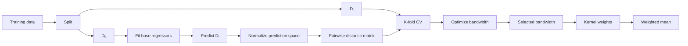
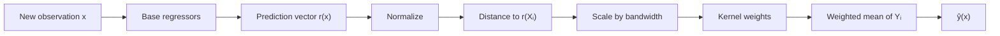

# GradientCOBRA

!!! abstract "GradientCOBRA: kernel aggregation in prediction space"

    **GradientCOBRA** is a regression aggregation method that combines several
    base regressors through a kernel defined on their **prediction vectors**.

    Instead of averaging the predictions of the base regressors directly,
    GradientCOBRA uses those predictions to define a new feature space. Training
    observations whose prediction vectors are close to the prediction vector of
    a query point receive larger weights in the final regression estimate.

    The method also provides a bandwidth-selection strategy based on
    cross-validation and, when a differentiable kernel is used, gradient-based
    optimization.

---

## At a glance

<div class="grid cards" markdown>

-   :material-robot-outline:{ .lg .middle } **Base regressors**

    ---

    Fit several regression models on one part of the training sample.

    **Output:** \(r_1,\ldots,r_M\)

-   :material-vector-polyline:{ .lg .middle } **Prediction space**

    ---

    Represent each observation by the predictions of all base regressors.

    **Feature vector:** \(r(x)\)

-   :material-ruler-square:{ .lg .middle } **Distance**

    ---

    Compare observations in prediction space.

    **Default:** Euclidean distance

-   :material-chart-bell-curve:{ .lg .middle } **Kernel**

    ---

    Convert prediction-space distance into similarity weights.

    **Default:** RBF / radial kernel

-   :material-tune-variant:{ .lg .middle } **Bandwidth optimization**

    ---

    Tune one kernel parameter using cross-validation.

    **Methods:** grid search or gradient-based optimization

-   :material-sigma:{ .lg .middle } **Aggregation**

    ---

    Compute a weighted average of the observed target values.

    **Output:** final prediction

</div>

!!! tip "Core idea"

    **Use the base models to build a prediction space, find observations that
    behave similarly in that space, and average their targets with kernel
    weights.**

---

## Why GradientCOBRA?

When several regression estimators are available, a common approach is to:

- choose one model,
- average their predictions,
- or learn a linear combination.

GradientCOBRA follows a different idea.

Suppose a query observation \(x\) is passed through several regressors. The
resulting predictions form a vector

\[
r(x)
=
\left(
r_1(x),
r_2(x),
\ldots,
r_M(x)
\right).
\]

This vector describes how the collection of regressors sees \(x\).

If another observation \(X_i\) has a similar prediction vector,

\[
r(X_i) \approx r(x),
\]

then the two observations are considered close in **prediction space**.

GradientCOBRA uses this prediction-space neighborhood to determine which
observed targets \(Y_i\) should contribute most strongly to the prediction for
\(x\).

---

## Prediction space

Assume that \(M\) regression estimators are available:

\[
r_1,r_2,\ldots,r_M.
\]

For an observation \(x\), GradientCOBRA defines

\[
r(x)
=
\left(
r_1(x),
r_2(x),
\ldots,
r_M(x)
\right).
\]

For example:

```text
Linear regression       -> 14.2
Ridge                    -> 14.8
Lasso                    -> 13.9
Random forest            -> 16.1
SVR                      -> 15.4
```

then

\[
r(x)
=
(14.2,14.8,13.9,16.1,15.4).
\]

This vector becomes the representation used by the aggregation method.

The original input \(x\) is therefore not compared directly with another
observation during the aggregation stage. Instead, GradientCOBRA compares

\[
r(x)
\quad\text{with}\quad
r(X_i).
\]

---

## Relationship to COBRA

Classical COBRA uses a hard notion of consensus.

A training observation contributes when the predictions of the base regressors
are sufficiently close to the predictions of the query point.

For example, the classical rule can use

\[
|r_m(X_i)-r_m(x)|<h
\]

for all base regressors \(m\).

GradientCOBRA replaces this hard selection rule by a smooth kernel weighting
scheme.

Instead of assigning a training observation only

```text
0 -> excluded
1 -> included
```

the method assigns a continuous similarity weight.

```text
very similar prediction vector   -> large weight
moderately similar               -> medium weight
very different                   -> small weight
```

This makes the consensus mechanism smoother and allows a broader class of
kernel functions.

---

## Mathematical formulation

Let the aggregation sample contain

\[
D_\ell
=
\left\{
\left(X_i^{(\ell)},Y_i^{(\ell)}\right)
\right\}_{i=1}^{\ell}.
\]

Let

\[
r_k(x)
=
\left(
r_{k,1}(x),
\ldots,
r_{k,M}(x)
\right)
\]

be the vector of predictions produced by the \(M\) base regressors.

The paper defines the combined estimator as

\[
g_n(r_k(x))
=
\sum_{i=1}^{\ell}
W_{n,i}(x)Y_i^{(\ell)},
\]

with kernel weights

\[
W_{n,i}(x)
=
\frac{
K_h
\left(
r_k(X_i^{(\ell)})-r_k(x)
\right)
}{
\sum_{j=1}^{\ell}
K_h
\left(
r_k(X_j^{(\ell)})-r_k(x)
\right)
}.
\]

The prediction is therefore a kernel-weighted average of the observed targets.

The important point is that the kernel acts on the **whole prediction vector**
rather than independently on each individual estimator output.

---

## One vector, one kernel

GradientCOBRA treats

\[
r(x)\in\mathbb{R}^{M}
\]

as a single \(M\)-dimensional feature vector.

The kernel is applied to a distance between complete prediction vectors:

\[
d\left(r(X_i),r(x)\right).
\]

This is different from applying one univariate kernel separately to every
component and summing the results.

Conceptually:

```text
r1(x) ─┐
r2(x) ─┤
r3(x) ─┼──► prediction vector r(x)
 ...   │
rM(x) ─┘
          │
          ▼
distance to r(Xi)
          │
          ▼
       kernel
          │
          ▼
        weight
```

---

## How the package implementation works

The current `kfc-procedure` implementation exposes:

```python
from kfc_procedure.cobra import GradientCOBRA
```

Its training pipeline is:



The main stages are:

1. split the training sample;
2. fit base regressors;
3. create prediction-space features;
4. normalize those predictions;
5. compute pairwise distances;
6. tune one bandwidth parameter;
7. transform distances with a kernel;
8. aggregate targets with a weighted mean.

---

## Training-data split

By default, calling

```python
model.fit(X, y)
```

uses

```python
split_ratio=0.5
overlap=0.0
```

and creates two subsets:

\[
D_k
\quad\text{and}\quad
D_\ell.
\]

<div class="grid cards" markdown>

-   :material-school-outline:{ .lg .middle } **\(D_k\)**

    ---

    Used to fit the base regressors.

-   :material-source-branch:{ .lg .middle } **\(D_\ell\)**

    ---

    Used to construct the prediction-space aggregation rule and optimize the
    bandwidth.

</div>

The paper also separates the construction of the base estimators from the
aggregation data. A common theoretical split is approximately half-and-half.

### Controlled overlap

The package additionally supports overlap between the two subsets:

```python
model.fit(
    X,
    y,
    split_ratio=0.5,
    overlap=0.1,
)
```

The implementation requires

\[
0
\leq
\text{overlap}
<
\text{split_ratio}
<
1.
\]

For the usual independent-style split, keep

```python
overlap=0.0
```

---

## Base regressors

If `estimators=None`, the current implementation uses:

```text
linear_regression
ridge_cv
lasso_cv
k_neighbors_regressor
random_forest_regressor
svr
```

Each estimator is fitted using \(D_k\).

The fitted estimators are stored in:

```python
model.estimators_
```

For every observation in \(D_\ell\), the model then evaluates all base
regressors and stacks their predictions.

If there are \(M\) regressors and \(\ell\) aggregation observations, the
prediction matrix has shape

\[
\ell \times M.
\]

---

## Custom base regressors

You can select the base estimators explicitly.

```python
from kfc_procedure.cobra import GradientCOBRA

model = GradientCOBRA(
    estimators=[
        "linear_regression",
        "ridge_cv",
        "random_forest_regressor",
        "svr",
    ],
    random_state=42,
)
```

### Estimator parameters

Use `estimators_params` to configure registered estimators.

```python
model = GradientCOBRA(
    estimators=[
        "k_neighbors_regressor",
        "random_forest_regressor",
        "svr",
    ],
    estimators_params={
        "k_neighbors_regressor": {
            "n_neighbors": 7,
        },
        "random_forest_regressor": {
            "n_estimators": 300,
            "random_state": 42,
        },
        "svr": {
            "C": 10.0,
        },
    },
    random_state=42,
)
```

---

## Prediction-space normalization

Before distances are computed, the implementation rescales the prediction
matrix.

If \(M\) is the number of base regressors, the normalization constant is

\[
c
=
\frac{s}
{
M\max_i |Y_i|+\varepsilon
},
\]

where the default numerator is

\[
s=30.
\]

The prediction matrix is then transformed as

\[
R_\ell^{\text{norm}}
=
cR_\ell.
\]

The fitted constant is available as

```python
model.normalize_constant_
```

### Custom normalization numerator

You may provide:

```python
norm_constant=...
```

For example:

```python
model = GradientCOBRA(
    norm_constant=20.0,
)
```

!!! note "Meaning of `norm_constant`"

    In the current source code, the supplied value replaces the default
    numerator `30.0`; it is still divided by the maximum absolute target value
    and by the number of prediction features.

---

## Distance in prediction space

The default distance is

```python
distance="euclidean"
```

so the aggregation distance between two observations is

\[
d_{ij}
=
\left\|
r(X_i)^{\text{norm}}
-
r(X_j)^{\text{norm}}
\right\|_2.
\]

The full pairwise matrix is stored as

```python
model.distance_matrix_
```

### Available distances

The package currently registers:

| Name | Aliases | Description |
| --- | --- | --- |
| `euclidean` | `l2` | Euclidean distance |
| `manhattan` | `l1` | Manhattan distance |
| `minkowski` | `lp` | General Minkowski distance |
| `cosine` | — | Cosine distance |
| `hamming` | — | Coordinate disagreement |

For continuous regression predictions, Euclidean distance is the default.

---

## Kernel weighting

The default kernel is

```python
kernel="rbf"
```

with aliases

```text
radial
gaussian
rbf
```

The current radial kernel computes

\[
K(D)=\exp(-D).
\]

Before the kernel is evaluated, the one-parameter adapter scales the distance:

\[
D'
=
bD,
\]

where \(b\) is the parameter called `bandwidth` in the implementation.

Therefore, the default effective kernel is

\[
K_b(D)
=
\exp(-bD).
\]

For query \(x\) and aggregation observation \(X_i\),

\[
w_i(x)
=
\exp
\left(
-b\,
d\left(
r(x)^{\text{norm}},
r(X_i)^{\text{norm}}
\right)
\right).
\]

---

## Important bandwidth convention

The paper commonly writes a kernel in the form

\[
K_h(z)=K(z/h).
\]

The current package instead scales the distance as

\[
D' = bD
\]

before evaluating the kernel.

With the default RBF kernel,

\[
K_b(D)=e^{-bD}.
\]

These conventions move in opposite directions:

<div class="grid cards" markdown>

-   **Paper-style \(h\)**

    ---

    Larger \(h\) generally creates a **wider** neighborhood because the
    argument \(z/h\) becomes smaller.

-   **Package `bandwidth` \(b\)**

    ---

    Larger \(b\) creates a **narrower** neighborhood for the default radial
    kernel because \(e^{-bD}\) decays faster.

</div>

!!! warning "Do not compare the numerical values directly"

    The `bandwidth_` stored by the current Python implementation should not be
    interpreted numerically as the same \(h\) used in the paper's
    \(K(z/h)\) notation.

---

## Weighted-mean aggregation

The default aggregator is

```python
aggregator="weighted_mean"
```

and produces

\[
\hat y(x)
=
\frac{
\sum_{i=1}^{\ell}
w_i(x)Y_i
}{
\sum_{i=1}^{\ell}
w_i(x)
}.
\]

This is the regression consensus step.

If the weights are effectively unusable for a query, the prediction path uses
the global mean of the aggregation targets as a fallback:

\[
\bar Y_\ell
=
\frac{1}{\ell}
\sum_{i=1}^{\ell}Y_i.
\]

The fitted fallback value is stored as

```python
model.global_mean_
```

---

## Bandwidth optimization

The bandwidth controls the neighborhood size in prediction space.

The implementation selects it by minimizing cross-validation error on
\(D_\ell\).

The default settings are:

```python
loss="mse"
optimizer="grid"
opt_method="grid"
n_cv=5
max_iter=300
```

If `bandwidth_list` is not provided, the candidate values are

```python
np.linspace(0.001, 10.0, max_iter)
```

so the default grid contains 300 candidates.

---

## K-fold cross-validation objective

For every candidate bandwidth \(b\), the implementation:

1. transforms the stored prediction-space distance matrix;
2. computes the kernel similarity matrix;
3. separates validation rows and training columns for each fold;
4. predicts validation targets by weighted aggregation;
5. computes the selected loss;
6. returns the average loss across folds.

Conceptually,

\[
\phi_\kappa(b)
=
\frac{1}{\kappa}
\sum_{p=1}^{\kappa}
L_p(b).
\]

For the default MSE loss,

\[
L_p(b)
=
\frac{1}{|F_p|}
\sum_{j\in F_p}
\left(
\hat y_{-p,b}(X_j)-Y_j
\right)^2.
\]

The selected parameter satisfies

\[
b^\star
=
\operatorname*{arg\,min}_{b}
\phi_\kappa(b).
\]

After fitting:

```python
model.bandwidth_
```

contains the selected value.

---

## Grid-search optimization

Grid search is the current default.

```python
model = GradientCOBRA(
    opt_method="grid",
    optimizer="grid",
    bandwidth_list=[
        0.01,
        0.05,
        0.1,
        0.5,
        1.0,
        2.0,
        5.0,
    ],
    random_state=42,
)
```

The optimizer evaluates every candidate and selects the one with the lowest
cross-validation loss.

A denser grid can be supplied with NumPy:

```python
import numpy as np

model = GradientCOBRA(
    bandwidth_list=np.linspace(0.01, 5.0, 100),
    n_cv=5,
    random_state=42,
)
```

---

## Gradient-based optimization

A central contribution of the GradientCOBRA paper is replacing exhaustive
bandwidth search with gradient-based bandwidth optimization when the kernel is
smooth enough.

The package supports the same general idea.

Set

```python
opt_method="grad"
```

and choose a gradient optimizer.

For example:

```python
model = GradientCOBRA(
    kernel="rbf",
    opt_method="grad",
    optimizer="gd",
    learning_rate=0.1,
    max_iter=300,
    random_state=42,
)
```

Other registered gradient optimizers include:

```text
gd
momentum
adam
```

### Example with Adam

```python
model = GradientCOBRA(
    kernel="rbf",
    opt_method="grad",
    optimizer="adam",
    learning_rate=0.05,
    max_iter=200,
    random_state=42,
)
```

---

## How gradients are obtained in the current implementation

The paper derives the derivative of the cross-validation objective with
respect to the bandwidth for suitable differentiable kernels.

The package's optimization framework is more general.

Its gradient optimizers can estimate the derivative numerically using finite
differences. The default gradient approximation is central difference.

Conceptually,

\[
\phi'(b)
\approx
\frac{
\phi(b+\varepsilon)-\phi(b-\varepsilon)
}{
2\varepsilon
}.
\]

This lets the same optimizer framework work with any sufficiently smooth
objective without requiring a hard-coded analytical derivative for every
kernel.

!!! note "Paper vs implementation"

    The paper explicitly derives bandwidth derivatives for suitable kernels.

    The current package passes the cross-validation objective to a reusable
    gradient-optimizer framework, which by default approximates the gradient
    numerically.

---

## Kernel compatibility with gradient optimization

Not every kernel is differentiable.

The source implementation checks

```python
kernel_.requires_grad
```

before using `opt_method="grad"`.

If the selected kernel does not support gradient optimization, the method
falls back internally to grid mode.

However, the selected `optimizer` must still belong to the optimizer category
required by the final method.

### Correct gradient configuration

```python
GradientCOBRA(
    kernel="rbf",
    opt_method="grad",
    optimizer="adam",
)
```

### Correct grid configuration

```python
GradientCOBRA(
    kernel="epanechnikov",
    opt_method="grid",
    optimizer="grid",
)
```

!!! warning "Do not combine `opt_method='grad'` with `optimizer='grid'`"

    The constructor defaults to

    ```python
    optimizer="grid"
    opt_method="grid"
    ```

    If you explicitly change only

    ```python
    opt_method="grad"
    ```

    while leaving `optimizer="grid"`, the implementation raises a
    `ValueError`, because the grid optimizer is not registered as a gradient
    optimizer.

---

## Optimization history

After fitting, GradientCOBRA stores optimization metadata in

```python
model.optimization_outputs_
```

The dictionary contains:

```text
method
optimizer
bandwidth
score
history
evaluations
```

For example:

```python
model.fit(X_train, y_train)

print(model.bandwidth_)
print(model.optimization_outputs_["score"])
print(model.optimization_outputs_["evaluations"])
print(model.optimization_outputs_["history"])
```

The history is converted to a pandas `DataFrame`, which makes it convenient to
inspect the optimization path.

---

## Basic usage

```python
from kfc_procedure.cobra import GradientCOBRA

model = GradientCOBRA(
    random_state=42,
)

model.fit(X_train, y_train)

y_pred = model.predict(X_test)
```

The default workflow is approximately:

```text
training data
     │
     ▼
50 / 50 split
     │
     ├──► fit base regressors
     │
     └──► aggregation observations
               │
base regressors│
     │         │
     └────► prediction vectors
               │
               ▼
           normalize
               │
               ▼
       Euclidean distance
               │
               ▼
       tune one bandwidth
               │
               ▼
          RBF kernel
               │
               ▼
         weighted mean
```

---

## Full example

```python
import numpy as np

from sklearn.datasets import make_regression
from sklearn.metrics import mean_squared_error
from sklearn.model_selection import train_test_split

from kfc_procedure.cobra import GradientCOBRA


X, y = make_regression(
    n_samples=1000,
    n_features=20,
    noise=15.0,
    random_state=42,
)

X_train, X_test, y_train, y_test = train_test_split(
    X,
    y,
    test_size=0.2,
    random_state=42,
)

model = GradientCOBRA(
    estimators=[
        "linear_regression",
        "ridge_cv",
        "lasso_cv",
        "k_neighbors_regressor",
        "random_forest_regressor",
        "svr",
    ],
    distance="euclidean",
    kernel="rbf",
    aggregator="weighted_mean",
    loss="mse",
    bandwidth_list=np.linspace(0.01, 5.0, 80),
    n_cv=5,
    random_state=42,
)

model.fit(X_train, y_train)

prediction = model.predict(X_test)

rmse = mean_squared_error(
    y_test,
    prediction,
) ** 0.5

print("Bandwidth:", model.bandwidth_)
print("RMSE:", rmse)
```

---

## Gradient-optimization example

```python
from kfc_procedure.cobra import GradientCOBRA

model = GradientCOBRA(
    estimators=[
        "ridge_cv",
        "lasso_cv",
        "random_forest_regressor",
        "svr",
    ],
    kernel="rbf",
    opt_method="grad",
    optimizer="adam",
    learning_rate=0.05,
    max_iter=150,
    n_cv=5,
    random_state=42,
)

model.fit(X_train, y_train)

print(model.bandwidth_)
print(model.optimization_outputs_["score"])

y_pred = model.predict(X_test)
```

---

## Providing a separate aggregation sample

You can provide \(D_k\) and \(D_\ell\) explicitly instead of using the internal
split.

```python
model.fit(
    X_k,
    y_k,
    X_l=X_l,
    y_l=y_l,
)
```

In this configuration:

```text
X_k, y_k  -> fit the base regressors
X_l, y_l  -> construct prediction space and tune aggregation
```

This can be useful when the data split has already been prepared elsewhere.

---

## Using precomputed predictions

GradientCOBRA also supports

```python
as_predictions=True
```

during `fit`.

In this mode, the supplied feature matrix is interpreted directly as the
prediction space.

```python
model = GradientCOBRA(
    random_state=42,
)

model.fit(
    prediction_matrix,
    y,
    as_predictions=True,
)
```

For example:

```text
              regressor 1   regressor 2   regressor 3
sample 1          12.4          11.8          12.1
sample 2          18.2          17.9          19.0
sample 3           7.4           8.0           7.7
```

is already a valid prediction-space matrix.

During prediction, the new matrix must use the same columns and the same
ordering.

```python
pred = model.predict(
    new_prediction_matrix,
)
```

This mode is especially useful when GradientCOBRA is used as an aggregation
component inside another pipeline.

---

## Use inside the KFC procedure

The package registers a regression combiner under

```text
gradientcobra
```

through `GradientCOBRACombiner`.

The combiner receives candidate-model predictions directly and fits
GradientCOBRA with

```python
as_predictions=True
```

Conceptually, inside KFC:

```text
K-Step
   │
   ▼
F-Step
   │
   ▼
candidate predictions
   │
   ▼
GradientCOBRA
   │
   ▼
final regression prediction
```

This matches the role of consensual aggregation in the final **C-Step** of the
KFC procedure.

!!! info

    When GradientCOBRA is used this way, the local KFC models have already
    produced the prediction features, so GradientCOBRA does not need to train
    its own default base regressors.

---

## Available kernels

The package contains several kernel implementations, including:

```text
rbf
gaussian
radial
cobra
naive
epanechnikov
triangular
biweight
triweight
cauchy
exponential
reverse_cosh
```

Different kernels define different relationships between distance and
similarity.

For example, the default radial kernel uses smooth exponential decay:

\[
K(D)=e^{-D}.
\]

Compact-support kernels can instead assign exactly zero weight beyond a
specified region.

---

## Available loss functions

The optimization objective is configurable.

Registered losses include:

| Name | Aliases |
| --- | --- |
| `mse` | `l2`, `squared_error` |
| `mae` | `l1` |
| `huber` | — |
| `quantile` | — |
| `log_loss` | `cross_entropy` |
| `hinge` | — |

For regression, the default is:

```python
loss="mse"
```

which matches the quadratic-error optimization described in the paper.

---

## Important fitted attributes

After `fit()`, useful attributes include:

| Attribute | Description |
| --- | --- |
| `X_k_`, `y_k_` | base-estimator training subset |
| `X_l_`, `y_l_` | aggregation subset |
| `estimators_` | fitted base regressors when `as_predictions=False` |
| `as_predictions_` | whether the supplied input was already prediction space |
| `global_mean_` | fallback mean target |
| `normalize_constant_` | prediction scaling constant |
| `Y_l_norm_` | normalized aggregation prediction matrix |
| `distance_matrix_` | pairwise prediction-space distances |
| `cv_folds_` | cross-validation folds |
| `bandwidth_` | selected kernel scaling parameter |
| `optimization_outputs_` | optimization metadata and history |

---

## Prediction workflow

For a new observation \(x\):



Mathematically, the current default implementation follows

\[
x
\longrightarrow
r(x)
\longrightarrow
cr(x)
\longrightarrow
d\left(cr(x),cr(X_i)\right)
\longrightarrow
b\,d_i
\longrightarrow
e^{-bd_i}
\longrightarrow
\widehat y(x).
\]

---

## Statistical interpretation

GradientCOBRA can be viewed as a nonparametric regression procedure in the
space generated by the base models.

The base regressors transform

\[
x\in\mathbb{R}^{d}
\]

into

\[
r(x)\in\mathbb{R}^{M}.
\]

Then the aggregation method performs kernel-style regression in that
\(M\)-dimensional prediction space.

This is useful because each base regressor may capture a different aspect of
the relationship between \(X\) and \(Y\). Their joint prediction vector can
therefore provide a rich representation even when no single model is
sufficient.

---

## Theoretical result from the paper

The paper studies the regression risk

\[
\mathbb{E}
\left[
|g_n(r_k(X))-g^\star(X)|^2
\right].
\]

It shows that, under its stated assumptions, the kernel-based aggregation
inherits the performance of consistent base estimators.

A key risk bound has the form

\[
\mathbb{E}
\left[
|g_n(r_k(X))-g^\star(X)|^2
\right]
\leq
\min_{1\leq m\leq M}
\mathbb{E}
\left[
|r_{k,m}(X)-g^\star(X)|^2
\right]
+
C\ell^{-2/(M+2)}.
\]

This expresses an important property of consensual aggregation: asymptotically,
the combined method can track the performance of the strongest estimator in
the candidate collection, up to a term that decreases with the aggregation
sample size under the assumptions of the theorem.

!!! note

    This statement summarizes the theoretical result proved in the paper.
    It should not be interpreted as a finite-sample guarantee for every
    dataset or every package configuration.

---

## What gradient descent changes

The statistical estimator and the bandwidth optimizer are two separate ideas.

The estimator itself is

```text
prediction vectors
      ↓
distance
      ↓
kernel weights
      ↓
weighted target average
```

Gradient descent changes only the way the bandwidth is selected.

Instead of evaluating a long list of possible bandwidths,

```text
h1, h2, h3, ..., hN
```

the optimizer follows the slope of the cross-validation objective toward a
lower-loss value.

The paper motivates this using cross-validation error curves that are often
approximately convex-like in the bandwidth.

---

## Grid search vs gradient optimization

| Property | Grid search | Gradient-based |
| --- | --- | --- |
| Candidate values | Explicit finite grid | Iterative updates |
| Derivative needed | No | Yes or numerical approximation |
| Works with non-smooth kernels | Generally yes | Not always |
| Default in package | Yes | No |
| Package optimizers | `grid` | `gd`, `momentum`, `adam` |
| Search resolution | Limited by grid | Continuous parameter updates |

Grid search is simple and robust.

Gradient optimization can avoid evaluating a large dense grid when the kernel
and objective are sufficiently smooth.

---

## GradientCOBRA vs MixCOBRA

The two estimators use different spaces.

| Method | Input-space distance | Prediction-space distance | Tuned parameters |
| --- | :---: | :---: | --- |
| GradientCOBRA | — | ✓ | one bandwidth |
| MixCOBRA | ✓ | ✓ | input/prediction trade-off |

GradientCOBRA asks:

> Which observations receive predictions similar to this query from the
> collection of regressors?

MixCOBRA additionally asks:

> Are those observations also close in the original feature space?

Use this distinction when choosing which conceptual page to read next.

---

## GradientCOBRA vs direct model averaging

Direct model averaging might compute

\[
\hat y(x)
=
\frac{1}{M}
\sum_{m=1}^{M}
r_m(x).
\]

GradientCOBRA does something fundamentally different.

The base-model predictions are used as **coordinates**, not as the quantities
that are directly averaged.

The method first finds relevant training observations in prediction space, and
then averages their observed target values:

\[
\hat y(x)
=
\sum_i W_i(x)Y_i.
\]

So:

```text
Direct averaging
base predictions -> average -> prediction
```

while:

```text
GradientCOBRA
base predictions
      ↓
prediction-space neighborhood
      ↓
training targets
      ↓
weighted average
      ↓
prediction
```

---

## Practical considerations

### Number of base regressors

If too few estimators are used, prediction space may not capture enough
structure.

If many weak or redundant estimators are used, the prediction-space dimension
\(M\) grows and neighborhood estimation can become harder.

The paper's convergence-rate term explicitly depends on \(M\), which reflects
this dimensional effect.

### Scaling

Prediction outputs from heterogeneous regressors may differ in magnitude.
The package rescales prediction space before computing distances.

### Kernel choice

Smooth kernels are natural when gradient optimization is desired.

Compact-support kernels can create sparse neighborhoods but may not support
the same gradient behavior.

### Bandwidth

The bandwidth determines how local the final aggregation is.

With the package's default radial kernel:

```text
small package bandwidth -> slower decay -> broader neighborhood
large package bandwidth -> faster decay -> narrower neighborhood
```

---

## Inspecting a fitted model

```python
model.fit(X_train, y_train)

print("Bandwidth")
print(model.bandwidth_)

print("Normalization")
print(model.normalize_constant_)

print("Optimization")
print(model.optimization_outputs_)

print("Prediction-space distance matrix")
print(model.distance_matrix_)
```

For a concise look at the optimization path:

```python
history = model.optimization_outputs_["history"]

print(history.head())
```

---

## Reproducibility

Use `random_state` to make the internal split and K-fold configuration
reproducible:

```python
model = GradientCOBRA(
    random_state=42,
)
```

You can also control base-estimator randomness through `estimators_params`.

---

## Parallel base-estimator execution

The constructor exposes

```python
n_jobs=-1
```

by default.

The helper functions used to fit and evaluate the base estimators can use this
value for parallel execution.

For example:

```python
model = GradientCOBRA(
    n_jobs=4,
    random_state=42,
)
```

This setting concerns the base-estimator stage; it does not mean that every
bandwidth evaluation is automatically parallelized.

---

## Paper and implementation terminology

The following mapping is useful when reading both the paper and the source
code.

| Paper concept | Package representation |
| --- | --- |
| base estimators \(r_{k,1},\ldots,r_{k,M}\) | `estimators_` |
| prediction vector \(r_k(x)\) | output of `_load_predictions()` |
| aggregation sample \(D_\ell\) | `X_l_`, `y_l_` |
| prediction-space distances | `distance_matrix_` |
| kernel \(K_h\) | `kernel_` + `adapter_` |
| bandwidth | `bandwidth_` |
| weighted regression estimate | `weighted_mean` aggregator |
| CV objective \(\phi_\kappa\) | `kappa_cross_validation_error()` |
| bandwidth optimization | `_optimize_hyperparameters()` |

---

## Mental model

!!! quote ""

    **GradientCOBRA turns the predictions of several regressors into a new
    feature space and performs kernel-weighted regression in that space.**

\[
\boxed{
\text{Base regressors}
\rightarrow
\text{prediction space}
\rightarrow
\text{distance}
\rightarrow
\text{optimized kernel}
\rightarrow
\text{weighted target average}
}
\]
