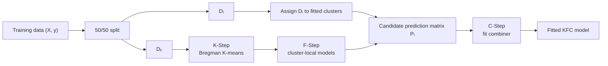
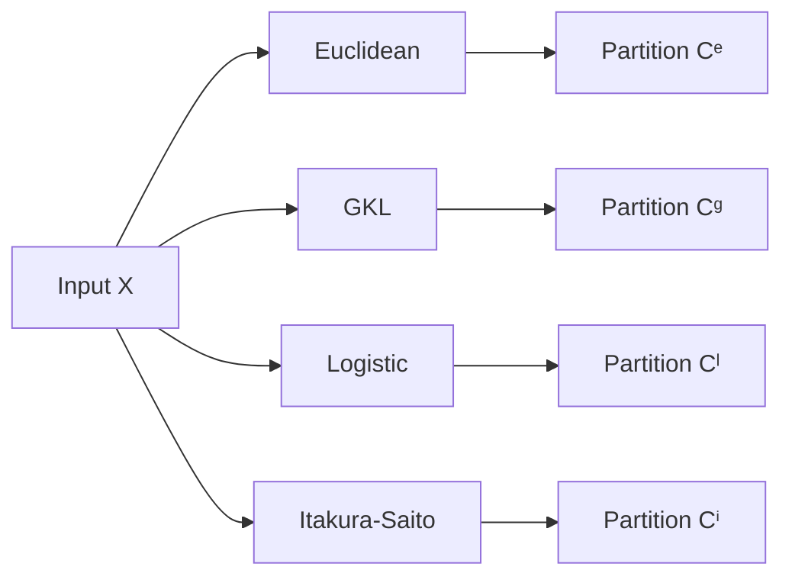
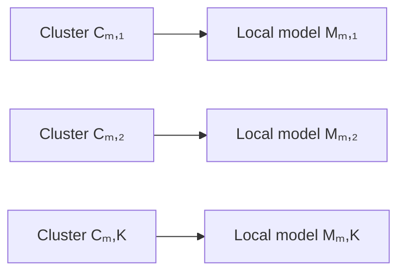
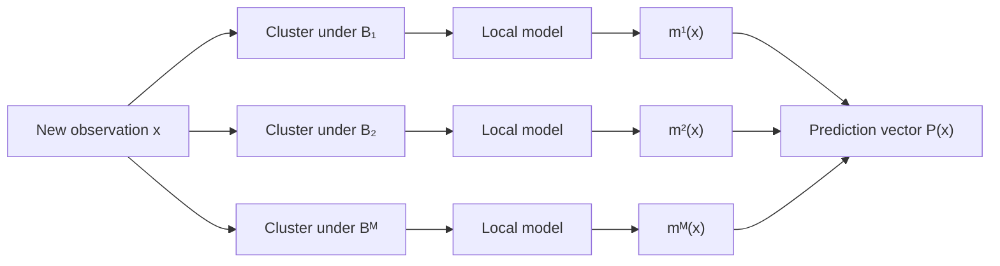
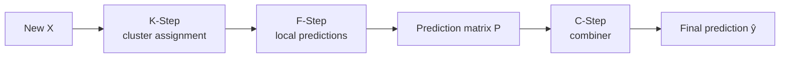

# KFC Procedure

!!! abstract "KFC: K-means → Fit → Consensus"

    The **KFC Procedure** is a clusterwise supervised-learning pipeline for
    datasets that may contain unknown groups governed by different predictive
    relationships.

    Rather than committing to a single clustering geometry, KFC builds several
    clusterings with **Bregman divergences**, fits a local predictive model in
    every cluster, and combines the resulting divergence-specific predictions
    in a final **consensus** stage.

    **Supports:** regression · classification

---

## At a glance

<div class="grid cards" markdown>

-   :material-numeric-1-circle:{ .lg .middle } **K-Step — cluster**

    ---

    Fit one Bregman K-means model per divergence.

    **Output:** one cluster assignment per divergence

-   :material-numeric-2-circle:{ .lg .middle } **F-Step — fit locally**

    ---

    Fit one supervised model inside each cluster of every divergence-specific
    partition.

    **Output:** one candidate prediction per divergence

-   :material-numeric-3-circle:{ .lg .middle } **C-Step — combine**

    ---

    Learn or apply a combiner to the candidate prediction matrix.

    **Output:** final prediction

</div>

!!! tip "Mental model"

    **Cluster the data in several ways → fit locally → combine the predictions.**

---

## Quick start

### Regression

```python
from kfc_procedure import KFCRegressor

model = KFCRegressor(
    divergences=["euclidean", "gkl", "is"],
    local_model="linear_regression",
    combiner="gradientcobra",
    n_clusters=3,
    random_state=42,
)

model.fit(X_train, y_train)
y_pred = model.predict(X_test)
```

### Classification

```python
from kfc_procedure import KFCClassifier

model = KFCClassifier(
    divergences=["euclidean", "logistic"],
    local_model="logistic_regression",
    combiner="combined_classifier",
    n_clusters=3,
    random_state=42,
)

model.fit(X_train, y_train)
y_pred = model.predict(X_test)
```

!!! note "Choose divergences whose domains match your data"

    `euclidean` accepts real-valued data. Other divergences impose stricter
    domains; for example, `logistic` requires values strictly between `0` and
    `1`, while GKL and Itakura–Saito are intended for positive-valued data.

---

## The implementation workflow

The `KFCProcedure` estimator uses an internal 50/50 split:

\[
D_n = D_k \cup D_l.
\]

The first half, \(D_k\), is used for the K-Step and F-Step. The second half,
\(D_l\), is transformed into candidate predictions and used to fit the
C-Step combiner.



For classification, the split is stratified by the class labels when
possible. For regression, ordinary random splitting is used.

---

## :material-numeric-1-circle: K-Step — divergence-aware clustering

The K-Step fits one `BregmanKMeans` model for every requested divergence.
Each divergence provides a different geometry for partitioning the same input
sample.

For a strictly convex differentiable generator \(\phi\), the Bregman
divergence is

\[
d_\phi(x,y)
=
\phi(x)-\phi(y)-\langle x-y,\nabla\phi(y)\rangle.
\]

Unlike a metric, a Bregman divergence does not need to be symmetric and does
not need to satisfy the triangle inequality.

### Built-in divergences

| Name | Geometry / typical association | Domain |
| --- | --- | --- |
| `euclidean` | Squared Euclidean / Gaussian | \(\mathbb{R}^d\) |
| `gkl` | Generalized KL / Poisson-like data | positive / non-negative data as required by the implementation |
| `logistic` | Logistic / Bernoulli | \((0,1)^d\) |
| `is` | Itakura–Saito | positive data |

The K-Step produces

\[
\mathcal{C}^{(m)} =
\{C_{m,1},\ldots,C_{m,K}\}
\]

for every divergence \(m\).



### K-Step parameters

The clustering behavior is controlled by:

```python
n_clusters=3
max_iter=300
tol=1e-4
random_state=None
```

You can also pass divergence-specific options with `divergences_params`:

```python
model = KFCRegressor(
    divergences=["euclidean", "gkl"],
    divergences_params={
        "euclidean": {"validate_domain": True},
        "gkl": {"validate_domain": True},
    },
    local_model="linear_regression",
    combiner="mean",
)
```

---

## :material-numeric-2-circle: F-Step — local predictive models

For each divergence-specific partition, the F-Step fits one supervised model
inside every observed cluster.

For divergence \(m\) and cluster \(k\), denote the local model by

\[
M_{m,k}.
\]

If there are \(M\) divergences and \(K\) clusters, the procedure can fit up to

\[
M \times K
\]

local models.



### What `local_model` accepts

`local_model` can be either:

- a registered model name such as a scikit-learn estimator name converted to
  snake case, or
- a custom `BaseLocalModel` instance.

The package automatically registers compatible scikit-learn classifiers and
regressors. Examples include:

```text
linear_regression
ridge
lasso
random_forest_regressor
logistic_regression
random_forest_classifier
svc
k_neighbors_classifier
```

Use `local_model_params` to configure the estimator:

```python
model = KFCClassifier(
    divergences=["euclidean"],
    local_model="random_forest_classifier",
    local_model_params={
        "n_estimators": 300,
        "max_depth": 8,
    },
    combiner="majority_vote",
    random_state=42,
)
```

`random_state` is forwarded automatically when the selected estimator accepts
it and you have not supplied it yourself.

---

## Candidate prediction matrix

At prediction time, each observation is first assigned to one cluster under
each fitted divergence. The corresponding local model then produces one
prediction.

With \(M\) divergences, the F-Step returns

\[
P(x)
=
\left[
 m^{(1)}(x),
 m^{(2)}(x),
 \ldots,
 m^{(M)}(x)
\right].
\]

For a batch of \(n\) observations, the result is a matrix

\[
P \in \mathbb{R}^{n \times M}.
\]



This prediction matrix is the interface between the F-Step and C-Step.

---

## :material-numeric-3-circle: C-Step — aggregation

The C-Step receives the divergence-level prediction matrix and combines its
columns into one final output.

This implementation is intentionally modular: KFC is not tied to a single
consensus rule. The combiner can be a simple deterministic rule, a learned
stacking model, or a COBRA-style aggregation method.

### Regression combiners

| Combiner | Behavior |
| --- | --- |
| `mean` | Arithmetic mean of divergence-specific predictions |
| `weighted_mean` | Linear regression learns weights over prediction columns |
| `stacking_regressor` | Fits a regression meta-model on the prediction matrix |
| `gradientcobra` | Uses `GradientCOBRA` in precomputed-prediction mode |
| `mixcobra` | Uses `MixCOBRARegressor` in precomputed-prediction mode |

Example:

```python
model = KFCRegressor(
    divergences=["euclidean", "gkl", "is"],
    local_model="random_forest_regressor",
    combiner="weighted_mean",
    combiner_params={
        "fit_intercept": False,
    },
    random_state=42,
)
```

### Classification combiners

| Combiner | Behavior |
| --- | --- |
| `majority_vote` | Hard vote across divergence-specific class predictions |
| `stacking_classifier` | Logistic-regression meta-classifier |
| `combined_classifier` | Uses `CombinedClassifier` in precomputed-prediction mode |

Example:

```python
model = KFCClassifier(
    divergences=["euclidean", "logistic"],
    local_model="logistic_regression",
    combiner="stacking_classifier",
    random_state=42,
)
```

!!! info "Paper vs package"

    The original KFC paper emphasizes consensus aggregation. The package keeps
    that idea but exposes a broader combiner layer, so you can also use simple
    means, hard voting, stacking, MixCOBRA, GradientCOBRA, or
    `CombinedClassifier` depending on the task.

---

## Complete fit sequence

The source implementation performs the following steps:

1. Convert `X` and `y` to NumPy arrays.
2. Split the data 50/50 into \(D_k\) and \(D_l\).
3. Fit one `BregmanKMeans` model per divergence on \(X_k\).
4. Save the K-Step training assignments in `kstep_.clusters_`.
5. Assign \(X_l\) to clusters using the fitted K-Step models.
6. Fit one F-Step local model per divergence and cluster using \((X_k,y_k)\).
7. Predict \(X_l\) with the F-Step to construct \(P_l\).
8. Fit the C-Step combiner using \((P_l,y_l)\).

That is,

\[
(X_k,y_k)
\xrightarrow{\text{K-Step + F-Step}}
\text{candidate models},
\]

followed by

\[
(X_l,y_l)
\xrightarrow{\text{candidate models}}
P_l
\xrightarrow{\text{C-Step}}
\text{combiner}.
\]

---

## Prediction sequence

After fitting, prediction does **not** refit any stage.

For a new matrix `X`:

1. `kstep_.predict(X)` assigns a cluster under every divergence.
2. `fstep_.predict(X, clusters)` obtains one local-model prediction per
   divergence.
3. `cstep_.predict(P)` aggregates those predictions.



---

## Main estimator API

### `KFCProcedure`

```python
KFCProcedure(
    divergences,
    local_model,
    combiner,
    divergences_params=None,
    local_model_params=None,
    combiner_params=None,
    task="regression",
    n_clusters=3,
    max_iter=300,
    tol=1e-4,
    verbose=0,
    random_state=None,
)
```

### Parameters

| Parameter | Description |
| --- | --- |
| `divergences` | Divergence names or divergence instances used by the K-Step |
| `local_model` | Registered local-model name or `BaseLocalModel` instance |
| `combiner` | Registered combiner name or `BaseCombiner` instance |
| `divergences_params` | Per-divergence constructor parameters |
| `local_model_params` | Parameters forwarded to local models |
| `combiner_params` | Parameters forwarded to the C-Step combiner |
| `task` | `"regression"` or `"classification"` |
| `n_clusters` | Number of clusters fitted for every divergence |
| `max_iter` | Maximum Bregman K-means iterations |
| `tol` | Bregman K-means convergence tolerance |
| `verbose` | Logging level used by the top-level procedure |
| `random_state` | Reproducibility seed |

For most users, the convenience classes are clearer:

```python
from kfc_procedure import KFCRegressor, KFCClassifier
```

They set `task` automatically.

---

## Fitted attributes

After `fit()`, the main fitted stages are:

| Attribute | Meaning |
| --- | --- |
| `kstep_` | Fitted `KStep` object |
| `fstep_` | Fitted `FStep` object |
| `cstep_` | Fitted `CStep` object |

Useful nested attributes include:

```python
model.kstep_.models_      # divergence -> fitted BregmanKMeans
model.kstep_.clusters_    # divergence -> labels on D_k
model.fstep_.models_      # divergence -> cluster -> local model metadata
model.cstep_.strategy_    # fitted combiner
```

You can inspect the fitted cluster models directly:

```python
for name, clustering_model in model.kstep_.models_.items():
    print(name, clustering_model.cluster_centers_)
```

And inspect the local models:

```python
for divergence, cluster_models in model.fstep_.models_.items():
    print(divergence)
    for key, info in cluster_models.items():
        print(key, info["model"])
```

---

## Custom divergence instances

`divergences` does not have to contain only strings. You can pass an instance
implementing `BaseBregmanDivergence`.

```python
from kfc_procedure.core.clustering.divergences import SquaredEuclidean
from kfc_procedure import KFCRegressor

model = KFCRegressor(
    divergences=[SquaredEuclidean()],
    local_model="linear_regression",
    combiner="mean",
)
```

The K-Step resolves string names through `BregmanDivergenceFactory`; supplied
instances are reused directly.

---

## Custom local models and combiners

The three-stage architecture is deliberately replaceable.

A custom local learner can implement `BaseLocalModel`, while a custom
aggregator can implement `BaseCombiner` and be supplied directly instead of a
registered string.

Conceptually:

```text
K-Step
  └── any supported Bregman divergence

F-Step
  └── any BaseLocalModel / registered sklearn estimator

C-Step
  └── any BaseCombiner / registered combiner
```

This means the package implementation is broader than the fixed choices used
in the original numerical experiments.

---

## Choosing divergences

The most important practical constraint is the divergence domain.

### Euclidean

Use `euclidean` as the safest default for ordinary real-valued features.

```python
divergences=["euclidean"]
```

### Logistic

The logistic divergence implementation requires

\[
0 < x_j < 1
\]

for every feature value.

Scale or transform data explicitly before using it when needed.

### GKL and Itakura–Saito

These divergences are intended for positive-valued data. Do not assume that a
generic standardized dataset is valid for them.

!!! warning "No automatic domain conversion in KFCProcedure"

    `KFCProcedure.fit()` converts input to NumPy arrays, but it does not
    automatically normalize, shift, clip, or otherwise transform features to
    satisfy divergence domains. Data preparation remains the caller's
    responsibility.

---

## Choosing a combiner

A useful way to think about the C-Step is by how much it learns from \(D_l\).

### Simple rule

Use `mean` or `majority_vote` when you want a transparent aggregation rule.

```python
combiner="mean"
```

or

```python
combiner="majority_vote"
```

### Linear meta-learning

Use `weighted_mean`, `stacking_regressor`, or `stacking_classifier` when you
want the hold-out split to learn how the divergence-specific predictors should
be combined.

### Consensus aggregation

Use `gradientcobra`, `mixcobra`, or `combined_classifier` when you want the
C-Step to follow the consensus-aggregation family provided by this package.

---

## Relationship to the original KFC procedure

The implementation keeps the core structure of the published method:

\[
\boxed{
\text{K-means}
\rightarrow
\text{Fit}
\rightarrow
\text{Consensus / aggregation}
}
\]

The original procedure uses multiple Bregman clusterings, fits local models in
those clusters, and combines the resulting predictors. The package preserves
that architecture while making each stage configurable.

Important implementation extensions include:

- any registered scikit-learn classifier or regressor can be used as the
  F-Step local model;
- several C-Step combiners are available beyond the paper's original choices;
- the complete estimator follows a scikit-learn-style `fit` / `predict` API;
- divergence objects, local models, and combiners can be replaced with custom
  implementations.

---

## Current implementation notes

!!! warning "`predict_proba()` is not currently wired through FStep"

    `KFCClassifier.predict_proba()` calls `fstep_.predict_proba(...)`, but the
    current `FStep` class implements `predict()` only. Therefore the
    top-level probability path is incomplete in the current source tree.

    `predict()` is the supported end-to-end classification path.

!!! note "Local classification clusters need usable label distributions"

    A classifier fitted inside a small cluster can fail when the cluster does
    not contain enough class variation. The F-Step catches the underlying
    `ValueError` and reports the divergence and cluster that failed.

!!! note "One local-model instance should not be reused across clusters"

    Registered string models are freshly constructed for each cluster. If you
    pass a pre-instantiated custom `BaseLocalModel`, the current resolver
    returns that same object for every cluster. Prefer a registered factory
    name when you need independent fitted models per cluster.

---

## Debugging with `verbose`

`KFCProcedure` provides a simple logging level:

```python
verbose=0  # silent
verbose=1  # high-level progress
verbose=2  # debug information
verbose=3  # trace-style detail where available
```

Example:

```python
model = KFCRegressor(
    divergences=["euclidean", "gkl"],
    local_model="ridge",
    combiner="gradientcobra",
    verbose=2,
    random_state=42,
)

model.fit(X_train, y_train)
```

This is useful for inspecting split sizes, K-Step completion, F-Step cluster
keys, and the shape of the prediction matrix passed into the C-Step.

---

## End-to-end example

```python
from sklearn.datasets import make_regression
from sklearn.model_selection import train_test_split
from sklearn.metrics import root_mean_squared_error

from kfc_procedure import KFCRegressor

X, y = make_regression(
    n_samples=1000,
    n_features=8,
    noise=10.0,
    random_state=42,
)

X_train, X_test, y_train, y_test = train_test_split(
    X,
    y,
    test_size=0.2,
    random_state=42,
)

model = KFCRegressor(
    divergences=["euclidean"],
    local_model="ridge",
    combiner="mean",
    n_clusters=3,
    random_state=42,
)

model.fit(X_train, y_train)
y_pred = model.predict(X_test)

rmse = root_mean_squared_error(y_test, y_pred)
print(f"RMSE: {rmse:.3f}")
```

Start with `euclidean` when validating a new pipeline. Add other divergences
only after confirming that your feature domain is compatible with them.

---

## Summary

KFC separates the learning problem into three independent responsibilities:

```text
K-Step
  discover multiple cluster structures
        ↓
F-Step
  learn one local predictor per cluster
        ↓
C-Step
  combine divergence-specific predictions
        ↓
  final prediction
```

The key design idea is not that one divergence must be correct. Instead, each
divergence supplies a different candidate partition, each partition produces a
specialized predictor, and the final stage learns how to use those candidate
predictions together.
