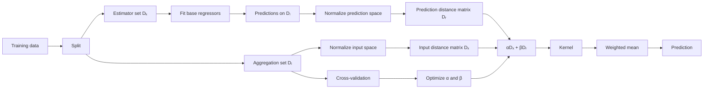
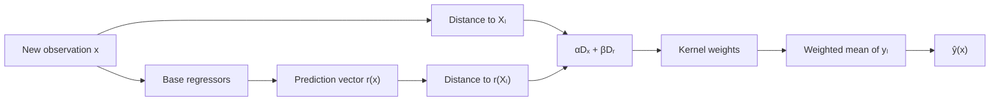

# MixCOBRA

!!! abstract "MixCOBRA: input space + prediction space"

    **MixCOBRA** is a consensual aggregation method for regression that combines
    two kinds of similarity:

    - proximity between observations in the **original input space**;
    - proximity between the predictions produced by a collection of **base regressors**.

    The implementation in `kfc-procedure` is exposed as
    `MixCOBRARegressor`.

---

## At a glance

<div class="grid cards" markdown>

-   :material-database-outline:{ .lg .middle } **Input space**

    ---

    Compare a query point \(x\) with aggregation observations \(X_i\).

    **Information:** feature-space geometry

-   :material-graph-outline:{ .lg .middle } **Prediction space**

    ---

    Compare the vector of base-regressor predictions \(r(x)\) with
    \(r(X_i)\).

    **Information:** model consensus

-   :material-tune-variant:{ .lg .middle } **Trade-off**

    ---

    Learn how strongly the two spaces should contribute.

    **Parameters:** \(\alpha\), \(\beta\)

-   :material-function-variant:{ .lg .middle } **Kernel aggregation**

    ---

    Convert the combined distance into weights and compute a weighted mean of
    observed targets.

    **Output:** final regression prediction

</div>

!!! tip "Core idea"

    **Nearby in the inputs + nearby in the base-model predictions → larger aggregation weight.**

---

## Why MixCOBRA?

Classical consensual aggregation focuses on the predictions of several base
estimators. A training observation contributes strongly to a query when the
base estimators produce similar predictions for both points.

MixCOBRA adds another source of information: the distance between the original
inputs.

This is useful because prediction agreement alone can be misleading when one
or more base estimators perform poorly. Input-space proximity provides an
additional geometric constraint.

Conceptually:

```text
                           ┌────────────────────┐
Query x ─────────────────►│ Input-space distance│
                           └─────────┬──────────┘
                                     │
                                     ├──► combined distance ─► kernel ─► weights
                                     │
Base estimators ─► r(x) ─►│ Prediction-space
                           │ distance
                           └─────────────────────
```

The paper describes this as an **input-output trade-off**: the method mixes
information from the original observations and from the outputs of the base
estimators.

---

## Prediction space

Assume that \(M\) base regressors are fitted:

\[
r_1, r_2, \ldots, r_M.
\]

For an observation \(x\), define the prediction vector

\[
r(x)
=
\left(
r_1(x),
r_2(x),
\ldots,
r_M(x)
\right).
\]

For example, with four regressors:

```text
Linear regression   -> 18.7
Ridge               -> 19.1
Random forest       -> 21.3
SVR                 -> 20.2
```

the prediction-space representation is

\[
r(x) = (18.7, 19.1, 21.3, 20.2).
\]

Two observations can therefore be compared in two different spaces:

\[
X_i \leftrightarrow x
\]

and

\[
r(X_i) \leftrightarrow r(x).
\]

MixCOBRA combines both comparisons.

---

## The original MixCOBRA formulation

Let

\[
D_n = \{(X_i,Y_i)\}_{i=1}^{n}
\]

be a regression sample and let \(r(x)\) be the vector of predictions produced
by the base regressors.

The MixCOBRA estimator has the weighted form

\[
T_n(x)
=
\frac{
\sum_{i=1}^{n}
Y_i\,
g\!\left(
\frac{X_i-x}{\alpha},
\frac{r(X_i)-r(x)}{\beta}
\right)
}{
\sum_{i=1}^{n}
g\!\left(
\frac{X_i-x}{\alpha},
\frac{r(X_i)-r(x)}{\beta}
\right)
}.
\]

The two smoothing parameters have different roles:

- \(\alpha\) controls the influence of **input-space proximity**;
- \(\beta\) controls the influence of **prediction-space consensus**.

For a radial kernel, the method can be viewed as performing kernel regression
on an augmented representation containing both the original features and the
predictions of the base models.

!!! note "Paper vs package parametrization"

    The paper expresses the trade-off by dividing the input and prediction
    differences by \(\alpha\) and \(\beta\).

    The current `kfc-procedure` implementation uses an equivalent
    **distance-fusion architecture**, but its parameters are applied as
    multiplicative weights to distance matrices:

    \[
    D_{\text{mix}}
    =
    \alpha D_X + \beta D_R.
    \]

    Therefore, interpret the package's `alpha` and `beta` as **weights on
    distances**, not literally as the denominators used in the paper's
    notation.

---

## How `MixCOBRARegressor` works

The source implementation follows this pipeline:



The main stages are:

1. split the data into estimator-training and aggregation subsets;
2. fit a pool of base regressors;
3. construct prediction-space features;
4. normalize input and prediction spaces;
5. compute pairwise distances in both spaces;
6. optimize the mixing parameters;
7. convert the combined distance into kernel weights;
8. aggregate the observed targets by weighted mean.

---

## 1. Training-data split

By default,

```python
split_ratio=0.5
overlap=0.0
```

so the dataset is divided into two approximately equal parts:

\[
D_k
\quad\text{and}\quad
D_l.
\]

<div class="grid cards" markdown>

-   :material-school-outline:{ .lg .middle } **\(D_k\)**

    ---

    Used to fit the base regressors.

-   :material-source-branch:{ .lg .middle } **\(D_l\)**

    ---

    Used to construct the aggregation space and tune MixCOBRA's parameters.

</div>

The splitter also supports a controlled overlap between the two subsets through
the `overlap` argument.

!!! warning "Overlap constraint"

    The implementation requires

    \[
    0 \leq \text{overlap} < \text{split_ratio} < 1.
    \]

---

## 2. Fit the base regressors

When `estimators=None`, the current implementation uses:

```text
linear_regression
ridge
lasso
k_neighbors_regressor
random_forest_regressor
svr
```

Each model is fitted on \(D_k\).

For the aggregation observations in \(D_l\), the predictions are stacked into

\[
R_l
=
\begin{bmatrix}
r_1(X_1) & \cdots & r_M(X_1) \\
r_1(X_2) & \cdots & r_M(X_2) \\
\vdots & & \vdots \\
r_1(X_l) & \cdots & r_M(X_l)
\end{bmatrix}.
\]

Every row of \(R_l\) is an observation represented in **prediction space**.

---

## 3. Normalize both spaces

Input features and prediction features can live on very different numerical
scales. The implementation rescales both before computing distances.

For a data matrix \(Z\), the utility used by MixCOBRA computes a constant of
the form

\[
c
=
\frac{s}{
M\max |Z|
},
\]

where \(M\) is the number of prediction features and \(s\) is a configured
scale factor.

The implementation uses different default scale factors:

```text
input space       -> 5
prediction space  -> 50
```

and constructs

\[
X_l^{\text{norm}} = c_X X_l,
\]

\[
R_l^{\text{norm}} = c_R R_l.
\]

You can override the corresponding constants with:

```python
norm_constant_x=...
norm_constant_y=...
```

---

## 4. Compute distances

The default distance is

```python
distance="euclidean"
```

so two distance matrices are created:

\[
D_X(i,j)
=
d\!\left(
X_i^{\text{norm}},
X_j^{\text{norm}}
\right)
\]

and

\[
D_R(i,j)
=
d\!\left(
r(X_i)^{\text{norm}},
r(X_j)^{\text{norm}}
\right).
\]

With the default Euclidean metric,

\[
d(a,b)=\|a-b\|_2.
\]

### Available distance implementations

The package currently registers:

| Name | Alias | Description |
| --- | --- | --- |
| `euclidean` | `l2` | Euclidean distance |
| `manhattan` | `l1` | Manhattan distance |
| `minkowski` | `lp` | Minkowski distance |
| `cosine` | — | Cosine distance |
| `hamming` | — | Proportion of unequal coordinates |

For ordinary continuous regression features, Euclidean distance is the default
choice.

---

## 5. Mix input and prediction distances

With the standard two-parameter configuration,

```python
one_parameter=False
```

the package combines the two distance matrices as

\[
D_{\text{mix}}
=
\alpha D_X
+
\beta D_R.
\]

This is implemented by the `two_parameter` kernel adapter.

Interpretation:

```text
larger α  -> stronger penalty for input-space separation
larger β  -> stronger penalty for prediction-space disagreement
```

For the default RBF kernel,

\[
K(D)=e^{-D},
\]

so the effective weight is

\[
K_{ij}
=
\exp
\left(
-\alpha D_X(i,j)
-\beta D_R(i,j)
\right).
\]

This makes the trade-off especially clear: observations receive high weight
only when the weighted combined distance is small.

---

## 6. Kernel weighting

The default kernel is

```python
kernel="rbf"
```

which is registered together with the aliases

```text
radial
gaussian
rbf
```

and computes

\[
K(D)=\exp(-D).
\]

Other registered kernels include:

```text
cobra
naive
epanechnikov
triangular
biweight
triweight
cauchy
exponential
reverse_cosh
```

The kernel maps distance to similarity:

```text
small combined distance  -> large weight
large combined distance  -> small weight
```

---

## 7. Weighted aggregation

The default aggregation strategy is

```python
aggregator="weighted_mean"
```

For query \(x\), the prediction is

\[
\hat y(x)
=
\frac{
\sum_{i=1}^{n_l}
w_i(x)Y_i
}{
\sum_{i=1}^{n_l}
w_i(x)
}.
\]

In the implementation, if all weights are effectively zero, prediction falls
back to the global mean of the aggregation targets:

\[
\bar Y_l
=
\frac{1}{n_l}
\sum_{i=1}^{n_l}Y_i.
\]

---

## 8. Optimize \(\alpha\) and \(\beta\)

MixCOBRA chooses its distance trade-off by cross-validation on \(D_l\).

The default configuration is:

```python
loss="mse"
n_cv=5
opt_method="grid"
optimizer="grid"
```

For every candidate pair

\[
(\alpha,\beta),
\]

the implementation:

1. combines the distance matrices;
2. applies the kernel;
3. predicts each validation fold from the remaining folds;
4. evaluates the configured loss;
5. keeps the parameters with the smallest cross-validation error.

Unless candidate arrays are supplied explicitly, both search axes are generated
from

```python
np.linspace(0.001, 10.0, max_iter)
```

where the default is

```python
max_iter=300
```

!!! warning "Default grid size"

    A full two-parameter grid with `max_iter=300` contains

    \[
    300 \times 300 = 90{,}000
    \]

    candidate pairs.

    For exploratory work, it is often more practical to pass smaller
    `alpha_list` and `beta_list` arrays.

After fitting, the selected parameters are stored in:

```python
model.optimization_outputs_["params"]
```

and the optimization history is available from:

```python
model.optimization_outputs_["history"]
```

---

## Basic usage

```python
from kfc_procedure.cobra import MixCOBRARegressor

model = MixCOBRARegressor(
    random_state=42,
)

model.fit(X_train, y_train)

y_pred = model.predict(X_test)
```

Because the default two-dimensional grid can be large, a smaller explicit grid
is convenient for examples:

```python
import numpy as np

from kfc_procedure.cobra import MixCOBRARegressor

model = MixCOBRARegressor(
    alpha_list=np.linspace(0.1, 3.0, 20),
    beta_list=np.linspace(0.1, 3.0, 20),
    n_cv=5,
    random_state=42,
)

model.fit(X_train, y_train)

y_pred = model.predict(X_test)
```

---

## Custom base regressors

You can choose the expert pool explicitly.

```python
model = MixCOBRARegressor(
    estimators=[
        "linear_regression",
        "ridge",
        "random_forest_regressor",
        "svr",
    ],
    alpha_list=np.linspace(0.1, 3.0, 20),
    beta_list=np.linspace(0.1, 3.0, 20),
    random_state=42,
)
```

The number of regressors determines the dimensionality of prediction space.

### Per-estimator parameters

Use `estimators_params` to configure string-based estimators:

```python
model = MixCOBRARegressor(
    estimators=[
        "ridge",
        "random_forest_regressor",
        "k_neighbors_regressor",
    ],
    estimators_params={
        "ridge": {
            "alpha": 1.0,
        },
        "random_forest_regressor": {
            "n_estimators": 300,
            "random_state": 42,
        },
        "k_neighbors_regressor": {
            "n_neighbors": 7,
        },
    },
    alpha_list=np.linspace(0.1, 2.0, 15),
    beta_list=np.linspace(0.1, 2.0, 15),
    random_state=42,
)
```

Estimator specifications can also be given as `(name, params)` tuples or as
already-created estimator objects.

---

## Providing an explicit aggregation dataset

Instead of allowing MixCOBRA to create the internal split, you can provide
\(D_k\) and \(D_l\) directly:

```python
model.fit(
    X_k,
    y_k,
    X_l=X_l,
    y_l=y_l,
)
```

In this mode:

```text
X_k, y_k  -> train the base regressors
X_l, y_l  -> construct and tune the aggregation rule
```

Both `X_l` and `y_l` must be supplied together.

---

## Using prediction features directly

The implementation supports

```python
as_predictions=True
```

for cases where the supplied matrix already represents model predictions.

```python
model = MixCOBRARegressor(
    as_predictions=True,  # passed to fit(), not constructor
)
```

Use it through `fit`:

```python
model = MixCOBRARegressor(
    alpha_list=np.linspace(0.1, 2.0, 20),
    beta_list=np.linspace(0.1, 2.0, 20),
    random_state=42,
)

model.fit(
    prediction_matrix,
    y,
    as_predictions=True,
)
```

!!! warning "Prediction-space-only mode"

    In the current source implementation, `as_predictions=True` bypasses
    fitting the internal estimators and treats the supplied matrix as the
    aggregation representation.

    This mode does **not** preserve a separate original feature matrix, so it
    should not be interpreted as the standard two-space MixCOBRA workflow.

    For the normal input-plus-prediction algorithm, use ordinary feature
    matrices and let `MixCOBRARegressor` construct the prediction space from
    its base estimators.

---

## One-parameter mode

Set

```python
one_parameter=True
```

to switch from two separate distance matrices to a single combined feature
representation.

The implementation concatenates the normalized spaces:

\[
Z_i
=
\left[
X_i^{\text{norm}},
r(X_i)^{\text{norm}}
\right]
\]

and computes one distance matrix

\[
D_Z.
\]

A single bandwidth parameter then scales that distance:

\[
D' = hD_Z.
\]

With the default RBF kernel,

\[
K(D')=\exp(-hD_Z).
\]

Example:

```python
model = MixCOBRARegressor(
    one_parameter=True,
    alpha_list=np.linspace(0.01, 5.0, 50),
    random_state=42,
)

model.fit(X_train, y_train)
```

!!! note

    In one-parameter mode, the `alpha_list` values are used internally as the
    candidate **bandwidth** values.

---

## Gradient optimization

The implementation also contains gradient-based optimizers.

To request gradient optimization, both the high-level method and optimizer
must be compatible:

```python
model = MixCOBRARegressor(
    opt_method="grad",
    optimizer="grad",
    learning_rate=0.01,
    max_iter=300,
    random_state=42,
)
```

Gradient optimization is only used when the selected kernel declares that it
supports gradients. Otherwise, the implementation falls back to grid mode.

!!! note "Current defaults"

    Despite older docstring wording in the source, the actual constructor
    defaults are currently:

    ```python
    optimizer="grid"
    opt_method="grid"
    ```

---

## Parallel estimator fitting

The base regressors can be fitted and evaluated in parallel using:

```python
model = MixCOBRARegressor(
    n_jobs=-1,
    alpha_list=np.linspace(0.1, 2.0, 20),
    beta_list=np.linspace(0.1, 2.0, 20),
)
```

`n_jobs` controls parallel execution of the base-estimator pool. It does not
turn the full \((\alpha,\beta)\) search into a parallel grid automatically.

---

## Important fitted attributes

After calling `fit()`, the estimator exposes useful state for inspection.

| Attribute | Description |
| --- | --- |
| `estimators_` | fitted base regressors |
| `X_k_`, `y_k_` | estimator-training subset |
| `X_l_`, `y_l_` | aggregation subset |
| `X_l_norm_` | normalized aggregation inputs |
| `Y_l_norm_` | normalized prediction-space features |
| `normalize_constant_x_` | scaling constant for the input space |
| `normalize_constant_y_` | scaling constant for prediction space |
| `distance_matrix_x_` | pairwise input-space distances |
| `distance_matrix_y_` | pairwise prediction-space distances |
| `cv_folds_` | cross-validation folds |
| `optimization_outputs_` | selected parameters, score, evaluations, and history |
| `global_mean_` | fallback target mean |

For example:

```python
model.fit(X_train, y_train)

print(model.optimization_outputs_["params"])
print(model.optimization_outputs_["score"])
print(model.optimization_outputs_["history"])
```

---

## Prediction workflow

For a new observation \(x\):



Mathematically, the current two-parameter implementation performs

\[
x
\longrightarrow
\left(
d_X(x,X_i),
d_R(r(x),r(X_i))
\right)
\longrightarrow
\alpha d_X+\beta d_R
\longrightarrow
K(\alpha d_X+\beta d_R)
\longrightarrow
\widehat y(x).
\]

---

## MixCOBRA vs COBRA

The distinction can be summarized as follows.

| Method | Input distance | Prediction distance |
| --- | :---: | :---: |
| COBRA-style consensus | — | ✓ |
| MixCOBRA | ✓ | ✓ |

Classical COBRA asks:

> Which observations receive predictions similar to this query from the base regressors?

MixCOBRA additionally asks:

> Are those observations also close to the query in the original feature space?

The second condition can reduce the influence of observations that happen to
have similar model predictions but are geometrically far from the query.

---

## Interpreting \(\alpha\) and \(\beta\)

For the package implementation,

\[
D_{\text{mix}}
=
\alpha D_X+\beta D_R.
\]

<div class="grid cards" markdown>

-   **Large \(\alpha\)**

    ---

    Input-space distance has stronger influence.

    The aggregation behaves more locally with respect to the original
    features.

-   **Large \(\beta\)**

    ---

    Prediction-space disagreement has stronger influence.

    The aggregation relies more strongly on consensus between base regressors.

-   **Small \(\alpha\)**

    ---

    Original input geometry contributes less.

-   **Small \(\beta\)**

    ---

    Prediction disagreement contributes less.

</div>

Because both terms are normalized before the distance calculation, these
parameters should be interpreted together with the selected distance metric,
kernel, and normalization constants.

---

## Practical example

```python
import numpy as np

from sklearn.datasets import make_regression
from sklearn.model_selection import train_test_split
from sklearn.metrics import mean_squared_error

from kfc_procedure.cobra import MixCOBRARegressor


X, y = make_regression(
    n_samples=1000,
    n_features=10,
    noise=10.0,
    random_state=42,
)

X_train, X_test, y_train, y_test = train_test_split(
    X,
    y,
    test_size=0.2,
    random_state=42,
)

model = MixCOBRARegressor(
    estimators=[
        "linear_regression",
        "ridge",
        "lasso",
        "random_forest_regressor",
        "svr",
    ],
    distance="euclidean",
    kernel="rbf",
    aggregator="weighted_mean",
    loss="mse",
    alpha_list=np.linspace(0.05, 2.0, 20),
    beta_list=np.linspace(0.05, 2.0, 20),
    n_cv=5,
    random_state=42,
)

model.fit(X_train, y_train)

pred = model.predict(X_test)

rmse = mean_squared_error(
    y_test,
    pred,
) ** 0.5

print("alpha, beta:", model.optimization_outputs_["params"])
print("RMSE:", rmse)
```

---

## What the paper shows

The MixCOBRA paper studies both classification and regression and presents the
method as a way to combine **prediction consensus** with **input-space
proximity**.

Its numerical experiments compare the original consensus-only strategy with
the mixed input-output strategy. The paper reports examples where incorporating
input geometry improves accuracy or reduces variability, including simulated
classification problems and industrial regression applications.

!!! info "Scope of this Python class"

    The paper develops both classification and regression formulations.

    The current package class documented on this page is specifically:

    ```python
    MixCOBRARegressor
    ```

    so this documentation focuses on the regression implementation actually
    available in `kfc-procedure`.

---

## Mental model

!!! quote ""

    **MixCOBRA performs kernel aggregation in a space defined jointly by the
    original inputs and the predictions of several regressors.**

\[
\boxed{
\text{Base regressors}
\rightarrow
\text{input + prediction distances}
\rightarrow
\text{learned trade-off}
\rightarrow
\text{kernel weights}
\rightarrow
\text{weighted regression}
}
\]
