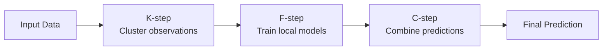

# KFCProcedure

`kfc-procedure` is a Python package for **clusterwise predictive modeling** and **COBRA-based ensemble aggregation**.

It is designed for machine learning workflows where a dataset may contain heterogeneous subgroups. Instead of relying on one global model, KFCProcedure clusters observations, trains local models inside clusters, and combines their predictions into a final output.



!!! note "Package name and import name"
    Install with `pip install kfc-procedure`, but import with `import kfc_procedure`.

## Documentation sections

| Audience | Section | Purpose |
|---|---|---|
| Normal users | [User Documentation](user/overview.md) | Installation, quick start, examples, FAQ |
| ML/technical readers | [Technical Documentation](technical/overview.md) | Methods, algorithms, math, complexity, diagrams |
| Developers | [Developer Documentation](developer/overview.md) | Project structure, registries, extension, testing |
| API users | [API Reference](api/main.md) | mkdocstrings-generated class/module reference |

## Public API

```python
from kfc_procedure import KFCProcedure, KFCRegressor, KFCClassifier
from kfc_procedure.cobra import GradientCOBRA, MixCOBRARegressor, CombinedClassifier, SuperLearner
```

## Quick installation

```bash
pip install kfc-procedure
```

With COBRA extras:

```bash
pip install "kfc-procedure[cobra]"
```

## Minimal regression example

```python
from sklearn.datasets import make_regression
from sklearn.model_selection import train_test_split
from sklearn.metrics import mean_squared_error
from kfc_procedure import KFCRegressor

X, y = make_regression(n_samples=300, n_features=8, noise=0.2, random_state=42)
X_train, X_test, y_train, y_test = train_test_split(X, y, random_state=42)

model = KFCRegressor(
    divergences=["euclidean"],
    local_model="linear_regression",
    combiner="mean",
    n_clusters=3,
    random_state=42,
)
model.fit(X_train, y_train)
print(mean_squared_error(y_test, model.predict(X_test)))
```
