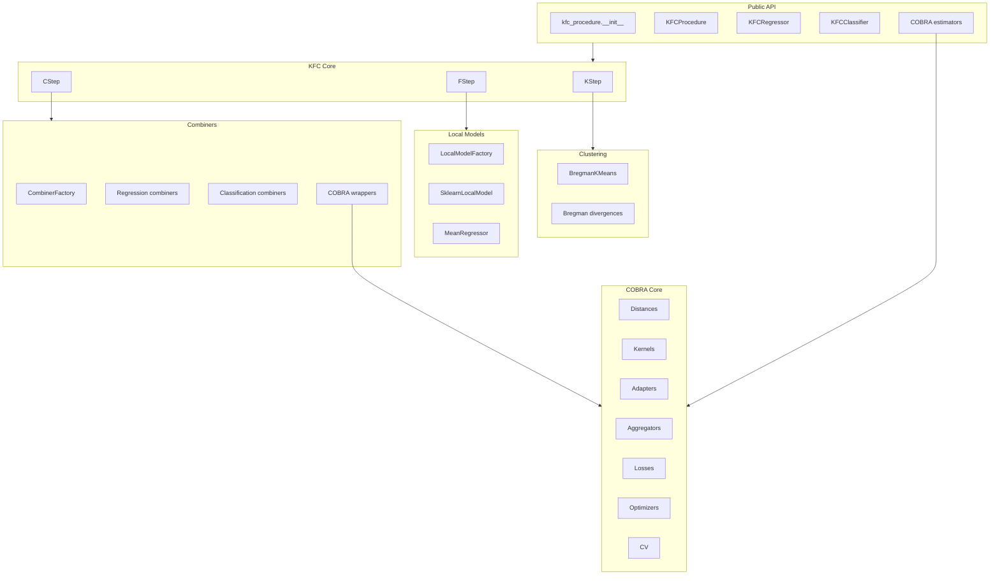
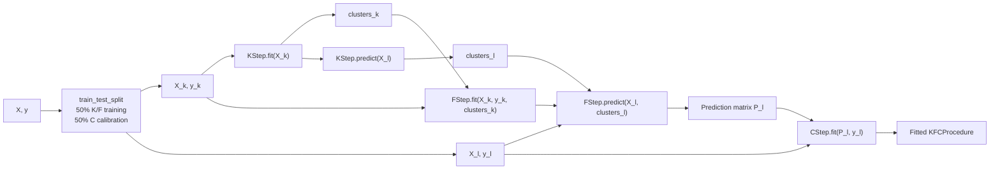
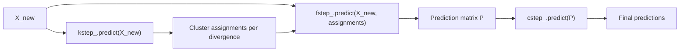
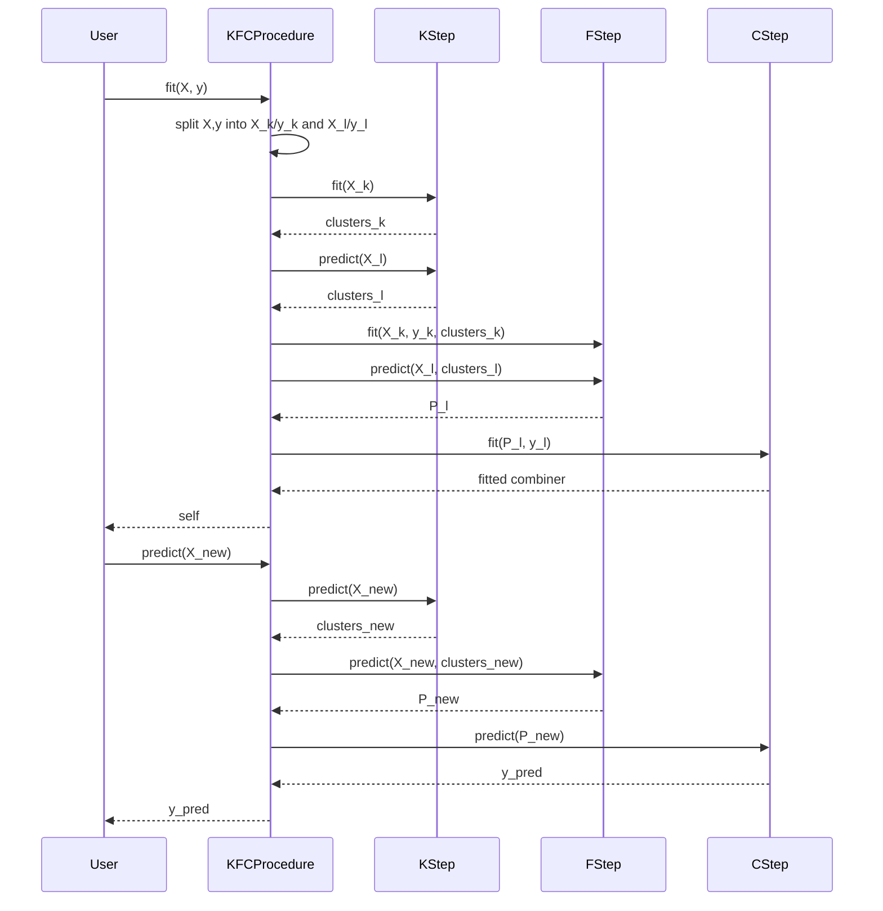
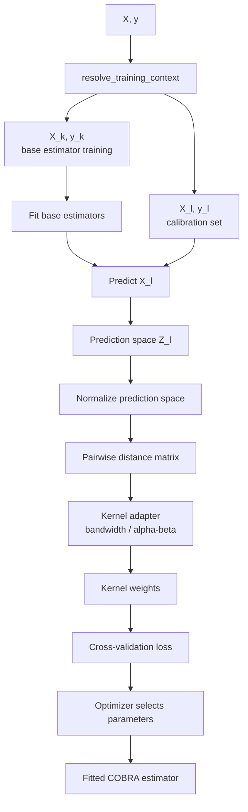
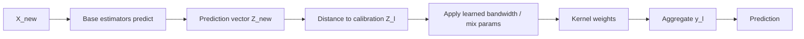
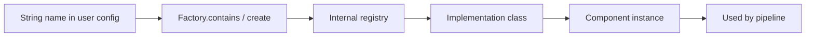

# Architecture & Data Flow

This page explains how data moves through the package during training and prediction.

---

## 1. Package architecture



---

## 2. KFCProcedure training data flow

`KFCProcedure.fit(X, y)` uses an internal split:



---

## 3. KFCProcedure prediction data flow



---

## 4. Object lifecycle



---

## 5. COBRA training data flow

The COBRA estimators follow a separate but related calibration architecture.



---

## 6. COBRA prediction data flow



---

## 7. Registry flow



Example:

```python
CombinerFactory.create("weighted_mean")
```

resolves to:

```text
WeightedMeanCombiner(...)
```

---

## 8. Data structures

### K-step outputs

```python
models_ = {
    "euclidean": BregmanKMeans(...),
    "gkl": BregmanKMeans(...),
}

clusters_ = {
    "euclidean": np.ndarray(shape=(n_samples,)),
    "gkl": np.ndarray(shape=(n_samples,)),
}
```

### F-step outputs

```python
models_ = {
    "euclidean": {
        "m0": {"divergence": "euclidean", "cluster": 0, "model": ...},
        "m1": {"divergence": "euclidean", "cluster": 1, "model": ...},
    }
}
```

### F-step prediction matrix

```text
P.shape = (n_samples, n_divergences)
```

Each column corresponds to one divergence view.

---

## 9. Component boundaries

| Boundary | Input | Output |
|---|---|---|
| `BregmanKMeans` | `X` | cluster labels and centroids |
| `KStep` | `X` and divergences | dictionary of cluster labels |
| `FStep` | `X`, `y`, clusters | local models; prediction matrix |
| `CStep` | prediction matrix, `y` | fitted combiner; final predictions |
| `GradientCOBRA` | `X`, `y` | kernel aggregation model |
| `MixCOBRARegressor` | `X`, `y` | mixed-distance aggregation model |
| `CombinedClassifier` | `X`, `y` | kernel voting classifier |
