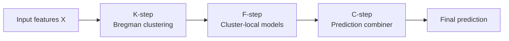
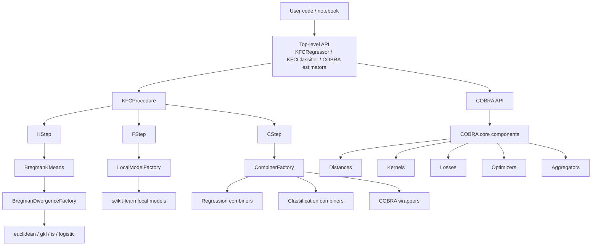

# Technical Overview

`kfc-procedure` is a Python machine learning package for **clusterwise predictive modeling** and **COBRA-based ensemble aggregation**. The project exposes scikit-learn-style estimators that combine unsupervised clustering, local supervised learning, and prediction aggregation.

The central estimator is `KFCProcedure`, with task-specific wrappers:

| Estimator | Task | Purpose |
|---|---:|---|
| `KFCProcedure` | regression or classification | Base estimator implementing the full K-step, F-step, and C-step pipeline. |
| `KFCRegressor` | regression | Convenience wrapper with `task="regression"`. |
| `KFCClassifier` | classification | Convenience wrapper with `task="classification"`. |
| `GradientCOBRA` | regression | Kernel-weighted COBRA regressor with bandwidth optimization. |
| `MixCOBRARegressor` | regression | COBRA regressor mixing input-space and prediction-space distances. |
| `CombinedClassifier` | classification | Kernel-weighted COBRA-style classifier. |
| `SuperLearner` | regression | Stacking-style super learner using base learners and meta learners. |

---

## Project goal

The goal of the project is to support learning from heterogeneous datasets where different regions of the feature space may follow different predictive rules. Instead of fitting a single global model, KFCProcedure first discovers local structure, then trains local predictors, and finally combines their predictions.

The core idea is:



!!! note "Main intuition"
    A single global model assumes one predictive pattern across the whole dataset. KFCProcedure relaxes that assumption by learning multiple local models induced by divergence-based cluster partitions.

---

## System type

This repository is a **Python ML library**, not a web application or production service. Its architecture is organized as a modular estimator framework:

- scikit-learn-compatible estimator classes;
- registry/factory-based component resolution;
- independent K-step, F-step, and C-step modules;
- separate COBRA core modules for distances, kernels, losses, optimizers, splitters, estimators, and aggregators.

---

## High-level architecture



---

## Key design patterns

### 1. Estimator pattern

The public classes follow the scikit-learn convention:

```python
model.fit(X_train, y_train)
y_pred = model.predict(X_test)
```

This makes the package familiar for users who already work with `scikit-learn`.

### 2. Three-stage ML pipeline

The KFC pipeline is decomposed into:

| Stage | Module | Responsibility |
|---|---|---|
| K-step | `core.steps.kstep` | Fit one Bregman K-Means model per divergence. |
| F-step | `core.steps.fstep` | Train one local supervised model per divergence and cluster. |
| C-step | `core.steps.cstep` | Combine divergence-specific predictions into final output. |

### 3. Registry/factory pattern

Factories map string identifiers to implementation classes. This enables runtime component selection such as:

```python
KFCRegressor(
    divergences=["euclidean"],
    local_model="linear_regression",
    combiner="weighted_mean",
    n_clusters=3,
)
```

Important factories include:

| Factory | Registers |
|---|---|
| `BregmanDivergenceFactory` | Bregman divergences. |
| `LocalModelFactory` | Local supervised models. |
| `CombinerFactory` | C-step combiners. |
| `DistanceFactory` | COBRA distance functions. |
| `KernelFactory` | COBRA kernels. |
| `LossFactory` | COBRA losses. |
| `OptimizerFactory` | COBRA optimizers. |
| `AggregatorFactory` | COBRA aggregators. |

---

## Main component summary

| Component | Implementation | Description |
|---|---|---|
| Bregman K-Means | `BregmanKMeans` | Lloyd-style clustering using a pluggable Bregman divergence. |
| Multi-divergence clustering | `KStep` | Fits one `BregmanKMeans` model for each divergence. |
| Local modeling | `FStep` | Trains independent local models per divergence and cluster. |
| Aggregation | `CStep` | Combines prediction matrix columns using a combiner. |
| COBRA regression | `GradientCOBRA` | Learns a kernel bandwidth in prediction space. |
| Mixed COBRA regression | `MixCOBRARegressor` | Combines input and prediction distances. |
| COBRA classification | `CombinedClassifier` | Aggregates labels/probabilities with kernel-weighted voting. |

---

## Where to continue

- Read **Methods** for the technical reasoning behind each method.
- Read **Algorithms** for pseudocode, input/output, and complexity.
- Read **Mathematics** for the formal objective functions.
- Read **Architecture & Data Flow** for system diagrams.
- Read **Limitations & Improvements** before relying on the package in production.
