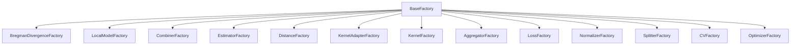

# Extending KFC Procedure

`kfc_procedure` is designed around small abstract interfaces and
registry-based factories.

That makes the package extensible in several places without changing the
high-level KFC or COBRA orchestration code.

The current source exposes extension points for:

```text
KFC layer
    Bregman divergences
    F-Step local models
    C-Step combiners

COBRA layer
    estimators
    distances
    kernel adapters
    kernels
    aggregators
    losses
    normalizers
    data splitters
    cross-validation strategies
    optimizers
```

Most of these components follow the same pattern:

```text
1. implement the expected interface
2. register the class with the appropriate factory
3. refer to the implementation by its registered string name
```

---

## Extension architecture



Each factory subclass receives its own independent registry.

---

# The common factory system

The central registry implementation is:

```python
BaseFactory
```

from:

```text
kfc_procedure/factory/base.py
```

Registration uses a decorator:

```python
@SomeFactory.register(
    "name"
)
class MyComponent:
    ...
```

Creation uses:

```python
component = SomeFactory.create(
    "name",
    **params,
)
```

---

# Independent registries

`BaseFactory.__init_subclass__()` performs:

```python
cls._registry = {}
```

for every factory subclass.

Therefore:

```text
DistanceFactory
KernelFactory
LossFactory
...
```

do not share one global name table.

The same symbolic name can exist in different factories without conflict.

For example, a distance and a loss can both use:

```text
l1
```

in their own registries.

---

# Registration names are normalized

`BaseFactory` normalizes names by:

```text
stripping surrounding whitespace
lowercasing
```

So:

```python
"  My_Component  "
```

is stored as:

```text
my_component
```

---

## Invalid names

Registration names must be strings and cannot become empty after stripping.

These are invalid:

```python
@Factory.register("")
```

```python
@Factory.register("   ")
```

and non-string names raise a `TypeError`.

---

# Multiple aliases

One class can be registered under several names:

```python
@DistanceFactory.register(
    "my_distance",
    "my_dist",
    "md",
)
class MyDistance(
    BaseDistance
):
    ...
```

Every alias points to the same `RegistryEntry`.

---

# Duplicate names

Within one registration call:

```python
@Factory.register(
    "demo",
    "DEMO",
)
```

the normalized names collide and the source raises:

```text
ValueError
```

because both normalize to:

```text
demo.
```

---

# Existing registry conflicts

If a normalized name is already registered, `register()` raises:

```python
KeyError
```

before the decorator registers the new class.

The source does not silently overwrite an existing implementation.

---

# Categories

Factories can attach categories:

```python
@CombinerFactory.register(
    "my_regression_combiner",
    categories={
        "regression",
    },
)
class MyRegressionCombiner(
    BaseCombiner
):
    ...
```

Categories are normalized in the same way as names.

---

## Category queries

Useful methods include:

```python
Factory.available_categories()
```

```python
Factory.available_by_category(
    "regression"
)
```

```python
Factory.supports(
    "my_component",
    "regression",
)
```

The current KFC combiner and local-model layers use categories to distinguish:

```text
regression
classification.
```

The optimizer factory also uses categories such as:

```text
search
gradient.
```

---

# Metadata

`register()` accepts arbitrary keyword metadata:

```python
@MyFactory.register(
    "example",
    version="1.0",
    experimental=True,
)
class Example:
    ...
```

The metadata are stored in the registration entry.

Inspect them with:

```python
MyFactory.info(
    "example"
)
```

---

# Registry inspection

The common factory API provides:

```python
Factory.available()
```

```python
Factory.contains(
    "name"
)
```

```python
Factory.info(
    "name"
)
```

```python
Factory.find_by_class(
    MyClass
)
```

```python
Factory.available_categories()
```

```python
Factory.available_by_category(
    "category"
)
```

```python
Factory.supports(
    "name",
    "category",
)
```

---

# Removing registrations

The source also provides:

```python
Factory.unregister(
    "name"
)
```

and:

```python
Factory.clear()
```

`unregister()` removes only one alias.

If one class is registered as:

```text
foo
bar
```

then:

```python
Factory.unregister(
    "foo"
)
```

leaves:

```text
bar
```

registered.

---

## `clear()` caution

`Factory.clear()` removes **every registration** from that factory subclass.

This affects built-ins already imported into that registry.

It is primarily a low-level registry operation rather than a normal user-guide
configuration step.

---

# Inspecting one registration

```python
from kfc_procedure.cobra.core.distances import (
    DistanceFactory,
)

print(
    DistanceFactory.info(
        "euclidean"
    )
)
```

The returned dictionary contains:

```text
name
class
module
categories
metadata.
```

---

# Extending Bregman divergences

KFC clustering divergences inherit:

```python
BaseBregmanDivergence
```

and register with:

```python
BregmanDivergenceFactory.
```

A concrete divergence is expected to provide:

```python
in_domain()
phi()
grad_phi()
```

while the base class supplies the generic Bregman distance machinery.

---

## Required mathematical interface

For a convex generator:

\[
\phi(x),
\]

the base class computes:

\[
D_\phi(x,y)
=
\phi(x)
-
\phi(y)
-
\langle
\nabla\phi(y),
x-y
\rangle.
\]

A custom divergence therefore implements:

```text
domain validation
generator phi
gradient of phi.
```

---

# Minimal custom divergence

```python
import numpy as np

from kfc_procedure.core.clustering.divergences.base import (
    BaseBregmanDivergence,
    BregmanDivergenceFactory,
)


@BregmanDivergenceFactory.register(
    "scaled_euclidean"
)
class ScaledEuclideanDivergence(
    BaseBregmanDivergence
):

    name = "scaled_euclidean"
    family = "custom"

    def __init__(
        self,
        scale=1.0,
        **kwargs,
    ):
        super().__init__(
            **kwargs,
        )

        self.scale = scale

    def in_domain(
        self,
        X,
    ):
        return True

    def phi(
        self,
        X,
    ):
        X = np.asarray(
            X,
            dtype=float,
        )

        return (
            self.scale
            *
            np.sum(
                X ** 2,
                axis=1,
            )
        )

    def grad_phi(
        self,
        X,
    ):
        X = np.asarray(
            X,
            dtype=float,
        )

        return (
            2.0
            *
            self.scale
            *
            X
        )
```

Then:

```python
divergence = (
    BregmanDivergenceFactory
    .create(
        "scaled_euclidean",
        scale=2.0,
    )
)
```

---

# Base divergence functionality you inherit

`BaseBregmanDivergence` already implements methods such as:

```text
distance()
pairwise()
centroid()
assign_clusters()
```

using the custom generator interface.

The `distance()` implementation also caches quantities associated with the
reference matrix `Y` for repeated evaluations.

So a custom divergence normally should not need to reimplement the entire
clustering distance engine.

---

# Domain validation

The base constructor accepts:

```python
validate_domain=True
```

and concrete divergences define:

```python
in_domain().
```

However, the generic current `distance()` implementation directly checks:

```python
if not (
    self.in_domain(X)
    and self.in_domain(Y)
):
    raise ValueError(...)
```

rather than conditionally checking only when `validate_domain` is true.

So disabling `validate_domain` is not a universal way to bypass domain checks
through all current base paths.

---

# Use custom divergence in KFC

```python
model = KFCRegressor(
    divergences=[
        "scaled_euclidean",
    ],
    divergences_params={
        "scaled_euclidean": {
            "scale": 2.0,
        },
    },
    ...
)
```

The exact `divergences_params` lookup should match the string key used by
K-Step.

---

# Divergence object path

K-Step also accepts a:

```python
BaseBregmanDivergence
```

instance directly.

In that case, factory parameter lookup is bypassed and the object itself is
used.

---

# Extending F-Step local models

Custom KFC local models inherit:

```python
BaseLocalModel
```

and register with:

```python
LocalModelFactory.
```

The required methods are:

```python
fit(
    X,
    y,
)
```

and:

```python
predict(
    X,
)
```

The base class also defines a default:

```python
predict_proba()
```

that raises `NotImplementedError`.

---

# Custom regression local model

```python
import numpy as np

from kfc_procedure.core.ml.base import (
    BaseLocalModel,
    LocalModelFactory,
)


@LocalModelFactory.register(
    "median_regressor",
    categories={
        "regression",
    },
)
class MedianRegressor(
    BaseLocalModel
):

    def fit(
        self,
        X,
        y,
    ):
        self.value_ = float(
            np.median(
                y
            )
        )

        return self

    def predict(
        self,
        X,
    ):
        return np.full(
            len(
                X
            ),
            self.value_,
            dtype=float,
        )
```

Then:

```python
model = KFCRegressor(
    local_model="median_regressor",
    ...
)
```

can resolve it through the factory.

---

# Custom classification local model

```python
@LocalModelFactory.register(
    "my_classifier",
    categories={
        "classification",
    },
)
class MyClassifier(
    BaseLocalModel
):

    def fit(
        self,
        X,
        y,
    ):
        ...
        return self

    def predict(
        self,
        X,
    ):
        ...

    def predict_proba(
        self,
        X,
    ):
        ...
```

The category is important because F-Step checks task support for string-based
models.

---

# `random_state` constructor compatibility

For string local models, F-Step injects:

```python
random_state
```

into the factory parameters when that key is not already present.

Built-in scikit-learn adapters filter unsupported constructor keywords.

A directly registered custom local model does **not** automatically receive
that filtering layer.

Therefore a custom string model should either:

```text
accept random_state explicitly
```

or:

```text
accept **kwargs
```

if it will be used with the current F-Step construction path.

!!! warning "Current F-Step behavior"

    A registered custom class with:

    ```python
    def __init__(self):
        ...
    ```

    can fail if F-Step calls it with:

    ```python
    random_state=...
    ```

    and the class does not accept that keyword.

---

# Scikit-learn models are auto-registered

The package already provides:

```python
register_all_sklearn_models()
```

which discovers scikit-learn classifiers and regressors using:

```python
all_estimators()
```

and registers snake_case names in:

```python
LocalModelFactory.
```

So you often do not need a custom wrapper just to use a normal scikit-learn
estimator in F-Step.

---

# Custom scikit-learn-style behavior

If you do write a local model, inheriting from:

```python
BaseLocalModel
```

also gives you a `BaseEstimator` ancestry through the source class hierarchy.

Following scikit-learn-style constructor conventions makes the object easier
to inspect and compose.

---

# Extending C-Step combiners

A KFC combiner inherits:

```python
BaseCombiner
```

and implements:

```python
fit(
    X,
    y=None,
)
```

and:

```python
combine(
    X,
)
```

The base class supplies:

```python
predict(
    X,
)
```

as an alias for:

```python
combine(
    X
).
```

---

# Regression combiner example

```python
import numpy as np

from kfc_procedure.core.combiner.base import (
    BaseCombiner,
    CombinerFactory,
)


@CombinerFactory.register(
    "trimmed_mean",
    categories={
        "regression",
    },
)
class TrimmedMeanCombiner(
    BaseCombiner
):

    def __init__(
        self,
        trim=1,
        random_state=None,
    ):
        self.trim = trim
        self.random_state = random_state

    def fit(
        self,
        X,
        y=None,
    ):
        return self

    def combine(
        self,
        X,
    ):
        X = np.asarray(
            X,
            dtype=float,
        )

        X_sorted = np.sort(
            X,
            axis=1,
        )

        if self.trim == 0:
            kept = X_sorted
        else:
            kept = X_sorted[
                :,
                self.trim:
                -self.trim,
            ]

        return np.mean(
            kept,
            axis=1,
        )
```

The explicit:

```python
random_state=None
```

parameter makes this example compatible with the current C-Step string
construction behavior.

---

# Classification combiner example

```python
from collections import Counter


@CombinerFactory.register(
    "last_tie_vote",
    categories={
        "classification",
    },
)
class LastTieVoteCombiner(
    BaseCombiner
):

    def __init__(
        self,
        random_state=None,
    ):
        self.random_state = random_state

    def fit(
        self,
        X,
        y=None,
    ):
        return self

    def combine(
        self,
        X,
    ):
        outputs = []

        for row in X:
            counts = Counter(
                row
            )

            max_count = max(
                counts.values()
            )

            tied = [
                value
                for value, count
                in counts.items()
                if count == max_count
            ]

            outputs.append(
                tied[
                    -1
                ]
            )

        return np.asarray(
            outputs,
            dtype=object,
        )
```

---

# Combiner category checks

C-Step checks:

```python
CombinerFactory.supports(
    name,
    self.task,
)
```

for string-based combiners.

So a custom regression combiner should register category:

```text
regression
```

and a classifier combiner should register:

```text
classification.
```

---

# C-Step `random_state` caveat

Like F-Step, C-Step injects:

```python
random_state
```

when constructing a string-based combiner.

Unlike `SklearnLocalModel`, `CombinerFactory.create()` forwards constructor
kwargs directly.

Therefore custom string combiners should be designed to accept the injected
keyword if they use the current C-Step pathway.

---

# Pre-built combiner objects

If you pass a combiner object instead of a string:

```python
model = KFCRegressor(
    combiner=MyCombiner(...),
    ...
)
```

C-Step returns that object directly from `_build_combiner()`.

No factory lookup or `random_state` injection occurs.

This can be useful when your custom constructor does not match the current
string-factory path.

---

# Extending COBRA estimators

The COBRA core defines:

```python
BaseEstimator
```

with required:

```python
fit()
predict()
```

methods and a registry:

```python
EstimatorFactory.
```

This is separate from KFC's:

```python
LocalModelFactory.
```

---

## Minimal COBRA estimator

```python
import numpy as np

from kfc_procedure.cobra.core.estimators.base import (
    BaseEstimator,
    EstimatorFactory,
)


@EstimatorFactory.register(
    "constant_regressor"
)
class ConstantRegressor(
    BaseEstimator
):

    def __init__(
        self,
        value=None,
    ):
        self.value = value

    def fit(
        self,
        x,
        y,
        **kwargs,
    ):
        self.value_ = (
            float(
                np.mean(
                    y
                )
            )
            if self.value is None
            else float(
                self.value
            )
        )

        return self

    def predict(
        self,
        x,
        **kwargs,
    ):
        return np.full(
            len(
                x
            ),
            self.value_,
        )
```

---

# COBRA estimator integration

The shared COBRA helper:

```python
fit_estimators()
```

supports:

```text
string names
(name, params) tuples
pre-built estimator objects.
```

So a registered estimator can be included in an estimator pool by name.

---

# Estimator categories

The current COBRA `EstimatorFactory` itself does not require task categories
for the high-level helper in the same way KFC `LocalModelFactory` does.

If you add categories, they remain available through the generic factory query
methods, but the current shared estimator helper does not use them for
regression/classification validation.

---

# Extending distances

Custom COBRA distances inherit:

```python
BaseDistance
```

and implement:

```python
matrix(
    x,
    y,
)
```

The result should have shape:

```text
(n_x, n_y).
```

---

## Custom squared L2 distance

```python
import numpy as np

from kfc_procedure.cobra.core.distances import (
    BaseDistance,
    DistanceFactory,
)


@DistanceFactory.register(
    "squared_l2"
)
class SquaredL2Distance(
    BaseDistance
):

    def matrix(
        self,
        x,
        y,
    ):
        x = np.asarray(
            x,
            dtype=float,
        )

        y = np.asarray(
            y,
            dtype=float,
        )

        diff = (
            x[
                :,
                None,
                :
            ]
            -
            y[
                None,
                :,
                :
            ]
        )

        return np.sum(
            diff ** 2,
            axis=2,
        )
```

Use it with:

```python
model = GradientCOBRA(
    distance="squared_l2",
)
```

---

# Distance parameters

`BaseDistance` stores arbitrary constructor kwargs through its own
`params`/attribute system.

A custom distance can therefore expose configuration and receive it through:

```python
distance_params.
```

Example:

```python
distance="scaled_l2",
distance_params={
    "scale": 2.0,
}
```

---

# Extending kernel adapters

Kernel adapters sit between:

```text
distance matrices
kernel functions.
```

They inherit:

```python
BaseKernelAdapter
```

and must implement:

```python
transform(
    *distances
)
```

The base class already provides:

```text
params
set_params()
get_params()
parameter_vector().
```

---

## Custom adapter example

```python
import numpy as np

from kfc_procedure.cobra.core.adapters import (
    BaseKernelAdapter,
    KernelAdapterFactory,
)


@KernelAdapterFactory.register(
    "power_scale"
)
class PowerScaleAdapter(
    BaseKernelAdapter
):

    def __init__(
        self,
        scale=1.0,
        power=1.0,
    ):
        super().__init__(
            scale=scale,
            power=power,
        )

    def transform(
        self,
        *distances,
    ):
        if len(
            distances
        ) != 1:
            raise ValueError(
                "power_scale expects one distance matrix"
            )

        D = np.asarray(
            distances[0],
            dtype=float,
        )

        return (
            self.scale
            *
            D ** self.power
        )
```

---

# Adapter parameter vector

The inherited:

```python
parameter_vector()
```

returns:

```python
np.array(
    list(
        self.params.values()
    ),
    dtype=float,
)
```

So parameter order follows insertion order in the adapter's internal parameter
dictionary.

If an external optimizer depends on that vector order, construct parameters in
a stable and intentional order.

---

# Adapter integration limitation

The current main:

```text
GradientCOBRA
CombinedClassifier
```

construct:

```python
OneParameterKernelAdapter
```

directly through the factory, while MixCOBRA chooses the one- or two-parameter
built-in adapter based on:

```python
one_parameter.
```

They do not currently expose:

```text
adapter
adapter_params
```

as user-facing constructor arguments.

Therefore registering a custom adapter does not automatically make it selectable
from those high-level estimators.

This is a lower-level extension point unless the estimator source is extended.

---

# Extending kernels

Custom kernels inherit:

```python
BaseKernel
```

and implement:

```python
__call__(
    D,
)
```

The base class also provides:

```text
params
set_params()
get_params()
is_continuous()
is_discrete().
```

---

## Kernel metadata

Two important class attributes are:

```python
requires_grad
mode
```

The current high-level regression COBRA estimators inspect:

```python
requires_grad
```

when deciding whether gradient optimization can be used.

---

# Custom kernel example

```python
import numpy as np

from kfc_procedure.cobra.core.kernels import (
    BaseKernel,
    KernelFactory,
)


@KernelFactory.register(
    "inverse_square"
)
class InverseSquareKernel(
    BaseKernel
):

    requires_grad = True
    mode = "continuous"

    def __call__(
        self,
        D,
    ):
        D = np.asarray(
            D,
            dtype=float,
        )

        return 1.0 / (
            1.0
            +
            D ** 2
        )
```

Then:

```python
model = GradientCOBRA(
    kernel="inverse_square",
)
```

can resolve it.

---

# Kernel parameters

A custom kernel can call:

```python
super().__init__(
    parameter=value
)
```

so the parameter appears in:

```python
get_params()
```

and can be updated through:

```python
set_params().
```

---

# `requires_grad`

Set:

```python
requires_grad = True
```

only when the kernel should participate in the current gradient optimization
path.

If set to:

```python
False
```

GradientCOBRA and MixCOBRA can fall back from:

```text
grad
```

to:

```text
grid.
```

The package trusts this flag; it does not analyze differentiability
automatically.

---

# Kernel mode

Current built-ins use:

```text
continuous
compact
discrete.
```

The base helper:

```python
is_continuous()
```

returns true only for exact mode:

```text
continuous
```

and:

```python
is_discrete()
```

returns true only for:

```text
discrete.
```

There is no current:

```python
is_compact()
```

helper.

---

# Extending aggregators

Custom aggregators inherit:

```python
BaseAggregator
```

and implement:

```python
aggregate(
    values,
    weights=None,
    **kwargs,
)
```

The base class provides a generic:

```python
aggregate_matrix()
```

batch loop.

---

## Regression aggregator example

```python
import numpy as np

from kfc_procedure.cobra.core.aggregators import (
    BaseAggregator,
    AggregatorFactory,
)


@AggregatorFactory.register(
    "median"
)
class MedianAggregator(
    BaseAggregator
):

    def aggregate(
        self,
        values,
        weights=None,
        **kwargs,
    ):
        return float(
            np.median(
                np.asarray(
                    values,
                    dtype=float,
                )
            )
        )
```

Then:

```python
model = GradientCOBRA(
    aggregator="median",
)
```

can resolve it through the current high-level factory path.

---

# Classification probabilities

A classification aggregator can additionally implement:

```python
aggregate_proba(
    values,
    weights=None,
    classes=None,
    **kwargs,
)
```

The base implementation raises:

```python
NotImplementedError.
```

If a custom classifier aggregator should support:

```python
CombinedClassifier.predict_proba()
```

implement this method explicitly.

---

# Batch optimization

If the aggregator can efficiently process all query rows together, override:

```python
aggregate_matrix()
```

instead of using the base per-row loop.

`WeightedVoteAggregator` is an example of a current built-in that supplies a
specialized vectorized batch path.

---

# Extending losses

A custom loss inherits:

```python
BaseLoss
```

and implements:

```python
__call__(
    y_true,
    y_pred,
) -> float
```

The optimizer assumes smaller returned values are better.

---

## RMSE example

```python
import numpy as np

from kfc_procedure.cobra.core.losses import (
    BaseLoss,
    LossFactory,
)


@LossFactory.register(
    "rmse"
)
class RMSELoss(
    BaseLoss
):

    def __call__(
        self,
        y_true,
        y_pred,
    ):
        y_true = np.asarray(
            y_true
        )

        y_pred = np.asarray(
            y_pred
        )

        return float(
            np.sqrt(
                np.mean(
                    (
                        y_true
                        -
                        y_pred
                    ) ** 2
                )
            )
        )
```

Use:

```python
model = GradientCOBRA(
    loss="rmse",
)
```

---

# Parameterized loss

Factories forward constructor parameters directly, so:

```python
loss_params
```

can configure a custom loss.

```python
@LossFactory.register(
    "scaled_mae"
)
class ScaledMAE(
    BaseLoss
):

    def __init__(
        self,
        scale=1.0,
    ):
        self.scale = scale

    def __call__(
        self,
        y_true,
        y_pred,
    ):
        return float(
            self.scale
            *
            np.mean(
                np.abs(
                    np.asarray(
                        y_true
                    )
                    -
                    np.asarray(
                        y_pred
                    )
                )
            )
        )
```

Then:

```python
loss="scaled_mae",
loss_params={
    "scale": 2.0,
}
```

---

# Extending normalizers

Custom normalizers inherit:

```python
BaseNormalizer
```

and implement:

```python
fit()
transform()
```

The base class supplies:

```python
fit_transform().
```

---

## Max-absolute example

```python
import numpy as np

from kfc_procedure.cobra.core.normalizers import (
    BaseNormalizer,
    NormalizerFactory,
)


@NormalizerFactory.register(
    "maxabs"
)
class MaxAbsNormalizer(
    BaseNormalizer
):

    def fit(
        self,
        x,
        **kwargs,
    ):
        x = np.asarray(
            x,
            dtype=float,
        )

        self.scale_ = (
            np.max(
                np.abs(
                    x
                ),
                axis=0,
            )
            +
            1e-12
        )

        return self

    def transform(
        self,
        x,
        **kwargs,
    ):
        return (
            np.asarray(
                x,
                dtype=float,
            )
            /
            self.scale_
        )
```

---

# Normalizer integration limitation

The current main COBRA estimators do **not** resolve:

```python
NormalizerFactory
```

inside their ordinary fitting workflows.

GradientCOBRA and MixCOBRA currently use scalar normalization through:

```python
compute_normalization_constant()
```

and CombinedClassifier applies no normalizer layer.

So registering a custom normalizer makes it available at the lower level but
does not automatically add it to the main estimator pipeline.

---

# Extending splitters

Custom train/calibration splitters inherit:

```python
BaseDataSplitter
```

and return:

```python
SplitIndices.
```

The abstract signature is:

```python
split(
    x,
    y,
    *,
    groups=None,
)
```

---

## Fixed splitter example

```python
import numpy as np

from kfc_procedure.cobra.core.splitters import (
    BaseDataSplitter,
    SplitterFactory,
)

from kfc_procedure.cobra.core.types import (
    SplitIndices,
)


@SplitterFactory.register(
    "first_70_percent"
)
class First70PercentSplitter(
    BaseDataSplitter
):

    def split(
        self,
        x,
        y,
        *,
        groups=None,
    ):
        n = len(
            x
        )

        cut = int(
            0.7
            *
            n
        )

        return SplitIndices(
            train_idx=np.arange(
                cut
            ),
            eval_idx=np.arange(
                cut,
                n,
            ),
        )
```

---

# Splitter high-level limitation

The shared:

```python
resolve_training_context()
```

accepts:

```python
splitter=
```

but the current public `fit()` signatures of:

```text
GradientCOBRA
MixCOBRARegressor
CombinedClassifier
```

do not expose that argument.

Therefore custom splitter registration is a lower-level extension unless you:

```text
call resolve_training_context() yourself
extend the estimator fit API
or prepare explicit X_l/y_l data externally.
```

---

# Extending cross-validation

Custom CV strategies inherit:

```python
BaseCrossValidator
```

and implement:

```python
split()
get_n_splits().
```

The `split()` method yields:

```python
SplitIndices
```

objects.

---

## Fixed two-fold example

```python
import numpy as np

from kfc_procedure.cobra.core.cv import (
    BaseCrossValidator,
    CVFactory,
)

from kfc_procedure.cobra.core.types import (
    SplitIndices,
)


@CVFactory.register(
    "fixed_two_fold"
)
class FixedTwoFold(
    BaseCrossValidator
):

    def split(
        self,
        x,
        y,
        *,
        groups=None,
    ):
        n = len(
            x
        )

        cut = n // 2

        a = np.arange(
            cut
        )

        b = np.arange(
            cut,
            n,
        )

        yield SplitIndices(
            train_idx=a,
            eval_idx=b,
            fold_id=0,
        )

        yield SplitIndices(
            train_idx=b,
            eval_idx=a,
            fold_id=1,
        )

    def get_n_splits(
        self,
    ):
        return 2
```

---

# CV high-level limitation

The current primary COBRA estimators construct:

```text
kfold
```

internally.

Their constructors expose:

```text
n_cv
```

but not:

```text
cv
cv_params.
```

Therefore registering a custom CV implementation alone does not make it
selectable from the current high-level estimator API.

An estimator source extension is required for direct selection.

---

# Extending optimizers

All optimizers inherit:

```python
BaseOptimizer
```

and implement:

```python
optimize(
    objective,
    init_param=None,
    **kwargs,
)
```

A custom optimizer intended for the high-level COBRA estimators should return at
least:

```text
x
score
history.
```

---

# Custom fixed optimizer

```python
import numpy as np

from kfc_procedure.cobra.core.optimizers import (
    BaseOptimizer,
    OptimizerFactory,
)


@OptimizerFactory.register(
    "fixed_bandwidth",
    categories={
        "search",
    },
)
class FixedBandwidthOptimizer(
    BaseOptimizer
):

    def __init__(
        self,
        bandwidth=1.0,
        **kwargs,
    ):
        super().__init__(
            **kwargs,
        )

        self.bandwidth = bandwidth

    def optimize(
        self,
        objective,
        init_param=None,
        **kwargs,
    ):
        x = np.array([
            self.bandwidth
        ])

        score = float(
            objective(
                x
            )
        )

        return {
            "x": x,
            "score": score,
            "history": [
                {
                    "iter": 0,
                    "x": x.copy(),
                    "score": score,
                }
            ],
        }
```

---

# Optimizer categories matter

GradientCOBRA and MixCOBRA check categories.

For:

```python
opt_method="grid"
```

they expect:

```text
search.
```

For:

```python
opt_method="grad"
```

they expect:

```text
gradient.
```

So a custom optimizer must be registered with the appropriate category if it
will be selected by those high-level estimators.

---

# Custom gradient update rule

For a new gradient algorithm, subclass:

```python
BaseGradientOptimizer
```

and implement:

```python
step(
    x,
    lr,
    grad,
    state,
).
```

The base class then supplies:

```text
numerical gradients
learning-rate scheduling
stopping
history
best-point tracking.
```

---

## Sign-gradient example

```python
@OptimizerFactory.register(
    "sign_gd",
    categories={
        "optimizer",
        "gradient",
    },
)
class SignGradientOptimizer(
    BaseGradientOptimizer
):

    def step(
        self,
        x,
        lr,
        grad,
        state,
    ):
        return (
            x
            -
            lr
            *
            np.sign(
                grad
            ),
            state,
        )
```

---

# Custom search optimizer

If the method works with an explicit candidate set, subclassing:

```python
BaseSearchOptimizer
```

can reuse:

```text
candidate evaluation
risk reduction
tie selection
history tracking.
```

Then implement the component-specific:

```python
candidates()
```

method.

---

# Extending a high-level estimator

Some registries are not yet exposed by the main constructors.

In those cases, extending the estimator itself may be the right approach.

For example, a custom GradientCOBRA subclass could add:

```text
splitter
splitter_params
cv
cv_params
adapter
adapter_params
normalizer
normalizer_params.
```

The current source does not provide those high-level constructor hooks
directly.

---

# Example high-level subclass pattern

```python
class MyGradientCOBRA(
    GradientCOBRA
):

    def __init__(
        self,
        *,
        cv="kfold",
        cv_params=None,
        **kwargs,
    ):
        super().__init__(
            **kwargs,
        )

        self.cv = cv
        self.cv_params = (
            {}
            if cv_params is None
            else dict(
                cv_params
            )
        )

    def _resolve_components(
        self,
    ):
        super()._resolve_components()

        self.cv_ = CVFactory.create(
            self.cv,
            **self.cv_params,
        )
```

This is an extension pattern inferred from the current component-resolution
design.

The exact override point should be checked against the version of
`GradientCOBRA` you are extending.

---

# Preserve scikit-learn constructor conventions

Many package classes follow a scikit-learn-like style.

For custom estimator-like objects:

```text
store constructor parameters as attributes
avoid doing expensive fitting in __init__
return self from fit()
keep predict() deterministic given fitted state.
```

This is especially useful when objects are inspected or passed into wrappers.

---

# Factory constructor forwarding is direct

`BaseFactory.create()` does:

```python
target_cls = cls.get_class(
    name
)

return target_cls(
    *args,
    **kwargs,
)
```

There is no generic signature filtering.

Therefore unsupported constructor arguments normally raise through the target
class constructor.

---

# Exception: scikit-learn F-Step wrapper

`SklearnLocalModel` is a special case.

It inspects:

```python
model_cls.__init__
```

and keeps only supported kwargs before creating the scikit-learn model.

This filtering behavior belongs to the adapter, not to `BaseFactory`.

Do not assume other factories silently discard unsupported parameters.

---

# Function registration caveat

`BaseFactory.register()` is typed/documented as registering classes.

The current `register_all_sklearn_models()` helper creates a closure:

```python
def builder(
    model_cls=cls,
    **kwargs,
):
    return SklearnLocalModel(
        model_cls,
        **kwargs,
    )
```

and registers that callable through `LocalModelFactory`.

Because `BaseFactory.create()` simply calls the stored target, this works in
practice.

However, `info()` assumes the registered target has attributes such as:

```text
__name__
__module__.
```

A normal function does, so this dynamic builder remains compatible with that
inspection.

---

# Import timing matters

Decorators execute when their modules are imported.

A custom registration is therefore active only after Python has imported the
module containing the decorated class.

Example:

```python
# my_extensions.py
@KernelFactory.register(
    "my_kernel"
)
class MyKernel(...):
    ...
```

Your application must import:

```python
import my_extensions
```

before:

```python
KernelFactory.create(
    "my_kernel"
)
```

---

# Built-in registration also depends on imports

The package `__init__.py` files import built-in implementation modules so their
decorators populate the registries.

If you import an unusually narrow internal module directly, registry contents
can depend on which implementation modules have already been imported.

When inspecting available components, use the normal public package imports
where possible.

---

# Avoid registration at prediction time

Register custom components during application/module setup rather than inside a
hot prediction loop.

Repeatedly executing the same decorator can produce a registry conflict because
the normalized name is already present.

---

# Testing a custom component

A useful test sequence is:

```text
1. register it
2. verify Factory.contains(name)
3. inspect Factory.info(name)
4. create it through Factory.create(name)
5. test its base interface directly
6. test integration with the high-level estimator
7. test fitted-state attributes
8. test serialization/deployment requirements separately.
```

---

# Factory smoke test

```python
assert KernelFactory.contains(
    "inverse_square"
)

print(
    KernelFactory.info(
        "inverse_square"
    )
)

kernel = KernelFactory.create(
    "inverse_square"
)
```

---

# Interface smoke test

For a custom distance:

```python
D = distance.matrix(
    X_a,
    X_b,
)

assert D.shape == (
    len(
        X_a
    ),
    len(
        X_b
    ),
)
```

For a custom kernel:

```python
K = kernel(
    D
)

assert K.shape == D.shape
```

For a custom aggregator:

```python
prediction = aggregator.aggregate(
    values,
    weights,
)
```

---

# Integration smoke test

Use a very small model configuration first:

```python
model = GradientCOBRA(
    distance="squared_l2",
    kernel="inverse_square",
    max_iter=5,
    n_cv=2,
    n_jobs=1,
    random_state=42,
)
```

This makes extension failures easier to isolate before running a large
optimization.

---

# Debug registry conflicts

```python
print(
    MyFactory.available()
)
```

before registering a new name.

You can also test:

```python
MyFactory.contains(
    "my_name"
)
```

The source does not provide an overwrite flag.

---

# Debug category mismatch

For a custom KFC combiner:

```python
print(
    CombinerFactory.supports(
        "my_combiner",
        "regression",
    )
)
```

For a custom optimizer:

```python
print(
    OptimizerFactory.supports(
        "my_optimizer",
        "gradient",
    )
)
```

---

# Debug constructor errors

Because most factories forward kwargs directly, inspect the actual custom
constructor signature.

For example:

```python
class MyKernel(
    BaseKernel
):

    def __init__(
        self,
        power=2.0,
    ):
        ...
```

then configure:

```python
kernel_params={
    "power": 3.0,
}
```

rather than an unsupported key.

---

# Debug high-level non-selection

If:

```python
Factory.create(
    "my_component"
)
```

works but the main estimator cannot select it, check whether that component type
is actually exposed by the estimator API.

Current examples of lower-level registries not fully exposed include:

```text
NormalizerFactory
SplitterFactory custom selection
CVFactory custom selection
KernelAdapterFactory custom selection.
```

Registration and high-level configurability are separate concepts.

---

# Extending package exports

A custom component defined in your application does not need to be added to the
`kfc_procedure` package's `__init__.py` files for the factory to use it after
import.

If you are contributing the component to the package itself, then updating the
relevant `__init__.py` can make the class importable through the package's
normal public namespace and can ensure its registration module is imported.

---

# Adding a built-in component to the project

A source-level contribution typically involves:

```text
1. create the implementation module
2. inherit the appropriate base class
3. add the factory registration decorator
4. import the implementation from the package-level __init__.py if needed
5. add unit tests
6. add user/API documentation
7. verify existing registry names do not conflict.
```

---

# Suggested test areas

For new components, test at least:

```text
constructor parameters
factory registration and aliases
factory category support
input shape handling
fit/predict or transform behavior
empty/invalid input behavior
deterministic behavior when relevant
integration with a small KFC/COBRA pipeline
error behavior for unsupported configuration.
```

---

# Current extension-point matrix

| Component | Base class | Factory | Selectable by current high-level API? |
| --- | --- | --- | :---: |
| KFC divergence | `BaseBregmanDivergence` | `BregmanDivergenceFactory` | Yes |
| KFC local model | `BaseLocalModel` | `LocalModelFactory` | Yes |
| KFC combiner | `BaseCombiner` | `CombinerFactory` | Yes |
| COBRA estimator | `BaseEstimator` | `EstimatorFactory` | Yes, via estimator pool helpers |
| distance | `BaseDistance` | `DistanceFactory` | Yes |
| kernel adapter | `BaseKernelAdapter` | `KernelAdapterFactory` | No direct public selector |
| kernel | `BaseKernel` | `KernelFactory` | Yes |
| aggregator | `BaseAggregator` | `AggregatorFactory` | Yes |
| loss | `BaseLoss` | `LossFactory` | Yes |
| normalizer | `BaseNormalizer` | `NormalizerFactory` | Not wired into main estimators |
| splitter | `BaseDataSplitter` | `SplitterFactory` | Resolver supports it; main fit APIs do not |
| cross-validator | `BaseCrossValidator` | `CVFactory` | Main estimators currently hard-code `kfold` |
| optimizer | `BaseOptimizer` | `OptimizerFactory` | Yes, subject to category/API behavior |

---

# Current high-level configuration map

## KFC

Directly configurable:

```text
divergences
local_model
combiner
```

with corresponding parameter dictionaries.

---

## GradientCOBRA

Directly configurable component families include:

```text
estimators
distance
kernel
aggregator
loss
optimizer.
```

Not currently exposed as general selectors:

```text
normalizer
splitter
cross-validator
kernel adapter.
```

---

## MixCOBRA

Directly configurable:

```text
estimators
distance
kernel
aggregator
loss
optimizer.
```

Adapter selection is controlled indirectly by:

```python
one_parameter
```

rather than by a general adapter name.

---

## CombinedClassifier

Directly configurable:

```text
estimators
distance
kernel
aggregator
loss
optimizer.
```

The current optimization path is primarily grid-oriented.

---

# Extension safety checklist

Before relying on a custom implementation, verify:

```text
the module containing it has been imported
the registration name does not conflict
categories match high-level checks
constructor accepts all injected/forwarded parameters
matrix shapes match the expected interface
fit methods return self where expected
predict/transform methods use fitted state consistently
the component is actually selectable by the high-level estimator
random_state handling is explicit when stochastic
parallel execution can serialize the object if it enters Joblib loky workers.
```

---

# A complete custom COBRA component chain

Because components are independent, you can register several custom pieces:

```python
model = GradientCOBRA(
    distance="squared_l2",
    kernel="inverse_square",
    aggregator="median",
    loss="rmse",
    optimizer="grid",
)
```

provided each name has already been registered with the correct factory.

The normal high-level component resolver will create those objects using their
respective factories.

---

# A complete custom KFC chain

Likewise:

```python
model = KFCRegressor(
    divergences=[
        "scaled_euclidean",
    ],
    divergences_params={
        "scaled_euclidean": {
            "scale": 2.0,
        },
    },
    local_model="median_regressor",
    combiner="trimmed_mean",
    combiner_params={
        "trim": 1,
    },
    random_state=42,
)
```

works conceptually when each custom registration satisfies the current K-Step,
F-Step, and C-Step interfaces and constructor behavior.

---

# Extending versus passing objects directly

The source often supports both:

```text
registered string
pre-built object.
```

Using a registered string gives you:

```text
factory discovery
aliases
categories
parameter dictionaries.
```

Using a pre-built object can bypass:

```text
factory constructor assumptions
automatic parameter injection.
```

The best path depends on the component and the current high-level integration.

---

# When direct objects are especially useful

A pre-built object can be useful when:

```text
its constructor does not accept injected random_state
you need complex construction logic
you need to retain external references
you are prototyping before adding a formal registry entry.
```

Be aware that object reuse semantics differ by component.

For example, the current F-Step reuses a non-string local-model object across
cluster fits rather than cloning it.

---

# Factory registration is process-local

The current registries are Python class-level dictionaries.

A custom registration exists in the Python process after its module has been
imported.

The source does not provide persistent registry storage across separate
process launches.

Your application or package must import the registration module again in each
new process.

---

# Parallel worker considerations

COBRA base-estimator fitting uses Joblib's:

```text
loky
```

backend when:

```python
n_jobs != 1.
```

If a custom estimator object participates in that path, it needs to be usable
by Joblib's worker process mechanism.

When debugging a custom estimator integration, setting:

```python
n_jobs=1
```

can isolate factory/interface errors from process-serialization issues.

---

# Documentation conventions for extensions

When adding a new built-in component, document:

```text
registry name and aliases
base interface
constructor parameters
mathematical formula or algorithm
expected shapes
task/category support
fitted attributes
high-level configuration example
known limitations
interaction with optimization and random_state.
```

This keeps extension documentation aligned with the rest of the user guide.

---

# Quick reference

| What you want to extend | Register with |
| --- | --- |
| KFC divergence | `BregmanDivergenceFactory` |
| KFC local model | `LocalModelFactory` |
| KFC combiner | `CombinerFactory` |
| COBRA estimator | `EstimatorFactory` |
| distance | `DistanceFactory` |
| kernel adapter | `KernelAdapterFactory` |
| kernel | `KernelFactory` |
| aggregator | `AggregatorFactory` |
| loss | `LossFactory` |
| normalizer | `NormalizerFactory` |
| splitter | `SplitterFactory` |
| CV strategy | `CVFactory` |
| optimizer | `OptimizerFactory` |

---

# Mental model

!!! quote ""

    **KFC Procedure is extensible through contracts and registries: implement
    the smallest required interface, register the implementation, then let the
    orchestration layer resolve it by name.**

\[
\boxed{
\text{custom implementation}
\rightarrow
\text{factory registration}
\rightarrow
\text{string configuration}
\rightarrow
\text{existing KFC/COBRA pipeline}
}
\]

The main caveat is that not every registry is currently exposed as a
high-level constructor option. For those components, the registry is already
available at the lower layer, but the surrounding estimator must be extended
before the new component can be selected through the public API.

