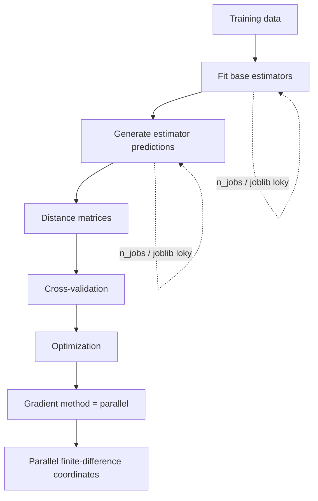

# Parallel Execution

The current COBRA implementation supports parallel execution in two specific
parts of the workflow:

1. fitting and evaluating the **base-estimator pool**;
2. computing a numerical gradient with the optional
   **parallel central-difference** method.

The primary user-facing parameter is:

```python
n_jobs
```

on:

```text
GradientCOBRA
MixCOBRARegressor
CombinedClassifier
```

For base-estimator work, the source delegates parallel execution to
`joblib.Parallel` with the explicit backend:

```text
loky
```

Parallel execution is not applied automatically to every part of COBRA.
Distance computation, kernel transformation, cross-validation loops,
aggregation, and grid candidate evaluation remain separate from this
`n_jobs` pathway in the current source.

---

## Parallelism at a glance



The current source therefore has two distinct parallel mechanisms:

```text
estimator-pool parallelism
    controlled by estimator `n_jobs`

gradient-coordinate parallelism
    selected with gradient_method="parallel"
```

They should not be treated as the same configuration.

---

# User-facing `n_jobs`

The three main COBRA estimators expose:

```python
n_jobs
```

in their constructors.

Current defaults are:

| Estimator | Default `n_jobs` |
| --- | ---: |
| `GradientCOBRA` | `-1` |
| `MixCOBRARegressor` | `1` |
| `CombinedClassifier` | `1` |

This is an important source-level difference.

---

# GradientCOBRA default

The current constructor contains:

```python
GradientCOBRA(
    ...
    n_jobs=-1,
    random_state=None,
)
```

and stores:

```python
self.n_jobs = n_jobs
```

So GradientCOBRA requests parallel estimator-pool execution by default unless
the value is changed.

---

# MixCOBRA default

The current constructor contains:

```python
MixCOBRARegressor(
    ...
    n_jobs=1,
    one_parameter=False,
    random_state=None,
)
```

So MixCOBRA is sequential by default at the package's estimator-pool layer.

---

# CombinedClassifier default

The classifier constructor contains:

```python
CombinedClassifier(
    ...
    n_jobs=1,
    ...
)
```

so it is also sequential by default for estimator fitting and prediction.

---

# Shared estimator-pool helpers

All three estimators use the same utility functions from:

```text
kfc_procedure/cobra/utils/resolve.py
```

The functions are:

```python
fit_estimators()
predict_estimators()
```

These functions implement the package's common estimator-pool parallelism.

---

# Parallel estimator fitting

The relevant signature is:

```python
fit_estimators(
    X,
    y,
    estimators_params=None,
    estimators=None,
    n_jobs=1,
)
```

The function supports estimator specifications as:

```text
string identifiers
(name, params) tuples
pre-built estimator objects
```

---

## Sequential branch

The source checks:

```python
if n_jobs == 1:
    return [
        fit_one(est)
        for est
        in estimators
    ]
```

So:

```python
n_jobs=1
```

does not invoke `joblib.Parallel`.

Each estimator is built and fitted one after another in the current process.

---

# Parallel branch

For every other `n_jobs` value, the source executes:

```python
return Parallel(
    n_jobs=n_jobs,
    backend="loky",
)(
    delayed(
        fit_one
    )(
        est
    )
    for est
    in estimators
)
```

The backend is therefore explicitly:

```text
loky
```

for base-estimator fitting.

---

# Parallel fitting unit of work

The parallelized task is:

```python
fit_one(
    est_spec
)
```

For each estimator specification, the worker:

1. builds or resolves the estimator;
2. calls:

   ```python
   model.fit(
       X,
       y,
   )
   ```

3. returns the fitted estimator object.

So parallelism occurs **across estimators**, not across training rows or
cross-validation folds.

---

# Conceptual execution

For an estimator pool:

```text
estimator A
estimator B
estimator C
estimator D
```

with parallel execution, the package conceptually submits independent fit
tasks:

```text
fit(A, X, y)
fit(B, X, y)
fit(C, X, y)
fit(D, X, y)
```

to Joblib.

Each task receives the same:

```text
X
y
```

training dataset.

---

# Default GradientCOBRA pool

The current default GradientCOBRA estimators are:

```text
linear_regression
ridge_cv
lasso_cv
k_neighbors_regressor
random_forest_regressor
svr
```

With the default:

```python
n_jobs=-1
```

their package-level fit tasks are sent through the parallel Joblib branch.

---

# Default MixCOBRA pool

MixCOBRA's current default pool is:

```text
linear_regression
ridge
lasso
k_neighbors_regressor
random_forest_regressor
svr
```

but its default:

```python
n_jobs=1
```

keeps those six package-level fit tasks sequential.

---

# Default CombinedClassifier pool

The current default classification pool is:

```text
logistic_regression
decision_tree_classifier
svc
k_neighbors_classifier
```

and default:

```python
n_jobs=1
```

keeps fitting sequential.

---

# Parallel prediction generation

The same `n_jobs` value is also used when creating a prediction-space matrix.

The shared helper is:

```python
predict_estimators(
    X,
    estimators,
    n_jobs=1,
)
```

---

## Sequential prediction path

When:

```python
n_jobs == 1
```

the source runs:

```python
preds = [
    predict_one(est)
    for est
    in estimators
]

return np.column_stack(
    preds
)
```

where:

```python
predict_one(
    est
)
```

is:

```python
return est.predict(
    X
)
```

---

# Parallel prediction path

For other `n_jobs` values:

```python
preds = Parallel(
    n_jobs=n_jobs,
    backend="loky",
)(
    delayed(
        predict_one
    )(
        est
    )
    for est
    in estimators
)

return np.column_stack(
    preds
)
```

So prediction generation also uses:

```text
Joblib
loky backend
parallelism across fitted estimators.
```

---

# Prediction-space shape

If there are:

```text
n_samples
```

rows and:

```text
M estimators
```

the result is:

```text
(n_samples, M)
```

because the returned prediction vectors are combined with:

```python
np.column_stack(
    preds
)
```

---

# Estimator order is preserved

The source submits tasks using:

```python
delayed(
    ...
)(
    est
)
for est in estimators
```

and then column-stacks the returned `preds` sequence.

The intended column layout therefore follows the estimator sequence supplied to
the helper.

For example:

```python
estimators=[
    "ridge",
    "lasso",
    "svr",
]
```

corresponds conceptually to prediction columns:

```text
column 0 -> ridge
column 1 -> lasso
column 2 -> svr
```

Parallel execution does not introduce a package-level column-reordering step.

---

# `n_jobs` is used for both fit and predict

For GradientCOBRA:

```python
def _fit_estimators(
    self,
    X_k,
    y_k,
):
    return fit_estimators(
        ...
        n_jobs=self.n_jobs,
    )
```

and:

```python
def _load_predictions(
    self,
    X,
):
    return predict_estimators(
        ...
        n_jobs=self.n_jobs,
    )
```

The same pattern is used in MixCOBRA and CombinedClassifier.

Therefore one estimator-level setting controls both:

```text
base-estimator fitting
base-estimator prediction generation.
```

---

# GradientCOBRA example

Use all Joblib workers according to the value forwarded by the package:

```python
from kfc_procedure.cobra import (
    GradientCOBRA,
)

model = GradientCOBRA(
    n_jobs=-1,
    random_state=42,
)

model.fit(
    X_train,
    y_train,
)
```

Use sequential estimator execution:

```python
model = GradientCOBRA(
    n_jobs=1,
)
```

---

# MixCOBRA example

Enable package-level parallelism explicitly:

```python
from kfc_procedure.cobra import (
    MixCOBRARegressor,
)

model = MixCOBRARegressor(
    n_jobs=-1,
    random_state=42,
)
```

The same value is later used when MixCOBRA calls:

```python
predict_estimators()
```

to construct prediction-space coordinates.

---

# CombinedClassifier example

```python
from kfc_procedure.cobra import (
    CombinedClassifier,
)

classifier = CombinedClassifier(
    n_jobs=-1,
    random_state=42,
)
```

This parallelizes the package-level fit and prediction tasks across the
classifier pool.

---

# What `n_jobs` does not parallelize

The current source does not pass estimator-level `n_jobs` into:

```text
distance matrix calculation
kernel transformation
aggregator calls
K-fold loop construction
grid-search candidate loop
loss evaluation
normalization
data splitting
```

So setting:

```python
n_jobs=-1
```

does not mean the entire COBRA training procedure is parallelized.

---

# Cross-validation remains a separate loop

The COBRA cross-validation objective iterates through:

```python
cv_folds_
```

in normal Python loops.

For example, GradientCOBRA evaluates every stored fold while computing a
candidate bandwidth error.

The current cross-validation classes do not expose a `n_jobs` parameter, and
the main estimator `n_jobs` value is not passed into them.

---

# Grid search remains sequential at the search layer

`GridSearchOptimizer` creates all candidates and loops over them through the
search optimizer's normal candidate-evaluation logic.

The current search optimizer does not use:

```python
joblib.Parallel
```

and does not receive the COBRA estimator's:

```python
n_jobs.
```

Therefore different bandwidth or alpha/beta candidates are not parallelized by
the main estimator `n_jobs` setting.

---

# Distance matrices are not Joblib-parallelized by `n_jobs`

The built-in distance classes implement their own NumPy/SciPy/Numba numerical
paths.

The COBRA estimator's:

```python
n_jobs
```

is not forwarded to:

```python
distance_.matrix(...)
```

in the current source.

---

# Aggregators are not Joblib-parallelized by `n_jobs`

The package's aggregator implementations operate on their supplied arrays
directly.

For example:

```python
WeightedMeanAggregator.aggregate_matrix(...)
```

and:

```python
WeightedVoteAggregator.aggregate_matrix(...)
```

do not accept the estimator's `n_jobs`.

---

# Precomputed prediction mode

When:

```python
as_predictions=True
```

the COBRA estimator skips internal base-estimator fitting.

For GradientCOBRA:

```python
if not self.as_predictions_:
    self.estimators_ = self._fit_estimators(...)
else:
    prediction_space = self.X_l_
```

So package-level estimator-fitting parallelism does not run in this branch.

---

## GradientCOBRA prediction in precomputed mode

Because GradientCOBRA also treats query `X` directly as prediction space when
`as_predictions_` is true, it does not call:

```python
predict_estimators()
```

for those predictions either.

Therefore `n_jobs` has little effect on the estimator-pool stage when using a
fully precomputed GradientCOBRA workflow.

---

# CombinedClassifier precomputed mode

The classifier behaves similarly.

With:

```python
as_predictions=True
```

it skips:

```python
_fit_estimators()
```

and stores:

```python
pred_l_ = X_l_
```

At prediction time it uses the supplied prediction-space matrix directly.

So the package-level `n_jobs` estimator pool is bypassed in this mode.

---

# MixCOBRA precomputed caveat

MixCOBRA also skips base-estimator fitting when:

```python
as_predictions=True.
```

However, its current `predict()` method can still attempt to call:

```python
_load_predictions(
    X
)
```

when `pred_X` is omitted.

That is the precomputed-mode asymmetry documented in:

[Precomputed Predictions](precomputed-predictions.md)

and should not be interpreted as a useful parallel prediction path, because the
required internal estimator pool was skipped during fit.

---

# Parallel gradient computation

The optimizer subsystem contains a second independent parallel mechanism:

```python
parallel_central_difference_gradient()
```

in:

```text
kfc_procedure/cobra/core/optimizers/_utils.py
```

This function parallelizes finite-difference gradient coordinates.

---

# Parallel gradient formula

For parameter coordinate \(i\), central difference computes:

\[
g_i
=
\frac{
f(x+\varepsilon e_i)
-
f(x-\varepsilon e_i)
}{
2\varepsilon}.
\]

Each coordinate can be computed independently.

The source defines:

```python
def compute_i(
    i,
):
    x = p.copy()

    x[i] += eps
    f_plus = objective(
        x
    )

    x[i] -= 2 * eps
    f_minus = objective(
        x
    )

    return (
        f_plus
        -
        f_minus
    ) / (
        2 * eps
    )
```

---

# Joblib use in parallel gradients

The helper returns:

```python
np.array(
    Parallel(
        n_jobs=n_jobs
    )(
        delayed(
            compute_i
        )(
            i
        )
        for i
        in range(
            p.size
        )
    )
)
```

Unlike estimator fitting/prediction, this source call does **not** explicitly
specify:

```python
backend="loky"
```

It leaves backend choice to Joblib's normal behavior.

---

# Select parallel numerical gradients

The unified gradient dispatcher recognizes:

```text
parallel
```

as one of:

```text
central
forward
spsa
complex
parallel
```

So gradient-mode COBRA can request:

```python
optimizer_params={
    "gradient_method": "parallel",
}
```

---

# Gradient example

```python
model = GradientCOBRA(
    optimizer="adam",
    opt_method="grad",
    optimizer_params={
        "gradient_method": "parallel",
        "show_process": False,
    },
)
```

The optimizer then estimates each gradient coordinate through the parallel
central-difference helper.

---

# Default worker count for parallel gradient method

The unified dispatcher accepts:

```python
n_jobs=None
```

and contains:

```python
if method == "parallel":
    return parallel_central_difference_gradient(
        objective,
        params,
        eps,
        n_jobs=(
            -1
            if n_jobs is None
            else n_jobs
        ),
    )
```

So an unspecified gradient worker count becomes:

```text
-1
```

inside the dispatcher.

---

# High-level optimizer does not forward a gradient `n_jobs`

The current `BaseGradientOptimizer.gradient()` path calls
`compute_gradient()` without providing an explicit:

```python
n_jobs
```

argument.

Therefore the standard:

```python
gradient_method="parallel"
```

path uses the dispatcher's:

```text
n_jobs=-1
```

fallback.

---

## Important separation

This means:

```python
model.n_jobs
```

does **not** control the parallel finite-difference worker count.

For example:

```python
GradientCOBRA(
    n_jobs=1,
    optimizer="adam",
    opt_method="grad",
    optimizer_params={
        "gradient_method": "parallel",
    },
)
```

still reaches the gradient utility with its independent default worker setting.

!!! important "Two independent controls"

    The current source has no shared worker-budget parameter connecting:

    ```text
    estimator-pool n_jobs
    ```

    and:

    ```text
    parallel-gradient n_jobs.
    ```

---

# Gradient parallelism is across parameters

For one-dimensional GradientCOBRA:

```text
x = [bandwidth]
```

there is only one finite-difference coordinate.

So the parallel gradient method has only one coordinate task to submit.

There is little coordinate-level parallel work available at dimension one.

---

# Two-dimensional MixCOBRA

In ordinary two-parameter MixCOBRA gradient mode:

```text
x = [alpha, beta]
```

the parallel helper has two coordinate tasks:

```text
d/d alpha
d/d beta
```

Each task performs two complete objective evaluations.

So the maximum coordinate-level task count is only two in that standard
configuration.

---

# Objective evaluations are expensive

Every finite-difference objective call can itself run:

```text
kernel transformation
cross-validation folds
aggregation
loss evaluation
```

Therefore parallel gradient execution parallelizes expensive complete objective
evaluations across parameter coordinates.

It does not parallelize the individual CV folds within each objective call.

---

# Nested parallelism

The current source does not contain logic that coordinates or prevents nested
parallel execution.

For example, a gradient objective may operate on a fitted model whose
prediction-space construction previously used:

```python
n_jobs=-1.
```

Likewise, individual scikit-learn estimators can have their own constructor
parameters that control internal parallelism.

The package does not inspect or rewrite those estimator-specific settings.

---

## Source-level boundary

`fit_estimators()` forwards model constructor parameters through the estimator
factory, while package-level:

```python
n_jobs
```

controls only how many estimator tasks Joblib executes.

It does not automatically change an estimator's own:

```text
n_jobs
threads
workers
```

constructor parameter.

---

# Estimator-specific parallelism

You can separately configure estimators that expose their own parallel
parameter through:

```python
estimators_params.
```

For example, if an estimator supports an `n_jobs` constructor parameter:

```python
model = GradientCOBRA(
    n_jobs=2,
    estimators_params={
        "random_forest_regressor": {
            "n_jobs": 1,
        },
    },
)
```

The two values have different roles:

```text
GradientCOBRA n_jobs=2
    package-level parallel estimator tasks

random_forest_regressor n_jobs=1
    estimator-internal setting forwarded to that model.
```

The exact effect of an estimator-specific parameter depends on that estimator's
implementation.

---

# Factory parameter lookup

For string estimator specifications:

```python
EstimatorFactory.create(
    est_spec,
    **estimators_params.get(
        est_spec,
        {}
    )
)
```

is used.

So the parameter dictionary key should match the estimator specification string
used in the pool.

---

# Tuple estimator specifications

`fit_estimators()` also accepts:

```python
(
    name,
    params,
)
```

and resolves:

```python
EstimatorFactory.create(
    name,
    **(
        params
        or {}
    ),
)
```

This lets parameters travel with an individual estimator specification.

Example:

```python
estimators=[
    (
        "random_forest_regressor",
        {
            "n_estimators": 300,
            "n_jobs": 1,
        },
    ),
    "ridge",
]
```

---

# Pre-built estimator objects

If an estimator specification is neither a tuple nor a string:

```python
return est_spec
```

The same object is then fitted in the corresponding worker task.

Parallel execution still occurs at the `fit_one(est_spec)` task level when
package-level:

```python
n_jobs != 1.
```

---

# Process-based estimator execution

For fit and prediction helpers, the package explicitly requests:

```python
backend="loky"
```

from Joblib.

This is the exact backend choice in the current source.

Operationally, custom/pre-built estimator objects therefore need to be usable
through that Joblib execution path.

If a custom object cannot be serialized by the selected backend, execution may
fail outside the package's own estimator logic.

This serialization consequence comes from the selected Joblib backend rather
than from a custom `kfc_procedure` serializer.

---

# No package fallback from parallel to sequential

The current source does not wrap:

```python
Parallel(...)
```

in a package-level `try/except` that retries sequentially.

So if the Joblib parallel branch fails, `fit_estimators()` or
`predict_estimators()` does not automatically rerun with:

```python
n_jobs=1.
```

---

# No package-level parallel error aggregation

Every parallel worker runs the ordinary estimator:

```python
fit()
```

or:

```python
predict()
```

call.

The helper does not catch and convert errors into per-estimator result objects.

A worker failure therefore propagates through the Joblib call rather than being
stored beside successful estimators.

---

# Reproducibility and parallel execution

The package-level Joblib helpers do not modify:

```python
random_state
```

inside individual estimators.

Reproducibility therefore depends on how each estimator was configured by its
factory parameters.

The high-level COBRA `random_state` is used by other components such as data
splitting and CV, but the shared `fit_estimators()` helper does not inject that
value itself.

---

## Important distinction

This code:

```python
GradientCOBRA(
    random_state=42,
    n_jobs=-1,
)
```

does not mean that every default base estimator necessarily receives:

```python
random_state=42.
```

The parallel helper simply builds each estimator from its normal factory
specification and parameters.

---

# Compare with KFC F-Step

The top-level KFC `FStep` has its own local-model training loop.

The current source does not expose an F-Step:

```python
n_jobs
```

parameter comparable to the COBRA estimator-pool utility.

Therefore the parallel behavior documented here applies specifically to the
COBRA estimator-pool helpers and the gradient utility, not automatically to
all KFC K-Step/F-Step work.

---

# Parallelism in `GradientCOBRA.fit()`

A normal feature-based fit can use package-level parallelism twice before
optimization:

```text
1. fit base estimators on X_k
2. generate their predictions on X_l.
```

The rest of fitting then proceeds from the generated prediction matrix.

---

# Parallelism in `GradientCOBRA.predict()`

In ordinary feature mode, prediction calls:

```python
self._load_predictions(
    X
)
```

which uses:

```python
predict_estimators(
    ...,
    n_jobs=self.n_jobs,
)
```

So every final prediction request can invoke Joblib parallel execution across
the fitted estimator pool.

---

# Parallelism in `CombinedClassifier.predict()`

The classifier follows the same pattern in ordinary feature mode:

```text
query X
    ↓
parallel hard prediction by base classifiers
    ↓
prediction-space matrix
    ↓
distance / kernel / weighted vote.
```

---

# Parallelism in `MixCOBRA.predict()`

Ordinary MixCOBRA uses:

```python
pred_X = self._load_predictions(
    X
)
```

when `pred_X` is not supplied.

That prediction-space generation uses the estimator's configured:

```python
n_jobs.
```

If you supply:

```python
pred_X=
```

directly, that internal prediction helper is bypassed.

---

# `pred_X` can bypass prediction parallelism

For MixCOBRA:

```python
model.predict(
    X,
    pred_X=P_test,
)
```

does not call:

```python
predict_estimators()
```

because `pred_X` is already present.

So the package-level prediction `n_jobs` setting is not involved in generating
that supplied matrix.

---

# Timing estimator fitting

A simple timing comparison:

```python
from time import perf_counter

start = perf_counter()

model = GradientCOBRA(
    n_jobs=1,
)

model.fit(
    X_train,
    y_train,
)

elapsed = (
    perf_counter()
    -
    start
)

print(
    elapsed
)
```

Compare with:

```python
start = perf_counter()

model = GradientCOBRA(
    n_jobs=-1,
)

model.fit(
    X_train,
    y_train,
)

elapsed_parallel = (
    perf_counter()
    -
    start
)

print(
    elapsed_parallel
)
```

This measures the whole fit, not only estimator-pool work, so differences also
include fixed sequential stages.

---

# Timing prediction-space generation directly

After fitting an estimator pool:

```python
from time import perf_counter

start = perf_counter()

P = predict_estimators(
    X_test,
    model.estimators_,
    n_jobs=1,
)

sequential_time = (
    perf_counter()
    -
    start
)
```

Then:

```python
start = perf_counter()

P_parallel = predict_estimators(
    X_test,
    model.estimators_,
    n_jobs=-1,
)

parallel_time = (
    perf_counter()
    -
    start
)
```

Verify numerical agreement:

```python
import numpy as np

print(
    np.allclose(
        P,
        P_parallel,
    )
)
```

for numeric regression predictions.

---

# Small estimator pools

The default pools contain only a small number of estimators:

```text
GradientCOBRA
    6

MixCOBRA
    6

CombinedClassifier
    4
```

Therefore the number of package-level independent tasks is bounded by the
estimator-pool size.

Parallel overhead can be significant when individual fit/predict tasks are very
small.

The source itself does not benchmark or automatically decide whether parallel
execution is worthwhile.

---

# Custom larger estimator pool

You can increase the number of independent package-level tasks by supplying a
larger estimator list.

```python
model = GradientCOBRA(
    estimators=[
        "linear_regression",
        "ridge",
        "lasso",
        "ridge_cv",
        "lasso_cv",
        "k_neighbors_regressor",
        "random_forest_regressor",
        "svr",
    ],
    n_jobs=-1,
)
```

Every list entry becomes one `fit_one()` task.

---

# Duplicate estimator specifications

The shared helper iterates the supplied list directly.

If the same estimator specification appears multiple times, the helper submits
multiple tasks and the returned list can contain multiple independently built
instances for string/tuple specifications.

The package does not deduplicate the estimator list before parallel fitting.

---

# Memory considerations

Every estimator task receives access to the same training arrays:

```text
X
y.
```

The current source does not implement package-specific shared-memory controls
or memory-mapping configuration around Joblib.

Likewise, every prediction task receives the same query matrix:

```text
X.
```

Memory behavior is therefore delegated to Joblib and the underlying numerical
libraries.

---

# Parallel gradient memory

The parallel finite-difference helper captures:

```python
p
objective
eps
```

and runs one task per parameter coordinate.

Each task creates:

```python
x = p.copy()
```

before evaluating the objective.

For the normal one- or two-parameter COBRA optimization cases, the parameter
vector itself is tiny; most computational cost lies inside the objective.

---

# No parallel grid search

If your main cost is a very large two-parameter MixCOBRA grid, changing:

```python
n_jobs
```

does not parallelize those:

```text
alpha × beta
```

candidate evaluations in the current source.

For example, a:

```text
300 × 300
```

grid remains an exhaustive search at the optimizer layer.

See:

[Optimization](../cobra/optimization.md)

for the exact candidate-count behavior.

---

# No parallel CV-fold evaluation

Likewise, each objective loops through the stored CV folds sequentially.

The current source contains no:

```python
Parallel(
    ...
)(
    delayed(
        evaluate_fold
    )
    ...
)
```

path for fold evaluation.

---

# Parallel gradient does not parallelize grid mode

The setting:

```python
optimizer_params={
    "gradient_method": "parallel",
}
```

is relevant only when a gradient optimizer actually calls numerical gradient
computation.

With:

```python
opt_method="grid"
```

the gradient utility is not used.

---

# Kernel compatibility can disable gradient path

GradientCOBRA and MixCOBRA check:

```python
kernel_.requires_grad
```

before using gradient optimization.

If a non-gradient kernel is configured, requested gradient mode falls back to
grid mode.

In that case:

```python
gradient_method="parallel"
```

does not create parallel finite-difference work because the gradient optimizer
is not used.

---

# Example: package-level and gradient parallelism

```python
model = GradientCOBRA(
    n_jobs=-1,
    optimizer="adam",
    opt_method="grad",
    optimizer_params={
        "gradient_method": "parallel",
        "show_process": False,
    },
)
```

This configuration enables:

```text
package-level estimator-pool Joblib execution

and

parallel numerical gradient coordinate evaluation.
```

They are separate stages and separate Joblib calls.

---

# Avoid assuming one global worker budget

The current source does not contain a central scheduler that coordinates:

```text
base-estimator parallelism
gradient parallelism
underlying estimator threads
NumPy / BLAS threads
SciPy internals
Numba parallel loops
```

So `n_jobs` should be understood narrowly as the value forwarded to the
shared estimator-pool helper.

---

# Numba parallelism in Hamming distance

The current `HammingDistance` implementation uses a Numba function decorated
with:

```python
parallel=True
```

for its primary distance-matrix path.

That parallel behavior is independent of COBRA's estimator:

```python
n_jobs
```

parameter.

So CombinedClassifier can involve another form of library-level parallelism
inside Hamming distance without the high-level `n_jobs` value being passed to
that component.

---

# Numerical-library parallelism

Several base estimators and NumPy/SciPy operations may themselves use threaded
numerical libraries.

The `kfc_procedure` source does not set:

```text
OMP_NUM_THREADS
MKL_NUM_THREADS
OPENBLAS_NUM_THREADS
```

or similar environment variables.

Thread control at that level is outside the current package implementation.

---

# Debugging package-level parallelism

## Inspect `n_jobs`

```python
print(
    model.n_jobs
)
```

---

## Confirm estimator count

```python
print(
    len(
        model.estimators_
    )
)
```

The number of independent fit/predict tasks equals the number of estimator
entries.

---

## Inspect estimator order

```python
for i, estimator in enumerate(
    model.estimators_
):
    print(
        i,
        estimator,
    )
```

This order corresponds to the prediction-space column order generated by:

```python
predict_estimators().
```

---

# Debug sequential behavior

Set:

```python
n_jobs=1
```

to force the explicit sequential branch in:

```text
fit_estimators()
predict_estimators().
```

This can be useful when isolating whether a problem is specific to the Joblib
parallel path.

---

# Debug custom estimators

If a custom estimator works with:

```python
n_jobs=1
```

but fails with another `n_jobs` value, remember that the parallel path uses:

```python
backend="loky".
```

The current package does not contain a fallback backend selection mechanism.

---

# Debug parallel gradient selection

Inspect:

```python
print(
    model.optimizer_.gradient_method
)
```

Expected:

```text
parallel
```

when configured and when a gradient optimizer is actually resolved.

---

# Debug effective optimization method

For GradientCOBRA:

```python
print(
    model.optimization_outputs_[
        "method"
    ]
)
```

If a non-gradient kernel forced a fallback, this can show:

```text
grid
```

even though:

```python
opt_method="grad"
```

was configured.

---

# Parallel execution checklist

Before increasing concurrency:

```text
1. identify whether the expensive stage is estimator fitting/prediction;
2. remember that CV and grid candidate loops are not covered by model.n_jobs;
3. check whether base estimators have their own parallel parameters;
4. check whether gradient_method="parallel" is independently active;
5. use n_jobs=1 when diagnosing process/backend issues;
6. keep prediction-column ordering identical across workflows.
```

---

# Current source summary

| Component | Parallel? | Control | Backend / mechanism |
| --- | :---: | --- | --- |
| base-estimator fitting | Yes | estimator `n_jobs` | Joblib `loky` |
| base-estimator prediction | Yes | estimator `n_jobs` | Joblib `loky` |
| automatic data splitting | No package Joblib path | — | ordinary code |
| distance matrices | not via estimator `n_jobs` | component-specific | NumPy/SciPy/Numba |
| CV fold loop | No | — | Python loop |
| grid candidate loop | No | — | search loop |
| regression aggregation | No Joblib path | — | NumPy/Python |
| classification aggregation | No Joblib path | — | NumPy/Python |
| numerical gradient coordinates | Yes | `gradient_method="parallel"` | Joblib |
| Hamming calculation | independent parallel path | Numba internals | `parallel=True` |

---

# Default `n_jobs` quick reference

| Estimator | Default |
| --- | ---: |
| `GradientCOBRA` | `-1` |
| `MixCOBRARegressor` | `1` |
| `CombinedClassifier` | `1` |

---

# What changes when `n_jobs=1`

The source explicitly chooses list comprehensions:

```python
[
    fit_one(est)
    for est in estimators
]
```

and:

```python
[
    predict_one(est)
    for est in estimators
]
```

instead of constructing a Joblib executor.

This is the clearest source-supported way to force sequential package-level
estimator execution.

---

# What changes when `n_jobs != 1`

Both helpers switch to:

```python
Parallel(
    n_jobs=n_jobs,
    backend="loky",
)
```

for estimator-pool tasks.

The source does not special-case:

```text
0
negative values other than 1
values larger than estimator count.
```

Those values are forwarded to Joblib.

Their exact acceptance and worker semantics therefore follow Joblib rather than
custom validation in `kfc_procedure`.

---

# No `n_jobs` validation

The current constructors simply assign:

```python
self.n_jobs = n_jobs
```

and the helpers forward the value.

There is no package-level validation requiring:

```text
integer >= 1
or -1.
```

Invalid values are handled by the underlying Joblib call if the parallel branch
is reached.

---

# Mental model

!!! quote ""

    **The current COBRA `n_jobs` setting parallelizes the ensemble members,
    not the entire COBRA algorithm.**

For ordinary feature-based fitting:

\[
\boxed{
\text{estimator specifications}
\rightarrow
\text{parallel fit}
\rightarrow
\text{parallel prediction columns}
\rightarrow
\text{sequential COBRA geometry/optimization}
}
\]

For optional gradient-coordinate parallelism:

\[
\boxed{
x
\rightarrow
\{f(x+\varepsilon e_i),f(x-\varepsilon e_i)\}_{i}
\rightarrow
\text{parallel coordinate gradients}
\rightarrow
\nabla f(x)
}
\]

These are independent execution paths in the current source and do not share a
single package-wide concurrency controller.

