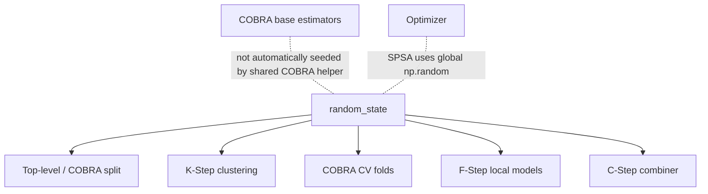

# Reproducibility

Reproducibility in `kfc_procedure` depends on several independent sources of
randomness.

The most important user-facing control is:

```python
random_state
```

but a single seed does **not** automatically control every stochastic component
in the package.

The current source uses several different random-number APIs:

```text
sklearn.utils.check_random_state
np.random.RandomState
np.random.default_rng
sklearn.model_selection.train_test_split
global np.random
```

and different components receive the estimator seed in different ways.

This page documents the current source behavior so you can make experiments as
repeatable as possible.

---

## Reproducibility map



The estimator seed is propagated to several structural components, but not to
all model-specific or optimizer-specific randomness.

---

# What `random_state` controls

At a high level, the current source uses `random_state` for:

```text
KFC's top-level train/calibration split
K-Step Bregman clustering
COBRA automatic overlap/holdout splitting
COBRA K-fold cross-validation
some F-Step local-model construction
some C-Step combiner construction
some wrapped COBRA components
```

It does **not** provide one package-wide global RNG object shared by all of
those components.

---

# Reproducibility in `KFCProcedure`

The top-level constructor stores:

```python
self.random_state = random_state
```

and passes it into:

```text
train/test splitting
K-Step
F-Step
C-Step.
```

---

## KFC data split

`KFCProcedure.fit()` performs:

```python
X_k, X_l, y_k, y_l = train_test_split(
    X,
    y,
    test_size=0.5,
    random_state=self.random_state,
    stratify=(
        y
        if self.task == "classification"
        else None
    ),
)
```

So a fixed:

```python
random_state
```

reproduces the same top-level KFC split for the same data order and compatible
scikit-learn behavior.

---

## Classification stratification

For:

```python
task="classification"
```

the top-level split uses:

```python
stratify=y
```

whereas regression uses:

```python
stratify=None.
```

Therefore the KFC classification split has a different sampling constraint from
the standalone COBRA automatic splitter.

---

# K-Step reproducibility

KFC passes the same seed into:

```python
KStep(
    random_state=self.random_state,
)
```

KStep then forwards that seed to each:

```python
BregmanKMeans
```

instance it constructs.

---

# BregmanKMeans RNG

Inside:

```python
BregmanKMeans.fit()
```

the current source creates:

```python
rng = check_random_state(
    self.random_state
)
```

from scikit-learn.

This produces the RNG used by the internal clustering initialization and
reinitialization logic.

---

## Multiple initializations

`BregmanKMeans` can run multiple initialization attempts through:

```python
n_init
```

The current default is:

```text
10
```

unless an explicit initial centroid matrix is provided.

The same seeded RNG object is reused across those attempts.

For a fixed seed and identical input ordering, this makes the sequence of
initializations repeatable.

---

# Explicit clustering initialization

If:

```python
init
```

is passed directly to:

```python
BregmanKMeans.fit(
    X,
    init=...
)
```

the source sets:

```python
n_init = 1
```

for that call.

That removes random centroid initialization from the clustering fit itself,
although other parts of a surrounding pipeline can still be stochastic.

---

# K-Step fitted results to compare

For reproducibility checks, useful fitted attributes include:

```python
model.kstep_.clusters_
```

and for each underlying Bregman model:

```text
cluster_centers_
labels_
inertia_
n_iter_.
```

If these differ between otherwise identical runs, later local-model and
combination stages can also differ.

---

# F-Step seed propagation

KFC creates:

```python
FStep(
    ...,
    random_state=self.random_state,
)
```

When the configured local model is a **string**, FStep builds:

```python
params = dict(
    self.local_model_params
)

if "random_state" not in params:
    params[
        "random_state"
    ] = self.random_state
```

then calls:

```python
LocalModelFactory.create(
    name,
    **params,
)
```

---

## Explicit local-model seed wins

If you provide:

```python
local_model_params={
    "random_state": 123,
}
```

FStep does not overwrite it with the KFC-level seed.

So:

```text
local model random_state
```

takes precedence when explicitly present.

---

# `SklearnLocalModel` parameter filtering

String-based scikit-learn local models are typically wrapped by:

```python
SklearnLocalModel
```

which inspects the estimator constructor signature and retains supported
arguments.

Therefore the injected:

```python
random_state
```

is passed through only when the target estimator accepts it.

For deterministic estimators without a random-state parameter, the key can be
filtered out.

---

# F-Step custom object caveat

If:

```python
local_model
```

is a pre-built non-string estimator object, FStep's `_resolve()` returns that
object directly.

The source does **not** clone it and does not inject the KFC seed.

Therefore reproducibility of that custom object depends on how you configured
the object itself.

---

## Same object is reused

The current F-Step source reuses the same non-string local-model object across
cluster fits rather than cloning a fresh copy per cluster.

This is primarily a model-construction behavior, but it also matters for
reproducibility because state is repeatedly overwritten on the same object.

---

# C-Step seed propagation

KFC also constructs:

```python
CStep(
    ...,
    random_state=self.random_state,
)
```

For string-based combiners, CStep performs:

```python
params = dict(
    self.combiner_params
)

if "random_state" not in params:
    params[
        "random_state"
    ] = self.random_state
```

and passes those parameters into:

```python
CombinerFactory.create(...)
```

---

# C-Step constructor compatibility caveat

Not every built-in combiner constructor accepts:

```python
random_state.
```

Because CStep injects it for every string-based combiner when absent, some
string combiner paths can fail with an unexpected keyword argument.

This is a current source issue rather than a reproducibility guarantee.

Pre-instantiated combiner objects bypass that injection.

---

# Standalone COBRA reproducibility

The standalone estimators:

```text
GradientCOBRA
MixCOBRARegressor
CombinedClassifier
```

also expose:

```python
random_state
```

and use it mainly for:

```text
automatic splitting
K-fold CV construction
some optimizer/component configuration.
```

---

# Automatic COBRA split

The shared:

```python
resolve_training_context()
```

creates:

```python
SplitterFactory.create(
    "split_overlap",
    split_ratio=split_ratio,
    overlap=overlap,
    random_state=random_state,
)
```

when no explicit aggregation dataset or precomputed prediction matrix is
provided.

---

# OverlapSplitter RNG

The default automatic splitter uses:

```python
rng = np.random.default_rng(
    self.random_state
)
```

and then:

```python
rng.shuffle(
    shuffled
)
```

So the first-level standalone COBRA split is repeatable for a fixed seed and
identical row order.

---

# Different RNG API from KFC clustering

This matters if you compare random sequences across components.

`OverlapSplitter` uses:

```text
np.random.default_rng
```

while `BregmanKMeans` uses:

```text
sklearn check_random_state
```

which is based on the older `RandomState` style.

Even with the same integer seed, these generators do not produce the same
random sequence.

The seed is a reproducibility control **within each component**, not a promise
that every component draws matching numbers.

---

# RandomHoldoutSplitter

The optional holdout splitter stores:

```python
random_state
```

and passes it into:

```python
train_test_split(
    indices,
    test_size=self.calibration_size,
    random_state=self.random_state,
    shuffle=True,
)
```

So its partition is reproducible for a fixed seed.

---

# COBRA K-fold reproducibility

The main standalone COBRA estimators build:

```python
KFoldCV(
    n_splits=self.n_cv,
    shuffle=True,
    random_state=self.random_state,
)
```

through the factory.

---

## KFoldCV RNG

The current custom K-fold implementation uses:

```python
rng = np.random.RandomState(
    self.random_state
)
```

and:

```python
indices = rng.permutation(
    indices
)
```

when shuffling is enabled.

This is another RNG API distinct from the overlap splitter's
`default_rng`.

---

# Fold assignment is deterministic after permutation

Once the index permutation is generated, the source distributes indices
round-robin:

```python
folds[
    i % self.n_splits
].append(
    idx
)
```

So the combination of:

```text
input row order
n_splits
shuffle setting
random_state
```

determines the current fold assignment.

---

# Stored folds

The main estimators materialize CV folds in:

```python
cv_folds_
```

You can compare them directly across runs.

Example:

```python
for fold in model.cv_folds_:
    print(
        fold.fold_id,
        fold.train_idx,
        fold.eval_idx,
    )
```

---

# StratifiedKFoldCV uses another RNG API

The registered stratified cross-validator uses:

```python
rng = np.random.default_rng(
    self.random_state
)
```

and shuffles each class-specific index array.

So its sequence differs from the custom ordinary KFoldCV even when both receive
the same integer seed.

The main COBRA estimators currently hard-code ordinary `kfold`, so this matters
mostly when using or extending the lower-level CV components directly.

---

# TimeSeriesCV is deterministic

The current time-series cross-validator does not shuffle data and has no
`random_state` parameter.

For a fixed row order, `n_splits`, and `test_size`, it produces deterministic
expanding windows.

---

# Explicit aggregation data improve split reproducibility

Supplying:

```python
X_l=
y_l=
```

bypasses the automatic first-level COBRA splitter.

So if you preserve the exact external split arrays or row indices, the
train/calibration boundary becomes independent of the estimator's
`random_state`.

Other stochastic components, such as CV folds or base estimators, may still
vary.

---

# Precomputed predictions remove estimator-pool randomness

With:

```python
as_predictions=True
```

GradientCOBRA and CombinedClassifier skip internal base-estimator fitting.

This can remove a major source of stochastic variation when the prediction
matrix itself is fixed.

However, internal cross-validation and optimizer behavior can still depend on
other settings.

---

# COBRA base estimators are not globally reseeded

The shared helper:

```python
fit_estimators()
```

builds estimators from their specification and parameters, but does not
automatically inject the parent COBRA estimator's:

```python
random_state
```

into every base estimator.

This is a crucial current source detail.

---

## Example

This:

```python
GradientCOBRA(
    random_state=42,
)
```

does not guarantee that every stochastic estimator in its default pool is
constructed with:

```python
random_state=42.
```

If a base estimator needs its own fixed seed, pass it through:

```python
estimators_params.
```

---

# Configure estimator-specific seeds

Example:

```python
model = GradientCOBRA(
    random_state=42,
    estimators_params={
        "random_forest_regressor": {
            "random_state": 42,
        },
    },
)
```

For several stochastic estimators:

```python
model = GradientCOBRA(
    random_state=42,
    estimators_params={
        "random_forest_regressor": {
            "random_state": 42,
        },
        "some_other_estimator": {
            "random_state": 42,
        },
    },
)
```

Only parameters supported by each estimator constructor should be supplied.

---

# Tuple estimator specifications

The shared estimator helper also supports:

```python
(
    name,
    params,
)
```

so a seed can travel with the individual specification:

```python
estimators=[
    (
        "random_forest_regressor",
        {
            "random_state": 42,
        },
    ),
    "ridge",
]
```

---

# Pre-built estimator objects

If you pass an already-created estimator object, the COBRA helper uses that
object directly.

Its reproducibility depends on its own configuration.

The parent COBRA `random_state` is not automatically written into the object.

---

# Parallel execution and reproducibility

The package can fit and predict base estimators in parallel using Joblib.

For current built-in helper logic:

```text
n_jobs=1
    -> sequential list comprehension

n_jobs != 1
    -> Joblib Parallel with backend="loky".
```

Parallel execution does not automatically reseed base estimators.

So reproducibility still depends on the estimators' own deterministic behavior
and seed configuration.

---

# Prediction column order

The shared prediction helper uses:

```python
np.column_stack(
    preds
)
```

over predictions returned in estimator-list order.

To reproduce prediction-space geometry, preserve:

```text
the estimator list
its ordering
its parameters.
```

A different column order changes distances even when the same models are
present.

---

# Store estimator specifications

For repeatable experiments, keep an explicit ordered list:

```python
estimators = [
    "linear_regression",
    "ridge",
    "random_forest_regressor",
    "svr",
]
```

and a matching parameter dictionary:

```python
estimators_params = {
    "random_forest_regressor": {
        "random_state": 42,
    },
}
```

Do not rely on an unordered external configuration source to reconstruct the
prediction-space columns.

---

# Optimization reproducibility

Grid search is deterministic when its candidate sequence and objective are
deterministic.

The current grid optimizer enumerates:

```python
itertools.product(
    *values
)
```

and evaluates candidates in that order.

---

# Grid-search ties

If multiple candidates have exactly the same minimum risk, the source selects
the middle matching candidate index:

```python
ids[
    len(ids) // 2
]
```

This tie rule is deterministic for a fixed candidate order.

---

# Preserve candidate ordering

Because parameter-vector meaning follows dictionary insertion order when the
grid is built, preserve the construction order of custom multi-parameter grids.

For two-parameter MixCOBRA, the intended order is:

```text
alpha
beta.
```

A different mapping order can change how candidate vectors are interpreted.

---

# Default generated grids

When custom candidate arrays are absent, the current source uses deterministic
NumPy grids such as:

```python
np.linspace(
    0.001,
    10.0,
    max_iter,
)
```

So the default grid itself contains no randomness.

---

# Gradient optimization

The deterministic status of gradient optimization depends on the configured
gradient estimator.

Current methods are:

```text
central
forward
spsa
complex
parallel
```

---

# Deterministic numerical gradient methods

For a deterministic objective, these source methods are normally deterministic:

```text
central
forward
complex
parallel
```

The parallel variant changes execution strategy but computes the same
coordinate-wise central-difference formula.

---

# SPSA is a reproducibility exception

The current SPSA helper uses:

```python
delta = np.random.choice(
    [-1.0, 1.0],
    size=p.shape,
)
```

from NumPy's **global random state**.

It does not accept:

```python
random_state
```

and is not seeded from:

```python
GradientCOBRA.random_state
```

or:

```python
MixCOBRARegressor.random_state.
```

!!! warning "Current source limitation"

    A fixed estimator `random_state` does not make
    `gradient_method="spsa"` reproducible by itself.

---

# Reproducing SPSA manually

If you choose to use the current SPSA implementation and need repeatable global
NumPy draws, the source itself does not provide a dedicated estimator argument
for that seed.

The observable implementation uses the global:

```python
np.random
```

state.

A more robust package-level solution would require a source change to pass a
dedicated RNG or seed into the SPSA helper.

This documentation does not assume such a change exists today.

---

# Gradient initialization

The high-level GradientCOBRA path supplies:

```python
init_param=np.array([
    1.0
])
```

and two-parameter MixCOBRA supplies:

```python
np.array([
    1.0,
    1.0,
])
```

so those starting points are deterministic.

---

# Learning-rate schedules

The current learning-rate schedules are deterministic mathematical functions of
iteration count and the initial gradient norm.

Therefore they do not introduce randomness themselves.

---

# Randomness from the objective still matters

Even a deterministic optimizer becomes non-reproducible if the objective
changes from call to call.

For COBRA, that can happen if stochastic components are refitted between
objective evaluations.

The current optimization path normally works with already-fitted estimators,
stored calibration geometry, and stored CV folds, so it does not refit the base
estimator pool on every optimization step.

That design helps keep the objective stable within one fitted run.

---

# Random state in GradientCOBRA

A single:

```python
GradientCOBRA(
    random_state=42,
)
```

currently influences at least:

```text
automatic first-level splitter
KFoldCV construction
optimizer parameter dictionaries where forwarded.
```

It does not automatically seed every base estimator or SPSA.

---

# Random state in MixCOBRA

Similarly:

```python
MixCOBRARegressor(
    random_state=42,
)
```

is passed into:

```text
automatic split
KFoldCV
optimizer creation
```

but base-estimator and SPSA reproducibility remain separate concerns.

---

# Random state in CombinedClassifier

`CombinedClassifier.random_state` is used for:

```text
automatic split
KFoldCV
optimizer configuration.
```

Its base classifier pool must still be considered separately if any configured
classifier is stochastic.

---

# Reproducibility with custom split data

If you create a split externally, save the indices.

Example:

```python
np.save(
    "train_idx.npy",
    train_idx,
)

np.save(
    "cal_idx.npy",
    cal_idx,
)
```

Then reconstruct:

```python
X_train = X[
    train_idx
]

y_train = y[
    train_idx
]

X_cal = X[
    cal_idx
]

y_cal = y[
    cal_idx
]
```

and fit with:

```python
model.fit(
    X_train,
    y_train,
    X_l=X_cal,
    y_l=y_cal,
)
```

This is more robust than relying only on a remembered random seed if external
data ordering might later change.

---

# Data order is part of reproducibility

A fixed seed does not compensate for changing input row order.

Several random splitters begin with:

```python
indices = np.arange(
    n
)
```

and then shuffle those indices.

If the rows associated with those indices change, the same shuffled index
sequence selects different observations.

Preserve both:

```text
seed
input ordering.
```

---

# Feature order is part of reproducibility

Distance-based COBRA behavior depends on coordinate order and meaning.

For precomputed predictions, preserve model-column order.

For raw input features, preserve feature order and preprocessing.

The package often converts tabular data to NumPy arrays, so external DataFrame
column names are not a persistent source of alignment inside the fitted model.

---

# Precomputed prediction matrices

For reproducible precomputed workflows, save:

```text
P_train
P_test
target vectors
prediction-source ordering
upstream model metadata.
```

Example:

```python
np.save(
    "P_train.npy",
    P_train,
)

np.save(
    "P_test.npy",
    P_test,
)
```

and separately record:

```python
prediction_sources = [
    "ridge",
    "random_forest",
    "svr",
]
```

---

# Prediction-space width affects normalization

GradientCOBRA and MixCOBRA scale prediction space using a denominator that
contains:

```text
M = number of prediction columns.
```

So adding, removing, or reordering estimator columns can change more than just
the raw geometry.

It can also change the normalization constant.

Preserve the exact estimator/prediction-space definition across runs.

---

# Preserve normalization configuration

GradientCOBRA reproducibility depends on:

```text
norm_constant
prediction-space width
the main y array.
```

MixCOBRA depends on:

```text
norm_constant_x
norm_constant_y
prediction-space width
main X/y arrays.
```

Record those values explicitly if they differ from defaults.

---

# Explicit calibration arrays and normalization

The current source computes some normalization constants from the main `X` or
`y` fit arguments even when explicit `X_l/y_l` calibration data are supplied.

So reproducibility requires preserving both:

```text
training-side data
calibration-side data.
```

Changing only the training target scale can change the normalized calibration
prediction geometry.

---

# Loss configuration

The optimizer's selected parameter can change when:

```text
loss
loss_params
```

change.

For example:

```text
MSE
MAE
Huber
Quantile
```

produce different CV objectives.

Record the exact configured loss and parameters.

---

# Kernel configuration

Preserve:

```text
kernel
kernel_params
```

because the same distances can produce different weights.

Also preserve the adapter-related settings:

```text
bandwidth candidates
alpha candidates
beta candidates
opt_method
optimizer.
```

---

# Distance configuration

Preserve:

```text
distance
distance_params
```

including parameters such as:

```python
p
```

for Minkowski distance.

Different geometry changes CV scores and selected optimization parameters even
with identical random seeds.

---

# Cross-validation configuration

At minimum, preserve:

```text
n_cv
random_state.
```

For lower-level custom CV use, also preserve:

```text
CV class
shuffle behavior
test_size
other constructor parameters.
```

---

# Number of folds and data size

Changing:

```python
n_cv
```

changes fold membership and therefore the objective.

Even with the same seed, a different fold count gives a different optimization
problem.

---

# Software versions matter

The project source relies on:

```text
NumPy
SciPy
scikit-learn
Joblib
Numba
pandas
```

in different components.

The source does not pin runtime versions inside fitted model objects.

For repeatable experiments across machines or time, preserve the environment
outside the estimator.

Examples include:

```text
requirements file
lock file
conda environment
container image
package version metadata.
```

---

# Floating-point reproducibility

The source performs many floating-point operations:

```text
distance matrices
kernel transforms
means
dot products
optimizer finite differences.
```

The package does not promise bit-for-bit identical floating-point results
across all hardware, BLAS libraries, thread counts, or dependency versions.

Use tolerance-based comparisons when validating numeric results:

```python
np.allclose(
    a,
    b,
    rtol=...,
    atol=...,
)
```

rather than expecting byte-identical arrays in every environment.

---

# Parallel execution can affect practical reproducibility

The package parallelizes base-estimator tasks through Joblib when:

```python
n_jobs != 1.
```

The returned prediction-space order follows estimator-list order, but
underlying estimators or numerical libraries can have their own concurrency
behavior.

For the most controlled debugging setup, use:

```python
n_jobs=1
```

and explicitly seed stochastic estimators.

---

# Hamming distance uses Numba parallelism

The current Hamming implementation uses a Numba function with:

```python
parallel=True
```

for its primary path.

That execution mode is independent of the estimator's:

```python
n_jobs.
```

For ordinary integer/discrete mismatch counts, the computation is structurally
simple, but this is another example of package-wide computation not controlled
by one central concurrency setting.

---

# Reproducibility checklist for KFCProcedure

A source-aligned configuration might look like:

```python
model = KFCRegressor(
    divergences=[
        "euclidean",
    ],
    local_model="random_forest_regressor",
    local_model_params={
        "random_state": 42,
    },
    combiner=prebuilt_combiner,
    random_state=42,
)
```

Important pieces to preserve:

```text
input row order
random_state
divergence order
local model name
local model parameters
combiner configuration
n_clusters
max_iter
tol.
```

---

# Reproducibility checklist for GradientCOBRA

```python
model = GradientCOBRA(
    estimators=[
        "linear_regression",
        "random_forest_regressor",
        "svr",
    ],
    estimators_params={
        "random_forest_regressor": {
            "random_state": 42,
        },
    },
    distance="euclidean",
    kernel="rbf",
    loss="mse",
    optimizer="grid",
    opt_method="grid",
    n_cv=5,
    n_jobs=1,
    random_state=42,
)
```

This controls the package-level split/CV seed and explicitly seeds the
stochastic base estimator in this example.

---

# Reproducibility checklist for MixCOBRA

Preserve:

```text
estimator list and order
estimator-specific seeds
random_state
distance
kernel
normalization settings
one_parameter
alpha/beta candidate arrays
optimizer and opt_method
n_cv
n_jobs.
```

For gradient optimization, also preserve:

```text
gradient_method
eps
learning_rate
max_iter
tol
speed.
```

---

# Reproducibility checklist for CombinedClassifier

Preserve:

```text
classifier pool and order
classifier-specific seeds
random_state
distance
kernel
aggregator
loss
bandwidth candidate list
n_cv
n_jobs
class encoding.
```

Class encoding matters especially because the current default loss is:

```text
mse
```

on hard class labels.

---

# Class encoding is part of reproducibility

For the current CombinedClassifier default objective, class labels are used
numerically by MSE.

Changing encoding from:

```text
0, 1, 2
```

to:

```text
0, 10, 20
```

changes the CV loss geometry even if class membership is otherwise identical.

Preserve the exact target representation.

---

# Inspect seeds after construction

KFC:

```python
print(
    model.random_state
)
```

Standalone COBRA:

```python
print(
    model.random_state
)
```

Fitted components can also be inspected individually where the source stores
their seed.

---

# Compare KFC splits indirectly

`KFCProcedure.fit()` does not retain:

```text
X_k
X_l
y_k
y_l
```

as top-level fitted attributes.

They are local variables inside `fit()`.

Therefore the current source does not provide direct post-fit access to the
exact top-level split arrays.

For strict experiment auditing, preserve external data and reproduce the same
`train_test_split()` call yourself if you need explicit split indices.

---

# Compare COBRA splits directly

Standalone COBRA estimators do retain:

```text
X_k_
y_k_
X_l_
y_l_.
```

So you can compare resolved datasets between runs:

```python
np.array_equal(
    model_a.X_l_,
    model_b.X_l_,
)
```

---

# Compare prediction spaces

GradientCOBRA:

```python
np.allclose(
    model_a.Y_l_norm_,
    model_b.Y_l_norm_,
)
```

CombinedClassifier:

```python
np.array_equal(
    model_a.pred_l_,
    model_b.pred_l_,
)
```

MixCOBRA:

```python
np.allclose(
    model_a.X_l_norm_,
    model_b.X_l_norm_,
)

np.allclose(
    model_a.Y_l_norm_,
    model_b.Y_l_norm_,
)
```

---

# Compare CV folds

```python
for a, b in zip(
    model_a.cv_folds_,
    model_b.cv_folds_,
):
    assert np.array_equal(
        a.train_idx,
        b.train_idx,
    )

    assert np.array_equal(
        a.eval_idx,
        b.eval_idx,
    )
```

This isolates split/fold reproducibility from later optimization.

---

# Compare optimization results

GradientCOBRA:

```python
print(
    model_a.bandwidth_,
    model_b.bandwidth_,
)
```

MixCOBRA:

```python
print(
    model_a.optimization_outputs_[
        "params"
    ]
)

print(
    model_b.optimization_outputs_[
        "params"
    ]
)
```

Also compare:

```python
optimization_outputs_[
    "history"
]
```

when debugging differences.

---

# Compare final predictions

For numeric regression:

```python
np.allclose(
    model_a.predict(
        X_test
    ),
    model_b.predict(
        X_test
    ),
)
```

For hard classification:

```python
np.array_equal(
    model_a.predict(
        X_test
    ),
    model_b.predict(
        X_test
    ),
)
```

---

# Debugging a reproducibility difference

A useful source-aligned sequence is:

```text
1. compare input row and column order
2. compare first-level split or explicit calibration data
3. compare fitted base estimators / local models
4. compare prediction-space matrices
5. compare normalization constants
6. compare distance matrices
7. compare CV folds
8. compare optimizer history
9. compare selected parameters
10. compare final predictions.
```

This locates the first stage at which two runs diverge.

---

# Stage 1 — input identity

Check:

```python
np.array_equal(
    X_a,
    X_b,
)

np.array_equal(
    y_a,
    y_b,
)
```

or use tolerance-based comparison for floating-point input pipelines.

---

# Stage 2 — resolved split

Standalone COBRA:

```python
np.array_equal(
    model_a.X_k_,
    model_b.X_k_,
)

np.array_equal(
    model_a.X_l_,
    model_b.X_l_,
)
```

---

# Stage 3 — prediction space

GradientCOBRA:

```python
np.allclose(
    model_a.Y_l_norm_,
    model_b.Y_l_norm_,
)
```

If this fails while the split matches, investigate base-estimator randomness or
column configuration.

---

# Stage 4 — normalization constants

```python
print(
    model_a.normalize_constant_,
    model_b.normalize_constant_,
)
```

or for MixCOBRA:

```python
print(
    model_a.normalize_constant_x_,
    model_b.normalize_constant_x_,
)

print(
    model_a.normalize_constant_y_,
    model_b.normalize_constant_y_,
)
```

---

# Stage 5 — distance geometry

GradientCOBRA:

```python
np.allclose(
    model_a.distance_matrix_,
    model_b.distance_matrix_,
)
```

MixCOBRA can compare its separate X/Y distance matrices.

---

# Stage 6 — CV folds

Inspect:

```python
cv_folds_
```

as shown above.

If these differ with identical calibration data, investigate:

```text
random_state
n_cv
CV implementation/version.
```

---

# Stage 7 — optimization history

For grid search, identical objective geometry should normally give identical
candidate history.

For gradient mode, compare:

```text
gradient_method
eps
learning_rate
tol
speed.
```

If using SPSA, remember the global NumPy RNG exception.

---

# `random_state=None`

When the user leaves:

```python
random_state=None
```

different components follow the behavior of their underlying RNG APIs.

In practical terms, this does not provide the same reproducibility guarantee as
a fixed integer seed.

For repeatable experiments, use an explicit integer wherever the source exposes
one.

---

# Same integer does not imply one shared random stream

The package passes the same integer seed into several independently initialized
random-number generators.

That means each component starts its own deterministic sequence.

It does not mean:

```text
one global RNG is advanced from K-Step through CV and optimization.
```

This is often desirable because changing one component does not necessarily
consume random numbers from another component's stream.

---

# Source-level RNG summary

| Component | Current RNG mechanism | Uses estimator seed? |
| --- | --- | :---: |
| KFC top-level split | sklearn `train_test_split` | Yes |
| BregmanKMeans | `check_random_state` | Yes |
| OverlapSplitter | `np.random.default_rng` | Yes |
| RandomHoldoutSplitter | sklearn `train_test_split` | Yes |
| KFoldCV | `np.random.RandomState` | Yes |
| StratifiedKFoldCV | `np.random.default_rng` | Yes |
| TimeSeriesCV | none | not needed |
| Grid search | deterministic enumeration | not needed |
| central/forward/complex gradient | deterministic if objective is | not needed |
| parallel central gradient | deterministic formula if objective is | not needed |
| SPSA gradient | global `np.random.choice` | **No** |
| COBRA base estimators | estimator-specific | not automatically |
| F-Step string local models | injected when supported | Yes |
| C-Step string combiners | injected, constructor-dependent | Yes |

---

# Current-source caveats

| Area | Current behavior |
| --- | --- |
| one global package RNG | No |
| same RNG API everywhere | No |
| COBRA base estimators auto-seeded | No |
| F-Step string model seed injection | Yes |
| custom F-Step object auto-seeded | No |
| C-Step string combiner seed injection | Yes |
| SPSA tied to model `random_state` | No |
| explicit aggregation split reproducible by stored arrays | Yes |
| precomputed mode removes internal estimator fitting | Yes |
| KFC stores split arrays after fit | No |
| standalone COBRA stores split arrays | Yes |
| grid search candidate order deterministic | Yes |
| data order influences seeded splits | Yes |
| prediction-column order influences result | Yes |

---

# Minimal reproducibility recipe

A compact source-aligned recipe is:

```text
1. set an explicit model random_state;
2. explicitly seed stochastic base/local estimators;
3. use n_jobs=1 while debugging;
4. preserve exact row and feature/prediction-column order;
5. save explicit train/calibration indices when important;
6. preserve estimator/kernel/distance/loss/optimizer configuration;
7. avoid SPSA when model-level seed reproducibility is required, or account for
   its separate global NumPy RNG behavior;
8. record package and dependency versions;
9. compare intermediate fitted state when runs differ.
```

---

# Mental model

!!! quote ""

    **`random_state` makes several important package components repeatable, but
    reproducibility is a pipeline property rather than a single-seed switch.**

For KFC:

\[
\boxed{
\text{seed}
\rightarrow
\text{data split}
\rightarrow
\text{clustering}
\rightarrow
\text{local models}
\rightarrow
\text{combiner}
}
\]

For standalone COBRA:

\[
\boxed{
\text{seed}
\rightarrow
\text{split}
\rightarrow
\text{CV folds}
}
\]

while:

\[
\boxed{
\text{base-estimator RNGs}
}
\]

and:

\[
\boxed{
\text{SPSA global RNG}
}
\]

remain separate concerns in the current source.

