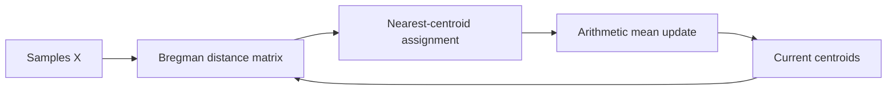

# Bregman Divergences

KFC uses **Bregman divergences** to construct several candidate clusterings of
the same feature matrix.

Instead of assuming that every dataset should be partitioned with ordinary
Euclidean geometry, the K-Step can fit one `BregmanKMeans` model for each
selected divergence:

\[
\boxed{
X
\rightarrow
\left\{
D_{\text{Euclidean}},
D_{\text{GKL}},
D_{\text{Logistic}},
D_{\text{Itakura--Saito}}
\right\}
\rightarrow
\text{candidate clusterings}
}
\]

The built-in divergence implementations live in:

```text
kfc_procedure/core/clustering/divergences/
```

and are registered through:

```python
BregmanDivergenceFactory
```

---

## What is a Bregman divergence?

The package defines a Bregman divergence from a convex differentiable
generator \(\phi\) as

\[
D_\phi(x,y)
=
\phi(x)
-
\phi(y)
-
\left\langle
\nabla\phi(y),
x-y
\right\rangle.
\]

A Bregman divergence is a dissimilarity measure, but it is not generally a
metric.

In particular, it does not have to satisfy

\[
D_\phi(x,y)=D_\phi(y,x),
\]

and it does not have to satisfy the triangle inequality.

That asymmetry is important when interpreting Bregman clustering.

---

## Built-in divergences

Importing:

```python
from kfc_procedure.core.clustering.divergences import (
    SquaredEuclidean,
    GKLDivergence,
    LogisticLoss,
    ItakuraSaito,
)
```

loads and registers all four built-in divergences.

| Registry name | Class | Family | Domain |
| --- | --- | --- | --- |
| `euclidean` | `SquaredEuclidean` | Gaussian | \(\mathbb{R}^d\) |
| `gkl` | `GKLDivergence` | Poisson | \((0,\infty)^d\) |
| `logistic` | `LogisticLoss` | Bernoulli / Binomial | \((0,1)^d\) |
| `is` | `ItakuraSaito` | Exponential / Gamma | \((0,\infty)^d\) |

These are the names used by the K-Step:

```python
divergences=[
    "euclidean",
    "gkl",
    "logistic",
    "is",
]
```

---

# Squared Euclidean

Use:

```python
divergences=["euclidean"]
```

The implementation class is:

```python
SquaredEuclidean
```

with:

```python
name = "Euclidean"
family = "Gaussian"
```

---

## Generator

The source implements

\[
\phi(x)
=
\|x\|_2^2
=
\sum_j x_j^2.
\]

Its gradient is

\[
\nabla\phi(x)
=
2x.
\]

The resulting divergence is

\[
D(x,y)
=
\|x-y\|_2^2.
\]

---

## Domain

Squared Euclidean divergence accepts the full real feature space:

\[
x\in\mathbb{R}^d.
\]

The implementation's domain check simply returns:

```python
True
```

so there is no positivity or interval restriction.

This makes it the safest built-in divergence for arbitrary real-valued
features.

---

## Optimized distance computation

`SquaredEuclidean` overrides the generic Bregman formula and uses

\[
\|x-y\|_2^2
=
\|x\|_2^2
-
2x^\top y
+
\|y\|_2^2.
\]

The implementation computes the pairwise distance matrix using a matrix
multiplication:

```python
xy = X @ Y.T
```

rather than explicitly constructing an `(n_samples, n_centroids, n_features)`
tensor.

This reduces peak memory usage for the Euclidean case.

---

## Example

```python
from kfc_procedure.core.clustering.divergences import (
    SquaredEuclidean,
)

div = SquaredEuclidean()

D = div.distance(
    X,
    centroids,
)
```

The result has shape:

```text
(n_samples, n_centroids)
```

---

# Generalized Kullback–Leibler

Use:

```python
divergences=["gkl"]
```

The class is:

```python
GKLDivergence
```

with:

```python
name = "GKL"
family = "Poisson"
```

The module also describes it as the generalized KL divergence or
**I-divergence**.

---

## Divergence

The implemented pairwise divergence is

\[
D(x,y)
=
\sum_j
\left[
x_j
\log\left(
\frac{x_j}{y_j}
\right)
-
(x_j-y_j)
\right].
\]

The class implementation uses the generator

\[
\phi(x)
=
\sum_j x_j\log x_j
\]

with gradient

\[
\nabla\phi(x)
=
\log x + 1.
\]

The module-level documentation also writes the generator with an additional
linear \(-x_j\) term. That affine difference does not change the resulting
Bregman divergence; the concrete `phi()` method in the current source returns
\(\sum x_j\log x_j\).

---

## Domain

The implementation requires:

\[
x_j>0
\]

for every value.

The domain check is:

```python
np.all(X > 0)
```

Therefore zero and negative feature values are rejected by
`BregmanKMeans.fit()`.

---

## Example

```python
from kfc_procedure.core.clustering.divergences import (
    GKLDivergence,
)

div = GKLDivergence()

D = div.distance(
    X_positive,
    centroids_positive,
)
```

---

## Typical KFC configuration

```python
model = KFCRegressor(
    divergences=["gkl"],
    local_model="ridge",
    combiner="gradientcobra",
    random_state=42,
)
```

The source associates GKL with the Poisson exponential family.

---

# Logistic divergence

Use:

```python
divergences=["logistic"]
```

The implementation class is:

```python
LogisticLoss
```

with:

```python
name = "Logit"
family = "Bernoulli / Binomial"
```

---

## Generator

The implementation uses

\[
\phi(x)
=
\sum_j
\left[
x_j\log x_j
+
(1-x_j)\log(1-x_j)
\right].
\]

Its gradient is

\[
\nabla\phi(x)
=
\log x
-
\log(1-x).
\]

---

## Divergence

The logistic Bregman divergence is

\[
D(x,y)
=
\sum_j
\left[
x_j
\log\left(
\frac{x_j}{y_j}
\right)
+
(1-x_j)
\log\left(
\frac{1-x_j}{1-y_j}
\right)
\right].
\]

The module describes this as the logistic or binary cross-entropy Bregman
divergence.

---

## Domain

Every value must satisfy

\[
0<x_j<1.
\]

The exact domain check is:

```python
np.all(
    (0 < X)
    & (X < 1)
)
```

Values equal to `0` or `1` are therefore outside the declared domain.

---

## Numerical handling of reference points

Inside `distance()`, the current source clips the reference matrix `Y` to

```python
[1e-12, 1 - 1e-12]
```

before evaluating logarithms.

However, `BregmanKMeans.fit()` validates the training matrix against the strict
\((0,1)\) domain before clustering.

Therefore the public clustering workflow should still be treated as requiring

\[
0<X<1.
\]

---

## Example

```python
from kfc_procedure.core.clustering.divergences import (
    LogisticLoss,
)

div = LogisticLoss()

D = div.distance(
    X_unit_interval,
    centroids_unit_interval,
)
```

---

# Itakura–Saito

Use:

```python
divergences=["is"]
```

The implementation class is:

```python
ItakuraSaito
```

with:

```python
name = "Ita"
family = "Exponential / Gamma"
```

The module describes the divergence as scale invariant and associates it with
signal-processing and spectral-analysis settings.

---

## Generator

The generator is

\[
\phi(x)
=
-\sum_j\log x_j.
\]

Its gradient is

\[
\nabla\phi(x)
=
-\frac{1}{x}.
\]

---

## Divergence

The implementation computes

\[
D(x,y)
=
\sum_j
\left[
\frac{x_j}{y_j}
-
\log\left(
\frac{x_j}{y_j}
\right)
-
1
\right].
\]

---

## Domain

Every value must satisfy

\[
x_j>0.
\]

The source uses:

```python
np.all(X > 0)
```

for domain validation.

---

## Example

```python
from kfc_procedure.core.clustering.divergences import (
    ItakuraSaito,
)

div = ItakuraSaito()

D = div.distance(
    X_positive,
    centroids_positive,
)
```

---

# Domain requirements at a glance

| Divergence | Negative values | Zero | One | Values \(>1\) |
| --- | :---: | :---: | :---: | :---: |
| Euclidean | ✓ | ✓ | ✓ | ✓ |
| GKL | ✗ | ✗ | ✓ | ✓ |
| Logistic | ✗ | ✗ | ✗ | ✗ |
| Itakura–Saito | ✗ | ✗ | ✓ | ✓ |

The strictest built-in domain is Logistic:

\[
0<x<1.
\]

Therefore if all four built-in divergences are selected together, the common
valid domain is

\[
0<x<1.
\]

---

# Preparing data for all four divergences

For documentation examples, one simple preprocessing strategy is:

```python
from sklearn.preprocessing import MinMaxScaler

eps = 1e-6

scaler = MinMaxScaler(
    feature_range=(
        eps,
        1.0 - eps,
    )
)

X_train_scaled = scaler.fit_transform(
    X_train
)

X_test_scaled = scaler.transform(
    X_test
)
```

Then:

```python
model = KFCRegressor(
    divergences=[
        "euclidean",
        "gkl",
        "logistic",
        "is",
    ],
    local_model="ridge",
    combiner="gradientcobra",
    random_state=42,
)

model.fit(
    X_train_scaled,
    y_train,
)
```

!!! important

    This is a preprocessing example, not an automatic transformation performed
    by `kfc-procedure`.

    The package itself expects the supplied data to already satisfy each
    divergence's domain.

---

# Domain validation in `BregmanKMeans`

Before fitting, `BregmanKMeans` calls:

```python
validate_divergence_domain(
    self.divergence,
    X,
)
```

The validator performs two checks.

First:

```python
np.isfinite(X).all()
```

must be true.

If not, it raises:

```text
[<divergence name>] Input contains NaN or Inf.
```

Second:

```python
div.in_domain(X)
```

must be true.

Otherwise it raises:

```text
[<divergence name>] Input outside valid domain.
```

---

# The base divergence API

All built-in divergences inherit from:

```python
BaseBregmanDivergence
```

A divergence must implement:

```python
in_domain(X)
phi(X)
grad_phi(X)
```

The base class provides:

```python
distance(X, Y)
pairwise(X, Y)
```

for the generic Bregman formula unless a subclass overrides it.

---

## Constructor

The base constructor is:

```python
BaseBregmanDivergence(
    validate_domain=True,
    **kwargs,
)
```

It stores:

```python
self.validate_domain
```

and any extra keyword arguments as object attributes.

!!! note "Current implementation detail"

    Although `validate_domain` is stored by the base class, the generic
    `distance()` implementation directly checks `in_domain(X)` and
    `in_domain(Y)`.

    The current distance code does not branch on `self.validate_domain`.

    Likewise, `BregmanKMeans.fit()` always calls its separate domain validator.

    Therefore setting:

    ```python
    validate_domain=False
    ```

    does not currently disable all domain checks in the clustering workflow.

---

# Pairwise distance output

For:

```python
X.shape == (n_samples, n_features)
Y.shape == (n_reference, n_features)
```

calling:

```python
D = divergence.distance(
    X,
    Y,
)
```

returns:

```text
(n_samples, n_reference)
```

with:

\[
D_{ij}
=
D_\phi(X_i,Y_j).
\]

This is exactly the matrix used by `BregmanKMeans` when assigning samples to
centroids.

---

# Numerical clipping

Every built-in `distance()` accepts:

```python
clip=True
```

by default.

After computing the divergence matrix, the implementation applies:

```python
np.maximum(
    D,
    0.0,
    out=D,
)
```

This prevents tiny floating-point errors from producing negative divergence
values.

You can disable this in direct divergence calls:

```python
D = div.distance(
    X,
    Y,
    clip=False,
)
```

KFC's clustering path uses the default clipped behavior.

---

# Caching in the base implementation

The generic `BaseBregmanDivergence.distance()` caches quantities that depend
only on the reference matrix `Y`.

It stores:

```text
_cache_key
_phi_Y
_grad_Y
_dot_Y
```

When the same reference array is reused, these values can avoid repeated
generator and gradient calculations.

This is useful in iterative centroid-based algorithms where many samples are
repeatedly compared with a fixed centroid matrix.

The built-in divergence classes currently override `distance()` with their own
specialized formulas, so the base-class cache applies directly to custom
divergences that use the inherited implementation.

---

# Divergences in Bregman K-means

`BregmanKMeans` replaces Euclidean distance in Lloyd's assignment step with the
selected divergence.

For each iteration:

\[
c_i
=
\operatorname*{arg\,min}_k
D_\phi(X_i,\mu_k).
\]

Then cluster centroids are recomputed.



---

## Centroid update in the current source

The current implementation updates every cluster centroid using the arithmetic
mean:

\[
\mu_k
=
\frac{1}{|C_k|}
\sum_{i\in C_k}X_i.
\]

This update is used for all built-in divergence choices.

The source describes this as the Euclidean mean surrogate in the
`BregmanKMeans` class documentation.

---

# Distortion

For fitted centroids, the clustering distortion is:

\[
\frac{1}{n}
\sum_{i=1}^{n}
\min_k
D_\phi(X_i,\mu_k).
\]

The selected run stores it as:

```python
model.inertia_
```

Despite the `inertia_` name, the value is an average minimum Bregman
divergence in the current implementation, not necessarily Euclidean
sum-of-squares.

---

# Multiple initializations

`BregmanKMeans` uses:

```python
n_init=10
```

by default.

For every initialization:

1. sample initial centroids from the training observations;
2. run Lloyd iterations;
3. compute final average distortion.

The run with the smallest final distortion is retained.

The K-Step currently does not expose `n_init`, so it uses this default.

---

# Initialization

When no explicit centroid matrix is provided, `BregmanKMeans` samples
`n_clusters` training observations without replacement:

```python
idx = rng.choice(
    X.shape[0],
    self.n_clusters,
    replace=False,
)
```

Although a source comment describes this as “k-means++ style,” the implemented
behavior is random sample selection rather than probability-weighted k-means++
seeding.

---

# Empty clusters

If an iteration produces an empty cluster, the current implementation
reinitializes its centroid using a random training sample:

```python
centroids[k] = X[
    rng.randint(n)
]
```

This allows fitting to continue instead of dividing by zero.

---

# Factory usage

The registry is:

```python
BregmanDivergenceFactory
```

You can create a built-in divergence by name:

```python
from kfc_procedure.core.clustering.divergences import (
    BregmanDivergenceFactory,
)

div = BregmanDivergenceFactory.create(
    "euclidean"
)
```

Likewise:

```python
gkl = BregmanDivergenceFactory.create(
    "gkl"
)
```

---

# Inspect registered divergences

The factory inherits the package's registry behavior.

Depending on which helper you want to use, you can inspect the available
entries through the factory API.

The four built-ins registered when the divergence package is imported are:

```text
euclidean
gkl
is
logistic
```

---

# Using divergence objects directly

The K-Step accepts an instance of `BaseBregmanDivergence` as well as a string
identifier.

Example:

```python
from kfc_procedure.core.clustering.divergences import (
    SquaredEuclidean,
)

div = SquaredEuclidean()

model = KFCRegressor(
    divergences=[
        div,
    ],
    local_model="ridge",
    combiner="gradientcobra",
)
```

When an object is supplied, K-Step uses the object directly rather than
creating another instance through the factory.

---

# String names vs object names

The registry identifiers are:

```text
euclidean
gkl
logistic
is
```

but the built-in class-level human-readable names are:

```text
SquaredEuclidean -> Euclidean
GKLDivergence    -> GKL
LogisticLoss     -> Logit
ItakuraSaito     -> Ita
```

This distinction matters when inspecting K-Step dictionary keys.

With strings, keys follow the configured registry name.

With direct objects, K-Step derives its key from the object's `name` attribute
and lowercases it.

Therefore object-based keys can be:

```text
euclidean
gkl
logit
ita
```

rather than:

```text
euclidean
gkl
logistic
is
```

---

# `divergences_params`

For string-based divergences, K-Step can pass constructor parameters through:

```python
divergences_params
```

For example:

```python
model = KFCRegressor(
    divergences=[
        "euclidean",
        "gkl",
    ],
    divergences_params={
        "euclidean": {
            "validate_domain": True,
        },
        "gkl": {
            "validate_domain": True,
        },
    },
    local_model="ridge",
    combiner="gradientcobra",
)
```

The base divergence constructor also accepts arbitrary `**kwargs` and stores
them as attributes.

The built-in divergences do not currently define additional specialized
constructor parameters.

---

# Custom divergence

A custom divergence should subclass:

```python
BaseBregmanDivergence
```

and implement:

```python
in_domain()
phi()
grad_phi()
```

For example:

```python
import numpy as np

from kfc_procedure.core.clustering.divergences import (
    BaseBregmanDivergence,
)


class MyDivergence(
    BaseBregmanDivergence
):

    name = "MyDivergence"
    family = "Custom"

    def in_domain(
        self,
        X,
    ):
        X = np.asarray(X)

        return np.isfinite(
            X
        ).all()

    def phi(
        self,
        X,
    ):
        X = np.asarray(
            X,
            dtype=float,
        )

        # one value per observation
        ...

    def grad_phi(
        self,
        X,
    ):
        X = np.asarray(
            X,
            dtype=float,
        )

        # same feature dimension as X
        ...
```

If `distance()` is not overridden, the base class evaluates the standard
Bregman expression.

---

# Register a custom divergence

To use a custom divergence by string name:

```python
from kfc_procedure.core.clustering.divergences import (
    BregmanDivergenceFactory,
)


@BregmanDivergenceFactory.register(
    "my_divergence"
)
class MyDivergence(
    BaseBregmanDivergence
):
    ...
```

Then:

```python
model = KFCRegressor(
    divergences=[
        "my_divergence",
    ],
    local_model="ridge",
    combiner="gradientcobra",
)
```

---

# Choosing a divergence

A practical source-aligned summary is:

<div class="grid cards" markdown>

-   :material-vector-square:{ .lg .middle } **Euclidean**

    ---

    No domain restriction.

    Uses squared Euclidean separation.

    **Registry:** `euclidean`

-   :material-chart-bell-curve-cumulative:{ .lg .middle } **GKL**

    ---

    Requires strictly positive features.

    Associated with the Poisson family.

    **Registry:** `gkl`

-   :material-function-variant:{ .lg .middle } **Logistic**

    ---

    Requires all values strictly between `0` and `1`.

    Associated with Bernoulli / Binomial.

    **Registry:** `logistic`

-   :material-chart-scatter-plot:{ .lg .middle } **Itakura–Saito**

    ---

    Requires strictly positive features.

    Associated with Exponential / Gamma.

    **Registry:** `is`

</div>

---

# Several divergences vs one divergence

With one divergence:

```python
divergences=[
    "euclidean",
]
```

KFC constructs one partition and one corresponding F-Step prediction column.

With four divergences:

```python
divergences=[
    "euclidean",
    "gkl",
    "logistic",
    "is",
]
```

KFC constructs four independent clustering views.

The F-Step then generates four prediction columns, which the C-Step can
aggregate.

The package does not select one “best” divergence during K-Step.

---

# Divergence choice and the C-Step

The K-Step only controls the candidate partitions.

Its output affects the C-Step indirectly:

```text
divergence
    ↓
cluster assignment
    ↓
local model selected by F-Step
    ↓
divergence-specific prediction
    ↓
C-Step aggregation
```

So changing the divergence changes which local model handles each observation,
which can change the final prediction even when the local estimator type and
C-Step combiner remain fixed.

---

# Debugging divergence errors

## NaN or infinity

Check:

```python
import numpy as np

print(
    np.isfinite(
        X_train
    ).all()
)
```

Expected:

```text
True
```

---

## GKL or Itakura–Saito

Check:

```python
print(
    (
        X_train > 0
    ).all()
)
```

---

## Logistic

Check:

```python
print(
    (
        (X_train > 0)
        &
        (X_train < 1)
    ).all()
)
```

---

## Inspect the actual divergence object

After fitting:

```python
km = model.kstep_.models_[
    "euclidean"
]

print(
    km.divergence
)

print(
    km.divergence.name
)

print(
    km.divergence.family
)
```

---

# Quick reference

| Property | Euclidean | GKL | Logistic | Itakura–Saito |
| --- | --- | --- | --- | --- |
| Registry | `euclidean` | `gkl` | `logistic` | `is` |
| Class name | `SquaredEuclidean` | `GKLDivergence` | `LogisticLoss` | `ItakuraSaito` |
| Human name | `Euclidean` | `GKL` | `Logit` | `Ita` |
| Family | Gaussian | Poisson | Bernoulli / Binomial | Exponential / Gamma |
| Domain | all real | \(x>0\) | \(0<x<1\) | \(x>0\) |
| Specialized `distance()` | Yes | Yes | Yes | Yes |

---

# Mental model

!!! quote ""

    **A divergence defines what “closest cluster” means. KFC keeps several
    plausible definitions of closeness instead of committing to only one.**

\[
\boxed{
\text{same observations}
\rightarrow
\text{different Bregman geometries}
\rightarrow
\text{different partitions}
\rightarrow
\text{different local predictions}
}
\]
