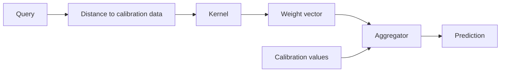

# Aggregators

Aggregators are the final numerical step in the COBRA pipeline.

After a distance matrix has been transformed by a kernel, each query has one
weight for each calibration observation. The aggregator combines those weights
with the calibration targets or class labels.

\[
\boxed{
\text{distance}
\rightarrow
\text{kernel weights}
\rightarrow
\text{aggregator}
\rightarrow
\text{prediction}
}
\]

The current source provides two built-in aggregators:

```text
weighted_mean
weighted_vote
```

implemented by:

```python
WeightedMeanAggregator
WeightedVoteAggregator
```

under:

```text
kfc_procedure/cobra/core/aggregators/
├── base.py
├── weighted_mean.py
└── weighted_vote.py
```

They are registered through:

```python
AggregatorFactory
```

---

## Where aggregators sit in the pipeline

For one query, COBRA first computes a kernel-weight row:

\[
w
=
(w_1,\ldots,w_m),
\]

where the \(m\) entries correspond to the calibration observations.

The aggregator then receives:

```text
values
    calibration targets or labels

weights
    kernel similarities to those calibration observations
```

and returns one prediction.



---

# Built-in aggregators

| Registry name | Alias | Class | Task used by default |
| --- | --- | --- | --- |
| `weighted_mean` | `wm` | `WeightedMeanAggregator` | regression |
| `weighted_vote` | `wv` | `WeightedVoteAggregator` | classification |

The factory itself does not attach explicit regression/classification
categories to these registrations.

The task distinction comes from which estimator selects which aggregator by
default.

---

# Default aggregator by estimator

The current high-level defaults are:

| Estimator | Default aggregator |
| --- | --- |
| `GradientCOBRA` | `weighted_mean` |
| `MixCOBRARegressor` | `weighted_mean` |
| `CombinedClassifier` | `weighted_vote` |

So the normal mapping is:

```text
regression
    -> weighted_mean

classification
    -> weighted_vote
```

---

# `BaseAggregator`

Every aggregator inherits:

```python
BaseAggregator
```

The abstract interface centers on:

```python
aggregate(
    values,
    weights=None,
    **kwargs,
)
```

The base class also provides:

```python
aggregate_matrix(...)
```

for batch aggregation and defines:

```python
aggregate_proba(...)
```

as an optional classification extension.

---

## `aggregate()`

The required method is:

```python
aggregate(
    values: np.ndarray,
    weights: np.ndarray | None = None,
    **kwargs,
)
```

It aggregates one query.

Conceptually:

```text
values  = calibration values
weights = one query's kernel-weight vector
```

and returns one scalar or class prediction.

---

## `aggregate_matrix()`

The base implementation supports batch prediction.

Its signature is:

```python
aggregate_matrix(
    values,
    weights,
    fallback=None,
    **kwargs,
)
```

with:

```text
values
    shared calibration values

weights
    matrix of shape
    (n_queries, n_calibration_samples)
```

The method applies:

```python
aggregate(
    values,
    weights[i],
    fallback=fallback,
)
```

independently for each query row.

---

## Base batch validation

The current base implementation requires:

```python
weights.ndim == 2
```

otherwise it raises:

```text
ValueError:
weights must be 2D (n_queries, n_models), got ...
```

The terminology in the base docstring says `n_models`, but in the actual COBRA
usage the second dimension corresponds to calibration observations.

---

## Base batch output dtype

The base class creates:

```python
out = np.empty(
    W.shape[0],
    dtype=object,
)
```

fills it query by query, and finally returns:

```python
np.asarray(out)
```

So the generic batch path supports either numeric or object-valued aggregate
outputs.

`WeightedVoteAggregator` overrides this method with its own vectorized
implementation.

---

# `aggregate_proba()`

The base class defines:

```python
aggregate_proba(
    values,
    weights=None,
    classes=None,
    **kwargs,
)
```

but the default implementation raises:

```python
NotImplementedError
```

Classification aggregators may override this method.

Both current built-ins define an `aggregate_proba()` implementation, although
the regression weighted-mean version is only meaningful when the supplied
values are already probability vectors.

---

# `AggregatorFactory`

Create a registered aggregator with:

```python
from kfc_procedure.cobra.core.aggregators import (
    AggregatorFactory,
)

aggregator = AggregatorFactory.create(
    "weighted_mean"
)
```

or:

```python
aggregator = AggregatorFactory.create(
    "weighted_vote"
)
```

---

## Aliases

The current registrations are:

```python
@AggregatorFactory.register(
    "weighted_mean",
    "wm",
)
```

and:

```python
@AggregatorFactory.register(
    "weighted_vote",
    "wv",
)
```

So these pairs are equivalent:

```text
weighted_mean == wm
weighted_vote == wv
```

---

## Inspect available aggregators

```python
print(
    AggregatorFactory.available()
)
```

The current registry should include:

```text
weighted_mean
weighted_vote
wm
wv
```

after the aggregator package has been imported.

---

# Weighted mean aggregation

`WeightedMeanAggregator` is the default regression aggregator.

It is registered as:

```text
weighted_mean
wm
```

The source formula is:

\[
\widehat y
=
\frac{
\sum_i w_i v_i
}{
\sum_i w_i
}.
\]

Here:

- \(v_i\) is a calibration target;
- \(w_i\) is its kernel weight for the query.

---

## Single-query implementation

The implementation begins with:

```python
V = np.asarray(
    values,
    dtype=float,
).reshape(-1)
```

So the target values are flattened into a one-dimensional numeric vector.

---

## Empty values

If:

```python
V.size == 0
```

the source raises:

```text
ValueError:
values cannot be empty
```

---

# No weights: arithmetic mean

If:

```python
weights is None
```

the aggregator returns:

```python
float(
    np.mean(V)
)
```

So without a weight vector:

\[
\widehat y
=
\frac1m
\sum_i v_i.
\]

---

# Default fallback

If:

```python
fallback is None
```

the source computes:

```python
fallback = float(
    np.mean(V)
)
```

Therefore the default fallback for a single weighted-mean call is the
unweighted mean of the supplied `values`.

---

# Weight sanitization

Weights are converted with:

```python
W = np.asarray(
    weights,
    dtype=float,
).reshape(-1)
```

then sanitized using:

```python
np.nan_to_num(
    W,
    nan=0.0,
    posinf=0.0,
    neginf=0.0,
)
```

So:

```text
NaN
+Inf
-Inf
```

weights are replaced with:

```text
0
```

before aggregation.

---

## Important consequence

Non-finite weights do not directly propagate into the regression prediction.

They simply contribute zero weight.

This sanitization occurs inside:

```python
WeightedMeanAggregator.aggregate()
```

---

# Zero denominator

The source computes:

```python
denom = np.sum(W)
```

and checks:

```python
np.isclose(
    denom,
    0.0,
)
```

If the total weight is effectively zero, the method returns:

```python
fallback
```

instead of dividing by zero.

---

## Weighted result

Otherwise:

```python
return float(
    np.dot(
        W,
        V,
    )
    / denom
)
```

which is exactly:

\[
\frac{w^\top v}{\sum_iw_i}.
\]

---

# Direct weighted-mean example

```python
import numpy as np

from kfc_procedure.cobra.core.aggregators import (
    WeightedMeanAggregator,
)


values = np.array([
    10.0,
    20.0,
    30.0,
])

weights = np.array([
    0.8,
    0.1,
    0.1,
])


aggregator = WeightedMeanAggregator()

prediction = aggregator.aggregate(
    values,
    weights,
)

print(
    prediction
)
```

The first calibration target contributes most strongly because it has the
largest kernel weight.

---

# Regression fallback example

```python
values = np.array([
    10.0,
    20.0,
    30.0,
])

weights = np.zeros(3)

prediction = aggregator.aggregate(
    values,
    weights,
    fallback=15.0,
)
```

Because:

```python
np.sum(weights) == 0
```

the result is:

```text
15.0
```

---

# Default fallback example

If no fallback is supplied:

```python
prediction = aggregator.aggregate(
    values,
    weights,
)
```

the source uses:

```python
np.mean(values)
```

which in this example is:

```text
20.0
```

---

# GradientCOBRA regression aggregation

`GradientCOBRA` resolves its aggregator with:

```python
AggregatorFactory.create(
    self.aggregator,
    **(
        self.aggregator_params
        or {}
    ),
)
```

Its default is:

```text
weighted_mean
```

---

## GradientCOBRA cross-validation

During bandwidth evaluation:

```python
preds = self.aggregator_.aggregate_matrix(
    values=y_train,
    weights=K_val_train,
    fallback=0.0,
)
```

So inside cross-validation the explicit fallback is:

```text
0.0
```

rather than the local mean.

---

## GradientCOBRA final prediction

At prediction time:

```python
preds = self.aggregator_.aggregate_matrix(
    values=self.y_l_,
    weights=K,
    fallback=self.global_mean_,
)
```

Therefore the final prediction fallback is:

```python
global_mean_
```

when a query has effectively zero total kernel weight.

This distinction matters:

```text
cross-validation fallback -> 0.0
final prediction fallback -> global calibration mean
```

---

# MixCOBRA regression aggregation

`MixCOBRARegressor` also defaults to:

```text
weighted_mean
```

and uses the same batch aggregator.

During cross-validation:

```python
fallback=0.0
```

is passed.

During final prediction:

```python
fallback=self.global_mean_
```

is passed.

So its regression fallback pattern matches the current GradientCOBRA
implementation.

---

# Weighted-mean batch aggregation

`WeightedMeanAggregator` does not override:

```python
aggregate_matrix()
```

so it uses the base-class loop.

For:

```python
weights.shape == (
    n_queries,
    n_calibration,
)
```

the base code performs one:

```python
aggregate(...)
```

call per query.

Conceptually:

\[
\hat y_q
=
\frac{
\sum_i W_{qi}v_i
}{
\sum_i W_{qi}
}
\]

for every query \(q\).

---

# Weighted-mean probability aggregation

`WeightedMeanAggregator` also defines:

```python
aggregate_proba()
```

The source explicitly notes that this is only meaningful when:

```text
values already represent probabilities
```

---

## Probability input shape

Here `values` is not treated as a one-dimensional target vector.

The code uses:

```python
V = np.asarray(
    values,
    dtype=float,
)
```

without flattening.

A natural expected shape is:

```text
(n_items, n_classes)
```

---

## No weights

If:

```python
weights is None
```

the method returns:

```python
np.mean(
    V,
    axis=0,
)
```

which averages the supplied probability vectors class by class.

---

## With weights

Weights are converted and sanitized:

```python
W = np.asarray(
    weights,
    dtype=float,
)

W = np.nan_to_num(
    W,
    nan=0.0,
    posinf=0.0,
    neginf=0.0,
)
```

Then they are normalized with:

```python
W = W / (
    np.sum(W)
    + 1e-12
)
```

and the result is:

```python
np.sum(
    W[:, None]
    * V,
    axis=0,
)
```

---

## Probability normalization caveat

Because the source divides by:

```python
np.sum(W) + 1e-12
```

rather than explicitly falling back when the sum is zero, an all-zero weight
vector produces a zero probability vector rather than a fallback distribution.

The method does not apply a final probability renormalization after summing.

---

# Weighted vote aggregation

`WeightedVoteAggregator` is the default classifier aggregator.

It is registered as:

```text
weighted_vote
wv
```

The single-query rule is:

\[
\widehat c
=
\operatorname*{arg\,max}_c
\sum_i
w_i
\mathbf{1}(v_i=c).
\]

Here:

- \(v_i\) is a calibration class label;
- \(w_i\) is the corresponding query-to-calibration kernel weight.

---

# Unweighted vote

If:

```python
weights is None
```

the source computes:

```python
classes, counts = np.unique(
    V,
    return_counts=True,
)
```

and returns:

```python
classes[
    np.argmax(counts)
]
```

So this path is an ordinary majority vote over the supplied values.

---

## Tie behavior without weights

`np.unique()` returns classes in sorted order for sortable data.

`np.argmax(counts)` selects the first maximum.

Therefore in an equal-count tie, the current unweighted path tends to select
the first class in the `np.unique()` ordering.

The package does not implement a separate explicit tie-policy parameter.

---

# Weighted vote input validation

The values are flattened:

```python
V = np.asarray(
    values
).reshape(-1)
```

If:

```python
V.size == 0
```

the method raises:

```text
ValueError:
values cannot be empty
```

---

## Weight length validation

Weights are converted with:

```python
W = np.asarray(
    weights,
    dtype=float,
).reshape(-1)
```

Then the source requires:

```python
W.size == V.size
```

otherwise it raises:

```text
ValueError:
weights and values must match length
```

---

# Non-finite weighted-vote weights

The implementation computes:

```python
mask = np.isfinite(W)
```

then:

```python
V, W = V[mask], W[mask]
```

So calibration observations with:

```text
NaN
+Inf
-Inf
```

weights are removed entirely from the voting calculation.

This differs from `WeightedMeanAggregator`, which converts those weights to
zero.

---

# Weighted class scores

After filtering, the source obtains:

```python
classes = np.unique(V)
```

and constructs a one-hot matrix:

```python
one_hot = (
    V[:, None]
    ==
    classes[None, :]
).astype(float)
```

If there are:

```text
M calibration values
C observed classes
```

the one-hot matrix has shape:

```text
(M, C)
```

---

## Score calculation

The class scores are:

```python
scores = W @ one_hot
```

which gives one total weight per class:

\[
s_c
=
\sum_i
w_i
\mathbf{1}(v_i=c).
\]

The final class is:

```python
classes[
    np.argmax(scores)
]
```

---

# Direct weighted-vote example

```python
import numpy as np

from kfc_procedure.cobra.core.aggregators import (
    WeightedVoteAggregator,
)


values = np.array([
    0,
    1,
    1,
    0,
])

weights = np.array([
    0.1,
    0.4,
    0.3,
    0.2,
])


aggregator = WeightedVoteAggregator()

prediction = aggregator.aggregate(
    values,
    weights,
)

print(
    prediction
)
```

Class `1` receives:

```text
0.4 + 0.3 = 0.7
```

while class `0` receives:

```text
0.1 + 0.2 = 0.3
```

so the result is:

```text
1
```

---

# Negative weights

The source does not constrain weighted-vote weights to be non-negative.

If the supplied kernel or custom weighting stage produces negative finite
values, those values participate directly in:

```python
W @ one_hot
```

and can reduce a class score.

The built-in similarity kernels normally return non-negative outputs, but the
aggregator itself does not enforce that assumption.

---

# Empty data after finite-weight filtering

There is an important edge case in the current source.

The method checks:

```python
V.size == 0
```

**before** removing non-finite weights.

If every weight is non-finite, then:

```python
V, W = V[mask], W[mask]
```

can produce empty arrays afterward.

The source does not perform a second empty check at that point.

Subsequent operations such as:

```python
np.argmax(scores)
```

can therefore fail.

This is a current implementation edge case rather than a documented fallback
behavior.

---

# Weighted-vote batch aggregation

Unlike `WeightedMeanAggregator`,
`WeightedVoteAggregator` overrides:

```python
aggregate_matrix()
```

with a vectorized implementation.

Its inputs are:

```text
values
    shape (n_calibration,)

weights
    shape (n_queries, n_calibration)
```

---

## Batch implementation

The source computes the class one-hot matrix once:

```python
classes = np.unique(V)

one_hot = (
    V[:, None]
    ==
    classes[None, :]
).astype(float)
```

Then all query scores are computed with:

```python
scores = W @ one_hot
```

giving:

```text
(n_queries, n_classes)
```

Finally:

```python
classes[
    np.argmax(
        scores,
        axis=1,
    )
]
```

returns one class per query.

---

## Batch validation

The override checks only:

```python
W.ndim == 2
```

and raises:

```text
ValueError:
weights must be 2D, got ...
```

if not.

It does **not** explicitly check:

```text
W.shape[1] == len(values)
```

before matrix multiplication.

A mismatch will therefore fail through NumPy's matrix multiplication rules.

---

# Batch path does not filter non-finite weights

The single-query:

```python
aggregate()
```

filters non-finite weights.

But the vectorized:

```python
aggregate_matrix()
```

does not apply:

```python
np.isfinite()
```

or:

```python
np.nan_to_num()
```

before:

```python
W @ one_hot
```

This means single and batch weighted-vote behavior differs for non-finite
weights.

!!! warning "Current source inconsistency"

    `WeightedVoteAggregator.aggregate()` removes non-finite weights.

    `WeightedVoteAggregator.aggregate_matrix()` uses the weight matrix directly.

    Non-finite values can therefore propagate differently depending on which
    method is called.

---

# CombinedClassifier uses single weighted vote

The current `CombinedClassifier` does not use the vectorized
`aggregate_matrix()` path for ordinary hard-label prediction.

Instead, it iterates over query rows and calls:

```python
self.aggregator_.aggregate(
    self.y_l_,
    w,
)
```

for each query.

Therefore the single-query finite-weight filtering logic applies to the main
CombinedClassifier hard-prediction path.

---

# CombinedClassifier zero-weight fallback

Before calling the aggregator, the classifier checks:

```python
if np.sum(w) <= 0:
    outputs.append(
        self.global_majority_class_
    )
```

Otherwise it calls:

```python
self.aggregator_.aggregate(
    self.y_l_,
    w,
)
```

So an all-zero or non-positive-sum kernel row is handled by
`CombinedClassifier` itself rather than by `WeightedVoteAggregator`.

---

# CombinedClassifier cross-validation fallback

During cross-validation, the source similarly performs:

```python
if np.sum(w) <= 0:
    pred = self.global_majority_class_
else:
    pred = self.aggregator_.aggregate(
        y_train,
        w,
    )
```

Thus its fallback class is the global majority class computed by the fitted
classifier.

---

# Probability aggregation in `WeightedVoteAggregator`

The current:

```python
aggregate_proba()
```

implementation deserves special attention.

The method receives:

```python
values
weights
classes
```

but the source does not actually use:

```python
weights
```

when constructing the probabilities.

---

## Current implementation

The method computes:

```python
V = np.asarray(
    values
).reshape(-1)
```

Then:

```python
if classes is None:
    classes = np.unique(V)
```

and:

```python
one_hot = (
    V[:, None]
    ==
    classes[None, :]
).astype(float)
```

Next:

```python
probs = one_hot.mean(
    axis=0
)
```

and finally:

```python
return probs / (
    np.sum(probs)
    + 1e-12
)
```

---

# Consequence of ignoring weights

For values:

```text
[0, 0, 1]
```

the returned class frequencies are approximately:

```text
class 0 -> 2/3
class 1 -> 1/3
```

regardless of whether the kernel weights are:

```text
[0.99, 0.01, 0.00]
```

or:

```text
[0.00, 0.01, 0.99]
```

because the current method does not use the supplied weight vector.

!!! warning "Current source behavior"

    `WeightedVoteAggregator.aggregate_proba()` currently returns normalized
    unweighted class frequencies.

    It does **not** compute weighted class probabilities from the provided
    kernel weights.

---

# Effect on `CombinedClassifier.predict_proba()`

`CombinedClassifier.predict_proba()` computes the query kernel row:

```python
w = K[i]
```

and then calls:

```python
self.aggregator_.aggregate_proba(
    values=self.y_l_,
    weights=w,
    classes=classes,
)
```

However, with the current default:

```text
weighted_vote
```

the `weights=w` argument is ignored by `aggregate_proba()`.

Therefore non-fallback `CombinedClassifier.predict_proba()` rows are based on
the class distribution of:

```python
y_l_
```

rather than query-specific kernel weighting.

---

## Zero-weight probability fallback

Before calling `aggregate_proba()`, CombinedClassifier checks:

```python
if np.sum(w) <= 0:
```

and sets probability `1.0` on:

```python
global_majority_class_
```

for that query.

So the current probability behavior is:

```text
zero/non-positive kernel sum
    -> one-hot global-majority fallback

positive kernel sum
    -> unweighted calibration class frequencies
```

with the default weighted-vote aggregator.

---

# `aggregate_proba_batch()`

`WeightedVoteAggregator` also defines:

```python
aggregate_proba_batch()
```

This method **does** use the weight matrix.

It computes:

```python
scores = W @ one_hot
```

then:

```python
scores / (
    np.sum(
        scores,
        axis=1,
        keepdims=True,
    )
    + 1e-12
)
```

So batch probability aggregation is weighted.

---

## Current API mismatch

The base `BaseAggregator` class does not define:

```python
aggregate_proba_batch()
```

as part of its abstract or shared interface.

`CombinedClassifier` also does not call it in its standard probability path.

Therefore the current weighted probability behavior implemented in
`aggregate_proba_batch()` is not used by the normal `CombinedClassifier`
`predict_proba()` loop.

---

# Probability batch zero-score behavior

If one query has all zero weighted class scores:

```python
scores[row] == 0
```

then division by:

```python
sum(scores) + 1e-12
```

returns an all-zero probability row.

There is no majority-class fallback inside:

```python
aggregate_proba_batch()
```

itself.

---

# Aggregator configuration

The high-level COBRA estimators accept:

```python
aggregator
```

and:

```python
aggregator_params
```

For example:

```python
from kfc_procedure.cobra import GradientCOBRA

model = GradientCOBRA(
    aggregator="weighted_mean",
)
```

or:

```python
from kfc_procedure.cobra import CombinedClassifier

classifier = CombinedClassifier(
    aggregator="weighted_vote",
)
```

---

# Current built-in aggregator parameters

The two concrete built-ins do not define custom `__init__()` methods.

So the current source exposes no specialized constructor parameters for:

```text
weighted_mean
weighted_vote
```

Although the high-level estimators accept:

```python
aggregator_params
```

passing arbitrary parameters to either built-in can fail through the factory
constructor call because the classes do not define corresponding constructor
arguments.

---

# Inspect the fitted aggregator

After fitting a COBRA estimator:

```python
print(
    model.aggregator_
)
```

For regression, the default type is:

```text
WeightedMeanAggregator
```

For classification:

```text
WeightedVoteAggregator
```

---

# Direct factory example

```python
from kfc_procedure.cobra.core.aggregators import (
    AggregatorFactory,
)

mean_aggregator = AggregatorFactory.create(
    "wm"
)

vote_aggregator = AggregatorFactory.create(
    "wv"
)
```

---

# Aggregation values are calibration targets, not base-model predictions

A subtle but important distinction:

The aggregator in GradientCOBRA or CombinedClassifier usually does **not**
aggregate the original base-estimator prediction columns directly.

Instead:

1. prediction-space representations determine distances;
2. distances produce kernel weights over calibration observations;
3. the aggregator combines the **calibration targets or labels**.

For regression:

```python
values=self.y_l_
```

For classification:

```python
values=self.y_l_
```

The difference is the type of values and the aggregation rule.

---

## Regression example

Suppose one query has kernel weights:

```text
[0.8, 0.1, 0.1]
```

over calibration targets:

```text
[10, 20, 30]
```

Then weighted mean returns:

\[
\frac{
0.8(10)+0.1(20)+0.1(30)
}{
0.8+0.1+0.1
}
=
13.
\]

---

## Classification example

Suppose one query has weights:

```text
[0.1, 0.4, 0.3, 0.2]
```

over labels:

```text
[0, 1, 1, 0]
```

Then class scores are:

\[
s_0
=
0.1+0.2
=
0.3
\]

and:

\[
s_1
=
0.4+0.3
=
0.7.
\]

The weighted-vote output is class:

```text
1
```

---

# Weight normalization

The two built-ins treat weight normalization differently.

`WeightedMeanAggregator.aggregate()` does not explicitly normalize `W` first.

Instead it computes:

```python
dot(W, V) / sum(W)
```

which is algebraically equivalent to using normalized weights when the sum is
nonzero.

`WeightedVoteAggregator.aggregate()` does not normalize weights at all because
multiplying all class weights by the same positive constant leaves:

```python
argmax
```

unchanged.

---

# Kernel weights need not sum to one

The kernel layer can return arbitrary non-negative similarity values.

For example:

```text
[0.92, 0.36, 0.08]
```

The aggregators handle those raw values directly.

No separate normalization step is required before:

```text
weighted_mean
weighted_vote
```

for hard prediction.

---

# Compact kernels and aggregator fallback

Compact kernels such as:

```text
epanechnikov
biweight
triweight
triangular
cobra
```

can produce all-zero query rows.

This makes fallback behavior particularly important.

For regression:

```text
GradientCOBRA / MixCOBRA
    -> global_mean_ during final prediction
```

For classification:

```text
CombinedClassifier
    -> global_majority_class_
```

The fallback behavior belongs partly to the estimator and partly to the
aggregator.

---

# Naive kernel interaction

The source's:

```text
naive
```

kernel returns the adapted distance unchanged.

That means larger distances become larger "weights."

The aggregators do not know whether their input came from a proper similarity
kernel.

They simply consume the numeric weights they are given.

So with a naive kernel, weighted mean and weighted vote will give more influence
to larger distance values unless some earlier transformation changes them.

This follows directly from the current component separation.

---

# Custom aggregator

A custom aggregator should subclass:

```python
BaseAggregator
```

and implement:

```python
aggregate()
```

The base batch implementation can then be inherited if query-by-query looping
is acceptable.

Example:

```python
import numpy as np

from kfc_procedure.cobra.core.aggregators import (
    BaseAggregator,
    AggregatorFactory,
)


@AggregatorFactory.register(
    "median"
)
class MedianAggregator(
    BaseAggregator
):

    def aggregate(
        self,
        values,
        weights=None,
        **kwargs,
    ):
        values = np.asarray(
            values,
            dtype=float,
        )

        return float(
            np.median(
                values
            )
        )
```

Then:

```python
model = GradientCOBRA(
    aggregator="median",
)
```

can resolve it through the normal factory.

---

# Custom weighted regression aggregator

For example:

```python
@AggregatorFactory.register(
    "positive_weighted_mean"
)
class PositiveWeightedMean(
    BaseAggregator
):

    def aggregate(
        self,
        values,
        weights=None,
        fallback=None,
        **kwargs,
    ):
        V = np.asarray(
            values,
            dtype=float,
        ).reshape(-1)

        if weights is None:
            return float(
                np.mean(V)
            )

        W = np.maximum(
            np.asarray(
                weights,
                dtype=float,
            ).reshape(-1),
            0.0,
        )

        denom = np.sum(W)

        if np.isclose(
            denom,
            0.0,
        ):
            return (
                float(np.mean(V))
                if fallback is None
                else fallback
            )

        return float(
            W @ V
            / denom
        )
```

---

# Custom classification aggregator

A custom classifier aggregator can implement both:

```python
aggregate()
```

and:

```python
aggregate_proba()
```

Example interface:

```python
class MyVoteAggregator(
    BaseAggregator
):

    def aggregate(
        self,
        values,
        weights=None,
        **kwargs,
    ):
        ...

    def aggregate_proba(
        self,
        values,
        weights=None,
        classes=None,
        **kwargs,
    ):
        ...
```

This is the appropriate extension point if query-specific weighted
probabilities are required.

---

# Implementing weighted probabilities correctly

A custom probability aggregator can compute:

\[
p(c)
=
\frac{
\sum_i
w_i
\mathbf{1}(v_i=c)
}{
\sum_iw_i
}.
\]

For example:

```python
def aggregate_proba(
    self,
    values,
    weights=None,
    classes=None,
    **kwargs,
):
    V = np.asarray(
        values
    ).reshape(-1)

    if classes is None:
        classes = np.unique(V)

    classes = np.asarray(
        classes
    )

    if weights is None:
        W = np.ones(
            len(V),
            dtype=float,
        )
    else:
        W = np.asarray(
            weights,
            dtype=float,
        ).reshape(-1)

    scores = np.array([
        np.sum(
            W[
                V == c
            ]
        )
        for c in classes
    ])

    total = np.sum(scores)

    if np.isclose(
        total,
        0.0,
    ):
        return np.zeros(
            len(classes),
            dtype=float,
        )

    return scores / total
```

This is an extension example; it is not what the current built-in
`aggregate_proba()` implementation does.

---

# Custom batch optimization

If a custom aggregator can be vectorized efficiently, override:

```python
aggregate_matrix()
```

instead of inheriting the base Python loop.

`WeightedVoteAggregator` demonstrates this pattern.

Likewise, a classification aggregator may define a custom batch probability
method, although the current base interface does not standardize one.

---

# Shape conventions

## Single regression query

```text
values:
    (n_calibration,)

weights:
    (n_calibration,)
```

returns:

```text
scalar
```

---

## Batch regression queries

```text
values:
    (n_calibration,)

weights:
    (n_queries, n_calibration)
```

returns:

```text
(n_queries,)
```

---

## Single classification query

```text
values:
    (n_calibration,)

weights:
    (n_calibration,)
```

returns:

```text
one class label
```

---

## Classification probabilities

```text
values:
    calibration class labels

weights:
    one query's calibration weights

classes:
    complete output class ordering
```

returns:

```text
(n_classes,)
```

for the current `WeightedVoteAggregator.aggregate_proba()` API.

---

# Debugging regression aggregation

## Inspect target values

```python
print(
    model.y_l_
)
```

---

## Inspect kernel weights

```python
print(
    K.shape
)

print(
    K[0]
)
```

---

## Inspect weight sum

```python
print(
    np.sum(
        K[0]
    )
)
```

A near-zero total can trigger a fallback in weighted mean.

---

## Reproduce one prediction

```python
prediction = model.aggregator_.aggregate(
    values=model.y_l_,
    weights=K[0],
    fallback=model.global_mean_,
)
```

---

# Debugging classification aggregation

## Inspect calibration labels

```python
print(
    model.y_l_
)
```

---

## Compute weighted class scores

```python
values = model.y_l_
weights = K[0]

classes = np.unique(
    values
)

scores = {
    c: weights[
        values == c
    ].sum()
    for c in classes
}

print(
    scores
)
```

Compare the largest score with:

```python
model.aggregator_.aggregate(
    values,
    weights,
)
```

---

# Debugging probabilities

For the current built-in weighted-vote probability method:

```python
proba = model.aggregator_.aggregate_proba(
    values=model.y_l_,
    weights=K[0],
    classes=model.classes_,
)
```

Then compare with unweighted calibration class frequencies:

```python
freq = np.array([
    np.mean(
        model.y_l_ == c
    )
    for c in model.classes_
])

print(
    proba
)

print(
    freq
)
```

With the current implementation, these should match apart from the final tiny
`1e-12` normalization adjustment.

---

# Current implementation differences

| Behavior | `weighted_mean` | `weighted_vote` |
| --- | --- | --- |
| values converted to float | Yes | No |
| no weights | arithmetic mean | majority vote |
| weight-length validation | No explicit check | Yes |
| non-finite weights | replaced by zero | filtered in single-query path |
| zero-total handling | fallback | caller usually handles |
| batch override | No | Yes |
| probability method | weighted probability vectors | unweighted label frequencies |
| batch probability method | No | Yes, weighted |

---

# Important current-source caveats

## Weighted mean does not validate length equality

`WeightedMeanAggregator.aggregate()` flattens both arrays but does not
explicitly check:

```python
len(values)
==
len(weights)
```

If they differ, the later:

```python
np.dot(
    W,
    V,
)
```

operation raises through NumPy.

---

## Weighted vote batch path differs from single path

Single:

```python
aggregate()
```

filters non-finite weights.

Batch:

```python
aggregate_matrix()
```

does not.

---

## Weighted vote probability ignores weights

Single-query:

```python
aggregate_proba()
```

does not use the supplied `weights`.

Batch:

```python
aggregate_proba_batch()
```

does use them.

---

## Built-in classes have no custom constructor parameters

So:

```python
aggregator_params
```

currently has little practical use with the two built-in aggregator classes.

It remains useful as an extension mechanism for custom registered aggregators.

---

# Quick reference

| Property | Weighted Mean | Weighted Vote |
| --- | --- | --- |
| Registry | `weighted_mean`, `wm` | `weighted_vote`, `wv` |
| Default task | regression | classification |
| Single rule | normalized weighted numeric mean | weighted class argmax |
| No-weight behavior | arithmetic mean | majority vote |
| Final regression fallback | supplied by estimator | — |
| Final classification fallback | — | supplied by CombinedClassifier |
| Vectorized batch override | No | Yes |
| `aggregate_proba()` | weighted mean of probability vectors | ignores weights |
| `aggregate_proba_batch()` | not defined | weighted |
| Built-in custom params | none | none |

---

# Mental model

!!! quote ""

    **The kernel decides how strongly each calibration observation should
    influence the query; the aggregator decides how those weighted calibration
    values become the final prediction.**

For regression:

\[
\boxed{
(w_i,y_i)
\rightarrow
\frac{\sum_iw_iy_i}{\sum_iw_i}
}
\]

For classification:

\[
\boxed{
(w_i,c_i)
\rightarrow
\operatorname*{arg\,max}_c
\sum_i
w_i
\mathbf{1}(c_i=c)
}
\]

The current source implements these two hard-prediction rules directly, while
its classification probability path has a separate implementation caveat:
`WeightedVoteAggregator.aggregate_proba()` currently ignores the supplied
weights.
