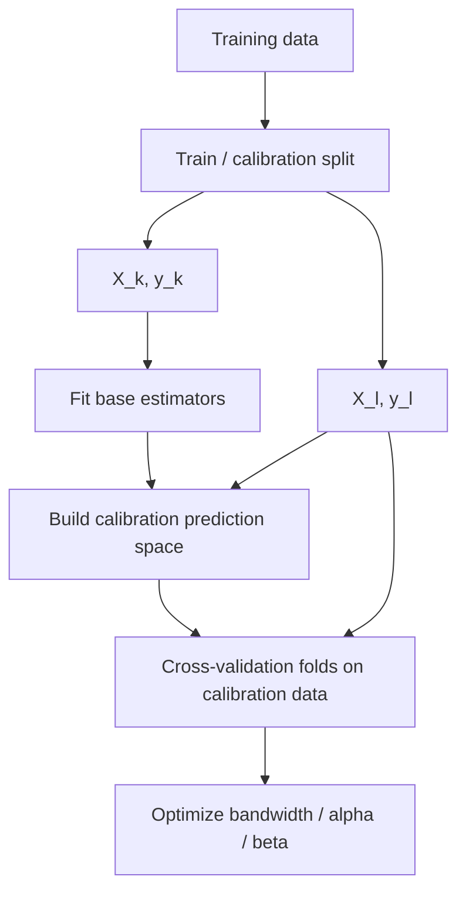

# Cross-validation

Cross-validation in the COBRA subsystem is used primarily to evaluate
aggregation hyperparameters such as:

```text
bandwidth
alpha
beta
```

on the **aggregation/calibration dataset**.

It is separate from the earlier train/calibration split described in
[Data Splitting](data-splitting.md).

The current source provides three registered cross-validation strategies:

```text
kfold
stratified_kfold
time_series
tscv
```

implemented under:

```text
kfc_procedure/cobra/core/cv/
├── base.py
├── kfold.py
├── stratified_kfold.py
└── time_series.py
```

and resolved through:

```python
CVFactory
```

---

## Where cross-validation sits

COBRA training has two different partitioning levels.

First, the data can be separated into:

```text
X_k, y_k
    base-estimator training data

X_l, y_l
    aggregation/calibration data
```

Then cross-validation operates **inside the calibration side** while tuning
COBRA hyperparameters.



So:

```text
data splitting
```

and:

```text
cross-validation
```

are different operations in the current architecture.

---

# Why COBRA cross-validation is used

The source-level objective is not to refit the original base estimators for
every fold.

Instead, COBRA first constructs the calibration representation and its
pairwise distance matrix.

For a candidate hyperparameter setting, it:

1. adapts the stored distance matrix;
2. applies the kernel;
3. extracts validation-to-training kernel blocks;
4. aggregates the calibration targets;
5. evaluates a loss;
6. averages the fold losses.

Conceptually:

\[
\boxed{
\text{candidate parameter}
\rightarrow
\text{kernel matrix}
\rightarrow
\text{fold predictions}
\rightarrow
\text{fold loss}
\rightarrow
\text{mean CV loss}
}
\]

---

# `BaseCrossValidator`

All built-in cross-validation classes inherit:

```python
BaseCrossValidator
```

The abstract interface defines:

```python
split(
    x,
    y,
    *,
    groups=None,
)
```

and:

```python
get_n_splits()
```

The `split()` method yields:

```python
SplitIndices
```

objects.

---

## `SplitIndices`

Each fold is represented by:

```python
SplitIndices(
    train_idx=...,
    eval_idx=...,
    fold_id=...,
)
```

The fields are:

```text
train_idx
    indices used as the fold's aggregation-training subset

eval_idx
    indices used as the fold's validation subset

fold_id
    integer fold identifier
```

For the built-in cross-validation classes:

```python
fold_id
```

starts at:

```text
0
```

and increases sequentially.

---

# `CVFactory`

Cross-validation implementations are registered with:

```python
CVFactory
```

which inherits the package's common:

```python
BaseFactory
```

Create a CV strategy with:

```python
from kfc_procedure.cobra.core.cv import (
    CVFactory,
)

cv = CVFactory.create(
    "kfold",
    n_splits=5,
    random_state=42,
)
```

---

## Inspect available strategies

```python
print(
    CVFactory.available()
)
```

The current source registers:

```text
kfold
stratified_kfold
time_series
tscv
```

where:

```text
time_series
tscv
```

are aliases for the same class.

---

# `KFoldCV`

The default cross-validator used by the current main COBRA estimators is:

```python
KFoldCV
```

registered as:

```text
kfold
```

Its constructor is:

```python
KFoldCV(
    n_splits=5,
    shuffle=True,
    random_state=None,
)
```

---

## K-fold behavior

The implementation:

1. creates all sample indices;
2. optionally shuffles them;
3. distributes them round-robin across `n_splits` lists;
4. uses each list once as validation data;
5. concatenates the other lists as training data.

The source does **not** delegate to scikit-learn's `KFold`.

It implements its own fold assignment.

---

# K-fold index construction

First:

```python
n = len(x)

indices = np.arange(n)
```

Then:

```python
rng = np.random.RandomState(
    self.random_state
)
```

If:

```python
self.shuffle
```

is true:

```python
indices = rng.permutation(
    indices
)
```

---

## Round-robin fold assignment

The source constructs:

```python
folds = [
    []
    for _
    in range(
        self.n_splits
    )
]
```

and then:

```python
for i, idx in enumerate(
    indices
):
    folds[
        i % self.n_splits
    ].append(
        idx
    )
```

So observations are distributed cyclically across folds.

This differs in implementation detail from simply cutting a shuffled index
array into contiguous chunks.

---

# Example K-fold assignment

Suppose:

```text
indices = [0, 1, 2, 3, 4, 5, 6, 7]
n_splits = 3
shuffle = False
```

The current algorithm produces:

```text
fold 0 = [0, 3, 6]
fold 1 = [1, 4, 7]
fold 2 = [2, 5]
```

because assignment is based on:

```python
i % n_splits
```

---

# K-fold train and validation indices

For each fold:

```python
val_idx = folds[i]
```

and:

```python
train_idx = np.concatenate([
    folds[j]
    for j
    in range(
        self.n_splits
    )
    if j != i
])
```

Then the training indices are sorted:

```python
train_idx = np.sort(
    train_idx
)
```

The validation indices are not explicitly sorted after shuffling.

---

## Consequence of sorting only training indices

With:

```python
shuffle=True
```

the validation array retains the order produced by the shuffled round-robin
assignment.

The training array is sorted back into ascending original-index order.

This does not change which observations belong to each set, but it is an exact
behavior of the current implementation.

---

# K-fold reproducibility

`KFoldCV` uses:

```python
np.random.RandomState(
    random_state
)
```

rather than:

```python
np.random.default_rng(...)
```

With the same input order, `n_splits`, and seed, the fold assignment is
reproducible.

---

# Disable K-fold shuffling

```python
cv = KFoldCV(
    n_splits=5,
    shuffle=False,
)
```

Then the original row order is distributed round-robin among folds.

This does **not** produce contiguous validation blocks.

For temporal data, use `TimeSeriesCV` rather than assuming
`KFoldCV(shuffle=False)` creates chronological windows.

---

# `get_n_splits()`

`KFoldCV` defines:

```python
get_n_splits(
    x=None,
    y=None,
)
```

and returns:

```python
self.n_splits
```

The optional `x` and `y` parameters are ignored.

---

# K-fold direct example

```python
from kfc_procedure.cobra.core.cv import (
    KFoldCV,
)

cv = KFoldCV(
    n_splits=5,
    shuffle=True,
    random_state=42,
)

for fold in cv.split(
    X,
    y,
):
    print(
        fold.fold_id,
        fold.train_idx,
        fold.eval_idx,
    )
```

---

# `StratifiedKFoldCV`

The source also provides:

```python
StratifiedKFoldCV
```

registered as:

```text
stratified_kfold
```

Its purpose is to distribute each class across folds.

The constructor is:

```python
StratifiedKFoldCV(
    n_splits=5,
    random_state=None,
)
```

There is no separate:

```python
shuffle=
```

parameter.

The class always shuffles class-specific indices internally.

---

# Stratified construction

The implementation converts:

```python
x
y
```

with:

```python
np.asarray(...)
```

then creates:

```python
rng = np.random.default_rng(
    self.random_state
)
```

Next it builds a dictionary:

```python
class_map = {}
```

mapping each observed label to the list of row indices belonging to that
class.

---

## Per-class split

For each class:

```python
idxs = np.array(
    idxs
)

rng.shuffle(
    idxs
)

parts = np.array_split(
    idxs,
    self.n_splits,
)
```

Then part `i` for every class is appended to fold `i`.

So every fold receives approximately:

\[
\frac{n_c}{K}
\]

observations from class \(c\), subject to integer division.

---

# Stratified example

Suppose:

```text
class 0 has 6 observations
class 1 has 3 observations
n_splits = 3
```

Then each fold receives approximately:

```text
2 class-0 observations
1 class-1 observation
```

after the within-class shuffling.

This is the source mechanism behind its class-distribution preservation.

---

# Stratified train and validation indices

After building all folds:

```python
val_idx = folds[i]
```

and:

```python
train_idx = np.concatenate([
    folds[j]
    for j
    in range(
        self.n_splits
    )
    if j != i
])
```

Unlike `KFoldCV`, the current stratified implementation does **not** sort the
training indices before yielding them.

---

# Stratified reproducibility

`StratifiedKFoldCV` uses:

```python
np.random.default_rng(
    self.random_state
)
```

which differs from the `RandomState` API used by `KFoldCV`.

A fixed seed makes the source implementation reproducible, but the exact
permutation sequence should not be assumed to match `KFoldCV` or scikit-learn
splitters using a different RNG API.

---

# `TimeSeriesCV`

Temporal cross-validation is implemented by:

```python
TimeSeriesCV
```

registered under:

```text
time_series
tscv
```

Its constructor is:

```python
TimeSeriesCV(
    n_splits=5,
    test_size=None,
)
```

It does not shuffle data and does not accept `random_state`.

---

# Time-series design

The source uses expanding training windows.

For each split:

```text
training:
    starts at index 0
    grows forward

validation:
    follows immediately after training
```

Conceptually:

```text
fold 0
train: [------]
valid:       [--]

fold 1
train: [----------]
valid:           [--]

fold 2
train: [--------------]
valid:               [--]
```

---

# Time-series step size

The implementation computes:

```python
step = (
    self.test_size
    or (
        n
        // (
            self.n_splits
            + 1
        )
    )
)
```

So if:

```python
test_size
```

is provided and truthy, it becomes the step size.

Otherwise:

\[
\text{step}
=
\left\lfloor
\frac{n}
{n_{\text{splits}}+1}
\right\rfloor.
\]

---

# Time-series fold boundaries

For fold:

```python
i
```

the source computes:

```python
train_end = step * (
    i + 1
)

val_end = step * (
    i + 2
)
```

Training indices are:

```python
np.arange(
    train_end
)
```

and validation indices are:

```python
np.arange(
    train_end,
    min(
        val_end,
        n,
    )
)
```

---

# Time-series example

For:

```text
n = 60
n_splits = 5
test_size = None
```

the default step is:

\[
60 // 6 = 10.
\]

The folds are:

```text
fold 0:
    train 0:10
    valid 10:20

fold 1:
    train 0:20
    valid 20:30

fold 2:
    train 0:30
    valid 30:40

fold 3:
    train 0:40
    valid 40:50

fold 4:
    train 0:50
    valid 50:60
```

---

# Explicit time-series `test_size`

For:

```python
TimeSeriesCV(
    n_splits=3,
    test_size=5,
)
```

the source uses:

```text
step = 5
```

for both the growth increment and validation-window width.

For example:

```text
fold 0:
    train 0:5
    valid 5:10

fold 1:
    train 0:10
    valid 10:15

fold 2:
    train 0:15
    valid 15:20
```

subject to clipping at `n`.

---

# Current validation limitations

The built-in CV classes do not perform comprehensive constructor validation.

For example, the source does not explicitly reject:

```text
n_splits <= 0
n_splits > n_samples
test_size <= 0
test_size too large
```

when the objects are created.

This can produce empty folds or lower-level NumPy errors later.

---

## KFold with too many folds

If:

```python
n_splits > n_samples
```

some round-robin folds remain empty.

Those empty validation folds are still yielded.

The source contains no explicit minimum fold-size validation.

---

## KFold with one split

With:

```python
n_splits=1
```

the training-set construction attempts to concatenate all folds except the
single validation fold.

That produces an empty list for:

```python
np.concatenate(...)
```

which can raise a NumPy error.

The current source does not intercept this case with a custom message.

---

## Stratified folds with rare classes

If a class has fewer samples than:

```python
n_splits
```

then:

```python
np.array_split(...)
```

creates empty class-specific parts for some folds.

A fold may therefore lack that class.

The source does not reject this situation.

So "stratified" should be understood as distributing available class examples
as evenly as the implementation can, not guaranteeing every class appears in
every fold.

---

## Time-series empty windows

If:

```text
n
```

is too small relative to:

```text
n_splits
```

then:

```python
n // (n_splits + 1)
```

can become:

```text
0.
```

That creates empty train and validation arrays.

Likewise, a large explicit `test_size` can cause later validation windows to be
empty once:

```python
train_end >= n.
```

The current class does not validate these conditions.

---

# COBRA defaults to K-fold

Although three CV strategies are registered, the current main COBRA estimators
hard-code:

```python
CVFactory.create(
    "kfold",
    n_splits=self.n_cv,
    shuffle=True,
    random_state=self.random_state,
)
```

inside component resolution.

This is true for:

```text
GradientCOBRA
MixCOBRARegressor
CombinedClassifier
```

---

## Important API consequence

The public constructors expose:

```python
n_cv
```

but do **not** expose:

```text
cv
cv_params
cross_validator
```

as constructor arguments.

Therefore, in the current high-level APIs, you can change the number of
folds but not select:

```text
stratified_kfold
time_series
```

through ordinary estimator configuration.

!!! important "Current API boundary"

    `StratifiedKFoldCV` and `TimeSeriesCV` are registered and can be used
    directly through `CVFactory`, but the current primary COBRA estimators
    construct `kfold` internally.

    Using a different CV strategy in those estimators requires extending or
    modifying the source.

---

# `n_cv`

The public parameter controlling fold count is:

```python
n_cv
```

with current default:

```text
5
```

for:

```text
GradientCOBRA
MixCOBRARegressor
CombinedClassifier
```

During component resolution it becomes:

```python
KFoldCV(
    n_splits=n_cv,
    shuffle=True,
    random_state=random_state,
)
```

---

# Fitted CV object

After component resolution, the cross-validator is stored as:

```python
model.cv_
```

For the current main estimators:

```python
type(
    model.cv_
).__name__
```

should be:

```text
KFoldCV
```

unless source code has been changed.

---

# Stored folds

The concrete folds used during optimization are materialized as a list:

```python
model.cv_folds_
```

For GradientCOBRA:

```python
self.cv_folds_ = list(
    self.cv_.split(
        self.X_l_,
        self.Y_l_norm_,
    )
)
```

For MixCOBRA:

```python
self.cv_folds_ = list(
    self.cv_.split(
        self.X_l_,
        self.y_l_,
    )
)
```

For CombinedClassifier:

```python
self.cv_folds_ = list(
    self.cv_.split(
        self.X_l_,
        self.y_l_,
    )
)
```

---

# GradientCOBRA's unusual `y` argument

GradientCOBRA calls:

```python
self.cv_.split(
    self.X_l_,
    self.Y_l_norm_,
)
```

rather than:

```python
self.y_l_
```

as the second argument.

With the current default:

```text
KFoldCV
```

this makes no difference because `KFoldCV.split()` ignores `y`.

!!! note "Current source detail"

    If GradientCOBRA were changed to use a cross-validator whose fold
    construction depends on `y`, this call would matter because the supplied
    second argument is the normalized prediction-space matrix rather than the
    regression target vector.

    The current high-level source avoids that issue by always resolving
    `kfold`.

---

# CombinedClassifier does not use stratified CV by default

Although:

```python
StratifiedKFoldCV
```

is available in the registry, `CombinedClassifier` currently creates:

```python
"kfold"
```

rather than:

```python
"stratified_kfold"
```

for its bandwidth optimization.

Therefore classification CV inside `CombinedClassifier` does not explicitly
preserve class proportions.

This is separate from the package's top-level KFC split, which has its own
classification stratification logic.

---

# How GradientCOBRA uses folds

GradientCOBRA first stores a square calibration distance matrix:

```python
self.distance_matrix_
```

For a candidate bandwidth:

```python
bandwidth
```

it sets:

```python
self.adapter_.set_params(
    bandwidth=bandwidth
)
```

then computes:

```python
D = self.adapter_.transform(
    self.distance_matrix_
)

K = self.kernel_(D)
```

---

## Fold-specific kernel block

For each stored fold:

```python
train_idx = fold.train_idx
val_idx = fold.eval_idx
```

the validation-to-training kernel block is:

```python
K_val_train = K[
    np.ix_(
        val_idx,
        train_idx,
    )
]
```

If:

```text
n_val = len(val_idx)
n_train = len(train_idx)
```

then:

```text
K_val_train.shape
==
(n_val, n_train)
```

---

# Fold prediction in GradientCOBRA

The fold training targets are:

```python
y_train = self.y_l_[
    train_idx
]
```

and validation targets:

```python
y_val = self.y_l_[
    val_idx
]
```

Predictions are produced by:

```python
self.aggregator_.aggregate_matrix(
    values=y_train,
    weights=K_val_train,
    fallback=0.0,
)
```

Then the fold error is:

```python
self.loss_(
    y_val,
    preds,
)
```

---

# Mean GradientCOBRA CV error

Errors are appended:

```python
errors.append(
    error
)
```

and the objective returns:

```python
float(
    np.mean(
        errors
    )
)
```

So optimization minimizes the mean loss across folds.

---

# GradientCOBRA CV fallback

Inside cross-validation, GradientCOBRA explicitly passes:

```python
fallback=0.0
```

to the regression aggregator.

This differs from final prediction, where the source uses:

```python
fallback=self.global_mean_
```

for the fitted model.

Therefore candidate bandwidths are evaluated under a zero-weight fallback of:

```text
0.0
```

during CV.

---

# MixCOBRA cross-validation

MixCOBRA uses the same basic fold structure but has two objective forms.

With:

```python
one_parameter=True
```

it evaluates one:

```text
bandwidth
```

parameter.

With:

```python
one_parameter=False
```

it evaluates:

```text
alpha
beta
```

jointly.

---

# MixCOBRA one-parameter CV

The objective:

```python
kappa_cross_validation_error_1d()
```

sets:

```python
self.adapter_.set_params(
    bandwidth=bandwidth
)
```

then transforms:

```python
self.distance_matrix_mix_
```

and applies the kernel.

The same fold extraction pattern is used:

```python
K_val_train = K[
    np.ix_(
        val_idx,
        train_idx,
    )
]
```

---

# MixCOBRA two-parameter CV

The objective:

```python
kappa_cross_validation_error_2d()
```

receives:

```python
alpha, beta
```

and updates:

```python
self.adapter_.set_params(
    alpha=alpha,
    beta=beta,
)
```

The two stored distance matrices are fused by:

```python
self.adapter_.transform(
    self.distance_matrix_x_,
    self.distance_matrix_y_,
)
```

before kernel application.

Each fold is then evaluated with the same target aggregation process.

---

# MixCOBRA CV fallback

Like GradientCOBRA, MixCOBRA uses:

```python
fallback=0.0
```

inside its regression cross-validation objectives.

The fold losses are averaged with:

```python
np.mean(errors)
```

---

# CombinedClassifier cross-validation

CombinedClassifier also starts from a square calibration distance matrix.

For a candidate:

```python
bandwidth
```

it computes a kernel matrix and extracts:

```python
K_vt = K[
    np.ix_(
        val_idx,
        train_idx,
    )
]
```

---

## Fold-level classification prediction

For each validation row:

```python
w = K_vt[i]
```

the source checks:

```python
if np.sum(w) <= 0:
    pred = self.global_majority_class_
else:
    pred = self.aggregator_.aggregate(
        y_train,
        w,
    )
```

Predictions are collected into an array and compared with:

```python
y_true = self.y_l_[
    val_idx
]
```

using:

```python
self.loss_
```

---

# CombinedClassifier fallback during CV

If a validation query receives a non-positive kernel-weight sum, the fallback
is:

```python
self.global_majority_class_
```

This differs from the regression CV fallback of:

```text
0.0
```

---

# CombinedClassifier loss default

The current constructor default is:

```python
loss="mse"
```

even though the estimator is a classifier.

Therefore, unless changed, the CV objective applies the registered MSE loss to
the numeric class predictions and targets.

This is a current source default, not a generic classification recommendation.

For supported alternatives, see:

[Loss Functions](losses.md)

---

# CV and optimization

Cross-validation itself does not choose the final hyperparameter.

It defines the objective function consumed by the optimizer.

For example:

```text
candidate bandwidth
    ↓
mean cross-validation loss
    ↓
optimizer compares candidates
    ↓
selected bandwidth_
```

The optimizer layer is documented separately in:

[Optimization](optimization.md)

---

# Grid search and folds

With the default grid optimization, every candidate bandwidth is evaluated by
calling the CV objective.

For GradientCOBRA and CombinedClassifier, the default candidate list is:

```python
np.linspace(
    0.001,
    10.0,
    max_iter,
)
```

when no custom bandwidth list is supplied.

So with:

```text
max_iter = 300
n_cv = 5
```

the CV objective conceptually performs:

```text
300 parameter evaluations
×
5 fold losses
```

although the expensive pairwise distance matrix is precomputed once before
those evaluations.

---

# Why the distance matrix is precomputed

The source does not recompute prediction-space distances for every fold and
every candidate parameter.

Instead:

```python
self.distance_matrix_
```

or the MixCOBRA distance matrices are created once.

Each candidate parameter only changes the adapter transformation and kernel
weights.

This makes CV operate on:

```text
stored geometry
```

rather than repeatedly reconstructing the full distance computation.

---

# Inspect the fitted folds

After fitting:

```python
print(
    len(
        model.cv_folds_
    )
)
```

Normally:

```text
5
```

with the default:

```python
n_cv=5
```

---

## Inspect fold sizes

```python
for fold in model.cv_folds_:
    print(
        "fold:",
        fold.fold_id,
        "train:",
        len(
            fold.train_idx
        ),
        "validation:",
        len(
            fold.eval_idx
        ),
    )
```

---

# Inspect exact indices

```python
fold = model.cv_folds_[0]

print(
    fold.train_idx
)

print(
    fold.eval_idx
)
```

These indices refer to rows of the calibration arrays:

```text
X_l_
y_l_
```

not to the original unsplit full dataset.

---

# Map fold indices to calibration targets

```python
fold = model.cv_folds_[0]

y_train_fold = model.y_l_[
    fold.train_idx
]

y_val_fold = model.y_l_[
    fold.eval_idx
]
```

This reproduces the target subsets used by the CV objective.

---

# Reproduce the default K-fold object

For a fitted model configured with:

```python
n_cv=5
random_state=42
```

the equivalent current CV constructor is:

```python
from kfc_procedure.cobra.core.cv import (
    KFoldCV,
)

cv = KFoldCV(
    n_splits=5,
    shuffle=True,
    random_state=42,
)
```

Then:

```python
folds = list(
    cv.split(
        model.X_l_,
        model.y_l_,
    )
)
```

matches the same K-fold logic for MixCOBRA and CombinedClassifier.

For GradientCOBRA, its source call supplies:

```python
model.Y_l_norm_
```

as the second argument, but `KFoldCV` ignores that value.

---

# Using stratified CV directly

Although current high-level COBRA estimators do not expose it as a constructor
choice, the CV class itself can be used directly.

```python
from kfc_procedure.cobra.core.cv import (
    StratifiedKFoldCV,
)

cv = StratifiedKFoldCV(
    n_splits=5,
    random_state=42,
)

for fold in cv.split(
    X,
    y,
):
    ...
```

This can be useful when extending the estimator source or testing fold
construction independently.

---

# Inspect class balance

```python
import numpy as np

for fold in cv.split(
    X,
    y,
):
    labels, counts = np.unique(
        y[
            fold.eval_idx
        ],
        return_counts=True,
    )

    print(
        fold.fold_id,
        dict(
            zip(
                labels,
                counts,
            )
        ),
    )
```

This shows the approximate class distribution achieved by the source
implementation.

---

# Using time-series CV directly

```python
from kfc_procedure.cobra.core.cv import (
    TimeSeriesCV,
)

cv = TimeSeriesCV(
    n_splits=5,
)

for fold in cv.split(
    X,
    y,
):
    print(
        fold.train_idx,
        fold.eval_idx,
    )
```

The input order is treated as chronological order.

The class itself does not inspect timestamps or sort rows by a time column.

---

## Important time-order requirement

If temporal rows are not already ordered correctly before calling:

```python
TimeSeriesCV.split()
```

the source does not reorder them.

Chronology is assumed to be encoded by row order.

---

# Custom cross-validator

A custom CV strategy can subclass:

```python
BaseCrossValidator
```

and register with:

```python
CVFactory
```

For example:

```python
import numpy as np

from kfc_procedure.cobra.core.cv import (
    BaseCrossValidator,
    CVFactory,
)

from kfc_procedure.cobra.core.types import (
    SplitIndices,
)


@CVFactory.register(
    "two_fold_fixed"
)
class TwoFoldFixed(
    BaseCrossValidator
):

    def split(
        self,
        x,
        y,
        *,
        groups=None,
    ):
        n = len(x)
        cut = n // 2

        first = np.arange(
            cut
        )

        second = np.arange(
            cut,
            n,
        )

        yield SplitIndices(
            train_idx=first,
            eval_idx=second,
            fold_id=0,
        )

        yield SplitIndices(
            train_idx=second,
            eval_idx=first,
            fold_id=1,
        )

    def get_n_splits(
        self,
    ):
        return 2
```

---

# Current custom-CV integration limitation

Registering a custom strategy makes it available through:

```python
CVFactory.create(...)
```

but the current:

```text
GradientCOBRA
MixCOBRARegressor
CombinedClassifier
```

constructors still hard-code:

```text
kfold
```

inside their component resolution.

Therefore registration alone does not make a custom CV strategy selectable via
a high-level estimator argument.

The estimator source would need a configurable:

```text
cv
cv_params
```

path to expose that extension fully.

---

# Groups parameter

`BaseCrossValidator.split()` includes:

```python
groups=None
```

in its abstract interface.

However:

```text
KFoldCV
StratifiedKFoldCV
TimeSeriesCV
```

do not implement group-based splitting logic.

Their concrete `split()` signatures also do not all preserve the abstract
keyword-only `groups` parameter.

So group-aware cross-validation is not implemented by the current built-ins.

---

# Data splitting vs cross-validation

A useful comparison:

| Layer | Purpose | Current default |
| --- | --- | --- |
| data splitter | create `X_k/y_k` and `X_l/y_l` | `OverlapSplitter` |
| cross-validator | create optimization folds within calibration data | `KFoldCV` |
| optimizer | choose bandwidth / alpha / beta from CV objective | `grid` |

These layers should not be treated as interchangeable.

---

# KFC C-Step and CV

When KFC wraps:

```text
GradientCOBRA
MixCOBRA
CombinedClassifier
```

it passes the F-Step matrix with:

```python
as_predictions=True
```

This bypasses COBRA's first-level train/calibration split.

However, the wrapped estimator still resolves its internal:

```python
KFoldCV
```

and builds:

```python
cv_folds_
```

over the supplied KFC C-Step training matrix.

So:

```text
as_predictions=True
```

bypasses data splitting but does **not** bypass COBRA hyperparameter
cross-validation.

---

# KFC example: GradientCOBRA

KFC's C-Step wrapper runs conceptually:

```python
cobra.fit(
    P_l,
    y_l,
    as_predictions=True,
)
```

Inside GradientCOBRA:

```text
P_l
    becomes calibration prediction space

KFoldCV
    splits rows of P_l into CV folds

bandwidth optimizer
    minimizes mean fold loss
```

So the C-Step aggregation data is itself cross-validated for bandwidth
selection.

---

# Classification KFC example

For:

```text
combined_classifier
```

the KFC F-Step class-prediction matrix becomes:

```python
pred_l_
```

inside `CombinedClassifier`.

Then ordinary K-fold CV is used to optimize the classifier's bandwidth.

The current wrapper does not switch to `StratifiedKFoldCV`.

---

# Reproducibility

For the main COBRA estimators, the same:

```python
random_state
```

is passed to:

```python
KFoldCV(
    shuffle=True,
    random_state=...
)
```

Therefore changing the estimator's `random_state` can change:

```text
calibration K-fold membership
```

in addition to any other random components of the model.

---

# Cross-validation does not refit base estimators

The current CV objective works from:

```text
distance matrices
kernel matrices
calibration targets
```

It does not call:

```python
fit_estimators()
```

inside every fold.

That means the fold "training" indices refer to the aggregation stage, not to
freshly refitted base learners.

This is important when interpreting the CV design.

---

# No out-of-fold base-prediction construction inside CV

Base estimators are fitted before COBRA hyperparameter cross-validation.

The source does not use each `cv_folds_` split to regenerate base-estimator
predictions out of fold.

Instead, the already-constructed calibration prediction-space geometry is
partitioned for aggregation evaluation.

---

# Debugging cross-validation

## Inspect the CV object

```python
print(
    model.cv_
)
```

---

## Inspect the number of configured folds

```python
print(
    model.cv_.get_n_splits()
)
```

---

## Inspect materialized folds

```python
for fold in model.cv_folds_:
    print(
        fold.fold_id,
        fold.train_idx.shape,
        fold.eval_idx.shape,
    )
```

---

## Check validation coverage

For K-fold:

```python
import numpy as np

all_validation = np.concatenate([
    fold.eval_idx
    for fold
    in model.cv_folds_
])

print(
    np.sort(
        all_validation
    )
)
```

With a normal valid K-fold configuration, every calibration row should occur
once in the concatenated validation indices.

---

## Check for empty folds

```python
for fold in model.cv_folds_:
    if len(
        fold.eval_idx
    ) == 0:
        print(
            "empty validation fold:",
            fold.fold_id,
        )
```

This is especially useful if:

```python
n_cv
```

is large relative to the calibration sample count.

---

## Check fold loss manually

For GradientCOBRA, one candidate bandwidth can be evaluated directly:

```python
score = model.kappa_cross_validation_error([
    model.bandwidth_
])

print(
    score
)
```

This reuses:

```python
model.cv_folds_
```

and the already-fitted component state.

---

# Current implementation summary

| CV | Registry | Default folds | Shuffle | RNG | Main behavior |
| --- | --- | ---: | :---: | --- | --- |
| `KFoldCV` | `kfold` | 5 | Yes | `RandomState` | shuffled round-robin folds |
| `StratifiedKFoldCV` | `stratified_kfold` | 5 | internally | `default_rng` | split each class with `array_split` |
| `TimeSeriesCV` | `time_series`, `tscv` | 5 | No | none | expanding chronological windows |

---

# Current high-level estimator behavior

| Estimator | CV used internally | Public fold parameter | Public CV strategy parameter |
| --- | --- | --- | --- |
| `GradientCOBRA` | `kfold` | `n_cv` | No |
| `MixCOBRARegressor` | `kfold` | `n_cv` | No |
| `CombinedClassifier` | `kfold` | `n_cv` | No |

---

# Important source caveats

| Area | Current behavior |
| --- | --- |
| CV default | custom `KFoldCV`, not sklearn KFold |
| fold assignment | round-robin after optional shuffle |
| `n_splits` validation | not explicitly implemented |
| classification default CV | ordinary K-fold, not stratified |
| time-series order | assumes rows already chronological |
| group-aware CV | not implemented |
| custom CV registry | supported |
| high-level custom CV selection | not exposed |
| CV operates on | calibration/aggregation rows |
| base estimators refitted per fold | No |
| regression CV zero-weight fallback | `0.0` |
| classification CV zero-weight fallback | global majority class |

---

# Quick reference

| Question | Current source answer |
| --- | --- |
| What is the default CV? | `KFoldCV` |
| How many folds by default? | `5` |
| Is K-fold shuffled? | Yes |
| Which seed is used? | estimator `random_state` |
| Is classification CV stratified? | No |
| Is stratified CV implemented? | Yes, but not selected by main estimators |
| Is time-series CV implemented? | Yes, but not selected by main estimators |
| Can `cv=` be passed to GradientCOBRA? | No |
| Are base estimators refitted each fold? | No |
| What does CV optimize? | COBRA aggregation hyperparameters |
| Where are folds stored? | `cv_folds_` |

---

# Mental model

!!! quote ""

    **COBRA cross-validation does not rebuild the entire learning pipeline for
    every fold. It reuses the calibration geometry and asks which aggregation
    hyperparameters predict held-out calibration rows best.**

\[
\boxed{
\text{calibration distance matrix}
\rightarrow
\text{candidate kernel parameters}
\rightarrow
\text{K-fold aggregation predictions}
\rightarrow
\text{mean loss}
}
\]

The current high-level estimators all use the package's custom shuffled
`KFoldCV`, while stratified and temporal strategies exist as registered
components that are not yet exposed through the main estimator constructors.

