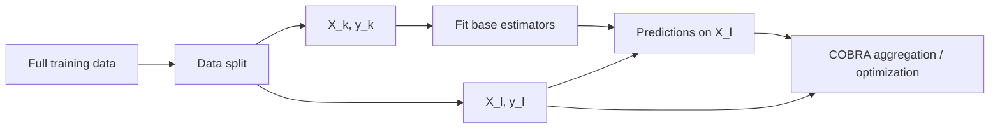

# Data Splitting

COBRA-style estimators separate **base-estimator fitting data** from
**aggregation/calibration data**.

The current source represents these two roles as:

```text
X_k, y_k
    estimator-training data

X_l, y_l
    aggregation / calibration data
```

This separation is handled primarily by:

```python
resolve_training_context()
```

in:

```text
kfc_procedure/cobra/utils/resolve.py
```

and by the splitter implementations under:

```text
kfc_procedure/cobra/core/splitters/
├── base.py
├── holdout.py
└── overlap.py
```

The main splitters are:

```text
RandomHoldoutSplitter
OverlapSplitter
```

---

## Why COBRA uses two datasets

In the normal feature-based workflow, base estimators are first fitted on:

\[
(X_k,y_k).
\]

Those fitted estimators then generate predictions on:

\[
X_l.
\]

The resulting prediction representation is paired with:

\[
y_l
\]

and used by the aggregation procedure.

Conceptually:



This distinction is used by:

```text
GradientCOBRA
MixCOBRARegressor
CombinedClassifier
```

when they are fitted from ordinary feature matrices.

---

# `TrainingContext`

The resolved datasets are stored in:

```python
TrainingContext
```

defined in:

```text
kfc_procedure/cobra/core/types.py
```

Its fields are:

```python
@dataclass(slots=True)
class TrainingContext:
    X_k: np.ndarray | None
    y_k: np.ndarray | None

    X_l: np.ndarray
    y_l: np.ndarray

    as_predictions: bool
```

---

## Meaning of the fields

| Field | Purpose |
| --- | --- |
| `X_k` | data used to fit base estimators |
| `y_k` | targets for base-estimator fitting |
| `X_l` | aggregation/calibration input |
| `y_l` | aggregation/calibration targets |
| `as_predictions` | whether the supplied matrix is already prediction space |

When:

```python
as_predictions=True
```

the training side is intentionally absent:

```python
X_k = None
y_k = None
```

because no base estimators need to be fitted.

---

# Split indices

Concrete splitters return:

```python
SplitIndices
```

with:

```python
train_idx
eval_idx
fold_id
```

The dataclass is:

```python
@dataclass(slots=True)
class SplitIndices:
    train_idx: np.ndarray
    eval_idx: np.ndarray
    fold_id: int | None = None
```

For ordinary train/calibration splitting:

```python
fold_id
```

remains `None`.

---

# The splitter interface

All splitters inherit:

```python
BaseDataSplitter
```

and are expected to implement:

```python
split(
    x,
    y,
    *,
    groups=None,
)
```

returning a:

```python
SplitIndices
```

object.

The base abstraction describes splitters as index generators rather than data
transformers.

They operate on sample indices and do not modify the feature matrix or target
vector directly.

---

# Splitter registry

Splitters are registered through:

```python
SplitterFactory
```

The current built-in names are:

```text
holdout
random_holdout
split_overlap
```

where:

```text
holdout
random_holdout
```

are aliases for:

```python
RandomHoldoutSplitter
```

and:

```text
split_overlap
```

creates:

```python
OverlapSplitter
```

---

## Inspect available splitters

```python
from kfc_procedure.cobra.core.splitters import (
    SplitterFactory,
)

print(
    SplitterFactory.available()
)
```

The current registry should contain:

```text
holdout
random_holdout
split_overlap
```

after the splitter package has been imported.

---

# Default COBRA split

The shared resolver uses:

```python
OverlapSplitter
```

by default.

If no explicit splitter is passed to:

```python
resolve_training_context()
```

the source creates:

```python
SplitterFactory.create(
    "split_overlap",
    split_ratio=split_ratio,
    overlap=overlap,
    random_state=random_state,
)
```

Therefore the default automatic COBRA split is **not**
`RandomHoldoutSplitter`.

It is:

```text
OverlapSplitter
```

with:

```python
split_ratio=0.5
overlap=0.0
shuffle=True
```

unless different values are supplied.

---

# `OverlapSplitter`

`OverlapSplitter` is registered as:

```text
split_overlap
```

Its constructor is:

```python
OverlapSplitter(
    split_ratio=0.5,
    overlap=0.0,
    shuffle=True,
    random_state=None,
)
```

It can create disjoint or overlapping training/calibration index sets.

---

## Parameter validation

The constructor requires:

\[
0 < \text{split_ratio} < 1.
\]

Otherwise:

```text
ValueError:
split_ratio must be in (0,1)
```

It also requires:

\[
0 \leq \text{overlap} < 1.
\]

Otherwise:

```text
ValueError:
overlap must be in [0,1)
```

Finally:

\[
\text{overlap}
<
\text{split_ratio}.
\]

If not, the implementation first prints:

```text
Invalid parameters: split_ratio=..., overlap=...
```

and then raises:

```text
ValueError:
overlap must be smaller than split_ratio
```

---

# Overlap split geometry

For:

\[
n
\]

observations, the implementation computes:

\[
k_1
=
\operatorname{int}
\left[
n
\left(
r-\frac{o}{2}
\right)
\right]
\]

and:

\[
k_2
=
\operatorname{int}
\left[
n
\left(
r+\frac{o}{2}
\right)
\right],
\]

where:

```text
r = split_ratio
o = overlap
```

Then:

```python
train_idx = indices[:k2]
eval_idx = indices[k1:]
```

So the region:

```text
indices[k1:k2]
```

belongs to **both** subsets.

---

## Visual model

```text
0                                                n
|------------------------------------------------|

                split_ratio = r

              k1          k2
               |-----------|
               |  overlap  |
               |-----------|

train:
|---------------------------|

evaluation:
               |------------------------------|
```

The training subset ends at:

```text
k2
```

while the evaluation subset begins at:

```text
k1
```

---

# No-overlap case

With:

```python
split_ratio=0.5
overlap=0.0
```

the boundaries are:

\[
k_1
=
k_2
=
\operatorname{int}(0.5n).
\]

Therefore:

```text
train_idx = indices[:k]
eval_idx  = indices[k:]
```

and the partitions are disjoint.

This is the default behavior used by the COBRA estimators.

---

# Example: 50/50 split

For:

```text
n = 100
split_ratio = 0.5
overlap = 0.0
```

the implementation gives approximately:

```text
train size = 50
evaluation size = 50
shared = 0
```

subject to integer truncation when the sample count does not divide exactly.

---

# Example: overlap

For:

```text
n = 100
split_ratio = 0.5
overlap = 0.2
```

the boundaries are:

\[
k_1
=
100(0.5-0.1)
=
40
\]

and:

\[
k_2
=
100(0.5+0.1)
=
60.
\]

So:

```text
train_idx = first 60 shuffled indices
eval_idx  = shuffled indices from position 40 onward
```

giving:

```text
train size = 60
evaluation size = 60
shared samples = 20
```

---

# Approximate subset sizes

Ignoring integer truncation:

\[
n_{\text{train}}
\approx
n
\left(
r+\frac{o}{2}
\right),
\]

and:

\[
n_{\text{eval}}
\approx
n
\left(
1-r+\frac{o}{2}
\right).
\]

The shared region is approximately:

\[
n_{\text{shared}}
\approx
no.
\]

Because the implementation uses Python `int()`, exact counts can differ by one
or more samples from these continuous expressions for small datasets.

---

# `split_ratio` is not simply the final train fraction when overlap is used

With:

```python
overlap > 0
```

the final training set extends beyond:

```text
n * split_ratio
```

by approximately:

\[
\frac{no}{2}.
\]

Likewise, the evaluation set begins before the split-ratio boundary by the
same amount.

So:

```python
split_ratio=0.5
overlap=0.2
```

does **not** create a 50-sample training subset and a 50-sample evaluation
subset with 20 shared samples.

The implementation creates approximately:

```text
60 training samples
60 evaluation samples
20 shared samples
```

for `n=100`.

---

# Shuffling

`OverlapSplitter` defaults to:

```python
shuffle=True
```

Before computing subsets, it creates:

```python
indices = np.arange(n)
```

and passes them through:

```python
_shuffle_indices()
```

---

## Random generator

When shuffling is enabled, the implementation uses:

```python
rng = np.random.default_rng(
    self.random_state
)

rng.shuffle(
    shuffled
)
```

Therefore:

```python
random_state
```

controls the permutation produced by the overlap splitter.

---

## Disable shuffling

You can create:

```python
splitter = OverlapSplitter(
    split_ratio=0.5,
    overlap=0.0,
    shuffle=False,
)
```

Then:

```text
train_idx
```

contains the first portion of the original row order and:

```text
eval_idx
```

contains the remaining portion.

!!! warning

    The high-level COBRA `fit()` methods do not currently expose a
    `shuffle` argument for the default splitter.

    Their automatic split path constructs the default overlap splitter with its
    own default:

    ```python
    shuffle=True
    ```

---

# Target values are not used by `OverlapSplitter`

The splitter's `split()` method receives:

```python
x
y
```

but the implementation uses only:

```python
np.asarray(x).shape[0]
```

to obtain the sample count.

It does not use:

```text
target values
class labels
target distribution
```

when generating the partition.

Therefore the automatic overlap split is **not stratified**.

---

# No group-aware splitting in the concrete implementation

`BaseDataSplitter.split()` includes an optional abstract:

```python
groups
```

parameter.

However, the current concrete:

```text
RandomHoldoutSplitter
OverlapSplitter
```

implementations do not expose a `groups` argument in their own method
signatures.

So the current built-ins do not implement group-aware partitioning.

---

# `RandomHoldoutSplitter`

The second built-in strategy is:

```python
RandomHoldoutSplitter
```

registered as:

```text
holdout
random_holdout
```

Its constructor is:

```python
RandomHoldoutSplitter(
    calibration_size=0.5,
    random_state=None,
)
```

---

## Implementation

It creates:

```python
indices = np.arange(
    n_samples
)
```

and calls:

```python
train_test_split(
    indices,
    test_size=self.calibration_size,
    random_state=self.random_state,
    shuffle=True,
)
```

The result is returned as:

```python
SplitIndices(
    train_idx=...,
    eval_idx=...,
)
```

---

# Holdout partitions are disjoint

Unlike `OverlapSplitter` with:

```python
overlap > 0
```

the random holdout strategy produces disjoint subsets.

No observation is placed in both:

```text
train_idx
eval_idx
```

by `train_test_split`.

---

# Holdout calibration size

The intended constructor domain is:

\[
0
<
\text{calibration_size}
<
1.
\]

The source stores:

```python
self.calibration_size = float(
    calibration_size
)
```

without an explicit manual interval check in `__init__()`.

Validation of unsupported values is therefore left to:

```python
sklearn.model_selection.train_test_split
```

when `split()` is called.

---

# Holdout is also not stratified

Although `split()` receives `y`, it does not pass:

```python
stratify=y
```

to `train_test_split()`.

The actual call uses:

```python
train_test_split(
    indices,
    test_size=self.calibration_size,
    random_state=self.random_state,
    shuffle=True,
)
```

Therefore classification label balance is not explicitly preserved by the
current holdout implementation.

---

# Direct splitter usage

## Overlap splitter

```python
from kfc_procedure.cobra.core.splitters import (
    OverlapSplitter,
)

splitter = OverlapSplitter(
    split_ratio=0.5,
    overlap=0.1,
    random_state=42,
)

indices = splitter.split(
    X,
    y,
)

print(
    indices.train_idx
)

print(
    indices.eval_idx
)
```

---

## Holdout splitter

```python
from kfc_procedure.cobra.core.splitters import (
    RandomHoldoutSplitter,
)

splitter = RandomHoldoutSplitter(
    calibration_size=0.4,
    random_state=42,
)

indices = splitter.split(
    X,
    y,
)
```

---

# Factory usage

Create an overlap splitter:

```python
from kfc_procedure.cobra.core.splitters import (
    SplitterFactory,
)

splitter = SplitterFactory.create(
    "split_overlap",
    split_ratio=0.5,
    overlap=0.1,
    random_state=42,
)
```

Create a holdout splitter:

```python
splitter = SplitterFactory.create(
    "holdout",
    calibration_size=0.4,
    random_state=42,
)
```

The alias:

```text
random_holdout
```

creates the same class.

---

# `resolve_training_context()`

Most COBRA estimators use the shared:

```python
resolve_training_context()
```

function.

Its relevant signature is:

```python
resolve_training_context(
    X,
    y,
    *,
    X_l=None,
    y_l=None,
    pred_features=None,
    as_predictions=False,
    splitter=None,
    split_ratio=0.5,
    overlap=0.0,
    random_state=None,
)
```

The function supports several distinct data-resolution modes.

---

# Mode 1 — precomputed prediction data

The first branch is:

```python
if as_predictions:
    return TrainingContext(
        X_k=None,
        y_k=None,
        X_l=np.asarray(X),
        y_l=np.asarray(y),
        as_predictions=True,
    )
```

So when:

```python
as_predictions=True
```

**no split is performed**.

The entire supplied matrix becomes:

```text
X_l
```

and the entire target vector becomes:

```text
y_l.
```

---

## Example

```python
ctx = resolve_training_context(
    P_train,
    y_train,
    as_predictions=True,
)
```

produces conceptually:

```text
X_k = None
y_k = None

X_l = P_train
y_l = y_train

as_predictions = True
```

The splitter arguments are bypassed in this mode.

---

# Mode 2 — explicit calibration data

If both:

```python
X_l
y_l
```

are supplied, the resolver does not create a split.

Instead:

```python
X
y
```

become:

```text
X_k
y_k
```

and the explicitly supplied data become:

```text
X_l
y_l.
```

---

## Example

```python
ctx = resolve_training_context(
    X_train,
    y_train,
    X_l=X_cal,
    y_l=y_cal,
)
```

produces:

```text
X_k = X_train
y_k = y_train

X_l = X_cal
y_l = y_cal
```

---

## Both explicit arrays are required

Providing only:

```python
X_l
```

or only:

```python
y_l
```

raises:

```text
ValueError:
Both 'X_l' and 'y_l' must be provided together.
```

This check occurs before automatic splitting.

---

# Mode 3 — `pred_features`

The resolver also contains a special:

```python
pred_features
```

branch.

If present, it checks:

```python
pred_features.shape[0]
==
X.shape[0]
```

and returns:

```python
TrainingContext(
    X_k=np.asarray(X),
    y_k=np.asarray(y),
    X_l=pred_features,
    y_l=np.asarray(y),
    as_predictions=False,
)
```

No automatic train/calibration split occurs in this branch.

---

## Important current MixCOBRA caveat

`MixCOBRARegressor.fit()` passes its:

```python
pred_features
```

argument into this resolver.

However, after resolution, the current MixCOBRA code still treats:

```python
X_l_
```

as an input to the fitted base estimators in the normal
`as_predictions=False` path.

Therefore the source does not currently use this resolver branch as a direct,
clean precomputed-prediction path.

See:

[Prediction Space](prediction-space.md)

for the source-level behavior.

---

# Mode 4 — automatic splitting

If none of the earlier modes applies, the resolver performs an automatic split.

If:

```python
splitter is None
```

it creates:

```python
OverlapSplitter
```

through:

```python
SplitterFactory.create(
    "split_overlap",
    split_ratio=split_ratio,
    overlap=overlap,
    random_state=random_state,
)
```

Then:

```python
split_indices = splitter.split(
    X,
    y,
)
```

and the arrays are sliced by those indices.

---

## Returned arrays

The final context is:

```python
TrainingContext(
    X_k=np.asarray(X)[train_idx],
    y_k=np.asarray(y)[train_idx],
    X_l=np.asarray(X)[eval_idx],
    y_l=np.asarray(y)[eval_idx],
    as_predictions=False,
)
```

So all overlap behavior is reflected literally in the data arrays.

If a sample index occurs in both index sets, that observation occurs in both
`X_k` and `X_l`.

---

# Input validation

At the beginning of:

```python
resolve_training_context()
```

the source calls:

```python
X, y = check_X_y(
    X,
    y,
)
```

from scikit-learn.

Explicit:

```python
X_l
y_l
```

data are also validated with:

```python
check_X_y(
    X_l,
    y_l,
)
```

before they are placed in the `TrainingContext`.

---

# GradientCOBRA splitting

The current `GradientCOBRA.fit()` signature contains:

```python
fit(
    X,
    y,
    X_l=None,
    y_l=None,
    split_ratio=0.5,
    overlap=0.0,
    as_predictions=False,
)
```

It calls:

```python
resolve_training_context(
    X,
    y,
    X_l=X_l,
    y_l=y_l,
    as_predictions=as_predictions,
    split_ratio=split_ratio,
    overlap=overlap,
    random_state=self.random_state,
)
```

So GradientCOBRA exposes:

```text
explicit calibration data
split_ratio
overlap
as_predictions
```

through its public `fit()` method.

---

# CombinedClassifier splitting

The current classifier signature is:

```python
fit(
    X,
    y,
    X_l=None,
    y_l=None,
    split_ratio=0.5,
    overlap=False,
    as_predictions=False,
)
```

It passes these values to the same resolver.

The default:

```python
overlap=False
```

is accepted by `OverlapSplitter` because Python `False` behaves numerically as
zero.

So the default classifier split is effectively:

```python
overlap=0.0
```

---

# MixCOBRA splitting

The current `MixCOBRARegressor.fit()` signature contains:

```python
fit(
    X,
    y,
    X_l=None,
    y_l=None,
    split_ratio=0.5,
    overlap=0.0,
    pred_features=None,
    as_predictions=False,
)
```

It therefore exposes:

```text
explicit calibration data
automatic split ratio
overlap
pred_features
as_predictions
```

to the shared resolver.

---

# The high-level COBRA estimators do not expose `splitter=`

Although:

```python
resolve_training_context()
```

accepts a custom:

```python
splitter
```

object, the current public `fit()` signatures of:

```text
GradientCOBRA
CombinedClassifier
MixCOBRARegressor
```

do not include a:

```python
splitter=
```

argument.

Therefore normal estimator usage cannot currently select:

```text
holdout
```

instead of:

```text
split_overlap
```

through a public fit parameter.

!!! note "Current API boundary"

    The splitter factory is implemented and usable directly, but the main
    estimator `fit()` methods currently route automatic splitting through the
    default overlap splitter.

    Using another splitter inside those workflows requires source extension or
    manually preparing `X_k/y_k` and `X_l/y_l`.

---

# Using holdout behavior with an estimator

Because public COBRA `fit()` methods accept explicit calibration data, you can
manually split first.

```python
from kfc_procedure.cobra.core.splitters import (
    RandomHoldoutSplitter,
)

splitter = RandomHoldoutSplitter(
    calibration_size=0.4,
    random_state=42,
)

indices = splitter.split(
    X,
    y,
)

X_k = X[
    indices.train_idx
]

y_k = y[
    indices.train_idx
]

X_l = X[
    indices.eval_idx
]

y_l = y[
    indices.eval_idx
]
```

Then:

```python
model.fit(
    X_k,
    y_k,
    X_l=X_l,
    y_l=y_l,
)
```

This uses the holdout split you constructed rather than the estimator's
automatic overlap-split path.

---

# Reproducibility

The default overlap splitter uses:

```python
np.random.default_rng(
    random_state
)
```

while `RandomHoldoutSplitter` delegates its seed to scikit-learn's:

```python
train_test_split()
```

So both splitters support reproducible partitions when a fixed
`random_state` is supplied.

---

## COBRA estimator seed

The high-level estimators pass:

```python
self.random_state
```

into `resolve_training_context()`.

Therefore:

```python
GradientCOBRA(
    random_state=42
)
```

with automatic splitting uses the seed:

```text
42
```

for the default overlap permutation.

The same applies to the other COBRA estimators that pass their
`random_state` into the resolver.

---

# Reproduce an automatic split

To reproduce the default automatic split outside a COBRA estimator:

```python
from kfc_procedure.cobra.core.splitters import (
    OverlapSplitter,
)

splitter = OverlapSplitter(
    split_ratio=0.5,
    overlap=0.0,
    random_state=42,
)

indices = splitter.split(
    X,
    y,
)
```

For the same sample ordering and seed, this follows the same splitter logic
used by the resolver.

---

# Inspect train/evaluation overlap

```python
train = set(
    indices.train_idx.tolist()
)

evaluation = set(
    indices.eval_idx.tolist()
)

shared = train.intersection(
    evaluation
)

print(
    len(shared)
)
```

With:

```python
overlap=0.0
```

expected:

```text
0
```

With nonzero overlap, the value should be approximately:

```text
n_samples * overlap
```

subject to integer truncation.

---

# Inspect split sizes

```python
print(
    "train:",
    len(
        indices.train_idx
    )
)

print(
    "evaluation:",
    len(
        indices.eval_idx
    )
)
```

And:

```python
print(
    "total unique:",
    len(
        set(indices.train_idx)
        |
        set(indices.eval_idx)
    )
)
```

For `OverlapSplitter`, the two subset sizes can sum to more than the total
dataset size because shared observations are counted twice.

---

# Example split table

For:

```text
n = 10
split_ratio = 0.5
overlap = 0.2
shuffle = False
```

the implementation computes:

\[
k_1
=
\operatorname{int}(10\times0.4)
=
4
\]

and:

\[
k_2
=
\operatorname{int}(10\times0.6)
=
6.
\]

Therefore:

```text
train_idx = [0, 1, 2, 3, 4, 5]

eval_idx  = [4, 5, 6, 7, 8, 9]
```

and:

```text
shared = [4, 5]
```

This directly illustrates the source algorithm.

---

# Automatic splitting is not cross-validation

The train/calibration splitter is distinct from the cross-validation machinery
used later for COBRA hyperparameter optimization.

The initial split determines:

```text
base-estimator fitting data
aggregation/calibration data
```

Then the COBRA estimator can create CV folds **within the calibration side**
for bandwidth or parameter optimization.

So these are two different data-partitioning levels:

```text
level 1:
    X_k / X_l split

level 2:
    CV folds over aggregation data
```

See:

[Cross-validation](cross-validation.md)

for the second level.

---

# Relationship to KFC Procedure splitting

The top-level KFC Procedure has its own internal split logic.

`KFCProcedure.fit()` uses scikit-learn:

```python
train_test_split(
    X,
    y,
    test_size=0.5,
    random_state=self.random_state,
    stratify=(
        y
        if self.task == "classification"
        else None
    ),
)
```

This is separate from the COBRA splitter framework described on this page.

Therefore:

```text
KFC top-level split
```

and:

```text
standalone COBRA automatic split
```

should not be assumed to use identical logic.

Notably:

- KFC classification uses `stratify=y`;
- the current COBRA `OverlapSplitter` does not stratify.

---

# KFC C-Step and `as_predictions=True`

When COBRA estimators are wrapped inside the KFC C-Step, the wrappers fit them
with:

```python
as_predictions=True
```

on the already-created F-Step matrix.

In that mode:

```python
resolve_training_context()
```

returns immediately and performs **no additional COBRA train/calibration
split**.

For example:

```python
GradientCOBRACombiner.fit(
    P_l,
    y_l,
)
```

internally calls:

```python
GradientCOBRA.fit(
    P_l,
    y_l,
    as_predictions=True,
)
```

so:

```text
P_l
```

is treated directly as the aggregation prediction space.

---

# Avoiding an additional split

If you already prepared separate estimator-training and aggregation datasets,
use:

```python
X_l=
y_l=
```

instead of letting the COBRA estimator split the combined data again.

For example:

```python
model.fit(
    X_k,
    y_k,
    X_l=X_l,
    y_l=y_l,
)
```

This bypasses the automatic `OverlapSplitter`.

---

# Split-ratio examples

## 70/30 disjoint

```python
model.fit(
    X,
    y,
    split_ratio=0.7,
    overlap=0.0,
)
```

Approximately:

```text
70% estimator training
30% aggregation/calibration
```

subject to integer truncation.

---

## 50/50 disjoint

```python
model.fit(
    X,
    y,
    split_ratio=0.5,
    overlap=0.0,
)
```

Approximately:

```text
50% training
50% calibration
```

---

## 50/50 center with 20% overlap

```python
model.fit(
    X,
    y,
    split_ratio=0.5,
    overlap=0.2,
)
```

Approximately:

```text
60% in training
60% in calibration
20% shared
```

This follows the source's symmetric overlap around the split-ratio boundary.

---

# What overlap changes statistically

From the source alone, overlap changes only **which sample indices are included
in each subset**.

The implementation does not attach special weights or labels to shared
observations.

A shared observation simply occurs in both:

```text
X_k/y_k
```

and:

```text
X_l/y_l.
```

Any statistical consequence follows from that reuse; the splitter itself adds
no correction.

---

# What the splitters do not do

The current built-in splitter implementations do not perform:

```text
feature scaling
target transformation
stratification
group-aware splitting
time-series ordering constraints
cross-validation
class balancing
sample weighting
```

Their job is limited to constructing train/evaluation sample indices.

---

# Custom splitter

The extension interface is:

```python
BaseDataSplitter
```

A custom splitter should return:

```python
SplitIndices
```

Example:

```python
import numpy as np

from kfc_procedure.cobra.core.splitters import (
    BaseDataSplitter,
    SplitterFactory,
)

from kfc_procedure.cobra.core.types import (
    SplitIndices,
)


@SplitterFactory.register(
    "first_half"
)
class FirstHalfSplitter(
    BaseDataSplitter
):

    def split(
        self,
        x,
        y,
        *,
        groups=None,
    ):
        n = len(x)
        cut = n // 2

        return SplitIndices(
            train_idx=np.arange(
                cut
            ),
            eval_idx=np.arange(
                cut,
                n,
            ),
        )
```

Then:

```python
splitter = SplitterFactory.create(
    "first_half"
)
```

can resolve it directly.

---

# Using a custom splitter with `resolve_training_context`

The resolver itself supports:

```python
splitter=
```

For example:

```python
ctx = resolve_training_context(
    X,
    y,
    splitter=splitter,
)
```

However, as noted earlier, the current high-level COBRA `fit()` methods do not
expose this parameter directly.

---

# Debugging data splitting

## Check the automatic split parameters

```python
print(
    model.random_state
)
```

and record the values passed to:

```text
split_ratio
overlap
```

during `fit()`.

---

## Reproduce indices

```python
splitter = OverlapSplitter(
    split_ratio=0.5,
    overlap=0.0,
    random_state=model.random_state,
)

indices = splitter.split(
    X,
    y,
)
```

---

## Check overlap

```python
shared = np.intersect1d(
    indices.train_idx,
    indices.eval_idx,
)

print(
    len(shared)
)
```

---

## Check all samples are covered

For `OverlapSplitter`:

```python
covered = np.union1d(
    indices.train_idx,
    indices.eval_idx,
)

print(
    len(covered)
)
```

Because of the construction:

```text
train = prefix
eval  = suffix
```

all shuffled indices are covered.

---

## Check class proportions manually

Because the built-in COBRA splitters are not stratified:

```python
import numpy as np

print(
    np.unique(
        y[
            indices.train_idx
        ],
        return_counts=True,
    )
)

print(
    np.unique(
        y[
            indices.eval_idx
        ],
        return_counts=True,
    )
)
```

This is useful for classification diagnostics.

---

# Current source caveats

| Area | Current behavior |
| --- | --- |
| default automatic splitter | `split_overlap` |
| default `split_ratio` | `0.5` |
| default overlap | `0.0` / `False` |
| overlap shuffling | `True` |
| overlap RNG | `np.random.default_rng` |
| holdout backend | sklearn `train_test_split` |
| stratification | not implemented by built-in COBRA splitters |
| group-aware split | not implemented by concrete built-ins |
| public estimator `splitter=` argument | not exposed |
| explicit `X_l`, `y_l` | supported |
| `as_predictions=True` | bypasses splitting |
| `pred_features` branch | present; current MixCOBRA integration has caveat |
| KFC top-level split | separate implementation |

---

# Quick reference

| Mode | `X_k/y_k` | `X_l/y_l` | Automatic splitter used? |
| --- | --- | --- | :---: |
| `as_predictions=True` | `None` | supplied `X/y` | No |
| explicit `X_l/y_l` | supplied `X/y` | supplied calibration data | No |
| `pred_features` | supplied `X/y` | `pred_features/y` | No |
| automatic | splitter training rows | splitter evaluation rows | Yes |

---

# Mental model

!!! quote ""

    **COBRA splitting decides which observations train the base estimators and
    which observations define the aggregation problem.**

\[
\boxed{
(X,y)
\rightarrow
\begin{cases}
(X_k,y_k) & \text{fit estimators}\\
(X_l,y_l) & \text{fit aggregation}
\end{cases}
}
\]

The current automatic path uses `OverlapSplitter`, which can either create
disjoint subsets or deliberately reuse a controlled region in both roles.

