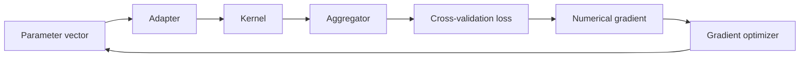

# Gradient Optimization

Gradient optimization is the continuous-parameter optimization path used by
the COBRA subsystem.

The current source provides three registered gradient optimizers:

```text
gd
momentum
adam
```

implemented under:

```text
kfc_procedure/cobra/core/optimizers/gradient/
├── base.py
├── gd.py
├── momentum.py
└── adam.py
```

Numerical-gradient utilities live in:

```text
kfc_procedure/cobra/core/optimizers/_utils.py
```

The gradient family is used by:

```text
GradientCOBRA
MixCOBRARegressor
```

when:

```python
opt_method="grad"
```

and the selected kernel advertises:

```python
requires_grad = True
```

---

## What gradient optimization tunes

The gradient subsystem minimizes a scalar objective:

\[
\min_x f(x).
\]

In COBRA, \(x\) usually represents aggregation parameters rather than the
coefficients of the original base estimators.

Examples include:

```text
GradientCOBRA
    x = [bandwidth]

MixCOBRA one-parameter mode
    x = [bandwidth-like parameter]

MixCOBRA two-parameter mode
    x = [alpha, beta]
```

The objective itself is the cross-validation loss produced by the fitted COBRA
aggregation pipeline.

---

## Position in the pipeline



The optimizer does not directly train:

```text
base estimators
distance models
kernel models
```

Instead, it repeatedly evaluates how changing the adapter parameters affects
the cross-validation objective.

---

# Registered gradient optimizers

| Registry name | Class | Update strategy |
| --- | --- | --- |
| `gd` | `GradientDescentOptimizer` | plain gradient descent |
| `momentum` | `MomentumOptimizer` | gradient descent with velocity |
| `adam` | `AdamOptimizer` | adaptive first/second moments |

All three are registered with categories:

```text
optimizer
gradient
```

through:

```python
OptimizerFactory
```

---

# `BaseGradientOptimizer`

All gradient implementations inherit:

```python
BaseGradientOptimizer
```

which provides:

```text
gradient calculation
learning-rate schedules
parameter initialization
main optimization loop
early stopping
history tracking
```

Subclasses only need to implement:

```python
step(
    x,
    lr,
    grad,
    state,
)
```

---

## Constructor

The current base constructor is:

```python
BaseGradientOptimizer(
    learning_rate=0.01,
    max_iter=300,
    tol=1e-7,
    speed="constant",
    gradient_method="central",
    eps=1e-7,
    n_tries=5,
    init_range=(1e-4, 3.0),
    show_process=True,
    **kwargs,
)
```

---

# Core parameters

| Parameter | Current default | Purpose |
| --- | ---: | --- |
| `learning_rate` | `0.01` | initial learning-rate scale |
| `max_iter` | `300` | maximum optimizer iterations |
| `tol` | `1e-7` | gradient-norm stopping threshold |
| `speed` | `"constant"` | learning-rate schedule |
| `gradient_method` | `"central"` | numerical-gradient method |
| `eps` | `1e-7` | finite-difference step |
| `n_tries` | `5` | initialization candidates |
| `init_range` | `(1e-4, 3.0)` | initialization interval |
| `show_process` | `True` | progress display |

---

# Gradient computation

The base optimizer calls:

```python
compute_gradient(
    objective=objective,
    params=params,
    gradient=grad_fn,
    method=self.gradient_method,
    eps=self.eps,
)
```

If:

```python
grad_fn
```

is supplied, it overrides numerical differentiation.

Otherwise, the requested numerical-gradient method is used.

---

# Supported numerical-gradient methods

The current dispatcher supports:

```text
central
forward
spsa
complex
parallel
```

through:

```python
GRADIENT_METHODS
```

---

# Central difference

The default method is:

```text
central
```

For parameter coordinate \(i\):

\[
g_i
=
\frac{
f(x+\varepsilon e_i)
-
f(x-\varepsilon e_i)
}{
2\varepsilon
}.
\]

The source temporarily perturbs one coordinate at a time.

Implementation concept:

```python
p[i] = original + eps
f_plus = objective(p)

p[i] = original - eps
f_minus = objective(p)

grad[i] = (
    f_plus
    -
    f_minus
) / (
    2 * eps
)
```

---

## Central-difference cost

For a parameter vector of dimension:

\[
d,
\]

one gradient calculation requires approximately:

\[
2d
\]

objective evaluations.

Since a COBRA objective itself runs cross-validation, numerical gradients can
be computationally expensive even for low-dimensional parameter vectors.

---

# Forward difference

The source also supports:

```text
forward
```

with:

\[
g_i
=
\frac{
f(x+\varepsilon e_i)
-
f(x)
}{
\varepsilon
}.
\]

The implementation evaluates:

```python
f0 = objective(p)
```

once, then one positive perturbation per dimension.

Approximate cost:

\[
d+1
\]

objective calls per gradient evaluation.

---

# SPSA

The method:

```text
spsa
```

uses Simultaneous Perturbation Stochastic Approximation.

The source samples:

```python
delta = np.random.choice(
    [-1.0, 1.0],
    size=p.shape,
)
```

then computes:

\[
g
\approx
\frac{
f(x+\varepsilon\Delta)
-
f(x-\varepsilon\Delta)
}{
2\varepsilon\Delta
}.
\]

---

## SPSA cost

Only two objective evaluations are required regardless of parameter
dimension:

```text
f(x + eps * delta)
f(x - eps * delta)
```

This can make SPSA attractive for higher-dimensional black-box objectives.

---

## SPSA reproducibility caveat

The current helper uses:

```python
np.random.choice(...)
```

from NumPy's global random state.

It does **not** accept:

```python
random_state
```

and does not use the COBRA estimator's seed.

!!! warning "Current source behavior"

    Selecting:

    ```python
    gradient_method="spsa"
    ```

    introduces stochastic perturbations whose sequence is not controlled by
    the normal estimator `random_state` parameter.

---

# Complex-step gradient

The method:

```text
complex
```

uses:

\[
g_i
=
\frac{
\operatorname{Im}
f(x+i\varepsilon e_i)
}{
\varepsilon
}.
\]

The source default inside the standalone function is:

```python
eps=1e-20
```

---

## Important dispatcher detail

`BaseGradientOptimizer` passes:

```python
self.eps
```

into:

```python
compute_gradient()
```

and its default is:

```text
1e-7.
```

Therefore when complex-step differentiation is selected through the optimizer,
the effective epsilon is normally:

```text
1e-7
```

unless you explicitly configure another value.

The standalone helper's own:

```text
1e-20
```

default is bypassed because `compute_gradient()` supplies the optimizer
epsilon.

---

## Complex compatibility

The objective must support complex-valued parameter perturbations.

The source does not test that compatibility before running.

If downstream code discards imaginary components or rejects complex arrays,
the method may not produce a meaningful gradient.

---

# Parallel central difference

The method:

```text
parallel
```

uses the same central-difference formula as the default method but evaluates
coordinates with:

```python
joblib.Parallel
```

and:

```python
delayed(...)
```

---

## Worker count

`compute_gradient()` has:

```python
n_jobs=None
```

and, for parallel mode, maps that to:

```python
n_jobs=-1
```

unless a value is explicitly provided.

However, `BaseGradientOptimizer.gradient()` currently calls
`compute_gradient()` without passing an `n_jobs` argument.

Therefore the standard optimizer path uses:

```text
all available workers
```

for the parallel gradient helper.

---

# Unknown gradient methods

If the method name is not one of:

```text
central
forward
spsa
complex
parallel
```

the dispatcher raises:

```text
ValueError:
Unknown method '...'. Available: [...]
```

---

# Analytical gradients

The optimization API supports:

```python
grad_fn=
```

in:

```python
BaseGradientOptimizer.optimize()
```

When present:

```python
compute_gradient()
```

returns:

```python
np.asarray(
    gradient(params),
    dtype=float,
)
```

and skips numerical differentiation.

---

## High-level COBRA usage

The current GradientCOBRA and MixCOBRA optimization paths call the optimizer
without supplying a custom:

```python
grad_fn
```

so they use numerical gradients.

Analytical gradients are available as a lower-level optimizer feature rather
than a high-level estimator feature in the current source.

---

# Initialization

When:

```python
init_param is None
```

the base optimizer runs:

```python
_initialize(
    objective,
    dim=1,
)
```

---

## Initialization grid

The source builds:

```python
grid = np.linspace(
    low,
    high,
    n_tries,
)
```

from:

```python
init_range
```

then constructs:

```python
candidates = np.array([
    np.full(
        dim,
        g,
    )
    for g in grid
])
```

and chooses the candidate with the lowest objective score.

---

# Initialization limitation

Inside:

```python
optimize()
```

the source always calls:

```python
_initialize(
    objective,
    dim=1,
)
```

when `init_param` is absent.

So the automatic initialization path is effectively one-dimensional from this
entry point.

For multi-parameter optimization, a caller should provide an explicit
`init_param`.

The high-level MixCOBRA source does exactly that.

---

# COBRA initial parameters

GradientCOBRA uses:

```python
init_param=np.array([
    1.0
])
```

for gradient mode.

MixCOBRA one-parameter mode uses:

```python
np.array([
    1.0
])
```

and two-parameter mode uses:

```python
np.array([
    1.0,
    1.0,
])
```

Therefore the internal automatic initialization search is normally bypassed in
the main COBRA integrations.

---

# Initial gradient scaling

After choosing `x`, the optimizer computes:

```python
grad = self.gradient(
    objective,
    x,
    grad_fn,
)
```

Then:

```python
r0 = self.learning_rate / (
    np.linalg.norm(
        grad
    )
    +
    1e-12
)
```

This is an important implementation detail.

The value configured as:

```python
learning_rate
```

is divided by the **initial gradient norm** before the learning-rate schedule
is applied.

---

## Effective first step scale

For constant schedule:

\[
r_0
=
\frac{
\eta
}{
\|\nabla f(x_0)\|+10^{-12}
}.
\]

So the first step size is normalized by the initial gradient magnitude.

The optimizer does not directly use:

```text
learning_rate
```

as the first raw multiplier.

---

# Learning-rate schedules

The source supports:

```text
constant
linear
log
sqrt_root
quad
exp
```

through:

```python
_rate(
    t,
    r0,
)
```

---

## Current formulas

The source dictionary is:

```python
{
    "constant": lambda x, y: y,
    "linear": lambda x, y: x * y,
    "log": lambda x, y: np.log(1 + x) * y,
    "sqrt_root": lambda x, y: np.sqrt(1 + x) * y,
    "quad": lambda x, y: (1 + x**2) * y,
    "exp": lambda x, y: np.exp(x) * y,
}
```

where:

```text
x = iteration index t
y = r0
```

---

# Important schedule behavior

Several names may sound like decay schedules, but the current formulas do not
decay.

For example:

```text
linear
    lr_t = t * r0

log
    lr_t = log(1+t) * r0

sqrt_root
    lr_t = sqrt(1+t) * r0

quad
    lr_t = (1+t²) * r0

exp
    lr_t = exp(t) * r0
```

These increase with iteration.

---

## `linear` starts at zero

At:

```text
t = 0
```

the linear schedule returns:

\[
0\times r_0
=
0.
\]

So the first update under:

```python
speed="linear"
```

does not move the parameters.

---

## Exponential growth

With:

```python
speed="exp"
```

the learning rate becomes:

\[
e^t r_0.
\]

This can grow extremely quickly.

The current source does not cap or clip the scheduled learning rate.

!!! warning "Current implementation"

    The non-constant schedules are increasing functions as implemented.

    Do not assume names such as `linear`, `log`, or `sqrt_root` mean learning
    rate decay.

---

# Unknown schedule names

The source uses:

```python
schedules.get(
    self.speed,
    schedules["constant"],
)
```

Therefore an unknown:

```python
speed
```

does **not** raise an error.

It silently uses:

```text
constant
```

behavior.

---

# Main optimization loop

After initialization, the optimizer stores:

```python
best_x = x.copy()

best_score = objective(
    x
)
```

Then it runs up to:

```python
max_iter
```

iterations.

For iteration `t`:

```text
1. compute scheduled learning rate
2. call subclass step()
3. repair NaN parameter vectors
4. compute new gradient
5. evaluate new objective
6. update best solution
7. check gradient-norm stopping
8. optionally shrink r0 after gradient sign changes
9. record history
```

---

# NaN parameter repair

After the subclass update:

```python
x_new, state = self.step(
    x,
    lr_t,
    grad,
    state,
)
```

the source checks:

```python
if np.any(
    np.isnan(
        x_new
    )
):
    x_new = x * 0.95
```

So if any coordinate becomes `NaN`, the entire new parameter vector is
replaced by:

\[
0.95x.
\]

---

## Infinite values are not repaired

The check is specifically:

```python
np.isnan(
    x_new
)
```

The source does not separately repair:

```text
+Inf
-Inf
```

parameter values.

---

# Best-solution tracking

After evaluating:

```python
score = objective(
    x_new
)
```

the source updates:

```python
if score < best_score:
    best_score = score
    best_x = x_new.copy()
```

The optimizer returns the **best point encountered**, not necessarily the final
iteration point.

---

# Early stopping

The gradient is recomputed at:

```python
x_new
```

and stopping occurs when:

\[
\|\nabla f(x_{\text{new}})\|
<
\text{tol}.
\]

The exact check is:

```python
if np.linalg.norm(
    grad_new
) < self.tol:
    x = x_new
    break
```

---

## History omission on early stopping

This stopping check happens before the history entry is appended.

Therefore the final converged step is not added to:

```python
history
```

when optimization terminates through this gradient-norm condition.

The score can still update:

```text
best_score
best_x
```

before the break.

---

# Gradient-sign adjustment

After at least four previous iterations:

```python
if (
    t > 3
    and np.any(
        np.sign(
            grad_new
        )
        !=
        np.sign(
            prev_grad
        )
    )
):
    r0 *= 0.99
```

So if any gradient coordinate changes sign, the base learning-rate scale is
reduced by:

```text
1%
```

---

## Sign comparison detail

The comparison is between:

```python
grad_new
```

and:

```python
prev_grad
```

not directly between `grad_new` and the current `grad`.

At the end of each completed iteration:

```python
prev_grad = grad_new.copy()
grad = grad_new.copy()
```

so after normal completed iterations those values become identical for the next
loop.

This means the effective comparison is against the prior stored gradient.

---

# Optimization history

A completed iteration appends:

```python
{
    "iter": t + 1,
    "x": x.copy(),
    "score": score,
    "grad": grad,
    "grad_norm": float(
        np.linalg.norm(
            grad
        )
    ),
    "lr": lr_t,
}
```

---

## History fields

| Field | Meaning |
| --- | --- |
| `iter` | one-based iteration number |
| `x` | parameter vector after update |
| `score` | objective value at that vector |
| `grad` | gradient at that vector |
| `grad_norm` | Euclidean gradient norm |
| `lr` | scheduled step multiplier used for the update |

---

# History is not total objective-call history

A finite-difference gradient can call the objective multiple times per
iteration.

Those internal calls are not recorded as history entries.

The following are also evaluated outside normal history rows:

```text
initial gradient
initial best-score calculation
terminating early-stop step
initialization candidate search, when used
```

So:

```python
len(
    result["history"]
)
```

is the number of recorded optimizer iterations, not the total number of
objective evaluations.

---

# Progress display

When:

```python
show_process=True
```

the optimizer wraps the iteration range in:

```python
tqdm(
    range(
        max_iter
    ),
    desc="GD",
    leave=True,
)
```

This description remains:

```text
GD
```

even for:

```text
MomentumOptimizer
AdamOptimizer
```

because the progress loop is implemented in the shared base class.

---

## Progress text

After a completed iteration, the description is changed to:

```text
iter=N | score=... | grad_norm=...
```

---

# Gradient Descent

The simplest registered optimizer is:

```python
GradientDescentOptimizer
```

under:

```text
gd
```

Its update rule is:

\[
x_{t+1}
=
x_t
-
\eta_tg_t.
\]

The implementation is exactly:

```python
x_new = (
    x
    -
    lr
    *
    grad
)
```

The state dictionary is unchanged.

---

## Direct use

```python
import numpy as np

from kfc_procedure.cobra.core.optimizers import (
    GradientDescentOptimizer,
)


def objective(
    params,
):
    x = params[0]

    return (
        x - 2.0
    ) ** 2


optimizer = GradientDescentOptimizer(
    learning_rate=0.1,
    max_iter=100,
    show_process=False,
)

result = optimizer.optimize(
    objective,
    init_param=np.array([
        1.0
    ]),
)

print(
    result["x"]
)

print(
    result["score"]
)
```

---

# Momentum

`MomentumOptimizer` is registered as:

```text
momentum
```

and adds:

```python
momentum=0.9
```

to the base optimizer parameters.

---

## Momentum state

On the first step:

```python
state["v"] = np.zeros_like(
    x
)
```

The state stores one velocity vector:

```text
v
```

---

# Momentum update

The source computes:

\[
v_t
=
\mu v_{t-1}
-
\eta_tg_t
\]

then:

\[
x_{t+1}
=
x_t+v_t.
\]

Implementation:

```python
v = (
    self.momentum
    *
    v
    -
    lr
    *
    grad
)

state["v"] = v

x_new = x + v
```

---

## Configure momentum

```python
optimizer = MomentumOptimizer(
    momentum=0.95,
    learning_rate=0.05,
    max_iter=200,
    show_process=False,
)
```

The current constructor does not validate that:

```text
0 <= momentum < 1
```

or any other interval.

The supplied value is used directly.

---

# Adam

`AdamOptimizer` is registered as:

```text
adam
```

and adds:

```python
beta1=0.9
beta2=0.999
```

to the base configuration.

---

## Adam state

On first use, the source creates:

```python
state["m"] = np.zeros_like(
    x
)

state["v"] = np.zeros_like(
    x
)

state["t"] = 0
```

The state therefore tracks:

```text
m
    first moment

v
    second moment

t
    optimizer timestep
```

---

# Adam moment updates

The source computes:

\[
m_t
=
\beta_1m_{t-1}
+
(1-\beta_1)g_t
\]

and:

\[
v_t
=
\beta_2v_{t-1}
+
(1-\beta_2)g_t^2.
\]

---

# Bias correction

The implementation applies:

\[
\hat m_t
=
\frac{
m_t
}{
1-\beta_1^t
}
\]

and:

\[
\hat v_t
=
\frac{
v_t
}{
1-\beta_2^t
}.
\]

---

# Adam update

The source uses:

\[
x_{t+1}
=
x_t
-
\eta_t
\frac{
\hat m_t
}{
\sqrt{\hat v_t}
+
10^{-8}
}.
\]

The stabilizer:

```text
1e-8
```

is hard-coded inside:

```python
AdamOptimizer.step()
```

---

## No configurable Adam epsilon

The class docstring mentions an `epsilon` numerical stability constant, but the
constructor is:

```python
AdamOptimizer(
    beta1=0.9,
    beta2=0.999,
    **kwargs,
)
```

There is no explicit:

```python
epsilon=
```

parameter.

The update always uses:

```python
1e-8
```

in the current source.

!!! note "Documentation/source mismatch"

    The class documentation mentions an Adam epsilon parameter, but the current
    constructor does not expose one.

---

# Configure Adam

```python
optimizer = AdamOptimizer(
    beta1=0.9,
    beta2=0.999,
    learning_rate=0.05,
    max_iter=200,
    gradient_method="central",
    show_process=False,
)
```

The current source does not explicitly validate the ranges of:

```text
beta1
beta2.
```

---

# OptimizerFactory usage

Create gradient descent:

```python
from kfc_procedure.cobra.core.optimizers import (
    OptimizerFactory,
)

optimizer = OptimizerFactory.create(
    "gd",
    learning_rate=0.05,
)
```

Momentum:

```python
optimizer = OptimizerFactory.create(
    "momentum",
    momentum=0.9,
)
```

Adam:

```python
optimizer = OptimizerFactory.create(
    "adam",
    beta1=0.9,
    beta2=0.999,
)
```

---

# Inspect gradient optimizers

```python
print(
    OptimizerFactory.available_by_category(
        "gradient"
    )
)
```

The current registry should include:

```text
adam
gd
momentum
```

---

# Kernel compatibility

GradientCOBRA and MixCOBRA do not blindly use gradient optimization.

Before choosing the optimizer family, they check:

```python
kernel_.requires_grad
```

---

## Gradient-compatible built-in kernels

The current continuous kernels advertise:

```python
requires_grad = True
```

including:

```text
rbf / radial / gaussian
exponential
reverse_cosh
cauchy
```

---

## Non-gradient kernels

The current compact/discrete kernels advertise:

```python
requires_grad = False
```

including:

```text
epanechnikov
biweight
triweight
triangular
naive
cobra
```

---

# Automatic fallback to grid search

If:

```python
opt_method="grad"
```

but:

```python
kernel_.requires_grad == False
```

both GradientCOBRA and MixCOBRA change the local effective method to:

```text
grid
```

before optimizer resolution.

So:

```python
GradientCOBRA(
    kernel="cobra",
    opt_method="grad",
    optimizer="adam",
)
```

does not continue with Adam under the normal source path.

It falls back to grid-family optimization.

---

# Category validation

For GradientCOBRA and MixCOBRA, effective:

```text
grad
```

mode requires:

```python
OptimizerFactory.supports(
    optimizer,
    category="gradient",
)
```

So:

```python
optimizer="grid"
opt_method="grad"
```

is rejected when the effective method remains gradient-based.

Likewise, grid mode requires the:

```text
search
```

category.

---

# GradientCOBRA configuration

The relevant constructor parameters include:

```python
optimizer="grid"
optimizer_params=None
opt_method="grid"
learning_rate=0.1
max_iter=300
```

To enable gradient optimization:

```python
from kfc_procedure.cobra import (
    GradientCOBRA,
)

model = GradientCOBRA(
    optimizer="adam",
    opt_method="grad",
    learning_rate=0.05,
    max_iter=200,
)
```

---

# GradientCOBRA optimizer parameters

The source copies:

```python
optimizer_params
```

then, in gradient mode, updates:

```python
{
    "learning_rate": self.learning_rate,
    "max_iter": self.max_iter,
}
```

before creating the optimizer.

Therefore top-level:

```text
learning_rate
max_iter
```

take precedence over same-named values previously placed in
`optimizer_params`.

---

## Additional GradientCOBRA optimizer settings

Use `optimizer_params` for options such as:

```python
optimizer_params={
    "tol": 1e-6,
    "gradient_method": "forward",
    "eps": 1e-6,
    "speed": "constant",
    "show_process": False,
    "beta1": 0.9,
    "beta2": 0.999,
}
```

Parameters irrelevant to a given subclass may be absorbed by `**kwargs`
depending on the constructor path.

---

# GradientCOBRA starting point

The current gradient path calls the optimizer with:

```python
init_param=np.array([
    1.0
])
```

so bandwidth optimization starts from:

\[
h_0=1.
\]

---

# GradientCOBRA result

After optimization:

```python
self.bandwidth_ = float(
    np.atleast_1d(
        result["x"]
    )[0]
)
```

and the source stores:

```python
self.optimization_outputs_ = {
    "method": method,
    "optimizer": optimizer,
    "bandwidth": self.bandwidth_,
    "score": result["score"],
    "history": history_df,
    "evaluations": len(
        result["history"]
    ),
}
```

---

## GradientCOBRA records effective method

The stored:

```python
optimization_outputs_[
    "method"
]
```

uses the local effective `method`.

Therefore if the kernel forces a fallback from:

```text
grad
```

to:

```text
grid,
```

GradientCOBRA reports:

```text
grid.
```

---

# MixCOBRA configuration

Relevant constructor parameters include:

```python
optimizer="grid"
optimizer_params=None
opt_method="grid"
learning_rate=0.01
max_iter=300
one_parameter=False
```

Gradient mode example:

```python
from kfc_procedure.cobra import (
    MixCOBRARegressor,
)

model = MixCOBRARegressor(
    optimizer="adam",
    opt_method="grad",
    learning_rate=0.01,
)
```

---

# MixCOBRA one-parameter start

With:

```python
one_parameter=True
```

the gradient optimizer starts from:

```python
np.array([
    1.0
])
```

---

# MixCOBRA two-parameter start

With:

```python
one_parameter=False
```

the optimizer starts from:

```python
np.array([
    1.0,
    1.0,
])
```

representing:

\[
(\alpha,\beta)
=
(1,1).
\]

---

# MixCOBRA result

The optimization output stores:

```python
{
    "method": self.opt_method,
    "score": result["score"],
    "history": history_df,
    "evaluations": len(
        result["history"]
    ),
    "params": result["x"],
}
```

---

## MixCOBRA reporting caveat

The current source stores:

```python
self.opt_method
```

rather than the local effective method after kernel fallback.

Therefore a model configured with:

```text
opt_method="grad"
```

can still report:

```text
grad
```

even if a non-gradient kernel caused the actual path to use grid optimization.

This differs from GradientCOBRA.

---

# No positivity constraints

The base gradient optimizer performs ordinary unconstrained vector updates.

There is no generic source-level projection such as:

```python
x_new = np.maximum(
    x_new,
    0.0,
)
```

or clipping to a configured interval.

Therefore parameters such as:

```text
bandwidth
alpha
beta
```

can become negative during gradient optimization.

---

## Why this matters

For the one-parameter adapter:

\[
D'
=
hD.
\]

A negative:

\[
h
\]

turns non-negative distances into negative adapted values.

With the default RBF kernel:

\[
K=e^{-D'},
\]

this can produce weights larger than one:

\[
e^{-hD}
>
1
\]

when:

\[
h<0.
\]

The current optimizer does not prevent this.

!!! warning "Current gradient path is unconstrained"

    Grid search uses an explicitly positive default candidate range
    `0.001` to `10.0`.

    Gradient optimization is not restricted to that interval.

---

# No general parameter clipping

The same applies to MixCOBRA:

\[
D_{\text{mix}}
=
\alpha D_X
+
\beta D_Y.
\]

Gradient mode can produce:

```text
negative alpha
negative beta
```

because no projection step is implemented.

The source leaves those parameter semantics to the objective and optimizer
trajectory.

---

# Objective smoothness

The gradient path uses finite differences over the full cross-validation
objective.

That objective contains several components:

```text
adapter
kernel
aggregator
loss
fold averaging
```

Whether the numerical gradient behaves smoothly depends on the entire composed
pipeline.

---

# Hard operations and gradient compatibility

The high-level source uses:

```python
kernel_.requires_grad
```

as its explicit compatibility gate.

However, this flag describes the kernel only.

Other parts of the objective can still contain non-smooth behavior, for
example:

```text
classification argmax
zero-weight fallbacks
piecewise losses
```

The current optimizer does not perform symbolic differentiability analysis of
the whole objective.

---

# Gradient methods are black-box approximations

The finite-difference helpers only need:

```python
objective(
    params
) -> scalar
```

They do not require access to analytical derivatives of:

```text
kernel
aggregator
loss
```

This makes the gradient subsystem effectively a black-box numerical optimizer.

---

# Central difference with COBRA CV

For one GradientCOBRA bandwidth:

\[
h,
\]

central difference approximates:

\[
J'(h)
\approx
\frac{
J(h+\varepsilon)
-
J(h-\varepsilon)
}{
2\varepsilon
},
\]

where each:

\[
J(\cdot)
\]

is itself a full mean cross-validation loss.

---

# Two-parameter central difference

For MixCOBRA:

\[
x
=
(\alpha,\beta),
\]

central difference requires approximately four full objective evaluations per
gradient:

\[
J(\alpha+\varepsilon,\beta),
\]

\[
J(\alpha-\varepsilon,\beta),
\]

\[
J(\alpha,\beta+\varepsilon),
\]

\[
J(\alpha,\beta-\varepsilon).
\]

The optimizer then separately evaluates the objective at the new parameter
vector.

---

# `eps` sensitivity

The default finite-difference step is:

```text
1e-7.
```

If the objective changes very little at that scale, numerical cancellation can
make the estimated gradient noisy.

If the objective has abrupt changes, a tiny epsilon can sample two points on
different sides of a discontinuity.

The current source exposes:

```python
eps
```

through `optimizer_params`, so it can be tuned manually.

---

# Example with forward differences

```python
model = GradientCOBRA(
    optimizer="gd",
    opt_method="grad",
    learning_rate=0.05,
    optimizer_params={
        "gradient_method": "forward",
        "eps": 1e-5,
        "show_process": False,
    },
)
```

---

# Example with SPSA

```python
model = MixCOBRARegressor(
    optimizer="adam",
    opt_method="grad",
    optimizer_params={
        "gradient_method": "spsa",
        "eps": 1e-4,
        "show_process": False,
    },
)
```

Remember that the current SPSA helper is not seeded from:

```python
model.random_state.
```

---

# Example with parallel central differences

```python
model = MixCOBRARegressor(
    optimizer="adam",
    opt_method="grad",
    optimizer_params={
        "gradient_method": "parallel",
        "show_process": False,
    },
)
```

The standard `BaseGradientOptimizer.gradient()` call does not expose a custom
`n_jobs`, so the parallel helper uses its fallback worker count:

```text
-1.
```

---

# Custom analytical gradient

At lower optimizer level:

```python
def objective(
    x,
):
    return (
        x[0] - 3.0
    ) ** 2


def gradient(
    x,
):
    return np.array([
        2.0
        *
        (
            x[0] - 3.0
        )
    ])
```

Then:

```python
optimizer = GradientDescentOptimizer(
    learning_rate=0.1,
    show_process=False,
)

result = optimizer.optimize(
    objective,
    init_param=np.array([
        1.0
    ]),
    grad_fn=gradient,
)
```

The numerical-gradient dispatcher is bypassed.

---

# Learning-rate schedule example

```python
optimizer = GradientDescentOptimizer(
    learning_rate=0.1,
    speed="constant",
    show_process=False,
)
```

For experimentation, the current source also accepts:

```text
linear
log
sqrt_root
quad
exp
```

but remember that these formulas increase rather than decay.

---

# Gradient Descent vs Momentum vs Adam

| Property | GD | Momentum | Adam |
| --- | --- | --- | --- |
| state | none | velocity `v` | `m`, `v`, `t` |
| default extra params | none | `momentum=0.9` | `beta1=0.9`, `beta2=0.999` |
| adaptive coordinate scaling | No | No | Yes |
| bias correction | No | No | Yes |
| base numerical gradients | Yes | Yes | Yes |
| same stopping logic | Yes | Yes | Yes |
| same learning-rate scheduler | Yes | Yes | Yes |

---

# Inspect optimization history

For GradientCOBRA:

```python
history = (
    model
    .optimization_outputs_[
        "history"
    ]
)

print(
    history.head()
)
```

Gradient history is converted to a pandas DataFrame.

Typical columns include:

```text
iter
score
grad
grad_norm
lr
bandwidth
```

for one-dimensional optimization.

---

# MixCOBRA history

For two parameters, the history conversion names coordinates:

```text
alpha
beta
```

while retaining:

```text
score
grad
grad_norm
lr
```

---

# `evaluations` is not objective-call count

The high-level estimators set:

```python
"evaluations": len(
    result["history"]
)
```

This is the number of recorded optimizer iterations.

It is **not** the number of cross-validation objective evaluations.

With central differences, actual objective calls can be many times larger.

---

# Reconstruct a gradient manually

For a fitted GradientCOBRA model, the numerical helper can be used directly.

Conceptually:

```python
from kfc_procedure.cobra.core.optimizers._utils import (
    central_difference_gradient,
)

x = np.array([
    model.bandwidth_
])

grad = central_difference_gradient(
    model.kappa_cross_validation_error,
    x,
    eps=1e-7,
)
```

This evaluates the fitted model's CV objective around the chosen bandwidth.

---

# Debugging gradient optimization

## Inspect configured method

```python
print(
    model.opt_method
)
```

---

## Inspect configured optimizer

```python
print(
    model.optimizer
)
```

---

## Inspect resolved optimizer

```python
print(
    model.optimizer_
)
```

---

## Inspect gradient method

```python
print(
    model.optimizer_.gradient_method
)
```

---

## Inspect epsilon

```python
print(
    model.optimizer_.eps
)
```

---

## Inspect tolerance

```python
print(
    model.optimizer_.tol
)
```

---

## Inspect learning-rate schedule

```python
print(
    model.optimizer_.speed
)
```

---

## Inspect selected parameters

GradientCOBRA:

```python
print(
    model.bandwidth_
)
```

MixCOBRA:

```python
print(
    model.optimization_outputs_[
        "params"
    ]
)
```

---

## Check for negative parameters

GradientCOBRA:

```python
if model.bandwidth_ < 0:
    print(
        "Negative bandwidth"
    )
```

MixCOBRA:

```python
params = model.optimization_outputs_[
    "params"
]

print(
    params
)
```

This is useful because the current gradient path is unconstrained.

---

# Debugging convergence

Inspect:

```python
history[
    [
        "iter",
        "score",
        "grad_norm",
        "lr",
    ]
]
```

Useful patterns include:

```text
grad_norm decreasing
score decreasing
learning rate remaining stable
```

but the source itself does not classify convergence quality.

---

# Debugging missing final iteration

If the returned best score seems better than the final row in history, remember
that a gradient-norm early-stop step is evaluated before the history append.

The terminating point can therefore be returned as:

```text
best_x
best_score
```

without appearing as the last DataFrame row.

---

# Custom gradient optimizer

To implement a new update rule, subclass:

```python
BaseGradientOptimizer
```

and implement:

```python
step()
```

Example:

```python
import numpy as np

from kfc_procedure.cobra.core.optimizers import (
    OptimizerFactory,
)

from kfc_procedure.cobra.core.optimizers.gradient import (
    BaseGradientOptimizer,
)


@OptimizerFactory.register(
    "sign_gd",
    categories={
        "optimizer",
        "gradient",
    },
)
class SignGradientOptimizer(
    BaseGradientOptimizer
):

    def step(
        self,
        x,
        lr,
        grad,
        state,
    ):
        x_new = (
            x
            -
            lr
            *
            np.sign(
                grad
            )
        )

        return (
            x_new,
            state,
        )
```

This automatically inherits:

```text
gradient estimation
learning-rate schedules
early stopping
history
initialization
progress display
```

from the base class.

---

# Custom optimizer result contract

The inherited `optimize()` method returns:

```python
{
    "x": best_x,
    "score": best_score,
    "history": history,
}
```

which matches the result contract expected by GradientCOBRA and MixCOBRA.

---

# Current source caveats

| Area | Current behavior |
| --- | --- |
| default gradient estimator | central difference |
| numerical methods | central, forward, SPSA, complex, parallel |
| analytical gradient support | lower-level `grad_fn` only |
| optimizer start in GradientCOBRA | `[1.0]` |
| optimizer start in 2D MixCOBRA | `[1.0, 1.0]` |
| parameter bounds | none |
| positive bandwidth enforcement | none |
| NaN parameter recovery | replace with `0.95 * x` |
| Inf recovery | none |
| stopping condition | new gradient norm `< tol` |
| early-stop step in history | No |
| non-constant schedules | increasing formulas |
| unknown schedule | silently uses constant |
| SPSA seed | global NumPy RNG |
| parallel gradient workers | effectively `-1` in standard optimizer path |
| Adam epsilon | hard-coded `1e-8` |
| progress label | starts as `"GD"` for all gradient optimizers |
| MixCOBRA fallback reporting | may report configured rather than effective method |

---

# Quick reference

| Goal | Configuration |
| --- | --- |
| vanilla gradient descent | `optimizer="gd", opt_method="grad"` |
| momentum | `optimizer="momentum", opt_method="grad"` |
| Adam | `optimizer="adam", opt_method="grad"` |
| central finite differences | `gradient_method="central"` |
| cheaper forward differences | `gradient_method="forward"` |
| stochastic two-evaluation estimate | `gradient_method="spsa"` |
| complex-step estimate | `gradient_method="complex"` |
| parallel central differences | `gradient_method="parallel"` |
| disable progress | `show_process=False` |
| stop earlier | increase `tol` |
| more iterations | increase `max_iter` |
| change difference step | set `eps` |

---

# Mental model

!!! quote ""

    **Gradient optimization treats the complete COBRA cross-validation pipeline
    as a black-box scalar function and numerically follows parameter directions
    that reduce that loss.**

For GradientCOBRA:

\[
\boxed{
h
\rightarrow
J(h)
\rightarrow
\frac{dJ}{dh}
\rightarrow
h_{\text{new}}
}
\]

For two-parameter MixCOBRA:

\[
\boxed{
(\alpha,\beta)
\rightarrow
J(\alpha,\beta)
\rightarrow
\nabla J
\rightarrow
(\alpha,\beta)_{\text{new}}
}
\]

The current implementation provides GD, Momentum, and Adam update rules over
the same shared numerical-gradient and stopping machinery.

