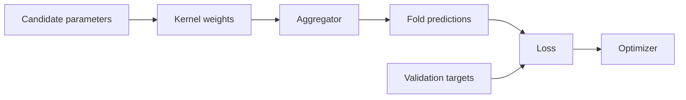

# Loss Functions

Loss functions connect COBRA predictions to the optimization objective.

During cross-validation, a COBRA estimator:

1. builds predictions for the validation rows;
2. compares those predictions with the validation targets;
3. evaluates a registered loss;
4. averages the fold losses;
5. asks the optimizer to minimize that value.

The current source provides six built-in losses:

```text
mse
mae
huber
log_loss
hinge
quantile
```

with aliases for several of them.

The implementations live under:

```text
kfc_procedure/cobra/core/losses/
├── base.py
├── mse.py
├── mae.py
├── huber.py
├── log_loss.py
├── hinge.py
└── quantile.py
```

and are registered through:

```python
LossFactory
```

---

## Losses in the COBRA pipeline

The loss layer appears after fold-level aggregation:



For one cross-validation fold, the objective has the form:

\[
\mathcal{L}
\left(
y_{\text{validation}},
\widehat y_{\text{validation}}
\right).
\]

The optimizer minimizes the average of these fold losses.

---

# Built-in losses

| Registry name | Aliases | Class | Primary source formula |
| --- | --- | --- | --- |
| `mse` | `l2`, `squared_error` | `MSELoss` | mean squared error |
| `mae` | `l1` | `MAELoss` | mean absolute error |
| `huber` | — | `HuberLoss` | quadratic/linear robust loss |
| `log_loss` | `cross_entropy` | `LogLoss` | binary cross-entropy |
| `hinge` | — | `HingeLoss` | mean hinge loss |
| `quantile` | — | `QuantileLoss` | pinball / quantile loss |

---

# `BaseLoss`

Every built-in loss inherits:

```python
BaseLoss
```

The abstract interface is intentionally small:

```python
class BaseLoss(ABC):

    @abstractmethod
    def __call__(
        self,
        y_true,
        y_pred,
    ) -> float:
        ...
```

A loss object is therefore callable:

```python
value = loss(
    y_true,
    y_pred,
)
```

and must return one scalar `float`.

---

# `LossFactory`

Losses are created through:

```python
LossFactory
```

which inherits the package's common:

```python
BaseFactory
```

Example:

```python
from kfc_procedure.cobra.core.losses import (
    LossFactory,
)

loss = LossFactory.create(
    "mse"
)
```

Then:

```python
score = loss(
    y_true,
    y_pred,
)
```

---

## Inspect registered losses

```python
print(
    LossFactory.available()
)
```

The current source registers names including:

```text
cross_entropy
hinge
huber
l1
l2
log_loss
mae
mse
quantile
squared_error
```

subject to normal module loading.

---

# Mean squared error

`MSELoss` is registered as:

```text
mse
l2
squared_error
```

The source formula is:

\[
\mathcal{L}_{\text{MSE}}
=
\frac{1}{n}
\sum_{i=1}^{n}
\left(
y_i-\widehat y_i
\right)^2.
\]

---

## Implementation

The implementation is:

```python
y_true = np.asarray(
    y_true
)

y_pred = np.asarray(
    y_pred
)

return float(
    np.mean(
        (
            y_true
            -
            y_pred
        ) ** 2
    )
)
```

No additional weighting, clipping, or regularization is applied.

---

## Direct example

```python
import numpy as np

from kfc_procedure.cobra.core.losses import (
    MSELoss,
)

y_true = np.array([
    1.0,
    2.0,
    3.0,
])

y_pred = np.array([
    1.2,
    1.8,
    2.5,
])

loss = MSELoss()

value = loss(
    y_true,
    y_pred,
)

print(
    value
)
```

---

# MSE behavior

Squaring the residual means larger absolute errors contribute
disproportionately more to the objective.

For residual:

\[
e_i
=
y_i-\widehat y_i,
\]

the contribution is:

\[
e_i^2.
\]

The source module describes MSE as the most common regression loss and notes
that it strongly penalizes large errors.

---

# Mean absolute error

`MAELoss` is registered as:

```text
mae
l1
```

The source formula is:

\[
\mathcal{L}_{\text{MAE}}
=
\frac{1}{n}
\sum_{i=1}^{n}
\left|
y_i-\widehat y_i
\right|.
\]

---

## Implementation

```python
y_true = np.asarray(
    y_true
)

y_pred = np.asarray(
    y_pred
)

return float(
    np.mean(
        np.abs(
            y_true
            -
            y_pred
        )
    )
)
```

---

## Direct example

```python
from kfc_procedure.cobra.core.losses import (
    MAELoss,
)

loss = MAELoss()

value = loss(
    y_true,
    y_pred,
)
```

The source describes MAE as more robust to outliers than MSE because it uses
absolute rather than squared error.

---

# Huber loss

`HuberLoss` combines quadratic behavior for small residuals with linear
behavior for large residuals.

It is registered as:

```text
huber
```

---

## Constructor

```python
HuberLoss(
    delta=1.0,
)
```

The parameter:

```text
delta
```

controls the transition point.

The current source does not validate that `delta` is positive.

---

# Huber formula

Let:

\[
e
=
y-\widehat y.
\]

The implementation computes:

\[
q(e)
=
\frac12e^2
\]

and:

\[
\ell(e)
=
\delta
\left(
|e|
-
\frac12\delta
\right).
\]

Then:

\[
L_\delta(e)
=
\begin{cases}
\frac12e^2,
&
|e|\leq\delta,
\\[6pt]
\delta
\left(
|e|-\frac12\delta
\right),
&
|e|>\delta.
\end{cases}
\]

The final loss is the mean across samples.

---

## Implementation

```python
error = (
    y_true
    -
    y_pred
)

abs_error = np.abs(
    error
)

quadratic = (
    0.5
    *
    error ** 2
)

linear = (
    self.delta
    *
    (
        abs_error
        -
        0.5
        *
        self.delta
    )
)

return float(
    np.mean(
        np.where(
            abs_error
            <=
            self.delta,
            quadratic,
            linear,
        )
    )
)
```

---

# Configure Huber loss

High-level COBRA estimators pass:

```python
loss_params
```

to `LossFactory.create()`.

Example:

```python
model = GradientCOBRA(
    loss="huber",
    loss_params={
        "delta": 1.5,
    },
)
```

This creates:

```python
HuberLoss(
    delta=1.5,
)
```

---

# Quantile loss

`QuantileLoss` is registered as:

```text
quantile
```

and is intended for quantile regression.

Its constructor is:

```python
QuantileLoss(
    tau=0.5,
)
```

---

## Source formula

Let:

\[
e
=
y-\widehat y.
\]

The source computes:

\[
\max
\left(
\tau e,
(\tau-1)e
\right).
\]

The returned loss is the mean of those values.

Equivalent piecewise form:

\[
L_\tau(e)
=
\begin{cases}
\tau e,
&
e\geq0,
\\[4pt]
(\tau-1)e,
&
e<0.
\end{cases}
\]

---

## Implementation

```python
error = (
    y_true
    -
    y_pred
)

return float(
    np.mean(
        np.maximum(
            self.tau
            *
            error,
            (
                self.tau
                -
                1
            )
            *
            error,
        )
    )
)
```

---

# `tau`

The source documentation states:

\[
\tau\in(0,1).
\]

However, the constructor currently performs no explicit interval validation.

So values outside:

```text
(0, 1)
```

are not rejected when the loss object is constructed.

!!! note "Source contract vs enforcement"

    The module documents `tau` as a quantile level in `(0, 1)`, but the current
    implementation simply stores the supplied value.

---

# Median-like quantile loss

With:

```python
tau=0.5
```

the formula gives symmetric linear penalties on positive and negative
residuals.

The resulting value is proportional to absolute error:

\[
L_{0.5}(e)
=
0.5|e|.
\]

So the default quantile loss is not numerically identical to `MAELoss`; it is
half its value for the same residuals.

---

# Binary log loss

`LogLoss` is registered as:

```text
log_loss
cross_entropy
```

The source formula is:

\[
\mathcal{L}
=
-\frac1n
\sum_i
\left[
y_i\log p_i
+
(1-y_i)
\log(1-p_i)
\right].
\]

This is a binary cross-entropy formula.

---

## Prediction clipping

Before evaluating logs, the source clips predictions:

```python
y_pred = np.clip(
    np.asarray(
        y_pred
    ),
    1e-12,
    1
    -
    1e-12,
)
```

This protects against:

```text
log(0)
```

at exactly 0 or 1.

---

## Implementation

```python
return float(
    -np.mean(
        y_true
        *
        np.log(
            y_pred
        )
        +
        (
            1
            -
            y_true
        )
        *
        np.log(
            1
            -
            y_pred
        )
    )
)
```

---

# Expected log-loss inputs

The source module describes this loss as being used for probabilistic
classification.

The formula expects values conceptually like:

```text
y_true:
    binary 0/1 labels

y_pred:
    probabilities for the positive class
```

The implementation does not itself verify:

```text
binary targets
probability semantics
matching one-dimensional shape
```

beyond NumPy's normal broadcasting behavior.

---

# Multiclass limitation

The current `LogLoss` implementation is not a general multiclass
cross-entropy implementation.

It does not:

```text
one-hot encode labels
index class probabilities
sum over class dimensions
accept class labels as a `classes` argument
```

It directly evaluates the binary formula above.

Therefore it should not be interpreted as a source-supported multiclass
cross-entropy implementation.

---

# Hinge loss

`HingeLoss` is registered as:

```text
hinge
```

The module explicitly states:

```text
Assumes:
    y_true in {-1, +1}
```

Its formula is:

\[
\mathcal{L}_{\text{hinge}}
=
\frac1n
\sum_i
\max
\left(
0,
1-y_i\widehat y_i
\right).
\]

---

## Implementation

```python
y_true = np.asarray(
    y_true
)

y_pred = np.asarray(
    y_pred
)

return float(
    np.mean(
        np.maximum(
            0.0,
            1.0
            -
            y_true
            *
            y_pred,
        )
    )
)
```

---

# Expected hinge inputs

The source describes the loss as common in SVM-style classification and
expects:

```text
y_true in {-1, +1}
```

The implementation does not convert labels from:

```text
0/1
```

to:

```text
-1/+1
```

and does not convert hard class labels into decision margins.

It uses whatever arrays are passed directly into:

```python
y_true * y_pred
```

---

# Important classifier integration detail

`CombinedClassifier` produces **hard class predictions** during its
cross-validation objective.

It does not produce probability vectors or decision-function margins for the
loss layer.

Therefore classification losses such as:

```text
log_loss
hinge
```

are not automatically supplied the conventional inputs implied by their
source modules.

This is important when configuring the current classifier.

---

# Default loss in COBRA estimators

The current constructors use:

```python
loss="mse"
```

by default in all three main estimators:

```text
GradientCOBRA
MixCOBRARegressor
CombinedClassifier
```

That includes the classification estimator:

```python
CombinedClassifier
```

---

## Regression defaults

For:

```python
GradientCOBRA()
```

and:

```python
MixCOBRARegressor()
```

the default objective is therefore ordinary mean squared error.

This matches their numeric regression outputs.

---

# CombinedClassifier default

The current `CombinedClassifier` constructor also specifies:

```python
loss="mse"
```

Its cross-validation loop produces hard predicted class labels and evaluates:

```python
self.loss_(
    y_true,
    preds,
)
```

So with the default, class labels are numerically compared using squared
error.

!!! important "Current source behavior"

    `CombinedClassifier` does not default to classification error,
    log loss, or hinge loss.

    Its current default is the same registered `MSELoss` used by the regression
    estimators.

---

# Consequence for encoded class labels

Because MSE is applied directly to class labels, the numeric encoding matters.

For example:

```text
true class = 0
predicted class = 1
```

contributes:

\[
(0-1)^2
=
1.
\]

But:

```text
true class = 0
predicted class = 2
```

contributes:

\[
(0-2)^2
=
4.
\]

So with class labels:

```text
0, 1, 2
```

the default classifier objective treats the numeric distance between class
codes as meaningful.

That is a direct consequence of the current source default.

---

# String labels with MSE

If classification targets are strings such as:

```text
"cat"
"dog"
```

then the default:

```python
MSELoss
```

cannot perform:

```python
y_true - y_pred
```

on those string arrays.

So the default CombinedClassifier loss path assumes numerically subtractable
labels.

The loss layer itself does not encode categorical labels before evaluation.

---

# Loss resolution

The high-level estimators all resolve the configured loss through:

```python
LossFactory.create(
    self.loss,
    **(
        self.loss_params
        or {}
    ),
)
```

and store the result in:

```python
self.loss_
```

---

## Inspect the fitted loss

After component resolution or fitting:

```python
print(
    model.loss_
)
```

For the default:

```text
MSELoss
```

---

# Configure MAE

```python
model = GradientCOBRA(
    loss="mae",
)
```

Alias:

```python
model = GradientCOBRA(
    loss="l1",
)
```

Both resolve to:

```python
MAELoss
```

---

# Configure MSE

These names all resolve to `MSELoss`:

```python
loss="mse"
```

```python
loss="l2"
```

```python
loss="squared_error"
```

---

# Configure Huber

```python
model = MixCOBRARegressor(
    loss="huber",
    loss_params={
        "delta": 1.0,
    },
)
```

---

# Configure quantile loss

```python
model = GradientCOBRA(
    loss="quantile",
    loss_params={
        "tau": 0.9,
    },
)
```

The current source simply forwards:

```python
tau=0.9
```

to the constructor.

---

# How GradientCOBRA uses the loss

For every stored cross-validation fold, GradientCOBRA creates fold predictions:

```python
preds = self.aggregator_.aggregate_matrix(
    values=y_train,
    weights=K_val_train,
    fallback=0.0,
)
```

Then:

```python
error = self.loss_(
    y_val,
    preds,
)
```

The fold errors are collected and returned as:

```python
float(
    np.mean(
        errors
    )
)
```

---

# GradientCOBRA objective

For bandwidth \(h\), the cross-validation objective is conceptually:

\[
J(h)
=
\frac{1}{K}
\sum_{k=1}^{K}
\mathcal{L}
\left(
y_k^{\text{val}},
\widehat y_k(h)
\right).
\]

The configured loss determines the definition of:

\[
\mathcal{L}.
\]

The optimizer then searches for a parameter value minimizing:

\[
J(h).
\]

---

# How MixCOBRA uses the loss

MixCOBRA follows the same pattern.

For one-parameter mode:

```text
bandwidth
    -> adapted mixed-space distance
    -> kernel
    -> fold predictions
    -> loss
```

For two-parameter mode:

```text
alpha, beta
    -> alpha * D_X + beta * D_Y
    -> kernel
    -> fold predictions
    -> loss
```

In both cases the fold objective calls:

```python
self.loss_(
    y_val,
    preds,
)
```

---

# How CombinedClassifier uses the loss

For each validation row, CombinedClassifier first obtains a hard class
prediction.

Then:

```python
preds = np.asarray(
    preds
)

y_true = self.y_l_[
    val_idx
]

error = self.loss_(
    y_true,
    preds,
)
```

Thus the loss receives:

```text
hard predicted classes
```

rather than probability vectors.

---

# `log_loss` with CombinedClassifier

Although:

```text
log_loss
```

is registered and can be requested through the factory, the current
CombinedClassifier CV path does not call:

```python
predict_proba()
```

inside its objective.

Therefore `LogLoss` receives hard predicted labels if selected there.

For binary numeric classes `0/1`, clipping transforms hard predictions into:

```text
1e-12
1 - 1e-12
```

before the logarithms.

That is valid numerically but is not the same input as calibrated probability
predictions.

---

# `hinge` with CombinedClassifier

Likewise, `HingeLoss` expects:

```text
y_true in {-1, +1}
```

and conventional hinge use expects margin-like predictions.

The current classifier CV objective instead passes hard predicted labels.

No label conversion or margin calculation is performed by the loss class or
the classifier objective.

---

# Loss functions do not know the task

`LossFactory` registrations do not carry regression or classification
categories in the current source.

The factory itself therefore does not prevent configurations such as:

```python
GradientCOBRA(
    loss="hinge",
)
```

or:

```python
CombinedClassifier(
    loss="quantile",
)
```

The package resolves the requested registered class and lets the arrays and
formula determine the resulting behavior.

---

# Loss validation scope

The built-in losses are intentionally lightweight.

They do not share a common validation layer for:

```text
shape equality
finite values
target dtype
task compatibility
sample weighting
multiclass semantics
```

Most implementations simply call:

```python
np.asarray(...)
```

and apply the formula.

---

# Broadcasting

Because the losses use NumPy expressions directly, differently shaped arrays
can sometimes broadcast rather than immediately raise an error.

For example:

```python
y_true.shape == (
    n,
    1,
)
```

and:

```python
y_pred.shape == (
    n,
)
```

can produce an `(n, n)` broadcasted result in some formulas.

The current source does not call a shared:

```python
check_consistent_length()
```

or shape-equality validator inside the loss classes.

!!! warning

    Ensure `y_true` and `y_pred` have the intended matching shape before
    evaluating a built-in loss.

---

# Empty arrays

The current loss classes do not explicitly reject empty arrays.

Calling:

```python
np.mean(...)
```

on an empty result can return:

```text
nan
```

with a NumPy runtime warning.

No custom `ValueError` is implemented for empty input.

---

# Non-finite values

The losses do not generally sanitize:

```text
NaN
+Inf
-Inf
```

in the inputs.

`LogLoss` clips numeric prediction values but does not replace `NaN`.

So non-finite values can propagate to the returned loss.

---

# No sample weights

The built-in `BaseLoss` interface accepts only:

```python
y_true
y_pred
```

There is no:

```python
sample_weight
```

argument.

Therefore the current built-in cross-validation objectives compute ordinary
unweighted means over samples within each fold.

---

# Mean of fold losses

The estimators compute:

```python
np.mean(
    errors
)
```

where each item is already a mean loss for one fold.

Therefore the final CV objective is a **mean of fold means**.

It is not explicitly weighted by fold size.

With the current K-fold implementation, fold sizes are usually close, but can
differ by one sample when the calibration sample count is not divisible by
`n_cv`.

---

# Direct loss comparison

```python
import numpy as np

from kfc_procedure.cobra.core.losses import (
    LossFactory,
)


y_true = np.array([
    1.0,
    2.0,
    3.0,
])

y_pred = np.array([
    1.2,
    1.8,
    2.5,
])


for name in [
    "mse",
    "mae",
    "huber",
    "quantile",
]:
    loss = LossFactory.create(
        name
    )

    print(
        name,
        loss(
            y_true,
            y_pred,
        ),
    )
```

---

# Inspect aliases

```python
mse = LossFactory.create(
    "mse"
)

l2 = LossFactory.create(
    "l2"
)

squared = LossFactory.create(
    "squared_error"
)

print(
    type(mse).__name__,
    type(l2).__name__,
    type(squared).__name__,
)
```

All three should resolve to:

```text
MSELoss
```

---

# Binary log-loss example

```python
import numpy as np

from kfc_procedure.cobra.core.losses import (
    LogLoss,
)

y_true = np.array([
    0,
    1,
    1,
    0,
])

p = np.array([
    0.1,
    0.8,
    0.7,
    0.2,
])

loss = LogLoss()

print(
    loss(
        y_true,
        p,
    )
)
```

This matches the binary formula implemented in the source.

---

# Hinge example

```python
from kfc_procedure.cobra.core.losses import (
    HingeLoss,
)

y_true = np.array([
    -1,
    1,
    1,
    -1,
])

margin = np.array([
    -1.2,
    0.8,
    1.4,
    -0.6,
])

loss = HingeLoss()

print(
    loss(
        y_true,
        margin,
    )
)
```

The loss class itself does not create those margin values; they must already be
supplied by the caller.

---

# Quantile example

```python
from kfc_procedure.cobra.core.losses import (
    QuantileLoss,
)

loss = QuantileLoss(
    tau=0.9,
)

value = loss(
    y_true,
    y_pred,
)
```

This evaluates the exact pinball formula used by the current source.

---

# Custom loss

A custom loss only needs to subclass:

```python
BaseLoss
```

and implement:

```python
__call__()
```

For example:

```python
import numpy as np

from kfc_procedure.cobra.core.losses import (
    BaseLoss,
    LossFactory,
)


@LossFactory.register(
    "root_mse"
)
class RootMSELoss(
    BaseLoss
):

    def __call__(
        self,
        y_true,
        y_pred,
    ):
        y_true = np.asarray(
            y_true
        )

        y_pred = np.asarray(
            y_pred
        )

        return float(
            np.sqrt(
                np.mean(
                    (
                        y_true
                        -
                        y_pred
                    ) ** 2
                )
            )
        )
```

Then:

```python
model = GradientCOBRA(
    loss="root_mse",
)
```

can resolve it through the ordinary factory path.

---

# Custom loss with parameters

```python
@LossFactory.register(
    "scaled_mae"
)
class ScaledMAELoss(
    BaseLoss
):

    def __init__(
        self,
        scale=1.0,
    ):
        self.scale = scale

    def __call__(
        self,
        y_true,
        y_pred,
    ):
        return float(
            self.scale
            *
            np.mean(
                np.abs(
                    np.asarray(
                        y_true
                    )
                    -
                    np.asarray(
                        y_pred
                    )
                )
            )
        )
```

Use:

```python
model = GradientCOBRA(
    loss="scaled_mae",
    loss_params={
        "scale": 2.0,
    },
)
```

---

# Loss values and optimizer direction

The current optimizers are supplied objective functions that represent
**losses**, and their search logic minimizes those objectives.

Therefore a custom loss should follow the same convention:

```text
smaller value
    = better candidate
```

If a metric is naturally "higher is better," convert it into a minimization
objective before registering it as a loss.

---

# Loss vs aggregator

The aggregator creates predictions.

The loss scores them.

For regression:

```text
kernel weights
    ↓
WeightedMeanAggregator
    ↓
numeric predictions
    ↓
MSE / MAE / Huber / Quantile
```

For classification:

```text
kernel weights
    ↓
WeightedVoteAggregator
    ↓
hard class labels
    ↓
configured loss
```

The loss does not influence how aggregation itself is computed.

It influences which hyperparameters the optimizer prefers.

---

# Loss vs final prediction

After the optimal bandwidth or other adapter parameter has been chosen, the
loss is not called for every ordinary prediction.

The final prediction path uses:

```text
distance
adapter
kernel
aggregator
```

The loss is primarily part of the training-time optimization objective.

---

# Loss vs cross-validation

The loss is applied separately inside every stored fold.

For a candidate parameter vector \(\theta\):

\[
J(\theta)
=
\frac{1}{K}
\sum_{k=1}^{K}
L_k(\theta).
\]

Changing the loss changes:

```text
candidate ranking
selected bandwidth
selected alpha/beta
```

without changing the distance or kernel implementation itself.

---

# Debugging the configured loss

## Inspect configured name

```python
print(
    model.loss
)
```

---

## Inspect constructor parameters

```python
print(
    model.loss_params
)
```

---

## Inspect resolved object

```python
print(
    model.loss_
)
```

---

## Evaluate manually

```python
score = model.loss_(
    y_true,
    y_pred,
)

print(
    score
)
```

---

# Debugging shape issues

```python
import numpy as np

print(
    np.asarray(
        y_true
    ).shape
)

print(
    np.asarray(
        y_pred
    ).shape
)
```

For the current scalar-per-sample losses, the safest shape is typically:

```text
(n_samples,)
```

unless intentionally using a matrix-valued probability representation with a
custom loss.

---

# Debugging classification MSE

With CombinedClassifier:

```python
print(
    model.loss
)

print(
    np.unique(
        model.y_l_
    )
)
```

If the default is still:

```text
mse
```

remember that the numeric class codes directly affect the cross-validation
objective.

---

# Debugging log loss

Before calling the built-in `LogLoss` manually:

```python
print(
    np.min(
        y_pred
    ),
    np.max(
        y_pred
    ),
)
```

The loss clips predictions internally to:

```text
[1e-12, 1 - 1e-12]
```

but does not transform hard class labels into calibrated probabilities.

---

# Debugging quantile configuration

```python
print(
    model.loss_.tau
)
```

The source will report whatever value was passed, including values outside the
documented `(0, 1)` range.

---

# Current implementation summary

| Loss | Aliases | Parameter | Source expectation |
| --- | --- | --- | --- |
| `mse` | `l2`, `squared_error` | none | numeric predictions |
| `mae` | `l1` | none | numeric predictions |
| `huber` | — | `delta=1.0` | numeric residuals |
| `quantile` | — | `tau=0.5` | quantile regression |
| `log_loss` | `cross_entropy` | none | binary probabilities |
| `hinge` | — | none | labels `{-1,+1}` and margin-like predictions |

---

# High-level defaults

| Estimator | Current default loss |
| --- | --- |
| `GradientCOBRA` | `mse` |
| `MixCOBRARegressor` | `mse` |
| `CombinedClassifier` | `mse` |

---

# Important current-source caveats

| Area | Current behavior |
| --- | --- |
| shared input validation | minimal |
| shape equality validation | not explicit |
| sample weighting | unsupported |
| empty-array validation | not explicit |
| finite-value sanitization | generally none |
| Huber `delta` validation | none |
| Quantile `tau` validation | none |
| log loss | binary formula only |
| hinge label conversion | none |
| CombinedClassifier objective input | hard class predictions |
| CombinedClassifier default loss | MSE |
| multiclass categorical loss | no dedicated built-in |
| fold-size weighting | mean of fold means |

---

# Quick reference

| Goal | Current source option |
| --- | --- |
| ordinary squared regression error | `mse` |
| absolute regression error | `mae` |
| robust quadratic/linear regression error | `huber` |
| asymmetric quantile objective | `quantile` |
| binary probability cross-entropy | `log_loss` |
| SVM-style margin loss | `hinge` |
| custom task-specific scoring | subclass `BaseLoss` and register it |

---

# Mental model

!!! quote ""

    **The loss is the signal that tells the COBRA optimizer whether one
    aggregation parameter setting predicts held-out calibration rows better
    than another.**

\[
\boxed{
\text{candidate parameters}
\rightarrow
\widehat y_{\text{CV}}
\rightarrow
L(y_{\text{CV}},\widehat y_{\text{CV}})
\rightarrow
\text{optimizer}
}
\]

The current source keeps the loss interface deliberately small. That makes it
easy to extend, but it also means task compatibility, target encoding, and
prediction semantics are largely the caller's responsibility.

