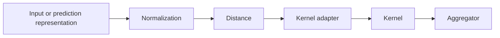
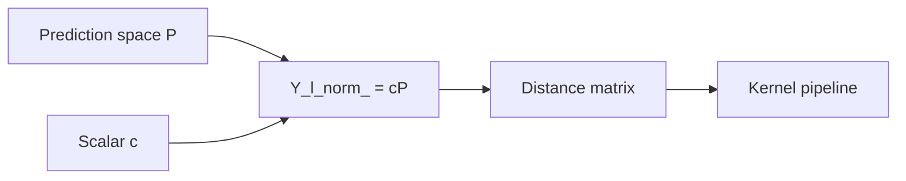

# Normalization

Normalization in the COBRA subsystem appears in **two distinct forms** in the
current source:

1. reusable normalizer classes under `cobra/core/normalizers/`;
2. scalar normalization constants used directly by `GradientCOBRA` and
   `MixCOBRARegressor`.

These mechanisms are related conceptually, but they are **not currently wired
together**.

The reusable normalizer package provides:

```text
standard / zscore
minmax
```

while the main regression COBRA estimators currently use:

```python
compute_normalization_constant()
```

and direct scalar multiplication.

This distinction is important when reading or extending the package.

---

## Normalization in the COBRA pipeline

Normalization happens before distance computation.

Conceptually:



Changing the scale of the representation changes the pairwise distances seen
by the downstream COBRA components.

---

# Two normalization systems

<div class="grid cards" markdown>

-   :material-chart-bell-curve-cumulative:{ .lg .middle } **Reusable normalizers**

    ---

    Stateful feature-wise transforms:

    ```text
    StandardNormalizer
    MinMaxNormalizer
    ```

    created through:

    ```python
    NormalizerFactory
    ```

-   :material-multiplication:{ .lg .middle } **COBRA scalar scaling**

    ---

    A single multiplicative constant computed by:

    ```python
    compute_normalization_constant()
    ```

    and used directly by:

    ```text
    GradientCOBRA
    MixCOBRARegressor
    ```

</div>

---

# Normalizer package

The reusable normalizer components live under:

```text
kfc_procedure/cobra/core/normalizers/
├── base.py
├── standard.py
├── minmax.py
└── __init__.py
```

The exported classes are:

```python
BaseNormalizer
NormalizerFactory
StandardNormalizer
MinMaxNormalizer
```

---

# `BaseNormalizer`

All reusable normalizers inherit:

```python
BaseNormalizer
```

and implement:

```python
fit()
transform()
```

The base class also supplies:

```python
fit_transform()
```

---

## Interface

```python
class BaseNormalizer(ABC):

    @abstractmethod
    def fit(
        self,
        x,
        **kwargs,
    ):
        ...

    @abstractmethod
    def transform(
        self,
        x,
        **kwargs,
    ):
        ...

    def fit_transform(
        self,
        x,
        **kwargs,
    ):
        self.fit(
            x,
            **kwargs,
        )

        return self.transform(
            x,
            **kwargs,
        )
```

The intended input shape is:

```text
(n_samples, n_features)
```

and the transformed result has the same shape.

---

# Normalizers are stateful

The source documentation explicitly describes normalizers as stateful.

For example:

```text
StandardNormalizer
    learns mean_ and std_

MinMaxNormalizer
    learns min_ and max_
```

Those statistics are learned during:

```python
fit()
```

and reused during:

```python
transform()
```

---

# `NormalizerFactory`

Reusable normalizers are registered through:

```python
NormalizerFactory
```

which subclasses the package's shared:

```python
BaseFactory
```

Create a normalizer by name:

```python
from kfc_procedure.cobra.core.normalizers import (
    NormalizerFactory,
)

normalizer = NormalizerFactory.create(
    "standard"
)
```

---

## Registered names

The current source registers:

```text
standard
zscore
minmax
```

where:

```text
standard
zscore
```

are aliases for the same implementation.

---

## Inspect available normalizers

```python
print(
    NormalizerFactory.available()
)
```

The current registry should include:

```text
minmax
standard
zscore
```

after the package has been imported.

---

# Standard normalization

`StandardNormalizer` is registered as:

```text
standard
zscore
```

It implements feature-wise Z-score normalization:

\[
x'
=
\frac{
x-\mu
}{
\sigma
}.
\]

---

## Fitted attributes

The class initializes:

```python
self.mean_ = None
self.std_ = None
```

After fitting:

```python
mean_
```

contains one mean per feature and:

```python
std_
```

contains one standard deviation per feature.

---

# Standard `fit()`

The implementation is:

```python
x = np.asarray(x)

self.mean_ = np.mean(
    x,
    axis=0,
)

self.std_ = (
    np.std(
        x,
        axis=0,
    )
    +
    1e-12
)
```

and returns:

```python
self
```

---

## Population standard deviation

The source calls:

```python
np.std(
    x,
    axis=0,
)
```

without specifying:

```python
ddof
```

so NumPy's default:

```text
ddof = 0
```

is used.

That means `std_` is based on the population-style standard deviation rather
than the sample standard deviation with `ddof=1`.

---

# Standard `transform()`

The implementation is:

```python
x = np.asarray(x)

return (
    x
    -
    self.mean_
) / self.std_
```

The learned vectors broadcast across rows.

---

# Numerical stability

The source adds:

```text
1e-12
```

to every feature standard deviation:

```python
std_ = std + 1e-12
```

This prevents direct division by zero for constant features.

---

## Constant feature behavior

Suppose one feature has the same value in every fitted row.

Then:

\[
\sigma=0
\]

and the stored value becomes approximately:

\[
10^{-12}.
\]

For training values equal to the learned mean:

\[
x-\mu=0,
\]

so that feature transforms to:

```text
0
```

for the fitted data.

---

# Direct standard example

```python
import numpy as np

from kfc_procedure.cobra.core.normalizers import (
    StandardNormalizer,
)

X = np.array([
    [1.0, 10.0],
    [2.0, 20.0],
    [3.0, 30.0],
])

normalizer = StandardNormalizer()

X_norm = normalizer.fit_transform(
    X
)

print(
    normalizer.mean_
)

print(
    normalizer.std_
)

print(
    X_norm
)
```

---

# Transform new data

After fitting:

```python
X_test_norm = normalizer.transform(
    X_test
)
```

uses the original:

```text
mean_
std_
```

rather than recomputing them.

This is the expected fit/transform separation in the reusable normalizer API.

---

# No fit-state validation

`StandardNormalizer.transform()` does not call:

```python
check_is_fitted()
```

and does not manually check whether:

```python
mean_
std_
```

have been learned.

Calling:

```python
StandardNormalizer().transform(X)
```

before `fit()` therefore fails through ordinary NumPy/Python arithmetic rather
than a package-specific fitted-state error.

---

# Min-max normalization

`MinMaxNormalizer` is registered as:

```text
minmax
```

It applies feature-wise scaling:

\[
x'
=
\frac{
x-x_{\min}
}{
x_{\max}-x_{\min}
}.
\]

For values inside the fitted range, this maps the fitted minimum to `0` and the
fitted maximum to approximately `1`.

---

## Fitted attributes

The constructor initializes:

```python
self.min_ = None
self.max_ = None
```

---

# Min-max `fit()`

The implementation is:

```python
x = np.asarray(x)

self.min_ = np.min(
    x,
    axis=0,
)

self.max_ = np.max(
    x,
    axis=0,
)
```

and returns:

```python
self
```

---

# Min-max `transform()`

The implementation is:

```python
x = np.asarray(x)

return (
    x
    -
    self.min_
) / (
    self.max_
    -
    self.min_
    +
    1e-12
)
```

---

# Constant min-max features

When:

\[
x_{\max}=x_{\min},
\]

the denominator would normally be zero.

The source adds:

```text
1e-12
```

to avoid direct division by zero.

For a value equal to the fitted constant:

\[
x-x_{\min}=0,
\]

the transformed value is:

```text
0.
```

---

# Direct min-max example

```python
import numpy as np

from kfc_procedure.cobra.core.normalizers import (
    MinMaxNormalizer,
)

X = np.array([
    [10.0, 100.0],
    [20.0, 150.0],
    [30.0, 200.0],
])

normalizer = MinMaxNormalizer()

X_norm = normalizer.fit_transform(
    X
)

print(
    normalizer.min_
)

print(
    normalizer.max_
)

print(
    X_norm
)
```

---

# New values can fall outside `[0, 1]`

`MinMaxNormalizer.transform()` does not clip transformed values.

If a new observation is below the fitted minimum:

\[
x < x_{\min},
\]

the output can be negative.

If it is above the fitted maximum:

\[
x > x_{\max},
\]

the output can exceed `1`.

Example:

```python
normalizer.fit(
    np.array([
        [0.0],
        [10.0],
    ])
)

normalizer.transform(
    np.array([
        [20.0],
    ])
)
```

produces approximately:

```text
2.0
```

rather than clipping to:

```text
1.0.
```

---

# No min-max fit-state validation

Like the standard normalizer, `MinMaxNormalizer` does not explicitly validate
fitted state inside:

```python
transform()
```

Using it before:

```python
fit()
```

fails through arithmetic with uninitialized attributes.

---

# Shared validation behavior

The two current reusable normalizers are intentionally lightweight.

They both begin with:

```python
np.asarray(x)
```

but do not perform a shared validation layer for:

```text
2D shape
finite values
numeric dtype
empty input
matching feature count
fitted state
```

Those conditions are therefore handled implicitly by NumPy operations.

---

# One-dimensional input

The class documentation describes input as:

```text
(n_samples, n_features)
```

but the implementation does not enforce two dimensions.

For a one-dimensional vector:

```python
x.shape == (
    n,
)
```

the source computes statistics over:

```python
axis=0
```

and returns a one-dimensional transformed vector.

So 1D data can work numerically even though the documented primary shape is
2D.

---

# Feature-count compatibility

After fitting on:

```text
d
```

features, the learned statistics have shape:

```text
(d,)
```

Transforming data with a different number of columns will fail or broadcast
according to NumPy's shape rules.

No explicit feature-count error is raised by the normalizer classes.

---

# NaN and infinity

Neither reusable normalizer filters:

```text
NaN
+Inf
-Inf
```

before calculating statistics.

For example:

```python
np.mean()
np.std()
np.min()
np.max()
```

can propagate non-finite values into learned attributes.

The current source does not use:

```text
nanmean
nanstd
nanmin
nanmax
```

or other sanitization.

---

# Reusable normalizers are not currently used by main COBRA estimators

A package-wide source search shows that:

```python
NormalizerFactory
StandardNormalizer
MinMaxNormalizer
```

are referenced inside the normalizer package itself, but not by the current
implementations of:

```text
GradientCOBRA
MixCOBRARegressor
CombinedClassifier
```

Those estimators do **not** currently accept constructor parameters such as:

```text
normalizer
normalizer_params
```

and do not create a `normalizer_` fitted attribute.

!!! important "Current integration status"

    The reusable normalizer classes exist as extension components, but the
    current main COBRA estimators do not route their internal representations
    through `NormalizerFactory`.

    Their actual normalization behavior is described below.

---

# Scalar normalization utility

The active normalization helper used by the regression COBRA estimators is:

```python
compute_normalization_constant()
```

from:

```text
kfc_procedure/cobra/utils/preprocessing.py
```

Its signature is:

```python
compute_normalization_constant(
    y,
    norm_constant=None,
    scale_factor=30.0,
    M=1,
)
```

---

# Scalar formula

The source first computes:

\[
m
=
\max |y|
+
10^{-12}.
\]

Then it chooses the numerator:

\[
s
=
\begin{cases}
\text{norm_constant},
&
\text{if provided},
\\
\text{scale_factor},
&
\text{otherwise}.
\end{cases}
\]

Finally:

\[
\boxed{
c
=
\frac{s}{mM}
}
\]

where:

```text
M
    number of prediction-space columns
```

in the current estimator calls.

---

## Implementation

```python
max_val = (
    np.max(
        np.abs(
            y
        )
    )
    +
    1e-12
)

c = (
    norm_constant
    if norm_constant is not None
    else scale_factor
)

return c / (
    max_val
    *
    M
)
```

---

# Important `norm_constant` meaning

The parameter name:

```python
norm_constant
```

can suggest that it directly supplies the final multiplier.

That is **not** what the current helper does.

When provided, it replaces:

```text
scale_factor
```

in the numerator.

The returned multiplier is still:

\[
\frac{
\text{norm_constant}
}{
(\max|y|+10^{-12})M
}.
\]

!!! important

    `norm_constant` is a normalization **numerator** in the current helper,
    not the final scaling constant.

---

# Direct helper example

```python
import numpy as np

from kfc_procedure.cobra.utils.preprocessing import (
    compute_normalization_constant,
)

y = np.array([
    -10.0,
    5.0,
    8.0,
])

c = compute_normalization_constant(
    y,
    scale_factor=30.0,
    M=3,
)

print(
    c
)
```

Ignoring the tiny epsilon:

\[
c
\approx
\frac{30}{10\times3}
=
1.
\]

---

# Custom numerator example

```python
c = compute_normalization_constant(
    y,
    norm_constant=15.0,
    scale_factor=30.0,
    M=3,
)
```

Because `norm_constant` is not `None`, the helper uses:

```text
15.0
```

instead of:

```text
30.0
```

as the numerator.

---

# Scale is global, not feature-wise

Unlike:

```text
StandardNormalizer
MinMaxNormalizer
```

the scalar helper returns **one number**.

The estimator then performs:

```python
normalized = data * constant
```

for every coordinate.

So it does not learn separate feature-wise means, standard deviations, minima,
or maxima.

---

# GradientCOBRA normalization

`GradientCOBRA` exposes:

```python
norm_constant=None
```

in its constructor.

During fitting, after creating the prediction-space matrix, the source calls:

```python
self.normalize_constant_ = (
    compute_normalization_constant(
        y=y,
        norm_constant=self.norm_constant,
        scale_factor=30.0,
        M=prediction_space.shape[1],
    )
)
```

---

## GradientCOBRA formula

Let:

```text
M
    number of prediction columns

Y
    target array passed to fit()
```

Then the default scalar is:

\[
c_G
=
\frac{
30
}{
(\max|Y|+10^{-12})M
}.
\]

If constructor parameter:

```python
norm_constant=s
```

is provided:

\[
c_G
=
\frac{
s
}{
(\max|Y|+10^{-12})M
}.
\]

---

# GradientCOBRA normalized prediction space

The calibration prediction matrix is stored as:

```python
self.Y_l_norm_ = (
    prediction_space
    *
    self.normalize_constant_
)
```

Then the distance matrix is computed on:

```python
self.Y_l_norm_
```

rather than the raw predictions.

---

## GradientCOBRA flow



---

# GradientCOBRA prediction-time consistency

During prediction:

```python
if self.as_predictions_:
    prediction_space = X
else:
    prediction_space = self._load_predictions(
        X
    )
```

Then:

```python
Y_norm = (
    prediction_space
    *
    self.normalize_constant_
)
```

So new predictions are multiplied by the **same fitted scalar** used for the
calibration prediction space.

This preserves scale consistency between:

```text
query prediction vectors
calibration prediction vectors.
```

---

# Inspect GradientCOBRA normalization

After fitting:

```python
print(
    model.normalize_constant_
)
```

Inspect the normalized calibration space:

```python
print(
    model.Y_l_norm_.shape
)

print(
    model.Y_l_norm_[:5]
)
```

---

# Reconstruct GradientCOBRA normalization

In standard feature mode:

```python
P_l = model._load_predictions(
    model.X_l_
)

reconstructed = (
    P_l
    *
    model.normalize_constant_
)
```

Then:

```python
np.allclose(
    reconstructed,
    model.Y_l_norm_,
)
```

should normally return:

```text
True.
```

---

# `as_predictions=True` in GradientCOBRA

When:

```python
model.fit(
    P,
    y,
    as_predictions=True,
)
```

the supplied:

```text
P
```

is already treated as prediction space.

The same scalar calculation is still applied:

```python
Y_l_norm_ = (
    P
    *
    normalize_constant_
)
```

The helper still derives its magnitude from:

```python
y
```

and:

```python
P.shape[1].
```

---

# MixCOBRA uses two scalar constants

`MixCOBRARegressor` combines:

```text
input-space geometry
prediction-space geometry.
```

It therefore computes two separate scaling constants:

```python
normalize_constant_x_
normalize_constant_y_
```

from constructor settings:

```python
norm_constant_x
norm_constant_y
```

---

# MixCOBRA input-space constant

The current fit code calls:

```python
self.normalize_constant_x_ = (
    compute_normalization_constant(
        X,
        norm_constant=self.norm_constant_x,
        scale_factor=5.0,
        M=prediction_space.shape[1],
    )
)
```

Note carefully that the first argument is:

```python
X
```

even though the helper parameter is named:

```python
y.
```

The function simply applies:

```python
np.max(
    np.abs(...)
)
```

to whatever array is supplied.

---

## MixCOBRA input formula

Let:

\[
P
\]

have \(M\) columns.

The default input-space scalar is:

\[
c_X
=
\frac{
5
}{
(\max|X|+10^{-12})M
}.
\]

The maximum is taken over the entire supplied array `X`.

---

# MixCOBRA prediction-space constant

The source also calls:

```python
self.normalize_constant_y_ = (
    compute_normalization_constant(
        y,
        norm_constant=self.norm_constant_y,
        scale_factor=50.0,
        M=prediction_space.shape[1],
    )
)
```

So the default prediction-space multiplier is:

\[
c_Y
=
\frac{
50
}{
(\max|y|+10^{-12})M
}.
\]

---

# MixCOBRA default scaling factors

The source therefore uses different default numerators:

```text
input-space normalization:
    5.0

prediction-space normalization:
    50.0
```

The two spaces are deliberately scaled differently before distance
calculation.

---

# MixCOBRA normalized calibration spaces

The source stores:

```python
self.X_l_norm_ = (
    self.X_l_
    *
    self.normalize_constant_x_
)
```

and:

```python
self.Y_l_norm_ = (
    prediction_space
    *
    self.normalize_constant_y_
)
```

---

## Two-parameter mode

With:

```python
one_parameter=False
```

the package computes distances separately:

```python
distance_matrix_x_ = distance(
    X_l_norm_,
    X_l_norm_,
)

distance_matrix_y_ = distance(
    Y_l_norm_,
    Y_l_norm_,
)
```

Then the adapter combines them as:

\[
D_{\text{mix}}
=
\alpha D_X
+
\beta D_Y.
\]

Normalization therefore affects both terms before `alpha` and `beta` are
optimized.

---

# One-parameter MixCOBRA

With:

```python
one_parameter=True
```

the source concatenates:

```python
self.mix_features_ = np.column_stack([
    self.X_l_norm_,
    self.Y_l_norm_,
])
```

and computes one distance matrix on that joined representation.

So the scalar normalization constants control the relative numerical scale of
the two blocks even before the one-parameter bandwidth is optimized.

---

# MixCOBRA prediction-time scaling

At prediction time:

```python
X_norm = (
    X
    *
    self.normalize_constant_x_
)

Y_norm = (
    pred_X
    *
    self.normalize_constant_y_
)
```

The fitted scalar constants are reused for new observations.

---

# Inspect MixCOBRA normalization

After fitting:

```python
print(
    model.normalize_constant_x_
)

print(
    model.normalize_constant_y_
)
```

Inspect the stored spaces:

```python
print(
    model.X_l_norm_.shape
)

print(
    model.Y_l_norm_.shape
)
```

---

# Reconstruct MixCOBRA normalized input space

```python
reconstructed_x = (
    model.X_l_
    *
    model.normalize_constant_x_
)

print(
    np.allclose(
        reconstructed_x,
        model.X_l_norm_,
    )
)
```

---

# Reconstruct MixCOBRA prediction space

In normal feature mode:

```python
P_l = model._load_predictions(
    model.X_l_
)

reconstructed_y = (
    P_l
    *
    model.normalize_constant_y_
)
```

Then:

```python
np.allclose(
    reconstructed_y,
    model.Y_l_norm_,
)
```

should normally return:

```text
True.
```

---

# Important MixCOBRA data-source detail

The input-space constant is computed from the `X` argument passed to:

```python
fit()
```

not from:

```python
self.X_l_
```

specifically.

So when explicit calibration data are supplied:

```python
model.fit(
    X_k,
    y_k,
    X_l=X_l,
    y_l=y_l,
)
```

the source computes:

```text
normalize_constant_x_
```

from:

```text
X_k
```

because that is the `X` argument to `fit()`.

It then applies that scalar to:

```text
X_l_
```

for calibration distances.

---

# MixCOBRA target-scaling detail

Similarly:

```python
normalize_constant_y_
```

is computed from the `y` argument passed to `fit()`.

With explicit calibration data:

```text
y argument = y_k
```

while the prediction-space geometry belongs to:

```text
X_l / y_l calibration rows.
```

The source therefore derives the scalar from training-side targets and applies
it to calibration-side estimator predictions.

This page documents that exact implementation.

---

# MixCOBRA with `as_predictions=True`

When:

```python
as_predictions=True
```

the shared training resolver sets:

```text
X_l_ = supplied X
y_l_ = supplied y
```

and:

```text
X_k_ = None
y_k_ = None.
```

MixCOBRA then sets:

```python
prediction_space = self.X_l_
```

but still computes:

```python
normalize_constant_x_
```

from the supplied `X` and:

```python
normalize_constant_y_
```

from the supplied `y`.

As a result:

```python
X_l_norm_
```

and:

```python
Y_l_norm_
```

are both based on the supplied prediction matrix, but multiplied by two
different scalar constants.

!!! note "Current source behavior"

    In MixCOBRA's `as_predictions=True` fit path, the same supplied matrix
    participates as both:

    ```text
    X_l_
    prediction_space
    ```

    and is therefore stored in two differently scaled representations.

---

# CombinedClassifier does not normalize prediction space

The current:

```python
CombinedClassifier
```

does not call:

```python
compute_normalization_constant()
```

and does not use:

```python
NormalizerFactory.
```

Its calibration prediction matrix is stored directly as:

```python
pred_l_
```

and distance is computed on:

```python
distance_.matrix(
    pred_l_,
    pred_l_,
)
```

---

## Why that matters

With the default:

```text
hamming
```

distance, CombinedClassifier operates on hard-label mismatch patterns such as:

```text
[0, 1, 1, 0].
```

The current source applies no standardization, min-max scaling, or scalar
normalization before that distance.

---

# Normalization and distance scaling

A scalar multiplier changes many distance metrics predictably.

For Euclidean distance:

\[
d(cu,cv)
=
|c|d(u,v).
\]

So multiplying every prediction coordinate by:

```text
c
```

scales the Euclidean distance by:

```text
|c|.
```

The package then separately applies the kernel adapter parameter, such as:

\[
D'
=
hD.
\]

Thus both normalization and optimized bandwidth affect the numerical scale that
reaches the kernel.

---

# Effective GradientCOBRA RBF scale

For raw prediction-space Euclidean distance:

\[
D_{\text{raw}},
\]

scalar normalization by:

\[
c
\]

gives approximately:

\[
D_{\text{norm}}
=
|c|D_{\text{raw}}.
\]

The one-parameter adapter then gives:

\[
D'
=
h|c|D_{\text{raw}}.
\]

With the default RBF kernel:

\[
K
=
e^{-D'},
\]

so:

\[
\boxed{
K
=
e^{-h|c|D_{\text{raw}}}
}
\]

for Euclidean geometry.

This shows why normalization and bandwidth should be interpreted together.

---

# Effect of number of prediction columns

The scalar helper divides by:

```python
M
```

where `M` is passed as:

```python
prediction_space.shape[1].
```

So, all else equal, adding more prediction columns reduces the scalar:

\[
c
\propto
\frac1M.
\]

That behavior is explicit in the current source.

---

# Zero-magnitude data

The helper computes:

```python
max_val = (
    np.max(
        np.abs(y)
    )
    +
    1e-12
)
```

If every supplied value is zero:

\[
\max|y|=0,
\]

then:

\[
c
\approx
\frac{s}{10^{-12}M}.
\]

This produces a very large scalar.

However, multiplying an all-zero representation by that scalar still produces
zeros.

If the target array is zero while the prediction matrix is not, the resulting
prediction scaling can become very large.

The current helper does not cap the returned constant.

---

# Empty arrays

`compute_normalization_constant()` calls:

```python
np.max(...)
```

directly.

An empty input therefore fails through NumPy's reduction rules.

The helper does not provide a custom empty-array validation error.

---

# `M=0`

The helper does not validate:

```python
M
```

before division.

Passing:

```text
M = 0
```

causes division by zero behavior.

The current high-level calls normally obtain `M` from:

```python
prediction_space.shape[1]
```

so an ordinary non-empty prediction space has a positive value.

---

# Negative custom numerator

The helper does not require:

```python
norm_constant > 0.
```

If a negative numerator is supplied, the returned scalar is negative.

With distance metrics based on differences and absolute magnitudes, sign may
cancel mathematically; with arbitrary custom components, the effect depends on
the downstream implementation.

The current source does not restrict this parameter.

---

# Difference from Z-score normalization

`StandardNormalizer` performs:

\[
x'_{ij}
=
\frac{
x_{ij}-\mu_j
}{
\sigma_j
}
\]

feature by feature.

`compute_normalization_constant()` performs:

\[
x'_{ij}
=
cx_{ij}
\]

with one global scalar.

So the scalar helper:

```text
does not center features
does not equalize per-column variance
does not store per-feature statistics.
```

---

# Difference from MinMax normalization

`MinMaxNormalizer` performs:

\[
x'_{ij}
=
\frac{
x_{ij}-\min_j
}{
\max_j-\min_j
}.
\]

The COBRA scalar helper instead scales every value by the same number.

It does not force coordinates into:

```text
[0, 1].
```

---

# Why `StandardNormalizer` and `MinMaxNormalizer` are still useful

Although the main estimators do not currently use them internally, they can be
used directly when building custom COBRA workflows.

For example:

```python
normalizer = NormalizerFactory.create(
    "standard"
)

P_train_norm = normalizer.fit_transform(
    P_train
)

P_test_norm = normalizer.transform(
    P_test
)
```

Those normalized matrices can then be passed to lower-level distance or custom
pipeline components.

---

# Pre-normalizing external prediction space

For an estimator that accepts:

```python
as_predictions=True
```

you can preprocess a matrix yourself.

For example:

```python
normalizer = NormalizerFactory.create(
    "standard"
)

P_train_norm = normalizer.fit_transform(
    P_train
)

P_test_norm = normalizer.transform(
    P_test
)
```

Then:

```python
model.fit(
    P_train_norm,
    y_train,
    as_predictions=True,
)
```

and:

```python
model.predict(
    P_test_norm
)
```

use your transformed representation.

!!! important

    `GradientCOBRA` will still apply its own scalar
    `compute_normalization_constant()` after receiving `P_train_norm`.

    So this is **additional preprocessing**, not a replacement for the
    estimator's built-in scalar scaling.

---

# External normalization with CombinedClassifier

Because `CombinedClassifier` does not apply its own normalization, a manually
transformed prediction matrix passed via:

```python
as_predictions=True
```

is used directly by its distance component.

Whether that transformation makes sense depends on the configured distance.

For example, standardizing hard class labels before Hamming distance changes
the representation away from the package's normal hard-label pattern.

The source does not impose or recommend such a transformation automatically.

---

# Custom normalizer

A custom normalizer can subclass:

```python
BaseNormalizer
```

and register with:

```python
NormalizerFactory
```

Example:

```python
import numpy as np

from kfc_procedure.cobra.core.normalizers import (
    BaseNormalizer,
    NormalizerFactory,
)


@NormalizerFactory.register(
    "maxabs"
)
class MaxAbsNormalizer(
    BaseNormalizer
):

    def __init__(
        self,
    ):
        self.scale_ = None

    def fit(
        self,
        x,
        **kwargs,
    ):
        x = np.asarray(
            x
        )

        self.scale_ = (
            np.max(
                np.abs(
                    x
                ),
                axis=0,
            )
            +
            1e-12
        )

        return self

    def transform(
        self,
        x,
        **kwargs,
    ):
        return (
            np.asarray(
                x
            )
            /
            self.scale_
        )
```

Then:

```python
normalizer = NormalizerFactory.create(
    "maxabs"
)
```

can resolve it.

---

# Register aliases

The factory supports multiple names:

```python
@NormalizerFactory.register(
    "maxabs",
    "max_abs",
)
class MaxAbsNormalizer(
    BaseNormalizer
):
    ...
```

Both names point to the same class.

---

# Factory registration does not integrate it automatically

Registering a new normalizer makes it available through:

```python
NormalizerFactory.create(...)
```

but current:

```text
GradientCOBRA
MixCOBRARegressor
CombinedClassifier
```

do not query `NormalizerFactory`.

So a custom normalizer is not automatically activated by registration alone.

The estimator source would need an explicit normalizer configuration path.

---

# Inspect standard fitted state

```python
normalizer = NormalizerFactory.create(
    "standard"
)

normalizer.fit(
    X
)

print(
    normalizer.mean_
)

print(
    normalizer.std_
)
```

---

# Inspect min-max fitted state

```python
normalizer = NormalizerFactory.create(
    "minmax"
)

normalizer.fit(
    X
)

print(
    normalizer.min_
)

print(
    normalizer.max_
)
```

---

# Inspect GradientCOBRA fitted state

```python
print(
    model.normalize_constant_
)

print(
    model.Y_l_norm_
)
```

There is no:

```python
model.normalizer_
```

in the current implementation.

---

# Inspect MixCOBRA fitted state

```python
print(
    model.normalize_constant_x_
)

print(
    model.normalize_constant_y_
)

print(
    model.X_l_norm_
)

print(
    model.Y_l_norm_
)
```

Again, these are scalar-normalized arrays, not outputs from the reusable
`NormalizerFactory` classes.

---

# Debugging normalization

## Check prediction-space width

GradientCOBRA:

```python
M = model.Y_l_norm_.shape[1]

print(
    M
)
```

Remember that `M` enters the denominator of the scalar normalization formula.

---

## Recompute GradientCOBRA constant

```python
from kfc_procedure.cobra.utils.preprocessing import (
    compute_normalization_constant,
)

c = compute_normalization_constant(
    y_train,
    norm_constant=model.norm_constant,
    scale_factor=30.0,
    M=prediction_space.shape[1],
)

print(
    c
)

print(
    model.normalize_constant_
)
```

Use the same `y` array that was passed as the main `fit()` argument.

---

## Recompute MixCOBRA constants

```python
c_x = compute_normalization_constant(
    X,
    norm_constant=model.norm_constant_x,
    scale_factor=5.0,
    M=prediction_space.shape[1],
)

c_y = compute_normalization_constant(
    y,
    norm_constant=model.norm_constant_y,
    scale_factor=50.0,
    M=prediction_space.shape[1],
)
```

---

## Check magnitude

```python
print(
    np.max(
        np.abs(
            model.Y_l_norm_
        )
    )
)
```

For MixCOBRA:

```python
print(
    np.max(
        np.abs(
            model.X_l_norm_
        )
    )
)

print(
    np.max(
        np.abs(
            model.Y_l_norm_
        )
    )
)
```

---

# Current implementation comparison

| Mechanism | Learned state | Transform | Current main estimator use |
| --- | --- | --- | --- |
| `StandardNormalizer` | `mean_`, `std_` | \((x-\mu)/\sigma\) | not wired in |
| `MinMaxNormalizer` | `min_`, `max_` | \((x-min)/(max-min)\) | not wired in |
| `compute_normalization_constant()` | one scalar | \(cx\) | GradientCOBRA, MixCOBRA |
| CombinedClassifier | none | raw prediction space | no normalization |

---

# Scalar defaults by estimator

| Estimator / space | Numerator | Denominator source |
| --- | ---: | --- |
| GradientCOBRA prediction space | `30.0` | `max(abs(y)) * M` |
| MixCOBRA input space | `5.0` | `max(abs(X)) * M` |
| MixCOBRA prediction space | `50.0` | `max(abs(y)) * M` |
| CombinedClassifier | — | no normalization |

All denominators include the source's added:

```text
1e-12
```

inside the maximum-magnitude term.

---

# Important current-source caveats

| Area | Current behavior |
| --- | --- |
| reusable normalizers available | Standard, MinMax |
| reusable normalizers used internally by main estimators | No |
| Standard epsilon | `1e-12` added to std |
| MinMax epsilon | `1e-12` added to range |
| MinMax clipping | none |
| fitted-state checks | none |
| shared finite-value validation | none |
| GradientCOBRA scaling | one scalar |
| MixCOBRA scaling | two scalars |
| CombinedClassifier normalization | none |
| custom `norm_constant` | replaces numerator, not final scalar |
| normalization divided by prediction width `M` | Yes |
| negative custom numerator validation | none |
| MixCOBRA explicit-calibration constant source | main `X/y` arguments, not `X_l/y_l` |

---

# Quick reference

| Goal | Current source mechanism |
| --- | --- |
| feature-wise zero mean / unit variance | `StandardNormalizer` |
| feature-wise `[0,1]` scaling on fitted range | `MinMaxNormalizer` |
| create normalizer by name | `NormalizerFactory.create(...)` |
| GradientCOBRA internal prediction scaling | `normalize_constant_` |
| customize GradientCOBRA numerator | `norm_constant=` |
| MixCOBRA input scaling | `normalize_constant_x_` |
| MixCOBRA prediction scaling | `normalize_constant_y_` |
| customize MixCOBRA numerators | `norm_constant_x=`, `norm_constant_y=` |
| inspect normalized GradientCOBRA representation | `Y_l_norm_` |
| inspect normalized MixCOBRA representations | `X_l_norm_`, `Y_l_norm_` |

---

# Mental model

!!! quote ""

    **The current package has reusable feature-wise normalizers, but its main
    COBRA regression estimators actually normalize geometry with global scalar
    multipliers before distance computation.**

Reusable normalization:

\[
\boxed{
x
\rightarrow
\text{fit feature statistics}
\rightarrow
\text{feature-wise transform}
}
\]

GradientCOBRA:

\[
\boxed{
P
\rightarrow
c_GP
\rightarrow
D
}
\]

MixCOBRA:

\[
\boxed{
X
\rightarrow
c_XX
\rightarrow
D_X
}
\]

and:

\[
\boxed{
P
\rightarrow
c_YP
\rightarrow
D_Y.
}
\]

Understanding which normalization path is actually active is important when
interpreting distances, bandwidths, and MixCOBRA's input/prediction-space
balance.

