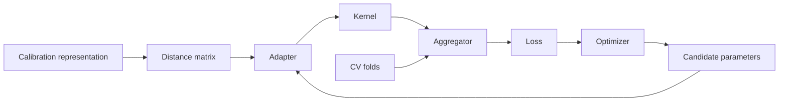

# Optimization

Optimization selects the COBRA hyperparameters that minimize the
cross-validation objective.

In the current source, optimization is responsible for parameters such as:

```text
bandwidth
alpha
beta
```

rather than for fitting the original base estimators.

The optimizer subsystem lives under:

```text
kfc_procedure/cobra/core/optimizers/
├── base.py
├── _utils.py
├── search/
│   ├── base.py
│   └── search.py
└── gradient/
    ├── base.py
    ├── gd.py
    ├── momentum.py
    └── adam.py
```

The currently registered optimizers are:

```text
grid
gd
momentum
adam
```

and are resolved through:

```python
OptimizerFactory
```

---

## Where optimization fits

The COBRA training flow is approximately:



The objective being minimized is the mean cross-validation loss:

\[
J(\theta)
=
\frac{1}{K}
\sum_{k=1}^{K}
L_k(\theta),
\]

where \(\theta\) may be:

\[
\theta=(h)
\]

for a one-parameter bandwidth model, or:

\[
\theta=(\alpha,\beta)
\]

for two-parameter MixCOBRA.

---

# Optimization is a separate layer

The source keeps several concerns separate:

```text
Distance
    defines geometry

Kernel adapter
    inserts tunable parameters

Kernel
    converts adapted distances to weights

Aggregator
    produces predictions

Loss
    evaluates predictions

Optimizer
    searches for parameters minimizing the loss
```

Changing the optimizer does not change the distance, kernel, or loss formulas
themselves.

---

# `BaseOptimizer`

All optimizers inherit:

```python
BaseOptimizer
```

Its constructor is:

```python
BaseOptimizer(
    show_process=True,
    **kwargs,
)
```

It stores:

```python
self.show_process
```

and:

```python
self.config = dict(
    kwargs
)
```

---

## Unified optimization interface

Every optimizer implements:

```python
optimize(
    objective,
    init_param=None,
    **kwargs,
)
```

where:

```text
objective
    function to minimize

init_param
    optional initial parameter vector
```

The base class also implements:

```python
__call__(
    objective,
    init_param=None,
)
```

as:

```python
return self.optimize(
    objective,
    init_param,
)
```

So these are equivalent:

```python
optimizer.optimize(
    objective,
    init_param,
)
```

and:

```python
optimizer(
    objective,
    init_param,
)
```

---

# `OptimizerFactory`

Create an optimizer with:

```python
from kfc_procedure.cobra.core.optimizers import (
    OptimizerFactory,
)

optimizer = OptimizerFactory.create(
    "grid",
    param_grid={
        "bandwidth": [
            0.1,
            1.0,
            10.0,
        ]
    },
)
```

---

## Registered categories

The current factory registrations attach categories.

`grid` is registered with:

```text
search
derivative_free
```

while:

```text
gd
momentum
adam
```

are registered with:

```text
optimizer
gradient
```

This lets higher-level estimators check whether a configured optimizer belongs
to the appropriate family.

---

## Inspect optimizers

```python
print(
    OptimizerFactory.available()
)
```

Current registered names should include:

```text
adam
gd
grid
momentum
```

---

## Inspect by category

```python
print(
    OptimizerFactory.available_by_category(
        "search"
    )
)
```

returns the search family.

```python
print(
    OptimizerFactory.available_by_category(
        "gradient"
    )
)
```

returns the gradient family.

---

# Two optimization families

The source divides optimization into:

<div class="grid cards" markdown>

-   :material-table-search:{ .lg .middle } **Search optimization**

    ---

    Evaluate a discrete set of candidate parameter combinations.

    Current implementation:

    ```text
    grid
    ```

-   :material-gradient-horizontal:{ .lg .middle } **Gradient optimization**

    ---

    Iteratively update continuous parameters using numerical or supplied
    gradients.

    Current implementations:

    ```text
    gd
    momentum
    adam
    ```

</div>

---

# Grid search

The registered search optimizer is:

```python
GridSearchOptimizer
```

under the name:

```text
grid
```

It inherits:

```python
BaseSearchOptimizer
```

and performs exhaustive evaluation over a supplied parameter grid.

---

## Constructor

```python
GridSearchOptimizer(
    param_grid,
    **kwargs,
)
```

where `param_grid` is a dictionary such as:

```python
{
    "alpha": [
        0.1,
        1.0,
        10.0,
    ],
    "beta": [
        0.01,
        0.1,
    ],
}
```

---

# Candidate generation

`GridSearchOptimizer.candidates()` does:

```python
keys = list(
    self.param_grid.keys()
)

values = list(
    self.param_grid.values()
)

grid = list(
    product(
        *values
    )
)
```

then converts every combination to a float array.

So the candidate ordering follows:

```python
itertools.product
```

over the dictionary's insertion-ordered values.

---

## Parameter names are not passed to the objective

The generated candidate is only the numeric vector:

```python
np.array(
    combination,
    dtype=float,
)
```

The objective therefore sees something like:

```python
np.array([
    alpha,
    beta,
])
```

rather than:

```python
{
    "alpha": alpha,
    "beta": beta,
}
```

Parameter meaning is determined by grid insertion order and the objective's
interpretation of vector positions.

---

# One-dimensional grid example

```python
optimizer = GridSearchOptimizer(
    param_grid={
        "bandwidth": [
            0.1,
            0.5,
            1.0,
        ]
    },
    show_process=False,
)
```

The generated candidates are conceptually:

```text
[0.1]
[0.5]
[1.0]
```

---

# Two-dimensional grid example

```python
optimizer = GridSearchOptimizer(
    param_grid={
        "alpha": [
            0.1,
            1.0,
        ],
        "beta": [
            0.2,
            2.0,
        ],
    },
)
```

The source evaluates all Cartesian-product pairs:

```text
[0.1, 0.2]
[0.1, 2.0]
[1.0, 0.2]
[1.0, 2.0]
```

---

# Search risk reduction

`BaseSearchOptimizer` supports objective functions returning either:

```text
a scalar
```

or:

```text
a vector
```

through:

```python
reduce_risk()
```

The constructor parameter is:

```python
risk_strategy="mean"
```

by default.

---

## Supported risk strategies

The current source supports:

```text
mean
sum
max
min
median
l2
```

through:

```python
strategies = {
    "mean": np.mean,
    "sum": np.sum,
    "max": np.max,
    "min": np.min,
    "median": np.median,
    "l2": np.linalg.norm,
}
```

---

## Scalar objective

If:

```python
np.ndim(
    score
) == 0
```

the score is returned directly as:

```python
float(score)
```

So the risk strategy has no effect on normal scalar COBRA CV objectives.

---

# Best-candidate selection

After evaluating all candidates, the search optimizer computes:

```python
best = np.min(
    risks
)
```

and finds all matching indices.

If there is one minimum:

```python
return ids[0]
```

If several candidates have exactly the same minimum risk:

```python
return ids[
    len(ids) // 2
]
```

---

## Tie behavior

This means the source does **not** select the first tied grid candidate.

It selects the middle index among the tied candidate positions.

For tied indices:

```text
[2, 3, 4]
```

it selects:

```text
3
```

For tied indices:

```text
[2, 3]
```

it selects:

```text
3
```

because:

```python
len(ids) // 2 == 1
```

---

# Grid result structure

`BaseSearchOptimizer.optimize()` returns:

```python
{
    "x": ...,
    "score": ...,
    "risk": ...,
    "best_index": ...,
    "history": ...,
    "scores": ...,
    "risks": ...,
}
```

The key used by the main COBRA estimators is primarily:

```text
x
score
history
```

---

# Search history

Every evaluated candidate contributes:

```python
{
    "iter": i,
    "x": x.copy(),
    "score": score,
    "risk": risk,
}
```

to the history.

So grid-search history contains every candidate, including candidates evaluated
after the eventual optimum was already encountered.

---

# `init_param` in search optimizers

`BaseSearchOptimizer.optimize()` accepts:

```python
init_param=None
```

for API compatibility but does not use it.

The candidate set comes entirely from:

```python
self.candidates()
```

---

# Gradient optimizers

The gradient family is built on:

```python
BaseGradientOptimizer
```

with three update rules:

```text
gd
momentum
adam
```

The detailed gradient algorithms are covered in
[Gradient Optimization](gradient-optimization.md).

This page focuses on how that family plugs into the general optimizer system.

---

# Gradient optimizer defaults

`BaseGradientOptimizer.__init__()` currently defines:

```python
learning_rate=0.01
max_iter=300
tol=1e-7
speed="constant"
gradient_method="central"
eps=1e-7
n_tries=5
init_range=(1e-4, 3.0)
show_process=True
```

Additional unknown keyword arguments are accepted through:

```python
**kwargs
```

and stored in the base optimizer's:

```python
config
```

dictionary.

---

# Numerical gradients

Unless an analytical gradient function is explicitly supplied to
`optimize()`, the gradient optimizer calls:

```python
compute_gradient()
```

from:

```text
cobra/core/optimizers/_utils.py
```

The default method is:

```text
central
```

finite differences.

---

## Supported gradient estimators

The numerical-gradient dispatcher contains:

```text
central
forward
spsa
complex
parallel
```

These are implementation details of the gradient optimization family rather
than separate `OptimizerFactory` optimizers.

---

# Gradient initialization

If:

```python
init_param is None
```

the gradient base class performs a small initialization search.

It creates:

```python
grid = np.linspace(
    low,
    high,
    n_tries,
)
```

using:

```python
init_range
```

and:

```python
n_tries
```

Then for parameter dimension `dim`:

```python
candidates = np.array([
    np.full(
        dim,
        g,
    )
    for g in grid
])
```

The candidate with the minimum objective value is used as the initial
parameter vector.

---

## Important initialization geometry

For dimensions greater than one, this initialization searches only diagonal
vectors:

\[
(g,g,\ldots,g).
\]

It does not search all combinations of independent coordinate values.

For example, with two dimensions it tests:

```text
[g1, g1]
[g2, g2]
...
```

rather than every:

```text
[alpha_i, beta_j]
```

combination.

---

# Initial parameter used by COBRA estimators

The main estimator methods normally provide explicit initial parameters for
gradient optimization.

GradientCOBRA uses:

```python
init_param=np.array([
    1.0
])
```

MixCOBRA uses:

```python
np.array([
    1.0
])
```

in one-parameter mode and:

```python
np.array([
    1.0,
    1.0,
])
```

in two-parameter mode.

So the gradient base class's automatic initialization search is normally
bypassed in those paths.

---

# Gradient result structure

`BaseGradientOptimizer.optimize()` returns:

```python
{
    "x": best_x,
    "score": best_score,
    "history": history,
}
```

This matches the keys expected by GradientCOBRA and MixCOBRA.

Unlike the search result, it does not return:

```text
risk
best_index
scores
risks
```

---

# Optimization history conversion

The high-level estimators convert optimizer histories through:

```python
history_to_dataframe()
```

This helper creates:

```python
pd.DataFrame(
    history
)
```

and, if an `x` column exists, expands vector coordinates into named columns.

---

## Example

For a history entry:

```python
{
    "iter": 0,
    "x": np.array([
        0.5
    ]),
    "score": 1.2,
}
```

and:

```python
param_names=[
    "bandwidth"
]
```

the resulting DataFrame contains a:

```text
bandwidth
```

column and drops:

```text
x.
```

---

# GradientCOBRA optimization

The relevant constructor parameters are:

```python
optimizer="grid"
optimizer_params=None
opt_method="grid"
bandwidth_list=None
learning_rate=0.1
max_iter=300
```

The distinction between:

```text
optimizer
```

and:

```text
opt_method
```

is important.

---

## `opt_method`

For GradientCOBRA:

```python
opt_method
```

selects the optimization family:

```text
grid
grad
```

while:

```python
optimizer
```

selects the concrete registered optimizer.

---

# GradientCOBRA grid path

With the defaults:

```python
opt_method="grid"
optimizer="grid"
```

the estimator creates candidate bandwidths:

```python
np.linspace(
    0.001,
    10.0,
    max_iter,
)
```

unless:

```python
bandwidth_list
```

was supplied.

---

## Custom bandwidth list

```python
model = GradientCOBRA(
    bandwidth_list=np.array([
        0.05,
        0.1,
        0.5,
        1.0,
        2.0,
    ]),
)
```

The supplied array becomes the grid directly.

The source does not sort, deduplicate, or validate positivity of this list
before grid construction.

---

# GradientCOBRA category validation

For:

```python
opt_method="grid"
```

the source requires:

```python
OptimizerFactory.supports(
    optimizer,
    category="search",
)
```

If not, it raises a `ValueError` listing the registered search optimizers.

For:

```python
opt_method="grad"
```

it requires category:

```text
gradient
```

---

# GradientCOBRA optimizer parameters

For grid mode, the source updates the optimizer parameter dictionary with:

```python
{
    "param_grid": {
        "bandwidth": bandwidth_candidates,
    },
    "random_state": self.random_state,
}
```

The current `GridSearchOptimizer` does not use `random_state`; because its base
classes accept extra `**kwargs`, the value is simply stored in optimizer
configuration.

---

## Gradient mode parameters

For gradient mode:

```python
params.update({
    "learning_rate": self.learning_rate,
    "max_iter": self.max_iter,
})
```

So constructor-level:

```text
learning_rate
max_iter
```

override same-named values that may have been placed in:

```python
optimizer_params
```

before the update.

Other optimizer parameters remain configurable through:

```python
optimizer_params.
```

---

# Kernel compatibility fallback

Before resolving the optimizer family, GradientCOBRA checks:

```python
if (
    method == "grad"
    and not self.kernel_.requires_grad
):
    method = "grid"
```

So a non-gradient-compatible kernel automatically changes the effective
method from:

```text
grad
```

to:

```text
grid.
```

---

## Effective method is recorded

GradientCOBRA stores:

```python
optimization_outputs_[
    "method"
] = method
```

where `method` is the **effective** value after any fallback.

So this model records the actual method used.

---

# GradientCOBRA result

After optimization:

```python
self.bandwidth_ = float(
    np.atleast_1d(
        result["x"]
    )[0]
)
```

The stored summary is:

```python
self.optimization_outputs_ = {
    "method": method,
    "optimizer": optimizer,
    "bandwidth": self.bandwidth_,
    "score": result["score"],
    "history": history_df,
    "evaluations": len(
        result["history"]
    ),
}
```

---

# Inspect GradientCOBRA optimization

```python
print(
    model.bandwidth_
)

print(
    model.optimization_outputs_
)
```

The history is a pandas DataFrame:

```python
history = (
    model
    .optimization_outputs_[
        "history"
    ]
)

print(
    history.head()
)
```

---

# MixCOBRA optimization

The current MixCOBRA constructor exposes:

```python
optimizer="grid"
optimizer_params=None
alpha_list=None
beta_list=None
opt_method="grid"
learning_rate=0.01
max_iter=300
one_parameter=False
```

Its optimization target depends on:

```python
one_parameter.
```

---

# MixCOBRA candidate arrays

If explicit lists are absent:

```python
alpha_candidates = np.linspace(
    0.001,
    10.0,
    max_iter,
)
```

and:

```python
beta_candidates = np.linspace(
    0.001,
    10.0,
    max_iter,
)
```

---

# Two-parameter MixCOBRA

With the default:

```python
one_parameter=False
```

grid search uses:

```python
{
    "alpha": alpha_candidates,
    "beta": beta_candidates,
}
```

This creates the full Cartesian product.

If both candidate arrays contain:

```text
300
```

values, the exhaustive grid contains:

\[
300\times300
=
90{,}000
\]

candidate parameter pairs.

Each candidate then evaluates the cross-validation objective.

!!! warning "Grid size"

    `max_iter` controls the number of values **per parameter** in the default
    two-parameter MixCOBRA grid.

    It does not mean only `max_iter` total objective evaluations.

---

# One-parameter MixCOBRA

With:

```python
one_parameter=True
```

the optimizer is constructed with:

```python
{
    "alpha": alpha_candidates
}
```

even though the one-parameter adapter itself represents a parameter named:

```text
bandwidth.
```

The one-dimensional objective simply reads:

```python
float(
    np.atleast_1d(
        params
    )[0]
)
```

so the dictionary key does not affect the numeric optimization.

---

## Naming inconsistency

Later in the grid execution branch, the source creates a local variable:

```python
param_grid = {
    "bandwidth": alpha_candidates
}
```

and passes it as the second positional argument to:

```python
self.optimizer_(
    objective,
    param_grid,
)
```

But for search optimizers this second argument is interpreted as:

```python
init_param
```

and is ignored.

The actual candidate grid was already stored when the optimizer was
constructed.

So this local `param_grid` does not reconfigure the search optimizer.

---

# MixCOBRA category validation

Like GradientCOBRA:

```text
opt_method="grad"
```

requires a registered:

```text
gradient
```

optimizer.

```text
opt_method="grid"
```

requires a registered:

```text
search
```

optimizer.

---

# MixCOBRA kernel fallback

If:

```python
opt_method="grad"
```

but:

```python
kernel_.requires_grad == False
```

the local variable:

```python
method
```

is changed to:

```text
grid.
```

The appropriate optimizer category is then validated using this effective
method.

---

# MixCOBRA reporting caveat

Although MixCOBRA may change the local:

```python
method
```

from gradient to grid, its stored output uses:

```python
"method": self.opt_method
```

rather than the effective local variable.

Therefore:

```python
optimization_outputs_[
    "method"
]
```

can report:

```text
grad
```

even when a non-gradient kernel caused the source to execute the grid path.

!!! warning "Current source inconsistency"

    GradientCOBRA records the effective optimization method.

    MixCOBRA records the originally configured `self.opt_method`.

---

# MixCOBRA optimizer construction

The source calls:

```python
OptimizerFactory.create(
    optimizer,
    **params,
    random_state=self.random_state,
)
```

The current built-in optimizer constructors accept extra `**kwargs`, so the
seed can be stored even when the optimizer does not use randomness directly.

---

# MixCOBRA optimization outputs

The stored summary is:

```python
{
    "method": self.opt_method,
    "score": result["score"],
    "history": history_df,
    "evaluations": len(
        result["history"]
    ),
    "params": result["x"],
}
```

The fitted parameter vector is therefore available as:

```python
model.optimization_outputs_[
    "params"
]
```

---

## Parameter names in history

MixCOBRA always calls:

```python
history_to_dataframe(
    result["history"],
    param_names=[
        "alpha",
        "beta",
    ],
)
```

In one-parameter mode, `x` has only one column.

The helper loops over the actual coordinate count, so only:

```text
alpha
```

is created; the extra name:

```text
beta
```

is unused.

---

# CombinedClassifier optimization

`CombinedClassifier` exposes:

```python
optimizer="grid"
optimizer_params=None
bandwidth_list=None
max_iter=300
```

but it does **not** expose:

```python
opt_method
```

as a public constructor parameter.

The source optimization method is structurally simpler than GradientCOBRA and
MixCOBRA.

---

# CombinedClassifier default grid

Candidate bandwidths are:

```python
np.asarray(
    bandwidth_list
)
```

when provided, otherwise:

```python
np.linspace(
    0.001,
    10.0,
    max_iter,
)
```

---

# CombinedClassifier optimizer construction

The source builds:

```python
params = dict(
    self.optimizer_params
    or {}
)
```

then updates:

```python
{
    "param_grid": {
        "bandwidth": bandwidth_candidates,
    },
    "max_iter": self.max_iter,
    "random_state": self.random_state,
}
```

and creates:

```python
OptimizerFactory.create(
    self.optimizer,
    **params,
)
```

---

# No category check in CombinedClassifier

Unlike GradientCOBRA and MixCOBRA, the current classifier does not call:

```python
OptimizerFactory.supports(
    ...,
    category=...
)
```

inside `_optimize_hyperparameters()`.

So the source does not explicitly enforce that:

```python
optimizer
```

belongs to the search family.

The default:

```text
grid
```

does, but other registered optimizers can be constructed if their constructor
accepts the supplied parameters.

---

# CombinedClassifier reporting

After optimization:

```python
self.bandwidth_
```

is read from:

```python
result["x"][0]
```

and:

```python
optimization_outputs_
```

is stored as:

```python
{
    "method": "grid",
    "optimizer": self.optimizer,
    "bandwidth": self.bandwidth_,
    "score": result["score"],
    "history": history_df,
}
```

---

## Reporting caveat for non-grid optimizer names

Because the stored method is hard-coded to:

```text
grid
```

the output does not dynamically describe the optimizer's actual algorithm.

For the supported default:

```python
optimizer="grid"
```

this is consistent.

If a different registered optimizer is forced through the current API,
`optimization_outputs_["method"]` still says:

```text
grid.
```

---

# Search complexity

For a one-dimensional candidate list with:

\[
N
\]

values, grid search performs:

\[
N
\]

objective evaluations.

For a two-dimensional Cartesian grid with:

\[
N_\alpha
\]

and:

\[
N_\beta
\]

values, it performs:

\[
N_\alpha N_\beta.
\]

---

## Cross-validation cost

Each objective evaluation itself loops over the stored CV folds.

So approximate objective work is:

\[
N_{\text{candidates}}
\times
N_{\text{CV folds}}.
\]

For two-parameter MixCOBRA with default:

```text
300 alpha values
300 beta values
5 folds
```

this means:

\[
90{,}000
\]

candidate evaluations and approximately:

\[
450{,}000
\]

fold-level aggregation/loss evaluations.

This count describes the loop structure; individual fold work also depends on
calibration size.

---

# `max_iter` has different meanings

The parameter:

```python
max_iter
```

is reused by multiple optimization modes.

For one-dimensional default grid search:

```text
number of automatically generated candidate values
```

For two-dimensional MixCOBRA grid search:

```text
number of values per axis
```

For gradient optimization:

```text
maximum number of iterative updates
```

So `max_iter=300` does not imply the same computational workload in each mode.

---

# Custom search grid

GradientCOBRA:

```python
model = GradientCOBRA(
    bandwidth_list=np.array([
        0.01,
        0.05,
        0.1,
        0.5,
        1.0,
    ]),
)
```

MixCOBRA:

```python
model = MixCOBRARegressor(
    alpha_list=np.array([
        0.1,
        0.5,
        1.0,
    ]),
    beta_list=np.array([
        0.1,
        0.5,
        1.0,
    ]),
)
```

CombinedClassifier:

```python
model = CombinedClassifier(
    bandwidth_list=np.array([
        0.1,
        0.5,
        1.0,
    ]),
)
```

---

# Candidate validation

The high-level source generally converts supplied candidate lists with:

```python
np.asarray(...)
```

but does not perform shared validation for:

```text
positive values
sorted order
duplicate values
finite values
non-empty arrays
```

The optimizer evaluates whatever numeric candidates are present, subject to
downstream operations.

---

# Empty grid behavior

`GridSearchOptimizer` creates:

```python
X = self.candidates()
```

and later computes:

```python
np.min(
    risks
)
```

If the parameter grid produces no candidates, the current implementation has
no explicit friendly empty-grid validation.

A lower-level NumPy error can occur during best-candidate selection.

---

# Parameter bounds

Neither `GridSearchOptimizer` nor the gradient base optimizer defines general
hard parameter bounds.

Grid search is implicitly bounded by the candidate list.

Gradient optimization can move outside the initialization range and outside
the typical positive bandwidth region because no projection or clipping step
is implemented in the base optimizer.

---

# Negative gradient parameters

The gradient update rules operate directly on real-valued vectors.

There is no general source-level constraint such as:

\[
h>0,
\quad
\alpha>0,
\quad
\beta>0.
\]

Thus gradient optimization can in principle propose negative values.

The objective, adapter, and kernel then receive those values as implemented.

!!! warning "No projection step"

    The current gradient optimizer base does not project parameters back into
    the positive grid-search interval.

    Positivity is enforced by neither `BaseGradientOptimizer` nor the standard
    update rules.

---

# Search determinism

`GridSearchOptimizer` itself contains no random candidate generation.

Given:

```text
same param_grid
same objective
same data
```

its candidate order and selection logic are deterministic.

A `random_state` may still affect the surrounding COBRA estimator through:

```text
data splitting
cross-validation folds
base estimators
```

but not the grid enumeration itself.

---

# Progress display

Both search and gradient base classes use:

```python
tqdm
```

when available.

If `tqdm` cannot be imported, the source defines:

```python
def tqdm(
    x,
    **kwargs,
):
    return x
```

so optimization still runs without progress bars.

---

## Disable search progress

Pass:

```python
optimizer_params={
    "show_process": False,
}
```

to a high-level estimator.

For example:

```python
model = GradientCOBRA(
    optimizer_params={
        "show_process": False,
    },
)
```

The parameter reaches `GridSearchOptimizer` through `**kwargs`.

---

# Inspect the resolved optimizer

After fitting:

```python
print(
    model.optimizer_
)
```

The base representation is:

```text
ClassName(config={...})
```

because `BaseOptimizer.__repr__()` returns:

```python
f"{self.__class__.__name__}(config={self.config})"
```

---

# Why some visible optimizer parameters are absent from `config`

Subclass constructors often consume arguments before calling the base class.

For example, `BaseGradientOptimizer` consumes:

```text
learning_rate
max_iter
tol
speed
...
```

and only forwards remaining `**kwargs` into:

```python
BaseOptimizer.config.
```

Therefore:

```python
optimizer_.config
```

is not a complete snapshot of every optimizer attribute.

Inspect explicit attributes as well.

---

# Inspect grid history

```python
outputs = model.optimization_outputs_

history = outputs[
    "history"
]

print(
    history.head()
)

print(
    history.tail()
)
```

For GradientCOBRA and CombinedClassifier, useful columns include:

```text
iter
score
risk
bandwidth
```

for grid search.

---

# Find the best history row

For scalar grid objectives:

```python
best_row = history.loc[
    history[
        "risk"
    ].idxmin()
]

print(
    best_row
)
```

The optimizer's tie rule may select the middle tied candidate rather than the
first row returned by a basic `idxmin()`, so exact tie reproduction should use
the optimizer's selection logic.

---

# Inspect MixCOBRA history

```python
history = (
    model
    .optimization_outputs_[
        "history"
    ]
)

print(
    history.columns
)
```

In two-parameter grid mode, it normally contains:

```text
iter
score
risk
alpha
beta
```

---

# Direct grid optimizer example

```python
import numpy as np

from kfc_procedure.cobra.core.optimizers import (
    GridSearchOptimizer,
)


def objective(
    params,
):
    x = float(
        params[0]
    )

    return (
        x - 2.0
    ) ** 2


optimizer = GridSearchOptimizer(
    param_grid={
        "x": np.array([
            0.0,
            1.0,
            2.0,
            3.0,
        ])
    },
    show_process=False,
)

result = optimizer.optimize(
    objective
)

print(
    result["x"]
)

print(
    result["score"]
)
```

---

# Vector-valued objective example

The search base can reduce a vector score:

```python
def objective(
    params,
):
    x = params[0]

    return np.array([
        (x - 1.0) ** 2,
        (x - 2.0) ** 2,
    ])
```

Then:

```python
optimizer = GridSearchOptimizer(
    param_grid={
        "x": [
            0.0,
            1.0,
            2.0,
        ]
    },
    risk_strategy="mean",
)
```

uses the mean of the two returned values as the selection risk.

The main COBRA objectives currently return scalar losses, so this feature is
more relevant to custom optimizer use.

---

# Custom optimizer

A custom optimizer can subclass:

```python
BaseOptimizer
```

and implement:

```python
optimize()
```

Example:

```python
import numpy as np

from kfc_procedure.cobra.core.optimizers import (
    BaseOptimizer,
    OptimizerFactory,
)


@OptimizerFactory.register(
    "fixed_one",
    categories={
        "search"
    },
)
class FixedOneOptimizer(
    BaseOptimizer
):

    def optimize(
        self,
        objective,
        init_param=None,
        **kwargs,
    ):
        x = np.array([
            1.0
        ])

        score = objective(
            x
        )

        return {
            "x": x,
            "score": score,
            "history": [
                {
                    "iter": 0,
                    "x": x.copy(),
                    "score": score,
                }
            ],
        }
```

---

# Result-contract requirement

A custom optimizer intended for use by the current high-level COBRA estimators
should return at least:

```text
x
score
history
```

because those keys are accessed directly after optimization.

GradientCOBRA also calls:

```python
len(
    result["history"]
)
```

and converts history to a DataFrame.

---

# Category requirement

For GradientCOBRA or MixCOBRA:

```text
grid path
```

expects the registered optimizer to support category:

```text
search
```

and:

```text
grad path
```

expects category:

```text
gradient.
```

A custom registered optimizer without the matching category will be rejected
before construction in those two estimators.

---

# Custom search optimizer

If the new method works on candidate sets, subclassing:

```python
BaseSearchOptimizer
```

lets you reuse:

```text
risk reduction
tie selection
history collection
```

and implement only:

```python
candidates()
```

plus any specialized constructor behavior.

---

# Custom gradient optimizer

For a new update rule, subclass:

```python
BaseGradientOptimizer
```

and implement:

```python
step(
    x,
    lr,
    grad,
    state,
)
```

while reusing the numerical-gradient and iteration machinery.

See:

[Gradient Optimization](gradient-optimization.md)

for that extension path.

---

# Optimization and kernels

GradientCOBRA and MixCOBRA make a source-level distinction based on:

```python
kernel_.requires_grad
```

If a configured kernel does not support gradient optimization, requested
gradient mode is replaced with grid mode.

Current non-gradient kernels include:

```text
epanechnikov
biweight
triweight
triangular
naive
cobra
```

Current gradient-compatible kernels include:

```text
rbf
radial
gaussian
exponential
reverse_cosh
cauchy
```

---

# Optimization and adapters

The optimizer does not directly modify kernel objects in the main COBRA paths.

Instead it changes adapter parameters.

GradientCOBRA:

```python
adapter_.set_params(
    bandwidth=bandwidth
)
```

Two-parameter MixCOBRA:

```python
adapter_.set_params(
    alpha=alpha,
    beta=beta,
)
```

Then the adapted distance matrix is passed to the kernel.

---

# Bandwidth direction

For the one-parameter adapter:

\[
D'
=
hD.
\]

With the default RBF kernel:

\[
K=e^{-D'},
\]

so:

\[
K=e^{-hD}.
\]

Therefore larger optimized bandwidth values make RBF similarity decay faster.

This is the package's implemented bandwidth direction.

---

# Grid vs gradient

The source provides different optimization mechanisms rather than one being a
drop-in implementation detail.

| Property | Grid | Gradient family |
| --- | --- | --- |
| candidates | explicit discrete set | iterative continuous updates |
| gradient required | No | estimated or supplied |
| built-in optimizer | `grid` | `gd`, `momentum`, `adam` |
| parameter positivity | candidate-list dependent | not constrained |
| exhaustive within supplied grid | Yes | No |
| history | all candidates | iterative path |
| tie handling | middle tied candidate | best score encountered |
| compact/non-smooth kernel support | Yes | automatically falls back in Gradient/MixCOBRA |

---

# Choosing via GradientCOBRA

Grid:

```python
model = GradientCOBRA(
    optimizer="grid",
    opt_method="grid",
)
```

Gradient descent:

```python
model = GradientCOBRA(
    optimizer="gd",
    opt_method="grad",
)
```

Momentum:

```python
model = GradientCOBRA(
    optimizer="momentum",
    opt_method="grad",
)
```

Adam:

```python
model = GradientCOBRA(
    optimizer="adam",
    opt_method="grad",
)
```

---

# Configure optimizer internals

```python
model = GradientCOBRA(
    optimizer="adam",
    opt_method="grad",
    learning_rate=0.05,
    optimizer_params={
        "tol": 1e-6,
        "gradient_method": "central",
        "show_process": False,
        "beta1": 0.9,
        "beta2": 0.999,
    },
)
```

The high-level source adds its own:

```text
learning_rate
max_iter
```

after copying `optimizer_params`.

---

# MixCOBRA example

```python
model = MixCOBRARegressor(
    optimizer="grid",
    opt_method="grid",
    alpha_list=np.array([
        0.1,
        0.5,
        1.0,
    ]),
    beta_list=np.array([
        0.1,
        0.5,
        1.0,
    ]),
)
```

For gradient mode:

```python
model = MixCOBRARegressor(
    optimizer="adam",
    opt_method="grad",
    learning_rate=0.01,
)
```

---

# CombinedClassifier example

The source-supported default path is:

```python
classifier = CombinedClassifier(
    optimizer="grid",
    bandwidth_list=np.array([
        0.1,
        0.5,
        1.0,
    ]),
)
```

Because the class has no `opt_method` switch and reports its method as grid,
this is the clearest current public optimization path.

---

# Reproducibility

Grid enumeration itself is deterministic.

Gradient optimizers using:

```text
central
forward
complex
parallel
```

gradient methods are deterministic for a deterministic objective.

However:

```text
spsa
```

uses:

```python
np.random.choice(
    [-1.0, 1.0],
    ...
)
```

with the global NumPy random generator.

The current `spsa_gradient()` function does not accept or use the estimator's
`random_state`.

So SPSA-specific reproducibility is not controlled by the normal COBRA seed.

---

# Optimization history caveat at early stopping

In `BaseGradientOptimizer.optimize()`, the source checks:

```python
if np.linalg.norm(
    grad_new
) < self.tol:
    x = x_new
    break
```

**before** appending the current iteration to:

```python
history.
```

Therefore the terminating step is not added to history when stopping occurs
through the gradient-norm condition.

The best score can still be updated before the break.

---

# Initial gradient evaluation

Before entering the loop, the gradient optimizer computes:

```python
grad = self.gradient(
    objective,
    x,
    grad_fn
)
```

and:

```python
best_score = objective(
    x
)
```

These evaluations are also not represented as ordinary history entries.

Thus:

```python
len(
    result["history"]
)
```

is not the total number of objective calls made by a gradient optimizer.

---

# Objective-call cost of finite differences

For parameter dimension:

\[
d,
\]

central differences require approximately:

\[
2d
\]

objective calls per gradient evaluation.

The optimizer also separately evaluates the objective score.

So gradient mode can call the cross-validation objective many times per
iteration even though the stored history records only one row per completed
iteration.

---

# Debugging optimization

## Inspect configured values

```python
print(
    model.optimizer
)

print(
    getattr(
        model,
        "opt_method",
        None,
    )
)

print(
    model.optimizer_params
)
```

---

## Inspect resolved optimizer

```python
print(
    model.optimizer_
)
```

---

## Inspect selected parameters

GradientCOBRA:

```python
print(
    model.bandwidth_
)
```

MixCOBRA:

```python
print(
    model.optimization_outputs_[
        "params"
    ]
)
```

CombinedClassifier:

```python
print(
    model.bandwidth_
)
```

---

## Inspect the final score

```python
print(
    model.optimization_outputs_[
        "score"
    ]
)
```

This is the objective value associated with the optimizer's selected
parameter vector.

---

## Inspect evaluation history

```python
history = model.optimization_outputs_[
    "history"
]

print(
    history
)
```

---

## Check effective method

For GradientCOBRA:

```python
print(
    model.optimization_outputs_[
        "method"
    ]
)
```

reflects the effective method.

For MixCOBRA, remember that the current source records the originally
configured:

```python
self.opt_method
```

even after a kernel-driven fallback.

---

# Current implementation summary

| Optimizer | Registry | Category | Core behavior |
| --- | --- | --- | --- |
| `GridSearchOptimizer` | `grid` | search, derivative-free | exhaustive Cartesian grid |
| `GradientDescentOptimizer` | `gd` | optimizer, gradient | vanilla gradient step |
| `MomentumOptimizer` | `momentum` | optimizer, gradient | velocity update |
| `AdamOptimizer` | `adam` | optimizer, gradient | adaptive first/second moments |

---

# High-level estimator optimization

| Estimator | Default optimizer | Family selector | Tuned parameters |
| --- | --- | --- | --- |
| `GradientCOBRA` | `grid` | `opt_method` | bandwidth |
| `MixCOBRARegressor` | `grid` | `opt_method` | bandwidth-like one parameter or `alpha, beta` |
| `CombinedClassifier` | `grid` | no public `opt_method` | bandwidth |

---

# Important current-source caveats

| Area | Current behavior |
| --- | --- |
| search optimizer implementations | only grid |
| gradient implementations | GD, Momentum, Adam |
| grid candidate validation | minimal |
| grid tie selection | middle tied candidate |
| gradient bounds/projection | none |
| default gradient method | central finite difference |
| SPSA seed | not linked to model `random_state` |
| GradientCOBRA kernel fallback reporting | effective method recorded |
| MixCOBRA kernel fallback reporting | configured method recorded |
| CombinedClassifier category validation | absent |
| CombinedClassifier method output | hard-coded `"grid"` |
| two-parameter Mix grid size | Cartesian product |
| gradient history evaluation count | undercounts objective calls |
| custom optimizer result keys needed | `x`, `score`, `history` |

---

# Quick reference

| Goal | Current source configuration |
| --- | --- |
| exhaustive bandwidth search | `optimizer="grid", opt_method="grid"` |
| vanilla gradient updates | `optimizer="gd", opt_method="grad"` |
| momentum updates | `optimizer="momentum", opt_method="grad"` |
| Adam updates | `optimizer="adam", opt_method="grad"` |
| custom grid values | `bandwidth_list`, `alpha_list`, `beta_list` |
| disable progress bar | `optimizer_params={"show_process": False}` |
| inspect selected result | `optimization_outputs_` |
| inspect optimizer object | `optimizer_` |

---

# Mental model

!!! quote ""

    **COBRA optimization searches the parameterization of the aggregation
    geometry, not the original estimator coefficients.**

For a one-parameter model:

\[
\boxed{
h
\rightarrow
hD
\rightarrow
K(hD)
\rightarrow
\widehat y_{\mathrm{CV}}
\rightarrow
L
\rightarrow
\min_h
}
\]

For two-parameter MixCOBRA:

\[
\boxed{
(\alpha,\beta)
\rightarrow
\alpha D_X+\beta D_Y
\rightarrow
K
\rightarrow
\widehat y_{\mathrm{CV}}
\rightarrow
L
\rightarrow
\min_{\alpha,\beta}
}
\]

The current source supports exhaustive grid search as the default and three
gradient update rules for continuous optimization.

