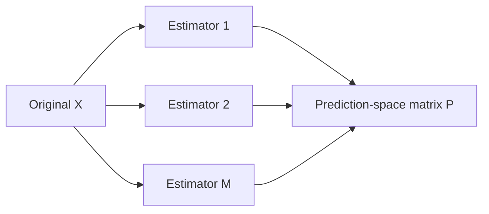
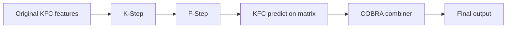

# Prediction Space

COBRA-style estimators in `kfc_procedure` do not have to compare observations
only in the original feature space.

They can first transform each observation into a vector of predictions produced
by an ensemble of base estimators:

\[
x
\longmapsto
\bigl(
f_1(x),
f_2(x),
\ldots,
f_M(x)
\bigr).
\]

The resulting matrix is the **prediction space**.

In the current source, prediction-space construction is shared by:

```text
GradientCOBRA
MixCOBRARegressor
CombinedClassifier
```

through utilities in:

```text
kfc_procedure/cobra/utils/resolve.py
```

especially:

```python
fit_estimators()
predict_estimators()
resolve_training_context()
```

---

## Why prediction space exists

Suppose the original feature matrix is:

\[
X
\in
\mathbb{R}^{n\times d}.
\]

After fitting \(M\) base estimators, the package constructs:

\[
P
=
\begin{bmatrix}
f_1(x_1) & f_2(x_1) & \cdots & f_M(x_1) \\
f_1(x_2) & f_2(x_2) & \cdots & f_M(x_2) \\
\vdots & \vdots & & \vdots \\
f_1(x_n) & f_2(x_n) & \cdots & f_M(x_n)
\end{bmatrix}.
\]

Therefore:

```text
original space:
    (n_samples, n_features)

prediction space:
    (n_samples, n_estimators)
```

The prediction-space columns are estimator outputs rather than original input
features.

---

## Construction pipeline



The package implements this through:

```python
predict_estimators(
    X,
    estimators,
    n_jobs=...,
)
```

which collects:

```python
est.predict(X)
```

from every fitted estimator and returns:

```python
np.column_stack(preds)
```

---

# Prediction-space shape

If there are:

```text
n
```

samples and:

```text
M
```

base estimators, then:

```python
prediction_space.shape == (
    n,
    M,
)
```

For example:

```python
predictions = np.array([
    [10.2, 10.5,  9.9],
    [18.1, 17.8, 18.4],
    [24.0, 24.3, 23.7],
])
```

has:

```text
3 samples
3 estimator predictions per sample
```

---

# Regression prediction space

For regression, each column normally contains a continuous prediction.

Example:

```text
             ridge     lasso      svr
sample 1      12.4      12.1      12.8
sample 2      20.7      20.4      21.0
sample 3       8.3       8.5       8.1
```

`GradientCOBRA` and `MixCOBRARegressor` use these prediction vectors when
computing similarity.

---

# Classification prediction space

For classification, `CombinedClassifier` uses **hard class predictions** from
its base estimators.

`predict_estimators()` calls:

```python
est.predict(X)
```

not:

```python
est.predict_proba(X)
```

So a prediction-space row might be:

```text
[0, 0, 1, 0]
```

rather than a concatenation of class-probability vectors.

This distinction is important when choosing a distance such as:

```text
hamming
```

for classification.

---

# Base-estimator fitting

The shared helper:

```python
fit_estimators()
```

supports estimator specifications as:

```text
string names
(name, params) tuples
pre-instantiated estimator objects
```

For each estimator it eventually calls:

```python
model.fit(
    X,
    y,
)
```

and returns the fitted estimator list.

Prediction space is then created by calling each fitted estimator's
`predict()` method.

---

# Standard training mode

The normal COBRA workflow starts from raw features.

For example:

```python
from kfc_procedure.cobra import GradientCOBRA

model = GradientCOBRA(
    random_state=42,
)

model.fit(
    X_train,
    y_train,
)
```

With:

```python
as_predictions=False
```

the training context contains two roles:

```text
X_k, y_k
    used to fit base estimators

X_l, y_l
    used to construct the aggregation / calibration prediction space
```

---

## Automatic split

When you do not provide `X_l` and `y_l`, the shared
`resolve_training_context()` function creates a splitter:

```python
SplitterFactory.create(
    "split_overlap",
    split_ratio=split_ratio,
    overlap=overlap,
    random_state=random_state,
)
```

The returned indices are then used to build:

```python
X_k
y_k
X_l
y_l
```

---

## Explicit calibration data

You can also provide:

```python
X_l
y_l
```

explicitly.

```python
model.fit(
    X_k,
    y_k,
    X_l=X_l,
    y_l=y_l,
)
```

The helper requires both to be present together.

Providing only one raises:

```text
Both 'X_l' and 'y_l' must be provided together.
```

---

# `as_predictions=True`

All three major COBRA estimators expose an `as_predictions` fit mode.

This tells the training-context resolver that the supplied `X` is already a
prediction matrix.

For:

```python
model.fit(
    P,
    y,
    as_predictions=True,
)
```

the current resolver returns:

```python
TrainingContext(
    X_k=None,
    y_k=None,
    X_l=np.asarray(P),
    y_l=np.asarray(y),
    as_predictions=True,
)
```

No raw-feature training subset is created.

---

## What this means

In prediction mode:

```text
X argument
    ↓
treated directly as prediction-space matrix
    ↓
stored as X_l_
```

and base-estimator fitting is skipped by the estimators that honor this mode.

This is the mechanism used by the KFC C-Step wrappers when they pass the F-Step
prediction matrix into COBRA components.

---

# GradientCOBRA prediction mode

`GradientCOBRA.fit()` contains:

```python
if not self.as_predictions_:
    self.estimators_ = self._fit_estimators(
        self.X_k_,
        self.y_k_,
    )

    prediction_space = self._load_predictions(
        self.X_l_,
    )
else:
    prediction_space = self.X_l_
```

So when:

```python
as_predictions=True
```

the supplied matrix is used directly as:

```text
prediction_space
```

and no internal base estimators are trained.

---

## GradientCOBRA stored representation

After constructing or accepting prediction space, GradientCOBRA computes:

```python
self.normalize_constant_
```

and stores the normalized prediction matrix:

```python
self.Y_l_norm_ = (
    prediction_space
    * self.normalize_constant_
)
```

It then computes the pairwise calibration distance matrix:

```python
self.distance_matrix_ = self.distance_.matrix(
    self.Y_l_norm_,
    self.Y_l_norm_,
)
```

So for GradientCOBRA:

```text
prediction matrix
    ↓
scalar normalization
    ↓
prediction-space distance matrix
    ↓
kernel
    ↓
weighted target aggregation
```

---

# GradientCOBRA normalization

The helper:

```python
compute_normalization_constant()
```

uses:

\[
c
=
\frac{s}
{\max |y| \, M},
\]

where:

- \(M\) is the number of prediction columns;
- `s` is the scale numerator.

GradientCOBRA calls it with:

```python
scale_factor=30.0
```

unless:

```python
norm_constant
```

is supplied.

Then:

\[
P_{\text{norm}}
=
cP.
\]

---

## Stored GradientCOBRA attributes

Useful fitted attributes include:

```text
X_k_
y_k_
X_l_
y_l_
as_predictions_
estimators_
normalize_constant_
Y_l_norm_
distance_matrix_
cv_folds_
bandwidth_
optimization_outputs_
global_mean_
```

When:

```python
as_predictions=True
```

the source does not create:

```python
estimators_
```

because the base-estimator fit branch is skipped.

---

# GradientCOBRA prediction

At prediction time:

```python
if self.as_predictions_:
    prediction_space = X
else:
    prediction_space = self._load_predictions(X)
```

So prediction mode is internally consistent for GradientCOBRA:

```python
model.fit(
    P_train,
    y_train,
    as_predictions=True,
)

y_pred = model.predict(
    P_test
)
```

Here `P_test` is treated directly as new prediction-space data.

---

# CombinedClassifier prediction mode

`CombinedClassifier.fit()` has a parallel branch:

```python
if not self.as_predictions_:
    self.classes_ = np.unique(
        self.y_k_
    )

    self.estimators_ = self._fit_estimators(
        self.X_k_,
        self.y_k_,
    )

    self.pred_l_ = self._load_predictions(
        self.X_l_
    )
else:
    self.classes_ = np.unique(
        self.y_l_
    )

    self.pred_l_ = self.X_l_
```

Thus:

```python
as_predictions=True
```

uses the supplied matrix directly as:

```python
pred_l_
```

---

## CombinedClassifier distance matrix

The fitted calibration prediction matrix is compared with itself:

```python
self.distance_matrix_ = (
    self.distance_.matrix(
        self.pred_l_,
        self.pred_l_,
    )
)
```

The default classification distance is:

```text
hamming
```

which is a natural fit for vectors of hard class predictions.

---

# CombinedClassifier prediction

At prediction time:

```python
if self.as_predictions_:
    preds_space = X
else:
    preds_space = self._load_predictions(X)
```

Then:

```python
distance_matrix = self.distance_.matrix(
    preds_space,
    self.pred_l_,
)
```

So prediction mode is also internally consistent for
`CombinedClassifier`:

```python
classifier.fit(
    P_train,
    y_train,
    as_predictions=True,
)

labels = classifier.predict(
    P_test
)
```

---

# KFC and prediction space

The KFC Procedure constructs its own prediction matrix in F-Step.

For new samples:

```python
clusters = model.kstep_.predict(
    X
)

P = model.fstep_.predict(
    X,
    clusters,
)
```

The C-Step wrappers for:

```text
gradientcobra
mixcobra
combined_classifier
```

fit their wrapped COBRA estimators with:

```python
as_predictions=True
```

so the F-Step matrix is intended to become the COBRA prediction-space
representation directly.

Conceptually:



---

# Prediction space in CombinedClassifier

With a KFC classifier, one F-Step row might be:

```text
[0, 1, 1, 0]
```

where the columns correspond to divergence-specific local classifier
predictions.

When passed to:

```text
combined_classifier
```

this row becomes a point in the wrapped `CombinedClassifier` prediction space.

The wrapped classifier compares that pattern with calibration patterns stored
in:

```python
pred_l_
```

---

# Prediction space in GradientCOBRA

With KFC regression, one row might be:

```text
[12.4, 12.8, 12.1, 12.5]
```

When passed to `GradientCOBRA` using:

```python
as_predictions=True
```

the row is treated as a four-dimensional prediction vector.

GradientCOBRA then applies its normalization, distance, kernel, and target
aggregation stages.

---

# MixCOBRA uses two spaces

`MixCOBRARegressor` differs from GradientCOBRA because its normal mode combines:

```text
input-space distance
prediction-space distance
```

The source describes the two spaces as:

```text
X_l_norm_
Y_l_norm_
```

where:

```python
self.X_l_norm_
```

is the normalized calibration input space and:

```python
self.Y_l_norm_
```

is the normalized estimator-prediction space.

---

## MixCOBRA two-parameter mode

By default:

```python
one_parameter=False
```

and the source computes:

```python
self.distance_matrix_x_
```

from:

```python
X_l_norm_
```

and:

```python
self.distance_matrix_y_
```

from:

```python
Y_l_norm_
```

The two-parameter adapter then combines them as:

\[
D_{\text{mix}}
=
\alpha D_X
+
\beta D_Y.
\]

This comes directly from:

```python
TwoParameterKernelAdapter.transform()
```

which returns:

```python
self.alpha * x
+ self.beta * y
```

---

# MixCOBRA one-parameter mode

With:

```python
one_parameter=True
```

the source concatenates the normalized input and prediction spaces:

```python
self.mix_features_ = np.column_stack([
    self.X_l_norm_,
    self.Y_l_norm_,
])
```

and computes one distance matrix on that concatenated representation.

A one-parameter kernel adapter then scales that distance as:

\[
D'
=
hD.
\]

---

# MixCOBRA normalization

MixCOBRA computes two scalar constants.

For the input side:

```python
self.normalize_constant_x_
```

using:

```python
scale_factor=5.0
```

and for the prediction side:

```python
self.normalize_constant_y_
```

using:

```python
scale_factor=50.0
```

Both also divide by the number of prediction columns through
`compute_normalization_constant()`.

The normalized spaces are:

```python
self.X_l_norm_ = (
    self.X_l_
    * self.normalize_constant_x_
)

self.Y_l_norm_ = (
    prediction_space
    * self.normalize_constant_y_
)
```

---

# Important MixCOBRA `as_predictions=True` behavior

The current `MixCOBRARegressor.fit()` accepts:

```python
as_predictions=True
```

and, like the other estimators, skips internal base-estimator fitting.

During fit:

```python
if not self.as_predictions_:
    self.estimators_ = ...
    prediction_space = ...
else:
    prediction_space = self.X_l_
```

However, the current `predict()` implementation does not branch on:

```python
self.as_predictions_
```

before generating prediction features.

It starts with:

```python
if pred_X is None:
    pred_X = self._load_predictions(X)
```

---

## Consequence

When the model was fitted with:

```python
as_predictions=True
```

the source did not create:

```python
self.estimators_
```

but `predict(X)` still tries to call:

```python
self._load_predictions(X)
```

when:

```python
pred_X is None
```

This means the current precomputed-prediction fit mode is not symmetrical with
the default prediction path in `MixCOBRARegressor`.

!!! warning "Current source limitation"

    `GradientCOBRA` and `CombinedClassifier` explicitly treat `X` as prediction
    space during `predict()` when `as_predictions_` is true.

    The current `MixCOBRARegressor.predict()` implementation does not perform
    that same branch.

    Code that relies on `MixCOBRARegressor(as_predictions=True)` should inspect
    this behavior carefully in the current source version.

---

# `pred_X` in MixCOBRA prediction

`MixCOBRARegressor.predict()` exposes:

```python
pred_X=None
```

as an optional argument.

When supplied, it bypasses:

```python
self._load_predictions(X)
```

and uses:

```python
pred_X
```

as the test prediction representation.

The method still separately uses:

```python
X
```

for the input-space representation:

```python
X_norm = (
    X
    * self.normalize_constant_x_
)

Y_norm = (
    pred_X
    * self.normalize_constant_y_
)
```

This matches MixCOBRA's two-space design in its normal feature-based mode.

---

# `pred_features` in training context

The shared `resolve_training_context()` function also has a:

```python
pred_features
```

argument.

Its branch currently returns:

```python
TrainingContext(
    X_k=np.asarray(X),
    y_k=np.asarray(y),
    X_l=pred_features,
    y_l=np.asarray(y),
    as_predictions=False,
)
```

when `pred_features` is supplied.

---

## Current MixCOBRA use of `pred_features`

`MixCOBRARegressor.fit()` passes its:

```python
pred_features
```

argument into `resolve_training_context()`.

But after receiving the context, the current fit code still does:

```python
if not self.as_predictions_:
    self.estimators_ = self._fit_estimators(
        self.X_k_,
        self.y_k_,
    )

    prediction_space = self._load_predictions(
        self.X_l_
    )
```

In the `pred_features` branch:

```python
X_l_
```

has been set to:

```python
pred_features
```

rather than raw calibration features.

Therefore the current fit implementation feeds `pred_features` into the fitted
base estimators instead of directly assigning it to `prediction_space`.

!!! warning "Current source behavior"

    The `pred_features` argument is documented as precomputed model
    predictions, but the current training path does not directly use it as the
    prediction matrix.

    This page documents the source as implemented rather than assuming the
    intended behavior.

---

# Prediction-space distances

Once a prediction matrix is available, COBRA components use a registered
distance object implementing:

```python
distance.matrix(
    x,
    y,
)
```

The common interface returns:

```text
(n_samples_x, n_samples_y)
```

pairwise distances.

Built-in distance modules include:

```text
euclidean
manhattan
minkowski
cosine
hamming
```

The detailed behavior belongs to:

[Distances](distances.md)

---

# Calibration-to-calibration distance

During fitting, prediction-space models usually compute a square distance
matrix.

For example, GradientCOBRA:

```python
self.distance_matrix_ = self.distance_.matrix(
    self.Y_l_norm_,
    self.Y_l_norm_,
)
```

and CombinedClassifier:

```python
self.distance_matrix_ = self.distance_.matrix(
    self.pred_l_,
    self.pred_l_,
)
```

If there are \(n_l\) calibration samples, the result has shape:

```text
(n_l, n_l)
```

---

# Query-to-calibration distance

At prediction time, a new prediction matrix is compared against the fitted
calibration representation.

For GradientCOBRA:

```python
distance_matrix = self.distance_.matrix(
    Y_norm,
    self.Y_l_norm_,
)
```

For CombinedClassifier:

```python
distance_matrix = self.distance_.matrix(
    preds_space,
    self.pred_l_,
)
```

So with:

```text
q test samples
n_l calibration samples
```

the distance matrix has shape:

```text
(q, n_l)
```

---

# Kernel scaling

Prediction-space distance is not used directly as an aggregation weight.

The distance matrix first passes through a kernel adapter.

For GradientCOBRA and CombinedClassifier, the one-parameter adapter performs:

\[
D'
=
hD.
\]

The source implements this as:

```python
return self.bandwidth * distances[0]
```

Then the selected kernel converts the adapted distance into similarities.

For the default RBF kernel, see:

[Kernels](kernels.md)

---

# Target aggregation

After the kernel produces a weight matrix:

```python
K
```

regression estimators aggregate calibration targets using a registered
aggregator.

The default regression aggregator is:

```text
weighted_mean
```

which computes:

\[
\widehat y
=
\frac{\sum_i w_i y_i}
{\sum_i w_i}.
\]

If the weight sum is effectively zero, the aggregator uses a fallback value.

GradientCOBRA supplies:

```python
global_mean_
```

during final prediction.

---

# Classification aggregation

`CombinedClassifier` uses:

```text
weighted_vote
```

by default.

For hard prediction:

```python
aggregate(
    values=self.y_l_,
    weights=w,
)
```

computes weighted class scores and returns the class with the largest score.

---

## Probability caveat in current `weighted_vote`

The current:

```python
WeightedVoteAggregator.aggregate_proba()
```

constructs one-hot class indicators and computes:

```python
one_hot.mean(
    axis=0
)
```

It does not use the supplied `weights` argument in that method.

Therefore `CombinedClassifier.predict_proba()` currently returns unweighted
class frequencies over the calibration labels passed to `aggregate_proba()`,
rather than probabilities derived from the kernel weights.

!!! warning

    This behavior applies to the current source implementation of
    `aggregate_proba()`.

    Hard-label prediction uses the supplied weights correctly through
    `aggregate()`.

---

# Prediction space and cross-validation

COBRA hyperparameters are optimized using folds over the calibration dataset.

For GradientCOBRA, the already-computed prediction-space distance matrix is
adapted for a candidate bandwidth:

```python
D = self.adapter_.transform(
    self.distance_matrix_
)

K = self.kernel_(D)
```

The code then extracts:

```python
K_val_train
```

for each fold and aggregates training-fold targets to predict the validation
fold.

This lets bandwidth optimization happen within the stored prediction-space
geometry.

---

# Prediction space and data leakage

The package's normal mode separates:

```text
base-estimator fitting data
aggregation/calibration data
```

through `X_k/y_k` and `X_l/y_l`.

The prediction matrix used for COBRA aggregation is generated on the
calibration side after base estimators were fitted on the training side.

That source-level structure is why `resolve_training_context()` carries both
sets separately.

---

# Inspect prediction space in GradientCOBRA

After fitting:

```python
model = GradientCOBRA(
    random_state=42,
)

model.fit(
    X_train,
    y_train,
)
```

inspect:

```python
print(
    model.Y_l_norm_.shape
)

print(
    model.distance_matrix_.shape
)

print(
    model.normalize_constant_
)
```

To inspect the unnormalized calibration predictions in standard mode, recreate
them through the fitted estimator pool:

```python
P_l = model._load_predictions(
    model.X_l_
)

print(
    P_l.shape
)
```

---

# Inspect prediction space in CombinedClassifier

After fitting:

```python
classifier = CombinedClassifier(
    random_state=42,
)

classifier.fit(
    X_train,
    y_train,
)
```

the unnormalized calibration prediction space is stored directly as:

```python
classifier.pred_l_
```

Inspect:

```python
print(
    classifier.pred_l_.shape
)

print(
    classifier.pred_l_[:5]
)
```

and:

```python
print(
    classifier.distance_matrix_.shape
)
```

---

# Inspect MixCOBRA spaces

In normal feature mode:

```python
model = MixCOBRARegressor(
    random_state=42,
)

model.fit(
    X_train,
    y_train,
)
```

inspect:

```python
print(
    model.X_l_norm_.shape
)

print(
    model.Y_l_norm_.shape
)
```

For two-parameter mode:

```python
print(
    model.distance_matrix_x_.shape
)

print(
    model.distance_matrix_y_.shape
)
```

For one-parameter mode:

```python
print(
    model.mix_features_.shape
)

print(
    model.distance_matrix_mix_.shape
)
```

---

# Precomputed prediction example: GradientCOBRA

Suppose another pipeline already created:

```python
P_train
P_test
```

with one column per external model.

You can fit:

```python
from kfc_procedure.cobra import GradientCOBRA

cobra = GradientCOBRA(
    random_state=42,
)

cobra.fit(
    P_train,
    y_train,
    as_predictions=True,
)

y_pred = cobra.predict(
    P_test
)
```

In this mode:

```text
P_train
```

becomes the calibration prediction space directly.

---

# Precomputed prediction example: CombinedClassifier

```python
from kfc_procedure.cobra import CombinedClassifier

classifier = CombinedClassifier(
    distance="hamming",
    random_state=42,
)

classifier.fit(
    P_train,
    y_train,
    as_predictions=True,
)

y_pred = classifier.predict(
    P_test
)
```

The matrices should contain hard class predictions because the current
classification prediction space is based on estimator `predict()` outputs.

---

# KFC C-Step example

The C-Step wrapper performs the same conceptual operation automatically.

For example, `GradientCOBRACombiner.fit()` calls:

```python
self.cobra.fit(
    X,
    y,
    as_predictions=True,
)
```

where `X` is already the KFC F-Step prediction matrix.

Similarly, `CobraClassifierCombiner` calls:

```python
self.cobra.fit(
    X,
    y,
    as_predictions=True,
)
```

for `CombinedClassifier`.

---

# What prediction space is not

In the current source, prediction space does **not** mean:

```text
hidden neural-network embeddings
class-probability vectors by default
K-Step centroids
original input features
C-Step coefficients
```

It specifically refers to a matrix assembled from estimator predictions, or a
matrix explicitly supplied through `as_predictions=True`.

---

# Prediction-space column order

When prediction space is generated internally, column order follows the order
of the fitted estimator list:

```python
self.estimators_
```

because:

```python
preds = [
    est.predict(X)
    for est in estimators
]

np.column_stack(preds)
```

preserves that order.

This matters when interpreting distance geometry because every column is one
coordinate in prediction space.

---

# Default GradientCOBRA estimator pool

When no estimators are supplied, `GradientCOBRA` currently uses:

```text
linear_regression
ridge_cv
lasso_cv
k_neighbors_regressor
random_forest_regressor
svr
```

Therefore its normal prediction space has six columns, assuming all defaults
are successfully resolved.

---

# Default MixCOBRA estimator pool

The current MixCOBRA default is:

```text
linear_regression
ridge
lasso
k_neighbors_regressor
random_forest_regressor
svr
```

This differs slightly from GradientCOBRA, which uses:

```text
ridge_cv
lasso_cv
```

instead of:

```text
ridge
lasso
```

---

# Default CombinedClassifier estimator pool

When no classifier estimators are supplied:

```text
logistic_regression
decision_tree_classifier
svc
k_neighbors_classifier
```

are fitted.

The resulting prediction-space matrix therefore has four hard-label columns by
default.

---

# Parallel prediction generation

`predict_estimators()` supports:

```python
n_jobs
```

If:

```python
n_jobs == 1
```

predictions are generated sequentially.

Otherwise the source uses:

```python
joblib.Parallel(
    n_jobs=n_jobs,
    backend="loky",
)
```

and then column-stacks the returned prediction arrays.

---

# Debugging prediction space

## Check the matrix dimension

```python
print(
    prediction_space.ndim
)
```

Expected:

```text
2
```

---

## Check row alignment

The prediction matrix and target vector must describe the same samples.

```python
print(
    prediction_space.shape[0]
)

print(
    len(y)
)
```

These should match when using:

```python
as_predictions=True
```

because `resolve_training_context()` begins with:

```python
check_X_y(
    X,
    y,
)
```

---

## Check column count

```python
print(
    prediction_space.shape[1]
)
```

This is the number of prediction-space coordinates.

For internally generated space, it should correspond to the number of fitted
base estimators.

---

## Check finite regression predictions

```python
import numpy as np

print(
    np.isfinite(
        prediction_space
    ).all()
)
```

Non-finite values can propagate into distance calculations.

---

## Inspect stored calibration representation

GradientCOBRA:

```python
model.Y_l_norm_
```

CombinedClassifier:

```python
model.pred_l_
```

MixCOBRA:

```python
model.Y_l_norm_
```

---

# Quick comparison

| Estimator | Prediction-space attribute | Normalized? | `as_predictions` predict path |
| --- | --- | :---: | --- |
| `GradientCOBRA` | `Y_l_norm_` | Yes | treats new `X` as prediction space |
| `CombinedClassifier` | `pred_l_` | No | treats new `X` as prediction space |
| `MixCOBRARegressor` | `Y_l_norm_` | Yes | current `predict()` still expects/derives `pred_X` |

---

# Quick reference

| Concept | Current source behavior |
| --- | --- |
| prediction generation | `est.predict(X)` |
| matrix construction | `np.column_stack(preds)` |
| standard mode | fit estimators on `X_k`, predict on `X_l` |
| explicit calibration set | supported with `X_l`, `y_l` |
| precomputed mode | `as_predictions=True` |
| GradientCOBRA scaling | scalar normalization, scale factor `30.0` |
| CombinedClassifier scaling | no prediction normalization before distance |
| MixCOBRA prediction scaling | separate input/prediction constants |
| Gradient adapter | one-parameter distance scaling |
| CombinedClassifier adapter | one-parameter distance scaling |
| MixCOBRA adapter | one- or two-parameter |
| Mix two-space fusion | `alpha * D_X + beta * D_Y` |
| classification space | hard `predict()` labels |
| default classifier distance | `hamming` |

---

# Mental model

!!! quote ""

    **Prediction space replaces “How close are these samples in their original
    features?” with “How similarly do the model experts predict these
    samples?”**

\[
\boxed{
x
\rightarrow
\begin{bmatrix}
f_1(x) &
f_2(x) &
\cdots &
f_M(x)
\end{bmatrix}
\rightarrow
\text{distance}
\rightarrow
\text{kernel}
\rightarrow
\text{aggregation}
}
\]

GradientCOBRA works directly in that prediction representation,
CombinedClassifier applies the same idea to hard class predictions, and
MixCOBRA combines prediction-space geometry with an input-space geometry.

