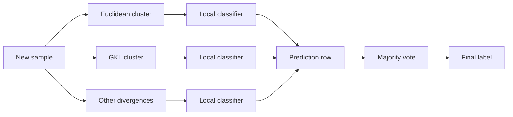

# Majority Vote

`MajorityVoteCombiner` is the simplest classification consensus strategy in
the KFC C-Step.

It combines the divergence-specific class predictions produced by the F-Step
using **hard voting**:

\[
\boxed{
\text{F-Step class predictions}
\rightarrow
\text{row-wise majority vote}
\rightarrow
\text{final class label}
}
\]

The implementation is registered under:

```text
majority_vote
```

and lives in:

```text
kfc_procedure/core/combiner/classification/majority_vote.py
```

The source describes it as:

```text
Hard voting ensemble combiner.

Each sample is assigned the most frequent label among base models.
```

---

## Core idea

Suppose the F-Step produces one class prediction per divergence.

For one observation:

```text
Euclidean     -> 1
GKL           -> 1
Logistic      -> 0
Itakura-Saito -> 1
```

The prediction row is:

```text
[1, 1, 0, 1]
```

and the majority-vote result is:

```text
1
```

Mathematically, for prediction row

\[
(c_1,\ldots,c_M),
\]

the combiner returns the most frequently occurring label.

---

## Input matrix

The combiner expects a two-dimensional prediction matrix:

\[
P
\in
\mathbb{R}^{n\times M},
\]

where:

- \(n\) is the number of observations;
- \(M\) is the number of prediction columns.

In KFC, \(M\) is normally the number of configured divergences.

For example:

```text
             euclidean      gkl      logistic      is
sample 1          0           0           1          0
sample 2          1           1           1          1
sample 3          2           1           2          2
```

The combiner applies voting independently to each row.

---

# Implementation

The source converts the input with:

```python
X = np.asarray(X)
```

then validates:

```python
if X.ndim != 2:
    raise ValueError(
        f"Expected 2D array, got {X.shape}"
    )
```

It allocates one output value per sample:

```python
outputs = np.empty(
    n_samples,
    dtype=object,
)
```

Then, for each row:

```python
row = X[i]

outputs[i] = Counter(
    row
).most_common(1)[0][0]
```

The complete behavior is therefore a direct row-wise mode calculation.

---

# Stateless fitting

`MajorityVoteCombiner` does not learn parameters.

Its `fit()` method is:

```python
def fit(
    self,
    X,
    y=None,
):
    return self
```

The target values are not used.

So:

```python
combiner.fit(
    P_train,
    y_train,
)
```

does not change the voting rule.

This differs from learned classification combiners such as:

```text
stacking_classifier
combined_classifier
```

---

# Direct example

```python
import numpy as np

from kfc_procedure.core.combiner.classification import (
    MajorityVoteCombiner,
)


P = np.array([
    [0, 0, 1],
    [1, 1, 1],
    [2, 1, 2],
])


combiner = MajorityVoteCombiner()

combiner.fit(P)

prediction = combiner.predict(P)

print(
    prediction
)
```

The result is conceptually:

```text
[0, 1, 2]
```

---

# `predict()` and `combine()`

`MajorityVoteCombiner` inherits:

```python
predict()
```

from:

```python
BaseCombiner
```

The base implementation is:

```python
def predict(
    self,
    X,
):
    return self.combine(X)
```

Therefore:

```python
combiner.predict(P)
```

and:

```python
combiner.combine(P)
```

use exactly the same majority-vote logic.

---

# Tie behavior

The current source does not implement a separate tie-breaking rule.

It uses:

```python
Counter(
    row
).most_common(1)[0][0]
```

directly.

For example, a row such as:

```text
[0, 1]
```

contains a tie.

The result follows the behavior of Python's:

```python
collections.Counter.most_common()
```

for equally frequent elements.

!!! important "No KFC-specific tie policy"

    The package does not define a separate rule such as:

    ```text
    smallest class wins
    first divergence wins
    random tie-breaking
    confidence-weighted tie-breaking
    ```

    If your application needs an explicit tie policy, implement a custom
    combiner.

---

# Output dtype

The combiner creates:

```python
np.empty(
    n_samples,
    dtype=object,
)
```

for its result.

That means the combiner itself can represent labels such as:

```text
0
1
2
```

or:

```text
"class_a"
"class_b"
```

provided those labels reach the combiner successfully.

---

# Important upstream label limitation

Although `MajorityVoteCombiner` itself uses an object-dtype output array, the
current F-Step initializes each divergence prediction vector with:

```python
np.full(
    X.shape[0],
    np.nan,
)
```

which produces a floating-point array by default.

Therefore string-valued local classifier predictions may fail during F-Step
assignment before they ever reach the majority-vote combiner.

!!! warning "Current full-pipeline behavior"

    Numeric class labels are the safest choice with the current KFC
    classification pipeline.

    The majority-vote combiner is more permissive than the upstream F-Step
    prediction buffer.

---

# KFC usage

Conceptually, the registered KFC configuration is:

```python
from kfc_procedure import KFCClassifier

model = KFCClassifier(
    divergences=[
        "euclidean",
        "gkl",
    ],
    local_model="logistic_regression",
    combiner="majority_vote",
    random_state=42,
)
```

However, the current C-Step source has a constructor-parameter issue for this
string path.

---

# Current C-Step `random_state` issue

When C-Step receives a string combiner, it copies:

```python
combiner_params
```

and then injects:

```python
random_state=self.random_state
```

if the key is not already present.

The relevant logic is:

```python
params = dict(
    self.combiner_params
)

if "random_state" not in params:
    params["random_state"] = self.random_state

return CombinerFactory.create(
    name,
    **params
)
```

But `MajorityVoteCombiner` defines no constructor at all.

It therefore inherits the default constructor behavior and does not accept:

```python
random_state
```

as a keyword argument.

---

## Result

A string-based C-Step can attempt the equivalent of:

```python
MajorityVoteCombiner(
    random_state=42
)
```

or:

```python
MajorityVoteCombiner(
    random_state=None
)
```

and raise a `TypeError`.

!!! warning "Current source limitation"

    In the current source version, the string identifier:

    ```text
    majority_vote
    ```

    is affected by C-Step's automatic `random_state` injection.

    This is a constructor-forwarding issue, not a limitation of the voting
    algorithm.

---

# Current workaround

Pass a pre-instantiated combiner object:

```python
from kfc_procedure import KFCClassifier

from kfc_procedure.core.combiner.classification import (
    MajorityVoteCombiner,
)


model = KFCClassifier(
    divergences=[
        "euclidean",
        "gkl",
    ],
    local_model="logistic_regression",
    combiner=MajorityVoteCombiner(),
    random_state=42,
)
```

For non-string combiners, C-Step does:

```python
if not isinstance(
    self.combiner,
    str,
):
    return self.combiner
```

so no constructor arguments are injected.

---

# How KFC produces the vote matrix

KFC first fits K-Step and F-Step using the internal K/F subset.

For new data:

```python
clusters = model.kstep_.predict(
    X_test
)
```

produces one cluster assignment per divergence.

Then:

```python
P = model.fstep_.predict(
    X_test,
    clusters,
)
```

produces one class prediction per divergence.

Finally:

```python
y_pred = model.cstep_.predict(
    P
)
```

runs majority voting.

---

# Prediction flow



The majority combiner does not know which cluster produced each label.

It receives only the class-prediction row.

---

# Inspect the vote inputs

After fitting:

```python
clusters = model.kstep_.predict(
    X_test
)

P = model.fstep_.predict(
    X_test,
    clusters,
)

print(
    P[:10]
)
```

This shows the exact rows sent to majority voting.

---

## Inspect divergence column names

The column order can be recovered with:

```python
divergence_names = list(
    model.fstep_.models_.keys()
)

print(
    divergence_names
)
```

Then inspect one sample:

```python
row = P[0]

for divergence, label in zip(
    divergence_names,
    row,
):
    print(
        divergence,
        label,
    )
```

---

# Inspect final majority decisions

```python
final = model.cstep_.predict(
    P
)

for i in range(
    min(
        10,
        len(P),
    )
):
    print(
        P[i],
        "->",
        final[i],
    )
```

This is one of the easiest ways to understand the C-Step behavior for a fitted
classification model.

---

# One divergence

If KFC uses:

```python
divergences=[
    "euclidean"
]
```

then the prediction matrix has one column:

```text
(n_samples, 1)
```

For a row such as:

```text
[1]
```

the majority vote is necessarily:

```text
1
```

So with one divergence, `MajorityVoteCombiner` does not alter the F-Step
prediction.

---

# Two divergences

With two divergences:

```text
[0, 0]
```

has an unambiguous majority.

But:

```text
[0, 1]
```

is a tie.

Because no explicit KFC tie rule is implemented, the output follows
`Counter.most_common()` behavior.

If ties are common in a two-divergence configuration, consider whether an
explicit custom rule is needed.

---

# Odd vs even numbers of prediction columns

The package does not enforce an odd number of divergences.

An odd number can reduce the frequency of simple two-class ties, but KFC does
not automatically add, remove, or reorder divergences for voting purposes.

Likewise, multiclass voting can still produce ties even with an odd number of
prediction columns.

This is a property of the prediction pattern, not a special check in the
combiner.

---

# Majority vote does not use confidence

The combiner receives hard class labels only.

It does not consume:

```text
class probabilities
decision scores
distance to cluster center
local classifier confidence
kernel weights
```

The source simply counts labels in each row.

So these two rows are identical to the combiner:

```text
classifier A predicts class 1 with probability 0.51
classifier B predicts class 1 with probability 0.99
```

if both enter the C-Step as:

```text
1
```

---

# No learned divergence weights

Unlike a learned meta-classifier, majority vote gives no trainable importance
parameter to one divergence over another.

Each prediction occupies one position in the row and contributes one vote.

Conceptually:

\[
\text{vote weight per column} = 1.
\]

There is no fitted coefficient vector.

---

# No target use during C-Step fitting

Even though `CStep.fit()` calls:

```python
strategy.fit(
    X,
    y,
)
```

the majority-vote implementation ignores `y`.

So the C-Step target labels do not modify the voting rule.

---

# No `predict_proba()`

`MajorityVoteCombiner` implements only:

```python
fit()
combine()
```

and inherits:

```python
predict()
```

from `BaseCombiner`.

It does not implement:

```python
predict_proba()
```

Therefore:

```python
CStep.predict_proba()
```

cannot delegate probability prediction to this strategy.

---

## C-Step behavior

For a classification C-Step:

```python
cstep.predict_proba(P)
```

checks:

```python
hasattr(
    self.strategy_,
    "predict_proba"
)
```

For `MajorityVoteCombiner`, this is false.

The C-Step raises an `AttributeError` indicating that the strategy does not
support probability prediction.

---

# Majority vote vs stacking classifier

The two strategies use the same kind of F-Step input matrix but process it very
differently.

```text
majority_vote
    prediction row
        ↓
    count labels
        ↓
    most frequent label
```

versus:

```text
stacking_classifier
    prediction row
        ↓
    fitted meta-classifier
        ↓
    learned final label
```

Majority vote is stateless.

Stacking is supervised and can learn different relationships between
prediction columns.

See:

[Stacking](stacking.md)

---

# Majority vote vs CombinedClassifier

`CombinedClassifier` is also learned.

Its KFC wrapper uses the F-Step matrix as prediction-space input and applies
distance/kernel-based consensus.

Conceptually:

```text
majority_vote
    row-wise class counts
```

versus:

```text
combined_classifier
    compare prediction vectors
        ↓
    distance
        ↓
    kernel weighting
        ↓
    weighted class consensus
```

For the full algorithm, see:

[CombinedClassifier](../../getting-started/concepts/combined-classifier.md)

---

# Majority vote with multiclass labels

The source makes no binary-only assumption.

For example:

```text
[2, 1, 2, 2]
```

produces:

```text
2
```

and:

```text
[0, 1, 2, 2, 2]
```

also produces:

```text
2
```

The only requirement at the combiner level is that labels be countable by
`Counter`.

---

# Direct string-label example

The combiner itself can handle object labels:

```python
import numpy as np

from kfc_procedure.core.combiner.classification import (
    MajorityVoteCombiner,
)


P = np.array(
    [
        ["cat", "cat", "dog"],
        ["dog", "dog", "cat"],
    ],
    dtype=object,
)

combiner = MajorityVoteCombiner()

prediction = combiner.predict(P)

print(
    prediction
)
```

Conceptually:

```text
["cat", "dog"]
```

Again, this demonstrates the combiner itself; the current full F-Step pipeline
has the separate string-label buffer caveat described earlier.

---

# Custom tie policy

If you need explicit tie handling, subclass `BaseCombiner`.

For example:

```python
import numpy as np
from collections import Counter

from kfc_procedure.core.combiner.base import (
    BaseCombiner,
)


class SmallestLabelVote(
    BaseCombiner
):

    def fit(
        self,
        X,
        y=None,
    ):
        return self

    def combine(
        self,
        X,
    ):
        X = np.asarray(X)

        output = np.empty(
            len(X),
            dtype=object,
        )

        for i, row in enumerate(X):
            counts = Counter(row)

            highest = max(
                counts.values()
            )

            tied = [
                label
                for label, count
                in counts.items()
                if count == highest
            ]

            output[i] = min(tied)

        return output
```

This example uses an explicit smallest-label rule rather than relying on
`Counter.most_common()` tie behavior.

---

# Register a custom vote combiner

To use a custom strategy by name:

```python
from kfc_procedure.core.combiner import (
    CombinerFactory,
)


@CombinerFactory.register(
    "smallest_label_vote",
    categories={"classification"},
)
class SmallestLabelVote(
    BaseCombiner
):

    def __init__(
        self,
        random_state=None,
    ):
        self.random_state = random_state

    ...
```

The `random_state` constructor parameter is included because the current C-Step
injects that keyword into all string-based combiner construction.

---

# Debugging majority vote

## 1. Check F-Step matrix shape

```python
print(
    P.shape
)
```

Expected:

```text
(n_samples, n_divergences)
```

---

## 2. Inspect rows directly

```python
print(
    P[:10]
)
```

---

## 3. Check divergence order

```python
print(
    list(
        model.fstep_.models_.keys()
    )
)
```

---

## 4. Compare manual counts

```python
from collections import Counter

row = P[0]

print(
    Counter(row)
)

print(
    Counter(row).most_common(1)
)
```

---

## 5. Compare with C-Step output

```python
print(
    model.cstep_.predict(
        P[:1]
    )
)
```

---

## 6. Check constructor error

If the error contains:

```text
unexpected keyword argument 'random_state'
```

and the configured string is:

```text
majority_vote
```

use:

```python
combiner=MajorityVoteCombiner()
```

with the current source version.

---

# Quick reference

| Property | Current behavior |
| --- | --- |
| Registry name | `majority_vote` |
| Task | classification |
| Learning | none |
| Uses `y` during fit | No |
| Input | 2D class-prediction matrix |
| Aggregation | row-wise mode |
| Implementation | `Counter(row).most_common(1)[0][0]` |
| Explicit tie policy | No |
| Output dtype | `object` |
| `predict_proba()` | No |
| Learned coefficients | none |
| Current string KFC path | affected by C-Step `random_state` injection |

---

# Mental model

!!! quote ""

    **Majority vote treats every divergence prediction as one hard vote and
    returns the label that appears most often in the row.**

\[
\boxed{
[c_1,c_2,\ldots,c_M]
\rightarrow
\operatorname{mode}
\rightarrow
\widehat c
}
\]

It is the simplest classification consensus rule in the current source:
stateless, unweighted, and based only on hard labels.

