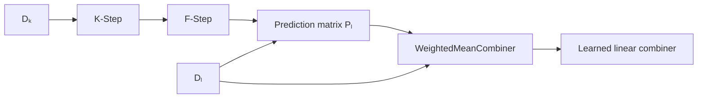

# Weighted Mean

`WeightedMeanCombiner` is a supervised regression combiner used by the KFC
C-Step.

It learns a linear relationship between the F-Step prediction matrix and the
true regression target.

The implementation is registered under:

```text
weighted_mean
```

and lives in:

```text
kfc_procedure/core/combiner/regression/weighted_mean.py
```

The source describes it as:

```text
Weighted mean combiner (regression).

Learns optimal linear weights using Ordinary Least Squares (OLS).
```

---

## Core idea

Assume the F-Step produces a prediction matrix

\[
X
\in
\mathbb{R}^{n\times K},
\]

where:

- \(n\) is the number of observations;
- \(K\) is the number of prediction columns.

In KFC, those columns correspond to divergence-specific prediction families.

The source models the target as

\[
y
\approx
Xw,
\]

where:

\[
w
\in
\mathbb{R}^{K}
\]

contains the learned coefficients.

Conceptually:

```text
F-Step predictions
        │
        ▼
┌──────────────────────────────┐
│ euclidean   gkl   logistic   │
├──────────────────────────────┤
│   12.4      12.8     12.1    │
│   20.7      21.0     20.4    │
│    8.3       8.1      8.5    │
└──────────────────────────────┘
        │
        ▼
LinearRegression
        │
        ▼
learned coefficients
        │
        ▼
final regression prediction
```

---

## Constructor

The current implementation is:

```python
WeightedMeanCombiner(
    fit_intercept=False,
)
```

The constructor creates:

```python
self.model = LinearRegression(
    fit_intercept=fit_intercept
)
```

So the only combiner-specific constructor parameter is:

```text
fit_intercept
```

with default:

```python
False
```

---

## Default model

With the default:

```python
fit_intercept=False
```

the learned rule is approximately:

\[
\widehat y
=
\sum_{k=1}^{K}w_kX_k.
\]

If:

```python
fit_intercept=True
```

then the model becomes:

\[
\widehat y
=
b
+
\sum_{k=1}^{K}w_kX_k.
\]

---

# Important: this is not a constrained weighted average

The name `weighted_mean` can suggest a convex weighted average, but the current
source does not impose such constraints.

The learned coefficients are produced by ordinary:

```python
LinearRegression
```

and are not constrained to satisfy:

\[
w_k \ge 0
\]

or:

\[
\sum_{k=1}^{K}w_k = 1.
\]

Therefore coefficients may be:

```text
negative
greater than one
or sum to a value other than one
```

A more precise description of the current implementation is:

```text
OLS linear combiner over F-Step prediction columns
```

rather than a mathematically constrained weighted mean.

---

# Fit behavior

The implementation is:

```python
def fit(
    self,
    X,
    y,
):
    X = np.asarray(X)

    if X.ndim != 2:
        raise ValueError(
            f"Expected 2D array, got {X.shape}"
        )

    self.model.fit(
        X,
        y,
    )

    return self
```

There are three important behaviors here:

1. input is converted with `np.asarray()`;
2. `X` must be two-dimensional;
3. the internal `LinearRegression` is fitted directly on `X` and `y`.

---

## Required input shape

The expected shape is:

```text
(n_samples, n_prediction_columns)
```

In KFC:

```text
(n_samples, n_divergences)
```

For example, with four divergences:

```python
X.shape == (
    n_samples,
    4,
)
```

---

## Invalid one-dimensional input

This is invalid:

```python
X.shape == (
    n_samples,
)
```

because the source explicitly checks:

```python
X.ndim != 2
```

and raises:

```text
ValueError:
Expected 2D array, got ...
```

Even if you have only one prediction source, the matrix should still have
shape:

```text
(n_samples, 1)
```

rather than:

```text
(n_samples,)
```

---

# Prediction behavior

`WeightedMeanCombiner.combine()` is:

```python
def combine(
    self,
    X,
):
    X = np.asarray(X)

    return self.model.predict(X)
```

Because `BaseCombiner.predict()` delegates to:

```python
self.combine(X)
```

both of these are equivalent:

```python
combiner.combine(P_test)
```

and:

```python
combiner.predict(P_test)
```

---

# Direct example

```python
import numpy as np

from kfc_procedure.core.combiner.regression import (
    WeightedMeanCombiner,
)


P_train = np.array([
    [10.0, 10.5,  9.8],
    [12.0, 11.8, 12.3],
    [18.0, 18.4, 17.9],
    [25.0, 24.7, 25.2],
])

y_train = np.array([
    10.2,
    12.1,
    18.3,
    25.0,
])


combiner = WeightedMeanCombiner(
    fit_intercept=False,
)

combiner.fit(
    P_train,
    y_train,
)


P_test = np.array([
    [14.0, 14.2, 13.9],
    [20.0, 19.8, 20.3],
])

y_pred = combiner.predict(
    P_test
)

print(
    y_pred
)
```

---

# Inspect the learned coefficients

The fitted scikit-learn model is available at:

```python
combiner.model
```

The learned coefficients are:

```python
combiner.model.coef_
```

For example:

```python
print(
    combiner.model.coef_
)
```

If there are three prediction columns, the shape is typically:

```text
(3,)
```

---

## Inspect the intercept

```python
print(
    combiner.model.intercept_
)
```

With:

```python
fit_intercept=False
```

scikit-learn's fitted intercept is effectively zero.

With:

```python
fit_intercept=True
```

the model estimates an intercept from the training data.

---

# Interpreting coefficients

Suppose the F-Step column order is:

```text
euclidean
gkl
logistic
```

and the learned coefficients are:

```python
[
    0.50,
    -0.20,
    0.90,
]
```

With no intercept, the learned aggregation rule is:

\[
\widehat y
=
0.50p_{\text{euclidean}}
-
0.20p_{\text{gkl}}
+
0.90p_{\text{logistic}}.
\]

This example shows why the implementation should not be interpreted as a
convex average.

---

# KFC prediction-column order

The F-Step prediction matrix is ordered according to:

```python
model.fstep_.models_
```

You can inspect the column names with:

```python
divergence_names = list(
    model.fstep_.models_.keys()
)

print(
    divergence_names
)
```

Then pair them with the learned coefficients:

```python
weights = model.cstep_.strategy_.model.coef_

for name, weight in zip(
    divergence_names,
    weights,
):
    print(
        name,
        weight,
    )
```

This is the recommended way to interpret which divergence-specific predictions
receive positive or negative linear coefficients.

---

# Using an intercept

To fit an intercept:

```python
combiner = WeightedMeanCombiner(
    fit_intercept=True,
)
```

Then the model is:

\[
\widehat y
=
b
+
Xw.
\]

Inspect:

```python
print(
    combiner.model.intercept_
)
```

and:

```python
print(
    combiner.model.coef_
)
```

---

# KFC integration

Conceptually, the registry name is:

```text
weighted_mean
```

and the intended KFC configuration is:

```python
from kfc_procedure import KFCRegressor

model = KFCRegressor(
    divergences=[
        "euclidean",
        "gkl",
    ],
    local_model="ridge",
    combiner="weighted_mean",
    combiner_params={
        "fit_intercept": False,
    },
)
```

However, the current C-Step implementation introduces an important constructor
compatibility issue.

---

# Current C-Step `random_state` issue

When C-Step resolves a string combiner, the source does:

```python
params = dict(
    self.combiner_params
)

if "random_state" not in params:
    params["random_state"] = self.random_state
```

and then:

```python
CombinerFactory.create(
    name,
    **params
)
```

That means a string-based `weighted_mean` configuration is constructed
conceptually as:

```python
WeightedMeanCombiner(
    fit_intercept=False,
    random_state=...,
)
```

But the actual constructor is only:

```python
def __init__(
    self,
    fit_intercept=False,
):
    ...
```

It does not accept:

```python
random_state
```

---

## Result

The current string-based KFC path can raise:

```text
TypeError:
WeightedMeanCombiner.__init__() got an unexpected keyword argument 'random_state'
```

This can happen even if the forwarded value is:

```python
None
```

because the unsupported keyword is still present.

!!! warning "Current source limitation"

    With the current source version, `weighted_mean` is affected by C-Step's
    unconditional `random_state` parameter injection.

    This is an implementation issue in C-Step parameter forwarding, not an
    issue with `WeightedMeanCombiner` itself.

---

# Current workaround

Pass a pre-instantiated combiner object instead of the string name.

```python
from kfc_procedure import KFCRegressor

from kfc_procedure.core.combiner.regression import (
    WeightedMeanCombiner,
)


model = KFCRegressor(
    divergences=[
        "euclidean",
        "gkl",
    ],
    local_model="ridge",
    combiner=WeightedMeanCombiner(
        fit_intercept=False,
    ),
    random_state=42,
)
```

C-Step checks:

```python
if not isinstance(
    self.combiner,
    str,
):
    return self.combiner
```

so the already-created object is used directly and the unsupported
`random_state` keyword is not injected into its constructor.

---

# How KFC trains weighted mean

KFC internally separates the provided training data into two subsets:

```text
D_k
D_l
```

The K-Step and F-Step are fitted using:

```text
D_k
```

Then:

```text
D_l
```

is passed through those fitted stages to create:

```text
P_l
```

The C-Step then fits:

```python
WeightedMeanCombiner.fit(
    P_l,
    y_l,
)
```

Conceptually:



The weighted combiner is therefore trained on divergence-level predictions
generated for the internal aggregation subset.

---

# Reconstruct the C-Step input

After fitting:

```python
clusters = model.kstep_.predict(
    X_test
)

P_test = model.fstep_.predict(
    X_test,
    clusters,
)

print(
    P_test.shape
)
```

Then:

```python
y_pred = model.cstep_.predict(
    P_test
)
```

uses the fitted weighted linear model.

---

# Inspect the fitted KFC combiner

After fitting:

```python
strategy = model.cstep_.strategy_
```

Then:

```python
print(
    type(strategy).__name__
)
```

should be:

```text
WeightedMeanCombiner
```

when that strategy is used.

The internal linear regression model is:

```python
strategy.model
```

---

## Inspect KFC coefficients

```python
weights = strategy.model.coef_

print(
    weights
)
```

Map the coefficients to divergence names:

```python
divergence_names = list(
    model.fstep_.models_.keys()
)

for name, weight in zip(
    divergence_names,
    weights,
):
    print(
        f"{name}: {weight}"
    )
```

---

## Inspect the KFC intercept

```python
print(
    strategy.model.intercept_
)
```

Its interpretation depends on:

```python
fit_intercept
```

used when creating the combiner.

---

# Example coefficient table

```python
import pandas as pd

divergence_names = list(
    model.fstep_.models_.keys()
)

weights = model.cstep_.strategy_.model.coef_

table = pd.DataFrame({
    "divergence": divergence_names,
    "coefficient": weights,
})

print(
    table
)
```

Conceptually:

```text
    divergence    coefficient
0   euclidean        0.62
1   gkl              0.18
2   logistic        -0.11
3   is               0.44
```

Again, these are OLS coefficients, not normalized ensemble probabilities or
convex weights.

---

# Weighted mean vs ordinary mean

`MeanCombiner` uses:

\[
\widehat y
=
\frac{1}{K}
\sum_k X_k.
\]

Every column contributes equally.

`WeightedMeanCombiner` instead learns:

\[
\widehat y
=
Xw
\]

or:

\[
\widehat y
=
b+Xw.
\]

So the coefficient assigned to each column is learned from data.

---

# Weighted mean vs stacking regressor

Both use supervised C-Step fitting.

The default implementations differ as follows:

| Property | Weighted Mean | Stacking Regressor |
| --- | --- | --- |
| Internal model | `LinearRegression` | default `LinearRegression` |
| Default intercept | `False` | sklearn default, normally `True` |
| Custom meta-model | No | Yes |
| Fitted estimator location | `model` | `meta_model_` |
| Clones configured estimator | No | Yes |
| Purpose | OLS coefficient combiner | general meta-regression abstraction |

With their defaults, both are linear, but they are not configured identically.

For more detail, see:

[Stacking](stacking.md)

---

# Weighted mean vs GradientCOBRA

`WeightedMeanCombiner` learns one global linear relationship:

\[
\widehat y = Xw+b.
\]

`GradientCOBRACombiner` instead passes the F-Step matrix into a kernel-based
prediction-space aggregation procedure.

So their aggregation mechanisms are structurally different:

```text
weighted_mean
    prediction matrix
        ↓
    global OLS fit
        ↓
    final value
```

versus:

```text
gradientcobra
    prediction matrix
        ↓
    distance / kernel consensus
        ↓
    local weighted aggregation
        ↓
    final value
```

For the algorithmic details, see:

[GradientCOBRA](../../getting-started/concepts/gradientcobra.md)

---

# Weighted mean with one divergence

If KFC uses only:

```python
divergences=[
    "euclidean"
]
```

then the prediction matrix has shape:

```text
(n_samples, 1)
```

Weighted mean still works as a linear calibration model:

\[
\widehat y
=
wp
\]

or with an intercept:

\[
\widehat y
=
b+wp.
\]

So even with one divergence, the learned mapping can rescale or shift the
single F-Step prediction column.

---

# Weighted mean with several divergences

With:

```python
divergences=[
    "euclidean",
    "gkl",
    "logistic",
    "is",
]
```

the combiner learns four coefficients:

\[
w
=
(
w_{\text{euclidean}},
w_{\text{gkl}},
w_{\text{logistic}},
w_{\text{is}}
).
\]

The source does not perform feature selection or regularization inside this
combiner.

All behavior comes from standard `LinearRegression`.

---

# Multicollinearity

Because `WeightedMeanCombiner` delegates directly to
`sklearn.linear_model.LinearRegression`, the source itself adds no special
handling for strongly correlated prediction columns.

For example, two divergences may produce very similar F-Step predictions.

The current combiner does not:

```text
regularize coefficients
drop duplicate columns
normalize weights
enforce sparsity
```

Any numerical behavior in such cases comes from the underlying
`LinearRegression` implementation.

---

# No internal cross-validation

`WeightedMeanCombiner` does not perform cross-validation.

Its complete fitting logic is:

```python
self.model.fit(
    X,
    y,
)
```

There is no internal search over:

```text
fit_intercept
regularization strength
subset of columns
weight constraints
```

If you need a more flexible learned C-Step, use a custom stacking meta-model or
a COBRA strategy.

---

# No normalization inside the combiner

The source does not normalize or standardize the prediction columns before
calling:

```python
LinearRegression.fit()
```

The F-Step prediction matrix is used as supplied.

So if prediction columns have different numerical behavior, the current
combiner itself does not rescale them first.

---

# No explicit finite-value validation

`WeightedMeanCombiner.fit()` explicitly validates only:

```text
X is two-dimensional
```

It does not manually check:

```text
NaN
infinity
X/y sample mismatch
```

Those errors, when relevant, are left to scikit-learn's `LinearRegression`.

A useful upstream check is:

```python
import numpy as np

print(
    np.isfinite(
        P_train
    ).all()
)
```

---

# Fit-before-predict behavior

The combiner itself does not maintain its own `_is_fitted` flag.

It relies on the wrapped scikit-learn model.

If:

```python
combiner.predict(X)
```

is called before:

```python
combiner.fit(X, y)
```

then `LinearRegression.predict()` is responsible for reporting that the model
is not fitted.

---

# Direct use outside KFC

`WeightedMeanCombiner` can aggregate predictions from any regression models,
not only KFC divergence families.

For example:

```python
P_train = np.column_stack([
    pred_model_a_train,
    pred_model_b_train,
    pred_model_c_train,
])

P_test = np.column_stack([
    pred_model_a_test,
    pred_model_b_test,
    pred_model_c_test,
])

combiner = WeightedMeanCombiner(
    fit_intercept=False,
)

combiner.fit(
    P_train,
    y_train,
)

final_prediction = combiner.predict(
    P_test
)
```

The class only assumes that `X` is a two-dimensional prediction matrix.

---

# Custom constrained weighting

The current implementation does not provide constrained weights.

If you need:

\[
w_k\geq0
\]

and:

\[
\sum_kw_k=1,
\]

that behavior is not supported by `WeightedMeanCombiner` as currently written.

A custom `BaseCombiner` implementation would be needed for those constraints.

For example, the custom combiner would have to solve an explicitly constrained
optimization problem rather than using ordinary `LinearRegression`.

---

# Debugging weighted mean

## 1. Inspect matrix shape

```python
print(
    P_train.shape
)
```

Expected:

```text
(n_samples, n_prediction_columns)
```

---

## 2. Check finite values

```python
print(
    np.isfinite(
        P_train
    ).all()
)
```

---

## 3. Inspect fitted coefficients

```python
strategy = model.cstep_.strategy_

print(
    strategy.model.coef_
)
```

---

## 4. Inspect intercept

```python
print(
    strategy.model.intercept_
)
```

---

## 5. Inspect divergence order

```python
print(
    list(
        model.fstep_.models_.keys()
    )
)
```

---

## 6. Check the current constructor error

If KFC raises:

```text
unexpected keyword argument 'random_state'
```

while using:

```python
combiner="weighted_mean"
```

use:

```python
combiner=WeightedMeanCombiner(...)
```

instead of the string path with the current source version.

---

# Quick reference

| Property | Current behavior |
| --- | --- |
| Registry name | `weighted_mean` |
| Task | regression |
| Internal model | `LinearRegression` |
| Default `fit_intercept` | `False` |
| Requires target in `fit()` | Yes |
| Input requirement | 2D prediction matrix |
| Weight positivity enforced | No |
| Sum-to-one enforced | No |
| Internal normalization | No |
| Internal cross-validation | No |
| Regularization | No |
| Learned coefficients | `model.coef_` |
| Learned intercept | `model.intercept_` |
| Current string KFC path | affected by C-Step `random_state` injection |

---

# Mental model

!!! quote ""

    **Weighted mean learns one global OLS coefficient for each F-Step prediction
    column.**

\[
\boxed{
\begin{bmatrix}
p_1(x) &
p_2(x) &
\cdots &
p_K(x)
\end{bmatrix}
\rightarrow
\text{LinearRegression}
\rightarrow
\widehat y(x)
}
\]

Despite the class name, the current source implements unconstrained linear
regression rather than a normalized weighted average.

