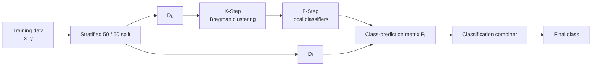
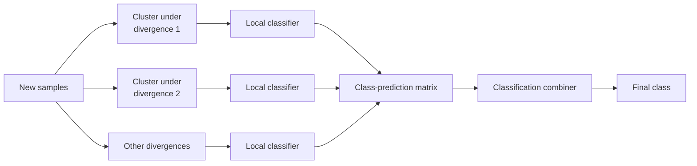

# KFC Classification

This guide shows how to use `KFCClassifier` for classification tasks.

`KFCClassifier` applies the complete KFC pipeline:

\[
\boxed{
\text{K-Step}
\rightarrow
\text{F-Step}
\rightarrow
\text{C-Step}
}
\]

for discrete class labels.

Use it when the input space may contain unknown groups whose class boundaries
are better modeled locally than by one global classifier.

---

## Basic example

```python
from kfc_procedure import KFCClassifier

model = KFCClassifier(
    divergences=["euclidean"],
    local_model="logistic_regression",
    combiner="majority_vote",
    n_clusters=3,
    random_state=42,
)

model.fit(X_train, y_train)

y_pred = model.predict(X_test)
```

This configuration:

1. splits the training data into two internal subsets;
2. clusters the K/F subset using squared-Euclidean Bregman K-means;
3. fits one logistic regression classifier inside each cluster;
4. obtains one class prediction per divergence;
5. combines those predictions with majority voting.

---

## Classification workflow

Calling

```python
model.fit(X, y)
```

first creates the internal K/F and C-Step subsets.

For classification, the current implementation uses a stratified split:

```python
X_k, X_l, y_k, y_l = train_test_split(
    X,
    y,
    test_size=0.5,
    random_state=random_state,
    stratify=y,
)
```

Therefore the two internal subsets aim to preserve the overall class
distribution.



<div class="grid cards" markdown>

-   :material-database-outline:{ .lg .middle } **\(D_k\)**

    ---

    Used by K-Step and F-Step.

    Clustering models and cluster-local classifiers are fitted here.

-   :material-source-branch:{ .lg .middle } **\(D_l\)**

    ---

    Passed through the fitted K-Step and F-Step.

    Its class-prediction matrix is used to fit or calibrate the C-Step.

</div>

!!! note "Stratification requirement"

    Because `KFCClassifier` uses `stratify=y`, every class needs enough
    observations for scikit-learn to create the 50/50 split.

    Extremely rare classes can cause `train_test_split` to fail before KFC
    reaches the K-Step.

---

## What the F-Step produces

Assume three divergences are configured:

```python
divergences=[
    "euclidean",
    "gkl",
    "logistic",
]
```

For each observation, the F-Step produces one class label from each
divergence-specific local-classifier family.

For example:

```text
              euclidean      gkl      logistic
sample 1          0           0           1
sample 2          1           1           1
sample 3          2           1           2
```

Mathematically,

\[
P
=
\begin{bmatrix}
m^{(1)}(x_1) & \cdots & m^{(M)}(x_1) \\
\vdots & & \vdots \\
m^{(1)}(x_n) & \cdots & m^{(M)}(x_n)
\end{bmatrix},
\]

where every entry is a predicted class label.

The C-Step then applies

\[
P\longrightarrow \widehat y.
\]

---

## Choose the divergences

The built-in divergence names are:

| Name | Geometry | Required input domain |
| --- | --- | --- |
| `euclidean` | Squared Euclidean | real-valued inputs |
| `gkl` | Generalized Kullback–Leibler | strictly positive inputs |
| `logistic` | Logistic Bregman divergence | values strictly between 0 and 1 |
| `is` | Itakura–Saito | strictly positive inputs |

For arbitrary real-valued features, start with:

```python
model = KFCClassifier(
    divergences=["euclidean"],
    local_model="logistic_regression",
    combiner="majority_vote",
    random_state=42,
)
```

For several clustering views:

```python
model = KFCClassifier(
    divergences=[
        "euclidean",
        "gkl",
        "logistic",
        "is",
    ],
    local_model="logistic_regression",
    combiner="majority_vote",
    random_state=42,
)
```

!!! warning "Domain validation"

    The package does not automatically transform feature values for the
    selected divergence.

    If all four built-in divergences are used, scale the features to a strict
    subset of \((0,1)\).

---

## Preparing features for several divergences

A practical preprocessing strategy is:

```python
from sklearn.preprocessing import MinMaxScaler

eps = 1e-6

scaler = MinMaxScaler(
    feature_range=(eps, 1.0 - eps),
)

X_train_scaled = scaler.fit_transform(X_train)
X_test_scaled = scaler.transform(X_test)
```

Then:

```python
model = KFCClassifier(
    divergences=[
        "euclidean",
        "gkl",
        "logistic",
        "is",
    ],
    local_model="logistic_regression",
    combiner="majority_vote",
    n_clusters=3,
    random_state=42,
)

model.fit(
    X_train_scaled,
    y_train,
)

y_pred = model.predict(
    X_test_scaled,
)
```

---

## Choose the local classifier

`local_model` controls the classifier fitted inside every non-empty cluster.

Because `KFCClassifier` fixes

```python
task="classification"
```

only models registered in the classification category are accepted.

Common examples include:

```text
logistic_regression
decision_tree_classifier
random_forest_classifier
k_neighbors_classifier
svc
```

The package also auto-registers compatible scikit-learn classifiers using
snake-case estimator names.

---

## Logistic regression

```python
model = KFCClassifier(
    divergences=["euclidean"],
    local_model="logistic_regression",
    local_model_params={
        "max_iter": 1000,
        "C": 1.0,
    },
    combiner="majority_vote",
    random_state=42,
)
```

---

## Decision tree

```python
model = KFCClassifier(
    divergences=["euclidean"],
    local_model="decision_tree_classifier",
    local_model_params={
        "max_depth": 6,
    },
    combiner="majority_vote",
    random_state=42,
)
```

---

## Random forest

```python
model = KFCClassifier(
    divergences=["euclidean"],
    local_model="random_forest_classifier",
    local_model_params={
        "n_estimators": 300,
        "max_depth": 8,
    },
    combiner="majority_vote",
    random_state=42,
)
```

When a selected local classifier accepts `random_state`, KFC forwards the
top-level value unless it is already supplied inside `local_model_params`.

---

## Support vector classifier

```python
model = KFCClassifier(
    divergences=["euclidean"],
    local_model="svc",
    local_model_params={
        "C": 1.0,
        "kernel": "rbf",
    },
    combiner="majority_vote",
    random_state=42,
)
```

For ordinary `predict()` usage, `probability=True` is not required.

---

## How many local classifiers are fitted?

With \(M\) divergences and \(K\) clusters, KFC normally fits up to

\[
M\times K
\]

local classifiers.

For example:

```python
divergences=[
    "euclidean",
    "gkl",
    "logistic",
    "is",
]

n_clusters=3
```

can produce up to

\[
4\times3=12
\]

local classifiers.

Each classifier is trained only on the observations assigned to its own
divergence-specific cluster.

---

## The single-class cluster problem

Classification introduces an important issue that is less common in
regression.

A cluster can contain observations from only one class.

For example:

```text
cluster 0 -> labels [0, 0, 0, 0, 0]
```

Many classifiers, including logistic regression, require at least two classes
during `fit()`.

The F-Step catches the resulting `ValueError` and raises a more informative
message containing:

```text
[FSTEP ERROR]
divergence='...'
cluster=...
Reason: ...
Hint: cluster contains invalid label distribution.
```

Possible remedies include:

- reduce `n_clusters`;
- use more training data;
- use a different divergence;
- use a local classifier compatible with the cluster;
- inspect class imbalance before fitting.

---

## Choose a classification combiner

The current source registers three classification combiners:

```text
majority_vote
stacking_classifier
combined_classifier
```

---

## `majority_vote`

`majority_vote` is a stateless hard-voting combiner.

For every row of the F-Step prediction matrix, it selects the most frequent
class label.

If

```text
Euclidean -> 1
GKL       -> 1
Logistic  -> 0
IS        -> 1
```

the final prediction is:

```text
1
```

Example:

```python
model = KFCClassifier(
    divergences=[
        "euclidean",
        "gkl",
        "logistic",
        "is",
    ],
    local_model="logistic_regression",
    combiner="majority_vote",
    random_state=42,
)
```

The underlying implementation uses:

```python
Counter(row).most_common(1)[0][0]
```

for each sample.

!!! note "Ties"

    The current implementation relies on Python `Counter.most_common()`.

    No additional domain-specific tie-breaking rule is implemented by
    `MajorityVoteCombiner`.

---

## `stacking_classifier`

`stacking_classifier` learns a meta-classifier from the divergence prediction
matrix.

By default it uses:

```python
LogisticRegression(max_iter=1000)
```

Example:

```python
model = KFCClassifier(
    divergences=[
        "euclidean",
        "gkl",
        "logistic",
    ],
    local_model="decision_tree_classifier",
    combiner="stacking_classifier",
    random_state=42,
)
```

The meta-classifier sees samples like:

```text
[0, 0, 1]
[1, 1, 1]
[2, 1, 2]
```

and learns how those divergence-level class patterns relate to the true
labels.

### Custom meta-classifier

You can supply a custom estimator instance:

```python
from sklearn.ensemble import RandomForestClassifier

model = KFCClassifier(
    divergences=[
        "euclidean",
        "gkl",
    ],
    local_model="logistic_regression",
    combiner="stacking_classifier",
    combiner_params={
        "meta_model": RandomForestClassifier(
            n_estimators=200,
            random_state=42,
        ),
    },
    random_state=42,
)
```

The combiner clones the supplied `meta_model` before fitting it.

---

## `combined_classifier`

`combined_classifier` wraps the package's prediction-space
`CombinedClassifier`.

Instead of performing direct majority voting, it compares the entire vector of
divergence-specific class predictions with prediction vectors from the
aggregation sample.

Example:

```python
model = KFCClassifier(
    divergences=[
        "euclidean",
        "gkl",
        "logistic",
        "is",
    ],
    local_model="logistic_regression",
    combiner="combined_classifier",
    combiner_params={
        "distance": "hamming",
        "kernel": "rbf",
        "bandwidth_list": [
            0.01,
            0.1,
            0.5,
            1.0,
            2.0,
        ],
        "random_state": 42,
    },
    random_state=42,
)
```

Internally, the KFC wrapper calls:

```python
self.cobra.fit(
    X,
    y,
    as_predictions=True,
)
```

so the F-Step prediction matrix is treated directly as prediction-space data.

For a complete explanation, see:

[CombinedClassifier](../../getting-started/concepts/combined-classifier.md)

---

## Comparing classification combiners

| Combiner | Learns parameters? | Main idea |
| --- | :---: | --- |
| `majority_vote` | No | most common divergence-level label |
| `stacking_classifier` | Yes | meta-classifier over prediction patterns |
| `combined_classifier` | Yes | kernel consensus in prediction space |

A practical sequence is to begin with `majority_vote` and then compare it with
the learned combiners.

---

## Full binary-classification example

```python
from sklearn.datasets import make_classification
from sklearn.metrics import accuracy_score
from sklearn.model_selection import train_test_split
from sklearn.preprocessing import MinMaxScaler

from kfc_procedure import KFCClassifier


# Create data
X, y = make_classification(
    n_samples=1500,
    n_features=10,
    n_informative=7,
    n_redundant=1,
    n_classes=2,
    random_state=42,
)


# Outer train/test split
X_train, X_test, y_train, y_test = train_test_split(
    X,
    y,
    test_size=0.2,
    stratify=y,
    random_state=42,
)


# Scale for all built-in Bregman divergences
eps = 1e-6

scaler = MinMaxScaler(
    feature_range=(eps, 1.0 - eps),
)

X_train = scaler.fit_transform(X_train)
X_test = scaler.transform(X_test)


# Configure KFC
model = KFCClassifier(
    divergences=[
        "euclidean",
        "gkl",
        "logistic",
        "is",
    ],
    local_model="logistic_regression",
    local_model_params={
        "max_iter": 1000,
    },
    combiner="majority_vote",
    n_clusters=3,
    max_iter=300,
    tol=1e-4,
    random_state=42,
)


# Fit
model.fit(
    X_train,
    y_train,
)


# Predict
y_pred = model.predict(X_test)


# Evaluate
accuracy = accuracy_score(
    y_test,
    y_pred,
)

print("Accuracy:", accuracy)
```

---

## Multiclass example

KFC's classification pipeline is not restricted by its own API to binary
labels.

For example:

```python
X, y = make_classification(
    n_samples=1800,
    n_features=12,
    n_informative=8,
    n_classes=3,
    n_clusters_per_class=1,
    random_state=42,
)
```

Then:

```python
model = KFCClassifier(
    divergences=["euclidean"],
    local_model="random_forest_classifier",
    combiner="majority_vote",
    n_clusters=3,
    random_state=42,
)

model.fit(
    X_train,
    y_train,
)

y_pred = model.predict(X_test)
```

Whether a particular local model or combiner supports a given multiclass
problem depends on that underlying component.

---

## Example with stacking

```python
model = KFCClassifier(
    divergences=[
        "euclidean",
        "gkl",
        "logistic",
        "is",
    ],
    local_model="decision_tree_classifier",
    local_model_params={
        "max_depth": 5,
    },
    combiner="stacking_classifier",
    n_clusters=3,
    random_state=42,
)

model.fit(
    X_train,
    y_train,
)

y_pred = model.predict(X_test)
```

---

## Example with CombinedClassifier

```python
import numpy as np

model = KFCClassifier(
    divergences=[
        "euclidean",
        "gkl",
        "logistic",
        "is",
    ],
    local_model="logistic_regression",
    local_model_params={
        "max_iter": 1000,
    },
    combiner="combined_classifier",
    combiner_params={
        "distance": "hamming",
        "kernel": "rbf",
        "bandwidth_list": np.linspace(
            0.01,
            3.0,
            40,
        ),
        "n_cv": 5,
        "random_state": 42,
    },
    n_clusters=3,
    random_state=42,
)

model.fit(
    X_train,
    y_train,
)

y_pred = model.predict(X_test)
```

---

## Prediction workflow

After fitting:

```python
y_pred = model.predict(X_new)
```

runs:



For each divergence:

1. K-Step assigns each new observation to the closest fitted cluster.
2. F-Step selects the classifier fitted in that cluster.
3. The local classifier predicts a class label.
4. All divergence-level labels are stacked into a row.
5. C-Step converts that row into the final class prediction.

---

## Inspect divergence-level class predictions

You can inspect the matrix sent to the C-Step.

```python
clusters = model.kstep_.predict(X_test)

P_test = model.fstep_.predict(
    X_test,
    clusters,
)

print(P_test.shape)
print(P_test[:5])
```

With four divergences:

```text
P_test.shape == (n_test, 4)
```

For example:

```text
[[0, 0, 1, 0],
 [1, 1, 1, 1],
 [0, 1, 0, 0]]
```

---

## Inspect the local classifiers

The fitted local models are stored in:

```python
model.fstep_.models_
```

Example:

```python
for divergence, models in model.fstep_.models_.items():
    print(divergence)

    for model_name, metadata in models.items():
        print(
            model_name,
            "cluster=",
            metadata["cluster"],
            "classifier=",
            type(metadata["model"]).__name__,
        )
```

Each stored entry contains:

```text
divergence
cluster
model
```

---

## Inspect cluster class distributions

Because single-class clusters can cause local-model failures, it can be useful
to inspect the K-Step assignments on the internal training subset.

The fitted K-Step stores:

```python
model.kstep_.clusters_
```

The public `KFCClassifier` object does not currently retain `y_k` as a fitted
attribute, so exact internal class distributions are not directly exposed
after `fit()`.

For deeper diagnostics, reproduce the same split externally or inspect the
K-Step and F-Step during development.

---

## Inspect the C-Step

The fitted combiner is available as:

```python
strategy = model.cstep_.strategy_
```

For majority voting:

```python
print(type(strategy).__name__)
```

For stacking:

```python
print(strategy.meta_model_)
```

For CombinedClassifier:

```python
print(strategy.cobra)
print(strategy.cobra.bandwidth_)
```

when the inner model exposes those fitted attributes.

---

## Classification metrics

`KFCClassifier` returns predicted labels through:

```python
model.predict(X)
```

Evaluate them with ordinary classification metrics.

### Accuracy

```python
from sklearn.metrics import accuracy_score

accuracy = accuracy_score(
    y_test,
    y_pred,
)
```

### Balanced accuracy

```python
from sklearn.metrics import balanced_accuracy_score

score = balanced_accuracy_score(
    y_test,
    y_pred,
)
```

### F1 score

```python
from sklearn.metrics import f1_score

f1 = f1_score(
    y_test,
    y_pred,
)
```

For multiclass classification:

```python
f1 = f1_score(
    y_test,
    y_pred,
    average="macro",
)
```

### Confusion matrix

```python
from sklearn.metrics import confusion_matrix

cm = confusion_matrix(
    y_test,
    y_pred,
)
```

---

## About `predict_proba()`

`KFCClassifier` defines:

```python
model.predict_proba(X)
```

in `kfc.py`.

However, the current F-Step implementation only defines:

```python
predict(...)
```

and does **not** define:

```python
predict_proba(...)
```

Yet the top-level probability path attempts to call:

```python
self.fstep_.predict_proba(
    X,
    clusters,
)
```

Therefore the full `KFCClassifier.predict_proba()` path is currently
incomplete.

!!! warning "Current source limitation"

    Use:

    ```python
    model.predict(X)
    ```

    for the current version.

    Do not rely on top-level `KFCClassifier.predict_proba()` until probability
    propagation is implemented in `FStep`.

---

## Probability support in the combiners

The C-Step itself has a `predict_proba()` method, but support depends on the
chosen combiner.

### `majority_vote`

`MajorityVoteCombiner` does not implement `predict_proba()`.

### `stacking_classifier`

The current `StackingClassifierCombiner` uses a classifier that may itself
support probabilities, but the combiner class does not expose its own
`predict_proba()` method.

### `combined_classifier`

`CobraClassifierCombiner` explicitly implements:

```python
predict_proba(...)
```

and delegates to the wrapped `CombinedClassifier`.

However, because top-level `KFCClassifier.predict_proba()` currently fails
earlier at F-Step, this C-Step capability is not yet sufficient to provide
end-to-end probabilities.

---

## Class labels

The KFC classification pipeline works with the labels produced by the chosen
local classifiers.

For example, labels may be:

```text
0, 1
```

or:

```text
"class_a", "class_b"
```

provided that the selected local estimators and C-Step combiner support them.

`MajorityVoteCombiner` stores the output in an object-dtype NumPy array, so it
can accommodate non-numeric labels.

---

## Choosing `n_clusters`

`n_clusters` applies independently to each divergence.

```python
model = KFCClassifier(
    divergences=["euclidean"],
    local_model="logistic_regression",
    combiner="majority_vote",
    n_clusters=4,
)
```

For classification, increasing the number of clusters introduces a special
trade-off:

```text
more clusters
    ↓
more localized class boundaries
    ↓
fewer observations per local classifier
    ↓
higher chance of single-class clusters
```

So classification often requires more care with `n_clusters` than regression.

---

## Class imbalance

KFC's internal train/aggregation split is stratified, but the Bregman
clustering itself is unsupervised.

Therefore stratification does **not** guarantee balanced class distributions
inside individual clusters.

A globally balanced dataset can still produce:

```text
cluster 0 -> mostly class 0
cluster 1 -> mixed
cluster 2 -> only class 1
```

Possible approaches include:

- reducing `n_clusters`;
- using more observations;
- using local classifiers with suitable class-weight options;
- choosing a different divergence set;
- evaluating per-class metrics instead of accuracy alone.

For example:

```python
model = KFCClassifier(
    divergences=["euclidean"],
    local_model="logistic_regression",
    local_model_params={
        "max_iter": 1000,
        "class_weight": "balanced",
    },
    combiner="majority_vote",
    n_clusters=3,
    random_state=42,
)
```

`class_weight="balanced"` can help with imbalance inside clusters containing
multiple classes, but it cannot make a classifier fit a cluster that contains
only one class.

---

## Reproducibility

Set:

```python
random_state=42
```

to control:

- the internal stratified split;
- Bregman K-means initialization;
- compatible local classifiers;
- compatible C-Step components.

```python
model = KFCClassifier(
    divergences=["euclidean"],
    local_model="random_forest_classifier",
    local_model_params={
        "n_estimators": 300,
    },
    combiner="majority_vote",
    random_state=42,
)
```

A component that does not expose a `random_state` constructor argument simply
ignores the forwarded value through the package's estimator adapter.

---

## Common classification issues

### Rare class causes internal split failure

Because the internal split uses:

```python
stratify=y
```

classes with too few observations can make `train_test_split` fail.

Add more samples, merge unsuitable rare classes when scientifically
appropriate, or prepare a dataset with sufficient class support before
fitting KFC.

---

### Local classifier receives one class

This is one of the most common KFC classification failures.

Example:

```text
ValueError:
[FSTEP ERROR] divergence='euclidean', cluster=2 failed.
...
Hint: cluster contains invalid label distribution.
```

Try reducing `n_clusters` first.

---

### Invalid classifier name

If `local_model` is not registered:

```python
local_model="my_unknown_classifier"
```

F-Step raises an error listing the currently available models.

---

### Regression model supplied to classifier

For example:

```python
KFCClassifier(
    ...,
    local_model="ridge",
)
```

is invalid because `ridge` is registered for regression.

---

### Regression combiner supplied to classifier

For example:

```python
combiner="mean"
```

is invalid for classification.

Use one of:

```text
majority_vote
stacking_classifier
combined_classifier
```

---

### Divergence domain violation

For example:

```python
divergences=["logistic"]
```

with values outside \((0,1)\) is invalid.

Scale or otherwise transform the data before fitting.

---

## A practical progression

For a new classification problem, start simple:

```text
1. Euclidean
   + logistic_regression
   + majority_vote
            ↓
2. Euclidean
   + decision_tree_classifier
   + majority_vote
            ↓
3. Several divergences
   + logistic_regression
   + majority_vote
            ↓
4. Compare stacking_classifier
            ↓
5. Compare combined_classifier
```

This sequence makes it easier to isolate whether changes in performance come
from clustering, local modeling, or consensus aggregation.

---

## Recommended starter configuration

For arbitrary real-valued features:

```python
model = KFCClassifier(
    divergences=["euclidean"],
    local_model="logistic_regression",
    local_model_params={
        "max_iter": 1000,
    },
    combiner="majority_vote",
    n_clusters=3,
    random_state=42,
)
```

For features already scaled into \((0,1)\):

```python
model = KFCClassifier(
    divergences=[
        "euclidean",
        "gkl",
        "logistic",
        "is",
    ],
    local_model="logistic_regression",
    local_model_params={
        "max_iter": 1000,
    },
    combiner="majority_vote",
    n_clusters=3,
    random_state=42,
)
```

For prediction-space consensus:

```python
model = KFCClassifier(
    divergences=[
        "euclidean",
        "gkl",
        "logistic",
        "is",
    ],
    local_model="logistic_regression",
    combiner="combined_classifier",
    combiner_params={
        "distance": "hamming",
        "kernel": "rbf",
    },
    n_clusters=3,
    random_state=42,
)
```

---

## Next steps

<div class="grid cards" markdown>

-   :material-numeric-1-circle:{ .lg .middle } **Configure K-Step**

    ---

    Learn how divergence selection changes the candidate partitions.

    [:octicons-arrow-right-24: Configure K-Step](configuring-k-step.md)

-   :material-numeric-2-circle:{ .lg .middle } **Configure F-Step**

    ---

    Learn how cluster-local classifiers are created and configured.

    [:octicons-arrow-right-24: Configure F-Step](configuring-f-step.md)

-   :material-numeric-3-circle:{ .lg .middle } **Configure C-Step**

    ---

    Compare majority vote, stacking, and prediction-space consensus.

    [:octicons-arrow-right-24: Configure C-Step](configuring-c-step.md)

-   :material-magnify-expand:{ .lg .middle } **Inspect fitted models**

    ---

    Explore clusters, local classifiers, and the fitted combiner.

    [:octicons-arrow-right-24: Inspect Fitted Models](inspecting-fitted-models.md)

</div>
