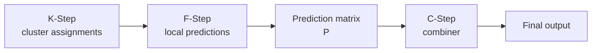

# Configure C-Step

The **C-Step** is the final aggregation stage of the KFC Procedure.

It receives the prediction matrix created by the F-Step and converts the
divergence-specific predictions into one final regression value or class label.

\[
\boxed{
\text{F-Step prediction matrix}
\rightarrow
\text{combiner}
\rightarrow
\text{final prediction}
}
\]

The implementation is provided by:

```python
from kfc_procedure.core.steps import CStep
```

Most users configure it through:

```python
KFCRegressor(...)
KFCClassifier(...)
```

using:

```text
combiner
combiner_params
random_state
```

---

## What the C-Step receives

If the K-Step uses \(M\) divergences, the F-Step creates a matrix with one
prediction column per divergence:

\[
P
\in
\mathbb{R}^{n\times M}.
\]

For regression, a row might look like:

```text
[12.4, 11.9, 12.8, 12.2]
```

For classification:

```text
[0, 0, 1, 0]
```

The C-Step applies an aggregation function

\[
g(P)\rightarrow \widehat y.
\]

The C-Step does **not** access the original feature matrix, K-Step centroids,
or local F-Step models directly. It only sees the F-Step prediction matrix and,
during fitting, the target vector.

---

## Where C-Step sits in KFC



During training, `KFCProcedure.fit()` constructs the C-Step with:

```python
self.cstep_ = CStep(
    combiner=self.combiner,
    combiner_params=self.combiner_params,
    task=self.task,
    random_state=self.random_state,
)

self.cstep_.fit(
    P_l,
    y_l,
)
```

where `P_l` is the F-Step prediction matrix for the held-out aggregation
subset.

---

## Direct C-Step API

The constructor is:

```python
CStep(
    combiner,
    combiner_params=None,
    task="regression",
    random_state=None,
)
```

The main methods are:

```python
fit(X, y)
predict(X)
predict_proba(X)
```

where `X` is a prediction matrix, not the original feature matrix.

---

## Combiner registry

String-based combiners are resolved through:

```python
CombinerFactory
```

The current source registers the following names.

### Regression

| Name | Implementation |
| --- | --- |
| `mean` | `MeanCombiner` |
| `weighted_mean` | `WeightedMeanCombiner` |
| `stacking_regressor` | `StackingRegressorCombiner` |
| `gradientcobra` | `GradientCOBRACombiner` |
| `mixcobra` | `MixCOBRACombiner` |

### Classification

| Name | Implementation |
| --- | --- |
| `majority_vote` | `MajorityVoteCombiner` |
| `stacking_classifier` | `StackingClassifierCombiner` |
| `combined_classifier` | `CobraClassifierCombiner` |

The registry also stores a task category, so C-Step validates whether the
selected combiner is compatible with regression or classification.

---

## Task validation

For a string combiner, C-Step first checks:

```python
CombinerFactory.contains(name)
```

and then:

```python
CombinerFactory.supports(
    name,
    self.task,
)
```

Therefore:

```python
CStep(
    combiner="mean",
    task="classification",
)
```

is invalid.

Likewise:

```python
CStep(
    combiner="majority_vote",
    task="regression",
)
```

is invalid.

The error includes the available names for the selected task.

---

# Regression combiners

The regression C-Step can use five built-in strategies.

---

## `mean`

`MeanCombiner` computes the row-wise arithmetic mean.

For a prediction row

\[
(p_1,\ldots,p_M),
\]

the final prediction is

\[
\widehat y
=
\frac{1}{M}
\sum_{m=1}^{M}p_m.
\]

The implementation is:

```python
return np.mean(
    X,
    axis=1,
)
```

and `fit()` is stateless:

```python
def fit(self, X, y=None):
    return self
```

### Direct use

```python
from kfc_procedure.core.combiner.regression import (
    MeanCombiner,
)

combiner = MeanCombiner()

combiner.fit(P_train, y_train)

y_pred = combiner.predict(P_test)
```

The combiner validates that the input is two-dimensional.

---

## `weighted_mean`

`WeightedMeanCombiner` learns a linear model over the divergence prediction
columns.

The model is:

\[
y
\approx
Pw.
\]

It uses:

```python
LinearRegression(
    fit_intercept=fit_intercept,
)
```

with:

```python
fit_intercept=False
```

by default.

### Direct use

```python
from kfc_procedure.core.combiner.regression import (
    WeightedMeanCombiner,
)

combiner = WeightedMeanCombiner(
    fit_intercept=False,
)

combiner.fit(
    P_train,
    y_train,
)

y_pred = combiner.predict(P_test)
```

### Inspect learned coefficients

```python
print(
    combiner.model.coef_
)

print(
    combiner.model.intercept_
)
```

!!! note

    Despite the name `weighted_mean`, the implementation does not constrain
    the coefficients to be positive or to sum to one.

    It is ordinary linear regression over the F-Step prediction columns.

---

## `stacking_regressor`

`StackingRegressorCombiner` learns a meta-regressor.

Its default meta-model is:

```python
LinearRegression()
```

During fitting, the source clones the supplied meta-model:

```python
self.meta_model_ = clone(
    self.meta_model
)
```

and then fits it on the prediction matrix.

### Direct use

```python
from kfc_procedure.core.combiner.regression import (
    StackingRegressorCombiner,
)

combiner = StackingRegressorCombiner()

combiner.fit(
    P_train,
    y_train,
)

y_pred = combiner.predict(P_test)
```

### Custom meta-model

```python
from sklearn.ensemble import RandomForestRegressor

combiner = StackingRegressorCombiner(
    meta_model=RandomForestRegressor(
        n_estimators=200,
        random_state=42,
    )
)
```

The fitted clone is available as:

```python
combiner.meta_model_
```

---

## `gradientcobra`

`GradientCOBRACombiner` wraps:

```python
GradientCOBRA
```

The constructor forwards all keyword arguments to the wrapped estimator:

```python
self.cobra = GradientCOBRA(
    **cobra_params
)
```

During fitting:

```python
self.cobra.fit(
    X,
    y,
    as_predictions=True,
)
```

Therefore the F-Step prediction matrix is treated directly as GradientCOBRA's
prediction-space representation.

### KFC example

```python
from kfc_procedure import KFCRegressor

model = KFCRegressor(
    divergences=["euclidean"],
    local_model="ridge",
    combiner="gradientcobra",
    combiner_params={
        "kernel": "rbf",
        "distance": "euclidean",
        "bandwidth_list": [
            0.01,
            0.1,
            0.5,
            1.0,
            2.0,
        ],
    },
    random_state=42,
)

model.fit(
    X_train,
    y_train,
)
```

Because `GradientCOBRACombiner.__init__()` accepts arbitrary keyword
arguments, the `random_state` forwarded by C-Step is accepted by this
combiner.

For the algorithm itself, see:

[GradientCOBRA](../../getting-started/concepts/gradientcobra.md)

---

## `mixcobra`

`MixCOBRACombiner` wraps:

```python
MixCOBRARegressor
```

and fits it with:

```python
self.cobra.fit(
    X,
    y,
    as_predictions=True,
)
```

### KFC example

```python
model = KFCRegressor(
    divergences=["euclidean"],
    local_model="ridge",
    combiner="mixcobra",
    combiner_params={
        "kernel": "rbf",
        "distance": "euclidean",
    },
    random_state=42,
)

model.fit(
    X_train,
    y_train,
)
```

The wrapper accepts arbitrary COBRA parameters through:

```python
**cobra_params
```

For the standalone algorithm, see:

[MixCOBRA](../../getting-started/concepts/mixcobra.md)

!!! note "KFC integration"

    Inside the KFC C-Step, MixCOBRA receives only the F-Step prediction matrix
    through `as_predictions=True`.

    It does not receive the original KFC feature matrix as a separate
    input-space component.

---

# Classification combiners

The classification C-Step currently provides three built-in strategies.

---

## `majority_vote`

`MajorityVoteCombiner` performs hard voting across each row of the prediction
matrix.

For example:

```text
[1, 1, 0, 1]
```

produces:

```text
1
```

The implementation uses:

```python
Counter(
    row
).most_common(1)[0][0]
```

for every sample.

### Direct use

```python
from kfc_procedure.core.combiner.classification import (
    MajorityVoteCombiner,
)

combiner = MajorityVoteCombiner()

combiner.fit(
    P_train,
    y_train,
)

y_pred = combiner.predict(P_test)
```

`fit()` is stateless.

### Tie behavior

The source does not implement a separate tie-breaking strategy.

Tie behavior is inherited from:

```python
collections.Counter.most_common()
```

and the ordering of labels in the row.

---

## `stacking_classifier`

`StackingClassifierCombiner` learns a meta-classifier over the F-Step
prediction matrix.

The default is:

```python
LogisticRegression(
    max_iter=1000,
)
```

During fitting, the meta-model is cloned:

```python
self.meta_model_ = clone(
    self.meta_model
)
```

### Direct use

```python
from kfc_procedure.core.combiner.classification import (
    StackingClassifierCombiner,
)

combiner = StackingClassifierCombiner()

combiner.fit(
    P_train,
    y_train,
)

y_pred = combiner.predict(P_test)
```

### Custom meta-classifier

```python
from sklearn.ensemble import RandomForestClassifier

combiner = StackingClassifierCombiner(
    meta_model=RandomForestClassifier(
        n_estimators=200,
        random_state=42,
    )
)
```

The fitted model is stored in:

```python
combiner.meta_model_
```

---

## `combined_classifier`

`CobraClassifierCombiner` wraps:

```python
CombinedClassifier
```

and fits it with:

```python
self.cobra.fit(
    X,
    y,
    as_predictions=True,
)
```

so the F-Step output is interpreted directly as prediction-space data.

### KFC example

```python
from kfc_procedure import KFCClassifier

model = KFCClassifier(
    divergences=["euclidean"],
    local_model="logistic_regression",
    combiner="combined_classifier",
    combiner_params={
        "distance": "hamming",
        "kernel": "rbf",
        "bandwidth_list": [
            0.01,
            0.1,
            0.5,
            1.0,
        ],
    },
    random_state=42,
)

model.fit(
    X_train,
    y_train,
)
```

The wrapper also implements:

```python
predict_proba(...)
```

by delegating to:

```python
self.cobra.predict_proba(X)
```

For the algorithm itself, see:

[CombinedClassifier](../../getting-started/concepts/combined-classifier.md)

---

# Current `random_state` constructor issue

The current C-Step source automatically injects:

```python
random_state=self.random_state
```

into every **string-based combiner** unless the key already exists in
`combiner_params`.

The relevant logic is:

```python
params = dict(
    self.combiner_params
)

if "random_state" not in params:
    params["random_state"] = self.random_state

return CombinerFactory.create(
    name,
    **params,
)
```

`CombinerFactory.create()` forwards these keyword arguments directly to the
registered class constructor.

This creates an important compatibility issue.

The following built-in constructors do **not** accept `random_state`:

```text
MeanCombiner
WeightedMeanCombiner
StackingRegressorCombiner
MajorityVoteCombiner
StackingClassifierCombiner
```

Therefore, in the current source version, selecting these combiners by string
through `CStep` can raise a `TypeError`, even when the top-level
`random_state` is `None`.

For example, conceptually:

```python
CStep(
    combiner="mean",
    task="regression",
)
```

builds the equivalent of:

```python
MeanCombiner(
    random_state=None,
)
```

but `MeanCombiner.__init__()` does not accept that argument.

!!! warning "Current source limitation"

    String-based use of `mean`, `weighted_mean`, `stacking_regressor`,
    `majority_vote`, and `stacking_classifier` is currently affected by this
    constructor mismatch.

    The COBRA wrappers are not affected because their constructors accept
    arbitrary keyword arguments:

    ```python
    GradientCOBRACombiner(**cobra_params)
    MixCOBRACombiner(**cobra_params)
    CobraClassifierCombiner(**cobra_params)
    ```

---

## Workaround: pass a combiner instance

C-Step does not rebuild a combiner when `combiner` is already an object:

```python
if not isinstance(
    self.combiner,
    str,
):
    return self.combiner
```

Therefore a direct combiner instance avoids the automatic `random_state`
injection.

### Mean

```python
from kfc_procedure import KFCRegressor
from kfc_procedure.core.combiner.regression import (
    MeanCombiner,
)

model = KFCRegressor(
    divergences=["euclidean"],
    local_model="ridge",
    combiner=MeanCombiner(),
    random_state=42,
)
```

### Weighted mean

```python
from kfc_procedure.core.combiner.regression import (
    WeightedMeanCombiner,
)

model = KFCRegressor(
    divergences=["euclidean"],
    local_model="ridge",
    combiner=WeightedMeanCombiner(
        fit_intercept=False,
    ),
    random_state=42,
)
```

### Stacking regression

```python
from kfc_procedure.core.combiner.regression import (
    StackingRegressorCombiner,
)

model = KFCRegressor(
    divergences=["euclidean"],
    local_model="ridge",
    combiner=StackingRegressorCombiner(),
    random_state=42,
)
```

### Majority vote

```python
from kfc_procedure.core.combiner.classification import (
    MajorityVoteCombiner,
)

model = KFCClassifier(
    divergences=["euclidean"],
    local_model="logistic_regression",
    combiner=MajorityVoteCombiner(),
    random_state=42,
)
```

### Stacking classification

```python
from kfc_procedure.core.combiner.classification import (
    StackingClassifierCombiner,
)

model = KFCClassifier(
    divergences=["euclidean"],
    local_model="logistic_regression",
    combiner=StackingClassifierCombiner(),
    random_state=42,
)
```

!!! note

    This workaround reflects the current implementation. It is not a
    conceptual requirement of the KFC algorithm.

---

# Pre-instantiated combiner behavior

Unlike the current F-Step behavior for local model objects, using a
pre-instantiated C-Step combiner is generally appropriate because C-Step needs
only one combiner object.

There is no need to clone a combiner per divergence or cluster.

C-Step simply stores it as:

```python
self.strategy_
```

and fits it once.

---

# `combiner_params`

For a string-based combiner, constructor options are passed using:

```python
combiner_params
```

For example, COBRA configuration can be supplied as:

```python
model = KFCRegressor(
    divergences=["euclidean"],
    local_model="ridge",
    combiner="gradientcobra",
    combiner_params={
        "kernel": "rbf",
        "distance": "euclidean",
        "n_cv": 5,
    },
)
```

C-Step copies the dictionary before modifying it:

```python
params = dict(
    self.combiner_params
)
```

so the original user dictionary is not changed by `_build_combiner()`.

---

# Fitting behavior

C-Step fitting is simple:

```python
self.strategy_ = self._build_combiner()

self.strategy_.fit(
    X,
    y,
)
```

There is no additional preprocessing, validation, cross-validation, or
reshaping in `CStep` itself.

Those behaviors belong to the selected combiner.

---

## Stateless vs learned combiners

<div class="grid cards" markdown>

-   :material-lightning-bolt-outline:{ .lg .middle } **Stateless**

    ---

    `mean`

    `majority_vote`

    Their `fit()` methods simply return `self`.

-   :material-school-outline:{ .lg .middle } **Learned**

    ---

    `weighted_mean`

    `stacking_regressor`

    `stacking_classifier`

    `gradientcobra`

    `mixcobra`

    `combined_classifier`

    These estimate parameters or fit a secondary model from `X` and `y`.

</div>

---

# Prediction behavior

C-Step prediction checks that:

```python
strategy_
```

has been created by `fit()`:

```python
check_is_fitted(
    self,
    "strategy_",
)
```

and then delegates directly:

```python
return self.strategy_.predict(X)
```

`BaseCombiner.predict()` itself calls:

```python
self.combine(X)
```

unless a subclass provides different behavior.

---

# `predict_proba()`

C-Step allows probability prediction only when:

```python
task == "classification"
```

Otherwise:

```python
raise AttributeError(
    "predict_proba only available for classification"
)
```

For classification, it then checks whether the strategy has a
`predict_proba` attribute.

---

## Important abstract-interface detail

`BaseCombiner` does **not** define:

```python
predict_proba()
```

so only subclasses that explicitly implement it expose probability
prediction.

Among the current built-in C-Step combiners:

| Combiner | `predict_proba()` |
| --- | :---: |
| `majority_vote` | No |
| `stacking_classifier` | No |
| `combined_classifier` | Yes |

`CobraClassifierCombiner` implements:

```python
def predict_proba(self, X):
    return self.cobra.predict_proba(X)
```

---

## Top-level KFC probability limitation

Even though `combined_classifier` supports C-Step probabilities, the complete
`KFCClassifier.predict_proba()` path is currently incomplete.

The top-level implementation calls:

```python
P = self.fstep_.predict_proba(
    X,
    clusters,
)
```

but the current `FStep` source does not define `predict_proba()`.

Therefore:

```python
KFCClassifier.predict_proba(...)
```

is not currently functional end-to-end.

!!! warning

    This is an F-Step limitation, not a limitation of
    `CobraClassifierCombiner.predict_proba()` itself.

---

# Inspect the fitted C-Step

After fitting a KFC estimator:

```python
cstep = model.cstep_
```

The selected fitted combiner is:

```python
cstep.strategy_
```

Inspect its type:

```python
print(
    type(
        cstep.strategy_
    ).__name__
)
```

---

## Inspect weighted mean

```python
strategy = model.cstep_.strategy_

print(
    strategy.model.coef_
)

print(
    strategy.model.intercept_
)
```

---

## Inspect regression stacking

```python
strategy = model.cstep_.strategy_

print(
    strategy.meta_model_
)
```

---

## Inspect classification stacking

```python
strategy = model.cstep_.strategy_

print(
    strategy.meta_model_
)
```

---

## Inspect COBRA wrappers

For:

```text
gradientcobra
mixcobra
combined_classifier
```

the wrapped estimator is:

```python
strategy.cobra
```

For example:

```python
cobra = model.cstep_.strategy_.cobra

print(
    cobra
)
```

For GradientCOBRA or CombinedClassifier, fitted hyperparameters may include:

```python
print(
    cobra.bandwidth_
)
```

when available after fitting.

---

# Inspect available combiners

Use the factory directly:

```python
from kfc_procedure.core.combiner import (
    CombinerFactory,
)

print(
    CombinerFactory.available()
)
```

Regression only:

```python
print(
    CombinerFactory.available_by_category(
        "regression"
    )
)
```

Classification only:

```python
print(
    CombinerFactory.available_by_category(
        "classification"
    )
)
```

This reflects the actual registry loaded by the installed package.

---

# Custom combiner

A custom C-Step strategy should subclass:

```python
BaseCombiner
```

and implement:

```python
fit(...)
combine(...)
```

A minimal regression example:

```python
import numpy as np

from kfc_procedure.core.combiner.base import (
    BaseCombiner,
)


class MedianCombiner(BaseCombiner):

    def fit(
        self,
        X,
        y=None,
    ):
        return self

    def combine(
        self,
        X,
    ):
        X = np.asarray(X)

        return np.median(
            X,
            axis=1,
        )
```

Use the object directly:

```python
model = KFCRegressor(
    divergences=["euclidean"],
    local_model="ridge",
    combiner=MedianCombiner(),
)
```

This avoids factory registration entirely.

---

## Register a custom combiner

To select it by name, register the class with:

```python
CombinerFactory
```

Example:

```python
from kfc_procedure.core.combiner import (
    CombinerFactory,
)


@CombinerFactory.register(
    "median",
    categories={"regression"},
)
class MedianCombiner(BaseCombiner):
    ...
```

Then:

```python
model = KFCRegressor(
    divergences=["euclidean"],
    local_model="ridge",
    combiner="median",
)
```

!!! warning "Constructor compatibility"

    In the current C-Step implementation, every string-based combiner receives
    a `random_state` keyword.

    A custom registered combiner should therefore either accept:

    ```python
    random_state=None
    ```

    or accept arbitrary keyword arguments.

    Otherwise it is subject to the same constructor mismatch described above.

---

# Custom classification probabilities

A custom classification combiner can additionally implement:

```python
predict_proba(...)
```

For example:

```python
class MyClassifierCombiner(BaseCombiner):

    def fit(
        self,
        X,
        y,
    ):
        ...
        return self

    def combine(
        self,
        X,
    ):
        ...

    def predict_proba(
        self,
        X,
    ):
        ...
```

Then `CStep.predict_proba()` can delegate to it when:

```python
task="classification"
```

The current top-level KFC probability path still requires F-Step probability
support before this can work end-to-end.

---

# Choosing a regression combiner

A useful interpretation is:

| Combiner | Behavior |
| --- | --- |
| `mean` | treat all divergence predictions equally |
| `weighted_mean` | learn a linear coefficient for each divergence column |
| `stacking_regressor` | learn a customizable meta-regression function |
| `gradientcobra` | use prediction-space kernel consensus |
| `mixcobra` | use the MixCOBRA wrapper on F-Step predictions |

For the current source version, remember the constructor issue affecting the
first three when selected by string.

---

# Choosing a classification combiner

| Combiner | Behavior |
| --- | --- |
| `majority_vote` | hard vote over divergence predictions |
| `stacking_classifier` | learn a meta-classifier |
| `combined_classifier` | prediction-space kernel consensus |

Again, the current string-based `majority_vote` and `stacking_classifier`
paths receive an unsupported `random_state` argument. Passing combiner
instances avoids that issue.

---

# Direct C-Step examples

## Regression with a combiner instance

```python
from kfc_procedure.core.steps import CStep
from kfc_procedure.core.combiner.regression import (
    WeightedMeanCombiner,
)

cstep = CStep(
    combiner=WeightedMeanCombiner(
        fit_intercept=False,
    ),
    task="regression",
)

cstep.fit(
    P_train,
    y_train,
)

y_pred = cstep.predict(P_test)
```

---

## Classification with a combiner instance

```python
from kfc_procedure.core.steps import CStep
from kfc_procedure.core.combiner.classification import (
    MajorityVoteCombiner,
)

cstep = CStep(
    combiner=MajorityVoteCombiner(),
    task="classification",
)

cstep.fit(
    P_train,
    y_train,
)

y_pred = cstep.predict(P_test)
```

---

## Regression with GradientCOBRA by name

```python
cstep = CStep(
    combiner="gradientcobra",
    combiner_params={
        "kernel": "rbf",
        "distance": "euclidean",
        "bandwidth_list": [
            0.01,
            0.1,
            1.0,
        ],
    },
    task="regression",
    random_state=42,
)

cstep.fit(
    P_train,
    y_train,
)

y_pred = cstep.predict(P_test)
```

This works with the current constructor architecture because
`GradientCOBRACombiner` accepts arbitrary `**cobra_params`.

---

# Debugging C-Step

## 1. Inspect the prediction matrix shape

```python
print(
    P_train.shape
)
```

Expected:

```text
(n_samples, n_divergences)
```

Most built-in combiners expect a two-dimensional matrix.

---

## 2. Inspect available combiners

```python
from kfc_procedure.core.combiner import (
    CombinerFactory,
)

print(
    CombinerFactory.available_by_category(
        "regression"
    )
)
```

or:

```python
print(
    CombinerFactory.available_by_category(
        "classification"
    )
)
```

---

## 3. Check task compatibility

```python
print(
    CombinerFactory.supports(
        "gradientcobra",
        "regression",
    )
)
```

---

## 4. Inspect the fitted strategy

```python
print(
    model.cstep_.strategy_
)
```

---

## 5. Check for constructor errors

If you see an error similar to:

```text
TypeError:
... got an unexpected keyword argument 'random_state'
```

and you are using:

```text
mean
weighted_mean
stacking_regressor
majority_vote
stacking_classifier
```

the error is caused by the current C-Step `random_state` injection.

Pass a pre-instantiated combiner object as the workaround.

---

## 6. Check C-Step input values

If an upstream F-Step prediction matrix contains missing values, the learned
combiner may fail or propagate them.

Inspect:

```python
P = model.fstep_.predict(
    X_test,
    model.kstep_.predict(
        X_test
    ),
)

print(P)
```

For numeric regression output:

```python
print(
    np.isfinite(P).all()
)
```

---

# Current source limitations

| Area | Current behavior |
| --- | --- |
| string combiner parameter forwarding | always injects `random_state` |
| simple built-in combiner constructors | several do not accept `random_state` |
| stateless combiners | still pass through `fit()` |
| weighted mean constraints | no positivity or sum-to-one constraints |
| stacking probabilities | classifier wrapper does not expose `predict_proba()` |
| KFC end-to-end probabilities | blocked by missing F-Step `predict_proba()` |
| custom string combiners | should accept `random_state` |
| pre-instantiated C-Step combiner | used directly without factory reconstruction |

---

# Mental model

!!! quote ""

    **K-Step creates several geometric views, F-Step turns each view into a
    prediction, and C-Step decides how those predictions should become one
    output.**

\[
\boxed{
\begin{bmatrix}
p_1(x) &
p_2(x) &
\cdots &
p_M(x)
\end{bmatrix}
\rightarrow
g
\rightarrow
\widehat y(x)
}
\]

For simple combiners, \(g\) is a deterministic rule.

For learned combiners, \(g\) is fitted on the held-out F-Step prediction
matrix and target values.

---

## Next steps

<div class="grid cards" markdown>

-   :material-numeric-1-circle:{ .lg .middle } **Configure K-Step**

    ---

    Configure the divergence-specific clustering models.

    [:octicons-arrow-right-24: Configure K-Step](configuring-k-step.md)

-   :material-numeric-2-circle:{ .lg .middle } **Configure F-Step**

    ---

    Configure the local models that generate the C-Step input matrix.

    [:octicons-arrow-right-24: Configure F-Step](configuring-f-step.md)

-   :material-source-merge:{ .lg .middle } **Consensus methods**

    ---

    Compare regression and classification aggregation strategies.

    [:octicons-arrow-right-24: Consensus Overview](../consensus/overview.md)

-   :material-magnify-expand:{ .lg .middle } **Inspect fitted models**

    ---

    Inspect the selected combiner and its fitted parameters.

    [:octicons-arrow-right-24: Inspect Fitted Models](inspecting-fitted-models.md)

</div>
