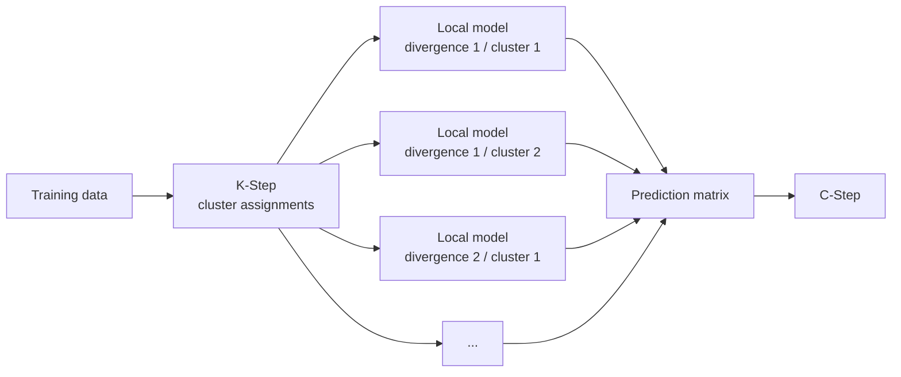

# Configure F-Step

The **F-Step** is the local supervised-learning stage of the KFC Procedure.

It receives the divergence-specific cluster assignments created by the K-Step
and fits one predictive model inside every non-empty cluster.

\[
\boxed{
\text{K-Step clusters}
\rightarrow
\text{cluster-specific supervised models}
\rightarrow
\text{prediction matrix}
}
\]

The implementation is provided by:

```python
from kfc_procedure.core.steps import FStep
```

Most users configure the F-Step indirectly through:

```python
KFCRegressor(...)
KFCClassifier(...)
```

using:

```text
local_model
local_model_params
task
random_state
```

---

## Core idea

Suppose the K-Step creates a partition for divergence \(d\):

\[
C_d
=
\{C_{d,1},C_{d,2},\ldots,C_{d,K}\}.
\]

The F-Step fits one local model for every non-empty cluster:

\[
f_{d,k}
:
X_{C_{d,k}}
\rightarrow
y_{C_{d,k}}.
\]

With several divergences, the complete collection is

\[
\mathcal{M}
=
\{
f_{d,k}
\}.
\]

Each divergence therefore gets its own set of cluster-local models.

---

## Where F-Step sits in KFC



The F-Step does not combine models itself.

Its job is to generate one prediction column per divergence. The C-Step
performs the final aggregation.

---

## Basic regression configuration

```python
from kfc_procedure import KFCRegressor

model = KFCRegressor(
    divergences=["euclidean"],
    local_model="ridge",
    combiner="mean",
    n_clusters=3,
    random_state=42,
)
```

The F-Step is created internally as:

```python
FStep(
    local_model="ridge",
    local_model_params={},
    task="regression",
    random_state=42,
)
```

---

## Basic classification configuration

```python
from kfc_procedure import KFCClassifier

model = KFCClassifier(
    divergences=["euclidean"],
    local_model="logistic_regression",
    combiner="majority_vote",
    n_clusters=3,
    random_state=42,
)
```

Internally:

```python
FStep(
    local_model="logistic_regression",
    local_model_params={},
    task="classification",
    random_state=42,
)
```

---

## F-Step inputs

The direct API is:

```python
fstep.fit(
    X,
    y,
    clusters,
)
```

where:

```text
X
    feature matrix

y
    regression targets or class labels

clusters
    dictionary of cluster assignments from K-Step
```

A typical cluster dictionary looks like:

```python
{
    "euclidean": np.array([0, 1, 1, 0, 2, ...]),
    "gkl": np.array([1, 1, 0, 2, 2, ...]),
}
```

Every cluster array must correspond row-for-row with `X` and `y`.

---

## How fitting works

The source implementation loops over:

```python
for div_name, cluster_ids in clusters.items():
    for k in np.unique(cluster_ids):
        ...
```

For every divergence and every observed cluster ID, it:

1. selects the rows belonging to that cluster;
2. creates or resolves the configured local model;
3. fits the model on the cluster-specific subset;
4. stores the fitted model in `models_`.

Conceptually:

```text
divergence = euclidean

cluster 0
X[cluster == 0], y[cluster == 0]
            │
            ▼
       local model 0

cluster 1
X[cluster == 1], y[cluster == 1]
            │
            ▼
       local model 1

cluster 2
X[cluster == 2], y[cluster == 2]
            │
            ▼
       local model 2
```

The same process is repeated independently for every divergence.

---

## Fitted model structure

After fitting:

```python
fstep.models_
```

is a nested dictionary.

Its actual structure is:

```python
{
    "euclidean": {
        "m0": {
            "divergence": "euclidean",
            "cluster": 0,
            "model": fitted_model,
        },
        "m1": {
            "divergence": "euclidean",
            "cluster": 1,
            "model": fitted_model,
        },
    },
    "gkl": {
        "m0": {
            "divergence": "gkl",
            "cluster": 0,
            "model": fitted_model,
        },
    },
}
```

!!! note "Storage format"

    The implementation documentation describes `models_[divergence][cluster]`,
    but the current source actually stores the second-level keys as strings:

    ```text
    m0
    m1
    m2
    ...
    ```

    The numeric cluster ID is stored inside:

    ```python
    metadata["cluster"]
    ```

---

## Inspect fitted local models

After fitting a complete KFC estimator:

```python
fstep = model.fstep_
```

Inspect the available divergence model sets:

```python
print(
    fstep.models_.keys()
)
```

Inspect every local model:

```python
for divergence, models in fstep.models_.items():
    print(divergence)

    for model_name, metadata in models.items():
        print(
            model_name,
            "cluster=",
            metadata["cluster"],
            "model=",
            type(metadata["model"]).__name__,
        )
```

---

## Number of local models

If the K-Step uses:

- \(M\) divergences;
- \(K\) clusters per divergence;

then the F-Step can fit up to

\[
M\times K
\]

models.

For example:

```python
divergences=[
    "euclidean",
    "gkl",
    "logistic",
    "is",
]

n_clusters=3
```

normally produces up to:

\[
4\times3=12
\]

local models.

Only cluster IDs that actually occur in the supplied cluster assignments are
fitted.

---

## Empty clusters

The F-Step contains:

```python
if np.sum(idx) == 0:
    continue
```

so an empty cluster is skipped.

In normal KFC usage, the K-Step itself reinitializes empty centroids during
clustering, so the training assignments will generally contain only
cluster IDs represented by observations.

The F-Step does not create a fallback model for an empty cluster.

---

## Choosing a local model

`local_model` can currently be:

```text
a registered string name
```

or:

```text
a pre-instantiated BaseLocalModel-compatible object
```

String-based models are resolved through:

```python
LocalModelFactory
```

---

# String-based local models

String names are normalized to lower case:

```python
name = self.local_model.lower()
```

The F-Step checks:

```python
LocalModelFactory.contains(name)
```

and then validates that the model supports the current task:

```python
LocalModelFactory.supports(
    name,
    self.task,
)
```

This prevents a classifier from being used in regression and vice versa.

---

## Regression model example

```python
model = KFCRegressor(
    divergences=["euclidean"],
    local_model="ridge",
    combiner="mean",
)
```

---

## Classification model example

```python
model = KFCClassifier(
    divergences=["euclidean"],
    local_model="logistic_regression",
    combiner="majority_vote",
)
```

---

## Automatic scikit-learn registration

The package dynamically discovers scikit-learn estimators with:

```python
sklearn.utils.all_estimators()
```

It selects classes that are:

```text
ClassifierMixin
```

or:

```text
RegressorMixin
```

and registers them in `LocalModelFactory`.

The estimator class name is converted to snake case.

For example:

```text
LinearRegression
    -> linear_regression

LogisticRegression
    -> logistic_regression

RandomForestRegressor
    -> random_forest_regressor

RandomForestClassifier
    -> random_forest_classifier

KNeighborsRegressor
    -> k_neighbors_regressor

KNeighborsClassifier
    -> k_neighbors_classifier
```

This means the available local-model set depends partly on the installed
scikit-learn version.

---

## Inspect available model names

You can query the registry directly.

```python
from kfc_procedure.core.ml.base import LocalModelFactory

print(
    LocalModelFactory.available_by_category(
        "regression"
    )
)
```

For classification:

```python
print(
    LocalModelFactory.available_by_category(
        "classification"
    )
)
```

This is more reliable than maintaining a hard-coded list in application code.

---

## Configure model parameters

Use:

```python
local_model_params
```

to pass constructor parameters to a string-based model.

### Ridge

```python
model = KFCRegressor(
    divergences=["euclidean"],
    local_model="ridge",
    local_model_params={
        "alpha": 2.0,
    },
    combiner="mean",
)
```

### Random forest regression

```python
model = KFCRegressor(
    divergences=["euclidean"],
    local_model="random_forest_regressor",
    local_model_params={
        "n_estimators": 300,
        "max_depth": 8,
        "min_samples_leaf": 3,
    },
    combiner="mean",
    random_state=42,
)
```

### Logistic regression

```python
model = KFCClassifier(
    divergences=["euclidean"],
    local_model="logistic_regression",
    local_model_params={
        "C": 1.0,
        "max_iter": 1000,
    },
    combiner="majority_vote",
    random_state=42,
)
```

---

## How unsupported parameters are handled

String-based scikit-learn models are wrapped by:

```python
SklearnLocalModel
```

Before constructing the estimator, the adapter inspects:

```python
model_cls.__init__
```

and keeps only keyword arguments that appear in that constructor signature.

Conceptually:

```python
valid_kwargs = {
    key: value
    for key, value in kwargs.items()
    if key in signature.parameters
}
```

Therefore unknown constructor arguments are silently discarded by the current
adapter rather than raising an error.

!!! warning "Parameter typo behavior"

    A misspelled parameter can be silently ignored.

    For example, if an estimator expects:

    ```python
    n_estimators
    ```

    and you write:

    ```python
    n_estimator
    ```

    the wrapper may drop the misspelled argument.

    Check the fitted estimator's parameters when configuration correctness is
    important.

---

## Inspect the actual estimator parameters

The wrapper implements:

```python
get_params()
```

by delegating to the underlying scikit-learn model.

Example:

```python
metadata = next(
    iter(
        model.fstep_.models_["euclidean"].values()
    )
)

local_model = metadata["model"]

print(
    local_model.get_params()
)
```

For scikit-learn-backed models, this returns the wrapped estimator's fitted
configuration.

---

## `random_state`

For string-based models, F-Step copies:

```python
local_model_params
```

and then adds:

```python
random_state=self.random_state
```

if the parameter is not already present.

Therefore:

```python
model = KFCRegressor(
    ...,
    random_state=42,
)
```

attempts to pass:

```python
random_state=42
```

to every local model.

The `SklearnLocalModel` adapter removes it automatically for estimator classes
whose constructor does not accept `random_state`.

If you specify a local value explicitly:

```python
local_model_params={
    "random_state": 123,
}
```

that value takes precedence over the top-level KFC seed.

---

## Same model type in every cluster

`local_model` and `local_model_params` are global F-Step settings.

Therefore all clusters use the same model class and parameter configuration.

For example:

```python
local_model="ridge"

local_model_params={
    "alpha": 2.0,
}
```

means:

```text
Euclidean / cluster 0 -> Ridge(alpha=2)
Euclidean / cluster 1 -> Ridge(alpha=2)
Euclidean / cluster 2 -> Ridge(alpha=2)

GKL / cluster 0       -> Ridge(alpha=2)
GKL / cluster 1       -> Ridge(alpha=2)
GKL / cluster 2       -> Ridge(alpha=2)
```

The current `FStep` API does not provide different model types or parameter
sets per divergence or per cluster.

---

## Independent instances for string models

When `local_model` is a string, `_resolve()` calls:

```python
LocalModelFactory.create(...)
```

for every cluster.

Therefore each cluster receives a newly created local-model object.

This is the recommended way to configure F-Step.

---

# Prediction

After fitting, call:

```python
predictions = fstep.predict(
    X,
    clusters,
)
```

The F-Step creates one output column for every divergence.

For each divergence:

```python
pred = np.full(
    X.shape[0],
    np.nan,
)
```

It then routes each observation to the local model corresponding to its
predicted cluster ID.

---

## Routing logic

For one local model:

```python
k = metadata["cluster"]

idx = cluster_ids == k

pred[idx] = model.predict(
    X[idx]
)
```

Conceptually:

```text
new observation
      │
      ▼
K-Step cluster ID
      │
      ▼
look up local model
      │
      ▼
model.predict(...)
```

This happens independently for every divergence.

---

## Prediction matrix shape

The returned matrix has shape:

```text
(n_samples, n_divergences)
```

For four divergences:

```text
(n_samples, 4)
```

Example regression output:

```text
[[12.5, 13.1, 12.8, 12.4],
 [21.7, 20.9, 21.2, 22.0],
 [ 8.3,  8.0,  8.5,  8.2]]
```

Example classification output:

```text
[[0, 0, 1, 0],
 [1, 1, 1, 1],
 [2, 1, 2, 2]]
```

The matrix is consumed directly by C-Step.

---

## Column order

`predict()` iterates over:

```python
self.models_.items()
```

so the output columns follow the insertion order of the divergence entries in
`models_`.

Those entries were created from the `clusters` dictionary supplied during
`fit()`.

In normal KFC use, that dictionary comes from K-Step and follows the divergence
order used there.

If using `FStep` directly, keep cluster dictionaries consistent between
fitting and prediction.

---

## Missing predictions and `NaN`

For each divergence, the prediction vector begins filled with:

```python
np.nan
```

Only observations whose cluster ID matches one of the stored local models are
filled.

Therefore `NaN` can remain if prediction-time cluster IDs do not correspond to
a stored model.

This should not normally happen when K-Step and F-Step come from the same
fitted KFC pipeline.

If it does happen, inspect:

```python
model.kstep_.clusters_
model.fstep_.models_
```

and:

```python
model.kstep_.predict(X)
```

to check cluster IDs.

---

## Direct F-Step example

You can use `FStep` directly.

```python
import numpy as np

from kfc_procedure.core.steps import FStep


X = np.array([
    [0.0],
    [0.2],
    [0.8],
    [1.0],
])

y = np.array([
    0.0,
    0.2,
    0.8,
    1.0,
])

clusters = {
    "euclidean": np.array([
        0,
        0,
        1,
        1,
    ]),
}

fstep = FStep(
    local_model="linear_regression",
    task="regression",
)

fstep.fit(
    X,
    y,
    clusters,
)

P = fstep.predict(
    X,
    clusters,
)

print(P)
```

With one divergence:

```text
P.shape == (4, 1)
```

---

# Classification-specific behavior

Classification requires particular attention because a cluster can contain
only one class.

Suppose:

```text
cluster 0 -> [0, 0, 0, 0]
cluster 1 -> [0, 1, 0, 1]
```

A model such as logistic regression cannot be fitted on cluster 0 because it
contains only one target class.

---

## F-Step error wrapping

The source wraps any `ValueError` raised during local-model fitting:

```python
try:
    model.fit(Xc, yc)

except ValueError as e:
    raise ValueError(
        "[FSTEP ERROR] ..."
    ) from e
```

The resulting message includes:

```text
divergence
cluster ID
original error reason
hint about invalid label distribution
```

Example structure:

```text
[FSTEP ERROR] divergence='euclidean', cluster=2 failed.
Reason: ...
Hint: cluster contains invalid label distribution.
```

!!! note

    The same wrapper is applied to regression and classification.

    The hint always mentions label distribution even when the underlying
    `ValueError` has a different cause.

---

## Reducing single-class cluster risk

For classification, increasing `n_clusters` produces smaller local datasets.

```text
more clusters
     ↓
fewer samples per cluster
     ↓
higher probability of a single-class cluster
```

If a local classifier fails, try:

```text
reduce n_clusters
use more training data
change divergence
choose another local classifier
inspect class imbalance
```

---

## Class weights

If the selected classifier supports `class_weight`, pass it through
`local_model_params`.

```python
model = KFCClassifier(
    divergences=["euclidean"],
    local_model="logistic_regression",
    local_model_params={
        "max_iter": 1000,
        "class_weight": "balanced",
    },
    combiner="majority_vote",
    n_clusters=3,
    random_state=42,
)
```

This can help imbalanced multi-class clusters, but it does not solve a cluster
containing only one class.

---

# `predict_proba()` support

The local-model abstraction defines:

```python
BaseLocalModel.predict_proba(...)
```

and `SklearnLocalModel` can delegate to an underlying estimator when that
estimator supports:

```python
predict_proba
```

For example, the wrapper records:

```python
self._has_proba = hasattr(
    self.model,
    "predict_proba",
)
```

and then calls:

```python
self.model.predict_proba(X)
```

when available.

However, the **current `FStep` class does not implement a `predict_proba()`
method**.

It only implements:

```python
fit(...)
predict(...)
```

Therefore probability-capable local classifiers cannot currently be combined
through a top-level F-Step probability matrix.

!!! warning "Current KFC limitation"

    `KFCClassifier.predict_proba()` attempts to use
    `self.fstep_.predict_proba(...)`, but that method is absent from the
    current `FStep` implementation.

    End-to-end KFC probabilities are therefore not functional in this source
    version.

---

# Custom local models

The abstract local-model interface is:

```python
BaseLocalModel
```

A custom model should implement:

```python
fit(...)
predict(...)
```

and optionally:

```python
predict_proba(...)
```

for classification.

A minimal regression example:

```python
import numpy as np

from kfc_procedure.core.ml.base import BaseLocalModel


class ConstantRegressor(BaseLocalModel):

    def fit(self, X, y):
        self.value_ = float(
            np.mean(y)
        )
        return self

    def predict(self, X):
        return np.full(
            len(X),
            self.value_,
            dtype=float,
        )
```

---

## Register a custom local model

Register a model with:

```python
LocalModelFactory
```

Example:

```python
from kfc_procedure.core.ml.base import (
    BaseLocalModel,
    LocalModelFactory,
)


@LocalModelFactory.register(
    "constant_regressor",
    categories={"regression"},
)
class ConstantRegressor(BaseLocalModel):
    ...
```

Then:

```python
model = KFCRegressor(
    divergences=["euclidean"],
    local_model="constant_regressor",
    combiner="mean",
)
```

---

## Constructor compatibility with F-Step

For string-based models, F-Step automatically injects:

```python
random_state=...
```

unless it already exists in `local_model_params`.

Unlike the scikit-learn adapter, a directly registered custom class receives
all arguments directly from the factory.

Therefore a custom registered model should either:

```python
def __init__(
    self,
    random_state=None,
    ...
):
    ...
```

or otherwise accept the kwargs that F-Step will supply.

This is important for custom registry entries.

---

# Important behavior of pre-instantiated model objects

`FStep` accepts a non-string object through:

```python
local_model=some_model
```

but the current implementation resolves it as:

```python
if not isinstance(
    self.local_model,
    str,
):
    return self.local_model
```

That means it returns the **same object instance for every cluster**.

It does not call:

```python
sklearn.base.clone(...)
```

and it does not create a copy.

---

## Why this matters

Suppose:

```python
custom_model = MyLocalModel()

fstep = FStep(
    local_model=custom_model,
)
```

During fitting:

```text
cluster 0 -> custom_model.fit(...)
cluster 1 -> same custom_model.fit(...)
cluster 2 -> same custom_model.fit(...)
```

The same object is repeatedly refitted.

The metadata stored for different clusters can therefore point to the same
Python object, whose final fitted state corresponds to the last fit.

!!! warning "Prefer string-based models"

    With the current source implementation, pass a registered **string model
    name** when you need an independent model per cluster.

    Pre-instantiated model objects are not cloned before being fitted.

This is an implementation-specific limitation worth considering when extending
F-Step.

---

# Built-in `mean_regressor`

The source registers:

```text
mean_regressor
dummy_mean
```

through the `MeanRegressor` class.

It wraps:

```python
DummyRegressor(
    strategy="mean",
)
```

Conceptually it is a useful local baseline because every cluster predicts its
mean target.

However, there is a compatibility issue in the current source.

`FStep._resolve()` injects:

```python
random_state=self.random_state
```

for every string-based local model.

`MeanRegressor.__init__()` currently has the signature:

```python
def __init__(self) -> None:
```

and does not accept `random_state`.

Because `MeanRegressor` is registered directly rather than through the
`SklearnLocalModel` filtering adapter, factory construction can receive an
unsupported keyword argument.

!!! warning "Current source issue"

    In the current implementation, using:

    ```python
    local_model="mean_regressor"
    ```

    or:

    ```python
    local_model="dummy_mean"
    ```

    through `FStep` can raise a constructor `TypeError` because of the
    automatically supplied `random_state`.

    Until the constructor or `_resolve()` logic is adjusted, prefer another
    registered regressor for KFC F-Step usage.

---

# Task validation

F-Step validates the selected model category.

For regression:

```python
LocalModelFactory.supports(
    name,
    "regression",
)
```

must be true.

For classification:

```python
LocalModelFactory.supports(
    name,
    "classification",
)
```

must be true.

If not, F-Step raises:

```text
{name} not supported for task={task}.
Available: ...
```

---

## Invalid model name

For an unknown model:

```python
local_model="not_a_model"
```

F-Step raises:

```text
Invalid local model: not_a_model.
Available: ...
```

This error occurs when fitting begins, not when the top-level KFC object is
constructed.

---

# F-Step and C-Step connection

The prediction matrix created by F-Step is the only information from local
models passed to C-Step.

For regression:

```text
                 divergence predictions
sample 1   [12.2, 11.8, 12.5, 12.0]
sample 2   [18.6, 19.1, 18.8, 18.5]
```

For classification:

```text
                 divergence predictions
sample 1   [0, 0, 1, 0]
sample 2   [1, 1, 1, 1]
```

C-Step does not directly access the cluster-specific estimators.

This keeps the local-learning stage and aggregation stage modular.

---

## Manual inspection before C-Step

After fitting a KFC estimator:

```python
clusters = model.kstep_.predict(
    X_test
)

P_test = model.fstep_.predict(
    X_test,
    clusters,
)

print(
    P_test.shape
)

print(
    P_test[:5]
)
```

This is useful for debugging the information presented to the combiner.

---

# Recommended regression configuration

```python
model = KFCRegressor(
    divergences=[
        "euclidean",
        "gkl",
    ],
    local_model="ridge",
    local_model_params={
        "alpha": 1.0,
    },
    combiner="weighted_mean",
    n_clusters=3,
    random_state=42,
)
```

For arbitrary real-valued inputs, start with:

```python
divergences=["euclidean"]
```

unless preprocessing makes the other divergence domains valid.

---

# Recommended classification configuration

```python
model = KFCClassifier(
    divergences=["euclidean"],
    local_model="logistic_regression",
    local_model_params={
        "max_iter": 1000,
    },
    combiner="majority_vote",
    n_clusters=3,
    random_state=42,
)
```

If single-class clusters occur, reduce:

```python
n_clusters
```

before making the local classifier more complex.

---

# Debugging F-Step

## 1. Inspect available model names

```python
from kfc_procedure.core.ml.base import LocalModelFactory

print(
    LocalModelFactory.available_by_category(
        "regression"
    )
)
```

or:

```python
print(
    LocalModelFactory.available_by_category(
        "classification"
    )
)
```

---

## 2. Inspect training clusters

```python
for divergence, labels in model.kstep_.clusters_.items():
    unique, counts = np.unique(
        labels,
        return_counts=True,
    )

    print(
        divergence,
        dict(zip(unique, counts)),
    )
```

Very small clusters can be problematic for local learning.

---

## 3. Inspect fitted model count

```python
for divergence, models in model.fstep_.models_.items():
    print(
        divergence,
        len(models),
    )
```

Compare this with the number of cluster IDs produced by the K-Step.

---

## 4. Inspect model types

```python
for divergence, models in model.fstep_.models_.items():
    for name, metadata in models.items():
        print(
            divergence,
            name,
            type(
                metadata["model"]
            ).__name__,
        )
```

---

## 5. Check prediction matrix for NaN

```python
clusters = model.kstep_.predict(
    X_test
)

P = model.fstep_.predict(
    X_test,
    clusters,
)

print(
    np.isnan(P).any()
)
```

For numeric regression output, the expected value is normally:

```text
False
```

For classification with non-numeric labels, `np.isnan()` may not be
appropriate; inspect the output directly instead.

---

## 6. Check local classification label support

If a classification fit fails, reproduce or inspect the relevant cluster and
check:

```python
np.unique(
    y_cluster,
    return_counts=True,
)
```

A single unique class is a common cause of failure for logistic regression and
similar classifiers.

---

# Current F-Step limitations

The present source implementation has several important constraints:

| Limitation | Current behavior |
| --- | --- |
| different model per divergence | not supported |
| different parameters per cluster | not supported |
| pre-instantiated model cloning | not implemented |
| F-Step `predict_proba()` | not implemented |
| automatic local hyperparameter tuning | not implemented |
| fallback model for unseen/missing cluster model | not implemented |
| unknown sklearn kwargs | silently filtered by adapter |
| direct custom-class kwargs | passed without filtering |

These are implementation details of the current version, not requirements of
the general KFC methodology.

---

# Parameter summary

| Parameter | Default | Purpose |
| --- | --- | --- |
| `local_model` | required | local learner name or object |
| `local_model_params` | `{}` | constructor arguments |
| `task` | `"regression"` | registry category validation |
| `random_state` | `None` | seed forwarded to string-based local models |

---

# Mental model

!!! quote ""

    **The K-Step decides where an observation belongs; the F-Step decides which
    local predictive model should handle it.**

\[
\boxed{
\text{divergence}
\rightarrow
\text{cluster}
\rightarrow
\text{local model}
\rightarrow
\text{prediction}
}
\]

Across several divergences:

\[
x
\rightarrow
\left(
f_{1,c_1(x)}(x),
f_{2,c_2(x)}(x),
\ldots,
f_{M,c_M(x)}(x)
\right)
\rightarrow
\text{C-Step}.
\]

