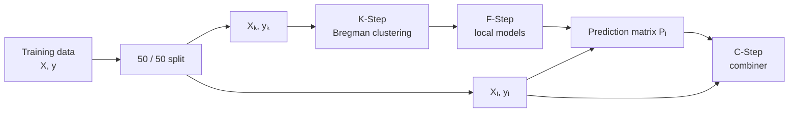

# Fitting KFC

This guide shows how to fit the complete **KFC Procedure** with the
`kfc-procedure` package.

KFC is implemented as a three-stage pipeline:

\[
\boxed{
\text{K-Step}
\rightarrow
\text{F-Step}
\rightarrow
\text{C-Step}
}
\]

where:

1. **K-Step** builds one clustering for each selected Bregman divergence.
2. **F-Step** fits a local predictive model inside every cluster.
3. **C-Step** combines the divergence-specific predictions into one final
   prediction.

The main estimators are:

```python
from kfc_procedure import (
    KFCProcedure,
    KFCRegressor,
    KFCClassifier,
)
```

For most applications, use `KFCRegressor` or `KFCClassifier`.

---

## Minimal regression example

The smallest practical KFC regression model can use one divergence, one local
regressor, and a simple mean combiner.

```python
from kfc_procedure import KFCRegressor

model = KFCRegressor(
    divergences=["euclidean"],
    local_model="linear_regression",
    combiner="mean",
    n_clusters=3,
    random_state=42,
)

model.fit(X_train, y_train)

y_pred = model.predict(X_test)
```

This configuration performs:

```text
X_train
   │
   ▼
Squared-Euclidean K-means
   │
   ▼
3 clusters
   │
   ▼
one LinearRegression per cluster
   │
   ▼
divergence-specific prediction
   │
   ▼
mean combiner
   │
   ▼
final prediction
```

!!! note

    With only one divergence, the C-Step has only one prediction column to
    combine. This is useful for learning the API, but the full KFC idea is to
    use several divergence-induced partitions.

---

## Minimal classification example

For classification, use `KFCClassifier`.

```python
from kfc_procedure import KFCClassifier

model = KFCClassifier(
    divergences=["euclidean"],
    local_model="logistic_regression",
    combiner="majority_vote",
    n_clusters=3,
    random_state=42,
)

model.fit(X_train, y_train)

y_pred = model.predict(X_test)
```

The classifier automatically uses a stratified 50/50 internal split when
possible.

---

## Complete fitting workflow

Calling

```python
model.fit(X, y)
```

runs the complete pipeline.



Internally, the implementation uses:

```python
X_k, X_l, y_k, y_l = train_test_split(
    X,
    y,
    test_size=0.5,
    random_state=random_state,
    stratify=y if task == "classification" else None,
)
```

Therefore:

<div class="grid cards" markdown>

-   :material-database-outline:{ .lg .middle } **\(D_k\)**

    ---

    Used by the K-Step and F-Step.

    The cluster models and local predictive models are fitted here.

-   :material-source-branch:{ .lg .middle } **\(D_l\)**

    ---

    Passed through the fitted K-Step and F-Step.

    Its prediction matrix is used to train the C-Step.

</div>

This separation prevents the combiner from being trained directly on the same
observations used to fit the local models.

---

## Step 1 — Choose divergences

The `divergences` argument controls the candidate clustering geometries.

The package currently registers:

| Name | Divergence | Input domain |
| --- | --- | --- |
| `euclidean` | Squared Euclidean | \(\mathbb{R}^d\) |
| `gkl` | Generalized Kullback–Leibler | \((0,\infty)^d\) |
| `logistic` | Logistic Bregman divergence | \((0,1)^d\) |
| `is` | Itakura–Saito | \((0,\infty)^d\) |

A single divergence is passed as a list:

```python
model = KFCRegressor(
    divergences=["euclidean"],
    local_model="linear_regression",
    combiner="mean",
)
```

For several clustering views:

```python
model = KFCRegressor(
    divergences=[
        "euclidean",
        "gkl",
        "logistic",
        "is",
    ],
    local_model="linear_regression",
    combiner="mean",
    random_state=42,
)
```

!!! warning "Respect divergence domains"

    The implementation does not automatically transform arbitrary data into
    the domain required by each divergence.

    In particular:

    - `gkl` requires strictly positive values;
    - `is` requires strictly positive values;
    - `logistic` requires every value to satisfy \(0 < x < 1\).

    If one model uses all four divergences, the input data must satisfy all
    four domain requirements.

---

## Preparing data for several divergences

A convenient strategy for examples is to transform every feature into a
strictly interior interval such as

\[
[\varepsilon,1-\varepsilon].
\]

For example:

```python
from sklearn.preprocessing import MinMaxScaler

eps = 1e-6

scaler = MinMaxScaler(
    feature_range=(eps, 1.0 - eps),
)

X_train_scaled = scaler.fit_transform(X_train)
X_test_scaled = scaler.transform(X_test)
```

Then all values are positive and remain inside \((0,1)\), which is compatible
with:

```text
euclidean
gkl
logistic
is
```

You can then fit:

```python
model = KFCRegressor(
    divergences=[
        "euclidean",
        "gkl",
        "logistic",
        "is",
    ],
    local_model="linear_regression",
    combiner="mean",
    n_clusters=3,
    random_state=42,
)

model.fit(X_train_scaled, y_train)

y_pred = model.predict(X_test_scaled)
```

!!! important

    Fit preprocessing only on the outer training set and apply the same
    transformation to validation or test data.

---

## Step 2 — Choose the local model

The `local_model` argument controls what is fitted inside every cluster.

For regression:

```python
model = KFCRegressor(
    divergences=["euclidean"],
    local_model="ridge",
    combiner="mean",
)
```

For classification:

```python
model = KFCClassifier(
    divergences=["euclidean"],
    local_model="logistic_regression",
    combiner="majority_vote",
)
```

The package automatically registers scikit-learn regressors and classifiers
using snake-case names.

Examples include:

### Regression

```text
linear_regression
ridge
ridge_cv
lasso
lasso_cv
random_forest_regressor
k_neighbors_regressor
svr
mean_regressor
```

### Classification

```text
logistic_regression
decision_tree_classifier
random_forest_classifier
k_neighbors_classifier
svc
```

!!! note

    The available set is broader than the examples above because compatible
    scikit-learn estimators are auto-registered.

---

## Configure the local model

Pass constructor parameters through `local_model_params`.

```python
model = KFCRegressor(
    divergences=["euclidean"],
    local_model="random_forest_regressor",
    local_model_params={
        "n_estimators": 300,
        "max_depth": 8,
    },
    combiner="mean",
    random_state=42,
)
```

For classification:

```python
model = KFCClassifier(
    divergences=["euclidean"],
    local_model="logistic_regression",
    local_model_params={
        "max_iter": 1000,
        "C": 1.0,
    },
    combiner="majority_vote",
    random_state=42,
)
```

When supported by the selected estimator, `random_state` is automatically
forwarded unless you explicitly provide it in `local_model_params`.

---

## How many local models are fitted?

Suppose you use:

```python
divergences=[
    "euclidean",
    "gkl",
    "logistic",
    "is",
]

n_clusters=3
```

Then the F-Step can fit up to

\[
4\times3=12
\]

local models.

Conceptually:

```text
Euclidean
├── cluster 0 -> local model
├── cluster 1 -> local model
└── cluster 2 -> local model

GKL
├── cluster 0 -> local model
├── cluster 1 -> local model
└── cluster 2 -> local model

Logistic
├── cluster 0 -> local model
├── cluster 1 -> local model
└── cluster 2 -> local model

Itakura-Saito
├── cluster 0 -> local model
├── cluster 1 -> local model
└── cluster 2 -> local model
```

The fitted models are available from:

```python
model.fstep_.models_
```

---

## Step 3 — Choose the combiner

The `combiner` argument configures the C-Step.

The C-Step receives one prediction column per divergence.

If four divergences are used, the aggregation matrix has the form

\[
P_l
=
\begin{bmatrix}
p_{\text{euclidean}}(X_1) &
p_{\text{gkl}}(X_1) &
p_{\text{logistic}}(X_1) &
p_{\text{is}}(X_1)
\\
\vdots & \vdots & \vdots & \vdots
\\
p_{\text{euclidean}}(X_n) &
p_{\text{gkl}}(X_n) &
p_{\text{logistic}}(X_n) &
p_{\text{is}}(X_n)
\end{bmatrix}.
\]

The combiner learns or applies

\[
P_l\longrightarrow y_l.
\]

---

## Regression combiners

The current regression combiners include:

| Name | Description |
| --- | --- |
| `mean` | arithmetic mean across divergence predictions |
| `weighted_mean` | linear-regression weights |
| `stacking_regressor` | regression meta-model |
| `gradientcobra` | GradientCOBRA aggregation |
| `mixcobra` | MixCOBRA aggregation |

### Mean

```python
model = KFCRegressor(
    divergences=["euclidean", "gkl"],
    local_model="ridge",
    combiner="mean",
)
```

### Weighted mean

```python
model = KFCRegressor(
    divergences=["euclidean", "gkl"],
    local_model="ridge",
    combiner="weighted_mean",
    combiner_params={
        "fit_intercept": False,
    },
)
```

### Stacking

```python
model = KFCRegressor(
    divergences=["euclidean", "gkl"],
    local_model="ridge",
    combiner="stacking_regressor",
)
```

### GradientCOBRA

```python
model = KFCRegressor(
    divergences=["euclidean", "gkl"],
    local_model="ridge",
    combiner="gradientcobra",
    combiner_params={
        "kernel": "rbf",
        "distance": "euclidean",
        "random_state": 42,
    },
)
```

The KFC combiner passes the F-Step prediction matrix directly to
GradientCOBRA as precomputed prediction features.

### MixCOBRA

```python
model = KFCRegressor(
    divergences=["euclidean", "gkl"],
    local_model="ridge",
    combiner="mixcobra",
    combiner_params={
        "kernel": "rbf",
        "distance": "euclidean",
        "random_state": 42,
    },
)
```

Inside KFC, MixCOBRA also receives the F-Step matrix through
`as_predictions=True`.

---

## Classification combiners

The current classification combiners include:

| Name | Description |
| --- | --- |
| `majority_vote` | hard vote across divergence predictions |
| `stacking_classifier` | logistic-regression meta-classifier |
| `combined_classifier` | prediction-space consensus classifier |

### Majority vote

```python
model = KFCClassifier(
    divergences=["euclidean"],
    local_model="logistic_regression",
    combiner="majority_vote",
)
```

### Stacking classifier

```python
model = KFCClassifier(
    divergences=["euclidean"],
    local_model="logistic_regression",
    combiner="stacking_classifier",
    random_state=42,
)
```

### CombinedClassifier

```python
model = KFCClassifier(
    divergences=["euclidean"],
    local_model="logistic_regression",
    combiner="combined_classifier",
    combiner_params={
        "distance": "hamming",
        "kernel": "rbf",
    },
    random_state=42,
)
```

---

## Full regression example

The following example uses several divergences safely by scaling the input to
\((0,1)\).

```python
import numpy as np

from sklearn.datasets import make_regression
from sklearn.metrics import mean_squared_error
from sklearn.model_selection import train_test_split
from sklearn.preprocessing import MinMaxScaler

from kfc_procedure import KFCRegressor


# 1. Create data
X, y = make_regression(
    n_samples=1200,
    n_features=8,
    noise=12.0,
    random_state=42,
)

X_train, X_test, y_train, y_test = train_test_split(
    X,
    y,
    test_size=0.2,
    random_state=42,
)


# 2. Respect all divergence domains
eps = 1e-6

scaler = MinMaxScaler(
    feature_range=(eps, 1.0 - eps),
)

X_train = scaler.fit_transform(X_train)
X_test = scaler.transform(X_test)


# 3. Configure KFC
model = KFCRegressor(
    divergences=[
        "euclidean",
        "gkl",
        "logistic",
        "is",
    ],
    local_model="ridge",
    combiner="weighted_mean",
    combiner_params={
        "fit_intercept": False,
    },
    n_clusters=3,
    max_iter=300,
    tol=1e-4,
    random_state=42,
)


# 4. Fit
model.fit(X_train, y_train)


# 5. Predict
y_pred = model.predict(X_test)


# 6. Evaluate
rmse = mean_squared_error(
    y_test,
    y_pred,
) ** 0.5

print("RMSE:", rmse)
```

---

## Full classification example

```python
from sklearn.datasets import make_classification
from sklearn.metrics import accuracy_score
from sklearn.model_selection import train_test_split
from sklearn.preprocessing import MinMaxScaler

from kfc_procedure import KFCClassifier


X, y = make_classification(
    n_samples=1200,
    n_features=8,
    n_informative=6,
    random_state=42,
)

X_train, X_test, y_train, y_test = train_test_split(
    X,
    y,
    test_size=0.2,
    stratify=y,
    random_state=42,
)


eps = 1e-6

scaler = MinMaxScaler(
    feature_range=(eps, 1.0 - eps),
)

X_train = scaler.fit_transform(X_train)
X_test = scaler.transform(X_test)


model = KFCClassifier(
    divergences=[
        "euclidean",
        "gkl",
        "logistic",
        "is",
    ],
    local_model="logistic_regression",
    local_model_params={
        "max_iter": 1000,
    },
    combiner="majority_vote",
    n_clusters=3,
    random_state=42,
)

model.fit(X_train, y_train)

y_pred = model.predict(X_test)

accuracy = accuracy_score(
    y_test,
    y_pred,
)

print("Accuracy:", accuracy)
```

---

## Prediction after fitting

Calling:

```python
y_pred = model.predict(X_new)
```

runs all three fitted stages.


More precisely:

1. `kstep_.predict(X)` assigns each sample to one cluster for every divergence.
2. `fstep_.predict(X, clusters)` selects the corresponding local model.
3. The F-Step returns one prediction column per divergence.
4. `cstep_.predict(P)` combines those columns.

---

## Understanding the F-Step prediction matrix

Suppose:

```python
divergences=[
    "euclidean",
    "gkl",
    "logistic",
]
```

Then for \(n\) observations, the F-Step returns a matrix with shape

```text
(n_samples, 3)
```

Conceptually:

```text
             euclidean      gkl      logistic
sample 1        18.4        17.9       18.2
sample 2        25.1        24.6       26.0
sample 3         7.8         8.1        7.6
```

This matrix is what the C-Step sees.

You can reproduce it manually after fitting:

```python
clusters = model.kstep_.predict(X_test)

P = model.fstep_.predict(
    X_test,
    clusters,
)

print(P.shape)
```

---

## Inspect the fitted K-Step

After fitting:

```python
model.kstep_
```

contains the clustering stage.

### Fitted clustering models

```python
model.kstep_.models_
```

is a dictionary keyed by divergence name.

For example:

```python
print(model.kstep_.models_.keys())
```

may return:

```text
dict_keys([
    "euclidean",
    "gkl",
    "logistic",
    "is",
])
```

### Training cluster assignments

```python
model.kstep_.clusters_
```

stores cluster labels for the internal \(D_k\) subset.

For example:

```python
for divergence, labels in model.kstep_.clusters_.items():
    print(
        divergence,
        labels.shape,
        set(labels),
    )
```

---

## Inspect the fitted F-Step

The local models are stored in:

```python
model.fstep_.models_
```

Its structure is:

```text
models_
└── divergence name
    └── cluster model key
        ├── divergence
        ├── cluster
        └── model
```

For example:

```python
for divergence, models in model.fstep_.models_.items():
    print(divergence)

    for name, info in models.items():
        print(
            " ",
            name,
            "cluster=",
            info["cluster"],
            "model=",
            type(info["model"]).__name__,
        )
```

---

## Inspect the fitted C-Step

The fitted aggregation strategy is stored in:

```python
model.cstep_.strategy_
```

For example:

```python
print(
    type(model.cstep_.strategy_).__name__
)
```

If using `weighted_mean`, you can access its fitted linear model:

```python
strategy = model.cstep_.strategy_

print(strategy.model.coef_)
```

If using a COBRA combiner:

```python
strategy = model.cstep_.strategy_

print(strategy.cobra)
```

---

## Main constructor parameters

`KFCProcedure`, `KFCRegressor`, and `KFCClassifier` share the following main
configuration.

| Parameter | Purpose |
| --- | --- |
| `divergences` | Bregman divergences used by K-Step |
| `local_model` | model fitted inside each cluster |
| `combiner` | final C-Step aggregation method |
| `divergences_params` | per-divergence constructor arguments |
| `local_model_params` | local estimator constructor arguments |
| `combiner_params` | combiner constructor arguments |
| `n_clusters` | number of clusters per divergence |
| `max_iter` | maximum Bregman K-means iterations |
| `tol` | clustering convergence tolerance |
| `verbose` | KFC logging level |
| `random_state` | reproducibility seed |

`KFCProcedure` additionally accepts:

```python
task="regression"
```

or:

```python
task="classification"
```

When using the task-specific wrappers, this is set automatically:

```python
KFCRegressor(...)
KFCClassifier(...)
```

---

## Configure divergence parameters

Parameters can be supplied per divergence using `divergences_params`.

The dictionary keys should match the divergence names used in
`divergences`.

```python
model = KFCRegressor(
    divergences=[
        "euclidean",
        "gkl",
    ],
    divergences_params={
        "euclidean": {
            # parameters for the divergence constructor
        },
        "gkl": {
            # parameters for the divergence constructor
        },
    },
    local_model="ridge",
    combiner="mean",
)
```

The current built-in divergence implementations generally do not require
ordinary user-facing hyperparameters, so this option is mainly useful for
custom divergence implementations.

---

## Configure clustering

The clustering stage is controlled by:

```python
n_clusters=3
max_iter=300
tol=1e-4
random_state=None
```

Example:

```python
model = KFCRegressor(
    divergences=["euclidean"],
    local_model="ridge",
    combiner="mean",
    n_clusters=5,
    max_iter=500,
    tol=1e-6,
    random_state=42,
)
```

### Choosing `n_clusters`

A larger `n_clusters` means:

```text
more local regions
        ↓
more local models
        ↓
fewer observations available to fit each local model
```

A smaller `n_clusters` means:

```text
fewer regions
      ↓
more observations per local model
      ↓
less local specialization
```

There is no automatic search for the best number of clusters in
`KFCProcedure`; choose it as part of model configuration or evaluate it
externally.

---

## Logging and verbose output

The `verbose` parameter controls KFC's internal logger.

```python
model = KFCRegressor(
    divergences=["euclidean"],
    local_model="ridge",
    combiner="mean",
    verbose=2,
)
```

The source defines the levels as:

```text
0 -> silent
1 -> basic information
2 -> detailed debugging
3 -> trace-level detail
```

This is useful while checking:

- the internal split,
- K-Step progress,
- F-Step fitting,
- the shape of the C-Step prediction matrix,
- prediction execution.

---

## Reproducibility

Set:

```python
random_state=42
```

to make the internal holdout split reproducible and to forward the same seed
to compatible clustering, local-model, and combiner components.

```python
model = KFCRegressor(
    divergences=["euclidean"],
    local_model="random_forest_regressor",
    combiner="mean",
    random_state=42,
)
```

!!! note

    A component can still behave differently if it does not expose or use a
    `random_state` parameter.

---

## Common errors

### Divergence domain error

A configuration such as:

```python
divergences=["gkl"]
```

cannot be applied to arbitrary negative-valued data.

Likewise:

```python
divergences=["logistic"]
```

requires

\[
0<X_{ij}<1.
\]

Transform the data first or choose a compatible divergence.

---

### Local classifier fails inside a cluster

For classification, a local cluster may contain an unsuitable label
distribution.

For example, some classifiers cannot fit when a cluster contains only one
class.

The F-Step catches the estimator's `ValueError` and reports:

```text
[FSTEP ERROR]
divergence='...'
cluster=...
```

If this happens, consider:

- reducing `n_clusters`,
- using more training data,
- trying a different divergence,
- using a local estimator that can handle the cluster,
- checking class imbalance.

---

### Invalid local model name

If the model name is not registered, the F-Step raises an error and reports the
available local models.

For example:

```python
local_model="not_a_model"
```

is invalid.

---

### Task mismatch

A classifier cannot be used as a regression local model, and vice versa.

For example:

```python
KFCRegressor(
    ...,
    local_model="logistic_regression",
)
```

is invalid because `logistic_regression` belongs to the classification
category.

---

### Invalid combiner

The C-Step validates the combiner against the selected task.

For example, `majority_vote` is a classification combiner and should not be
used by `KFCRegressor`.

---

## About `predict_proba()`

`KFCClassifier` exposes a `predict_proba()` method in `kfc.py`.

However, the current `FStep` implementation provides `predict()` but does not
define `predict_proba()`.

Therefore, in the current source version, the complete
`KFCClassifier.predict_proba()` path is not functional.

Use:

```python
model.predict(X)
```

for classification until probability propagation is implemented in the
F-Step.

!!! warning "Current implementation limitation"

    Do not document `KFCClassifier.predict_proba()` as production-ready in this
    version of the package.

---

## Recommended first configurations

For a first regression run:

```python
KFCRegressor(
    divergences=["euclidean"],
    local_model="linear_regression",
    combiner="mean",
    n_clusters=3,
    random_state=42,
)
```

For a stronger regression ensemble:

```python
KFCRegressor(
    divergences=[
        "euclidean",
        "gkl",
        "logistic",
        "is",
    ],
    local_model="ridge",
    combiner="weighted_mean",
    n_clusters=3,
    random_state=42,
)
```

after transforming the features into a compatible domain.

For first classification:

```python
KFCClassifier(
    divergences=["euclidean"],
    local_model="logistic_regression",
    combiner="majority_vote",
    n_clusters=3,
    random_state=42,
)
```

---

## Next steps

<div class="grid cards" markdown>

-   :material-numeric-1-circle:{ .lg .middle } **Configure K-Step**

    ---

    Learn how to select divergences and clustering parameters.

    [:octicons-arrow-right-24: Configure K-Step](configuring-k-step.md)

-   :material-numeric-2-circle:{ .lg .middle } **Configure F-Step**

    ---

    Choose and customize cluster-local estimators.

    [:octicons-arrow-right-24: Configure F-Step](configuring-f-step.md)

-   :material-numeric-3-circle:{ .lg .middle } **Configure C-Step**

    ---

    Choose the final aggregation method.

    [:octicons-arrow-right-24: Configure C-Step](configuring-c-step.md)

-   :material-magnify-expand:{ .lg .middle } **Inspect fitted models**

    ---

    Explore fitted cluster models, local estimators, and combiners.

    [:octicons-arrow-right-24: Inspect Fitted Models](inspecting-fitted-models.md)

</div>
