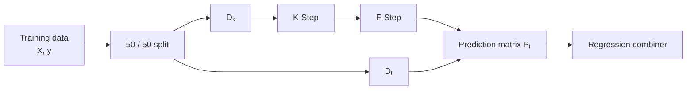
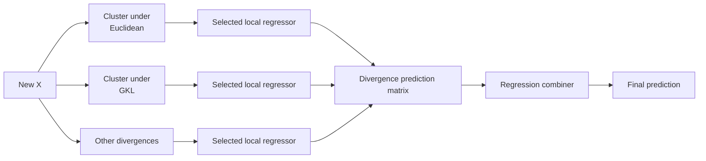

# KFC Regression

This guide shows how to use `KFCRegressor` for regression tasks.

`KFCRegressor` runs the complete KFC pipeline with

\[
\boxed{
\text{K-Step}
\rightarrow
\text{F-Step}
\rightarrow
\text{C-Step}
}
\]

for continuous targets.

Use it when the relationship between the predictors and target may vary across
unknown groups in the input space.

---

## Basic example

```python
from kfc_procedure import KFCRegressor

model = KFCRegressor(
    divergences=["euclidean"],
    local_model="linear_regression",
    combiner="mean",
    n_clusters=3,
    random_state=42,
)

model.fit(X_train, y_train)

y_pred = model.predict(X_test)
```

This configuration:

1. clusters the internal K/F training subset using squared-Euclidean
   Bregman K-means;
2. fits one linear regression model inside each cluster;
3. obtains one prediction per divergence;
4. combines the divergence-level predictions with an arithmetic mean.

---

## Regression workflow

Calling

```python
model.fit(X, y)
```

first splits the supplied training data into two equally sized subsets:

\[
D_k
\quad\text{and}\quad
D_l.
\]

For regression, the current implementation uses:

```python
train_test_split(
    X,
    y,
    test_size=0.5,
    random_state=random_state,
)
```

No stratification is applied for regression.



<div class="grid cards" markdown>

-   :material-database-outline:{ .lg .middle } **\(D_k\)**

    ---

    Used to fit the Bregman clustering models and the cluster-local regressors.

-   :material-source-branch:{ .lg .middle } **\(D_l\)**

    ---

    Passed through the fitted K-Step and F-Step to create the prediction matrix
    used to train the regression combiner.

</div>

---

## What the F-Step produces

Assume you configure three divergences:

```python
divergences=[
    "euclidean",
    "gkl",
    "logistic",
]
```

After the K-Step and F-Step, each observation receives one prediction from each
divergence-specific family of local models.

The C-Step therefore receives a matrix like:

```text
              euclidean      gkl      logistic
sample 1          15.8       16.1        15.5
sample 2          23.4       22.9        24.0
sample 3           7.1        7.5         6.9
```

Mathematically,

\[
P
=
\begin{bmatrix}
m^{(1)}(x_1) & \cdots & m^{(M)}(x_1) \\
\vdots & & \vdots \\
m^{(1)}(x_n) & \cdots & m^{(M)}(x_n)
\end{bmatrix}.
\]

The regression combiner then learns or applies a mapping

\[
P\longrightarrow \widehat y.
\]

---

## Choose the divergences

The available built-in divergence names are:

| Name | Geometry | Domain |
| --- | --- | --- |
| `euclidean` | Squared Euclidean | all real-valued inputs |
| `gkl` | Generalized KL | strictly positive inputs |
| `logistic` | Logistic Bregman divergence | values strictly between 0 and 1 |
| `is` | Itakura–Saito | strictly positive inputs |

For a first regression model:

```python
model = KFCRegressor(
    divergences=["euclidean"],
    local_model="ridge",
    combiner="mean",
    random_state=42,
)
```

For several clustering views:

```python
model = KFCRegressor(
    divergences=[
        "euclidean",
        "gkl",
        "logistic",
        "is",
    ],
    local_model="ridge",
    combiner="weighted_mean",
    random_state=42,
)
```

!!! warning "Input-domain requirements"

    The package validates the input domain for every selected divergence.

    It does not automatically transform your data into a compatible domain.

    If all four built-in divergences are used, every feature must lie strictly
    inside \((0,1)\).

---

## Preparing features for several divergences

One practical way to satisfy all four built-in divergence domains is to scale
the input features into a strict interior interval.

```python
from sklearn.preprocessing import MinMaxScaler

eps = 1e-6

scaler = MinMaxScaler(
    feature_range=(eps, 1.0 - eps),
)

X_train_scaled = scaler.fit_transform(X_train)
X_test_scaled = scaler.transform(X_test)
```

Then fit:

```python
model = KFCRegressor(
    divergences=[
        "euclidean",
        "gkl",
        "logistic",
        "is",
    ],
    local_model="ridge",
    combiner="weighted_mean",
    n_clusters=3,
    random_state=42,
)

model.fit(X_train_scaled, y_train)

y_pred = model.predict(X_test_scaled)
```

---

## Choose the local regressor

`local_model` defines what is fitted inside each cluster.

Because `KFCRegressor` fixes the task to `"regression"`, only local models
registered for the regression category are valid.

Examples include:

```text
linear_regression
ridge
ridge_cv
lasso
lasso_cv
k_neighbors_regressor
random_forest_regressor
svr
mean_regressor
```

The package also auto-registers compatible scikit-learn regressors.

### Linear regression

```python
model = KFCRegressor(
    divergences=["euclidean"],
    local_model="linear_regression",
    combiner="mean",
)
```

### Ridge regression

```python
model = KFCRegressor(
    divergences=["euclidean"],
    local_model="ridge",
    local_model_params={
        "alpha": 1.0,
    },
    combiner="mean",
)
```

### Random forest regression

```python
model = KFCRegressor(
    divergences=["euclidean"],
    local_model="random_forest_regressor",
    local_model_params={
        "n_estimators": 300,
        "max_depth": 8,
    },
    combiner="mean",
    random_state=42,
)
```

### Support vector regression

```python
model = KFCRegressor(
    divergences=["euclidean"],
    local_model="svr",
    local_model_params={
        "C": 10.0,
        "epsilon": 0.1,
    },
    combiner="mean",
)
```

---

## How many regressors are fitted?

If you use \(M\) divergences and \(K\) clusters, the F-Step fits one local
regressor for every non-empty divergence/cluster pair.

In the usual case this is approximately

\[
M\times K
\]

local models.

For example:

```python
divergences=[
    "euclidean",
    "gkl",
    "logistic",
    "is",
]

n_clusters=3
```

can produce up to

\[
4\times3=12
\]

local regressors.

---

## Choose a regression combiner

The current source registers five regression combiners:

```text
mean
weighted_mean
stacking_regressor
gradientcobra
mixcobra
```

Each has a different role.

---

## `mean`

`mean` is the simplest combiner.

For each sample it computes

\[
\widehat y
=
\frac{1}{M}
\sum_{m=1}^{M}p_m.
\]

Example:

```python
model = KFCRegressor(
    divergences=[
        "euclidean",
        "gkl",
    ],
    local_model="ridge",
    combiner="mean",
)
```

`mean` is stateless: its `fit()` method does not learn any parameters.

Use it when you want a simple baseline or when you want every divergence to
contribute equally.

---

## `weighted_mean`

`weighted_mean` learns a linear mapping from the divergence prediction matrix
to the target.

The implementation uses scikit-learn `LinearRegression`.

With the default configuration,

```python
fit_intercept=False
```

and the model is

\[
y
\approx
Pw.
\]

Example:

```python
model = KFCRegressor(
    divergences=[
        "euclidean",
        "gkl",
        "logistic",
    ],
    local_model="ridge",
    combiner="weighted_mean",
    combiner_params={
        "fit_intercept": False,
    },
    random_state=42,
)
```

To allow an intercept:

```python
combiner_params={
    "fit_intercept": True,
}
```

After fitting:

```python
weights = model.cstep_.strategy_.model.coef_
```

---

## `stacking_regressor`

`stacking_regressor` learns a meta-regressor over the F-Step prediction
matrix.

By default, the combiner uses:

```python
LinearRegression()
```

as its meta-model.

```python
model = KFCRegressor(
    divergences=[
        "euclidean",
        "gkl",
    ],
    local_model="ridge",
    combiner="stacking_regressor",
    random_state=42,
)
```

You can also supply your own meta-model instance through `combiner_params`.

```python
from sklearn.ensemble import RandomForestRegressor

model = KFCRegressor(
    divergences=[
        "euclidean",
        "gkl",
    ],
    local_model="ridge",
    combiner="stacking_regressor",
    combiner_params={
        "meta_model": RandomForestRegressor(
            n_estimators=200,
            random_state=42,
        ),
    },
    random_state=42,
)
```

The combiner clones the supplied meta-model before fitting it.

---

## `gradientcobra`

The `gradientcobra` C-Step wraps `GradientCOBRA`.

Inside KFC, the F-Step prediction matrix is passed directly as precomputed
prediction features:

```python
self.cobra.fit(
    X,
    y,
    as_predictions=True,
)
```

That means GradientCOBRA does not fit another internal set of base regressors
when it is used as a KFC combiner.

Example:

```python
model = KFCRegressor(
    divergences=[
        "euclidean",
        "gkl",
        "logistic",
    ],
    local_model="ridge",
    combiner="gradientcobra",
    combiner_params={
        "kernel": "rbf",
        "distance": "euclidean",
        "bandwidth_list": [0.01, 0.1, 0.5, 1.0, 2.0],
        "random_state": 42,
    },
    random_state=42,
)
```

For a detailed explanation of this combiner, see:

[GradientCOBRA](../../getting-started/concepts/gradientcobra.md)

---

## `mixcobra`

The `mixcobra` C-Step wraps `MixCOBRARegressor`.

Like GradientCOBRA, the KFC combiner calls it with:

```python
as_predictions=True
```

so the F-Step matrix becomes the representation consumed by MixCOBRA.

Example:

```python
model = KFCRegressor(
    divergences=[
        "euclidean",
        "gkl",
    ],
    local_model="ridge",
    combiner="mixcobra",
    combiner_params={
        "kernel": "rbf",
        "distance": "euclidean",
        "alpha_list": [0.1, 0.5, 1.0, 2.0],
        "beta_list": [0.1, 0.5, 1.0, 2.0],
        "random_state": 42,
    },
    random_state=42,
)
```

For the full algorithm, see:

[MixCOBRA](../../getting-started/concepts/mixcobra.md)

!!! note "KFC integration"

    When `mixcobra` is used as the KFC C-Step, it receives the divergence-level
    prediction matrix as `as_predictions=True`.

    Therefore this integration is not the same as running standalone
    MixCOBRA on the original feature matrix with a separately constructed
    prediction space.

---

## Comparing the regression combiners

| Combiner | Learns parameters? | Main idea |
| --- | :---: | --- |
| `mean` | No | equal average across divergences |
| `weighted_mean` | Yes | linear weights learned by OLS |
| `stacking_regressor` | Yes | meta-regression on divergence predictions |
| `gradientcobra` | Yes | kernel aggregation in prediction space |
| `mixcobra` | Yes | MixCOBRA wrapper over precomputed F-Step predictions |

A useful workflow is to begin with `mean`, then compare it with a learned
combiner.

---

## Full regression example

```python
import numpy as np

from sklearn.datasets import make_regression
from sklearn.metrics import mean_squared_error
from sklearn.model_selection import train_test_split
from sklearn.preprocessing import MinMaxScaler

from kfc_procedure import KFCRegressor


# Create data
X, y = make_regression(
    n_samples=1500,
    n_features=10,
    noise=15.0,
    random_state=42,
)


# Outer train/test split
X_train, X_test, y_train, y_test = train_test_split(
    X,
    y,
    test_size=0.2,
    random_state=42,
)


# Make the features compatible with all built-in divergences
eps = 1e-6

scaler = MinMaxScaler(
    feature_range=(eps, 1.0 - eps),
)

X_train = scaler.fit_transform(X_train)
X_test = scaler.transform(X_test)


# Build KFC
model = KFCRegressor(
    divergences=[
        "euclidean",
        "gkl",
        "logistic",
        "is",
    ],
    local_model="ridge",
    local_model_params={
        "alpha": 1.0,
    },
    combiner="weighted_mean",
    combiner_params={
        "fit_intercept": False,
    },
    n_clusters=3,
    max_iter=300,
    tol=1e-4,
    random_state=42,
)


# Fit
model.fit(
    X_train,
    y_train,
)


# Predict
y_pred = model.predict(X_test)


# Evaluate
rmse = mean_squared_error(
    y_test,
    y_pred,
) ** 0.5

print("RMSE:", rmse)
```

---

## Example with GradientCOBRA aggregation

```python
model = KFCRegressor(
    divergences=[
        "euclidean",
        "gkl",
        "logistic",
        "is",
    ],
    local_model="ridge",
    combiner="gradientcobra",
    combiner_params={
        "kernel": "rbf",
        "distance": "euclidean",
        "bandwidth_list": np.linspace(
            0.01,
            3.0,
            40,
        ),
        "n_cv": 5,
        "random_state": 42,
    },
    n_clusters=3,
    random_state=42,
)

model.fit(
    X_train,
    y_train,
)

y_pred = model.predict(X_test)
```

---

## Prediction workflow

After fitting, prediction follows the fitted K/F/C pipeline.



For each selected divergence:

1. the K-Step assigns the new sample to its closest cluster;
2. the F-Step finds the local regressor fitted for that cluster;
3. that local model produces one regression prediction.

The resulting predictions are stacked and sent to the C-Step.

---

## Inspect divergence-level predictions

You can inspect the prediction matrix before it reaches the C-Step.

```python
clusters = model.kstep_.predict(X_test)

P_test = model.fstep_.predict(
    X_test,
    clusters,
)

print(P_test.shape)
print(P_test[:5])
```

If four divergences are configured:

```text
P_test.shape == (n_test, 4)
```

The columns follow the order in which the divergence models are stored by the
K-Step/F-Step.

---

## Inspect the local regressors

The F-Step stores the fitted models in:

```python
model.fstep_.models_
```

Example:

```python
for divergence, models in model.fstep_.models_.items():
    print(divergence)

    for model_name, metadata in models.items():
        print(
            model_name,
            metadata["cluster"],
            type(metadata["model"]).__name__,
        )
```

Each entry contains:

```text
divergence
cluster
model
```

---

## Inspect the clustering stage

The fitted Bregman K-means models are stored in:

```python
model.kstep_.models_
```

Training cluster labels are stored in:

```python
model.kstep_.clusters_
```

For example:

```python
for name, clustering_model in model.kstep_.models_.items():
    print(
        name,
        clustering_model.cluster_centers_.shape,
    )
```

---

## Inspect the regression combiner

The fitted C-Step strategy is:

```python
strategy = model.cstep_.strategy_
```

For `mean`:

```python
print(type(strategy).__name__)
```

For `weighted_mean`:

```python
print(strategy.model.coef_)
print(strategy.model.intercept_)
```

For `stacking_regressor`:

```python
print(strategy.meta_model_)
```

For `gradientcobra` or `mixcobra`:

```python
print(strategy.cobra)
```

---

## Choosing `n_clusters`

The same `n_clusters` value is used for every divergence.

```python
model = KFCRegressor(
    divergences=["euclidean"],
    local_model="ridge",
    combiner="mean",
    n_clusters=5,
)
```

Increasing the number of clusters creates more local regressors:

\[
\text{number of local models}
\approx
M\times K.
\]

This has an important practical consequence.

```text
more clusters
    ↓
more specialized local models
    ↓
fewer training observations per local model
```

The package does not automatically tune `n_clusters`, so evaluate this
hyperparameter externally when it matters.

---

## Using a simple mean regressor locally

The source includes a built-in local regression model registered as:

```text
mean_regressor
dummy_mean
```

It wraps scikit-learn's

```python
DummyRegressor(strategy="mean")
```

and predicts the mean target of each cluster.

Example:

```python
model = KFCRegressor(
    divergences=[
        "euclidean",
        "gkl",
    ],
    local_model="mean_regressor",
    combiner="mean",
    n_clusters=3,
    random_state=42,
)
```

This can be useful as a simple local baseline.

---

## Regression metrics

`KFCRegressor` itself does not choose an evaluation metric.

Evaluate predictions with the metric appropriate for your task.

For RMSE:

```python
from sklearn.metrics import mean_squared_error

rmse = mean_squared_error(
    y_test,
    y_pred,
) ** 0.5
```

For MAE:

```python
from sklearn.metrics import mean_absolute_error

mae = mean_absolute_error(
    y_test,
    y_pred,
)
```

For \(R^2\):

```python
from sklearn.metrics import r2_score

r2 = r2_score(
    y_test,
    y_pred,
)
```

---

## Reproducibility

Set:

```python
random_state=42
```

to control the internal 50/50 split and the Bregman K-means initialization.

The same random state is also forwarded to compatible local models and
combiners unless a component-specific value is supplied.

```python
model = KFCRegressor(
    divergences=["euclidean"],
    local_model="random_forest_regressor",
    local_model_params={
        "n_estimators": 300,
    },
    combiner="mean",
    random_state=42,
)
```

---

## Common regression issues

### Input outside a divergence domain

For example:

```python
divergences=["gkl"]
```

with negative or zero feature values raises a domain-validation error.

Use a compatible transformation or choose another divergence.

---

### Too few observations in a cluster

A larger `n_clusters` reduces the number of observations available to each
local regressor.

Some regression estimators can become unstable or unsuitable when a cluster is
very small.

Possible remedies include:

- reduce `n_clusters`;
- use a simpler local regressor;
- increase the training sample size;
- change the divergence set.

---

### NaN values in the F-Step prediction matrix

The F-Step initializes each divergence prediction vector with `NaN` and fills
entries using the fitted cluster models.

Under the normal fitted K-Step/F-Step flow, every predicted cluster should have
a corresponding local model.

If `NaN` values appear, inspect:

```python
model.kstep_.clusters_
model.fstep_.models_
```

and verify that all predicted cluster IDs have trained local regressors.

---

### Wrong combiner category

`KFCRegressor` accepts only combiners registered for regression.

For example:

```python
combiner="majority_vote"
```

is invalid for `KFCRegressor`.

Use one of:

```text
mean
weighted_mean
stacking_regressor
gradientcobra
mixcobra
```

---

### Wrong local-model category

A classification estimator is rejected for regression.

For example:

```python
local_model="logistic_regression"
```

is not valid for `KFCRegressor`.

---

## A practical progression

For a new regression problem, a sensible progression is:

```text
1. Euclidean + linear_regression + mean
                  ↓
2. Euclidean + ridge + mean
                  ↓
3. Several divergences + ridge + mean
                  ↓
4. Several divergences + ridge + weighted_mean
                  ↓
5. Compare stacking_regressor / gradientcobra / mixcobra
```

This makes it easier to understand where any improvement or failure comes
from.

---

## Recommended starter configuration

For arbitrary real-valued features:

```python
model = KFCRegressor(
    divergences=["euclidean"],
    local_model="ridge",
    combiner="mean",
    n_clusters=3,
    random_state=42,
)
```

For features already scaled into \((0,1)\):

```python
model = KFCRegressor(
    divergences=[
        "euclidean",
        "gkl",
        "logistic",
        "is",
    ],
    local_model="ridge",
    combiner="weighted_mean",
    n_clusters=3,
    random_state=42,
)
```

