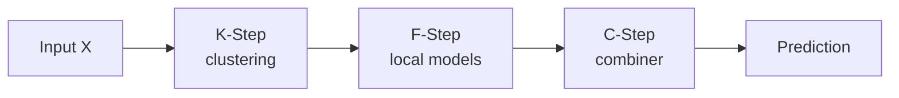

# Troubleshooting

This page collects common failures, confusing behaviors, and current
source-level limitations across the KFC Procedure and COBRA subsystems.

It is organized around symptoms such as:

```text
model does not fit
prediction contains NaN
classification probabilities fail
a combiner rejects random_state
MixCOBRA fails after as_predictions=True
results differ between runs
optimization is extremely slow
```

The explanations below follow the current package implementation.

---

## Start with the stage that failed

KFC is a three-stage pipeline:



A useful first question is:

```text
Did the failure occur in K-Step, F-Step, or C-Step?
```

For standalone COBRA estimators, use:

```text
data preparation
base estimators
prediction space
normalization
distance
kernel
aggregation
cross-validation
optimization
```

as the corresponding debugging sequence.

---

# Turn on KFC logging

`KFCProcedure` accepts:

```python
verbose=
```

with source-documented levels:

```text
0
    silent

1
    basic information

2
    detailed debugging

3
    trace-level output
```

Example:

```python
model = KFCRegressor(
    ...,
    verbose=2,
)
```

Current top-level messages include events such as:

```text
KFC fit started
Train/test split completed
Starting K-step clustering
Starting F-step training
F-step completed
Starting C-step training
C-step completed
```

This can help identify which stage is failing.

---

# Verify fitted components

After a successful KFC fit:

```python
print(
    model.kstep_
)

print(
    model.fstep_
)

print(
    model.cstep_
)
```

The top-level prediction path checks that all three exist:

```python
check_is_fitted(
    self,
    [
        "kstep_",
        "fstep_",
        "cstep_",
    ],
)
```

If prediction is called before fitting, scikit-learn's fitted-state check will
raise.

---

# Quick diagnostic checklist

Before deeper debugging, inspect:

```python
import numpy as np

print(
    X.shape,
    y.shape,
)

print(
    np.asarray(
        X
    ).dtype,
)

print(
    np.asarray(
        y
    ).dtype,
)
```

For numeric regression workflows:

```python
print(
    np.isfinite(
        X
    ).all()
)

print(
    np.isfinite(
        y
    ).all()
)
```

For classification:

```python
print(
    np.unique(
        y,
        return_counts=True,
    )
)
```

Many downstream problems are easier to diagnose after confirming basic shape,
dtype, finite-value, and class-distribution assumptions.

---

# KFC fails during the internal split

The current top-level `KFCProcedure.fit()` always runs:

```python
train_test_split(
    X,
    y,
    test_size=0.5,
    random_state=self.random_state,
    stratify=(
        y
        if self.task == "classification"
        else None
    ),
)
```

So half of the rows are assigned to:

```text
X_k / y_k
```

for K-Step and F-Step, and half to:

```text
X_l / y_l
```

for C-Step training.

---

## Classification split error

Because classification uses:

```python
stratify=y
```

scikit-learn may reject a dataset when a class has too few observations to be
split across both halves.

Inspect:

```python
np.unique(
    y,
    return_counts=True,
)
```

If a class has only a very small number of rows, the top-level stratified split
can fail before K-Step begins.

---

## Current KFC split is fixed at 50%

The current public `KFCProcedure.fit()` does not expose:

```text
test_size
split_ratio
custom splitter
X_l
y_l
```

for the top-level KFC split.

If a 50/50 split leaves too little data for cluster-specific local models, that
is a current API limitation rather than a configurable fit argument.

---

# `task must be 'regression' or 'classification'`

The constructor explicitly checks:

```python
if task not in {
    "regression",
    "classification",
}:
    raise ValueError(...)
```

Use:

```python
KFCRegressor(...)
```

or:

```python
KFCClassifier(...)
```

when possible to avoid manually setting the task string.

---

# Invalid divergence name

K-Step resolves string divergences through the divergence factory.

If a name is not registered, inspect the available names:

```python
from kfc_procedure.core.clustering.divergences import (
    BregmanDivergenceFactory,
)

print(
    BregmanDivergenceFactory.available()
)
```

Current built-ins include the documented Bregman families such as:

```text
euclidean
gkl
logistic
itakura-saito aliases
```

depending on the exact registered aliases loaded by the package.

---

# Divergence domain errors

Different Bregman divergences require different input domains.

Typical current built-in domains are:

```text
Euclidean
    real-valued input

Generalized KL
    positive input

Itakura-Saito
    positive input

Logistic
    values in (0, 1)
```

If K-Step fails while evaluating a non-Euclidean divergence, inspect the input
range:

```python
print(
    np.min(
        X
    ),
    np.max(
        X
    ),
)
```

For positivity:

```python
print(
    np.all(
        X > 0
    )
)
```

For logistic-domain data:

```python
print(
    np.all(
        (
            X > 0
        )
        &
        (
            X < 1
        )
    )
)
```

Do not silently substitute another divergence if the configured geometry is
important to the experiment.

---

# Too many clusters

K-Step ultimately fits a clustering model per divergence.

If:

```python
n_clusters
```

is too large relative to the K-Step training subset, initialization or
cluster-specific local fitting can become degenerate.

Remember that top-level KFC first keeps only approximately half the data in:

```text
X_k.
```

Inspect:

```python
print(
    model.n_clusters
)

print(
    len(
        X
    )
)
```

and account for the internal 50% split.

---

# Empty cluster reinitialization

The current Bregman clustering implementation can reinitialize empty clusters.

Therefore an empty cluster during iterative clustering does not necessarily
raise immediately.

However, very small or unstable clusters can create problems later in F-Step
when a local estimator is fitted on only a few observations.

---

# F-Step error message

F-Step wraps local model `ValueError`s and raises:

```text
[FSTEP ERROR] divergence='...', cluster=... failed.
Reason: ...
Hint: cluster contains invalid label distribution.
```

The current wrapper uses this hint for **all** `ValueError`s raised by a local
model fit.

So the real cause may be broader than label distribution.

Always read the embedded:

```text
Reason:
```

text from the original exception.

---

# A local classifier receives only one class

This is a common cluster-level classification problem.

K-Step can create a cluster whose target subset:

```python
yc
```

contains only one class.

Many classifiers cannot fit such a subset.

Inspect cluster label distributions manually:

```python
clusters = model.kstep_.clusters_

for div_name, ids in clusters.items():
    for cluster_id in np.unique(
        ids
    ):
        labels = y_k[
            ids
            ==
            cluster_id
        ]

        print(
            div_name,
            cluster_id,
            np.unique(
                labels,
                return_counts=True,
            ),
        )
```

The current KFC API does not automatically merge class-degenerate clusters
before F-Step.

---

# A local model name is invalid

F-Step checks:

```python
LocalModelFactory.contains(
    name
)
```

and raises an error listing the current factory contents.

Inspect them directly:

```python
from kfc_procedure.core.ml import (
    LocalModelFactory,
)

print(
    LocalModelFactory.available()
)
```

Scikit-learn estimator names are dynamically registered in snake_case form, so
the exact available list depends on the scikit-learn version loaded by the
package.

---

# Local model is registered for the wrong task

F-Step checks:

```python
LocalModelFactory.supports(
    name,
    self.task,
)
```

If a regression-only model is used with:

```python
KFCClassifier
```

or a classification-only model is used with:

```python
KFCRegressor
```

F-Step raises and lists models in the appropriate task category.

Inspect:

```python
print(
    LocalModelFactory.available_by_category(
        "regression"
    )
)
```

or:

```python
print(
    LocalModelFactory.available_by_category(
        "classification"
    )
)
```

---

# A typo in `local_model_params` appears to do nothing

String-based scikit-learn local models are wrapped by:

```python
SklearnLocalModel
```

which filters kwargs against the underlying estimator constructor.

Unsupported constructor keywords can therefore be silently removed by the
wrapper.

Example:

```python
local_model_params={
    "n_estimator": 100,
}
```

may not produce the expected constructor error if the real parameter is:

```text
n_estimators.
```

When a parameter seems ignored, inspect the underlying estimator constructor
and verify the exact keyword.

---

# `mean_regressor` or a custom local model rejects `random_state`

F-Step automatically injects:

```python
random_state
```

for string-based local models when that key is not already present.

For dynamically wrapped scikit-learn models, unsupported keys are filtered.

A directly registered custom local model does not necessarily have that
filtering layer.

If its constructor is:

```python
def __init__(
    self,
):
    ...
```

then the factory can fail when F-Step calls it with:

```python
random_state=...
```

A source-compatible custom constructor can accept:

```python
random_state=None
```

or:

```python
**kwargs.
```

---

# Pre-built F-Step model behaves strangely across clusters

If `local_model` is a non-string object, F-Step returns that exact object from:

```python
_resolve()
```

for every cluster.

The current source does **not** clone the object before fitting each cluster.

So the same estimator instance is repeatedly refitted.

This can lead to stored cluster entries referring to the same final object
state.

For independent cluster models, prefer a string/factory-resolved model or a
source change that clones custom objects.

---

# F-Step predictions contain `NaN`

F-Step initializes one prediction vector per divergence with:

```python
pred = np.full(
    X.shape[0],
    np.nan,
)
```

It then fills rows only for cluster IDs that have a stored fitted model.

If a query receives a cluster ID for which no model exists, that row remains:

```text
NaN.
```

Inspect:

```python
clusters = model.kstep_.predict(
    X_test
)

for div_name, ids in clusters.items():
    print(
        div_name,
        np.unique(
            ids
        )
    )

    print(
        model.fstep_.models_[
            div_name
        ].keys()
    )
```

A missing model key for a predicted cluster can explain unfilled values.

---

# String classification labels fail in F-Step prediction

F-Step creates:

```python
np.full(
    X.shape[0],
    np.nan,
)
```

which is a floating-point array.

Then it assigns:

```python
model.predict(
    X[idx]
)
```

into that array.

If the local classifier returns string labels such as:

```text
"cat"
"dog"
```

NumPy cannot place those strings into the existing float buffer.

This is a current source limitation.

A practical current-source workaround is to use numeric class encoding before
fitting KFC classification.

---

# KFC `predict_proba()` raises because F-Step has no `predict_proba`

The top-level method contains:

```python
P = self.fstep_.predict_proba(
    X,
    clusters,
)
```

but the current `FStep` class defines:

```text
fit()
predict()
_resolve()
```

and does **not** define:

```python
predict_proba().
```

Therefore current top-level:

```python
KFCClassifier.predict_proba(...)
```

is broken before reaching C-Step.

!!! warning "Current source issue"

    This is not a combiner configuration problem.

    The top-level code calls a method that is absent from the current F-Step
    implementation.

For hard class predictions, use:

```python
model.predict(
    X
)
```

with a compatible classification combiner.

A package fix would need to define how cluster-local probability matrices are
aligned and combined before the C-Step probability interface.

---

# Invalid combiner name

C-Step checks:

```python
CombinerFactory.contains(
    name
)
```

and raises with the available names.

Inspect:

```python
from kfc_procedure.core.combiner import (
    CombinerFactory,
)

print(
    CombinerFactory.available()
)
```

---

# Combiner not valid for task

C-Step also checks:

```python
CombinerFactory.supports(
    name,
    self.task,
)
```

Regression and classification combiners are separated by factory categories.

Inspect:

```python
CombinerFactory.available_by_category(
    "regression"
)
```

or:

```python
CombinerFactory.available_by_category(
    "classification"
)
```

---

# `unexpected keyword argument 'random_state'` in C-Step

This is one of the most important current source issues.

For every **string** combiner, C-Step does:

```python
params = dict(
    self.combiner_params
)

if "random_state" not in params:
    params[
        "random_state"
    ] = self.random_state
```

then:

```python
CombinerFactory.create(
    name,
    **params,
)
```

But several built-in combiner constructors do not accept `random_state`.

---

## Built-ins affected

Current examples include:

```text
MeanCombiner
    no custom __init__

WeightedMeanCombiner
    __init__(fit_intercept=False)

StackingRegressorCombiner
    __init__(meta_model=None)

MajorityVoteCombiner
    no custom __init__

StackingClassifierCombiner
    __init__(meta_model=None)
```

These string paths can therefore fail because C-Step injects an unsupported
keyword.

---

## Built-ins that accept arbitrary COBRA params

Wrappers such as:

```text
GradientCOBRACombiner
MixCOBRACombiner
CobraClassifierCombiner
```

define:

```python
__init__(
    self,
    **cobra_params,
)
```

and therefore accept the injected `random_state`.

---

# Workaround for C-Step `random_state` injection

A current-source workaround is to pass a pre-instantiated combiner object.

For example:

```python
from kfc_procedure.core.combiner.regression.mean import (
    MeanCombiner,
)

model = KFCRegressor(
    ...,
    combiner=MeanCombiner(),
)
```

C-Step contains:

```python
if not isinstance(
    self.combiner,
    str,
):
    return self.combiner
```

so pre-built objects bypass factory construction and random-state injection.

---

# Stacking classification receives numeric hard-label columns

The F-Step prediction matrix contains one hard prediction per divergence.

`StackingClassifierCombiner` uses that matrix directly as numeric meta-features.

The current combiner does not one-hot encode class-label columns before fitting
the meta-classifier.

If class codes are arbitrary numeric identifiers, their numeric magnitudes
become part of the stacking representation.

This is current behavior rather than a preprocessing step performed by the
combiner.

---

# C-Step `predict_proba()` is unsupported for most combiners

`CStep.predict_proba()` first checks:

```python
self.task == "classification"
```

then:

```python
hasattr(
    self.strategy_,
    "predict_proba"
)
```

Most simple KFC combiners do not implement a probability method.

So even after fixing the F-Step probability issue, the selected C-Step combiner
would also need a meaningful:

```python
predict_proba()
```

implementation.

---

# GradientCOBRA or CombinedClassifier rejects an estimator name

Standalone COBRA base estimators are resolved through:

```python
EstimatorFactory.
```

Inspect:

```python
from kfc_procedure.cobra.core.estimators import (
    EstimatorFactory,
)

print(
    EstimatorFactory.available()
)
```

The current estimator registry is separate from KFC's:

```python
LocalModelFactory.
```

A name available in one registry is not automatically guaranteed to be
registered in the other.

---

# `estimators_params` appears ignored

The shared `fit_estimators()` helper handles string specifications with:

```python
estimators_params.get(
    est_spec,
    {}
)
```

So the parameter dictionary is keyed by estimator name.

Example:

```python
estimators=[
    "random_forest_regressor",
]

estimators_params={
    "random_forest_regressor": {
        "n_estimators": 300,
        "random_state": 42,
    },
}
```

A flat dictionary such as:

```python
estimators_params={
    "n_estimators": 300,
}
```

is not the form used by `fit_estimators()` for the normal estimator-pool path.

---

# Parent COBRA `random_state` does not seed every base estimator

The shared estimator helper does not automatically inject:

```python
model.random_state
```

into every base estimator.

If a stochastic estimator needs a stable seed, configure it in:

```python
estimators_params
```

or in a tuple specification.

Example:

```python
estimators=[
    (
        "random_forest_regressor",
        {
            "random_state": 42,
        },
    ),
]
```

---

# `Both 'X_l' and 'y_l' must be provided together`

The shared COBRA resolver explicitly rejects one-sided calibration input.

Invalid:

```python
model.fit(
    X,
    y,
    X_l=X_cal,
)
```

Valid:

```python
model.fit(
    X,
    y,
    X_l=X_cal,
    y_l=y_cal,
)
```

See:

[Custom Aggregation Data](advanced/custom-aggregation-data.md)

---

# `as_predictions=True` ignores explicit `X_l/y_l`

The shared resolver checks:

```python
if as_predictions:
    ...
    return
```

before explicit calibration data.

So:

```python
model.fit(
    P,
    y,
    X_l=X_cal,
    y_l=y_cal,
    as_predictions=True,
)
```

uses:

```text
P / y
```

as the precomputed calibration representation and does not activate the
explicit `X_l/y_l` branch.

Choose one mode deliberately.

---

# MixCOBRA `pred_features` does not behave like direct prediction space

The current resolver can place:

```python
pred_features
```

into:

```text
X_l
```

while leaving:

```python
as_predictions=False.
```

MixCOBRA then fits its base estimators and calls:

```python
_load_predictions(
    self.X_l_
)
```

which means the supplied `pred_features` matrix can be fed back into the fitted
base estimators.

That is not the same as:

```python
prediction_space = pred_features.
```

For a matrix that is already prediction space, prefer:

```python
as_predictions=True
```

while accounting for the MixCOBRA prediction caveat below.

---

# MixCOBRA fails after `fit(..., as_predictions=True)`

This is a current fit/predict asymmetry.

During fit:

```python
if not self.as_predictions_:
    self.estimators_ = ...
else:
    prediction_space = self.X_l_
```

so no:

```python
estimators_
```

are created.

But current `predict()` starts with:

```python
if pred_X is None:
    pred_X = self._load_predictions(
        X
    )
```

without checking:

```python
self.as_predictions_.
```

So:

```python
model.predict(
    P_test
)
```

can try to use an estimator pool that was never fitted.

---

## Current-source workaround for precomputed MixCOBRA

The prediction signature accepts:

```python
pred_X=
```

To mirror the current precomputed fit geometry, use:

```python
model.predict(
    P_test,
    pred_X=P_test,
)
```

This causes the supplied matrix to be used for both current MixCOBRA spaces.

This workaround follows the implementation; it is not a dedicated documented
high-level precomputed MixCOBRA API.

---

# KFC with `combiner="mixcobra"` can fail at prediction

The KFC MixCOBRA wrapper fits its underlying estimator with:

```python
as_predictions=True
```

and later calls:

```python
self.cobra.predict(
    X
)
```

without supplying:

```python
pred_X=X.
```

That wrapper therefore inherits the same current MixCOBRA precomputed-predict
asymmetry.

If this path fails due to missing internal estimators, the issue is in the
current wrapper/underlying API interaction rather than in the F-Step prediction
matrix itself.

---

# CombinedClassifier `predict_proba()` seems identical for every query

The default classifier aggregator is:

```text
weighted_vote.
```

Its current:

```python
aggregate_proba()
```

implementation builds one-hot labels and returns:

```python
one_hot.mean(
    axis=0
)
```

It does **not** use the supplied:

```python
weights
```

argument.

Therefore, for positive-weight queries, default probability rows are based on
the unweighted class frequency in the calibration labels.

This can make probabilities appear identical across many queries.

---

## Hard predictions still use weights

`WeightedVoteAggregator.aggregate()` does use:

```python
scores = W @ one_hot
```

for hard classification.

So current:

```text
predict()
```

and:

```text
predict_proba()
```

have different weighting behavior under the default classifier aggregator.

See:

[Aggregators](cobra/aggregators.md)

---

# CombinedClassifier default loss is MSE

The current constructor default is:

```python
loss="mse"
```

even for classification.

During bandwidth cross-validation, CombinedClassifier generates hard class
predictions and passes them into the configured loss.

If class labels are:

```text
0
1
2
```

MSE treats:

```text
0 -> 2
```

as a larger error than:

```text
0 -> 1.
```

This is exact current behavior.

---

# CombinedClassifier fails with string labels and default loss

The default `MSELoss` evaluates:

```python
(
    y_true
    -
    y_pred
) ** 2
```

String labels cannot be subtracted.

Therefore a CombinedClassifier using default MSE can fail when class labels are
strings.

A current-source workaround is numeric label encoding or configuring a loss
whose implemented formula is compatible with the representation being passed.

Remember that current CombinedClassifier CV passes **hard labels**, not
probability vectors or decision margins.

---

# `log_loss` is not receiving probabilities during CombinedClassifier CV

The built-in `LogLoss` implements binary cross-entropy and clips its `y_pred`
argument.

But CombinedClassifier's CV loop produces hard class labels before calling the
loss.

So selecting:

```python
loss="log_loss"
```

does not make the CV objective use:

```python
predict_proba().
```

This is a current integration limitation.

---

# `hinge` does not convert labels

The built-in Hinge loss assumes:

```text
y_true in {-1, +1}.
```

It does not convert:

```text
0/1
```

labels or turn hard classifier outputs into margins.

If configured in CombinedClassifier, the current CV path passes its hard labels
directly into the formula.

---

# `predict_proba()` with zero kernel weight

CombinedClassifier checks:

```python
if np.sum(
    w
) <= 0:
```

and returns a one-hot probability vector for:

```python
global_majority_class_.
```

For positive-weight rows, it calls the current aggregator probability method.

So a model can show two noticeably different probability behaviors:

```text
zero/non-positive weight
    -> one-hot majority class

positive weight
    -> current aggregate_proba behavior.
```

---

# Regression prediction falls back to a global mean

GradientCOBRA and MixCOBRA pass:

```python
fallback=self.global_mean_
```

to the weighted-mean aggregator during final prediction.

If a kernel row has total weight near zero, the output can equal the global
calibration mean.

This is expected current behavior, especially with compact kernels or extreme
distance scaling.

---

# Many predictions equal the global mean

Check the kernel row sums.

Conceptually:

```python
row_sums = np.sum(
    K,
    axis=1,
)

print(
    row_sums
)
```

If many sums are approximately zero, the weighted mean aggregator uses its
fallback.

Possible current-source causes include:

```text
very narrow effective kernel neighborhood
large adapted distances
compact kernel support
unusual normalization scale
gradient optimizer producing extreme parameters.
```

---

# RBF bandwidth behaves opposite to a `D / h` convention

The one-parameter adapter implements:

\[
D' = hD.
\]

The default RBF kernel implements:

\[
K=e^{-D'}.
\]

Therefore:

\[
K=e^{-hD}.
\]

Larger `bandwidth` values make similarity decay **faster** in this package.

If increasing bandwidth makes the model use fewer effective neighbors, that is
consistent with the current implementation.

---

# Compact kernels suddenly produce all-zero weights

Current compact kernels use support conditions such as:

```python
D < 1
```

after adapter transformation.

With one-parameter scaling:

\[
hD < 1.
\]

Therefore a larger `h` can push more distances outside support and produce zero
weights.

This can trigger regression global-mean fallback or classification
global-majority fallback.

---

# The `naive` kernel gives larger distances larger weights

The current `NaiveKernel` returns:

```python
D
```

unchanged.

It does not invert the distance into a similarity.

Therefore, if used as aggregation weights, larger distance values receive
larger numeric weight.

This is current source behavior.

Use it only if that behavior is actually intended for the experiment.

---

# `kernel_params={"gamma": ...}` does not affect RBF

The current radial/RBF kernel is:

```python
np.exp(
    -D
)
```

and does not define:

```text
gamma
sigma
bandwidth
```

constructor parameters.

Bandwidth-like scaling is performed by the kernel adapter, not the RBF kernel
class itself.

Unsupported parameters passed to `KernelFactory.create()` can raise a
constructor error.

---

# Gradient optimization silently changes to grid for some kernels

GradientCOBRA and MixCOBRA check:

```python
kernel_.requires_grad.
```

If:

```python
opt_method="grad"
```

but the kernel advertises:

```python
requires_grad=False,
```

the local effective method is changed to:

```text
grid.
```

This applies to current compact/discrete kernels.

---

# MixCOBRA reports `grad` even after grid fallback

GradientCOBRA records the effective optimization method.

MixCOBRA currently stores:

```python
"method": self.opt_method
```

in:

```python
optimization_outputs_.
```

So a non-gradient kernel can force the actual path to grid while the stored
MixCOBRA summary still says:

```text
grad.
```

Inspect the configured kernel and optimizer object when debugging this case.

---

# Gradient optimization produces negative bandwidth / alpha / beta

The current gradient base optimizer is unconstrained.

There is no projection such as:

```python
x = np.maximum(
    x,
    0.0,
)
```

after each update.

Therefore:

```text
bandwidth
alpha
beta
```

can become negative.

This can produce unusual adapted distances and kernel weights.

Grid search avoids this with its default positive candidate ranges:

```text
0.001 to 10.0.
```

---

# Gradient optimization diverges

Inspect:

```python
history = model.optimization_outputs_[
    "history"
]

print(
    history[
        [
            "iter",
            "score",
            "grad_norm",
            "lr",
        ]
    ]
)
```

The current non-constant learning-rate schedules are increasing formulas.

For example:

```text
linear
    t * r0

log
    log(1+t) * r0

sqrt_root
    sqrt(1+t) * r0

quad
    (1+t^2) * r0

exp
    exp(t) * r0
```

They are not decay schedules.

For a conservative debugging configuration, use:

```python
speed="constant"
```

and a smaller:

```python
learning_rate.
```

---

# `speed="linear"` does nothing on the first iteration

The current formula is:

\[
\eta_t=t r_0.
\]

At:

```text
t = 0
```

the scheduled multiplier is:

```text
0.
```

So the first update does not move the parameter vector.

This is exact current behavior.

---

# Unknown gradient `speed` does not raise

The current scheduler uses:

```python
schedules.get(
    self.speed,
    schedules[
        "constant"
    ],
)
```

An unknown name silently falls back to:

```text
constant
```

rather than raising an error.

If a custom schedule name appears to be ignored, check for a spelling error.

---

# SPSA gives different results despite fixed `random_state`

The SPSA helper samples:

```python
np.random.choice(
    [-1.0, 1.0],
    ...
)
```

from NumPy's global RNG.

It does not receive the model's:

```python
random_state.
```

Therefore:

```python
random_state=42
```

on GradientCOBRA or MixCOBRA does not fully control:

```python
gradient_method="spsa".
```

See:

[Reproducibility](advanced/reproducibility.md)

---

# `evaluations` is smaller than the real number of objective calls

For gradient optimizers, high-level models store:

```python
"evaluations": len(
    result[
        "history"
    ]
)
```

But numerical gradients can call the objective several times per iteration.

Central differences require approximately:

\[
2d
\]

objective calls per gradient calculation, plus additional score evaluations.

So `evaluations` is a recorded-iteration count rather than the true number of
cross-validation objective calls.

---

# Final gradient step is missing from history

The current gradient optimizer checks:

```python
if np.linalg.norm(
    grad_new
) < self.tol:
    x = x_new
    break
```

before appending that iteration to history.

Therefore a terminating step can become:

```text
best_x / best_score
```

without appearing as the final history row.

---

# Grid search is unexpectedly slow

For one parameter with:

```python
max_iter=300,
```

the default grid normally has 300 candidates.

For two-parameter MixCOBRA with default:

```text
300 alpha values
300 beta values
```

the grid is the full Cartesian product:

\[
300\times300
=
90{,}000
\]

candidates.

With five CV folds, that implies a very large number of fold-level evaluations.

Reduce:

```python
max_iter
```

or provide smaller:

```python
alpha_list
beta_list.
```

---

# `n_jobs=-1` does not parallelize grid search

Current COBRA `n_jobs` parallelizes the **base-estimator pool** during fitting
and prediction-space generation.

It does not parallelize:

```text
grid candidates
CV folds
kernel transformations
aggregator calls.
```

So a large MixCOBRA grid can remain slow even with:

```python
n_jobs=-1.
```

---

# `gradient_method="parallel"` is independent of model `n_jobs`

Parallel numerical gradients use a separate Joblib path.

The standard gradient optimizer does not forward:

```python
model.n_jobs
```

into that helper.

So:

```text
base-estimator n_jobs
```

and:

```text
parallel-gradient worker count
```

are independent current mechanisms.

---

# Parallel execution fails with a custom estimator

For:

```python
n_jobs != 1
```

the shared estimator helper uses:

```python
Parallel(
    n_jobs=n_jobs,
    backend="loky",
)
```

for fit and prediction tasks.

A custom/pre-built estimator must therefore be usable through that worker
process path.

A useful debugging step is:

```python
n_jobs=1
```

If the same estimator works sequentially but not with Joblib, the problem is
likely related to the parallel execution path or object serialization rather
than the estimator's basic fit/predict contract.

---

# Results change when switching `n_jobs`

The package itself preserves estimator-list ordering when column-stacking
prediction vectors.

However, underlying models or numerical libraries can have their own
concurrency behavior.

For the most controlled reproducibility diagnosis:

```python
n_jobs=1
```

and explicitly seed stochastic base estimators.

---

# Results differ despite fixed COBRA `random_state`

The parent standalone COBRA seed controls structural components such as:

```text
automatic split
KFoldCV.
```

It does not automatically inject that seed into every stochastic base
estimator.

Configure estimator-specific seeds through:

```python
estimators_params
```

or tuple specifications.

---

# Results differ despite fixed KFC `random_state`

KFC does inject the seed into string F-Step local models when the parameter is
absent, subject to constructor filtering/compatibility.

But reproducibility can still depend on:

```text
input order
divergence order
cluster initialization
combiner behavior
custom pre-built objects
parallel numerical libraries.
```

Compare intermediate stages rather than only final predictions.

---

# Debug reproducibility stage by stage

For standalone COBRA, compare:

```text
1. X_k_ / y_k_
2. X_l_ / y_l_
3. prediction space
4. normalization constants
5. distance matrices
6. cv_folds_
7. optimization history
8. selected parameters
9. final predictions.
```

For KFC, compare:

```text
1. K-Step cluster assignments
2. F-Step model structure
3. F-Step prediction matrix
4. C-Step output.
```

---

# KFold has empty validation folds

The current custom `KFoldCV` does not comprehensively validate:

```python
n_splits <= n_samples.
```

If:

```python
n_cv
```

is larger than the calibration sample count, some round-robin folds can be
empty.

Reduce `n_cv` or use a larger calibration set.

---

# `n_cv=1` can fail

The current KFold implementation constructs each training set by concatenating
all folds except the validation fold.

With only one fold, that becomes an empty list passed to:

```python
np.concatenate(...)
```

which can fail through NumPy.

Use at least two folds, with enough calibration rows for meaningful
cross-validation.

---

# Classification CV is not stratified

Although a registered:

```text
StratifiedKFoldCV
```

exists, the main:

```text
GradientCOBRA
MixCOBRARegressor
CombinedClassifier
```

component resolution currently constructs:

```text
kfold
```

internally.

CombinedClassifier therefore does not automatically preserve class proportions
within bandwidth CV folds.

---

# Explicit chronological calibration data still gets shuffled KFold CV

Providing chronological:

```text
X_l / y_l
```

bypasses the first-level automatic splitter, but the main high-level estimator
still creates its normal shuffled KFold CV.

The current constructors do not expose a `cv=` selector.

So explicit chronological calibration data alone does not make optimization
time-series-aware.

---

# Normalization constant is unexpectedly large

The helper computes:

\[
c
=
\frac{s}
{(\max|x|+10^{-12})M}.
\]

If:

```text
max(abs(x))
```

is close to zero, the returned constant can become very large.

Inspect:

```python
print(
    model.normalize_constant_
)
```

or for MixCOBRA:

```python
print(
    model.normalize_constant_x_,
    model.normalize_constant_y_,
)
```

---

# `norm_constant` is not the final multiplier

In the current helper, `norm_constant` replaces the default numerator.

The final multiplier is still divided by:

```text
max absolute magnitude
× prediction width M.
```

So:

```python
norm_constant=2.0
```

does **not** mean:

```text
multiply prediction space by exactly 2.
```

See:

[Normalization](cobra/normalization.md)

---

# MixCOBRA normalization uses training-side X/y with explicit calibration data

If you fit:

```python
model.fit(
    X_train,
    y_train,
    X_l=X_cal,
    y_l=y_cal,
)
```

current MixCOBRA computes its normalization constants from:

```text
X_train
y_train
```

and applies them to the calibration spaces.

If scaling appears surprising, inspect both the training-side magnitudes and
the stored calibration representations.

---

# Standard/MinMax normalizers do not affect the main estimators

The package contains:

```text
StandardNormalizer
MinMaxNormalizer
NormalizerFactory
```

but current GradientCOBRA, MixCOBRA, and CombinedClassifier do not resolve them
during ordinary fitting.

Changing or registering a normalizer will not automatically alter those
high-level models.

---

# MinMax transformed values exceed 1

`MinMaxNormalizer.transform()` does not clip new values.

It computes:

\[
\frac{x-\min}
{\max-\min+10^{-12}}.
\]

A query above the fitted maximum can therefore produce a value greater than
`1`, and a query below the fitted minimum can produce a negative value.

This is expected current behavior.

---

# Standard/MinMax transform called before fit

The current normalizer classes do not call a fitted-state validator.

Attributes such as:

```text
mean_
std_
min_
max_
```

begin as `None`.

Calling `transform()` before `fit()` therefore fails through ordinary numeric
operations rather than a package-specific `NotFittedError`.

---

# Distance matrix has unexpected values

Inspect the configured distance:

```python
print(
    model.distance
)

print(
    model.distance_
)
```

Current defaults:

```text
GradientCOBRA
    euclidean

MixCOBRARegressor
    euclidean

CombinedClassifier
    hamming.
```

---

# Hamming distance looks wrong for continuous regression predictions

Hamming distance computes the fraction of coordinates that differ exactly.

It is intended for discrete/binary/categorical-style prediction vectors.

For continuous regression prediction space, use a continuous geometry such as
Euclidean unless exact equality mismatch is intentionally desired.

---

# Cosine distance with zero vectors

Current cosine distance uses a denominator stabilized with:

```text
1e-12.
```

This prevents direct division by zero but does not impose a separate semantic
definition for missing/invalid vectors.

Inspect zero-norm rows if cosine geometry behaves unexpectedly.

---

# Distances propagate NaN

The distance layer does not provide one shared sanitization stage for:

```text
NaN
Inf.
```

If an upstream prediction matrix contains non-finite values, distance matrices
can also become non-finite.

Always inspect prediction space before blaming the kernel:

```python
print(
    np.isfinite(
        prediction_space
    ).all()
)
```

---

# WeightedMeanAggregator returns fallback

Its single-query implementation converts non-finite weights to zero:

```python
np.nan_to_num(
    W,
    nan=0.0,
    posinf=0.0,
    neginf=0.0,
)
```

and checks:

```python
np.isclose(
    np.sum(
        W
    ),
    0.0,
)
```

If true, it returns the supplied fallback.

So a prediction equal to the global mean can be caused by non-finite weights
being zeroed as well as by truly zero kernel weights.

---

# WeightedVoteAggregator behaves differently in batch and single-query mode

Single-query:

```python
aggregate()
```

filters non-finite weights using:

```python
np.isfinite.
```

Batch:

```python
aggregate_matrix()
```

does not perform the same filtering before matrix multiplication.

So non-finite weights can lead to different failure behavior depending on which
API path is used.

---

# All weighted-vote weights are non-finite

The single-query method checks that `values` are non-empty **before** filtering
non-finite weights.

If every weight is removed by:

```python
np.isfinite
```

the filtered label array becomes empty afterward.

The source does not perform a second empty check before class scoring.

This can lead to a later NumPy error.

---

# Wrong factory component parameters

Most factories call constructors directly:

```python
target_cls(
    **kwargs
)
```

and do not filter unsupported keys.

If you see:

```text
unexpected keyword argument
```

inspect the exact constructor for the selected component.

The main exception is KFC's `SklearnLocalModel`, which performs signature
filtering internally.

---

# Registered extension is not found

Registration decorators run when their Python module is imported.

If you define:

```python
@KernelFactory.register(
    "my_kernel"
)
class MyKernel(...):
    ...
```

but never import the module containing that code, the registration does not
exist in the current process.

Import the extension module before creating the model.

---

# Duplicate registration error

Factory names are normalized by stripping and lowercasing.

So:

```text
"MyKernel"
"mykernel"
```

collide in the same factory.

The source raises rather than silently replacing an existing registration.

Inspect:

```python
Factory.available()
```

before adding an extension with a common name.

---

# A lower-level extension registers successfully but cannot be selected

Not every registry is exposed by the current high-level constructors.

Current examples include:

```text
custom normalizer
custom splitter selector
custom CV selector
custom kernel adapter selector.
```

The factory may create these components correctly while the main estimator
still hard-codes another component.

See:

[Extending KFC Procedure](advanced/extending-kfc-procedure.md)

---

# Custom splitter is registered but unused

`resolve_training_context()` accepts a:

```python
splitter
```

argument internally.

But the current high-level fit signatures do not expose a general
`splitter=` parameter.

A registered splitter therefore requires lower-level use, an estimator source
extension, or manual creation of explicit:

```python
X_l / y_l
```

data.

---

# Custom CV is registered but unused

The main standalone COBRA estimators currently create:

```text
kfold
```

internally.

They expose:

```python
n_cv
```

but not:

```python
cv=
cv_params=.
```

So a new `CVFactory` entry does not automatically become selectable from the
public constructor.

---

# Import path confusion between KFC and COBRA estimator factories

There are separate estimator concepts:

```text
KFC F-Step local models
    LocalModelFactory

COBRA base estimator pool
    EstimatorFactory.
```

A model registered in one is not automatically visible in the other.

When debugging an "unknown estimator" error, first identify which subsystem is
resolving the name.

---

# Prediction matrix has unexpected number of columns

For F-Step, one output column is produced per divergence entry stored in:

```python
self.models_.
```

For standalone COBRA estimator pools, one prediction-space column is produced
per fitted estimator in the pool.

Inspect:

```python
print(
    P.shape
)
```

and compare with:

```text
number of divergences
```

or:

```text
number of estimators
```

depending on the subsystem.

---

# Prediction columns are in the wrong semantic order

The package preserves configured sequence order, but it does not store external
semantic metadata for every matrix column.

For precomputed prediction matrices, ensure training and query matrices use the
same source ordering.

Example:

```text
training
    [ridge, random_forest, svr]

test
    [svr, ridge, random_forest]
```

has compatible shape but incorrect geometry.

---

# Precomputed prediction width mismatch

For:

```python
as_predictions=True
```

training and query rows should have the same number of coordinates.

Check:

```python
assert (
    P_train.shape[1]
    ==
    P_test.shape[1]
)
```

A mismatch normally fails later during distance calculation.

---

# `n_jobs=0` or another invalid value fails in Joblib

The package does not validate `n_jobs` beyond checking:

```python
if n_jobs == 1:
```

for the sequential branch.

Every other value is forwarded to:

```python
joblib.Parallel.
```

So unsupported values fail according to Joblib behavior.

Use:

```text
1
```

for sequential execution or a valid Joblib worker setting such as:

```text
-1
```

when appropriate.

---

# MkDocs code example import errors

The package exposes many classes through package-level `__init__.py` modules,
but some advanced examples may use deeper import paths.

If a documentation example fails because a symbol is not exported from the
expected namespace, inspect the actual package `__init__.py` for that version.

The source files remain the authoritative location for the current import
surface.

---

# A fitted model works in one environment but not another

Several registries dynamically expose scikit-learn estimator names, and the
project depends on NumPy, SciPy, scikit-learn, Joblib, Numba, and pandas.

Different dependency versions can affect:

```text
available estimator names
constructor signatures
numerical behavior
serialization
parallel execution.
```

Record the environment for reproducible debugging.

---

# Recommended diagnostic sequence for KFC

Use this order:

```text
1. validate X/y shape and dtype
2. verify the 50/50 split is feasible
3. validate divergence domains
4. inspect K-Step cluster counts
5. inspect per-cluster y distributions
6. verify local-model registry/task compatibility
7. inspect F-Step NaN/string-label behavior
8. inspect the F-Step prediction matrix
9. verify combiner registry/task compatibility
10. check C-Step random_state constructor compatibility
11. inspect final prediction.
```

---

# Inspect K-Step cluster counts

After K-Step fit:

```python
for div_name, cluster_ids in (
    model
    .kstep_
    .clusters_
    .items()
):
    values, counts = np.unique(
        cluster_ids,
        return_counts=True,
    )

    print(
        div_name,
        dict(
            zip(
                values,
                counts,
            )
        ),
    )
```

Very small clusters are often the first clue when F-Step classifiers fail.

---

# Inspect F-Step model registry

```python
for div_name, models in (
    model
    .fstep_
    .models_
    .items()
):
    print(
        div_name
    )

    for key, meta in models.items():
        print(
            key,
            meta[
                "cluster"
            ],
            type(
                meta[
                    "model"
                ]
            ).__name__,
        )
```

---

# Rebuild the F-Step prediction matrix manually

```python
clusters = model.kstep_.predict(
    X_test
)

P = model.fstep_.predict(
    X_test,
    clusters,
)

print(
    P.shape
)

print(
    np.isnan(
        P
    ).sum()
)
```

This isolates F-Step from C-Step.

---

# Test C-Step separately

```python
y_combined = model.cstep_.predict(
    P
)
```

If F-Step output is valid but this fails, focus on the selected combiner.

---

# Recommended diagnostic sequence for standalone COBRA

Use:

```text
1. inspect resolved X_k/X_l
2. verify estimator pool
3. generate calibration prediction space
4. inspect normalization constants
5. inspect distance matrix
6. inspect CV folds
7. evaluate one objective candidate
8. inspect optimizer history
9. inspect kernel row sums on test queries
10. reproduce one aggregator call.
```

---

# Inspect resolved training context

After fitting:

```python
print(
    model.X_k_.shape
    if model.X_k_ is not None
    else None
)

print(
    model.X_l_.shape
)
```

For precomputed mode:

```python
print(
    model.as_predictions_
)
```

---

# Inspect the base estimator pool

```python
if hasattr(
    model,
    "estimators_",
):
    for est in model.estimators_:
        print(
            type(
                est
            ).__name__
        )
```

No estimator pool is expected in a clean precomputed GradientCOBRA or
CombinedClassifier fit.

---

# Inspect distance matrix

GradientCOBRA:

```python
print(
    model.distance_matrix_.shape
)

print(
    np.isfinite(
        model.distance_matrix_
    ).all()
)
```

MixCOBRA may expose separate:

```text
distance_matrix_x_
distance_matrix_y_
```

or a mixed matrix depending on mode.

---

# Inspect CV folds

```python
for fold in model.cv_folds_:
    print(
        fold.fold_id,
        len(
            fold.train_idx
        ),
        len(
            fold.eval_idx
        ),
    )
```

Look for:

```text
empty folds
very small validation folds
unexpected fold count.
```

---

# Evaluate one GradientCOBRA candidate

For a fitted GradientCOBRA model:

```python
score = (
    model
    .kappa_cross_validation_error(
        [
            1.0
        ]
    )
)

print(
    score
)
```

If this is already non-finite, the optimizer is not the root cause.

Debug the distance/kernel/aggregation/loss path first.

---

# Inspect optimizer history

```python
history = (
    model
    .optimization_outputs_[
        "history"
    ]
)

print(
    history.head()
)

print(
    history.tail()
)
```

Look for:

```text
NaN scores
exploding gradient norms
negative parameters
flat identical scores.
```

---

# Reproduce one weighted regression prediction

Given a query kernel row:

```python
prediction = model.aggregator_.aggregate(
    values=model.y_l_,
    weights=w,
    fallback=model.global_mean_,
)
```

Check:

```python
print(
    np.sum(
        w
    )
)
```

to determine whether a fallback is expected.

---

# Reproduce one weighted classification prediction

```python
prediction = (
    classifier
    .aggregator_
    .aggregate(
        classifier.y_l_,
        w,
    )
)
```

If:

```python
np.sum(
    w
) <= 0:
```

the high-level CombinedClassifier normally bypasses the aggregator and returns:

```python
global_majority_class_.
```

---

# Known current-source issues

The following are implementation limitations visible in the current source.

| Area | Current behavior |
| --- | --- |
| KFC `predict_proba()` | calls missing `FStep.predict_proba()` |
| C-Step string combiners | inject `random_state` into constructors that may not accept it |
| F-Step custom object | same model instance reused across clusters |
| F-Step prediction buffer | float `NaN` array, problematic for string labels |
| MixCOBRA precomputed fit/predict | `predict()` does not honor `as_predictions_` automatically |
| KFC MixCOBRA wrapper | inherits MixCOBRA precomputed prediction issue |
| MixCOBRA `pred_features` | current fit path still feeds it through base estimators |
| WeightedVote `aggregate_proba()` | ignores kernel weights |
| WeightedVote batch vs single | non-finite weight handling differs |
| CombinedClassifier default loss | MSE on hard class labels |
| classification CV | ordinary KFold, not stratified |
| custom high-level CV selector | not exposed |
| custom high-level splitter selector | not exposed |
| reusable normalizers | not wired into main COBRA estimators |
| gradient parameters | unconstrained |
| SPSA random state | uses global NumPy RNG |
| MixCOBRA optimization reporting | can report configured `grad` after grid fallback |
| grid-search parallelism | not controlled by estimator `n_jobs` |

---

# When to use a workaround vs modify the source

Some issues can be handled through current public configuration.

Examples:

```text
C-Step random_state injection
    -> use a pre-built combiner object

small/imbalanced calibration split
    -> prepare X_l/y_l explicitly for standalone COBRA

stochastic base estimator
    -> pass estimator-specific random_state

large MixCOBRA grid
    -> provide smaller alpha/beta lists

precomputed GradientCOBRA
    -> use as_predictions=True.
```

Other problems require a source fix for a clean API.

Examples:

```text
KFC predict_proba missing F-Step method
MixCOBRA as_predictions predict asymmetry
weighted-vote probability weights ignored
general custom CV selection in high-level estimators
general custom splitter selection in high-level estimators.
```

---

# Minimal reproducible bug report

When reporting a package issue, include:

```text
kfc_procedure version / source revision
Python version
NumPy version
scikit-learn version
task type
small X/y shape and dtype description
exact estimator configuration
full traceback
whether n_jobs=1 changes the behavior
whether random_state is fixed.
```

For KFC, also include:

```text
divergences
n_clusters
local_model
combiner.
```

For COBRA, include:

```text
distance
kernel
aggregator
loss
optimizer
opt_method
n_cv.
```

---

# Useful registry diagnostics

```python
from kfc_procedure.core.ml import (
    LocalModelFactory,
)

from kfc_procedure.core.combiner import (
    CombinerFactory,
)

from kfc_procedure.cobra.core.estimators import (
    EstimatorFactory,
)

from kfc_procedure.cobra.core.distances import (
    DistanceFactory,
)

from kfc_procedure.cobra.core.kernels import (
    KernelFactory,
)

from kfc_procedure.cobra.core.aggregators import (
    AggregatorFactory,
)

from kfc_procedure.cobra.core.losses import (
    LossFactory,
)

from kfc_procedure.cobra.core.optimizers import (
    OptimizerFactory,
)
```

Then:

```python
print(
    LocalModelFactory.available()
)

print(
    CombinerFactory.available()
)

print(
    EstimatorFactory.available()
)

print(
    DistanceFactory.available()
)

print(
    KernelFactory.available()
)

print(
    AggregatorFactory.available()
)

print(
    LossFactory.available()
)

print(
    OptimizerFactory.available()
)
```

This is often faster than guessing a registry name.

---

# Useful fitted-state diagnostics

KFC:

```python
print(
    model.kstep_
)

print(
    model.fstep_.models_
)

print(
    model.cstep_.strategy_
)
```

GradientCOBRA:

```python
print(
    model.estimators_
    if hasattr(
        model,
        "estimators_",
    )
    else None
)

print(
    model.normalize_constant_
)

print(
    model.bandwidth_
)

print(
    model.optimization_outputs_
)
```

MixCOBRA:

```python
print(
    model.normalize_constant_x_
)

print(
    model.normalize_constant_y_
)

print(
    model.optimization_outputs_
)
```

CombinedClassifier:

```python
print(
    model.classes_
)

print(
    model.global_majority_class_
)

print(
    model.bandwidth_
)
```

---

# If you still cannot isolate the problem

Reduce the configuration to the smallest working pipeline.

For example, use:

```text
one divergence
few clusters
simple deterministic local model
simple combiner
n_jobs=1
fixed random_state.
```

For COBRA:

```text
small estimator pool
euclidean distance
rbf kernel
default aggregator
mse loss
small bandwidth grid
n_cv=2 or 3
n_jobs=1.
```

Then add complexity one component at a time.

This matches the package's modular architecture and helps identify the exact
factory component or stage introducing the failure.

---

# Mental model

!!! quote ""

    **Troubleshoot KFC Procedure by locating the first stage whose output is
    invalid, then debug that component in isolation rather than treating the
    whole pipeline as one black box.**

For KFC:

\[
\boxed{
X
\rightarrow
K
\rightarrow
F
\rightarrow
C
\rightarrow
\widehat y
}
\]

For COBRA:

\[
\boxed{
\text{data}
\rightarrow
\text{prediction space}
\rightarrow
\text{distance}
\rightarrow
\text{kernel}
\rightarrow
\text{aggregator}
\rightarrow
\text{loss/optimization}
}
\]

The current source is highly modular, which makes stage-by-stage diagnostics
especially effective.

---

## Related guides

<div class="grid cards" markdown>

-   :material-cog-outline:{ .lg .middle } **Inspect Fitted Models**

    ---

    Inspect K-Step, F-Step, and C-Step state after fitting.

    [:octicons-arrow-right-24: Inspect Fitted Models](kfc/inspecting-fitted-models.md)

-   :material-database-arrow-right-outline:{ .lg .middle } **Precomputed Predictions**

    ---

    Diagnose `as_predictions=True` workflows and the current MixCOBRA caveat.

    [:octicons-arrow-right-24: Precomputed Predictions](advanced/precomputed-predictions.md)

-   :material-repeat:{ .lg .middle } **Reproducibility**

    ---

    Trace random-state propagation and identify uncontrolled stochastic
    components.

    [:octicons-arrow-right-24: Reproducibility](advanced/reproducibility.md)

-   :material-source-branch:{ .lg .middle } **Cross-validation**

    ---

    Inspect fold construction when optimization fails or produces unstable
    results.

    [:octicons-arrow-right-24: Cross-validation](cobra/cross-validation.md)

</div>
